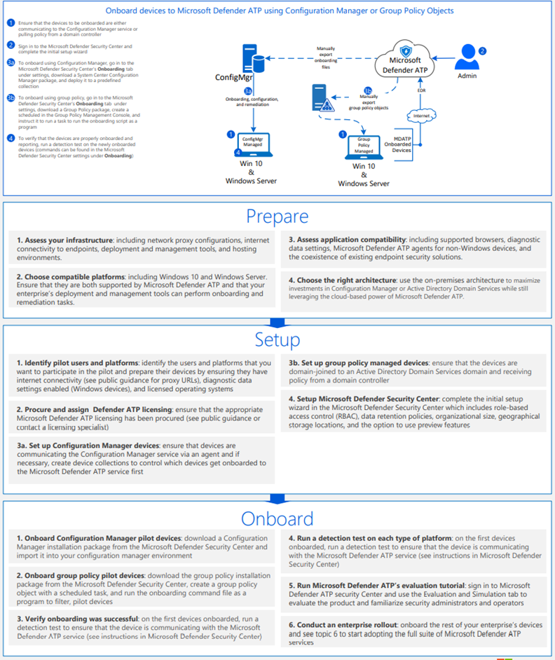
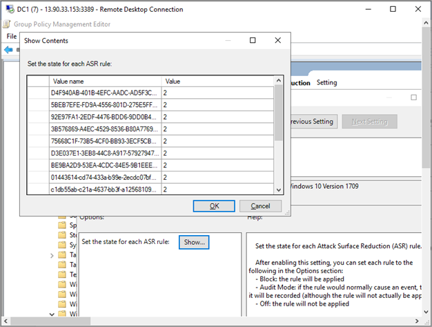

# Onboarding der Windows 10-Geräte mithilfe von GruppenrichtlinienOnboard the Windows 10 devices using Group Policy 

[!INCLUDE [Microsoft 365 Defender rebranding](../../includes/microsoft-defender.md)]

**Gilt für:****Applies to:**

- GruppenrichtlinieGroup Policy
- [Microsoft Defender für EndpunktMicrosoft Defender for Endpoint](https://go.microsoft.com/fwlink/p/?linkid=2154037)
- [Microsoft 365 DefenderMicrosoft 365 Defender](https://go.microsoft.com/fwlink/?linkid=2118804)

>Möchten Sie Defender für Endpunkt erfahren?Want to experience Defender for Endpoint? [Registrieren Sie sich für eine kostenlose TestversionSign up for a free trial.](https://www.microsoft.com/microsoft-365/windows/microsoft-defender-atp?ocid=docs-wdatp-configureendpointsgp-abovefoldlink)

> [!NOTE]
> Um Gruppenrichtlinienupdates zum Bereitstellen des Pakets zu verwenden, müssen Sie sich auf Windows Server 2008 R2 oder höher befinden.To use Group Policy (GP) updates to deploy the package, you must be on Windows Server 2008 R2 or later.
>
> Für Windows Server 2019 müssen Sie möglicherweise NT AUTHORITY\Well-Known-System-Account durch NT AUTHORITY\SYSTEM der XML-Datei ersetzen, die von der Gruppenrichtlinieneinstellung erstellt wird.For Windows Server 2019, you may need to replace NT AUTHORITY\Well-Known-System-Account with NT AUTHORITY\SYSTEM of the XML file that the Group Policy preference creates.

## Onboarding von Geräten mithilfe von GruppenrichtlinienOnboard devices using Group Policy

Sehen Sie sich die [PDF-](https://github.com/MicrosoftDocs/microsoft-365-docs/raw/public/microsoft-365/security/defender-endpoint/downloads/mdatp-deployment-strategy.pdf) oder [Visio](https://github.com/MicrosoftDocs/microsoft-365-docs/raw/public/microsoft-365/security/defender-endpoint/downloads/mdatp-deployment-strategy.vsdx) an, um die verschiedenen Pfade bei der Bereitstellung von Defender für Endpunkt anzuzeigen.Check out the [PDF](https://github.com/MicrosoftDocs/microsoft-365-docs/raw/public/microsoft-365/security/defender-endpoint/downloads/mdatp-deployment-strategy.pdf)  or  [Visio](https://github.com/MicrosoftDocs/microsoft-365-docs/raw/public/microsoft-365/security/defender-endpoint/downloads/mdatp-deployment-strategy.vsdx) to see the various paths in deploying Defender for Endpoint.

1. Öffnen Sie das GP-Konfigurationspaket .zip Datei (*WindowsDefenderATPOnboardingPackage.zip*), die Sie aus dem Dienst-Onboarding-Assistenten heruntergeladen haben.Open the GP configuration package .zip file (*WindowsDefenderATPOnboardingPackage.zip*) that you downloaded from the service onboarding wizard. Sie können das Paket auch aus [Microsoft 365 Defender Portal](https://security.microsoft.com/)abrufen:You can also get the package from [Microsoft 365 Defender portal](https://security.microsoft.com/):

    1. Wählen Sie im Navigationsbereich **Einstellungen**  >  **Endpoints**  >  **Device Management**   >  **Onboarding** aus.In the navigation pane, select **Settings** > **Endpoints** > **Device management**  > **Onboarding**.

    1. Wählen Sie Windows 10 als Betriebssystem aus.Select Windows 10 as the operating system.

    1. Wählen Sie im Feld **"Bereitstellungsmethode"** **die Gruppenrichtlinie** aus.In the **Deployment method** field, select **Group policy**.

    1. Klicken Sie auf **"Paket herunterladen",** und speichern Sie die .zip Datei.Click **Download package** and save the .zip file.

2. Extrahieren Sie den Inhalt der .zip-Datei an einen freigegebenen, schreibgeschützten Speicherort, auf den das Gerät zugreifen kann.Extract the contents of the .zip file to a shared, read-only location that can be accessed by the device. Sie sollten über einen Ordner namens *"OptionalParamsPolicy"* und die Datei *"WindowsDefenderATPOnboardingScript.cmd" verfügen.*You should have a folder called *OptionalParamsPolicy* and the file *WindowsDefenderATPOnboardingScript.cmd*.

3. Öffnen Sie die [Gruppenrichtlinien-Verwaltungskonsole (Group Policy Management Console,](/internet-explorer/ie11-deploy-guide/group-policy-and-group-policy-mgmt-console-ie11) GPMC), klicken Sie mit der rechten Maustaste auf das Gruppenrichtlinienobjekt (Group Policy Object, GPO), das Sie konfigurieren möchten, und klicken Sie auf **"Bearbeiten".**Open the [Group Policy Management Console](/internet-explorer/ie11-deploy-guide/group-policy-and-group-policy-mgmt-console-ie11) (GPMC), right-click the Group Policy Object (GPO) you want to configure and click **Edit**.

4. Wechseln Sie im **Gruppenrichtlinienverwaltungs-Editor** zu **"Computerkonfiguration",** **"Einstellungen"** und dann **"Systemsteuerungseinstellungen".**In the **Group Policy Management Editor**, go to **Computer configuration**, then **Preferences**, and then **Control panel settings**.

5. Klicken Sie mit der rechten Maustaste auf **geplante Vorgänge,** zeigen Sie auf **Neu,** und klicken Sie dann auf **"Sofortvorgang" (mindestens Windows 7).**Right-click **Scheduled tasks**, point to **New**, and then click **Immediate Task (At least Windows 7)**.

6. Wechseln Sie im geöffneten **Aufgabenfenster** zur Registerkarte **"Allgemein".** Klicken Sie unter **"Sicherheitsoptionen"** auf **"Benutzer oder Gruppe ändern",** und geben Sie "SYSTEM" ein, und klicken Sie dann auf **"Namen überprüfen",** und klicken Sie dann auf **"OK".**In the **Task** window that opens, go to the **General** tab. Under **Security options** click **Change User or Group** and type SYSTEM and then click **Check Names** then **OK**. NT AUTHORITY\SYSTEM wird als Benutzerkonto angezeigt, unter dem die Aufgabe ausgeführt wird.NT AUTHORITY\SYSTEM appears as the user account the task will run as.

7. Wählen Sie **"Ausführen" aus, ob der Benutzer angemeldet ist oder nicht,** und aktivieren Sie das Kontrollkästchen **"Ausführen mit höchsten Berechtigungen".**Select **Run whether user is logged on or not** and check the **Run with highest privileges** check box.

8. Wechseln Sie zur Registerkarte **"Aktionen",** und klicken Sie auf **"Neu"...** Stellen Sie sicher, dass **"Programm starten"** im Feld **"Aktion"** ausgewählt ist.Go to the **Actions** tab and click **New...** Ensure that **Start a program** is selected in the **Action** field. Geben Sie den NetBIOS-Pfad der freigegebenen Datei  *"WindowsDefenderATPOnboardingScript.cmd"* ein.Enter the NetBIOS path of the shared  *WindowsDefenderATPOnboardingScript.cmd* file.

9. Klicken Sie auf **"OK",** und schließen Sie alle geöffneten GPMC-Fenster.Click **OK** and close any open GPMC windows.

> [!TIP]
> Nach dem Onboarding des Geräts können Sie einen Erkennungstest ausführen, um zu überprüfen, ob das Gerät ordnungsgemäß in den Dienst integriert ist.After onboarding the device, you can choose to run a detection test to verify that the device is properly onboarded to the service. Weitere Informationen finden Sie unter [Ausführen eines Erkennungstests auf einem neu integrierten Defender für Endpunkt-Gerät.](run-detection-test.md)For more information, see [Run a detection test on a newly onboarded Defender for Endpoint device](run-detection-test.md).

## Zusätzliche Konfigurationseinstellungen für Defender für EndpunktAdditional Defender for Endpoint configuration settings
Für jedes Gerät können Sie angeben, ob Beispiele vom Gerät erfasst werden können, wenn eine Anforderung über Microsoft 365 Defender zum Übermitteln einer Datei für eine umfassende Analyse gestellt wird.For each device, you can state whether samples can be collected from the device when a request is made through Microsoft 365 Defender to submit a file for deep analysis.

Sie können Gruppenrichtlinien (GP) verwenden, um Einstellungen zu konfigurieren, z. B. Einstellungen für die Beispielfreigabe, die im Feature für die umfassende Analyse verwendet wird.You can use Group Policy (GP) to configure settings, such as settings for the sample sharing used in the deep analysis feature.

### Konfigurieren von BeispielsammlungseinstellungenConfigure sample collection settings

1. Kopieren Sie auf Ihrem GP-Verwaltungsgerät die folgenden Dateien aus dem Konfigurationspaket:On your GP management device, copy the following files from the  configuration package:

    - Kopieren von _"AtpConfiguration.admx"_ in _"C: \\ Windows \\ PolicyDefinitions"_Copy _AtpConfiguration.admx_ into _C:\\Windows\\PolicyDefinitions_

    - Kopieren von _"AtpConfiguration.adml"_ in _"C: \\ Windows \\ PolicyDefinitions \\ en-US"_Copy _AtpConfiguration.adml_ into _C:\\Windows\\PolicyDefinitions\\en-US_

    Wenn Sie eine [zentrale Store für administrative Gruppenrichtlinienvorlagen](https://support.microsoft.com/help/3087759/how-to-create-and-manage-the-central-store-for-group-policy-administra)verwenden, kopieren Sie die folgenden Dateien aus dem Konfigurationspaket:If you are using a [Central Store for Group Policy Administrative Templates](https://support.microsoft.com/help/3087759/how-to-create-and-manage-the-central-store-for-group-policy-administra), copy the following files from the  configuration package:

    - Kopieren von _"AtpConfiguration.admx"_ in _\\ \\ \<forest.root\> \\ "SysVol \\ \<forest.root\> \\ Policies \\ PolicyDefinitions"_Copy _AtpConfiguration.admx_ into _\\\\\<forest.root\>\\SysVol\\\<forest.root\>\\Policies\\PolicyDefinitions_

    - Kopieren von _"AtpConfiguration.adml"_ in _\\ \\ \<forest.root\> \\ "SysVol \\ \<forest.root\> \\ Policies \\ PolicyDefinitions \\ en-US"_Copy _AtpConfiguration.adml_ into _\\\\\<forest.root\>\\SysVol\\\<forest.root\>\\Policies\\PolicyDefinitions\\en-US_

2. Öffnen Sie die [Gruppenrichtlinien-Verwaltungskonsole,](/internet-explorer/ie11-deploy-guide/group-policy-and-group-policy-mgmt-console-ie11)klicken Sie mit der rechten Maustaste auf das gruppenrichtlinienobjekt, das Sie konfigurieren möchten, und klicken Sie auf **"Bearbeiten".**Open the [Group Policy Management Console](/internet-explorer/ie11-deploy-guide/group-policy-and-group-policy-mgmt-console-ie11), right-click the GPO you want to configure and click **Edit**.

3. Wechseln Sie im **Gruppenrichtlinienverwaltungs-Editor** zur **Computerkonfiguration.**In the **Group Policy Management Editor**, go to **Computer configuration**.

4. Klicken Sie auf **"Richtlinien"** und dann auf **"Administrative Vorlagen".**Click **Policies**, then **Administrative templates**.

5. Klicken Sie auf **Windows Komponenten,** und **Windows Defender ATP.**Click **Windows components** and then **Windows Defender ATP**.

6. Wählen Sie aus, ob Sie die Beispielfreigabe auf Ihren Geräten aktivieren oder deaktivieren möchten.Choose to enable or disable sample sharing from your devices.

> [!NOTE]
> Wenn Sie keinen Wert festlegen, wird standardmäßig die Beispielsammlung aktiviert.If you don't set a value, the default value is to enable sample collection.

## Andere empfohlene KonfigurationseinstellungenOther recommended configuration settings

### Aktualisieren der EndpunktschutzkonfigurationUpdate endpoint protection configuration

Fahren Sie nach dem Konfigurieren des Onboardingskripts mit der Bearbeitung derselben Gruppenrichtlinie fort, um Endpunktschutzkonfigurationen hinzuzufügen.After configuring the onboarding script, continue editing the same group policy to add endpoint protection configurations. Durchführen von Gruppenrichtlinienbearbeitungen von einem System, auf dem Windows 10 oder Server 2019 ausgeführt wird, um sicherzustellen, dass Sie über alle erforderlichen Microsoft Defender Antivirus Funktionen verfügen.Perform group policy edits from a system running Windows 10 or Server 2019 to ensure you have all of the required Microsoft Defender Antivirus capabilities. Möglicherweise müssen Sie das Gruppenrichtlinienobjekt schließen und erneut öffnen, um die Defender ATP-Konfigurationseinstellungen zu registrieren.You may need to close and reopen the group policy object to register the Defender ATP configuration settings.

Alle Richtlinien befinden sich unter `Computer Configuration\Policies\Administrative Templates` .All policies are located under `Computer Configuration\Policies\Administrative Templates`.

**Richtlinienspeicherort:** \Windows-Komponenten\Windows Defender ATP**Policy location:** \Windows Components\Windows Defender ATP

RichtliniePolicy | SettingSetting
:---|:---
Enable\Disable Sample collectionEnable\Disable Sample collection| Aktiviert – "Beispielsammlung auf Computern aktivieren" aktiviertEnabled - "Enable sample collection on machines" checked

 

**Richtlinienspeicherort:** \Windows-Komponenten\Microsoft Defender Antivirus**Policy location:**  \Windows Components\Microsoft Defender Antivirus

RichtliniePolicy | SettingSetting
:---|:---
Konfigurieren der Erkennung für potenziell unerwünschte AnwendungenConfigure detection for potentially unwanted applications | Aktiviert, BlockierenEnabled, Block

 

**Richtlinienspeicherort:** \Windows-Komponenten\Microsoft Defender Antivirus\MAPS**Policy location:** \Windows Components\Microsoft Defender Antivirus\MAPS

RichtliniePolicy | SettingSetting
:---|:---
Microsoft MAPS beitretenJoin Microsoft MAPS | Aktiviert, Erweiterte KARTENEnabled, Advanced MAPS
Senden von Dateibeispielen, wenn eine weitere Analyse erforderlich istSend file samples when further analysis is required | Aktiviert, Sichere Beispiele sendenEnabled, Send safe samples

 

**Richtlinienspeicherort:** \Windows-Komponenten\Microsoft Defender Antivirus\Echtzeitschutz**Policy location:** \Windows Components\Microsoft Defender Antivirus\Real-time Protection

RichtliniePolicy | SettingSetting
:---|:---
Deaktivieren des EchtzeitschutzesTurn off real-time protection|DeaktiviertDisabled
Aktivieren der VerhaltensüberwachungTurn on behavior monitoring|AktiviertEnabled
Scannen aller heruntergeladenen Dateien und AnlagenScan all downloaded files and attachments|AktiviertEnabled
Überwachen von Datei- und Programmaktivitäten auf Ihrem ComputerMonitor file and program activity on your computer|AktiviertEnabled

 

**Richtlinienspeicherort:** \Windows-Komponenten\Microsoft Defender Antivirus\Scan**Policy location:**  \Windows Components\Microsoft Defender Antivirus\Scan

Diese Einstellungen konfigurieren regelmäßige Scans des Endpunkts.These settings configure periodic scans of the endpoint. Es wird empfohlen, einen wöchentlichen Schnellscan durchzuführen, der die Leistung zulässt.We recommend performing a weekly quick scan, performance permitting.

RichtliniePolicy | SettingSetting 
:---|:---
Überprüfen Sie die neuesten Informationen zur Viren- und Spywaresicherheit, bevor Sie einen geplanten Scan ausführen.Check for the latest virus and spyware security intelligence before running a scheduled scan |AktiviertEnabled

 

**Richtlinienspeicherort:** \Windows-Komponenten\Microsoft Defender Antivirus\Microsoft Defender Exploit Guard\Attack Surface Reduction**Policy location:** \Windows Components\Microsoft Defender Antivirus\Microsoft Defender Exploit Guard\Attack Surface Reduction

Abrufen der aktuellen Liste der GUIDs zur Verringerung der Angriffsfläche aus der Anpassung der Regeln zur Verringerung der [Angriffsfläche](customize-attack-surface-reduction.md)Get the current list of attack surface reduction GUIDs from [Customize attack surface reduction rules](customize-attack-surface-reduction.md)

1. Öffnen Sie die **Richtlinie "Attack Surface Reduction konfigurieren".**Open the **Configure Attack Surface Reduction** policy.

1. Wählen Sie **Aktiviert** aus.Select **Enabled**.

1. Wählen Sie die Schaltfläche **"Anzeigen"** aus.Select the **Show** button.

1. Fügen Sie jede GUID im **Feld Wertname** mit dem Wert 2 hinzu.Add each GUID in the **Value Name** field with a Value of 2.

   Dadurch wird jede nur für die Überwachung eingerichtet.This will set each up for audit only.

   

RichtliniePolicy | SettingSetting
:---|:---
Konfigurieren des kontrollierten OrdnerzugriffsConfigure Controlled folder access| Aktiviert, ÜberwachungsmodusEnabled, Audit Mode

## Offboarding von Geräten mithilfe von GruppenrichtlinienOffboard devices using Group Policy

Aus Sicherheitsgründen läuft das Paket, das für Offboard-Geräte verwendet wird, 30 Tage nach dem Datum ab, an dem es heruntergeladen wurde.For security reasons, the package used to Offboard devices will expire 30 days after the date it was downloaded. Abgelaufene Offboardingpakete, die an ein Gerät gesendet werden, werden abgelehnt.Expired offboarding packages sent to a device will be rejected. Beim Herunterladen eines Offboardingpakets werden Sie über das Ablaufdatum der Pakete benachrichtigt, und es wird auch im Paketnamen enthalten sein.When downloading an offboarding package you will be notified of the packages expiry date and it will also be included in the package name.

> [!NOTE]
> Onboarding- und Offboarding-Richtlinien dürfen nicht gleichzeitig auf demselben Gerät bereitgestellt werden, andernfalls führt dies zu unvorhersehbaren Kollisionen.Onboarding and offboarding policies must not be deployed on the same device at the same time, otherwise this will cause unpredictable collisions.

1. Rufen Sie das Offboarding-Paket aus [Microsoft 365 Defender Portal](https://security.microsoft.com/)ab:Get the offboarding package from [Microsoft 365 Defender portal](https://security.microsoft.com/):

    1. Wählen Sie im Navigationsbereich **Einstellungen**  >  **Endpoints**  >  **Device Management**  >  **Offboarding** aus.In the navigation pane, select **Settings** > **Endpoints** > **Device management** > **Offboarding**.

    1. Wählen Sie Windows 10 als Betriebssystem aus.Select Windows 10 as the operating system.

    1. Wählen Sie im Feld **"Bereitstellungsmethode"** **die Gruppenrichtlinie** aus.In the **Deployment method** field, select **Group policy**.

    1. Klicken Sie auf **"Paket herunterladen",** und speichern Sie die .zip Datei.Click **Download package** and save the .zip file.

2. Extrahieren Sie den Inhalt der .zip-Datei an einen freigegebenen, schreibgeschützten Speicherort, auf den das Gerät zugreifen kann.Extract the contents of the .zip file to a shared, read-only location that can be accessed by the device. Sie sollten über eine Datei mit dem Namen *WindowsDefenderATPOffboardingScript_valid_until_YYYY-MM-DD.cmd verfügen.*You should have a file named *WindowsDefenderATPOffboardingScript_valid_until_YYYY-MM-DD.cmd*.

3. Öffnen Sie die [Gruppenrichtlinien-Verwaltungskonsole (Group Policy Management Console,](/internet-explorer/ie11-deploy-guide/group-policy-and-group-policy-mgmt-console-ie11) GPMC), klicken Sie mit der rechten Maustaste auf das Gruppenrichtlinienobjekt (Group Policy Object, GPO), das Sie konfigurieren möchten, und klicken Sie auf **"Bearbeiten".**Open the [Group Policy Management Console](/internet-explorer/ie11-deploy-guide/group-policy-and-group-policy-mgmt-console-ie11) (GPMC), right-click the Group Policy Object (GPO) you want to configure and click **Edit**.

4. Wechseln Sie im **Gruppenrichtlinienverwaltungs-Editor** zu **"Computerkonfiguration",** **"Einstellungen"** und dann **"Systemsteuerungseinstellungen".**In the **Group Policy Management Editor**, go to **Computer configuration,** then **Preferences**, and then **Control panel settings**.

5. Klicken Sie mit der rechten Maustaste auf **geplante Vorgänge,** zeigen Sie auf **Neu,** und klicken Sie dann auf **"Sofortvorgang".**Right-click **Scheduled tasks**, point to **New**, and then click **Immediate task**.

6. Wechseln Sie im geöffneten **Aufgabenfenster** zur Registerkarte **"Allgemein".** Wählen Sie das lokale SYSTEM-Benutzerkonto (BUILTIN\SYSTEM) unter **"Sicherheitsoptionen" aus.**In the **Task** window that opens, go to the **General** tab. Choose the local SYSTEM user account (BUILTIN\SYSTEM) under **Security options**.

7. Wählen Sie **"Ausführen" aus, ob der Benutzer angemeldet ist oder nicht,** und aktivieren Sie das Kontrollkästchen **"Ausführen mit den höchsten Berechtigungen".**Select **Run whether user is logged on or not** and check the **Run with highest privileges** check-box.

8. Wechseln Sie zur Registerkarte **"Aktionen",** und klicken Sie auf **"Neu"...**. Stellen Sie sicher, dass **"Programm starten"** im Feld **"Aktion"** ausgewählt ist.Go to the **Actions** tab and click **New...**. Ensure that **Start a program** is selected in the **Action** field. Geben Sie den NetBIOS-Pfad der freigegebenen *Datei WindowsDefenderATPOffboardingScript_valid_until_YYYY-MM-DD.cmd* ein.Enter the NetBIOS path of the shared *WindowsDefenderATPOffboardingScript_valid_until_YYYY-MM-DD.cmd* file.

9. Klicken Sie auf **"OK",** und schließen Sie alle geöffneten GPMC-Fenster.Click **OK** and close any open GPMC windows.

> [!IMPORTANT]
> Das Offboarding bewirkt, dass das Gerät das Senden von Sensordaten an das Portal beendet, aber Daten vom Gerät, einschließlich Verweise auf warnungen, die es gesendet hat, werden bis zu 6 Monate lang aufbewahrt.Offboarding causes the device to stop sending sensor data to the portal but data from the device, including reference to any alerts it has had will be retained for up to 6 months.

## Überwachen der GerätekonfigurationMonitor device configuration

Bei Gruppenrichtlinien gibt es keine Option zum Überwachen der Bereitstellung von Richtlinien auf den Geräten.With Group Policy there isn’t an option to monitor deployment of policies on the devices. Die Überwachung kann direkt im Portal oder mithilfe der verschiedenen Bereitstellungstools erfolgen.Monitoring can be done directly on the portal, or by using the different deployment tools.

## Überwachen von Geräten mithilfe des PortalsMonitor devices using the portal

1. Wechseln Sie zu [Microsoft 365 Defender Portal.](https://security.microsoft.com/)Go to [Microsoft 365 Defender portal](https://security.microsoft.com/).
2. Klicken Sie auf **"Gerätebestand".**Click **Devices inventory**.
3. Stellen Sie sicher, dass Geräte angezeigt werden.Verify that devices are appearing.

> [!NOTE]
> Es kann mehrere Tage dauern, bis Geräte in der Geräteliste angezeigt **werden.**It can take several days for devices to start showing on the **Devices list**. Dies umfasst die Zeit, die es dauert, bis die Richtlinien auf das Gerät verteilt werden, die Zeit, bis sich der Benutzer anmeldet, und die Zeit, die der Endpunkt benötigt, um mit der Berichterstellung zu beginnen.This includes the time it takes for the policies to be distributed to the device, the time it takes before the user logs on, and the time it takes for the endpoint to start reporting.

## Verwandte ThemenRelated topics

- [Onboarding von Windows 10 Geräten mithilfe von Microsoft Endpoint Configuration ManagerOnboard Windows 10 devices using Microsoft Endpoint Configuration Manager](configure-endpoints-sccm.md)
- [Onboarding von Windows 10-Geräten mithilfe von Tools für die Verwaltung von MobilgerätenOnboard Windows 10 devices using Mobile Device Management tools](configure-endpoints-mdm.md)
- [Onboarding von Windows 10-Geräten mithilfe eines lokalen SkriptsOnboard Windows 10 devices using a local script](configure-endpoints-script.md)
- [Onboarding von nicht-persistenten Geräten einer VD-Infrastruktur (Virtual Desktop)Onboard non-persistent virtual desktop infrastructure (VDI) devices](configure-endpoints-vdi.md)
- [Ausführen eines Erkennungstests auf einem neu integrierten Microsoft Defender für EndpunktgeräteRun a detection test on a newly onboarded Microsoft Defender for Endpoint devices](run-detection-test.md)
- [Behandeln von Problemen beim Onboarding von Microsoft Defender für EndpunktenTroubleshoot Microsoft Defender for Endpoint onboarding issues](troubleshoot-onboarding.md)
