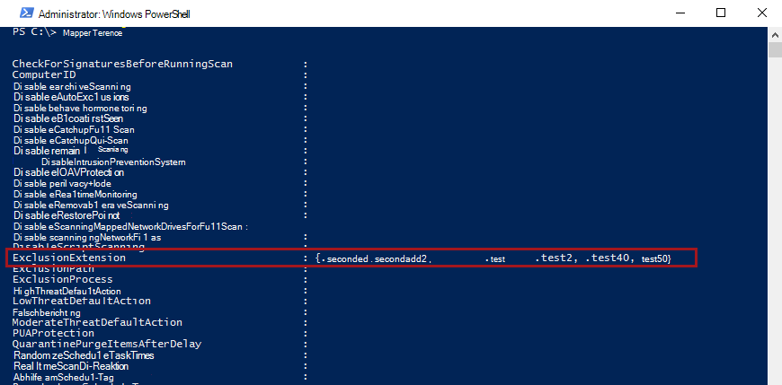
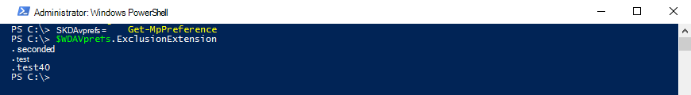

# <a name="configure-and-validate-exclusions-based-on-file-extension-and-folder-location"></a>Konfigurieren und Überprüfen von Ausschlüssen basierend auf Dateierweiterung und Ordnerspeicherort

[!INCLUDE [Microsoft 365 Defender rebranding](../../includes/microsoft-defender.md)]


**Gilt für:**

- [Microsoft Defender für Endpunkt](/microsoft-365/security/defender-endpoint/)

> [!IMPORTANT]
> Microsoft Defender Antivirus-Ausschlüsse gelten nicht für andere Microsoft Defender for Endpoint-Funktionen, einschließlich Endpunkterkennung und -reaktion [(EDR),](/microsoft-365/security/defender-endpoint/overview-endpoint-detection-response)Regeln zur Reduzierung der Angriffsfläche [(Attack Surface Reduction, ASR)](/microsoft-365/security/defender-endpoint/attack-surface-reduction)und kontrollierter [Ordnerzugriff.](/microsoft-365/security/defender-endpoint/controlled-folders) Dateien, die Sie mithilfe der in diesem Artikel beschriebenen Methoden ausschließen, können weiterhin EDR-Warnungen und andere Erkennungen auslösen. Um Dateien allgemein auszuschließen, fügen Sie sie den benutzerdefinierten Microsoft Defender for [Endpoint-Indikatoren hinzu.](/microsoft-365/security/defender-endpoint/manage-indicators)

## <a name="exclusion-lists"></a>Ausschlusslisten

Sie können bestimmte Dateien von Microsoft Defender Antivirus-Scans ausschließen, indem Sie Ausschlusslisten ändern. **Im Allgemeinen sollten Sie keine Ausschlüsse anwenden müssen.** Microsoft Defender Antivirus enthält viele automatische Ausschlüsse, die auf bekannten Betriebssystemverhalten und typischen Verwaltungsdateien basieren, z. B. solche, die in der Unternehmensverwaltung, datenbankverwaltung und anderen Unternehmensszenarien und -situationen verwendet werden.

> [!NOTE]
> Ausschlüsse gelten auch für Erkennungen von potenziell unerwünschten Apps (PuA).

> [!NOTE]
> Automatische Ausschlüsse gelten nur für Windows Server 2016 und höher. Diese Ausschlüsse sind in der Windows Security-App und in PowerShell nicht sichtbar.

In diesem Artikel wird beschrieben, wie Ausschlusslisten für die Dateien und Ordner konfiguriert werden. Weitere [Informationen finden Sie unter Empfehlungen zum Definieren von Ausschlüssen,](configure-exclusions-microsoft-defender-antivirus.md#recommendations-for-defining-exclusions) bevor Sie Ihre Ausschlusslisten definieren.

| Ausschluss | Beispiele | Ausschlussliste |
|:---|:---|:---|
|Jede Datei mit einer bestimmten Erweiterung | Alle Dateien mit der angegebenen Erweiterung an einer beliebigen Stelle auf dem Computer. <p> Gültige Syntax: `.test` und `test`  | Erweiterungsausschlüsse |
|Jede Datei unter einem bestimmten Ordner | Alle Dateien unter dem `c:\test\sample` Ordner | Datei- und Ordnerausschlüsse |
| Eine bestimmte Datei in einem bestimmten Ordner | Nur die `c:\sample\sample.test` Datei | Datei- und Ordnerausschlüsse |
| Ein bestimmter Prozess | Die ausführbare Datei `c:\test\process.exe` | Datei- und Ordnerausschlüsse |

Ausschlusslisten haben die folgenden Merkmale:

- Ordnerausschlüsse gelten für alle Dateien und Ordner unter diesem Ordner, es sei denn, der Unterordner ist ein Reparaturpunkt. Unterordner für Reparse-Punkte müssen separat ausgeschlossen werden.
- Dateierweiterungen gelten für jeden Dateinamen mit der definierten Erweiterung, wenn kein Pfad oder Ordner definiert ist.

> [!IMPORTANT]
> - Die Verwendung von Platzhaltern wie dem Sternchen ( ) ändert die Interpretation \* der Ausschlussregeln. Wichtige Informationen zur Funktionsweise [von](#use-wildcards-in-the-file-name-and-folder-path-or-extension-exclusion-lists) Platzhaltern finden Sie im Abschnitt Verwenden von Platzhaltern im Abschnitt Dateinamen- und Ordnerpfad- oder Erweiterungsausschlusslisten.
> - Zugeordnete Netzwerklaufwerke können nicht ausgeschlossen werden. Sie müssen den tatsächlichen Netzwerkpfad angeben.
> - Ordner, die nach dem Starten des Microsoft Defender Antivirus-Diensts erstellt werden und der Ausschlussliste hinzugefügt wurden, werden nicht einbezogen. Sie müssen den Dienst neu starten (indem Sie Windows neu starten), damit neue Reparsepunkte als gültiges Ausschlussziel erkannt werden.

Informationen zum Ausschließen von Dateien, die von einem bestimmten Prozess geöffnet wurden, finden Sie unter [Configure and validate exclusions for files opened by processes](configure-process-opened-file-exclusions-microsoft-defender-antivirus.md).

Die Ausschlüsse gelten für [geplante Scans,](scheduled-catch-up-scans-microsoft-defender-antivirus.md) [Bedarfsscans](run-scan-microsoft-defender-antivirus.md)und [Echtzeitschutz.](configure-real-time-protection-microsoft-defender-antivirus.md)

> [!IMPORTANT]
> Änderungen an der Ausschlussliste, die mit Gruppenrichtlinien vorgenommen **wurden,** werden in den Listen in der [Windows Security App angezeigt.](microsoft-defender-security-center-antivirus.md)
> In der Windows -Sicherheits-App vorgenommene **Änderungen werden** nicht in den Gruppenrichtlinienlisten angezeigt.

Standardmäßig werden lokale Änderungen an den Listen (von Benutzern mit Administratorrechten, einschließlich änderungen, die mit PowerShell und WMI vorgenommen wurden) mit den Listen zusammengeführt, wie von Gruppenrichtlinien, Configuration Manager oder Intune definiert (und bereitgestellt). Die Gruppenrichtlinienlisten haben Vorrang, wenn Konflikte auftreten.

Sie können [konfigurieren, wie lokal und global definierte Ausschlusslisten](configure-local-policy-overrides-microsoft-defender-antivirus.md#merge-lists) zusammengeführt werden, damit lokale Änderungen verwaltete Bereitstellungseinstellungen außer Kraft setzen können.

## <a name="configure-the-list-of-exclusions-based-on-folder-name-or-file-extension"></a>Konfigurieren der Liste der Ausschlüsse basierend auf dem Ordnernamen oder der Dateierweiterung

### <a name="use-intune-to-configure-file-name-folder-or-file-extension-exclusions"></a>Konfigurieren von Dateinamen-, Ordner- oder Dateierweiterungsausschlüssen mithilfe von Intune

Lesen Sie die folgenden Artikel:
- [Konfigurieren von Geräteeinschränkungseinstellungen in Microsoft Intune](/intune/device-restrictions-configure)
- [Microsoft Defender Antivirus Geräteeinschränkungseinstellungen für Windows 10 in Intune](/intune/device-restrictions-windows-10#microsoft-defender-antivirus)

### <a name="use-configuration-manager-to-configure-file-name-folder-or-file-extension-exclusions"></a>Konfigurieren von Dateinamen-, Ordner- oder Dateierweiterungsausschlüssen mithilfe von Configuration Manager

Weitere [Informationen zum Konfigurieren von](/configmgr/protect/deploy-use/endpoint-antimalware-policies#exclusion-settings) Microsoft Endpoint Manager (current branch) finden Sie unter Erstellen und Bereitstellen von Antischalwarerichtlinien: Ausschlusseinstellungen.

### <a name="use-group-policy-to-configure-folder-or-file-extension-exclusions"></a>Konfigurieren von Ordner- oder Dateierweiterungsausschlüssen mithilfe von Gruppenrichtlinien

>[!NOTE]
>Wenn Sie einen vollqualifizierten Pfad zu einer Datei angeben, wird nur diese Datei ausgeschlossen. Wenn ein Ordner im Ausschluss definiert ist, werden alle Dateien und Unterverzeichnisse unter diesem Ordner ausgeschlossen.

1. Öffnen Sie auf dem Computer für die Gruppenrichtlinienverwaltung die [Gruppenrichtlinienverwaltungskonsole,](/previous-versions/windows/it-pro/windows-server-2008-R2-and-2008/cc731212(v=ws.11))klicken Sie mit der rechten Maustaste auf das Gruppenrichtlinienobjekt, das Sie konfigurieren möchten, und klicken Sie auf **Bearbeiten**.

2. Wechseln Sie **im Gruppenrichtlinienverwaltungs-Editor** zu **Computerkonfiguration,** und wählen Sie **Administrative Vorlagen aus.**

3. Erweitern Sie die Struktur **auf Windows-Komponenten**  >  **Microsoft Defender Antivirus**  >  **Exclusions**.

4. Öffnen Sie **die Einstellung Pfadausschlüsse** für die Bearbeitung, und fügen Sie Ihre Ausschlüsse hinzu.

    1. Legen Sie die Option auf **Aktiviert .**
    1. Klicken Sie **im Abschnitt Optionen** auf **Anzeigen**.
    1. Geben Sie jeden Ordner in einer eigenen Zeile unter der **Spalte Wertname** an.
    1. Wenn Sie eine Datei angeben, stellen Sie sicher, dass Sie einen vollqualifizierten Pfad zur Datei eingeben, einschließlich Laufwerkbuchstabe, Ordnerpfad, Dateinamen und Erweiterung. Geben **Sie 0** in die **Spalte Wert** ein.

5. Wählen Sie **OK** aus.

6. Öffnen Sie **die Einstellung Erweiterungsausschlüsse** für die Bearbeitung, und fügen Sie Ihre Ausschlüsse hinzu.

    1. Legen Sie die Option auf **Aktiviert .**
    1. Wählen Sie **im Abschnitt Optionen** die Option Anzeigen **aus.**
    1. Geben Sie jede Dateierweiterung in einer eigenen Zeile unter der **Spalte Wertname** ein.  Geben **Sie 0** in die **Spalte Wert** ein.

7. Wählen Sie **OK** aus.

<a id="ps"></a>

### <a name="use-powershell-cmdlets-to-configure-file-name-folder-or-file-extension-exclusions"></a>Konfigurieren von Dateinamen-, Ordner- oder Dateierweiterungsausschlüssen mithilfe von PowerShell-Cmdlets

Die Verwendung von PowerShell zum Hinzufügen oder Entfernen von Ausschlüssen für Dateien basierend auf der Erweiterung, dem Speicherort oder dem Dateinamen erfordert die Verwendung einer Kombination aus drei Cmdlets und dem entsprechenden Ausschlusslistenparameter. Die Cmdlets befinden sich alle im [Defender-Modul.](/powershell/module/defender/)

Das Format für die Cmdlets lautet wie folgt:

```PowerShell
<cmdlet> -<exclusion list> "<item>"
```

Die folgenden Sind als `<cmdlet>` zulässig:

| Konfigurationsaktion | PowerShell-Cmdlet |
|:---|:---|
|Erstellen oder Überschreiben der Liste | `Set-MpPreference` |
|Zur Liste hinzufügen | `Add-MpPreference` |
|Element aus der Liste entfernen | `Remove-MpPreference` |

Die folgenden Sind als `<exclusion list>` zulässig:

| Ausschlusstyp | PowerShell-Parameter |
|:---|:---|
| Alle Dateien mit einer angegebenen Dateierweiterung | `-ExclusionExtension` |
| Alle Dateien unter einem Ordner (einschließlich Dateien in Unterverzeichnissen) oder einer bestimmten Datei | `-ExclusionPath` |

> [!IMPORTANT]
> Wenn Sie eine Liste mit oder erstellt haben, überschreibt das `Set-MpPreference` `Add-MpPreference` Cmdlet erneut die vorhandene `Set-MpPreference` Liste.

Der folgende Codeausschnitt würde beispielsweise dazu führen, dass Microsoft Defender Antivirus-Scans jede Datei mit der `.test` Dateierweiterung ausschließen:

```PowerShell
Add-MpPreference -ExclusionExtension ".test"
```

Weitere Informationen finden Sie unter [Verwenden von PowerShell-Cmdlets](use-powershell-cmdlets-microsoft-defender-antivirus.md) zum Konfigurieren und Ausführen von Microsoft Defender Antivirus- und [Defender-Cmdlets.](/powershell/module/defender/)

### <a name="use-windows-management-instruction-wmi-to-configure-file-name-folder-or-file-extension-exclusions"></a>Konfigurieren von Dateinamen-, Ordner- oder Dateierweiterungsausschlüssen mithilfe der Windows-Verwaltungsanweisung (WMI)

Verwenden Sie [ **die Methoden Set,** **Add** und **Remove** der **MSFT_MpPreference**](/previous-versions/windows/desktop/legacy/dn455323(v=vs.85)) für die folgenden Eigenschaften:

```WMI
ExclusionExtension
ExclusionPath
```

Die Verwendung von **Set,** **Add** und **Remove** entspricht ihren Entsprechungen in PowerShell: `Set-MpPreference` , und `Add-MpPreference` `Remove-MpPreference` .

Weitere Informationen finden Sie unter [Windows Defender WMIv2 APIs](/previous-versions/windows/desktop/defender/windows-defender-wmiv2-apis-portal).

<a id="man-tools"></a>

### <a name="use-the-windows-security-app-to-configure-file-name-folder-or-file-extension-exclusions"></a>Konfigurieren von Dateinamen-, Ordner- oder Dateierweiterungsausschlüssen mithilfe der Windows Security-App

Anweisungen [finden Sie unter Hinzufügen von Ausschlüssen in der Windows Security-App.](microsoft-defender-security-center-antivirus.md)

<a id="wildcards"></a>

## <a name="use-wildcards-in-the-file-name-and-folder-path-or-extension-exclusion-lists"></a>Verwenden von Platzhaltern in den Listen für Dateinamen und Ordnerpfad oder Erweiterungsausschluss

Sie können das Sternchen, fragezeichen oder Umgebungsvariablen (z. B. ) als Platzhalter verwenden, wenn Sie Elemente in der Ausschlussliste für Dateinamen oder `*` `?` `%ALLUSERSPROFILE%` Ordnerpfade definieren. Die Interpretation dieser Platzhalter unterscheidet sich von der üblichen Verwendung in anderen Apps und Sprachen. Lesen Sie diesen Abschnitt, um ihre spezifischen Einschränkungen zu verstehen.

> [!IMPORTANT]
> Es gibt wichtige Einschränkungen und Verwendungsszenarien für diese Platzhalter:
> - Die Verwendung von Umgebungsvariablen ist auf Computervariablen und auf Prozesse beschränkt, die als NT AUTHORITY\SYSTEM-Konto ausgeführt werden.
> - Sie können keinen Platzhalter an stelle eines Laufwerkbuchstabens verwenden.
> - Für einen einzelnen Ordner wird ein Sternchen in einem `*` Ordnerausschluss angezeigt. Verwenden Sie mehrere Instanzen `\*\` von, um mehrere geschachtelte Ordner mit nicht angegebenen Namen anzugeben.

In der folgenden Tabelle wird beschrieben, wie die Platzhalter verwendet werden können, und es werden einige Beispiele aufgeführt.


|Platzhalter  |Beispiele  |
|:---------|:---------|
|`*` (Sternchen) <p> In **Dateinamen- und Dateierweiterungseinschlüssen** ersetzt das Sternchen eine beliebige Anzahl von Zeichen und gilt nur für Dateien im letzten Ordner, der im Argument definiert ist. <p> In **Ordnerausschlüssen** ersetzt das Sternchen einen einzelnen Ordner. Verwenden Sie `*` mehrere mit Ordnerschrägstrichen, `\` um mehrere geschachtelte Ordner anzugeben. Nachdem die Anzahl der Ordner mit Platzhaltern und benannten Ordnern übereinstimmen, werden auch alle Unterordner einbezogen.   | `C:\MyData\*.txt` includes `C:\MyData\notes.txt` <p> `C:\somepath\*\Data` enthält alle Dateien in und deren Unterordner sowie `C:\somepath\Archives\Data` `C:\somepath\Authorized\Data` deren Unterordner <p> `C:\Serv\*\*\Backup` enthält alle Dateien in `C:\Serv\Primary\Denied\Backup` und deren Unterordnern und `C:\Serv\Secondary\Allowed\Backup` unterordnern     |
|`?` (Fragezeichen)  <p> In **Dateinamen- und Dateierweiterungseinschlüssen** ersetzt das Fragezeichen ein einzelnes Zeichen und gilt nur für Dateien im letzten Ordner, der im Argument definiert ist. <p> In **Ordnerausschlüssen** ersetzt das Fragezeichen ein einzelnes Zeichen in einem Ordnernamen. Nachdem die Anzahl der Ordner mit Platzhaltern und benannten Ordnern übereinstimmen, werden auch alle Unterordner einbezogen.   |`C:\MyData\my?.zip` includes `C:\MyData\my1.zip` <p> `C:\somepath\?\Data` enthält eine beliebige Datei in `C:\somepath\P\Data` und ihren Unterordnern  <p> `C:\somepath\test0?\Data` würde eine beliebige Datei in `C:\somepath\test01\Data` und ihre Unterordner enthalten          |
|Umgebungsvariablen <p> Die definierte Variable wird als Pfad aufgefüllt, wenn der Ausschluss ausgewertet wird.          |`%ALLUSERSPROFILE%\CustomLogFiles` würde umfassen `C:\ProgramData\CustomLogFiles\Folder1\file1.txt`         |
        

> [!IMPORTANT]
> Wenn Sie ein Argument für den Dateiausschluss mit einem Argument für den Ordnerausschluss kombinieren, werden die Regeln bei der Übereinstimmung des Dateiarguments im übereinstimmenden Ordner beendet und in keinem Unterordner nach Datei übereinstimmungen suchen.
> Sie können z. B. alle Dateien ausschließen, die mit "date" in den Ordnern und mit dem `c:\data\final\marked` `c:\data\review\marked` Rule-Argument `c:\data\*\marked\date*` beginnen.
> Dieses Argument passt jedoch nicht zu Dateien in Unterordnern unter oder `c:\data\final\marked` `c:\data\review\marked` .

<a id="review"></a>

### <a name="system-environment-variables"></a>Systemumgebungsvariablen

In der folgenden Tabelle werden die Systemkontoumgebungsvariablen aufgeführt und beschrieben. 

| Diese Systemumgebungsvariable... | Umleitungen zu diesem |
|:--|:--|
| `%APPDATA%`| `C:\Users\UserName.DomainName\AppData\Roaming` |
| `%APPDATA%\Microsoft\Internet Explorer\Quick Launch` | `C:\Windows\System32\config\systemprofile\AppData\Roaming\Microsoft\Internet Explorer\Quick Launch` |
| `%APPDATA%\Microsoft\Windows\Start Menu` | `C:\Windows\System32\config\systemprofile\AppData\Roaming\Microsoft\Windows\Start Menu` |
| `%APPDATA%\Microsoft\Windows\Start Menu\Programs` | `C:\Windows\System32\config\systemprofile\AppData\Roaming\Microsoft\Windows\Start Menu\Programs` |
| `%LOCALAPPDATA%` | `C:\Windows\System32\config\systemprofile\AppData\Local` |
| `%ProgramData%` | `C:\ProgramData` |
| `%ProgramFiles%` | `C:\Program Files` |
| `%ProgramFiles%\Common Files` | `C:\Program Files\Common Files` |
| `%ProgramFiles%\Windows Sidebar\Gadgets` | `C:\Program Files\Windows Sidebar\Gadgets` |
| `%ProgramFiles%\Common Files` | `C:\Program Files\Common Files` |
| `%ProgramFiles(x86)%` | `C:\Program Files (x86)` |
| `%ProgramFiles(x86)%\Common Files` | `C:\Program Files (x86)\Common Files` |
| `%SystemDrive%` | `C:` |
| `%SystemDrive%\Program Files` | `C:\Program Files` |
| `%SystemDrive%\Program Files (x86)` | `C:\Program Files (x86)` |
| `%SystemDrive%\Users` | `C:\Users` |
| `%SystemDrive%\Users\Public` | `C:\Users\Public` |
| `%SystemRoot%` | `C:\Windows` |
| `%windir%` | `C:\Windows` |
| `%windir%\Fonts` | `C:\Windows\Fonts` |
| `%windir%\Resources` | `C:\Windows\Resources` |
| `%windir%\resources\0409` | `C:\Windows\resources\0409` |
| `%windir%\system32` | `C:\Windows\System32` |
| `%ALLUSERSPROFILE%` | `C:\ProgramData` |
| `%ALLUSERSPROFILE%\Application Data` | `C:\ProgramData\Application Data` |
| `%ALLUSERSPROFILE%\Documents` | `C:\ProgramData\Documents` |
| `%ALLUSERSPROFILE%\Documents\My Music\Sample Music` | `C:\ProgramData\Documents\My Music\Sample Music` |
| `%ALLUSERSPROFILE%\Documents\My Music` | `C:\ProgramData\Documents\My Music` |
| `%ALLUSERSPROFILE%\Documents\My Pictures` | `C:\ProgramData\Documents\My Pictures` |
| `%ALLUSERSPROFILE%\Documents\My Pictures\Sample Pictures` | `C:\ProgramData\Documents\My Pictures\Sample Pictures` |
| `%ALLUSERSPROFILE%\Documents\My Videos` | `C:\ProgramData\Documents\My Videos` |
| `%ALLUSERSPROFILE%\Microsoft\Windows\DeviceMetadataStore` | `C:\ProgramData\Microsoft\Windows\DeviceMetadataStore` |
| `%ALLUSERSPROFILE%\Microsoft\Windows\GameExplorer` | `C:\ProgramData\Microsoft\Windows\GameExplorer` |
| `%ALLUSERSPROFILE%\Microsoft\Windows\Ringtones` | `C:\ProgramData\Microsoft\Windows\Ringtones` |
| `%ALLUSERSPROFILE%\Microsoft\Windows\Start Menu` | `C:\ProgramData\Microsoft\Windows\Start Menu` |
| `%ALLUSERSPROFILE%\Microsoft\Windows\Start Menu\Programs` | `C:\ProgramData\Microsoft\Windows\Start Menu\Programs` |
| `%ALLUSERSPROFILE%\Microsoft\Windows\Start Menu\Programs\Administrative Tools` | `C:\ProgramData\Microsoft\Windows\Start Menu\Programs\Administrative Tools` |
| `%ALLUSERSPROFILE%\Microsoft\Windows\Start Menu\Programs\StartUp` | `C:\ProgramData\Microsoft\Windows\Start Menu\Programs\StartUp` |
| `%ALLUSERSPROFILE%\Microsoft\Windows\Templates` | `C:\ProgramData\Microsoft\Windows\Templates` |
| `%ALLUSERSPROFILE%\Start Menu` | `C:\ProgramData\Start Menu` |
| `%ALLUSERSPROFILE%\Start Menu\Programs` | C:\ProgramData\Startmenü\Programme |
| `%ALLUSERSPROFILE%\Start Menu\Programs\Administrative Tools` | `C:\ProgramData\Start Menu\Programs\Administrative Tools` | 
| `%ALLUSERSPROFILE%\Templates` | `C:\ProgramData\Templates` |
| `%LOCALAPPDATA%\Microsoft\Windows\ConnectedSearch\Templates` | `C:\Windows\System32\config\systemprofile\AppData\Local\Microsoft\Windows\ConnectedSearch\Templates` |
| `%LOCALAPPDATA%\Microsoft\Windows\History` | `C:\Windows\System32\config\systemprofile\AppData\Local\Microsoft\Windows\History` |
| `%PUBLIC%` | `C:\Users\Public` |
| `%PUBLIC%\AccountPictures` | `C:\Users\Public\AccountPictures` |
| `%PUBLIC%\Desktop` | `C:\Users\Public\Desktop` |
| `%PUBLIC%\Documents` | `C:\Users\Public\Documents` |
| `%PUBLIC%\Downloads` | `C:\Users\Public\Downloads` |
| `%PUBLIC%\Music\Sample Music` | `C:\Users\Public\Music\Sample Music` |
| `%PUBLIC%\Music\Sample Playlists` | `C:\Users\Public\Music\Sample Playlists` |
| `%PUBLIC%\Pictures\Sample Pictures` | `C:\Users\Public\Pictures\Sample Pictures` |
| `%PUBLIC%\RecordedTV.library-ms` | `C:\Users\Public\RecordedTV.library-ms` |
| `%PUBLIC%\Videos` | `C:\Users\Public\Videos` |
| `%PUBLIC%\Videos\Sample Videos` | `C:\Users\Public\Videos\Sample Videos` | 
| `%USERPROFILE%` | `C:\Windows\System32\config\systemprofile` |
| `%USERPROFILE%\AppData\Local` | `C:\Windows\System32\config\systemprofile\AppData\Local` |
| `%USERPROFILE%\AppData\LocalLow` | `C:\Windows\System32\config\systemprofile\AppData\LocalLow` |
| `%USERPROFILE%\AppData\Roaming` | `C:\Windows\System32\config\systemprofile\AppData\Roaming` |


## <a name="review-the-list-of-exclusions"></a>Überprüfen der Liste der Ausschlüsse

Sie können die Elemente in der Ausschlussliste mithilfe einer der folgenden Methoden abrufen:
- [Intune](/intune/deploy-use/help-secure-windows-pcs-with-endpoint-protection-for-microsoft-intune)
- [Microsoft Endpoint Configuration Manager](/configmgr/protect/deploy-use/endpoint-antimalware-policies)
- MpCmdRun
- PowerShell
- [Windows Security App](microsoft-defender-security-center-antivirus.md)

>[!IMPORTANT]
>Änderungen an der Ausschlussliste, die mit Gruppenrichtlinien vorgenommen **wurden,** werden in den Listen in der [Windows Security App angezeigt.](microsoft-defender-security-center-antivirus.md)
>
>In der Windows -Sicherheits-App vorgenommene **Änderungen werden** nicht in den Gruppenrichtlinienlisten angezeigt.

Wenn Sie PowerShell verwenden, können Sie die Liste auf zwei Arten abrufen:

- Rufen Sie den Status aller Microsoft Defender Antivirus-Einstellungen ab. Jede Liste wird in separaten Zeilen angezeigt, aber die Elemente in jeder Liste werden in derselben Zeile kombiniert.
- Schreiben Sie den Status aller Einstellungen in eine Variable, und verwenden Sie diese Variable, um nur die bestimmte Liste auf aufruft, an der Sie interessiert sind. Jede Verwendung `Add-MpPreference` von wird in eine neue Zeile geschrieben.

### <a name="validate-the-exclusion-list-by-using-mpcmdrun"></a>Überprüfen der Ausschlussliste mithilfe von MpCmdRun

Verwenden Sie den folgenden Befehl, um Ausschlüsse mit dem [dedizierten Befehlszeilentool mpcmdrun.exe](./command-line-arguments-microsoft-defender-antivirus.md?branch=v-anbic-wdav-new-mpcmdrun-options)zu überprüfen:

```DOS
Start, CMD (Run as admin)
cd "%programdata%\microsoft\windows defender\platform"
cd 4.18.1812.3 (Where 4.18.1812.3 is this month's MDAV "Platform Update".)
MpCmdRun.exe -CheckExclusion -path <path>
```

>[!NOTE]
>Das Überprüfen von Ausschlüssen mit MpCmdRun erfordert Microsoft Defender Antivirus CAMP, Version 4.18.1812.3 (veröffentlicht im Dezember 2018) oder höher.

### <a name="review-the-list-of-exclusions-alongside-all-other-microsoft-defender-antivirus-preferences-by-using-powershell"></a>Überprüfen der Liste der Ausschlüsse zusammen mit allen anderen Microsoft Defender Antivirus-Einstellungen mithilfe von PowerShell

Verwenden Sie das folgende Cmdlet:

```PowerShell
Get-MpPreference
```

Im folgenden Beispiel werden die in der Liste `ExclusionExtension` enthaltenen Elemente hervorgehoben:



Weitere Informationen finden Sie unter [Verwenden von PowerShell-Cmdlets](use-powershell-cmdlets-microsoft-defender-antivirus.md) zum Konfigurieren und Ausführen von Microsoft Defender Antivirus- und [Defender-Cmdlets.](/powershell/module/defender/)

### <a name="retrieve-a-specific-exclusions-list-by-using-powershell"></a>Abrufen einer bestimmten Ausschlussliste mithilfe von PowerShell

Verwenden Sie den folgenden Codeausschnitt (geben Sie jede Zeile als separaten Befehl ein); Ersetzen **Sie WDAVprefs** durch die Bezeichnung, die Sie der Variablen nennen möchten:

```PowerShell
$WDAVprefs = Get-MpPreference
$WDAVprefs.ExclusionExtension
$WDAVprefs.ExclusionPath
```

Im folgenden Beispiel wird die Liste für jede Verwendung des Cmdlets in neue Zeilen `Add-MpPreference` aufgeteilt:



Weitere Informationen finden Sie unter [Verwenden von PowerShell-Cmdlets](use-powershell-cmdlets-microsoft-defender-antivirus.md) zum Konfigurieren und Ausführen von Microsoft Defender Antivirus- und [Defender-Cmdlets.](/powershell/module/defender/)

<a id="validate"></a>

## <a name="validate-exclusions-lists-with-the-eicar-test-file"></a>Überprüfen von Ausschlusslisten mit der EICAR-Testdatei

Sie können überprüfen, ob Ihre Ausschlusslisten funktionieren, indem Sie PowerShell mit dem Cmdlet oder der .NET WebClient-Klasse verwenden, um `Invoke-WebRequest` eine Testdatei herunterzuladen.

Ersetzen Sie im folgenden PowerShell-Codeausschnitt *test.txt* durch eine Datei, die Ihren Ausschlussregeln entspricht. Wenn Sie beispielsweise die Erweiterung ausgeschlossen `.testing` haben, ersetzen Sie `test.txt` durch `test.testing` . Wenn Sie einen Pfad testen, stellen Sie sicher, dass Sie das Cmdlet innerhalb dieses Pfads ausführen.

```PowerShell
Invoke-WebRequest "http://www.eicar.org/download/eicar.com.txt" -OutFile "test.txt"
```

Wenn Microsoft Defender Antivirus Schadsoftware meldet, funktioniert die Regel nicht. Wenn kein Bericht über Schadsoftware vorhanden ist und die heruntergeladene Datei vorhanden ist, funktioniert der Ausschluss. Sie können die Datei öffnen, um zu bestätigen, dass die Inhalte mit den auf der [EICAR-Testdateiwebsite beschriebenen Inhalten identisch sind.](http://www.eicar.org/86-0-Intended-use.html)

Sie können auch den folgenden #A0 verwenden, der die .NET WebClient-Klasse aufruft, um die Testdatei herunterzuladen – wie beim Cmdlet. Ersetzen Siec:\test.txtdurch eine Datei, die der zu überprüfenden Regel `Invoke-WebRequest` entspricht: 

```PowerShell
$client = new-object System.Net.WebClient
$client.DownloadFile("http://www.eicar.org/download/eicar.com.txt","c:\test.txt")
```

Wenn Sie keinen Internetzugriff haben, können Sie eine eigene EICAR-Testdatei erstellen, indem Sie die EICAR-Zeichenfolge mit dem folgenden PowerShell-Befehl in eine neue Textdatei schreiben:

```PowerShell
[io.file]::WriteAllText("test.txt",'X5O!P%@AP[4\PZX54(P^)7CC)7}$EICAR-STANDARD-ANTIVIRUS-TEST-FILE!$H+H*')
```

Sie können die Zeichenfolge auch in eine leere Textdatei kopieren und versuchen, sie mit dem Dateinamen oder in dem Ordner zu speichern, den Sie ausschließen möchten.

## <a name="related-topics"></a>Verwandte Themen

- [Konfigurieren und Überprüfen von Ausschlüssen in Microsoft Defender Antivirus-Scans](configure-exclusions-microsoft-defender-antivirus.md)
- [Konfigurieren und Überprüfen von Ausschlüssen für Dateien, die von Prozessen geöffnet werden](configure-process-opened-file-exclusions-microsoft-defender-antivirus.md)
- [Konfigurieren von Microsoft Defender Antivirus-Ausschlüssen unter Windows Server](configure-server-exclusions-microsoft-defender-antivirus.md)
- [Häufige Fehler, die beim Festlegen von Ausschlüssen vermieden werden sollten](common-exclusion-mistakes-microsoft-defender-antivirus.md)
