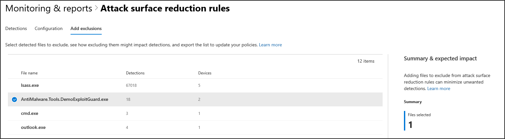

# Optimieren der Bereitstellung und Erkennung von ASR-RegelnOptimize ASR rule deployment and detections

[!INCLUDE [Microsoft 365 Defender rebranding](../../includes/microsoft-defender.md)]

**Gilt für:****Applies to:**
- [Microsoft Defender für EndpunktMicrosoft Defender for Endpoint](https://go.microsoft.com/fwlink/p/?linkid=2154037)
- [Microsoft 365 DefenderMicrosoft 365 Defender](https://go.microsoft.com/fwlink/?linkid=2118804)

> Möchten Sie Defender für Endpunkt erleben?Want to experience Defender for Endpoint? [Registrieren Sie sich für eine kostenlose Testversion.](https://www.microsoft.com/en-us/WindowsForBusiness/windows-atp?ocid=docs-wdatp-onboardconfigure-abovefoldlink)[Sign up for a free trial](https://www.microsoft.com/en-us/WindowsForBusiness/windows-atp?ocid=docs-wdatp-onboardconfigure-abovefoldlink).

[Regeln zur Verringerung der Angriffsfläche (Attack Surface Reduction, ASR)](./attack-surface-reduction.md) identifizieren und verhindern typische Schadsoftware-Exploits.[Attack surface reduction (ASR) rules](./attack-surface-reduction.md) identify and prevent typical malware exploits. Sie steuern, wann und wie potenziell schädlicher Code ausgeführt werden kann.They control when and how potentially malicious code can run. Sie können beispielsweise verhindern, dass JavaScript oder VBScript eine heruntergeladene ausführbare Datei startet, Win32-API-Aufrufe von Office Makros blockiert und Prozesse blockiert, die von USB-Laufwerken ausgeführt werden.For example, they can prevent JavaScript or VBScript from launching a downloaded executable, block Win32 API calls from Office macros, and block processes that run from USB drives.

 
*Karte für die Angriffsflächenverwaltung**Attack surface management card*

Die *Attack Surface Management-Karte* ist ein Einstiegspunkt für Tools in Microsoft 365 Security Center, die Sie für Folgendes verwenden können:The *Attack surface management card* is an entry point to tools in Microsoft 365 security center that you can use to:

* Erfahren Sie, wie ASR-Regeln derzeit in Ihrer Organisation bereitgestellt werden.Understand how ASR rules are currently deployed in your organization.
* Überprüfen Sie ASR-Erkennungen, und identifizieren Sie mögliche falsche Erkennungen.Review ASR detections and identify possible incorrect detections.
* Analysieren Sie die Auswirkungen von Ausschlüssen, und generieren Sie die Liste der auszuschließenden Dateipfade.Analyze the impact of exclusions and generate the list of file paths to exclude.

Wählen Sie **"Zu Angriffsflächenverwaltungsüberwachung**  >  **wechseln& Berichte > Attack Surface Reduction-Regeln > Ausschlüsse hinzufügen.**Select **Go to attack surface management** > **Monitoring & reports > Attack surface reduction rules > Add exclusions**. Von dort aus können Sie zu anderen Abschnitten des Microsoft 365 Security Centers navigieren.From there, you can navigate to other sections of Microsoft 365 security center.

 
Die Registerkarte ***"Ausschlüsse hinzufügen"** auf der Seite "Attack Surface Reduction Rules" im Microsoft 365 Security Center*The ***Add exclusions** tab in the Attack surface reduction rules page in Microsoft 365 security center*

> [!NOTE]
> Für den Zugriff auf Microsoft 365 Security Center benötigen Sie eine Microsoft 365 E3- oder E5-Lizenz und ein Konto mit bestimmten Rollen für Azure Active Directory.To access Microsoft 365 security center, you need a Microsoft 365 E3 or E5 license and an account that has certain roles on Azure Active Directory. [Lesen Sie mehr über erforderliche Lizenzen und Berechtigungen.](/office365/securitycompliance/microsoft-security-and-compliance#required-licenses-and-permissions)[Read about required licenses and permissions](/office365/securitycompliance/microsoft-security-and-compliance#required-licenses-and-permissions).

Weitere Informationen zur Bereitstellung von ASR-Regel in Microsoft 365 Security Center finden Sie unter Überwachen und Verwalten der Bereitstellung und Erkennung von [ASR-Regeln.](/office365/securitycompliance/monitor-devices#monitor-and-manage-asr-rule-deployment-and-detections)For more information about ASR rule deployment in Microsoft 365 security center, see [Monitor and manage ASR rule deployment and detections](/office365/securitycompliance/monitor-devices#monitor-and-manage-asr-rule-deployment-and-detections).

**Verwandte Themen****Related topics**

* [Sicherstellen, dass Ihre Geräte ordnungsgemäß konfiguriert sindEnsure your devices are configured properly](configure-machines.md)
* [Geräte in Microsoft Defender für Endpunkt integrierenGet devices onboarded to Microsoft Defender for Endpoint](configure-machines-onboarding.md)
* [Überwachen der Einhaltung der Sicherheitsgrundwerte von Microsoft Defender für EndpunktMonitor compliance to the Microsoft Defender for Endpoint security baseline](configure-machines-security-baseline.md)
