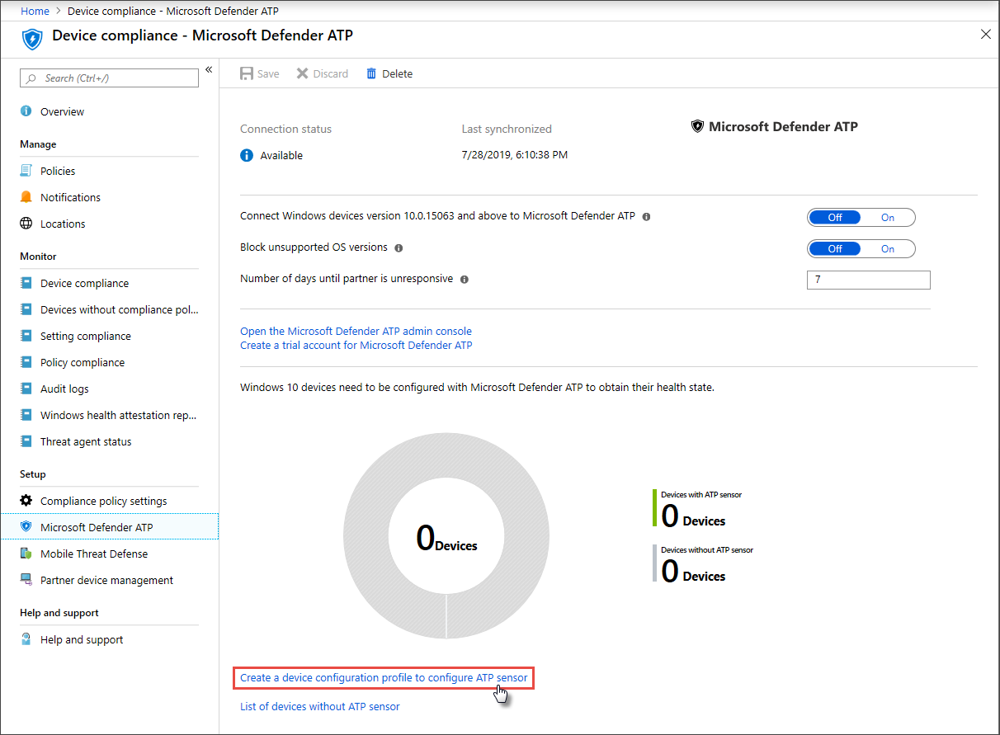

# Geräte in Microsoft Defender für Endpunkt integrieren

[!INCLUDE [Microsoft 365 Defender rebranding](../../includes/microsoft-defender.md)]

**Gilt für:**
- [Microsoft Defender für Endpunkt](https://go.microsoft.com/fwlink/p/?linkid=2154037)
- [Microsoft 365 Defender](https://go.microsoft.com/fwlink/?linkid=2118804)

>Möchten Sie Microsoft Defender für Endpunkt erleben? [Registrieren Sie sich für eine kostenlose Testversion.](https://www.microsoft.com/microsoft-365/windows/microsoft-defender-atp?ocid=docs-wdatp-onboardconfigure-abovefoldlink)

Jedes integrierte Gerät fügt einen zusätzlichen EDR (EDR)-Sensor hinzu und erhöht die Sichtbarkeit von Sicherheitsverletzungen in Ihrem Netzwerk. Durch das Onboarding wird außerdem sichergestellt, dass ein Gerät auf anfällige Komponenten sowie Auffälligkeiten bei der Sicherheitskonfiguration überprüft werden kann und kritische Abhilfemaßnahmen bei Angriffen empfangen werden können.

Bevor Sie das Onboarding von Geräten nachverfolgen und verwalten können:
- [Registrieren Ihrer Geräte bei der Intune-Verwaltung](configure-machines.md#enroll-devices-to-intune-management)
- [Sicherstellen, dass Sie über die erforderlichen Berechtigungen verfügen](configure-machines.md#obtain-required-permissions)

## Ermitteln und Nachverfolgen ungeschützter Geräte

Die **Onboardingkarte** bietet eine allgemeine Übersicht über Ihre Onboardingrate, indem die Anzahl der Windows 10 Geräte, die tatsächlich in Defender für Endpunkt integriert wurden, mit der Gesamtanzahl der von Intune verwalteten Windows 10 Geräte verglichen wird.

 
*Karte mit integrierten Geräten im Vergleich zur Gesamtzahl der von Intune verwalteten Windows 10 Geräts*

>[!NOTE]
>Wenn Sie Security Center Configuration Manager, das Onboarding-Skript oder andere Integrationsmethoden verwendet haben, die keine Intune-Profile verwenden, können Datenabweichungen auftreten. Um diese Abweichungen zu beheben, erstellen Sie ein entsprechendes Intune-Konfigurationsprofil für das Defender für Endpunkt-Onboarding, und weisen Sie dieses Profil Ihren Geräten zu.

## Onboarding weiterer Geräte mit Intune-Profilen

Defender für Endpunkt bietet mehrere praktische Optionen für [das Onboarding Windows 10 Geräte.](onboard-configure.md) Für von Intune verwaltete Geräte können Sie intune-Profile jedoch nutzen, um den Defender für Endpunkt-Sensor bequem zur Auswahl von Geräten bereitzustellen und diese Geräte effektiv in den Dienst zu integrieren.

Wählen Sie auf der **Onboardingkarte** **"Onboarding" aus,** um weitere Geräte zu erstellen und ein Profil in Intune zuzuweisen. Der Link führt Sie zur Seite "Gerätekompatibilität" in Intune, die eine ähnliche Übersicht über Ihren Onboardingstatus bietet.

 
   *Microsoft Defender für Endpunkt- Gerätekompatibilitätsseite zur Intune-Geräteverwaltung*

>[!TIP]
>Alternativ können Sie im [Microsoft Azure Portal](https://portal.azure.com/) von allen Diensten > Intune **> Gerätekompatibilität**> Microsoft Defender ATP zur Complianceseite von Defender für Endpunkt navigieren.

>[!NOTE]
> Wenn Sie die aktuellsten Gerätedaten anzeigen möchten, klicken Sie auf **die Liste der Geräte ohne ATP-Sensor.**

Erstellen Sie auf der Seite "Gerätekompatibilität" ein Konfigurationsprofil speziell für die Bereitstellung des Defender für Endpunkt-Sensors, und weisen Sie dieses Profil den Geräten zu, die Sie integrieren möchten. Zu diesem Zweck können Sie die folgenden Aktionen ausführen:

- Wählen Sie **"Erstellen eines Gerätekonfigurationsprofils" aus, um den ATP-Sensor** so zu konfigurieren, dass er mit einem vordefinierten Gerätekonfigurationsprofil beginnt.
- Erstellen Sie das Gerätekonfigurationsprofil von Grund auf neu.

Weitere Informationen [finden Sie unter Verwendung von Intune-Gerätekonfigurationsprofilen zum Onboarding von Geräten in Defender für Endpunkt.](/intune/advanced-threat-protection#onboard-devices-by-using-a-configuration-profile)

>Möchten Sie Microsoft Defender für Endpunkt erleben? [Registrieren Sie sich für eine kostenlose Testversion.](https://www.microsoft.com/microsoft-365/windows/microsoft-defender-atp?ocid=docs-wdatp-onboardconfigure-belowfoldlink)

## Verwandte Themen
- [Sicherstellen, dass Ihre Geräte ordnungsgemäß konfiguriert sind](configure-machines.md)
- [Erhöhen der Compliance für die Defender für Endpunkt-Sicherheitsgrundwerte](configure-machines-security-baseline.md)
- [Optimieren der Bereitstellung und Erkennung von ASR-Regeln](configure-machines-asr.md)
