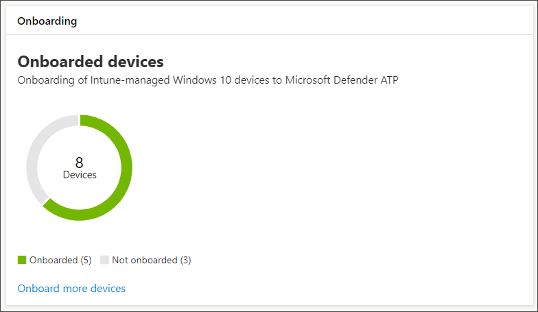

# Get devices onboarded to Microsoft Defender for EndpointGet devices onboarded to Microsoft Defender for Endpoint

[!INCLUDE [Microsoft 365 Defender rebranding](../../includes/microsoft-defender.md)]

**Gilt für:****Applies to:**
- [Microsoft Defender für EndpunktMicrosoft Defender for Endpoint](https://go.microsoft.com/fwlink/p/?linkid=2154037)
- [Microsoft 365 DefenderMicrosoft 365 Defender](https://go.microsoft.com/fwlink/?linkid=2118804)

>Möchten Sie Microsoft Defender for Endpoint erleben?Want to experience Microsoft Defender for Endpoint? [Registrieren Sie sich für eine kostenlose Testversion.Sign up for a free trial.](https://www.microsoft.com/microsoft-365/windows/microsoft-defender-atp?ocid=docs-wdatp-onboardconfigure-abovefoldlink)

Jedes integrierte Gerät fügt einen zusätzlichen Endpunkterkennungs- und -reaktionssensor (EDR) hinzu und erhöht die Sichtbarkeit der Verletzungsaktivität in Ihrem Netzwerk.Each onboarded device adds an additional endpoint detection and response (EDR) sensor and increases visibility over breach activity in your network. Das Onboarding stellt außerdem sicher, dass ein Gerät auf anfällige Komponenten sowie Sicherheitskonfigurationsprobleme überprüft werden kann und kritische Korrekturaktionen während von Angriffen erhalten kann.Onboarding also ensures that a device can be checked for vulnerable components as well security configuration issues and can receive critical remediation actions during attacks.

Bevor Sie das Onboarding von Geräten nachverfolgen und verwalten können:Before you can track and manage onboarding of devices:
- [Registrieren Ihrer Geräte bei der Intune-VerwaltungEnroll your devices to Intune management](configure-machines.md#enroll-devices-to-intune-management)
- [Sicherstellen, dass Sie über die erforderlichen Berechtigungen verfügenEnsure you have the necessary permissions](configure-machines.md#obtain-required-permissions)

## Ermitteln und Nachverfolgen ungeschützter GeräteDiscover and track unprotected devices

Die **Onboardingkarte** bietet einen umfassenden Überblick über Ihre Onboardingrate, indem sie die Anzahl der Windows 10-Geräte, die tatsächlich in Defender for Endpoint integrierte wurden, mit der Gesamtzahl der von Intune verwalteten Windows 10-Geräte vergleichen.The **Onboarding** card provides a high-level overview of your onboarding rate by comparing the number of Windows 10 devices that have actually onboarded to Defender for Endpoint against the total number of Intune-managed Windows 10 devices.

 
*Karte mit integrierten Geräten im Vergleich zur Gesamtzahl der von Intune verwalteten Windows 10-Geräte**Card showing onboarded devices compared to the total number of Intune-managed Windows 10 device*

>[!NOTE]
>Wenn Sie Security Center Configuration Manager, das Onboardingskript oder andere Onboardingmethoden verwendet haben, die keine Intune-Profile verwenden, können Datenabweichungen auftreten.If you used Security Center Configuration Manager, the onboarding script, or other onboarding methods that don’t use Intune profiles, you might encounter data discrepancies. Um diese Abweichungen zu beheben, erstellen Sie ein entsprechendes Intune-Konfigurationsprofil für das Defender for Endpoint-Onboarding, und weisen Sie dieses Profil Ihren Geräten zu.To resolve these discrepancies, create a corresponding Intune configuration profile for Defender for Endpoint onboarding and assign that profile to your devices.

## Onboarding von weiteren Geräten mit Intune-ProfilenOnboard more devices with Intune profiles

Defender for Endpoint bietet verschiedene praktische Optionen für [das Onboarding von Windows 10-Geräten.](onboard-configure.md)Defender for Endpoint provides several convenient options for [onboarding Windows 10 devices](onboard-configure.md). Für von Intune verwaltete Geräte können Sie jedoch Intune-Profile nutzen, um den Defender for Endpoint-Sensor bequem bereitzustellen, um Geräte auszuwählen und diese Geräte effektiv in den Dienst zu integrieren.For Intune-managed devices, however, you can leverage Intune profiles to conveniently deploy the Defender for Endpoint sensor to select devices, effectively onboarding these devices to the service.

Wählen Sie **auf der Onboardingkarte** weitere Geräte **integrieren** aus, um ein Profil in Intune zu erstellen und zuzuordnen.From the **Onboarding** card, select **Onboard more devices** to create and assign a profile on Intune. Der Link führt Sie zur Seite "Gerätekonformität" auf Intune, die eine ähnliche Übersicht über Ihren Onboardingstatus bietet.The link takes you to the device compliance page on Intune, which provides a similar overview of your onboarding state.

 
   *Microsoft Defender ATP-Gerätekonformitätsseite zur Intune-Geräteverwaltung**Microsoft Defender ATP device compliance page on Intune device management*

>[!TIP]
>Alternativ können Sie im [Microsoft Azure-Portal](https://portal.azure.com/) von Allen Diensten > Intune > Device compliance > **Microsoft Defender ATP** zur Seite Defender for Endpoint-Onboarding-Compliance navigieren.Alternatively, you can navigate to the Defender for Endpoint onboarding compliance page in the [Microsoft Azure portal](https://portal.azure.com/) from **All services > Intune > Device compliance > Microsoft Defender ATP**.

>[!NOTE]
> Wenn Sie die neuesten Gerätedaten anzeigen möchten, klicken Sie auf Liste der Geräte **ohne ATP-Sensor**.If you want to view the most up-to-date device data, click on **List of devices without ATP sensor**.

Erstellen Sie auf der Seite Gerätekonformität ein Konfigurationsprofil speziell für die Bereitstellung des Defender for Endpoint-Sensors, und weisen Sie dieses Profil den Geräten zu, die Sie onboarden möchten.From the device compliance page, create a configuration profile specifically for the deployment of the Defender for Endpoint sensor and assign that profile to the devices you want to onboard. Dazu können Sie entweder:To do this, you can either:

- Wählen **Sie Erstellen eines Gerätekonfigurationsprofils aus, um den ATP-Sensor** so zu konfigurieren, dass er mit einem vordefinierten Gerätekonfigurationsprofil beginnt.Select **Create a device configuration profile to configure ATP sensor** to start with a predefined device configuration profile.
- Erstellen Sie das Gerätekonfigurationsprofil von Grund auf neu.Create the device configuration profile from scratch.

Weitere Informationen finden Sie [unter Verwenden von Intune-Gerätekonfigurationsprofilen zum Onboarding von Geräten in Defender for Endpoint](https://docs.microsoft.com/intune/advanced-threat-protection#onboard-devices-by-using-a-configuration-profile).For more information, [read about using Intune device configuration profiles to onboard devices to Defender for Endpoint](https://docs.microsoft.com/intune/advanced-threat-protection#onboard-devices-by-using-a-configuration-profile).

>Möchten Sie Microsoft Defender ATP erleben?Want to experience Microsoft Defender ATP? [Registrieren Sie sich für eine kostenlose Testversion.Sign up for a free trial.](https://www.microsoft.com/microsoft-365/windows/microsoft-defender-atp?ocid=docs-wdatp-onboardconfigure-belowfoldlink)

## Verwandte ThemenRelated topics
- [Sicherstellen, dass Ihre Geräte ordnungsgemäß konfiguriert sindEnsure your devices are configured properly](configure-machines.md)
- [Erhöhen der Einhaltung der Sicherheitsgrundlinie für Defender for EndpointIncrease compliance to the Defender for Endpoint security baseline](configure-machines-security-baseline.md)
- [Optimieren der Bereitstellung und Erkennung von ASR-RegelnOptimize ASR rule deployment and detections](configure-machines-asr.md)
