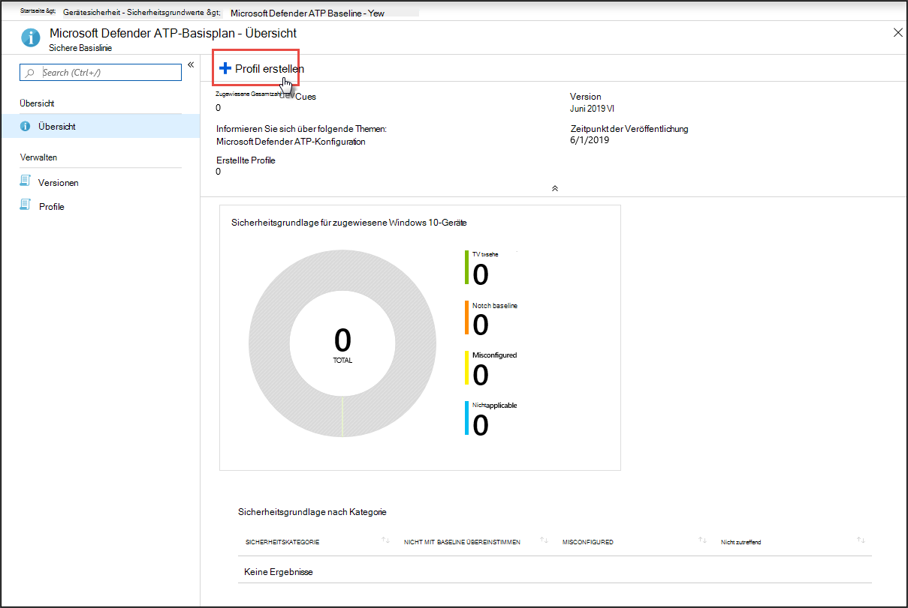

# Erhöhen der Compliance für die Microsoft Defender für Endpunkt-SicherheitsgrundwerteIncrease compliance to the Microsoft Defender for Endpoint security baseline

[!INCLUDE [Microsoft 365 Defender rebranding](../../includes/microsoft-defender.md)]

**Gilt für:****Applies to:**
- [Microsoft Defender für EndpunktMicrosoft Defender for Endpoint](https://go.microsoft.com/fwlink/p/?linkid=2154037)
- [Microsoft 365 DefenderMicrosoft 365 Defender](https://go.microsoft.com/fwlink/?linkid=2118804)

>Möchten Sie Defender für Endpunkt erleben?Want to experience Defender for Endpoint? [Registrieren Sie sich für eine kostenlose Testversion.Sign up for a free trial.](https://www.microsoft.com/microsoft-365/windows/microsoft-defender-atp?ocid=docs-wdatp-onboardconfigure-abovefoldlink)

Sicherheitsgrundwerte stellen sicher, dass Sicherheitsfeatures gemäß den Anweisungen von Sicherheitsexperten und Experten Windows Systemadministratoren konfiguriert sind.Security baselines ensure that security features are configured according to guidance from both security experts and expert Windows system administrators. Bei der Bereitstellung legt die Defender für Endpunkt-Sicherheitsgrundwerte Defender für Endpunkt-Sicherheitskontrollen fest, um optimalen Schutz zu bieten.When deployed, the Defender for Endpoint security baseline sets Defender for Endpoint security controls to provide optimal protection.

Lesen Sie [diese häufig gestellten Fragen,](/intune/security-baselines#q--a)um die Sicherheitsgrundwerte zu verstehen und zu verstehen, wie sie in Intune mithilfe von Konfigurationsprofilen zugewiesen werden.To understand security baselines and how they are assigned on Intune using configuration profiles, [read this FAQ](/intune/security-baselines#q--a).

Bevor Sie die Compliance in Sicherheitsgrundwerten bereitstellen und nachverfolgen können:Before you can deploy and track compliance to security baselines:
- [Registrieren Ihrer Geräte bei der Intune-VerwaltungEnroll your devices to Intune management](configure-machines.md#enroll-devices-to-intune-management)
- [Sicherstellen, dass Sie über die erforderlichen Berechtigungen verfügenEnsure you have the necessary permissions](configure-machines.md#obtain-required-permissions)

## Vergleichen der Sicherheitsgrundwerte von Microsoft Defender für Endpunkt und Windows IntuneCompare the Microsoft Defender for Endpoint and the Windows Intune security baselines
Die Windows Intune-Sicherheitsgrundwerte bieten einen umfassenden Satz empfohlener Einstellungen, die zum sicheren Konfigurieren Windows ausgeführter Geräte erforderlich sind, einschließlich Browsereinstellungen, PowerShell-Einstellungen sowie Einstellungen für einige Sicherheitsfeatures wie Microsoft Defender Antivirus.The Windows Intune security baseline provides a comprehensive set of recommended settings needed to securely configure devices running Windows, including browser settings, PowerShell settings, as well as settings for some security features like Microsoft Defender Antivirus. Im Gegensatz dazu bietet die Defender für Endpunkt-Baseline Einstellungen, die alle Sicherheitssteuerelemente im Defender für Endpunkt-Stapel optimieren, einschließlich Einstellungen für EDR (EDR) sowie Einstellungen, die auch in der Windows Intune-Sicherheitsbaseline zu finden sind.In contrast, the Defender for Endpoint baseline provides settings that optimize all the security controls in the Defender for Endpoint stack, including settings for endpoint detection and response (EDR) as well as settings also found in the Windows Intune security baseline. Weitere Informationen zu den einzelnen Baselines finden Sie unter:For more information about each baseline, see:

- [einstellungen für Windows Sicherheitsgrundwerte für IntuneWindows security baseline settings for Intune](/intune/security-baseline-settings-windows)
- [Microsoft Defender für Endpunkt-Basisplaneinstellungen für IntuneMicrosoft Defender for Endpoint baseline settings for Intune](/intune/security-baseline-settings-defender-atp)

Im Idealfall werden geräte, die in Defender für Endpunkt integriert sind, beide Baselines bereitgestellt: die Windows Intune-Sicherheitsgrundwerte, um zunächst Windows zu sichern, und dann die Defender für Endpunkt-Sicherheitsgrundwerte, die übereinander liegen, um die Sicherheitskontrollen von Defender für Endpunkt optimal zu konfigurieren.Ideally, devices onboarded to Defender for Endpoint are deployed both baselines: the Windows Intune security baseline to initially secure Windows and then the Defender for Endpoint security baseline layered on top to optimally configure the Defender for Endpoint security controls. Um von den neuesten Daten zu Risiken und Bedrohungen zu profitieren und Konflikte bei der Weiterentwicklung der Basispläne zu minimieren, wenden Sie immer die neuesten Versionen der Baselines auf alle Produkte an, sobald sie veröffentlicht werden.To benefit from the latest data on risks and threats and to minimize conflicts as baselines evolve, always apply the latest versions of the baselines across all products as soon as they are released.

>[!NOTE]
>Die Defender für Endpunkt-Sicherheitsbaseline wurde für physische Geräte optimiert und wird derzeit nicht für die Verwendung auf virtuellen Computern (VMs) oder VDI-Endpunkten empfohlen.The Defender for Endpoint security baseline has been optimized for physical devices and is currently not recommended for use on virtual machine (VMs) or VDI endpoints. Bestimmte Basiseinstellungen können sich auf interaktive Remotesitzungen in virtualisierten Umgebungen auswirken.Certain baseline settings can impact remote interactive sessions on virtualized environments.

## Überwachen der Einhaltung der Sicherheitsgrundwerte für Defender für EndpunktMonitor compliance to the Defender for Endpoint security baseline

Die Karte mit den **Sicherheitsgrundwerten** für [die Gerätekonfigurationsverwaltung](configure-machines.md) bietet eine Übersicht über die Compliance auf Windows 10 Geräten, denen die Defender für Endpunkt-Sicherheitsgrundlinie zugewiesen wurde.The **Security baseline** card on [device configuration management](configure-machines.md) provides an overview of compliance across Windows 10 devices that have been assigned the Defender for Endpoint security baseline.

 
*Karte mit Compliance für die Defender für Endpunkt-Sicherheitsgrundwerte**Card showing compliance to the Defender for Endpoint security baseline*

Jedem Gerät wird einer der folgenden Statustypen zugewiesen:Each device is given one of the following status types:

- **Entspricht dem Basisplan**– Geräteeinstellungen stimmen mit allen Einstellungen in der Baseline überein**Matches baseline**—device settings match all the settings in the baseline
- **Entspricht nicht dem Basisplan**– mindestens eine Geräteeinstellung stimmt nicht mit der Grundlinie überein.**Does not match baseline**—at least one device setting doesn't match the baseline
- **Falsch konfiguriert**– mindestens eine Basisplaneinstellung ist auf dem Gerät nicht ordnungsgemäß konfiguriert und befindet sich in einem Konflikt-, Fehler- oder ausstehenden Zustand.**Misconfigured**—at least one baseline setting isn't properly configured on the device and is in a conflict, error, or pending state
- **Nicht zutreffend**– Mindestens eine Baseline-Einstellung ist auf dem Gerät nicht anwendbar.**Not applicable**—At least one baseline setting isn't applicable on the device

Um bestimmte Geräte zu überprüfen, wählen Sie **Sicherheitsgrundwerte** auf der Karte konfigurieren aus.To review specific devices, select **Configure security baseline** on the card. Dadurch gelangen Sie zur Intune-Geräteverwaltung.This takes you to Intune device management. Wählen Sie dort den **Gerätestatus** für die Namen und Status der Geräte aus.From there, select **Device status** for the names and statuses of the devices.

>[!NOTE]
>Möglicherweise treten Abweichungen in aggregierten Daten auf der Seite für die Gerätekonfigurationsverwaltung und auf Übersichtsbildschirmen in Intune auf.You might experience discrepancies in aggregated data displayed on the device configuration management page and those displayed on overview screens in Intune.

## Überprüfen und Zuweisen der Microsoft Defender für Endpunkt-SicherheitsgrundwerteReview and assign the Microsoft Defender for Endpoint security baseline

Die Gerätekonfigurationsverwaltung überwacht die Baseline-Compliance nur für Windows 10 Geräte, denen speziell die Sicherheitsgrundwerte von Microsoft Defender für Endpunkt zugewiesen wurden.Device configuration management monitors baseline compliance only of Windows 10 devices that have been specifically assigned the Microsoft Defender for Endpoint security baseline. Sie können den Basisplan bequem überprüfen und den Geräten in der Intune-Geräteverwaltung zuweisen.You can conveniently review the baseline and assign it to devices on Intune device management.

1. Wählen Sie **"Sicherheitsbasisplan** konfigurieren" auf der Karte **"Sicherheitsgrundwerte"** aus, um zur Intune-Geräteverwaltung zu wechseln.Select **Configure security baseline** on the **Security baseline** card to go to Intune device management. Eine ähnliche Übersicht über die Baseline-Compliance wird angezeigt.A similar overview of baseline compliance is displayed.

   >[!TIP]
   > Alternativ können Sie im Microsoft Azure-Portal von **allen Diensten > Intune > Gerätesicherheits->-Sicherheitsgrundwerte > Microsoft Defender ATP Baseline** zur Defender für Endpunkt-Sicherheitsbaseline navigieren.Alternatively, you can navigate to the Defender for Endpoint security baseline in the Microsoft Azure portal from **All services > Intune > Device security > Security baselines > Microsoft Defender ATP baseline**.

2. Erstellen Sie ein neues Profil.Create a new profile.

    
   *Übersicht über die Microsoft Defender für Endpunkt-Sicherheitsgrundwerte in Intune**Microsoft Defender for Endpoint security baseline overview on Intune*

3. Während der Profilerstellung können Sie bestimmte Einstellungen auf der Basislinie überprüfen und anpassen.During profile creation, you can review and adjust specific settings on the baseline.

    
   *Optionen für Sicherheitsgrundwerte während der Profilerstellung in Intune**Security baseline options during profile creation on Intune*

4. Weisen Sie das Profil der entsprechenden Gerätegruppe zu.Assign the profile to the appropriate device group.

    
   *Zuweisen des Sicherheitsbasisplanprofils in Intune**Assigning the security baseline profile on Intune*

5. Erstellen Sie das Profil, um es zu speichern und in der zugewiesenen Gerätegruppe bereitzustellen.Create the profile to save it and deploy it to the assigned device group.

    
   *Erstellen des Sicherheitsbasisplanprofils in Intune**Creating the security baseline profile on Intune*

>[!TIP]
>Sicherheitsgrundwerte in Intune bieten eine bequeme Möglichkeit, Ihre Geräte umfassend zu sichern und zu schützen.Security baselines on Intune provide a convenient way to comprehensively secure and protect your devices. [Erfahren Sie mehr über Sicherheitsgrundwerte in Intune.](/intune/security-baselines)[Learn more about security baselines on Intune](/intune/security-baselines).

>Möchten Sie Microsoft Defender für Endpunkt erleben?Want to experience Microsoft Defender for Endpoint? [Registrieren Sie sich für eine kostenlose Testversion.Sign up for a free trial.](https://www.microsoft.com/microsoft-365/windows/microsoft-defender-atp?ocid=docs-wdatp-onboardconfigure-belowfoldlink)

## Verwandte ThemenRelated topics
- [Sicherstellen, dass Ihre Geräte ordnungsgemäß konfiguriert sindEnsure your devices are configured properly](configure-machines.md)
- [Geräte in Microsoft Defender für Endpunkt integrierenGet devices onboarded to Microsoft Defender for Endpoint](configure-machines-onboarding.md)
- [Optimieren der Bereitstellung und Erkennung von ASR-RegelnOptimize ASR rule deployment and detections](configure-machines-asr.md)
