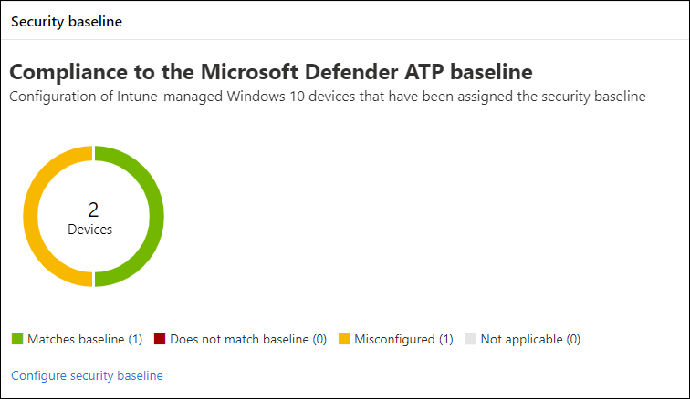

# Erhöhen der Compliance für die Microsoft Defender für Endpunkt-Sicherheitsgrundwerte

[!INCLUDE [Microsoft 365 Defender rebranding](../../includes/microsoft-defender.md)]

**Gilt für:**
- [Microsoft Defender für Endpunkt](https://go.microsoft.com/fwlink/p/?linkid=2154037)
- [Microsoft 365 Defender](https://go.microsoft.com/fwlink/?linkid=2118804)

>Möchten Sie Defender für Endpunkt erleben? [Registrieren Sie sich für eine kostenlose Testversion.](https://www.microsoft.com/microsoft-365/windows/microsoft-defender-atp?ocid=docs-wdatp-onboardconfigure-abovefoldlink)

Sicherheitsgrundwerte stellen sicher, dass Sicherheitsfeatures gemäß den Anweisungen von Sicherheitsexperten und Experten Windows Systemadministratoren konfiguriert sind. Bei der Bereitstellung legt die Defender für Endpunkt-Sicherheitsgrundwerte Defender für Endpunkt-Sicherheitskontrollen fest, um optimalen Schutz zu bieten.

Lesen Sie [diese häufig gestellten Fragen,](/intune/security-baselines#q--a)um die Sicherheitsgrundwerte zu verstehen und zu verstehen, wie sie in Intune mithilfe von Konfigurationsprofilen zugewiesen werden.

Bevor Sie die Compliance in Sicherheitsgrundwerten bereitstellen und nachverfolgen können:
- [Registrieren Ihrer Geräte bei der Intune-Verwaltung](configure-machines.md#enroll-devices-to-intune-management)
- [Sicherstellen, dass Sie über die erforderlichen Berechtigungen verfügen](configure-machines.md#obtain-required-permissions)

## Vergleichen der Sicherheitsgrundwerte von Microsoft Defender für Endpunkt und Windows Intune
Die Windows Intune-Sicherheitsgrundwerte bieten einen umfassenden Satz empfohlener Einstellungen, die zum sicheren Konfigurieren Windows ausgeführter Geräte erforderlich sind, einschließlich Browsereinstellungen, PowerShell-Einstellungen sowie Einstellungen für einige Sicherheitsfeatures wie Microsoft Defender Antivirus. Im Gegensatz dazu bietet die Defender für Endpunkt-Baseline Einstellungen, die alle Sicherheitssteuerelemente im Defender für Endpunkt-Stapel optimieren, einschließlich Einstellungen für EDR (EDR) sowie Einstellungen, die auch in der Windows Intune-Sicherheitsbaseline zu finden sind. Weitere Informationen zu den einzelnen Baselines finden Sie unter:

- [einstellungen für Windows Sicherheitsgrundwerte für Intune](/intune/security-baseline-settings-windows)
- [Microsoft Defender für Endpunkt-Basisplaneinstellungen für Intune](/intune/security-baseline-settings-defender-atp)

Im Idealfall werden geräte, die in Defender für Endpunkt integriert sind, beide Baselines bereitgestellt: die Windows Intune-Sicherheitsgrundwerte, um zunächst Windows zu sichern, und dann die Defender für Endpunkt-Sicherheitsgrundwerte, die übereinander liegen, um die Sicherheitskontrollen von Defender für Endpunkt optimal zu konfigurieren. Um von den neuesten Daten zu Risiken und Bedrohungen zu profitieren und Konflikte bei der Weiterentwicklung der Basispläne zu minimieren, wenden Sie immer die neuesten Versionen der Baselines auf alle Produkte an, sobald sie veröffentlicht werden.

>[!NOTE]
>Die Defender für Endpunkt-Sicherheitsbaseline wurde für physische Geräte optimiert und wird derzeit nicht für die Verwendung auf virtuellen Computern (VMs) oder VDI-Endpunkten empfohlen. Bestimmte Basiseinstellungen können sich auf interaktive Remotesitzungen in virtualisierten Umgebungen auswirken.

## Überwachen der Einhaltung der Sicherheitsgrundwerte für Defender für Endpunkt

Die Karte mit den **Sicherheitsgrundwerten** für [die Gerätekonfigurationsverwaltung](configure-machines.md) bietet eine Übersicht über die Compliance auf Windows 10 Geräten, denen die Defender für Endpunkt-Sicherheitsgrundlinie zugewiesen wurde.

 
*Karte mit Compliance für die Defender für Endpunkt-Sicherheitsgrundwerte*

Jedem Gerät wird einer der folgenden Statustypen zugewiesen:

- **Entspricht dem Basisplan**– Geräteeinstellungen stimmen mit allen Einstellungen in der Baseline überein
- **Entspricht nicht dem Basisplan**– mindestens eine Geräteeinstellung stimmt nicht mit der Grundlinie überein.
- **Falsch konfiguriert**– mindestens eine Basisplaneinstellung ist auf dem Gerät nicht ordnungsgemäß konfiguriert und befindet sich in einem Konflikt-, Fehler- oder ausstehenden Zustand.
- **Nicht zutreffend**– Mindestens eine Baseline-Einstellung ist auf dem Gerät nicht anwendbar.

Um bestimmte Geräte zu überprüfen, wählen Sie **Sicherheitsgrundwerte** auf der Karte konfigurieren aus. Dadurch gelangen Sie zur Intune-Geräteverwaltung. Wählen Sie dort den **Gerätestatus** für die Namen und Status der Geräte aus.

>[!NOTE]
>Möglicherweise treten Abweichungen in aggregierten Daten auf der Seite für die Gerätekonfigurationsverwaltung und auf Übersichtsbildschirmen in Intune auf.

## Überprüfen und Zuweisen der Microsoft Defender für Endpunkt-Sicherheitsgrundwerte

Die Gerätekonfigurationsverwaltung überwacht die Baseline-Compliance nur für Windows 10 Geräte, denen speziell die Sicherheitsgrundwerte von Microsoft Defender für Endpunkt zugewiesen wurden. Sie können den Basisplan bequem überprüfen und den Geräten in der Intune-Geräteverwaltung zuweisen.

1. Wählen Sie **"Sicherheitsbasisplan** konfigurieren" auf der Karte **"Sicherheitsgrundwerte"** aus, um zur Intune-Geräteverwaltung zu wechseln. Eine ähnliche Übersicht über die Baseline-Compliance wird angezeigt.

   >[!TIP]
   > Alternativ können Sie im Microsoft Azure-Portal von **allen Diensten > Intune > Gerätesicherheits->-Sicherheitsgrundwerte > Microsoft Defender ATP Baseline** zur Defender für Endpunkt-Sicherheitsbaseline navigieren.

2. Erstellen Sie ein neues Profil.

    
   *Übersicht über die Microsoft Defender für Endpunkt-Sicherheitsgrundwerte in Intune*

3. Während der Profilerstellung können Sie bestimmte Einstellungen auf der Basislinie überprüfen und anpassen.

    
   *Optionen für Sicherheitsgrundwerte während der Profilerstellung in Intune*

4. Weisen Sie das Profil der entsprechenden Gerätegruppe zu.

    
   *Zuweisen des Sicherheitsbasisplanprofils in Intune*

5. Erstellen Sie das Profil, um es zu speichern und in der zugewiesenen Gerätegruppe bereitzustellen.

    
   *Erstellen des Sicherheitsbasisplanprofils in Intune*

>[!TIP]
>Sicherheitsgrundwerte in Intune bieten eine bequeme Möglichkeit, Ihre Geräte umfassend zu sichern und zu schützen. [Erfahren Sie mehr über Sicherheitsgrundwerte in Intune.](/intune/security-baselines)

>Möchten Sie Microsoft Defender für Endpunkt erleben? [Registrieren Sie sich für eine kostenlose Testversion.](https://www.microsoft.com/microsoft-365/windows/microsoft-defender-atp?ocid=docs-wdatp-onboardconfigure-belowfoldlink)

## Verwandte Themen
- [Sicherstellen, dass Ihre Geräte ordnungsgemäß konfiguriert sind](configure-machines.md)
- [Geräte in Microsoft Defender für Endpunkt integrieren](configure-machines-onboarding.md)
- [Optimieren der Bereitstellung und Erkennung von ASR-Regeln](configure-machines-asr.md)
