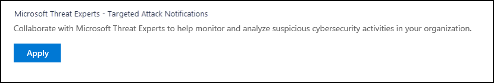
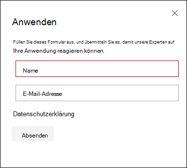

# Konfigurieren und Verwalten der Funktionen von Microsoft-Bedrohungsexperten

[!INCLUDE [Microsoft 365 Defender rebranding](../../includes/microsoft-defender.md)]

**Gilt für:**
- [Microsoft Defender für Endpunkt](https://go.microsoft.com/fwlink/p/?linkid=2154037)
- [Microsoft 365 Defender](https://go.microsoft.com/fwlink/?linkid=2118804)

>Möchten Sie Defender for Endpoint erleben? [Registrieren Sie sich für eine kostenlose Testversion.](https://www.microsoft.com/microsoft-365/windows/microsoft-defender-atp?ocid=docs-wdatp-assignaccess-abovefoldlink)

## Bevor Sie beginnen 
> [!NOTE]
> Besprechen Sie die Berechtigungsanforderungen mit Ihrem Microsoft Technical Service-Anbieter und Ihrem Kontoteam, bevor Sie sich auf Microsoft-Bedrohungsexperten – Managed Threat Hunting Service für gezielte Angriffsbenachrichtigungen bewerben.

Stellen Sie sicher, dass Defender for Endpoint in Ihrer Umgebung mit registrierten Geräten und nicht nur für eine Laborumgebung bereitgestellt ist.

Wenn Sie Ein Defender for Endpoint-Kunde sind, müssen Sie sich für **Microsoft-Bedrohungsexperten – Targeted Attack Notifications** bewerben, um spezielle Einblicke und Analysen zu erhalten, um die wichtigsten Bedrohungen zu identifizieren, damit Sie schnell darauf reagieren können. Wenden Sie sich an Ihr Kontoteam oder Ihren Microsoft-Vertreter, um **Microsoft-Bedrohungsexperten – Experten bei** Bedarf zu abonnieren, um sich mit unseren Bedrohungsexperten zu relevanten Erkennungen und Gegnern zu beraten.

## Bewerben für Microsoft-Bedrohungsexperten – Dienst für gezielte Angriffsbenachrichtigungen 
Wenn Sie bereits ein Defender for Endpoint-Kunde sind, können Sie sich über das Microsoft Defender Security Center. 

1. Wechseln Sie im Navigationsbereich zu **Einstellungen > General > Advanced features > Microsoft-Bedrohungsexperten – Targeted Attack Notifications**.

2. Klicken Sie auf **Anwenden**.

    

3. Geben Sie Ihren Namen und Ihre E-Mail-Adresse ein, damit Microsoft zu Ihnen in Ihrer Anwendung zurückkommt.

    

4. Lesen Sie [die Datenschutzbestimmungen,](https://privacy.microsoft.com/en-us/privacystatement)und klicken Sie dann auf **Übermitteln,** wenn Sie fertig sind. Sobald Ihre Anwendung genehmigt wurde, erhalten Sie eine Willkommens-E-Mail.

    

Wenn sie akzeptiert werden, erhalten Sie eine  Willkommens-E-Mail, und die Schaltfläche Anwenden wird in eine Umschaltfläche geändert, die "on" ist. Für den Fall, dass Sie sich selbst aus dem Dienst für gezielte **Angriffsbenachrichtigungen** heraus nehmen möchten, ziehen Sie den Umschalter "aus" und klicken Sie unten auf der Seite auf Einstellungen speichern. 

## Dort werden die gezielten Angriffsbenachrichtigungen von Microsoft-Bedrohungsexperten 
Sie können eine gezielte Angriffsbenachrichtigung von Microsoft-Bedrohungsexperten über das folgende Medium erhalten:  
- Die Seite "Vorfälle" des Defender for **Endpoint-Portals** 
- Das Benachrichtigungsdashboard des Defender for **Endpoint-Portals**  
- OData-Warnungs-API und [REST-API](https://docs.microsoft.com/windows/security/threat-protection/microsoft-defender-atp/pull-alerts-using-rest-api) 
- [DeviceAlertEvents-Tabelle](https://docs.microsoft.com/windows/security/threat-protection/microsoft-defender-atp/advanced-hunting-devicealertevents-table) in erweiterte Suche
- Ihre E-Mail, wenn Sie sie konfigurieren möchten 

Erstellen Sie eine E-Mail-Benachrichtigungsregel, um gezielte Angriffsbenachrichtigungen per E-Mail zu erhalten.

### Erstellen einer E-Mail-Benachrichtigungsregel 
Sie können Regeln zum Senden von E-Mail-Benachrichtigungen für Benachrichtigungsempfänger erstellen. Weitere Informationen finden Sie unter  [Configure alert notifications](configure-email-notifications.md) to create, edit, delete, or troubleshoot email notification.

## Anzeigen der Benachrichtigung über den gezielten Angriff  
Nachdem Sie Ihr System für den Empfang von E-Mail-Benachrichtigungen konfiguriert Microsoft-Bedrohungsexperten, erhalten Sie eine Benachrichtigung über gezielte Angriffe.  

1. Klicken Sie auf den Link in der E-Mail, um zum entsprechenden Warnungskontext im Dashboard zu wechseln, das mit **Bedrohungsexperten markiert ist.** 

2. Wählen Sie im Dashboard dasselbe Warnungsthema aus, das Sie aus der E-Mail erhalten haben, um die Details anzuzeigen.  

## Abonnieren von Microsoft-Bedrohungsexperten – Experten bei Bedarf
Dies ist als Abonnementdienst verfügbar. Wenn Sie bereits ein Defender for Endpoint-Kunde sind, können Sie sich an Ihren Microsoft-Vertreter wenden, um Microsoft-Bedrohungsexperten - Experts on Demand zu abonnieren. 

## Wenden Sie sich an einen Microsoft-Bedrohungsexperten zu verdächtigen Cybersicherheitsaktivitäten in Ihrer Organisation. 
Sie können partner with Microsoft-Bedrohungsexperten who can be engaged directly from within the Microsoft Defender Security Center for timely and accurate response. Experten bieten Einblicke, um komplexe Bedrohungen, gezielte Angriffsbenachrichtigungen, die Sie erhalten, besser zu verstehen, oder wenn Sie weitere Informationen zu den Warnungen, einem potenziell gefährdeten Gerät oder einem Bedrohungsintelligenzkontext benötigen, den Sie im Portaldashboard sehen. 

> [!NOTE]
> - Warnungsanfragen im Zusammenhang mit den angepassten Bedrohungsintelligenzdaten Ihrer Organisation werden derzeit nicht unterstützt. Weitere Informationen finden Sie im Sicherheitsbetrieb oder im Team für die Reaktion auf Vorfälle.
> - Sie benötigen die Berechtigung **Sicherheitseinstellungen** verwalten im Security Center-Portal, um eine Anfrage zu "Fragen Sie einen Bedrohungsexperten" einreichen zu können.

1. Navigieren Sie zur Portalseite mit den relevanten Informationen, die Sie untersuchen möchten, z. B. die Seite **Vorfall.** Stellen Sie sicher, dass die Seite für die relevante Warnung oder das entsprechende Gerät angezeigt wird, bevor Sie eine Untersuchungsanfrage senden. 

2. Klicken Sie im oberen rechten Menü auf **das ?** aus. Wählen Sie dann Einen **Bedrohungsexperten konsultieren aus.** 

    

    Ein Flyoutbildschirm wird geöffnet. Der folgende Bildschirm zeigt, wann Sie sich in einem Testabonnement befinden.

    

    Der folgende Bildschirm zeigt, wann Sie ein vollständiges Microsoft-Bedrohungsexperten - Experten bei Bedarf haben.

    

    Das **Thema "Anfrage"** wird vorab mit dem Link zur relevanten Seite für Ihre Untersuchungsanfrage ausgefüllt. Beispiel: ein Link zu der Seite mit Denk-, Warnungs- oder Gerätedetails, auf der Sie bei der Anforderung waren.

3.  Geben Sie im nächsten Feld genügend Informationen ein, um dem Microsoft-Bedrohungsexperten genügend Kontext zu geben, um die Untersuchung zu starten.
  
4. Geben Sie die E-Mail-Adresse ein, die Sie zum Korrespondieren mit Microsoft-Bedrohungsexperten.

> [!NOTE]
> Wenn Sie den Status Ihrer Experts on Demand-Fälle über Microsoft Services Hub nachverfolgen möchten, erreichen Sie Ihren Technical Account Manager. 

Sehen Sie sich dieses Video an, um einen schnellen Überblick über den Microsoft Services Hub zu erhalten.

>[!VIDEO https://www.microsoft.com/videoplayer/embed/RE4pk9f] 

   
## Beispieluntersuchungsthemen, die Sie mit Microsoft-Bedrohungsexperten – Experten bei Bedarf konsultieren können 

**Warnungsinformationen**
- Es wird ein neuer Warnungstyp für eine binäre "Living-off-the-Land"-Binärdatei angezeigt: [AlertID]. Können Sie uns weitere Informationen zu dieser Warnung und zur weiteren Untersuchung geben?
- Wir haben zwei ähnliche Angriffe beobachtet, die versuchen, schädliche PowerShell-Skripts auszuführen, aber unterschiedliche Warnungen generieren. Die eine ist "Verdächtige PowerShell-Befehlszeile", die andere ist "Eine schädliche Datei wurde basierend auf der Angabe von O365 erkannt". Was ist der Unterschied?
- Ich erhalte heute eine ungerade Warnung für die abnorme Anzahl fehlgeschlagener Anmeldungen vom Gerät eines profilierten Benutzers. Ich kann keine weiteren Nachweise für diese Anmeldeversuche finden. Wie kann Defender for Endpoint diese Versuche sehen? Welche Art von Anmeldungen wird überwacht?
- Können Sie mehr Kontext oder Einblicke zu dieser Warnung geben: "Verdächtiges Verhalten eines Systemdienstprogramms wurde beobachtet". 

**Mögliche Computerkompromisse**
- Können Sie bei der Antwort helfen, warum "Unbekannter Prozess beobachtet" zu sehen ist? Diese Nachricht oder Warnung wird häufig auf vielen Geräten angezeigt. Wir freuen uns über jede Eingabe, um zu klären, ob diese Nachricht oder Warnung im Zusammenhang mit böswilligen Aktivitäten steht.
- Können Sie einen möglichen Kompromiss auf dem folgenden System am [Datum] mit ähnlichen Verhaltensweisen wie die vorherige Erkennung von Schadsoftware auf demselben System in [Monat] überprüfen?

**Details zur Bedrohungsintelligenz**
- Wir haben eine Phishing-E-Mail erkannt, die einem Benutzer ein schädliches Word-Dokument zugestellt hat. Das schädliche Word-Dokument verursachte eine Reihe verdächtiger Ereignisse, die mehrere Microsoft Defender-Warnungen für [Schadsoftwarename]-Schadsoftware ausgelöst haben. Haben Sie Informationen zu dieser Schadsoftware? Wenn ja, können Sie mir einen Link senden?
- Ich habe kürzlich einen [Social Media Reference, z. B. Twitter oder Blog] über eine Bedrohung gesehen, die auf meine Branche zielt. Können Sie mir helfen, zu verstehen, welchen Schutz Defender for Endpoint vor diesem Bedrohungsakteur bietet? 

**Microsoft-Bedrohungsexperten Benachrichtigung** 
- Kann Ihr Team für die Reaktion auf Vorfälle uns dabei helfen, die Benachrichtigung über den gezielten Angriff zu adressieren, die wir erhalten haben?
- Ich habe diese gezielte Angriffsbenachrichtigung von Microsoft-Bedrohungsexperten. Wir verfügen nicht über ein eigenes Team zur Reaktion auf Vorfälle. Was können wir jetzt tun, und wie können wir den Vorfall eindähen?
- Ich habe eine gezielte Angriffsbenachrichtigung von Microsoft-Bedrohungsexperten. Welche Daten können Sie uns zur Verfügung stellen, die wir an unser Team für die Reaktion auf Vorfälle übergeben können?

  >[!NOTE]
  >Microsoft-Bedrohungsexperten ist ein verwalteter Cybersicherheitssuchedienst und kein Vorfallreaktionsdienst. Die Experten können die Untersuchung jedoch bei Bedarf nahtlos auf die Erkennungs- und Reaktionsteamdienste (Detection and Response Team, DART) der Microsoft Cybersecurity Solutions Group (CSG) umstiegen. Sie können sich auch dafür entscheiden, sich mit Ihrem eigenen Team für die Reaktion auf Vorfälle zu beschäftigen, um Probleme zu beheben, die eine Reaktion auf Vorfälle erfordern. 

## Szenario

### Erhalten eines Fortschrittsberichts zu Ihrer anfrage verwalteten Suche 
Die Antwort von Microsoft-Bedrohungsexperten variiert je nach Ihrer Anfrage. Sie senden Ihnen innerhalb von  zwei Tagen eine E-Mail mit einem Fortschrittsbericht zu Ihrer Expertenanfrage für Bedrohungen, um den Untersuchungsstatus aus den folgenden Kategorien zu kommunizieren: 
- Weitere Informationen sind erforderlich, um die Untersuchung fortsetzen zu können. 
- Eine Datei oder mehrere Dateibeispiele sind erforderlich, um den technischen Kontext zu bestimmen. 
- Untersuchung erfordert mehr Zeit   
- Erste Informationen reichten aus, um die Untersuchung zu schließen. 

Es ist wichtig, schnell zu reagieren, um die Untersuchung in Bewegung zu halten. 

## Verwandtes Thema
- [Microsoft-Bedrohungsexperten – Übersicht](microsoft-threat-experts.md)
