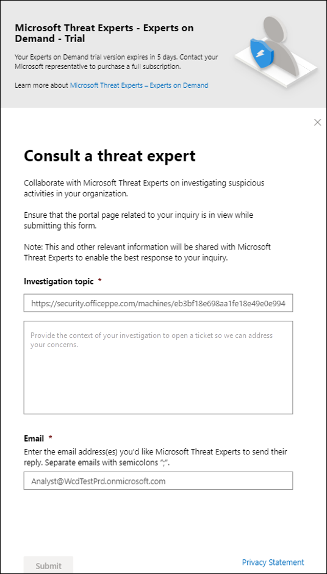

# Konfigurieren und Verwalten der Funktionen von Microsoft-BedrohungsexpertenConfigure and manage Microsoft Threat Experts capabilities

[!INCLUDE [Microsoft 365 Defender rebranding](../../includes/microsoft-defender.md)]

**Gilt für:****Applies to:**
- [Microsoft Defender für EndpunktMicrosoft Defender for Endpoint](https://go.microsoft.com/fwlink/p/?linkid=2154037)
- [Microsoft 365 DefenderMicrosoft 365 Defender](https://go.microsoft.com/fwlink/?linkid=2118804)

>Möchten Sie Defender für Endpunkt erleben?Want to experience Defender for Endpoint? [Registrieren Sie sich für eine kostenlose Testversion.Sign up for a free trial.](https://www.microsoft.com/microsoft-365/windows/microsoft-defender-atp?ocid=docs-wdatp-assignaccess-abovefoldlink)

## Bevor Sie beginnenBefore you begin 
> [!NOTE]
> Besprechen Sie die Berechtigungsanforderungen mit Ihrem Microsoft Technical Service-Anbieter und Ihrem Kontoteam, bevor Sie sich auf Microsoft-Bedrohungsexperten – Verwalteter Bedrohungssuchedienst für gezielte Angriffsbenachrichtigungen – bewerben.Discuss the eligibility requirements with your Microsoft Technical Service provider and account team before you apply to Microsoft Threat Experts - Targeted Attack Notification managed threat hunting service.

Stellen Sie sicher, dass Defender für Endpunkt in Ihrer Umgebung mit registrierten Geräten und nicht nur in einem Labor bereitgestellt wurde.Ensure that you have Defender for Endpoint deployed in your environment with devices enrolled, and not just on a laboratory set-up.

Wenn Sie Defender für Endpunkt-Kunde sind, müssen Sie Microsoft-Bedrohungsexperten – **Benachrichtigungen** über gezielte Angriffe beantragen, um spezielle Einblicke und Analysen zu erhalten, um die kritischsten Bedrohungen zu identifizieren, damit Sie schnell darauf reagieren können.If you're a Defender for Endpoint customer, you need to apply for **Microsoft Threat Experts - Targeted Attack Notifications** to get special insights and analysis to help identify the most critical threats, so you can respond to them quickly. Wenden Sie sich an Ihr Kontoteam oder einen Microsoft-Mitarbeiter, um Microsoft-Bedrohungsexperten zu abonnieren **– Experten bei Bedarf,** um sich mit unseren Bedrohungsexperten zu relevanten Erkennungen und Angreifern zu beraten.Contact your account team or Microsoft representative to subscribe to **Microsoft Threat Experts - Experts on Demand** to consult with our threat experts on relevant detections and adversaries.

## Anwenden auf Microsoft-Bedrohungsexperten – Dienst für gezielte AngriffsbenachrichtigungenApply for Microsoft Threat Experts - Targeted Attack Notifications service 
Wenn Sie bereits Defender für Endpunkt-Kunde sind, können Sie sich über die Microsoft Defender Security Center bewerben.If you're already a Defender for Endpoint customer, you can apply through the Microsoft Defender Security Center. 

1. Wechseln Sie im Navigationsbereich zu **Einstellungen > Allgemeinen > Erweiterten Features > Microsoft-Bedrohungsexperten – Benachrichtigungen über gezielte Angriffe.**From the navigation pane, go to **Settings > General > Advanced features > Microsoft Threat Experts - Targeted Attack Notifications**.

2. Klicken Sie auf **Anwenden**.Click **Apply**.

    

3. Geben Sie Ihren Namen und Ihre E-Mail-Adresse ein, damit Microsoft zu Ihnen in Ihrer Anwendung zurückkehren kann.Enter your name and email address so that Microsoft can get back to you on your application.

    

4. Lesen Sie die [Datenschutzerklärung,](https://privacy.microsoft.com/en-us/privacystatement)und klicken Sie dann auf **"Übermitteln",** wenn Sie fertig sind.Read the [privacy statement](https://privacy.microsoft.com/en-us/privacystatement), then click **Submit** when you're done. Sie erhalten eine Willkommens-E-Mail, sobald Ihre Anwendung genehmigt wurde.You will receive a welcome email once your application is approved.

    

Wenn Sie akzeptiert werden, erhalten Sie eine Willkommens-E-Mail, und die Schaltfläche **"Übernehmen"** wird in eine Umschaltfläche geändert, die "ein" ist.When accepted, you will receive a welcome email and you will see the **Apply** button change to a toggle that is “on”. Wenn Sie sich selbst aus dem Dienst für Benachrichtigungen über gezielte Angriffe herausnehmen möchten, ziehen Sie die Umschaltfläche "aus" und klicken Sie unten auf der Seite auf **"Einstellungen speichern".**In case you want to take yourself out of the Targeted Attack Notifications service, slide the toggle “off” and click **Save preferences** at the bottom of the page. 

## Wo die Benachrichtigungen über gezielte Angriffe von Microsoft-BedrohungsexpertenWhere you'll see the targeted attack notifications from Microsoft Threat Experts 
Sie können eine gezielte Angriffsbenachrichtigung von Microsoft-Bedrohungsexperten über das folgende Medium erhalten:You can receive targeted attack notification from Microsoft Threat Experts through the following medium:  
- Die Seite **"Vorfälle"** des Defender für Endpunkt-PortalsThe Defender for Endpoint portal's **Incidents** page 
- Warnungsdashboard des  Defender für Endpunkt-PortalsThe Defender for Endpoint portal's **Alerts** dashboard  
- [OData-Warnungs-API](/windows/security/threat-protection/microsoft-defender-atp/get-alerts) und [REST-API](/windows/security/threat-protection/microsoft-defender-atp/pull-alerts-using-rest-api)OData alerting [API](/windows/security/threat-protection/microsoft-defender-atp/get-alerts) and [REST API](/windows/security/threat-protection/microsoft-defender-atp/pull-alerts-using-rest-api)
- [DeviceAlertEvents-Tabelle](/windows/security/threat-protection/microsoft-defender-atp/advanced-hunting-devicealertevents-table) in der erweiterten Suche[DeviceAlertEvents](/windows/security/threat-protection/microsoft-defender-atp/advanced-hunting-devicealertevents-table) table in Advanced hunting
- Ihre E-Mail, wenn Sie sie konfigurieren möchtenYour email, if you choose to configure it 

Um gezielte Angriffsbenachrichtigungen per E-Mail zu erhalten, erstellen Sie eine E-Mail-Benachrichtigungsregel.To receive targeted attack notifications through email, create an email notification rule.

### Erstellen einer E-Mail-BenachrichtigungsregelCreate an email notification rule 
Sie können Regeln zum Senden von E-Mail-Benachrichtigungen für Benachrichtigungsempfänger erstellen.You can create rules to send email notifications for notification recipients. Weitere Informationen finden Sie unter  [Konfigurieren von Benachrichtigungen](configure-email-notifications.md) zum Erstellen, Bearbeiten, Löschen oder Beheben von Problemen mit E-Mail-Benachrichtigungen.See  [Configure alert notifications](configure-email-notifications.md) to create, edit, delete, or troubleshoot email notification, for details.

## Anzeigen der Benachrichtigung über gezielte AngriffeView the targeted attack notification  
Sie erhalten eine gezielte Angriffsbenachrichtigung von Microsoft-Bedrohungsexperten in Ihrer E-Mail, nachdem Sie Ihr System für den Empfang von E-Mail-Benachrichtigungen konfiguriert haben.You'll start receiving targeted attack notification from Microsoft Threat Experts in your email after you have configured your system to receive email notification.  

1. Klicken Sie auf den Link in der E-Mail, um zum entsprechenden Warnungskontext im Dashboard zu wechseln, das mit **Bedrohungsexperten** gekennzeichnet ist.Click the link in the email to go to the corresponding alert context in the dashboard tagged with **Threat experts**. 

2. Wählen Sie im Dashboard das gleiche Warnungsthema aus, das Sie aus der E-Mail erhalten haben, um die Details anzuzeigen.From the dashboard, select the same alert topic that you got from the email, to view the details.  

## Abonnieren von Microsoft-Bedrohungsexperten – Experten bei BedarfSubscribe to Microsoft Threat Experts - Experts on Demand
Dies ist als Abonnementdienst verfügbar.This is available as a subscription service. Wenn Sie bereits Defender für Endpunkt-Kunde sind, können Sie sich an Ihren Microsoft-Vertreter wenden, um Microsoft-Bedrohungsexperten – Experts on Demand zu abonnieren.If you're already a Defender for Endpoint customer, you can contact your Microsoft representative to subscribe to Microsoft Threat Experts - Experts on Demand. 

## Wenden Sie sich an einen Microsoft-Bedrohungsexperten zu verdächtigen Cybersicherheitsaktivitäten in Ihrer Organisation.Consult a Microsoft threat expert about suspicious cybersecurity activities in your organization 
Sie können mit Microsoft-Bedrohungsexperten zusammenarbeiten, die direkt innerhalb der Microsoft Defender Security Center für eine zeitnahe und genaue Antwort eingebunden werden können.You can partner with Microsoft Threat Experts who can be engaged directly from within the Microsoft Defender Security Center for timely and accurate response. Experten bieten Einblicke, um komplexe Bedrohungen, Benachrichtigungen über gezielte Angriffe, die Sie erhalten, oder wenn Sie weitere Informationen zu den Warnungen, einem potenziell kompromittierten Gerät oder einem Kontext der Bedrohungserkennung benötigen, der auf Ihrem Portaldashboard angezeigt wird, besser zu verstehen.Experts provide insights to better understand complex threats, targeted attack notifications that you get, or if you need more information about the alerts, a potentially compromised device, or a threat intelligence context that you see on your portal dashboard. 

> [!NOTE]
> - Warnungsanfragen im Zusammenhang mit den angepassten Threat Intelligence-Daten Ihrer Organisation werden derzeit nicht unterstützt.Alert inquiries related to your organization's customized threat intelligence data are currently not supported. Wenden Sie sich an Ihr Sicherheitsteam oder das Team für die Reaktion auf Vorfälle, um Weitere Informationen zu erhalten.Consult your security operations or incident response team for details.
> - Sie müssen über die Berechtigung **"Sicherheitseinstellungen verwalten"** im Security Center-Portal verfügen, um eine Anfrage "Fragen eines Bedrohungsexperten" übermitteln zu können.You need to have the **Manage security settings** permission in the Security Center portal to be able to submit a "Consult a threat expert" inquiry.

1. Navigieren Sie zur Portalseite mit den relevanten Informationen, die Sie untersuchen möchten, z. B. die **Vorfallseite.**Navigate to the portal page with the relevant information that you'd like to investigate, for example, the **Incident** page. Stellen Sie sicher, dass die Seite für die entsprechende Warnung oder das entsprechende Gerät angezeigt wird, bevor Sie eine Untersuchungsanforderung senden.Ensure that the page for the relevant alert or device is in view before you send an investigation request. 

2. Klicken Sie im oberen rechten Menü auf das **?**From the upper right-hand menu, click the **?** aus.icon. Wählen Sie dann **"Bedrohungsexperten** konsultieren" aus.Then, select **Consult a threat expert**. 

    

    Ein Flyoutbildschirm wird geöffnet.A flyout screen opens. Der folgende Bildschirm zeigt, wenn Sie ein Testabonnement haben.The following screen shows when you are on a trial subscription.

    

    Der folgende Bildschirm zeigt, wenn Sie ein vollständiges Microsoft-Bedrohungsexperten – Experts on-Demand-Abonnement haben.The following screen shows when you are on a full Microsoft Threat Experts - Experts on-Demand subscription.

    

    Das **Themenfeld Anfrage** ist mit dem Link zur entsprechenden Seite für Ihre Untersuchungsanfrage ausgefüllt.The **Inquiry topic** field is pre-populated with the link to the relevant page for your investigation request. Beispielsweise ein Link zur Seite "Vorfall", "Warnung" oder "Gerätedetails", auf der Sie sich befanden, als Sie die Anforderung gestellt haben.For example, a link to the incident, alert, or device details page that you were at when you made the request.

3.  Geben Sie im nächsten Feld genügend Informationen an, um dem Microsoft-Bedrohungsexperten genügend Kontext zu geben, um die Untersuchung zu starten.In the next field, provide enough information to give the Microsoft Threat Experts enough context to start the investigation.
  
4. Geben Sie die E-Mail-Adresse ein, die Sie verwenden möchten, um Microsoft-Bedrohungsexperten zu entsprechen.Enter the email address that you'd like to use to correspond with Microsoft Threat Experts.

> [!NOTE]
> Wenn Sie den Status Ihrer Experts on Demand-Fälle über den Microsoft Services Hub nachverfolgen möchten, wenden Sie sich an Ihren Technical Account Manager.If you would like to track the status of your Experts on Demand cases through Microsoft Services Hub, reach out to your Technical Account Manager. 

Sehen Sie sich dieses Video an, um einen schnellen Überblick über den Microsoft Services Hub zu geben.Watch this video for a quick overview of the Microsoft Services Hub.

>[!VIDEO https://www.microsoft.com/videoplayer/embed/RE4pk9f] 

   
## Beispiele für Untersuchungsthemen, die Sie mit Microsoft-Bedrohungsexperten - Experts on DemandSample investigation topics that you can consult with Microsoft Threat Experts - Experts on Demand 

**Warnungsinformationen****Alert information**
- Wir sehen eine neue Art von Warnung für eine Binärdatei außerhalb des Landes: [AlertID].We see a new type of alert for a living-off-the-land binary: [AlertID]. Können Sie uns etwas mehr über diese Warnung mitteilen und wie wir weitere Untersuchungen durchführen können?Can you tell us something more about this alert and how we can investigate further?
- Wir haben zwei ähnliche Angriffe beobachtet, die versuchen, schädliche PowerShell-Skripts auszuführen, aber unterschiedliche Warnungen generieren.We’ve observed two similar attacks, which try to execute malicious PowerShell scripts but generate different alerts. Eine ist "Verdächtige PowerShell-Befehlszeile" und die andere ist "Eine schädliche Datei wurde basierend auf der Von O365 bereitgestellten Anzeige erkannt".One is "Suspicious PowerShell command line" and the other is "A malicious file was detected based on indication provided by O365". Was ist der Unterschied?What is the difference?
- Ich erhalte heute eine ungerade Warnung für die anormale Anzahl fehlgeschlagener Anmeldungen vom Gerät eines Profilbenutzers.I receive an odd alert today for abnormal number of failed logins from a high profile user’s device. Ich kann keine weiteren Nachweise für diese Anmeldeversuche finden.I cannot find any further evidence around these sign-in attempts. Wie können diese Versuche von Defender für Endpunkt angezeigt werden?How can Defender for Endpoint see these attempts? Welche Art von Anmeldungen wird überwacht?What type of sign-ins are being monitored?
- Können Sie mehr Kontext oder Einblicke zu dieser Warnung geben: "Verdächtiges Verhalten durch ein Systemhilfsprogramm wurde beobachtet".Can you give more context or insights about this alert: “Suspicious behavior by a system utility was observed”. 

**Mögliche Computerkompromitt****Possible machine compromise**
- Können Sie antworten, warum "Unbekannter Prozess beobachtet" angezeigt wird?Can you help answer why we see “Unknown process observed?” Diese Meldung oder Warnung wird häufig auf vielen Geräten angezeigt.This message or alert is seen frequently on many devices. Wir freuen uns über jede Eingabe, um zu verdeutlichen, ob diese Nachricht oder Warnung mit böswilligen Aktivitäten zusammenhängt.We appreciate any input to clarify whether this message or alert is related to malicious activity.
- Können Sie dazu beitragen, eine mögliche Gefährdung auf dem folgenden System am [Datum] mit ähnlichen Verhaltensweisen wie die vorherige [Schadsoftwarename]-Schadsoftwareerkennung auf demselben System in [Monat] zu überprüfen?Can you help validate a possible compromise on the following system on [date] with similar behaviors as the previous [malware name] malware detection on the same system in [month]?

**Details zur Bedrohungserkennung****Threat intelligence details**
- Wir haben eine Phishing-E-Mail erkannt, die ein schädliches Word-Dokument an einen Benutzer übermittelt hat.We detected a phishing email that delivered a malicious Word document to a user. Das schädliche Word-Dokument verursachte eine Reihe verdächtiger Ereignisse, die mehrere Microsoft Defender-Warnungen für Schadsoftware [Malwarename] auslösten.The malicious Word document caused a series of suspicious events, which triggered multiple Microsoft Defender alerts for [malware name] malware. Haben Sie Informationen zu dieser Schadsoftware?Do you have any information on this malware? Wenn ja, können Sie mir einen Link senden?If yes, can you send me a link?
- Ich habe kürzlich einen Beitrag [Social Media-Referenz, z. B. Twitter oder Blog] über eine Bedrohung gesehen, die auf meine Branche ausgerichtet ist.I recently saw a [social media reference, for example, Twitter or blog] post about a threat that is targeting my industry. Können Sie mir helfen zu verstehen, welchen Schutz Defender für Endpunkt gegen diesen Bedrohungsakteur bietet?Can you help me understand what protection Defender for Endpoint provides against this threat actor? 

**Microsoft-Bedrohungsexperten-Warnungskommunikation****Microsoft Threat Experts’ alert communications** 
- Kann Ihr Team für die Reaktion auf Vorfälle uns dabei helfen, die Benachrichtigung über gezielte Angriffe zu beheben, die wir erhalten haben?Can your incident response team help us address the targeted attack notification that we got?
- Ich habe diese Benachrichtigung über gezielte Angriffe von Microsoft-Bedrohungsexperten erhalten.I received this targeted attack notification from Microsoft Threat Experts. Wir haben kein eigenes Team für die Reaktion auf Vorfälle.We don’t have our own incident response team. Was können wir jetzt tun und wie können wir den Vorfall eindämmen?What can we do now, and how can we contain the incident?
- Ich habe eine gezielte Angriffsbenachrichtigung von Microsoft-Bedrohungsexperten erhalten.I received a targeted attack notification from Microsoft Threat Experts. Welche Daten können Sie uns zur Verfügung stellen, die wir an unser Team zur Behandlung von Sicherheitsvorfällen weitergeben können?What data can you provide to us that we can pass on to our incident response team?

  >[!NOTE]
  >Microsoft-Bedrohungsexperten ist ein verwalteter Dienst für die Cybersicherheitssuche und kein Vorfallreaktionsdienst.Microsoft Threat Experts is a managed cybersecurity hunting service and not an incident response service. Die Experten können die Untersuchung jedoch bei Bedarf nahtlos in die Dienste des Erkennungs- und Reaktionsteams (DETECTION and Response Team, DART) der Microsoft Cybersecurity Solutions Group (CSG) übertragen.However, the experts can seamlessly transition the investigation to Microsoft Cybersecurity Solutions Group (CSG)'s  Detection and Response Team (DART) services, when necessary. Sie können sich auch für die Zusammenarbeit mit Ihrem eigenen Team zur Reaktion auf Vorfälle entscheiden, um Probleme zu beheben, die eine Reaktion auf Vorfälle erfordern.You can also opt to engage with your own incident response team to address issues that requires an incident response. 

## SzenarioScenario

### Erhalten eines Statusberichts zu Ihrer verwalteten SucheReceive a progress report about your managed hunting inquiry 
Die Antwort von Microsoft-Bedrohungsexperten variiert je nach Anfrage.Response from Microsoft Threat Experts varies according to your inquiry. Sie erhalten innerhalb von zwei Tagen einen Statusbericht zu Ihrer Anfrage **eines Bedrohungsexperten,** um den Untersuchungsstatus aus den folgenden Kategorien zu kommunizieren:They will email a progress report to you about your **Consult a threat expert** inquiry within two days, to communicate the investigation status from the following categories: 
- Weitere Informationen sind erforderlich, um mit der Untersuchung fortzufahren.More information is needed to continue with the investigation 
- Eine Datei oder mehrere Dateibeispiele sind erforderlich, um den technischen Kontext zu ermitteln.A file or several file samples are needed to determine the technical context 
- Untersuchung erfordert mehr ZeitInvestigation requires more time   
- Die ersten Informationen reichten aus, um die Untersuchung abzuschließen.Initial information was enough to conclude the investigation 

Es ist wichtig, schnell zu reagieren, um die Untersuchung in Gang zu halten.It is crucial to respond in quickly to keep the investigation moving. 

## Verwandtes ThemaRelated topic
- [Microsoft-Bedrohungsexperten – ÜbersichtMicrosoft Threat Experts overview](microsoft-threat-experts.md)
- [Microsoft-Bedrohungsexperten in Microsoft 365 OverviewMicrosoft Threat Experts in Microsoft 365 Overview](/microsoft-365/security/mtp/microsoft-threat-experts)
