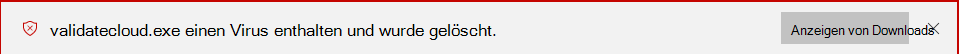
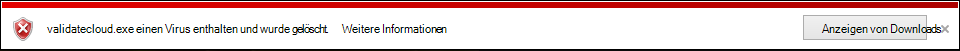
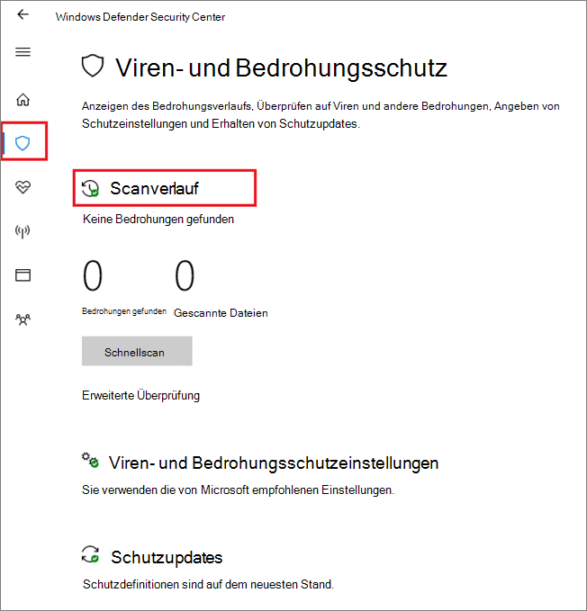

# <a name="configure-and-validate-microsoft-defender-antivirus-network-connections"></a>Konfigurieren und Validieren von Microsoft Defender Antivirus-Netzwerkverbindungen

[!INCLUDE [Microsoft 365 Defender rebranding](../../includes/microsoft-defender.md)]


**Gilt für:**

- [Microsoft Defender für Endpunkt](/microsoft-365/security/defender-endpoint/)

Um sicherzustellen, dass der von Microsoft Defender Antivirus in der Cloud übermittelte Schutz ordnungsgemäß funktioniert, müssen Sie Ihr Netzwerk so konfigurieren, dass Verbindungen zwischen Ihren Endpunkten und bestimmten Microsoft-Servern zulässig sind.

In diesem Artikel werden die Verbindungen aufgeführt, die zulässig sein müssen, z. B. mithilfe von Firewallregeln, und enthält Anweisungen zum Überprüfen der Verbindung. Wenn Sie Ihren Schutz ordnungsgemäß konfigurieren, stellen Sie sicher, dass Sie den bestmöglichen Nutzen aus Ihren in der Cloud übermittelten Schutzdiensten erhalten.

Weitere Informationen zur Netzwerkkonnektivität finden Sie im Blogbeitrag Wichtige Änderungen am [Microsoft Active Protection Services-Endpunkt.](https://techcommunity.microsoft.com/t5/Configuration-Manager-Archive/Important-changes-to-Microsoft-Active-Protection-Service-MAPS/ba-p/274006)

>[!TIP]
>Sie können auch die Microsoft Defender for Endpoint-Demowebsite unter [demo.wd.microsoft.com,](https://demo.wd.microsoft.com?ocid=cx-wddocs-testground) um zu bestätigen, dass die folgenden Features funktionieren:
>
>- In der Cloud zugestellter Schutz
>- Schnelles Lernen (einschließlich Block auf den ersten Blick)
>- Potenziell unerwünschte Anwendungsblockierung

## <a name="allow-connections-to-the-microsoft-defender-antivirus-cloud-service"></a>Zulassen von Verbindungen mit dem Microsoft Defender Antivirus-Clouddienst

Der Microsoft Defender Antivirus-Clouddienst bietet schnellen, starken Schutz für Ihre Endpunkte. Das Aktivieren des in der Cloud übermittelten Schutzdiensts ist optional, wird jedoch dringend empfohlen, da er einen wichtigen Schutz vor Schadsoftware auf Ihren Endpunkten und im gesamten Netzwerk bietet.

>[!NOTE]
>Der Microsoft Defender Antivirus-Clouddienst ist ein Mechanismus zum Bereitstellen aktualisierten Schutzes für Ihr Netzwerk und Ihre Endpunkte. Obwohl er als Clouddienst bezeichnet wird, ist er nicht nur Schutz für in der Cloud gespeicherte Dateien, sondern verwendet verteilte Ressourcen und maschinelles Lernen, um Ihren Endpunkten Schutz zu bieten, und zwar mit einer Geschwindigkeit, die wesentlich schneller ist als herkömmliche Security Intelligence-Updates.

Weitere [Informationen zum](enable-cloud-protection-microsoft-defender-antivirus.md) Aktivieren des Diensts mit Intune, Microsoft Endpoint Configuration Manager, Gruppenrichtlinien, PowerShell-Cmdlets oder auf einzelnen Clients in der Windows Security-App finden Sie unter Aktivieren des in der Cloud übermittelten Schutzes. 

Nachdem Sie den Dienst aktiviert haben, müssen Sie möglicherweise Ihr Netzwerk oder ihre Firewall so konfigurieren, dass Verbindungen zwischen dem Dienst und Ihren Endpunkten zulässig sind.

Da Es sich bei Ihrem Schutz um einen Clouddienst handelt, müssen Computer Über Zugriff auf das Internet haben und die Machine Learning-Dienste von Microsoft Defender für Office 365 erreichen. Schließen Sie die URL nicht von `*.blob.core.windows.net` jeder Art von Netzwerkprüfung aus. 

In der folgenden Tabelle sind die Dienste und die zugehörigen URLs aufgeführt. Stellen Sie sicher, dass es keine Firewall- oder Netzwerkfilterregeln gibt, die den Zugriff auf diese URLs verweigern, oder Sie müssen möglicherweise eine speziell für sie zulässige Regel erstellen (mit Ausnahme der URL `*.blob.core.windows.net` ). Im Folgenden wird erwähnt, dass URLs Port 443 für die Kommunikation verwenden.


| **Dienst**| **Beschreibung** |**URL** |
| :--: | :-- | :-- |
| Microsoft Defender Antivirus Cloud-zugestellter Schutzdienst, auch als Microsoft Active Protection Service (MAPS) bezeichnet|Wird von Microsoft Defender Antivirus verwendet, um in der Cloud zugestellten Schutz zu bieten|`*.wdcp.microsoft.com` <br/> `*.wdcpalt.microsoft.com` <br/> `*.wd.microsoft.com`|
| Microsoft Update Service (MU) <br/> Windows Update Service (WU)|  Sicherheitsintelligenz und Produktupdates   |`*.update.microsoft.com` <br/> `*.delivery.mp.microsoft.com`<br/> `*.windowsupdate.com` <br/><br/> Weitere Informationen finden Sie [unter Verbindungsendpunkte für Windows Update](/windows/privacy/manage-windows-1709-endpoints#windows-update)|
|Sicherheitsintelligenzupdates Alternativer Downloadspeicherort (Alternate Download Location, ADL)|   Alternativer Speicherort für Microsoft Defender Antivirus Security Intelligence-Updates, wenn die installierte Sicherheitsintelligenz nicht mehr aktuell ist (7 oder mehr Tage zurück)|    `*.download.microsoft.com`  </br> `*.download.windowsupdate.com`</br> `https://fe3cr.delivery.mp.microsoft.com/ClientWebService/client.asmx`|
| Schadsoftware-Übermittlungsspeicher|Speicherort für Dateien hochladen, die über das Übermittlungsformular oder die automatische Beispielübermittlung an Microsoft übermittelt wurden    | `ussus1eastprod.blob.core.windows.net` <br/>    `ussus2eastprod.blob.core.windows.net` <br/>    `ussus3eastprod.blob.core.windows.net` <br/>    `ussus4eastprod.blob.core.windows.net` <br/>    `wsus1eastprod.blob.core.windows.net` <br/>    `wsus2eastprod.blob.core.windows.net` <br/>    `ussus1westprod.blob.core.windows.net` <br/>    `ussus2westprod.blob.core.windows.net` <br/>    `ussus3westprod.blob.core.windows.net` <br/>    `ussus4westprod.blob.core.windows.net` <br/>    `wsus1westprod.blob.core.windows.net` <br/>    `wsus2westprod.blob.core.windows.net` <br/>    `usseu1northprod.blob.core.windows.net` <br/>    `wseu1northprod.blob.core.windows.net` <br/>    `usseu1westprod.blob.core.windows.net` <br/>    `wseu1westprod.blob.core.windows.net` <br/>    `ussuk1southprod.blob.core.windows.net` <br/>    `wsuk1southprod.blob.core.windows.net` <br/>    `ussuk1westprod.blob.core.windows.net` <br/>    `wsuk1westprod.blob.core.windows.net` |
| Zertifikatsperrliste (Certificate Revocation List, CRL)|Wird von Windows beim Erstellen der SSL-Verbindung zu MAPS zum Aktualisieren der Zertifikatsperrliste verwendet   | `http://www.microsoft.com/pkiops/crl/` <br/> `http://www.microsoft.com/pkiops/certs` <br/>   `http://crl.microsoft.com/pki/crl/products` <br/> `http://www.microsoft.com/pki/certs` |
| Symbolspeicher|Von Microsoft Defender Antivirus zum Wiederherstellen bestimmter kritischer Dateien während des Behebungsflusses verwendet  | `https://msdl.microsoft.com/download/symbols` |
| Universeller Telemetrieclient| Wird von Windows zum Senden von Clientdiagnosedaten verwendet. Microsoft Defender Antivirus verwendet Telemetrie zur Überwachung der Produktqualität   | Das Update verwendet SSL (TCP Port 443), um Manifeste herunterzuladen und Diagnosedaten an Microsoft hochzuladen, die die folgenden DNS-Endpunkte verwenden:   `vortex-win.data.microsoft.com` <br/>   `settings-win.data.microsoft.com`|

## <a name="validate-connections-between-your-network-and-the-cloud"></a>Überprüfen von Verbindungen zwischen Ihrem Netzwerk und der Cloud

Nachdem Sie die oben aufgeführten URLs zulassen, können Sie testen, ob Sie mit dem Microsoft Defender Antivirus-Clouddienst verbunden sind und ordnungsgemäß Berichterstellungs- und Empfangsinformationen erhalten, um sicherzustellen, dass Sie vollständig geschützt sind.

**Verwenden Sie das Cmdline-Tool, um den von der Cloud übermittelten Schutz zu überprüfen:**

Verwenden Sie das folgende Argument mit dem Microsoft Defender Antivirus-Befehlszeilenprogramm ( ), um zu überprüfen, ob Ihr Netzwerk mit dem `mpcmdrun.exe` Microsoft Defender Antivirus-Clouddienst kommunizieren kann:

```console
"%ProgramFiles%\Windows Defender\MpCmdRun.exe" -ValidateMapsConnection
```

> [!NOTE]
> Sie müssen eine Administratorversion der Eingabeaufforderung öffnen. Klicken Sie im Menü Start mit der rechten Maustaste auf das Element, klicken Sie auf Als Administrator **ausführen,** und klicken Sie an der Berechtigungsaufforderung **auf** Ja. Dieser Befehl funktioniert nur unter Windows 10, Version 1703 oder höher.

Weitere Informationen finden Sie [unter Manage Microsoft Defender Antivirus with the mpcmdrun.exe commandline tool](command-line-arguments-microsoft-defender-antivirus.md).

**Versuchen Sie, eine gefälschte Schadsoftwaredatei von Microsoft herunterzuladen:**

Sie können eine Beispieldatei herunterladen, die Microsoft Defender Antivirus erkennt und blockiert, wenn Sie ordnungsgemäß mit der Cloud verbunden sind.

Laden Sie die Datei unter [https://aka.ms/ioavtest](https://aka.ms/ioavtest) herunter.

>[!NOTE]
>Diese Datei ist keine tatsächliche Schadsoftware. Es handelt sich um eine gefälschte Datei, die testen soll, ob Sie ordnungsgemäß mit der Cloud verbunden sind.

Wenn Sie ordnungsgemäß verbunden sind, wird eine Microsoft Defender Antivirus-Warnung angezeigt.

Wenn Sie Microsoft Edge verwenden, wird auch eine Benachrichtigung angezeigt:



Eine ähnliche Meldung tritt auf, wenn Sie Internet Explorer verwenden:



Außerdem wird eine Erkennung  unter Quarantänebedrohungen im Abschnitt **Scanverlauf** in der Windows Security-App angezeigt:

1. Öffnen Sie die Windows Security-App, indem Sie auf das Schildsymbol in der Aufgabenleiste klicken oder im Startmenü nach **Defender suchen.**

2. Wählen Sie **die Kachel & Virenschutz** (oder das Schildsymbol auf der linken Menüleiste) und dann die Bezeichnung **Scanverlauf** aus:

    

3. Wählen Sie **im Abschnitt Isolierte Bedrohungen** die Option **Vollständiger Verlauf,** um die erkannte gefälschte Schadsoftware zu sehen.

   > [!NOTE]
   > Versionen von Windows 10 vor Version 1703 haben eine andere Benutzeroberfläche. Weitere [Informationen finden Sie unter Microsoft Defender Antivirus in der Windows Security App](microsoft-defender-security-center-antivirus.md).

   Das Windows-Ereignisprotokoll zeigt auch Windows Defender [Clientereignis-ID 1116 an.](troubleshoot-microsoft-defender-antivirus.md)

## <a name="related-articles"></a>Verwandte Artikel

- [Microsoft Defender Antivirus in Windows 10](microsoft-defender-antivirus-in-windows-10.md)

- [Aktivieren des in der Cloud übermittelten Schutzes](enable-cloud-protection-microsoft-defender-antivirus.md)

- [Befehlszeilenargumente](command-line-arguments-microsoft-defender-antivirus.md)

- [Wichtige Änderungen am Microsoft Active Protection Services-Endpunkt](https://techcommunity.microsoft.com/t5/Configuration-Manager-Archive/Important-changes-to-Microsoft-Active-Protection-Service-MAPS/ba-p/274006)