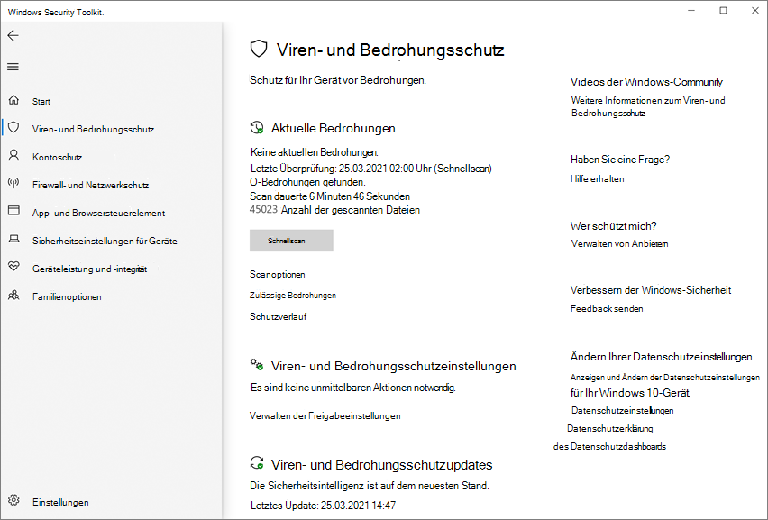

# Konfigurieren der Benachrichtigungen, die auf Endpunkten angezeigt werden

[!INCLUDE [Microsoft 365 Defender rebranding](../../includes/microsoft-defender.md)]

**Gilt für:**

- [Microsoft Defender für Endpunkt](/microsoft-365/security/defender-endpoint/)

In Windows 10 sind Anwendungsbenachrichtigungen zur Erkennung und Behebung von Schadsoftware robuster, konsistenter und präziser.

Benachrichtigungen werden auf Endpunkten angezeigt, wenn manuell ausgelöste und geplante Scans abgeschlossen werden und Bedrohungen erkannt werden. Diese Benachrichtigungen werden auch im **Notification Center** angezeigt, und eine Zusammenfassung der Scans und Bedrohungserkennungen wird in regelmäßigen Zeitintervallen angezeigt.

Sie können auch konfigurieren, wie Standardbenachrichtigungen auf Endpunkten angezeigt werden, z. B. Benachrichtigungen für einen Neustart oder wenn eine Bedrohung erkannt und behoben wurde.

## Konfigurieren der zusätzlichen Benachrichtigungen, die auf Endpunkten angezeigt werden

Sie können die Anzeige zusätzlicher Benachrichtigungen, z. B. zusammenfassungen zur Erkennung neuer Bedrohungen, in der [Windows Security-App](microsoft-defender-security-center-antivirus.md) und mit Gruppenrichtlinien konfigurieren.

> [!NOTE]
> In Windows 10, Version 1607, hieß das Feature erweiterte Benachrichtigungen und konnte unter **Windows Settings** Update &   >  **security**  >  **Windows Defender.** Unter Gruppenrichtlinieneinstellungen in allen Versionen von Windows 10 wird dies als Erweiterte **Benachrichtigungen bezeichnet.**

> [!IMPORTANT]
> Das Deaktivieren zusätzlicher Benachrichtigungen deaktiviert keine kritischen Benachrichtigungen, z. B. Bedrohungserkennungs- und Behebungswarnungen.

**Verwenden Sie die Windows Security-App, um zusätzliche Benachrichtigungen zu deaktivieren:**

1. Öffnen Sie die Windows Security-App, indem Sie auf das Schildsymbol in der Aufgabenleiste klicken oder im Startmenü nach **Defender suchen.**

2. Klicken Sie **auf &** Kachel "Virenschutz" (oder auf das Schildsymbol auf der linken Menüleiste) und dann auf die Bezeichnung **& Bedrohungsschutzeinstellungen:**

    

3. Scrollen Sie zum Abschnitt **Benachrichtigungen,** und klicken Sie **auf Benachrichtigungseinstellungen ändern.**

4. Wechseln Sie zu **Aus** oder **Ein,** um zusätzliche Benachrichtigungen zu deaktivieren oder zu aktivieren.

**Verwenden von Gruppenrichtlinien zum Deaktivieren zusätzlicher Benachrichtigungen:**

1. Öffnen Sie auf dem Computer für die Gruppenrichtlinienverwaltung die [Gruppenrichtlinienverwaltungskonsole,](/previous-versions/windows/it-pro/windows-server-2008-R2-and-2008/cc731212(v=ws.11))klicken Sie mit der rechten Maustaste auf das Gruppenrichtlinienobjekt, das Sie konfigurieren möchten, und klicken Sie auf **Bearbeiten**.

2. Wechseln Sie **im Gruppenrichtlinienverwaltungs-Editor** zu **Computerkonfiguration**.

3. Klicken Sie **auf Administrative Vorlagen**.

4. Erweitern Sie die Struktur auf **Windows-Komponenten > Microsoft Defender Antivirus > Reporting**.

5. Doppelklicken Sie **auf Erweiterte Benachrichtigungen deaktivieren,** und legen Sie die Option auf **Aktiviert .** Klicken Sie auf **OK**. Dadurch wird verhindert, dass zusätzliche Benachrichtigungen angezeigt werden.

## Konfigurieren von Standardbenachrichtigungen auf Endpunkten

Sie können Gruppenrichtlinien verwenden, um:

- Anzeigen von zusätzlichem, angepassten Text auf Endpunkten, wenn der Benutzer eine Aktion ausführen muss
- Ausblenden aller Benachrichtigungen auf Endpunkten
- Ausblenden von Neustartbenachrichtigungen auf Endpunkten

Das Ausblenden von Benachrichtigungen kann in Situationen hilfreich sein, in denen Sie nicht die gesamte Microsoft Defender Antivirus-Schnittstelle ausblenden können. Weitere Informationen finden Sie unter Prevent users from seeing or [interacting with the Microsoft Defender Antivirus user interface.](prevent-end-user-interaction-microsoft-defender-antivirus.md) 

> [!NOTE]
> Ausblenden von Benachrichtigungen tritt nur auf Endpunkten auf, für die die Richtlinie bereitgestellt wurde. Benachrichtigungen im Zusammenhang mit Aktionen, die ausgeführt werden müssen (z. B. ein Neustart), werden weiterhin im Microsoft Endpoint Manager Endpoint Protection-Überwachungsdashboard und [berichten angezeigt.](/configmgr/protect/deploy-use/monitor-endpoint-protection) 

Anweisungen [zum Hinzufügen benutzerdefinierter](/windows/security/threat-protection/windows-defender-security-center/windows-defender-security-center) Kontaktinformationen zu den Benachrichtigungen, die Benutzern auf ihren Computern angezeigt werden, finden Sie unter Customize the Windows Security app for your organization.

**Verwenden von Gruppenrichtlinien zum Ausblenden von Benachrichtigungen:**

1. Öffnen Sie auf dem Computer für die Gruppenrichtlinienverwaltung die [Gruppenrichtlinienverwaltungskonsole,](/previous-versions/windows/it-pro/windows-server-2008-R2-and-2008/cc731212(v=ws.11))klicken Sie mit der rechten Maustaste auf das Gruppenrichtlinienobjekt, das Sie konfigurieren möchten, und klicken Sie auf **Bearbeiten**.

2. Wechseln Sie **im Gruppenrichtlinienverwaltungs-Editor** zu **Computerkonfiguration,** und klicken Sie auf **Administrative Vorlagen**.

3. Erweitern Sie die Struktur auf **Windows-Komponenten > Microsoft Defender Antivirus > Clientschnittstelle**. 

4. Doppelklicken Sie **auf Alle Benachrichtigungen unterdrücken,** und legen Sie die Option auf **Aktiviert .** Klicken Sie auf **OK**. Dadurch wird verhindert, dass zusätzliche Benachrichtigungen angezeigt werden.

**Verwenden von Gruppenrichtlinien zum Ausblenden von Neustartbenachrichtigungen:**

1. Öffnen Sie auf dem Computer für die Gruppenrichtlinienverwaltung die [Gruppenrichtlinienverwaltungskonsole,](/previous-versions/windows/it-pro/windows-server-2008-R2-and-2008/cc731212(v=ws.11))klicken Sie mit der rechten Maustaste auf das Gruppenrichtlinienobjekt, das Sie konfigurieren möchten, und klicken Sie auf **Bearbeiten**.

2. Wechseln Sie **im Gruppenrichtlinienverwaltungs-Editor** zu **Computerkonfiguration**.

3. Klicken Sie **auf Administrative Vorlagen**.

4. Erweitern Sie die Struktur auf **Windows-Komponenten > Microsoft Defender Antivirus > Clientschnittstelle**.

5. Doppelklicken Sie **auf Neustartbenachrichtigungen unterdrücken,** und legen Sie die Option auf **Aktiviert .** Klicken Sie auf **OK**. Dadurch wird verhindert, dass zusätzliche Benachrichtigungen angezeigt werden.

## Verwandte Themen

- [Microsoft Defender Antivirus in Windows 10](microsoft-defender-antivirus-in-windows-10.md)
- [Konfigurieren der Endbenutzerinteraktion mit Microsoft Defender Antivirus](configure-end-user-interaction-microsoft-defender-antivirus.md)