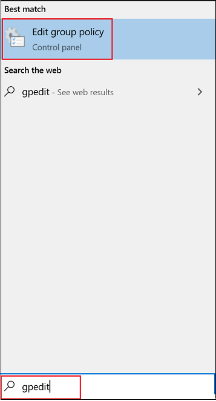

# Aktivieren und Konfigurieren des immer aktivierten Microsoft Defender Antivirus-Schutzes in Gruppenrichtlinien

[!INCLUDE [Microsoft 365 Defender rebranding](../../includes/microsoft-defender.md)]

**Gilt für:**

- [Microsoft Defender für Endpunkt](/microsoft-365/security/defender-endpoint/)

Der Always-On-Schutz besteht aus Echtzeitschutz, Verhaltensüberwachung und Heuristik, um Schadsoftware basierend auf bekannten verdächtigen und schädlichen Aktivitäten zu identifizieren.

Zu diesen Aktivitäten gehören Ereignisse, z. B. Prozesse, die ungewöhnliche Änderungen an vorhandenen Dateien vornehmen, das Ändern oder Erstellen automatischer Startregistrierungsschlüssel und Startstandorte (auch bekannt als Erweiterungspunkte für den automatischen Start oder ASEPs) sowie andere Änderungen am Dateisystem oder der Dateistruktur.

## Aktivieren und Konfigurieren des immer aktivierten Schutzes in Gruppenrichtlinien

Sie können den **Editor für lokale Gruppenrichtlinien verwenden,** um Die Einstellungen für den immer aktivierten Schutz von Microsoft Defender Antivirus zu aktivieren und zu konfigurieren.

So aktivieren und konfigurieren Sie den immer aktivierten Schutz:

1. Öffnen **Sie den Editor für lokale Gruppenrichtlinien**. Gehen Sie hierfür folgendermaßen vor:  

    1. Geben Sie im Suchfeld Windows 10-Taskleiste **gpedit ein.**
    
    1. Klicken **Sie unter Beste Übereinstimmung** auf **Gruppenrichtlinie bearbeiten,** um den Editor für **lokale Gruppenrichtlinien zu starten.**
    
       

2. Erweitern Sie im linken Bereich des **Editors** für lokale Gruppenrichtlinien die Struktur auf **Computerkonfiguration**  >  **Administrative Vorlagen**  >  **Windows-Komponenten** Microsoft Defender  >  **Antivirus**. 

3. Konfigurieren Sie die Microsoft Defender Antivirus-Antischasoftwaredienstrichtlinieneinstellungen. Gehen Sie hierfür folgendermaßen vor:  

    1. **Doppelklicken Sie im** Detailbereich von Microsoft Defender Antivirus auf der rechten Seite auf die Richtlinieneinstellung, wie in der folgenden Tabelle angegeben:

       | Einstellung | Beschreibung | Standardeinstellung |
       |-----------------------------|------------------------|-------------------------------|
       | Starten des Antischalwarediensts mit normaler Priorität zulassen | Sie können die Priorität des Microsoft Defender Antivirus-Moduls senken, was in einfachen Bereitstellungen nützlich sein kann, bei denen Sie einen möglichst schlanken Startprozess wünschen. Dies kann sich auf den Schutz des Endpunkts auswirken. | Aktiviert
       | Zulassen, dass der Antischalwaredienst immer ausgeführt wird | Wenn Schutzupdates deaktiviert wurden, können Sie festlegen, dass Microsoft Defender Antivirus weiterhin ausgeführt wird. Dadurch wird der Schutz auf dem Endpunkt gesenkt. | Deaktiviert |
    
    1. Konfigurieren Sie die Einstellung entsprechend, und klicken Sie auf **OK**.
    
    1. Wiederholen Sie die vorherigen Schritte für jede Einstellung in der Tabelle.

4. Konfigurieren Sie die Microsoft Defender Antivirus-Echtzeitschutzrichtlinieneinstellungen. Gehen Sie hierfür folgendermaßen vor:

    1. **Doppelklicken Sie im Detailbereich** von Microsoft Defender Antivirus auf **Echtzeitschutz**. Oder klicken Sie in der **Microsoft Defender Antivirus-Struktur** im linken Bereich auf **Echtzeitschutz**.
    
    1. Doppelklicken **Sie im** Detailbereich Echtzeitschutz auf der rechten Seite auf die Richtlinieneinstellung, wie in der folgenden Tabelle angegeben:  

       | Einstellung | Beschreibung | Standardeinstellung |
       |-----------------------------|------------------------|-------------------------------|
       | Aktivieren der Verhaltensüberwachung | Das AV-Modul überwacht Dateiprozesse, Datei- und Registrierungsänderungen und andere Ereignisse auf Ihren Endpunkten auf verdächtige und bekannte bösartige Aktivitäten. | Aktiviert |
       | Überprüfen aller heruntergeladenen Dateien und Anlagen | Heruntergeladene Dateien und Anlagen werden automatisch überprüft. Dies funktioniert zusätzlich zum Windows Defender SmartScreen-Filter, der Dateien vor und während des Herunterladens überprüft. | Aktiviert |
       | Überwachen von Datei- und Programmaktivitäten auf Ihrem Computer | Das Microsoft Defender Antivirus-Modul notiert Alle Dateiänderungen (Datei schreibt, z. B. Verschiebevorgänge, Kopien oder Änderungen) und allgemeine Programmaktivitäten (Programme, die geöffnet oder ausgeführt werden und die dazu führen, dass andere Programme ausgeführt werden). | Aktiviert |
       | Aktivieren von unformatierte Volume-Schreibbenachrichtigungen | Informationen zu unformatierten Volume-Schreibvorgängen werden durch die Verhaltensüberwachung analysiert. | Aktiviert |
       | Aktivieren der Prozessprüfung, wenn Echtzeitschutz aktiviert ist | Sie können das Microsoft Defender Antivirus-Modul unabhängig voneinander aktivieren, um laufende Prozesse auf verdächtige Änderungen oder Verhaltensweisen zu überprüfen. Dies ist hilfreich, wenn Sie den Echtzeitschutz vorübergehend deaktiviert haben und Prozesse automatisch überprüfen möchten, die während des Deaktivierens gestartet wurden. | Aktiviert |
       | Definieren der maximalen Größe der heruntergeladenen Dateien und Anlagen, die überprüft werden sollen | Sie können die Größe in Kilobyte definieren. | Aktiviert |
       | Konfigurieren der Außerkraftsetzung lokaler Einstellungen zum Aktivieren der Verhaltensüberwachung | Konfigurieren Sie eine lokale Außerkraftsetzung für die Konfiguration der Verhaltensüberwachung. Diese Einstellung kann nur durch Gruppenrichtlinien festgelegt werden. Wenn Sie diese Einstellung aktivieren, hat die lokale Einstellung Vorrang vor gruppenrichtlinien. Wenn Sie diese Einstellung deaktivieren oder nicht konfigurieren, hat gruppenrichtlinien Vorrang vor der lokalen Einstellungseinstellung.| Aktiviert |
       | Konfigurieren der Außerkraftsetzung lokaler Einstellungen zum Scannen aller heruntergeladenen Dateien und Anlagen | Konfigurieren Sie eine lokale Außerkraftsetzung für die Konfiguration der Überprüfung für alle heruntergeladenen Dateien und Anlagen. Diese Einstellung kann nur durch Gruppenrichtlinien festgelegt werden. Wenn Sie diese Einstellung aktivieren, hat die lokale Einstellung Vorrang vor gruppenrichtlinien. Wenn Sie diese Einstellung deaktivieren oder nicht konfigurieren, hat gruppenrichtlinien Vorrang vor der lokalen Einstellungseinstellung.| Aktiviert |
       | Konfigurieren der Außerkraftsetzung lokaler Einstellungen für Überwachungsdatei- und Programmaktivitäten auf Ihrem Computer | Konfigurieren Sie eine lokale Außerkraftsetzung für die Konfiguration der Überwachung für Datei- und Programmaktivitäten auf Ihrem Computer. Diese Einstellung kann nur durch Gruppenrichtlinien festgelegt werden. Wenn Sie diese Einstellung aktivieren, hat die lokale Einstellung Vorrang vor gruppenrichtlinien. Wenn Sie diese Einstellung deaktivieren oder nicht konfigurieren, hat gruppenrichtlinien Vorrang vor der lokalen Einstellungseinstellung.| Aktiviert |
       | Konfigurieren der Außerkraftsetzung lokaler Einstellungen zum Aktivieren des Echtzeitschutzes | Konfigurieren Sie eine lokale Außerkraftsetzung für die Konfiguration, um den Echtzeitschutz zu aktivieren. Diese Einstellung kann nur durch Gruppenrichtlinien festgelegt werden. Wenn Sie diese Einstellung aktivieren, hat die lokale Einstellung Vorrang vor gruppenrichtlinien. Wenn Sie diese Einstellung deaktivieren oder nicht konfigurieren, hat gruppenrichtlinien Vorrang vor der lokalen Einstellungseinstellung.| Aktiviert |
       | Konfigurieren der Außerkraftsetzung lokaler Einstellungen für die Überwachung eingehender und ausgehender Dateiaktivitäten | Konfigurieren Sie eine lokale Außerkraftsetzung für die Konfiguration der Überwachung eingehender und ausgehender Dateiaktivitäten. Diese Einstellung kann nur durch Gruppenrichtlinien festgelegt werden. Wenn Sie diese Einstellung aktivieren, hat die lokale Einstellung Vorrang vor gruppenrichtlinien. Wenn Sie diese Einstellung deaktivieren oder nicht konfigurieren, hat gruppenrichtlinien Vorrang vor der lokalen Einstellungseinstellung. | Aktiviert |
       | Konfigurieren der Überwachung für eingehende und ausgehende Datei- und Programmaktivitäten | Geben Sie an, ob die Überwachung für eingehende, ausgehende, beide oder keine Richtung erfolgen soll. Dies ist für Windows Server-Installationen relevant, bei denen Sie bestimmte Server oder Serverrollen definiert haben, bei denen große Mengen von Dateiänderungen nur in eine Richtung geändert werden und Sie die Netzwerkleistung verbessern möchten. Vollständig aktualisierte Endpunkte (und Server) in einem Netzwerk haben geringe Auswirkungen auf die Leistung, unabhängig von der Anzahl oder Richtung der Dateiänderungen. | Aktiviert (beide Richtungen) |

    1. Konfigurieren Sie die Einstellung entsprechend, und klicken Sie auf **OK**.
    
    1. Wiederholen Sie die vorherigen Schritte für jede Einstellung in der Tabelle.

5. Konfigurieren Sie die Einstellung der Microsoft Defender Antivirus-Überprüfungsrichtlinie. Gehen Sie hierfür folgendermaßen vor:  

    1. Klicken Sie **in der Microsoft Defender Antivirus-Struktur** im linken Bereich auf **Scannen**.
    
       

    1. **Doppelklicken Sie im** Bereich Details überprüfen auf der rechten Seite auf die Richtlinieneinstellung, wie in der folgenden Tabelle angegeben:

       | Einstellung | Beschreibung | Standardeinstellung |
       |-----------------------------|------------------------|-------------------------------|    
       | Aktivieren von Heuristiken | Heuristischer Schutz deaktiviert oder blockiert verdächtige Aktivitäten unmittelbar, bevor das Microsoft Defender Antivirus-Modul aufgefordert wird, die Aktivität zu erkennen. | Aktiviert |

    1. Konfigurieren Sie die Einstellung entsprechend, und klicken Sie auf **OK**.
    
6. Schließen **Sie den Editor für lokale Gruppenrichtlinien.**

## Deaktivieren des Echtzeitschutzes in Gruppenrichtlinien

> [!WARNING]
> Das Deaktivieren des Echtzeitschutzes reduziert den Schutz auf Ihren Endpunkten erheblich und wird nicht empfohlen.

Die Hauptfunktion für den Echtzeitschutz ist standardmäßig aktiviert, Sie können sie jedoch mithilfe des Editors für lokale **Gruppenrichtlinien deaktivieren.**

So deaktivieren Sie den Echtzeitschutz in Gruppenrichtlinien:

1. Öffnen **Sie den Editor für lokale Gruppenrichtlinien**.

   1. Geben Sie im Suchfeld Windows 10-Taskleiste **gpedit ein.**
   
   1. Klicken **Sie unter Beste Übereinstimmung** auf **Gruppenrichtlinie bearbeiten,** um den Editor für **lokale Gruppenrichtlinien zu starten.**

2.  Erweitern Sie im linken Bereich des **Editors** für lokale Gruppenrichtlinien die Struktur auf **Computerkonfiguration** Administrative Vorlagen  >    >  **Windows-Komponenten**  >  **Microsoft Defender Antivirus**  >  **Echtzeitschutz**.

3. **Doppelklicken** Sie im Detailbereich Echtzeitschutz auf der rechten Seite auf **Echtzeitschutz deaktivieren.**

   

4. Legen Sie **im Einstellungsfenster Echtzeitschutz** deaktivieren die Option auf **Aktiviert .**

   
   
5. Klicken Sie auf **OK**.

6. Schließen **Sie den Editor für lokale Gruppenrichtlinien.**

## Verwandte Artikel

- [Konfigurieren von Verhaltens-, Heuristik- und Echtzeitschutz](configure-protection-features-microsoft-defender-antivirus.md)
- [Microsoft Defender Antivirus in Windows 10](microsoft-defender-antivirus-in-windows-10.md)