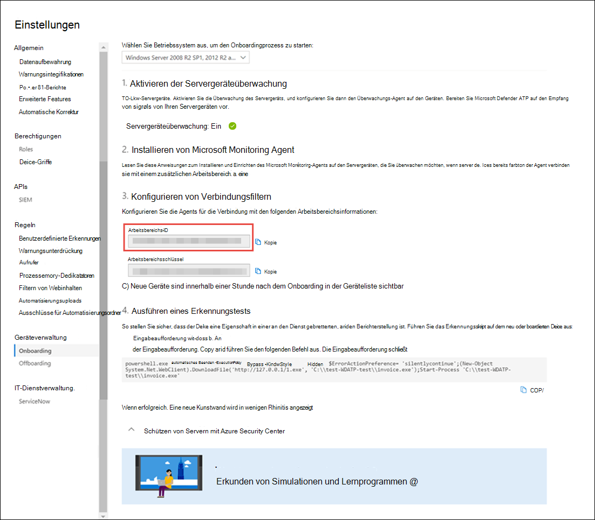

# <a name="onboard-windows-servers-to-the-microsoft-defender-for-endpoint-service"></a><span data-ttu-id="470c7-104">Onboarding Windows-Server in den Microsoft Defender für Endpunktdienst</span><span class="sxs-lookup"><span data-stu-id="470c7-104">Onboard Windows servers to the Microsoft Defender for Endpoint service</span></span>

[!INCLUDE [Microsoft 365 Defender rebranding](../../includes/microsoft-defender.md)]

<span data-ttu-id="470c7-105">**Gilt für:**</span><span class="sxs-lookup"><span data-stu-id="470c7-105">**Applies to:**</span></span>

- <span data-ttu-id="470c7-106">Windows Server 2008 R2 SP1</span><span class="sxs-lookup"><span data-stu-id="470c7-106">Windows Server 2008 R2 SP1</span></span>
- <span data-ttu-id="470c7-107">Windows Server 2012 R2</span><span class="sxs-lookup"><span data-stu-id="470c7-107">Windows Server 2012 R2</span></span>
- <span data-ttu-id="470c7-108">Windows Server 2016</span><span class="sxs-lookup"><span data-stu-id="470c7-108">Windows Server 2016</span></span>
- <span data-ttu-id="470c7-109">Windows Server (SAC) Version 1803 und höher</span><span class="sxs-lookup"><span data-stu-id="470c7-109">Windows Server (SAC) version 1803 and later</span></span>
- <span data-ttu-id="470c7-110">Windows Server 2019 und höher</span><span class="sxs-lookup"><span data-stu-id="470c7-110">Windows Server 2019 and later</span></span>
- <span data-ttu-id="470c7-111">Windows Server 2019 Core Edition</span><span class="sxs-lookup"><span data-stu-id="470c7-111">Windows Server 2019 core edition</span></span>

> <span data-ttu-id="470c7-112">Möchten Sie Defender für Endpunkt erleben?</span><span class="sxs-lookup"><span data-stu-id="470c7-112">Want to experience Defender for Endpoint?</span></span> [<span data-ttu-id="470c7-113">Registrieren Sie sich für eine kostenlose Testversion.</span><span class="sxs-lookup"><span data-stu-id="470c7-113">Sign up for a free trial.</span></span>](https://www.microsoft.com/microsoft-365/windows/microsoft-defender-atp?ocid=docs-wdatp-configserver-abovefoldlink)

<span data-ttu-id="470c7-114">Defender für Endpunkt erweitert die Unterstützung, um auch das Windows Serverbetriebssystem einzuschließen.</span><span class="sxs-lookup"><span data-stu-id="470c7-114">Defender for Endpoint extends support to also include the Windows Server operating system.</span></span> <span data-ttu-id="470c7-115">Diese Unterstützung bietet erweiterte Angriffserkennungs- und Untersuchungsfunktionen nahtlos über die Microsoft Defender Security Center Konsole.</span><span class="sxs-lookup"><span data-stu-id="470c7-115">This support provides advanced attack detection and investigation capabilities seamlessly through the Microsoft Defender Security Center console.</span></span>

<span data-ttu-id="470c7-116">Eine praktische Anleitung dazu, was für Lizenzierung und Infrastruktur erforderlich ist, finden Sie unter ["Schützen Windows Server mit Defender für Endpunkt".](https://techcommunity.microsoft.com/t5/What-s-New/Protecting-Windows-Server-with-Windows-Defender-ATP/m-p/267114#M128)</span><span class="sxs-lookup"><span data-stu-id="470c7-116">For a practical guidance on what needs to be in place for licensing and infrastructure, see [Protecting Windows Servers with Defender for Endpoint](https://techcommunity.microsoft.com/t5/What-s-New/Protecting-Windows-Server-with-Windows-Defender-ATP/m-p/267114#M128).</span></span>

<span data-ttu-id="470c7-117">Anleitungen zum Herunterladen und Verwenden von Windows-Sicherheit Baselines für Windows Server finden Sie unter [Windows-Sicherheit Baselines](/windows/device-security/windows-security-baselines).</span><span class="sxs-lookup"><span data-stu-id="470c7-117">For guidance on how to download and use Windows Security Baselines for Windows servers, see [Windows Security Baselines](/windows/device-security/windows-security-baselines).</span></span>

## <a name="windows-server-2008-r2-sp1-windows-server-2012-r2-and-windows-server-2016"></a><span data-ttu-id="470c7-118">Windows Server 2008 R2 SP1, Windows Server 2012 R2 und Windows Server 2016</span><span class="sxs-lookup"><span data-stu-id="470c7-118">Windows Server 2008 R2 SP1, Windows Server 2012 R2, and Windows Server 2016</span></span>

<span data-ttu-id="470c7-119">Sie können Windows Server 2008 R2 SP1, Windows Server 2012 R2 und Windows Server 2016 mithilfe einer der folgenden Optionen in Defender für Endpunkt integrieren:</span><span class="sxs-lookup"><span data-stu-id="470c7-119">You can onboard Windows Server 2008 R2 SP1, Windows Server 2012 R2, and Windows Server 2016 to Defender for Endpoint by using any of the following options:</span></span>

- <span data-ttu-id="470c7-120">**Option 1:** [Onboarding durch Installieren und Konfigurieren von Microsoft Monitoring Agent (MMA)](#option-1-onboard-by-installing-and-configuring-microsoft-monitoring-agent-mma)</span><span class="sxs-lookup"><span data-stu-id="470c7-120">**Option 1**: [Onboard by installing and configuring Microsoft Monitoring Agent (MMA)](#option-1-onboard-by-installing-and-configuring-microsoft-monitoring-agent-mma)</span></span>
- <span data-ttu-id="470c7-121">**Option 2:** [Onboarding über das Azure Security Center](#option-2-onboard-windows-servers-through-azure-security-center)</span><span class="sxs-lookup"><span data-stu-id="470c7-121">**Option 2**: [Onboard through Azure Security Center](#option-2-onboard-windows-servers-through-azure-security-center)</span></span>
- <span data-ttu-id="470c7-122">**Option 3:** [Onboarding bis Microsoft Endpoint Manager Version 2002 und höher](#option-3-onboard-windows-servers-through-microsoft-endpoint-manager-version-2002-and-later)</span><span class="sxs-lookup"><span data-stu-id="470c7-122">**Option 3**: [Onboard through Microsoft Endpoint Manager version 2002 and later](#option-3-onboard-windows-servers-through-microsoft-endpoint-manager-version-2002-and-later)</span></span>

<span data-ttu-id="470c7-123">Nachdem Sie die Integrationsschritte mithilfe einer der bereitgestellten Optionen abgeschlossen haben, müssen Sie [System Center Endpoint Protection Clients konfigurieren und aktualisieren.](#configure-and-update-system-center-endpoint-protection-clients)</span><span class="sxs-lookup"><span data-stu-id="470c7-123">After completing the onboarding steps using any of the provided options, you'll need to [Configure and update System Center Endpoint Protection clients](#configure-and-update-system-center-endpoint-protection-clients).</span></span>

> [!NOTE]
> <span data-ttu-id="470c7-124">Die eigenständige Serverlizenz für Defender für Endpunkt ist pro Knoten erforderlich, um einen Windows Server über Microsoft Monitoring Agent (Option 1) oder über Microsoft Endpoint Manager (Option 3) zu integrieren.</span><span class="sxs-lookup"><span data-stu-id="470c7-124">Defender for Endpoint standalone server license is required, per node, in order to onboard a Windows server through Microsoft Monitoring Agent (Option 1), or through Microsoft Endpoint Manager (Option 3).</span></span> <span data-ttu-id="470c7-125">Alternativ ist eine Azure Defender für Server-Lizenz pro Knoten erforderlich, um einen Windows Server über das Azure Security Center (Option 2) zu integrieren. Weitere Informationen finden Sie unter ["Unterstützte Features" in Azure Defender.](/azure/security-center/security-center-services)</span><span class="sxs-lookup"><span data-stu-id="470c7-125">Alternatively, an Azure Defender for Servers license is required, per node, in order to onboard a Windows server through Azure Security Center (Option 2), see [Supported features available in Azure Defender](/azure/security-center/security-center-services).</span></span>

### <a name="option-1-onboard-by-installing-and-configuring-microsoft-monitoring-agent-mma"></a><span data-ttu-id="470c7-126">Option 1: Onboarding durch Installieren und Konfigurieren von Microsoft Monitoring Agent (MMA)</span><span class="sxs-lookup"><span data-stu-id="470c7-126">Option 1: Onboard by installing and configuring Microsoft Monitoring Agent (MMA)</span></span>

<span data-ttu-id="470c7-127">Sie müssen MMA für Windows Server installieren und konfigurieren, um Sensordaten an Defender für Endpunkt zu melden.</span><span class="sxs-lookup"><span data-stu-id="470c7-127">You'll need to install and configure MMA for Windows servers to report sensor data to Defender for Endpoint.</span></span> <span data-ttu-id="470c7-128">Weitere Informationen finden Sie unter [Sammeln von Protokolldaten mit dem Azure Log Analytics-Agent.](/azure/azure-monitor/platform/log-analytics-agent)</span><span class="sxs-lookup"><span data-stu-id="470c7-128">For more information, see [Collect log data with Azure Log Analytics agent](/azure/azure-monitor/platform/log-analytics-agent).</span></span>

<span data-ttu-id="470c7-129">Wenn Sie bereits System Center Operations Manager (SCOM) oder Azure Monitor (früher Operations Management Suite (OMS) verwenden, fügen Sie die Microsoft Monitoring Agent (MMA) an, um über multihoming-Unterstützung an Ihren Defender für Endpunkt-Arbeitsbereich zu berichten.</span><span class="sxs-lookup"><span data-stu-id="470c7-129">If you're already using System Center Operations Manager (SCOM) or Azure Monitor (formerly known as Operations Management Suite (OMS)), attach the Microsoft Monitoring Agent (MMA) to report to your Defender for Endpoint workspace through Multihoming support.</span></span>

<span data-ttu-id="470c7-130">Im Allgemeinen müssen Sie die folgenden Schritte ausführen:</span><span class="sxs-lookup"><span data-stu-id="470c7-130">In general, you'll need to take the following steps:</span></span>

1. <span data-ttu-id="470c7-131">Erfüllen Sie die Onboardinganforderungen, die im Abschnitt **"Bevor Sie beginnen"** beschrieben sind.</span><span class="sxs-lookup"><span data-stu-id="470c7-131">Fulfill the onboarding requirements outlined in **Before you begin** section.</span></span>
2. <span data-ttu-id="470c7-132">Aktivieren Sie die Serverüberwachung aus dem Microsoft Defender Security Center.</span><span class="sxs-lookup"><span data-stu-id="470c7-132">Turn on server monitoring from Microsoft Defender Security center.</span></span>
3. <span data-ttu-id="470c7-133">Installieren und konfigurieren Sie MMA für den Server, um Sensordaten an Defender für Endpunkt zu melden.</span><span class="sxs-lookup"><span data-stu-id="470c7-133">Install and configure MMA for the server to report sensor data to Defender for Endpoint.</span></span>
4. <span data-ttu-id="470c7-134">Konfigurieren und Aktualisieren System Center Endpoint Protection Clients.</span><span class="sxs-lookup"><span data-stu-id="470c7-134">Configure and update System Center Endpoint Protection clients.</span></span>

> [!TIP]
> <span data-ttu-id="470c7-135">Nach dem Onboarding des Geräts können Sie einen Erkennungstest ausführen, um zu überprüfen, ob es ordnungsgemäß in den Dienst integriert ist.</span><span class="sxs-lookup"><span data-stu-id="470c7-135">After onboarding the device, you can choose to run a detection test to verify that it is properly onboarded to the service.</span></span> <span data-ttu-id="470c7-136">Weitere Informationen finden Sie unter [Ausführen eines Erkennungstests auf einem neu integrierten Defender für Endpunkt-Endpunkt.](run-detection-test.md)</span><span class="sxs-lookup"><span data-stu-id="470c7-136">For more information, see [Run a detection test on a newly onboarded Defender for Endpoint endpoint](run-detection-test.md).</span></span>

#### <a name="before-you-begin"></a><span data-ttu-id="470c7-137">Bevor Sie beginnen</span><span class="sxs-lookup"><span data-stu-id="470c7-137">Before you begin</span></span>

<span data-ttu-id="470c7-138">Führen Sie die folgenden Schritte aus, um die Onboardinganforderungen zu erfüllen:</span><span class="sxs-lookup"><span data-stu-id="470c7-138">Perform the following steps to fulfill the onboarding requirements:</span></span>

<span data-ttu-id="470c7-139">Stellen Sie für Windows Server 2008 R2 SP1 oder Windows Server 2012 R2 sicher, dass Sie den folgenden Hotfix installieren:</span><span class="sxs-lookup"><span data-stu-id="470c7-139">For Windows Server 2008 R2 SP1 or Windows Server 2012 R2, ensure that you install the following hotfix:</span></span>

- [<span data-ttu-id="470c7-140">Update für Kundenerfahrung und Diagnosetelemetrie</span><span class="sxs-lookup"><span data-stu-id="470c7-140">Update for customer experience and diagnostic telemetry</span></span>](https://support.microsoft.com/help/3080149/update-for-customer-experience-and-diagnostic-telemetry)

<span data-ttu-id="470c7-141">Stellen Sie für Windows Server 2008 R2 SP1 sicher, dass Sie die folgenden Anforderungen erfüllen:</span><span class="sxs-lookup"><span data-stu-id="470c7-141">For Windows Server 2008 R2 SP1, ensure that you fulfill the following requirements:</span></span>

- <span data-ttu-id="470c7-142">Installieren des [monatlichen Updaterollups](https://support.microsoft.com/help/4074598/windows-7-update-kb4074598) vom Februar</span><span class="sxs-lookup"><span data-stu-id="470c7-142">Install the [February monthly update rollup](https://support.microsoft.com/help/4074598/windows-7-update-kb4074598)</span></span>
- <span data-ttu-id="470c7-143">Installieren Von [.NET Framework 4.5](https://www.microsoft.com/download/details.aspx?id=30653) (oder höher) oder [KB3154518](https://support.microsoft.com/help/3154518/support-for-tls-system-default-versions-included-in-the-net-framework)</span><span class="sxs-lookup"><span data-stu-id="470c7-143">Install either [.NET framework 4.5](https://www.microsoft.com/download/details.aspx?id=30653) (or later) or [KB3154518](https://support.microsoft.com/help/3154518/support-for-tls-system-default-versions-included-in-the-net-framework)</span></span>

    > [!NOTE]
    > <span data-ttu-id="470c7-144">Wenn Sie Ihre Windows Server 2008 R2 SP1 mit SCCM verwalten, installiert der SCCM-Client-Agent .Net Framework 4.5.2.</span><span class="sxs-lookup"><span data-stu-id="470c7-144">If you are managing your Windows Server 2008 R2 SP1 with SCCM, the SCCM client agent installs .Net Framework 4.5.2.</span></span> <span data-ttu-id="470c7-145">Daher müssen Sie .NET Framework 4.5 (oder höher) nicht installieren.</span><span class="sxs-lookup"><span data-stu-id="470c7-145">So you don't need to install the .NET framework 4.5 (or later).</span></span>

<span data-ttu-id="470c7-146">Für Windows Server 2008 R2 SP1 und Windows Server 2012 R2: [Konfigurieren und Aktualisieren System Center Endpoint Protection Clients.](#configure-and-update-system-center-endpoint-protection-clients)</span><span class="sxs-lookup"><span data-stu-id="470c7-146">For Windows Server 2008 R2 SP1 and Windows Server 2012 R2: [Configure and update System Center Endpoint Protection clients](#configure-and-update-system-center-endpoint-protection-clients).</span></span>

> [!NOTE]
> <span data-ttu-id="470c7-147">Dieser Schritt ist nur erforderlich, wenn Ihre Organisation System Center Endpoint Protection (SCEP) verwendet und Sie Windows Server 2008 R2 SP1 und Windows Server 2012 R2 integrieren.</span><span class="sxs-lookup"><span data-stu-id="470c7-147">This step is required only if your organization uses System Center Endpoint Protection (SCEP) and you're onboarding Windows Server 2008 R2 SP1 and Windows Server 2012 R2.</span></span>

### <a name="install-and-configure-microsoft-monitoring-agent-mma-to-report-sensor-data-to-microsoft-defender-for-endpoint"></a><span data-ttu-id="470c7-148">Installieren und Konfigurieren von Microsoft Monitoring Agent (MMA) zum Melden von Sensordaten an Microsoft Defender für Endpunkt</span><span class="sxs-lookup"><span data-stu-id="470c7-148">Install and configure Microsoft Monitoring Agent (MMA) to report sensor data to Microsoft Defender for Endpoint</span></span>

1. <span data-ttu-id="470c7-149">Laden Sie die Agent-Setupdatei herunter: [Windows 64-Bit-Agent.](https://go.microsoft.com/fwlink/?LinkId=828603)</span><span class="sxs-lookup"><span data-stu-id="470c7-149">Download the agent setup file: [Windows 64-bit agent](https://go.microsoft.com/fwlink/?LinkId=828603).</span></span>

2. <span data-ttu-id="470c7-150">Wählen Sie unter Verwendung der Arbeitsbereichs-ID und des Arbeitsbereichsschlüssels, die Sie im vorherigen Verfahren erhalten haben, eine der folgenden Installationsmethoden aus, um den Agent auf dem Windows Server zu installieren:</span><span class="sxs-lookup"><span data-stu-id="470c7-150">Using the Workspace ID and Workspace key obtained in the previous procedure, choose any of the following installation methods to install the agent on the Windows server:</span></span>
    - <span data-ttu-id="470c7-151">[Installieren Sie den Agent manuell mithilfe des Setups.](/azure/log-analytics/log-analytics-windows-agents#install-agent-using-setup-wizard)</span><span class="sxs-lookup"><span data-stu-id="470c7-151">[Manually install the agent using setup](/azure/log-analytics/log-analytics-windows-agents#install-agent-using-setup-wizard).</span></span> 
    <span data-ttu-id="470c7-152">Wählen Sie auf der Seite **"Agent-Setupoptionen"** **Verbinden agent zu Azure Log Analytics (OMS)** aus.</span><span class="sxs-lookup"><span data-stu-id="470c7-152">On the **Agent Setup Options** page, choose **Connect the agent to Azure Log Analytics (OMS)**.</span></span>
    - <span data-ttu-id="470c7-153">[Installieren Sie den Agent über die Befehlszeile.](/azure/log-analytics/log-analytics-windows-agents#install-agent-using-command-line)</span><span class="sxs-lookup"><span data-stu-id="470c7-153">[Install the agent using the command line](/azure/log-analytics/log-analytics-windows-agents#install-agent-using-command-line).</span></span>
    - <span data-ttu-id="470c7-154">[Konfigurieren Sie den Agent mithilfe eines Skripts.](/azure/log-analytics/log-analytics-windows-agents#install-agent-using-dsc-in-azure-automation)</span><span class="sxs-lookup"><span data-stu-id="470c7-154">[Configure the agent using a script](/azure/log-analytics/log-analytics-windows-agents#install-agent-using-dsc-in-azure-automation).</span></span>

> [!NOTE]
> <span data-ttu-id="470c7-155">Wenn Sie [US Government-Kunde](gov.md)sind, müssen Sie unter "Azure Cloud" "Azure US Government" auswählen, wenn Sie den Setup-Assistenten verwenden oder eine Befehlszeile oder ein Skript verwenden . Legen Sie den Parameter "OPINSIGHTS_WORKSPACE_AZURE_CLOUD_TYPE" auf 1 fest.</span><span class="sxs-lookup"><span data-stu-id="470c7-155">If you are a [US Government customer](gov.md), under "Azure Cloud" you'll need to choose "Azure US Government" if using the setup wizard, or if using a command line or a script - set the "OPINSIGHTS_WORKSPACE_AZURE_CLOUD_TYPE" parameter to 1.</span></span>

### <a name="configure-windows-server-proxy-and-internet-connectivity-settings-if-needed"></a><span data-ttu-id="470c7-156">Konfigurieren Windows Serverproxy- und Internetkonnektivitätseinstellungen bei Bedarf</span><span class="sxs-lookup"><span data-stu-id="470c7-156">Configure Windows server proxy and Internet connectivity settings if needed</span></span>

<span data-ttu-id="470c7-157">Wenn Ihre Server einen Proxy für die Kommunikation mit Defender für Endpunkt verwenden müssen, verwenden Sie eine der folgenden Methoden, um das MMA für die Verwendung des Proxyservers zu konfigurieren:</span><span class="sxs-lookup"><span data-stu-id="470c7-157">If your servers need to use a proxy to communicate with Defender for Endpoint, use one of the following methods to configure the MMA to use the proxy server:</span></span>

- [<span data-ttu-id="470c7-158">Konfigurieren des MMA für die Verwendung eines Proxyservers</span><span class="sxs-lookup"><span data-stu-id="470c7-158">Configure the MMA to use a proxy server</span></span>](/azure/azure-monitor/platform/agent-windows#install-agent-using-setup-wizard)

- [<span data-ttu-id="470c7-159">Konfigurieren Windows für die Verwendung eines Proxyservers für alle Verbindungen</span><span class="sxs-lookup"><span data-stu-id="470c7-159">Configure Windows to use a proxy server for all connections</span></span>](configure-proxy-internet.md)

<span data-ttu-id="470c7-160">Wenn ein Proxy oder eine Firewall verwendet wird, stellen Sie sicher, dass Server direkt und ohne SSL-Abfangen auf alle Microsoft Defender für Endpunkt-Dienst-URLs zugreifen können.</span><span class="sxs-lookup"><span data-stu-id="470c7-160">If a proxy or firewall is in use, please ensure that servers can access all of the Microsoft Defender for Endpoint service URLs directly and without SSL interception.</span></span> <span data-ttu-id="470c7-161">Weitere Informationen finden Sie unter [Aktivieren des Zugriffs auf Defender für Endpunkt-Dienst-URLs.](configure-proxy-internet.md#enable-access-to-microsoft-defender-for-endpoint-service-urls-in-the-proxy-server)</span><span class="sxs-lookup"><span data-stu-id="470c7-161">For more information, see [enable access to Defender for Endpoint service URLs](configure-proxy-internet.md#enable-access-to-microsoft-defender-for-endpoint-service-urls-in-the-proxy-server).</span></span> <span data-ttu-id="470c7-162">Die Verwendung von SSL-Abfangen verhindert, dass das System mit dem Defender für Endpunkt-Dienst kommuniziert.</span><span class="sxs-lookup"><span data-stu-id="470c7-162">Use of SSL interception will prevent the system from communicating with the Defender for Endpoint service.</span></span>

<span data-ttu-id="470c7-163">Nach Abschluss des Vorgangs sollten Innerhalb einer Stunde integrierte Windows-Server im Portal angezeigt werden.</span><span class="sxs-lookup"><span data-stu-id="470c7-163">Once completed, you should see onboarded Windows servers in the portal within an hour.</span></span>

### <a name="option-2-onboard-windows-servers-through-azure-security-center"></a><span data-ttu-id="470c7-164">Option 2: Onboarding Windows Server über das Azure Security Center</span><span class="sxs-lookup"><span data-stu-id="470c7-164">Option 2: Onboard Windows servers through Azure Security Center</span></span>

1. <span data-ttu-id="470c7-165">Wählen Sie im Navigationsbereich Microsoft Defender Security Center **Einstellungen**  >  **Geräteverwaltungs-Onboarding**  >  aus.</span><span class="sxs-lookup"><span data-stu-id="470c7-165">In the Microsoft Defender Security Center navigation pane, select **Settings** > **Device management** > **Onboarding**.</span></span>

2. <span data-ttu-id="470c7-166">Wählen Sie **Windows Server 2008 R2 SP1, 2012 R2 und 2016** als Betriebssystem aus.</span><span class="sxs-lookup"><span data-stu-id="470c7-166">Select **Windows Server 2008 R2 SP1, 2012 R2 and 2016** as the operating system.</span></span>

3. <span data-ttu-id="470c7-167">Klicken Sie auf **"Server im Azure Security Center integrieren".**</span><span class="sxs-lookup"><span data-stu-id="470c7-167">Click **Onboard Servers in Azure Security Center**.</span></span>

4. <span data-ttu-id="470c7-168">Folgen Sie den Onboarding-Anweisungen in [Microsoft Defender für Endpunkt mit Azure Defender,](/azure/security-center/security-center-wdatp) und wenn Sie Azure ARC verwenden, befolgen Sie die Onboarding-Anweisungen unter Aktivieren der Integration von Microsoft Defender für [Endpunkt.](/azure/security-center/security-center-wdatp#enabling-the-microsoft-defender-for-endpoint-integration)</span><span class="sxs-lookup"><span data-stu-id="470c7-168">Follow the onboarding instructions in [Microsoft Defender for Endpoint with Azure Defender](/azure/security-center/security-center-wdatp) and If you are using Azure ARC, Follow the onboarding instructions in [Enabling the Microsoft Defender for Endpoint integration](/azure/security-center/security-center-wdatp#enabling-the-microsoft-defender-for-endpoint-integration).</span></span>

<span data-ttu-id="470c7-169">Nach Abschluss der Integrationsschritte müssen Sie [System Center Endpoint Protection Clients konfigurieren und aktualisieren.](#configure-and-update-system-center-endpoint-protection-clients)</span><span class="sxs-lookup"><span data-stu-id="470c7-169">After completing the onboarding steps, you'll need to [Configure and update System Center Endpoint Protection clients](#configure-and-update-system-center-endpoint-protection-clients).</span></span>

> [!NOTE]
>
> - <span data-ttu-id="470c7-170">Damit das Onboarding über Azure Defender for Servers wie erwartet funktioniert, müssen auf dem Server ein entsprechender Arbeitsbereich und Schlüssel in den MMA-Einstellungen (Microsoft Monitoring Agent) konfiguriert sein.</span><span class="sxs-lookup"><span data-stu-id="470c7-170">For onboarding via Azure Defender for Servers to work as expected, the server must have an appropriate workspace and key configured within the Microsoft Monitoring Agent (MMA) settings.</span></span>
> - <span data-ttu-id="470c7-171">Nach der Konfiguration wird das entsprechende Cloud-Management Pack auf dem Computer bereitgestellt, und der Sensorprozess (MsSenseS.exe) wird bereitgestellt und gestartet.</span><span class="sxs-lookup"><span data-stu-id="470c7-171">Once configured, the appropriate cloud management pack is deployed on the machine and the sensor process (MsSenseS.exe) will be deployed and started.</span></span>
> - <span data-ttu-id="470c7-172">Dies ist auch erforderlich, wenn der Server für die Verwendung eines OMS-Gatewayservers als Proxy konfiguriert ist.</span><span class="sxs-lookup"><span data-stu-id="470c7-172">This is also required if the server is configured to use an OMS Gateway server as proxy.</span></span>

### <a name="option-3-onboard-windows-servers-through-microsoft-endpoint-manager-version-2002-and-later"></a><span data-ttu-id="470c7-173">Option 3: Onboarding von Windows Servern bis Microsoft Endpoint Manager Version 2002 und höher</span><span class="sxs-lookup"><span data-stu-id="470c7-173">Option 3: Onboard Windows servers through Microsoft Endpoint Manager version 2002 and later</span></span>

<span data-ttu-id="470c7-174">Sie können Windows Server 2012 R2 und Windows Server 2016 mit Microsoft Endpoint Manager Version 2002 und höher integrieren.</span><span class="sxs-lookup"><span data-stu-id="470c7-174">You can onboard Windows Server 2012 R2 and Windows Server 2016 by using Microsoft Endpoint Manager version 2002 and later.</span></span> <span data-ttu-id="470c7-175">Weitere Informationen finden Sie unter [Microsoft Defender für Endpunkt in Microsoft Endpoint Manager aktuelle Verzweigung.](/mem/configmgr/protect/deploy-use/defender-advanced-threat-protection)</span><span class="sxs-lookup"><span data-stu-id="470c7-175">For more information, see [Microsoft Defender for Endpoint in Microsoft Endpoint Manager current branch](/mem/configmgr/protect/deploy-use/defender-advanced-threat-protection).</span></span>

<span data-ttu-id="470c7-176">Nach Abschluss der Integrationsschritte müssen Sie [System Center Endpoint Protection Clients konfigurieren und aktualisieren.](#configure-and-update-system-center-endpoint-protection-clients)</span><span class="sxs-lookup"><span data-stu-id="470c7-176">After completing the onboarding steps, you'll need to [Configure and update System Center Endpoint Protection clients](#configure-and-update-system-center-endpoint-protection-clients).</span></span>

## <a name="windows-server-sac-version-1803-windows-server-2019-and-windows-server-2019-core-edition"></a><span data-ttu-id="470c7-177">Windows Server (SAC) Version 1803, Windows Server 2019 und Windows Server 2019 Core Edition</span><span class="sxs-lookup"><span data-stu-id="470c7-177">Windows Server (SAC) version 1803, Windows Server 2019, and Windows Server 2019 Core edition</span></span>

<span data-ttu-id="470c7-178">Sie können Windows Server (SAC) Version 1803, Windows Server 2019 oder Windows Server 2019 Core Edition mithilfe der folgenden Bereitstellungsmethoden integrieren:</span><span class="sxs-lookup"><span data-stu-id="470c7-178">You can onboard Windows Server (SAC) version 1803, Windows Server 2019, or Windows Server 2019 Core edition by using the following deployment methods:</span></span>

- [<span data-ttu-id="470c7-179">Lokales Skript</span><span class="sxs-lookup"><span data-stu-id="470c7-179">Local script</span></span>](configure-endpoints-script.md)
- [<span data-ttu-id="470c7-180">Gruppenrichtlinie</span><span class="sxs-lookup"><span data-stu-id="470c7-180">Group Policy</span></span>](configure-endpoints-gp.md)
- [<span data-ttu-id="470c7-181">Microsoft Endpoint Configuration Manager</span><span class="sxs-lookup"><span data-stu-id="470c7-181">Microsoft Endpoint Configuration Manager</span></span>](configure-endpoints-sccm.md)
- [<span data-ttu-id="470c7-182">System Center Configuration Manager 2012 / 2012 R2 1511 / 1602</span><span class="sxs-lookup"><span data-stu-id="470c7-182">System Center Configuration Manager 2012 / 2012 R2  1511 / 1602</span></span>](configure-endpoints-sccm.md#onboard-devices-using-system-center-configuration-manager)
- [<span data-ttu-id="470c7-183">VDI-Integrationsskripts für nicht persistente Geräte</span><span class="sxs-lookup"><span data-stu-id="470c7-183">VDI onboarding scripts for non-persistent devices</span></span>](configure-endpoints-vdi.md)

> [!NOTE]
>
> - <span data-ttu-id="470c7-184">Das Onboarding-Paket für Windows Server 2019 bis Microsoft Endpoint Manager enthält derzeit ein Skript.</span><span class="sxs-lookup"><span data-stu-id="470c7-184">The Onboarding package for Windows Server 2019 through Microsoft Endpoint Manager currently ships a script.</span></span> <span data-ttu-id="470c7-185">Weitere Informationen zum Bereitstellen von Skripts in Configuration Manager finden Sie unter [Pakete und Programme in Configuration Manager.](/configmgr/apps/deploy-use/packages-and-programs)</span><span class="sxs-lookup"><span data-stu-id="470c7-185">For more information on how to deploy scripts in Configuration Manager, see [Packages and programs in Configuration Manager](/configmgr/apps/deploy-use/packages-and-programs).</span></span>
> - <span data-ttu-id="470c7-186">Ein lokales Skript eignet sich für einen Machbarkeitsstudie, sollte jedoch nicht für die Produktionsbereitstellung verwendet werden.</span><span class="sxs-lookup"><span data-stu-id="470c7-186">A local script is suitable for a proof of concept but should not be used for production deployment.</span></span> <span data-ttu-id="470c7-187">Für eine Produktionsbereitstellung empfehlen wir die Verwendung von Gruppenrichtlinien oder Microsoft Endpoint Configuration Manager.</span><span class="sxs-lookup"><span data-stu-id="470c7-187">For a production deployment, we recommend using Group Policy, or Microsoft Endpoint Configuration Manager.</span></span>

<span data-ttu-id="470c7-188">Die Unterstützung für Windows Server bietet einen tieferen Einblick in Serveraktivitäten, die Abdeckung für die Erkennung von Kernel- und Arbeitsspeicherangriffen und ermöglicht Reaktionsaktionen.</span><span class="sxs-lookup"><span data-stu-id="470c7-188">Support for Windows Server provides deeper insight into server activities, coverage for kernel and memory attack detection, and enables response actions.</span></span>

1. <span data-ttu-id="470c7-189">Konfigurieren Sie die Defender für Endpunkt-Onboardingeinstellungen auf dem Windows-Server mit den gleichen Tools und Methoden für Windows 10 Geräte.</span><span class="sxs-lookup"><span data-stu-id="470c7-189">Configure Defender for Endpoint onboarding settings on the Windows server using the same tools and methods for Windows 10 devices.</span></span> <span data-ttu-id="470c7-190">Weitere Informationen finden Sie unter [Onboarding Windows 10 Geräte.](configure-endpoints.md)</span><span class="sxs-lookup"><span data-stu-id="470c7-190">For more information, see [Onboard Windows 10 devices](configure-endpoints.md).</span></span>

2. <span data-ttu-id="470c7-191">Wenn Sie eine Antischadsoftware-Lösung eines Drittanbieters ausführen, müssen Sie die folgenden Einstellungen für den passiven Microsoft Defender AV-Modus anwenden.</span><span class="sxs-lookup"><span data-stu-id="470c7-191">If you're running a third-party anti-malware solution, you'll need to apply the following Microsoft Defender AV passive mode settings.</span></span> <span data-ttu-id="470c7-192">Stellen Sie sicher, dass es ordnungsgemäß konfiguriert wurde:</span><span class="sxs-lookup"><span data-stu-id="470c7-192">Verify that it was configured correctly:</span></span>

    1. <span data-ttu-id="470c7-193">Legen Sie den folgenden Registrierungseintrag fest:</span><span class="sxs-lookup"><span data-stu-id="470c7-193">Set the following registry entry:</span></span>
       - <span data-ttu-id="470c7-194">Pfad: `HKLM\SOFTWARE\Policies\Microsoft\Windows Advanced Threat Protection`</span><span class="sxs-lookup"><span data-stu-id="470c7-194">Path: `HKLM\SOFTWARE\Policies\Microsoft\Windows Advanced Threat Protection`</span></span>
       - <span data-ttu-id="470c7-195">Name: ForceDefenderPassiveMode</span><span class="sxs-lookup"><span data-stu-id="470c7-195">Name: ForceDefenderPassiveMode</span></span>
       - <span data-ttu-id="470c7-196">Typ: REG_DWORD</span><span class="sxs-lookup"><span data-stu-id="470c7-196">Type: REG_DWORD</span></span>
       - <span data-ttu-id="470c7-197">Value: 1</span><span class="sxs-lookup"><span data-stu-id="470c7-197">Value: 1</span></span>

    1. <span data-ttu-id="470c7-198">Führen Sie den folgenden PowerShell-Befehl aus, um zu überprüfen, ob der passive Modus konfiguriert wurde:</span><span class="sxs-lookup"><span data-stu-id="470c7-198">Run the following PowerShell command to verify that the passive mode was configured:</span></span>

       ```PowerShell
       Get-WinEvent -FilterHashtable @{ProviderName="Microsoft-Windows-Sense" ;ID=84}
       ```

    1. <span data-ttu-id="470c7-199">Vergewissern Sie sich, dass ein kürzlich gefundenes Ereignis gefunden wurde, das das Passive Mode-Ereignis enthält:</span><span class="sxs-lookup"><span data-stu-id="470c7-199">Confirm  that a recent event containing the passive mode event is found:</span></span>

       

3. <span data-ttu-id="470c7-201">Führen Sie den folgenden Befehl aus, um zu überprüfen, ob Microsoft Defender AV installiert ist:</span><span class="sxs-lookup"><span data-stu-id="470c7-201">Run the following command to check if Microsoft Defender AV is installed:</span></span>

   ```sc.exe query Windefend```

    <span data-ttu-id="470c7-202">Wenn das Ergebnis "Der angegebene Dienst ist nicht als installierter Dienst vorhanden" lautet, müssen Sie Microsoft Defender AV installieren.</span><span class="sxs-lookup"><span data-stu-id="470c7-202">If the result is 'The specified service doesn't exist as an installed service', then you'll need to install Microsoft Defender AV.</span></span> <span data-ttu-id="470c7-203">Weitere Informationen finden Sie unter [Microsoft Defender Antivirus in Windows 10.](/windows/security/threat-protection/microsoft-defender-antivirus/microsoft-defender-antivirus-in-windows-10)</span><span class="sxs-lookup"><span data-stu-id="470c7-203">For more information, see [Microsoft Defender Antivirus in Windows 10](/windows/security/threat-protection/microsoft-defender-antivirus/microsoft-defender-antivirus-in-windows-10).</span></span>

    <span data-ttu-id="470c7-204">Informationen zur Verwendung von Gruppenrichtlinien zum Konfigurieren und Verwalten von Microsoft Defender Antivirus auf Ihren Windows Servern finden Sie unter [Verwenden von Gruppenrichtlinieneinstellungen zum Konfigurieren und Verwalten Microsoft Defender Antivirus.](/windows/security/threat-protection/microsoft-defender-antivirus/use-group-policy-microsoft-defender-antivirus)</span><span class="sxs-lookup"><span data-stu-id="470c7-204">For information on how to use Group Policy to configure and manage Microsoft Defender Antivirus on your Windows servers, see [Use Group Policy settings to configure and manage Microsoft Defender Antivirus](/windows/security/threat-protection/microsoft-defender-antivirus/use-group-policy-microsoft-defender-antivirus).</span></span>

## <a name="integration-with-azure-defender"></a><span data-ttu-id="470c7-205">Integration in Azure Defender</span><span class="sxs-lookup"><span data-stu-id="470c7-205">Integration with Azure Defender</span></span>

<span data-ttu-id="470c7-206">Defender für Endpunkt kann in Azure Defender integriert werden, um eine umfassende Windows Serverschutzlösung bereitzustellen.</span><span class="sxs-lookup"><span data-stu-id="470c7-206">Defender for Endpoint can integrate with Azure Defender to provide a comprehensive Windows server protection solution.</span></span> <span data-ttu-id="470c7-207">Mit dieser Integration kann Azure Defender die Leistungsfähigkeit von Defender für Endpunkt nutzen, um eine verbesserte Bedrohungserkennung für Windows Server bereitzustellen.</span><span class="sxs-lookup"><span data-stu-id="470c7-207">With this integration, Azure Defender can use the power of Defender for Endpoint to provide improved threat detection for Windows Servers.</span></span>

<span data-ttu-id="470c7-208">Die folgenden Funktionen sind in dieser Integration enthalten:</span><span class="sxs-lookup"><span data-stu-id="470c7-208">The following capabilities are included in this integration:</span></span>

- <span data-ttu-id="470c7-209">Automatisiertes Onboarding – Der Defender für Endpunkt-Sensor wird automatisch auf Windows Servern aktiviert, die in Azure Defender integriert sind.</span><span class="sxs-lookup"><span data-stu-id="470c7-209">Automated onboarding - Defender for Endpoint sensor is automatically enabled on Windows Servers that are onboarded to Azure Defender.</span></span> <span data-ttu-id="470c7-210">Weitere Informationen zum Azure Defender-Onboarding finden Sie unter [Verwenden der integrierten Microsoft Defender für Endpunkt-Lizenz.](/azure/security-center/security-center-wdatp)</span><span class="sxs-lookup"><span data-stu-id="470c7-210">For more information on Azure Defender onboarding, see [Use the integrated Microsoft Defender for Endpoint license](/azure/security-center/security-center-wdatp).</span></span>

    > [!NOTE]
    > <span data-ttu-id="470c7-211">Die Integration zwischen Azure Defender für Server und Microsoft Defender für Endpunkt wurde erweitert, um [Windows Server 2019 und Windows Virtual Desktop (WVD)](/azure/security-center/release-notes#microsoft-defender-for-endpoint-integration-with-azure-defender-now-supports-windows-server-2019-and-windows-10-virtual-desktop-wvd-in-preview)zu unterstützen.</span><span class="sxs-lookup"><span data-stu-id="470c7-211">The integration between Azure Defender for Servers and Microsoft Defender for Endpoint has been expanded to support [Windows Server 2019 and Windows Virtual Desktop (WVD)](/azure/security-center/release-notes#microsoft-defender-for-endpoint-integration-with-azure-defender-now-supports-windows-server-2019-and-windows-10-virtual-desktop-wvd-in-preview).</span></span>

- <span data-ttu-id="470c7-212">Windows Server, die von Azure Defender überwacht werden, sind auch in Defender für Endpunkt verfügbar – Azure Defender stellt nahtlos eine Verbindung mit dem Defender für Endpunkt-Mandanten her und bietet eine einheitliche Ansicht über Clients und Server hinweg.</span><span class="sxs-lookup"><span data-stu-id="470c7-212">Windows servers monitored by Azure Defender will also be available in Defender for Endpoint - Azure Defender seamlessly connects to the Defender for Endpoint tenant, providing a single view across clients and servers.</span></span>  <span data-ttu-id="470c7-213">Darüber hinaus sind Defender für Endpunkt-Warnungen in der Azure Defender-Konsole verfügbar.</span><span class="sxs-lookup"><span data-stu-id="470c7-213">In addition, Defender for Endpoint alerts will be available in the Azure Defender console.</span></span>
- <span data-ttu-id="470c7-214">Serveruntersuchung– Azure Defender-Kunden können auf Microsoft Defender Security Center zugreifen, um detaillierte Untersuchungen durchzuführen, um den Umfang einer potenziellen Verletzung aufdecken zu können.</span><span class="sxs-lookup"><span data-stu-id="470c7-214">Server investigation -  Azure Defender customers can access Microsoft Defender Security Center to perform detailed investigation to uncover the scope of a potential breach.</span></span>

> [!IMPORTANT]
> - <span data-ttu-id="470c7-215">Wenn Sie Azure Defender zum Überwachen von Servern verwenden, wird automatisch ein Defender für Endpunkt-Mandant erstellt (in den USA für US-Benutzer, in der EU für Benutzer in Europa und Großbritannien).</span><span class="sxs-lookup"><span data-stu-id="470c7-215">When you use Azure Defender to monitor servers, a Defender for Endpoint tenant is automatically created (in the US for US users, in the EU for European and UK users).</span></span><br>
<span data-ttu-id="470c7-216">Von Defender für Endpunkt gesammelte Daten werden am geografischen Standort des Mandanten gespeichert, wie bei der Bereitstellung identifiziert.</span><span class="sxs-lookup"><span data-stu-id="470c7-216">Data collected by Defender for Endpoint is stored in the geo-location of the tenant as identified during provisioning.</span></span>
> - <span data-ttu-id="470c7-217">Wenn Sie Defender für Endpunkt vor der Verwendung von Azure Defender verwenden, werden Ihre Daten an dem Speicherort gespeichert, den Sie beim Erstellen Ihres Mandanten angegeben haben, auch wenn Sie zu einem späteren Zeitpunkt in Azure Defender integriert sind.</span><span class="sxs-lookup"><span data-stu-id="470c7-217">If you use Defender for Endpoint before using Azure Defender, your data will be stored in the location you specified when you created your tenant even if you integrate with Azure Defender at a later time.</span></span>
> - <span data-ttu-id="470c7-218">Nach der Konfiguration können Sie den Speicherort Ihrer Daten nicht mehr ändern.</span><span class="sxs-lookup"><span data-stu-id="470c7-218">Once configured, you cannot change the location where your data is stored.</span></span> <span data-ttu-id="470c7-219">Wenn Sie Ihre Daten an einen anderen Speicherort verschieben müssen, müssen Sie sich an den Microsoft-Support wenden, um den Mandanten zurückzusetzen.</span><span class="sxs-lookup"><span data-stu-id="470c7-219">If you need to move your data to another location, you need to contact Microsoft Support to reset the tenant.</span></span> <br>
<span data-ttu-id="470c7-220">Die Serverendpunktüberwachung mit dieser Integration wurde für Office 365 GCC Kunden deaktiviert.</span><span class="sxs-lookup"><span data-stu-id="470c7-220">Server endpoint monitoring utilizing this integration has been disabled for Office 365 GCC customers.</span></span>

## <a name="configure-and-update-system-center-endpoint-protection-clients"></a><span data-ttu-id="470c7-221">Konfigurieren und Aktualisieren System Center Endpoint Protection Clients</span><span class="sxs-lookup"><span data-stu-id="470c7-221">Configure and update System Center Endpoint Protection clients</span></span>

<span data-ttu-id="470c7-222">Defender für Endpunkt lässt sich in System Center Endpoint Protection integrieren.</span><span class="sxs-lookup"><span data-stu-id="470c7-222">Defender for Endpoint integrates with System Center Endpoint Protection.</span></span> <span data-ttu-id="470c7-223">Die Integration bietet Sichtbarkeit für Schadsoftwareerkennungen und das Beenden der Verbreitung eines Angriffs in Ihrer Organisation, indem potenziell schädliche Dateien oder verdächtige Schadsoftware verboten werden.</span><span class="sxs-lookup"><span data-stu-id="470c7-223">The integration provides visibility to malware detections and to stop propagation of an attack in your organization by banning potentially malicious files or suspected malware.</span></span>

<span data-ttu-id="470c7-224">Die folgenden Schritte sind erforderlich, um diese Integration zu ermöglichen:</span><span class="sxs-lookup"><span data-stu-id="470c7-224">The following steps are required to enable this integration:</span></span>

- <span data-ttu-id="470c7-225">Installieren Sie das Update der [Antischadsoftwareplattform vom Januar 2017 für Endpoint Protection Clients.](https://support.microsoft.com/help/3209361/january-2017-anti-malware-platform-update-for-endpoint-protection-clie)</span><span class="sxs-lookup"><span data-stu-id="470c7-225">Install the [January 2017 anti-malware platform update for Endpoint Protection clients](https://support.microsoft.com/help/3209361/january-2017-anti-malware-platform-update-for-endpoint-protection-clie).</span></span>

- <span data-ttu-id="470c7-226">[Konfigurieren Sie die SCEP-Client-Cloud Protection Service-Mitgliedschaft](/windows/security/threat-protection/microsoft-defender-antivirus/enable-cloud-protection-microsoft-defender-antivirus) mit der **Erweiterten** Einstellung.</span><span class="sxs-lookup"><span data-stu-id="470c7-226">[Configure the SCEP client Cloud Protection Service membership](/windows/security/threat-protection/microsoft-defender-antivirus/enable-cloud-protection-microsoft-defender-antivirus) to the **Advanced** setting.</span></span>

## <a name="offboard-windows-servers"></a><span data-ttu-id="470c7-227">Offboarding Windows Server</span><span class="sxs-lookup"><span data-stu-id="470c7-227">Offboard Windows servers</span></span>

<span data-ttu-id="470c7-228">Sie können Windows Server (SAC), Windows Server 2019 und Windows Server 2019 Core Edition in derselben Methode offboarden, die für Windows 10 Clientgeräte verfügbar ist.</span><span class="sxs-lookup"><span data-stu-id="470c7-228">You can offboard Windows Server (SAC), Windows Server 2019, and Windows Server 2019 Core edition in the same method available for Windows 10 client devices.</span></span>

<span data-ttu-id="470c7-229">Für andere Windows Serverversionen haben Sie zwei Möglichkeiten, Windows Server aus dem Dienst zu offboarden:</span><span class="sxs-lookup"><span data-stu-id="470c7-229">For other Windows server versions, you have two options to offboard Windows servers from the service:</span></span>

- <span data-ttu-id="470c7-230">Deinstallieren des MMA-Agents</span><span class="sxs-lookup"><span data-stu-id="470c7-230">Uninstall the MMA agent</span></span>
- <span data-ttu-id="470c7-231">Entfernen der Defender für Endpunkt-Arbeitsbereichskonfiguration</span><span class="sxs-lookup"><span data-stu-id="470c7-231">Remove the Defender for Endpoint workspace configuration</span></span>

> [!NOTE]
> <span data-ttu-id="470c7-232">Das Offboarding bewirkt, dass der Windows-Server das Senden von Sensordaten an das Portal beendet, aber Daten vom Windows-Server, einschließlich Verweise auf alle Warnungen, die er gesendet hat, werden bis zu 6 Monate lang aufbewahrt.</span><span class="sxs-lookup"><span data-stu-id="470c7-232">Offboarding causes the Windows server to stop sending sensor data to the portal but data from the Windows server, including reference to any alerts it has had will be retained for up to 6 months.</span></span>

### <a name="uninstall-windows-servers-by-uninstalling-the-mma-agent"></a><span data-ttu-id="470c7-233">Deinstallieren Windows Server durch Deinstallieren des MMA-Agents</span><span class="sxs-lookup"><span data-stu-id="470c7-233">Uninstall Windows servers by uninstalling the MMA agent</span></span>

<span data-ttu-id="470c7-234">Um den Windows Server zu offboarden, können Sie den MMA-Agent vom Windows-Server deinstallieren oder ihn von der Berichterstellung an Ihren Defender für Endpunkt-Arbeitsbereich trennen.</span><span class="sxs-lookup"><span data-stu-id="470c7-234">To offboard the Windows server, you can uninstall the MMA agent from the Windows server or detach it from reporting to your Defender for Endpoint workspace.</span></span> <span data-ttu-id="470c7-235">Nach dem Offboarding des Agents sendet der Windows Server keine Sensordaten mehr an Defender für Endpunkt.</span><span class="sxs-lookup"><span data-stu-id="470c7-235">After offboarding the agent, the Windows server will no longer send sensor data to Defender for Endpoint.</span></span>
<span data-ttu-id="470c7-236">Weitere Informationen finden Sie unter [So deaktivieren Sie einen Agent.](/azure/log-analytics/log-analytics-windows-agents#to-disable-an-agent)</span><span class="sxs-lookup"><span data-stu-id="470c7-236">For more information, see [To disable an agent](/azure/log-analytics/log-analytics-windows-agents#to-disable-an-agent).</span></span>

### <a name="remove-the-defender-for-endpoint-workspace-configuration"></a><span data-ttu-id="470c7-237">Entfernen der Defender für Endpunkt-Arbeitsbereichskonfiguration</span><span class="sxs-lookup"><span data-stu-id="470c7-237">Remove the Defender for Endpoint workspace configuration</span></span>

<span data-ttu-id="470c7-238">Zum Offboarding des Windows Servers können Sie eine der folgenden Methoden verwenden:</span><span class="sxs-lookup"><span data-stu-id="470c7-238">To offboard the Windows server, you can use either of the following methods:</span></span>

- <span data-ttu-id="470c7-239">Entfernen der Defender für Endpunkt-Arbeitsbereichskonfiguration aus dem MMA-Agent</span><span class="sxs-lookup"><span data-stu-id="470c7-239">Remove the Defender for Endpoint workspace configuration from the MMA agent</span></span>
- <span data-ttu-id="470c7-240">Ausführen eines PowerShell-Befehls zum Entfernen der Konfiguration</span><span class="sxs-lookup"><span data-stu-id="470c7-240">Run a PowerShell command to remove the configuration</span></span>

#### <a name="remove-the-defender-for-endpoint-workspace-configuration-from-the-mma-agent"></a><span data-ttu-id="470c7-241">Entfernen der Defender für Endpunkt-Arbeitsbereichskonfiguration aus dem MMA-Agent</span><span class="sxs-lookup"><span data-stu-id="470c7-241">Remove the Defender for Endpoint workspace configuration from the MMA agent</span></span>

1. <span data-ttu-id="470c7-242">Wählen Sie in der **Microsoft Monitoring Agent Eigenschaften** die Registerkarte Azure Log **Analytics (OMS)** aus.</span><span class="sxs-lookup"><span data-stu-id="470c7-242">In the **Microsoft Monitoring Agent Properties**, select the **Azure Log Analytics (OMS)** tab.</span></span>

2. <span data-ttu-id="470c7-243">Wählen Sie den Defender für Endpunkt-Arbeitsbereich aus, und klicken Sie auf **"Entfernen".**</span><span class="sxs-lookup"><span data-stu-id="470c7-243">Select the Defender for Endpoint workspace, and click **Remove**.</span></span>

    

#### <a name="run-a-powershell-command-to-remove-the-configuration"></a><span data-ttu-id="470c7-245">Ausführen eines PowerShell-Befehls zum Entfernen der Konfiguration</span><span class="sxs-lookup"><span data-stu-id="470c7-245">Run a PowerShell command to remove the configuration</span></span>

1. <span data-ttu-id="470c7-246">Abrufen Ihrer Arbeitsbereichs-ID:</span><span class="sxs-lookup"><span data-stu-id="470c7-246">Get your Workspace ID:</span></span>

   1. <span data-ttu-id="470c7-247">Wählen Sie im Navigationsbereich **Einstellungen**  >  **Onboarding** aus.</span><span class="sxs-lookup"><span data-stu-id="470c7-247">In the navigation pane, select **Settings** > **Onboarding**.</span></span>

   1. <span data-ttu-id="470c7-248">Wählen Sie **Windows Server 2008 R2 SP1, 2012 R2 und 2016** als Betriebssystem aus, und rufen Sie Ihre Arbeitsbereichs-ID ab:</span><span class="sxs-lookup"><span data-stu-id="470c7-248">Select **Windows Server 2008 R2 SP1, 2012 R2 and 2016** as the operating system and get your Workspace ID:</span></span>

      

2. <span data-ttu-id="470c7-250&quot;>Öffnen Sie eine PowerShell mit erhöhten Rechten, und führen Sie den folgenden Befehl aus.</span><span class=&quot;sxs-lookup&quot;><span data-stu-id=&quot;470c7-250&quot;>Open an elevated PowerShell and run the following command.</span></span> <span data-ttu-id=&quot;470c7-251&quot;>Verwenden Sie die Arbeitsbereichs-ID, die Sie abgerufen und ersetzt `WorkspaceID` haben:</span><span class=&quot;sxs-lookup&quot;><span data-stu-id=&quot;470c7-251&quot;>Use the Workspace ID you obtained and replacing `WorkspaceID`:</span></span>

    ```powershell
    $ErrorActionPreference = &quot;SilentlyContinue&quot;
    # Load agent scripting object
    $AgentCfg = New-Object -ComObject AgentConfigManager.MgmtSvcCfg
    # Remove OMS Workspace
    $AgentCfg.RemoveCloudWorkspace(&quot;WorkspaceID")
    # Reload the configuration and apply changes
    $AgentCfg.ReloadConfiguration()

    ```

## <a name="onboarding-servers-with-no-management-solution"></a><span data-ttu-id="470c7-252">Onboarding von Servern ohne Verwaltungslösung</span><span class="sxs-lookup"><span data-stu-id="470c7-252">Onboarding Servers with no management solution</span></span>

### <a name="using-group-policy"></a><span data-ttu-id="470c7-253">Verwenden von Gruppenrichtlinien</span><span class="sxs-lookup"><span data-stu-id="470c7-253">Using Group Policy</span></span>

<span data-ttu-id="470c7-254">**Schritt 1: Erstellen Sie die erforderlichen Dateien zum Kopieren auf die Server.**</span><span class="sxs-lookup"><span data-stu-id="470c7-254">**Step-1: Create the necessary files to copy down to the servers.**</span></span>

1. <span data-ttu-id="470c7-255">Navigieren Sie zu "c:\windows\sysvol\domain\scripts" (Die Änderungssteuerung kann auf einem der Domänencontroller erforderlich sein.)</span><span class="sxs-lookup"><span data-stu-id="470c7-255">Navigate to c:\windows\sysvol\domain\scripts (Change control could be needed on one of the domain controllers.)</span></span>
1. <span data-ttu-id="470c7-256">Erstellen Sie einen Ordner mit dem Namen MMA.</span><span class="sxs-lookup"><span data-stu-id="470c7-256">Create a folder named MMA.</span></span>
1. <span data-ttu-id="470c7-257">Laden Sie Folgendes herunter, und fügen Sie es in den MMA-Ordner ein:</span><span class="sxs-lookup"><span data-stu-id="470c7-257">Download the following and place in the MMA folder:</span></span>

    <span data-ttu-id="470c7-258">**Update für Die Benutzererfahrung und Diagnosetelemetrie (Windows Server 2008 R2 und Windows Server 2012 R2)**</span><span class="sxs-lookup"><span data-stu-id="470c7-258">**Update for customer experience and diagnostic telemetry (Windows Server 2008 R2 and Windows Server 2012 R2)**</span></span>

    [<span data-ttu-id="470c7-259">Für Windows 2008 R2 x64</span><span class="sxs-lookup"><span data-stu-id="470c7-259">For Windows 2008 R2 x64</span></span>](https://www.microsoft.com/download/details.aspx?familyid=1bd1d18d-4631-4d8e-a897-327925765f71)

    [<span data-ttu-id="470c7-260">For Windows 2012 R2 x64</span><span class="sxs-lookup"><span data-stu-id="470c7-260">For Windows 2012 R2 x64</span></span>](https://www.microsoft.com/download/details.aspx?familyid=94cf6d85-017a-4c4c-afca-7d00721b500f)

    > [!NOTE]
    > <span data-ttu-id="470c7-261">In diesem Artikel wird davon ausgegangen, dass Sie x64-basierte Server (MMA-Agent .exe x64 [New SHA-2-kompatible Version)](https://go.microsoft.com/fwlink/?LinkId=828603)verwenden.</span><span class="sxs-lookup"><span data-stu-id="470c7-261">This article assumes you are using x64-based servers (MMA Agent .exe x64 [New SHA-2 compliant version](https://go.microsoft.com/fwlink/?LinkId=828603))</span></span>

<span data-ttu-id="470c7-262">**Schritt 2: Erstellen eines Dateinamens "DeployMMA.cmd" (mit Editor)** Fügen Sie der cmd-Datei die folgenden Zeilen hinzu.</span><span class="sxs-lookup"><span data-stu-id="470c7-262">**Step-2: Create a file name DeployMMA.cmd (using notepad)** Add the following lines to the cmd file.</span></span> <span data-ttu-id="470c7-263">Beachten Sie, dass Sie Ihre ARBEITSBEREICHs-ID und IHREN SCHLÜSSEL benötigen.</span><span class="sxs-lookup"><span data-stu-id="470c7-263">Note that you'll need your WORKSPACE ID and KEY.</span></span>

```dos
@echo off 
cd "C:"
IF EXIST "C:\Program Files\Microsoft Monitoring Agent\Agent\MonitoringHost.exe" ( 
exit
) ELSE (
wusa.exe c:\Windows\MMA\Windows6.1-KB123456-x86.msu /quiet /norestart
wusa.exe c:\Windows\MMA\Windows8.1-KB123456-x86.msu /quiet /norestart
"c:\windows\MMA\MMASetup-AMD64.exe" /C:"setup.exe /qn ADD_OPINSIGHTS_WORKSPACE=1
OPINSIGHTS_WORKSPACE_ID=<your workspace ID>
OPINSIGHTS_WORKSPACE_KEY=<your workspace key>== AcceptEndUserLicenseAgreement=1"
)
```

## <a name="group-policy-configuration"></a><span data-ttu-id="470c7-264">Gruppenrichtlinienkonfiguration</span><span class="sxs-lookup"><span data-stu-id="470c7-264">Group Policy Configuration</span></span>

<span data-ttu-id="470c7-265">Erstellen Sie eine neue Gruppenrichtlinie speziell für das Onboarding von Geräten wie "Microsoft Defender für Endpunkt-Onboarding".</span><span class="sxs-lookup"><span data-stu-id="470c7-265">Create a new group policy specifically for onboarding devices such as “Microsoft Defender for Endpoint Onboarding”.</span></span>

- <span data-ttu-id="470c7-266">Erstellen eines Gruppenrichtlinienordners mit dem Namen "c:\windows\MMA"</span><span class="sxs-lookup"><span data-stu-id="470c7-266">Create a Group Policy Folder named “c:\windows\MMA”</span></span>

     :::image type="content" source="images/grppolicyconfig1.png" alt-text="Ordner":::

    <span data-ttu-id="470c7-268">**Dadurch wird ein neuer Ordner auf jedem Server hinzugefügt, der das angewendete Gruppenrichtlinienobjekt (mma) erhält und in c:\windows gespeichert wird. Dieser enthält die Installationsdateien für das MMA, die erforderlichen Komponenten und das Installationsskript.**</span><span class="sxs-lookup"><span data-stu-id="470c7-268">**This will add a new folder on every server that gets the GPO applied, called MMA, and will be stored in c:\windows. This will contain the installation files for the MMA, prerequisites, and install script.**</span></span>

- <span data-ttu-id="470c7-269">Erstellen Sie eine Einstellung für Gruppenrichtliniendateien für jede der dateien, die in der Net-Anmeldung gespeichert sind.</span><span class="sxs-lookup"><span data-stu-id="470c7-269">Create a Group Policy Files preference for each of the files stored in Net logon.</span></span>

     :::image type="content" source="images/grppolicyconfig2.png" alt-text="Gruppenrichtlinienbild1":::

<span data-ttu-id="470c7-271">Die Dateien werden von DOMAIN\NETLOGON\MMA\filename in C:\windows\MMA\filename kopiert, **sodass sich die Installationsdateien lokal auf dem Server befinden:**</span><span class="sxs-lookup"><span data-stu-id="470c7-271">It copies the files from DOMAIN\NETLOGON\MMA\filename to C:\windows\MMA\filename – **so the installation files are local to the server**:</span></span>

:::image type="content" source="images/deploymma.png" alt-text="mma cmd bereitstellen":::

<span data-ttu-id="470c7-273">Wiederholen Sie für die beiden KBs (eine für Windows Server 2008R2/Windows 7 und die andere für Windows Server 2012 R2) den Vorgang, erstellen Sie jedoch die Zielzuordnung auf Elementebene auf der Registerkarte COMMON, sodass die Datei nur in die entsprechende Plattform-/Betriebssystemversion im Bereich kopiert wird:</span><span class="sxs-lookup"><span data-stu-id="470c7-273">For the two KBs (one for Windows Server 2008R2/Windows 7 and the other for Windows Server 2012 R2) repeat the process but create item level targeting on the COMMON tab, so the file only gets copied to the appropriate platform/Operating system version in scope:</span></span>

:::image type="content" source="images/targeteditor.png" alt-text="Ziel-Editor":::

- <span data-ttu-id="470c7-275">For Windows Server 2008 R2 you need (and it will only copy down) Windows6.1-BJ3080149-x64.msu</span><span class="sxs-lookup"><span data-stu-id="470c7-275">For Windows Server 2008 R2 you need (and it will only copy down) Windows6.1-BJ3080149-x64.msu</span></span>
- <span data-ttu-id="470c7-276">For Windows Server 2012 R2 you need (and it will only copy down) Windows8.1-BJ3080149-x64.msu</span><span class="sxs-lookup"><span data-stu-id="470c7-276">For Windows Server 2012 R2 you need (and it will only copy down) Windows8.1-BJ3080149-x64.msu</span></span>

<span data-ttu-id="470c7-277">Danach müssen Sie eine Startskriptrichtlinie erstellen:</span><span class="sxs-lookup"><span data-stu-id="470c7-277">Once this is done, you'll need to create a start-up script policy:</span></span>

:::image type="content" source="images/startupprops.png" alt-text="Starteigenschaften":::

<span data-ttu-id="470c7-279">Der Name der hier auszuführenden Datei lautet "c:\windows\MMA\DeployMMA.cmd".</span><span class="sxs-lookup"><span data-stu-id="470c7-279">The name of the file to run here is c:\windows\MMA\DeployMMA.cmd.</span></span>
<span data-ttu-id="470c7-280">Nachdem der Server im Rahmen des Startvorgangs neu gestartet wurde, installiert er das Update für die Kundenerfahrung und Diagnosetelemetrie KB und installiert dann den MMA-Agent, während Die Arbeitsbereichs-ID und der Schlüssel festgelegt werden, und der Server wird integriert.</span><span class="sxs-lookup"><span data-stu-id="470c7-280">Once the server is restarted as part of the start-up process it will install the Update for customer experience and diagnostic telemetry KB, and then install the MMA Agent, while setting the Workspace ID and Key, and the server will be onboarded.</span></span>

<span data-ttu-id="470c7-281">Sie können auch eine **sofortige Aufgabe** verwenden, um "deployMMA.cmd" auszuführen, wenn Sie nicht alle Server neu starten möchten.</span><span class="sxs-lookup"><span data-stu-id="470c7-281">You could also use an **immediate task** to run the deployMMA.cmd if you don't want to reboot all the servers.</span></span>
<span data-ttu-id="470c7-282">Dies kann in zwei Phasen erfolgen.</span><span class="sxs-lookup"><span data-stu-id="470c7-282">This could be done in two phases.</span></span> <span data-ttu-id="470c7-283">Erstellen Sie zuerst **die Dateien und den Ordner im** Gruppenrichtlinienobjekt– Geben Sie dem System Zeit, um sicherzustellen, dass das Gruppenrichtlinienobjekt angewendet wurde, und alle Server verfügen über die Installationsdateien.</span><span class="sxs-lookup"><span data-stu-id="470c7-283">First create **the files and the folder in** GPO – Give the system time to ensure the GPO has been applied, and all the servers have the install files.</span></span> <span data-ttu-id="470c7-284">Fügen Sie dann die sofort ausgeführte Aufgabe hinzu.</span><span class="sxs-lookup"><span data-stu-id="470c7-284">Then, add the immediate task.</span></span> <span data-ttu-id="470c7-285">Dadurch wird dasselbe Ergebnis erzielt, ohne dass ein Neustart erforderlich ist.</span><span class="sxs-lookup"><span data-stu-id="470c7-285">This will achieve the same result without requiring a reboot.</span></span>

<span data-ttu-id="470c7-286">Da das Skript über eine Exit-Methode verfügt und nicht erneut ausgeführt wird, wenn das MMA installiert ist, können Sie auch eine tägliche geplante Aufgabe verwenden, um dasselbe Ergebnis zu erzielen.</span><span class="sxs-lookup"><span data-stu-id="470c7-286">As the Script has an exit method and wont re-run if the MMA is installed, you could also use a daily scheduled task to achieve the same result.</span></span> <span data-ttu-id="470c7-287">Ähnlich wie bei einer Configuration Manager-Compliancerichtlinie wird täglich überprüft, ob das MMA vorhanden ist.</span><span class="sxs-lookup"><span data-stu-id="470c7-287">Similar to a Configuration Manager compliance policy it will check daily to ensure the MMA is present.</span></span>

:::image type="content" source="images/schtask.png" alt-text="Aufgabe planen":::

:::image type="content" source="images/newtaskprops.png" alt-text="Neue Aufgabeneigenschaften":::

:::image type="content" source="images/deploymmadowmload.png" alt-text="Bereitstellen von mma-Download-Eigenschaften":::

:::image type="content" source="images/tasksch.png" alt-text="Aufgabenplaner":::

<span data-ttu-id="470c7-292">Wie in der Onboardingdokumentation für Server speziell für Server 2008 R2 erwähnt, finden Sie weitere Informationen unten:</span><span class="sxs-lookup"><span data-stu-id="470c7-292">As mentioned in the onboarding documentation for Server specifically around Server 2008 R2 please see below:</span></span>

<span data-ttu-id="470c7-293">Stellen Sie für Windows Server 2008 R2 PS1 sicher, dass Sie die folgenden Anforderungen erfüllen:</span><span class="sxs-lookup"><span data-stu-id="470c7-293">For Windows Server 2008 R2 PS1, ensure that you fulfill the following requirements:</span></span>

- <span data-ttu-id="470c7-294">Installieren des [monatlichen Updaterollups vom Februar 2018](https://support.microsoft.com/help/4074598/windows-7-update-kb4074598)</span><span class="sxs-lookup"><span data-stu-id="470c7-294">Install the [February 2018 monthly update rollup](https://support.microsoft.com/help/4074598/windows-7-update-kb4074598)</span></span>
  
- <span data-ttu-id="470c7-295">Installieren Von [.NET Framework 4.5](https://www.microsoft.com/download/details.aspx?id=30653) (oder höher) oder [KB3154518](https://support.microsoft.com/help/3154518/support-for-tls-system-default-versions-included-in-the-net-framework)</span><span class="sxs-lookup"><span data-stu-id="470c7-295">Install either [.NET framework 4.5](https://www.microsoft.com/download/details.aspx?id=30653) (or later) or [KB3154518](https://support.microsoft.com/help/3154518/support-for-tls-system-default-versions-included-in-the-net-framework)</span></span>

<span data-ttu-id="470c7-296">Überprüfen Sie, ob die KBs vorhanden sind, bevor Sie Windows Server 2008 R2 integrieren. Dadurch können Sie alle Server integrieren, wenn Configuration Manager keine Server verwaltet.</span><span class="sxs-lookup"><span data-stu-id="470c7-296">Please check the KBs are present before onboarding Windows Server 2008 R2 This process allows you to onboard all the servers if you don’t have Configuration Manager managing Servers.</span></span>

## <a name="related-topics"></a><span data-ttu-id="470c7-297">Verwandte Themen</span><span class="sxs-lookup"><span data-stu-id="470c7-297">Related topics</span></span>

- [<span data-ttu-id="470c7-298">Onboarding von Windows 10-Geräten</span><span class="sxs-lookup"><span data-stu-id="470c7-298">Onboard Windows 10 devices</span></span>](configure-endpoints.md)
- [<span data-ttu-id="470c7-299">Onboarding von Nicht-Windows-Geräten</span><span class="sxs-lookup"><span data-stu-id="470c7-299">Onboard non-Windows devices</span></span>](configure-endpoints-non-windows.md)
- [<span data-ttu-id="470c7-300">Konfigurieren der Einstellungen für Endpunktproxy und Internetkonnektivität für Ihren Azure ATP-Sensor</span><span class="sxs-lookup"><span data-stu-id="470c7-300">Configure proxy and Internet connectivity settings</span></span>](configure-proxy-internet.md)
- [<span data-ttu-id="470c7-301">Ausführen eines Erkennungstests auf einem neu integrierten Defender für Endpunktgerät</span><span class="sxs-lookup"><span data-stu-id="470c7-301">Run a detection test on a newly onboarded Defender for Endpoint device</span></span>](run-detection-test.md)
- [<span data-ttu-id="470c7-302">Behandeln von Problemen beim Onboarding von Microsoft Defender für Endpunkten</span><span class="sxs-lookup"><span data-stu-id="470c7-302">Troubleshooting Microsoft Defender for Endpoint onboarding issues</span></span>](troubleshoot-onboarding.md)
