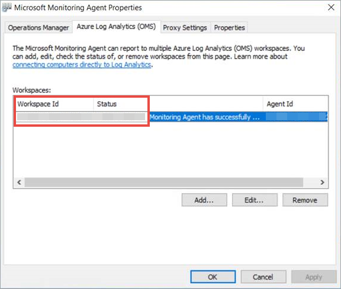

# <a name="onboard-windows-servers-to-the-microsoft-defender-for-endpoint-service"></a>Onboarding Windows-Server in den Microsoft Defender für Endpunktdienst

[!INCLUDE [Microsoft 365 Defender rebranding](../../includes/microsoft-defender.md)]

**Gilt für:**

- Windows Server 2008 R2 SP1
- Windows Server 2012 R2
- Windows Server 2016
- Windows Server (SAC) Version 1803 und höher
- Windows Server 2019 und höher
- Windows Server 2019 Core Edition

> Möchten Sie Defender für Endpunkt erfahren? [Registrieren Sie sich für eine kostenlose Testversion](https://www.microsoft.com/microsoft-365/windows/microsoft-defender-atp?ocid=docs-wdatp-configserver-abovefoldlink)

Defender für Endpunkt erweitert die Unterstützung, um auch das Windows Server-Betriebssystem einzuschließen. Diese Unterstützung bietet erweiterte Angriffserkennungs- und Untersuchungsfunktionen nahtlos über die Microsoft 365 Defender Konsole.

Eine praktische Anleitung dazu, was für Lizenzierung und Infrastruktur erforderlich ist, finden Sie unter ["Schützen Windows Server mit Defender für Endpunkt".](https://techcommunity.microsoft.com/t5/What-s-New/Protecting-Windows-Server-with-Windows-Defender-ATP/m-p/267114#M128)

Anleitungen zum Herunterladen und Verwenden von Windows-Sicherheit Baselines für Windows Server finden Sie unter [Windows-Sicherheit Baselines](/windows/device-security/windows-security-baselines).

## <a name="windows-server-2008-r2-sp1-windows-server-2012-r2-and-windows-server-2016"></a>Windows Server 2008 R2 SP1, Windows Server 2012 R2 und Windows Server 2016

Sie können Windows Server 2008 R2 SP1, Windows Server 2012 R2 und Windows Server 2016 mithilfe einer der folgenden Optionen in Defender für Endpunkt integrieren:

- **Option 1:** [Onboarding durch Installieren und Konfigurieren von Microsoft Monitoring Agent (MMA)](#option-1-onboard-by-installing-and-configuring-microsoft-monitoring-agent-mma)
- **Option 2:** [Onboarding über das Azure Security Center](#option-2-onboard-windows-servers-through-azure-security-center)
- **Option 3:** [Onboarding bis Microsoft Endpoint Manager Version 2002 und höher](#option-3-onboard-windows-servers-through-microsoft-endpoint-manager-version-2002-and-later)

Nach Abschluss der Integrationsschritte mithilfe einer der bereitgestellten Optionen müssen Sie [System Center Endpoint Protection Clients konfigurieren und aktualisieren.](#configure-and-update-system-center-endpoint-protection-clients)

> [!NOTE]
> Die eigenständige Serverlizenz für Defender für Endpunkt ist pro Knoten erforderlich, um einen Windows Server über Microsoft Monitoring Agent (Option 1) oder über Microsoft Endpoint Manager (Option 3) zu integrieren. Alternativ ist eine Azure Defender für Server-Lizenz pro Knoten erforderlich, um einen Windows Server über das Azure Security Center (Option 2) zu integrieren. Weitere Informationen finden Sie unter ["Unterstützte Features" in Azure Defender.](/azure/security-center/security-center-services)

### <a name="option-1-onboard-by-installing-and-configuring-microsoft-monitoring-agent-mma"></a>Option 1: Onboarding durch Installieren und Konfigurieren von Microsoft Monitoring Agent (MMA)

Sie müssen MMA für Windows Server installieren und konfigurieren, um Sensordaten an Defender für Endpunkt zu melden. Weitere Informationen finden Sie unter [Sammeln von Protokolldaten mit dem Azure Log Analytics-Agent.](/azure/azure-monitor/platform/log-analytics-agent)

Wenn Sie bereits System Center Operations Manager (SCOM) oder Azure Monitor (früher Operations Management Suite (OMS) verwenden, fügen Sie die Microsoft Monitoring Agent (MMA) an, um über multihoming-Unterstützung An Ihren Defender für Endpunkt-Arbeitsbereich zu melden.

Im Allgemeinen müssen Sie die folgenden Schritte ausführen:

1. Erfüllen Sie die Onboardinganforderungen, die im Abschnitt **"Bevor Sie beginnen"** beschrieben sind.
2. Aktivieren Sie die Serverüberwachung über Microsoft 365 Defender Portal.
3. Installieren und konfigurieren Sie MMA für den Server, um Sensordaten an Defender für Endpunkt zu melden.
4. Konfigurieren und Aktualisieren System Center Endpoint Protection Clients.

> [!TIP]
> Nach dem Onboarding des Geräts können Sie einen Erkennungstest ausführen, um zu überprüfen, ob es ordnungsgemäß in den Dienst integriert ist. Weitere Informationen finden Sie unter [Ausführen eines Erkennungstests auf einem neu integrierten Defender für Endpunkt-Endpunkt.](run-detection-test.md)

#### <a name="before-you-begin"></a>Bevor Sie beginnen

Führen Sie die folgenden Schritte aus, um die Onboardinganforderungen zu erfüllen:

Stellen Sie für Windows Server 2008 R2 SP1 oder Windows Server 2012 R2 sicher, dass Sie den folgenden Hotfix installieren:

- [Update für Kundenerfahrung und Diagnosetelemetrie](https://support.microsoft.com/help/3080149/update-for-customer-experience-and-diagnostic-telemetry)

Stellen Sie für Windows Server 2008 R2 SP1 sicher, dass Sie die folgenden Anforderungen erfüllen:

- Installieren des [monatlichen Updaterollups](https://support.microsoft.com/help/4074598/windows-7-update-kb4074598) vom Februar
- Installieren Von [.NET Framework 4.5](https://www.microsoft.com/download/details.aspx?id=30653) (oder höher) oder [KB3154518](https://support.microsoft.com/help/3154518/support-for-tls-system-default-versions-included-in-the-net-framework)

    > [!NOTE]
    > Wenn Sie Ihre Windows Server 2008 R2 SP1 mit SCCM verwalten, installiert der SCCM-Client-Agent .Net Framework 4.5.2. Daher müssen Sie .NET Framework 4.5 (oder höher) nicht installieren.

Für Windows Server 2008 R2 SP1 und Windows Server 2012 R2: [Konfigurieren und Aktualisieren System Center Endpoint Protection Clients.](#configure-and-update-system-center-endpoint-protection-clients)

> [!NOTE]
> Dieser Schritt ist nur erforderlich, wenn Ihre Organisation System Center Endpoint Protection (SCEP) verwendet und Sie Windows Server 2008 R2 SP1 und Windows Server 2012 R2 integrieren.

### <a name="install-and-configure-microsoft-monitoring-agent-mma-to-report-sensor-data-to-microsoft-defender-for-endpoint"></a>Installieren und Konfigurieren von Microsoft Monitoring Agent (MMA), um Sensordaten an Microsoft Defender für Endpunkt zu melden

1. Laden Sie die Agent-Setupdatei herunter: [Windows 64-Bit-Agent.](https://go.microsoft.com/fwlink/?LinkId=828603)

2. Wählen Sie unter Verwendung der Arbeitsbereichs-ID und des Arbeitsbereichsschlüssels, die Sie im vorherigen Verfahren erhalten haben, eine der folgenden Installationsmethoden aus, um den Agent auf dem Windows Server zu installieren:
    - [Installieren Sie den Agent manuell mithilfe des Setups.](/azure/log-analytics/log-analytics-windows-agents#install-agent-using-setup-wizard) 
    Wählen Sie auf der Seite **"Agent-Setupoptionen"** **Verbinden agent zu Azure Log Analytics (OMS)** aus.
    - [Installieren Sie den Agent über die Befehlszeile.](/azure/log-analytics/log-analytics-windows-agents#install-agent-using-command-line)
    - [Konfigurieren Sie den Agent mithilfe eines Skripts.](/azure/log-analytics/log-analytics-windows-agents#install-agent-using-dsc-in-azure-automation)

> [!NOTE]
> Wenn Sie [US Government-Kunde](gov.md)sind, müssen Sie unter "Azure Cloud" "Azure US Government" auswählen, wenn Sie den Setup-Assistenten verwenden oder eine Befehlszeile oder ein Skript verwenden – legen Sie den Parameter "OPINSIGHTS_WORKSPACE_AZURE_CLOUD_TYPE" auf 1 fest.

### <a name="configure-windows-server-proxy-and-internet-connectivity-settings-if-needed"></a>Konfigurieren Windows Serverproxy- und Internetkonnektivitätseinstellungen bei Bedarf

Wenn Ihre Server einen Proxy für die Kommunikation mit Defender für Endpunkt verwenden müssen, verwenden Sie eine der folgenden Methoden, um das MMA für die Verwendung des Proxyservers zu konfigurieren:

- [Konfigurieren des MMA für die Verwendung eines Proxyservers](/azure/azure-monitor/platform/agent-windows#install-agent-using-setup-wizard)

- [Konfigurieren Windows für die Verwendung eines Proxyservers für alle Verbindungen](configure-proxy-internet.md)

Wenn ein Proxy oder eine Firewall verwendet wird, stellen Sie sicher, dass Server direkt und ohne SSL-Abfangen auf alle URLs des Microsoft Defender für Endpunktdiensts zugreifen können. Weitere Informationen finden Sie unter [Aktivieren des Zugriffs auf Defender für Endpunkt-Dienst-URLs.](configure-proxy-internet.md#enable-access-to-microsoft-defender-for-endpoint-service-urls-in-the-proxy-server) Die Verwendung von SSL-Abfangen verhindert, dass das System mit dem Defender für Endpunkt-Dienst kommuniziert.

Nach Abschluss des Vorgangs sollten Innerhalb einer Stunde integrierte Windows-Server im Portal angezeigt werden.

### <a name="option-2-onboard-windows-servers-through-azure-security-center"></a>Option 2: Onboarding von Windows Servern über das Azure Security Center

1. Wählen Sie im Navigationsbereich Microsoft 365 Defender **Einstellungen** Device Management Onboarding für  >  **Endpunkte**  >    >  aus.

2. Wählen Sie **Windows Server 2008 R2 SP1, 2012 R2 und 2016** als Betriebssystem aus.

3. Klicken Sie auf **"Server im Azure Security Center integrieren".**

4. Folgen Sie den Onboarding-Anweisungen in [Microsoft Defender für Endpunkt mit Azure Defender,](/azure/security-center/security-center-wdatp) und wenn Sie Azure ARC verwenden, befolgen Sie die Onboarding-Anweisungen unter Aktivieren der Integration von Microsoft Defender für [Endpunkt.](/azure/security-center/security-center-wdatp#enabling-the-microsoft-defender-for-endpoint-integration)

Nach Abschluss der Integrationsschritte müssen Sie [System Center Endpoint Protection Clients konfigurieren und aktualisieren.](#configure-and-update-system-center-endpoint-protection-clients)

> [!NOTE]
>
> - Damit das Onboarding über Azure Defender für Server wie erwartet funktioniert, müssen auf dem Server ein entsprechender Arbeitsbereich und Schlüssel in den MMA-Einstellungen (Microsoft Monitoring Agent) konfiguriert sein.
> - Nach der Konfiguration wird das entsprechende Cloud Management Pack auf dem Computer bereitgestellt, und der Sensorprozess (MsSenseS.exe) wird bereitgestellt und gestartet.
> - Dies ist auch erforderlich, wenn der Server für die Verwendung eines OMS-Gatewayservers als Proxy konfiguriert ist.

### <a name="option-3-onboard-windows-servers-through-microsoft-endpoint-manager-version-2002-and-later"></a>Option 3: Onboarding von Windows Servern bis Microsoft Endpoint Manager Version 2002 und höher

Sie können Windows Server 2012 R2 und Windows Server 2016 mit Microsoft Endpoint Manager Version 2002 und höher integrieren. Weitere Informationen finden Sie unter [Microsoft Defender für Endpunkt in Microsoft Endpoint Manager aktuelle Verzweigung.](/mem/configmgr/protect/deploy-use/defender-advanced-threat-protection)

Nach Abschluss der Integrationsschritte müssen Sie [System Center Endpoint Protection Clients konfigurieren und aktualisieren.](#configure-and-update-system-center-endpoint-protection-clients)

## <a name="windows-server-sac-version-1803-windows-server-2019-and-windows-server-2019-core-edition"></a>Windows Server (SAC) Version 1803, Windows Server 2019 und Windows Server 2019 Core Edition

Sie können Windows Server (SAC) Version 1803, Windows Server 2019 oder Windows Server 2019 Core Edition mithilfe der folgenden Bereitstellungsmethoden integrieren:

- [Lokales Skript](configure-endpoints-script.md)
- [Gruppenrichtlinie](configure-endpoints-gp.md)
- [Microsoft Endpoint Configuration Manager](configure-endpoints-sccm.md)
- [System Center Configuration Manager 2012 / 2012 R2 1511 / 1602](configure-endpoints-sccm.md#onboard-devices-using-system-center-configuration-manager)
- [VDI-Integrationsskripts für nicht persistente Geräte](configure-endpoints-vdi.md)

> [!NOTE]
>
> - Das Onboarding-Paket für Windows Server 2019 bis Microsoft Endpoint Manager enthält derzeit ein Skript. Weitere Informationen zum Bereitstellen von Skripts in Configuration Manager finden Sie unter [Pakete und Programme in Configuration Manager.](/configmgr/apps/deploy-use/packages-and-programs)
> - Ein lokales Skript eignet sich für einen Machbarkeitsstudie, sollte jedoch nicht für die Produktionsbereitstellung verwendet werden. Für eine Produktionsbereitstellung empfehlen wir die Verwendung von Gruppenrichtlinien oder Microsoft Endpoint Configuration Manager.

Die Unterstützung für Windows Server bietet einen tieferen Einblick in Serveraktivitäten, die Abdeckung der Kernel- und Speicherangriffserkennung und ermöglicht Reaktionsaktionen.

1. Konfigurieren Sie die Integrationseinstellungen für Defender für Endpunkte auf dem Windows Server mit den gleichen Tools und Methoden für Windows 10 Geräte. Weitere Informationen finden Sie unter [Onboarding Windows 10 Geräte.](configure-endpoints.md)

2. Wenn Sie eine Antischadsoftware-Lösung eines Drittanbieters ausführen, müssen Sie die folgenden Einstellungen für den passiven Microsoft Defender AV-Modus anwenden. Stellen Sie sicher, dass es ordnungsgemäß konfiguriert wurde:

    1. Legen Sie den folgenden Registrierungseintrag fest:
       - Pfad: `HKLM\SOFTWARE\Policies\Microsoft\Windows Advanced Threat Protection`
       - Name: ForceDefenderPassiveMode
       - Typ: REG_DWORD
       - Value: 1

    1. Führen Sie den folgenden PowerShell-Befehl aus, um zu überprüfen, ob der passive Modus konfiguriert wurde:

       ```PowerShell
       Get-WinEvent -FilterHashtable @{ProviderName="Microsoft-Windows-Sense" ;ID=84}
       ```

    1. Vergewissern Sie sich, dass ein kürzlich gefundenes Ereignis gefunden wurde, das das Passive Mode-Ereignis enthält:

       

3. Führen Sie den folgenden Befehl aus, um zu überprüfen, ob Microsoft Defender AV installiert ist:

   ```sc.exe query Windefend```

    Wenn das Ergebnis "Der angegebene Dienst ist nicht als installierter Dienst vorhanden" lautet, müssen Sie Microsoft Defender AV installieren. Weitere Informationen finden Sie unter [Microsoft Defender Antivirus in Windows 10](/windows/security/threat-protection/microsoft-defender-antivirus/microsoft-defender-antivirus-in-windows-10).

    Informationen zur Verwendung von Gruppenrichtlinien zum Konfigurieren und Verwalten von Microsoft Defender Antivirus auf Ihren Windows Servern finden Sie unter [Verwenden von Gruppenrichtlinieneinstellungen zum Konfigurieren und Verwalten Microsoft Defender Antivirus.](/windows/security/threat-protection/microsoft-defender-antivirus/use-group-policy-microsoft-defender-antivirus)

## <a name="integration-with-azure-defender"></a>Integration in Azure Defender

Defender für Endpunkt kann in Azure Defender integriert werden, um eine umfassende Windows Serverschutzlösung bereitzustellen. Mit dieser Integration kann Azure Defender die Leistungsfähigkeit von Defender für Endpunkt nutzen, um eine verbesserte Bedrohungserkennung für Windows Server bereitzustellen.

Die folgenden Funktionen sind in dieser Integration enthalten:

- Automatisiertes Onboarding – Der Defender für Endpunkt-Sensor wird automatisch auf Windows Servern aktiviert, die in Azure Defender integriert sind. Weitere Informationen zum Azure Defender-Onboarding finden Sie unter [Verwenden der integrierten Microsoft Defender für Endpunkt-Lizenz.](/azure/security-center/security-center-wdatp)

    > [!NOTE]
    > Die Integration zwischen Azure Defender für Server und Microsoft Defender für Endpunkt wurde erweitert, um [Windows Server 2019 und Windows Virtual Desktop (WVD)](/azure/security-center/release-notes#microsoft-defender-for-endpoint-integration-with-azure-defender-now-supports-windows-server-2019-and-windows-10-virtual-desktop-wvd-in-preview)zu unterstützen.

- Windows Server, die von Azure Defender überwacht werden, sind auch in Defender für Endpunkt verfügbar – Azure Defender stellt eine nahtlose Verbindung mit dem Defender für Endpunkt-Mandanten her und bietet eine einzige Ansicht über Clients und Server hinweg.  Darüber hinaus sind Defender für Endpunkt-Warnungen in der Azure Defender-Konsole verfügbar.
- Serveruntersuchung– Azure Defender-Kunden können auf Microsoft 365 Defender Portal zugreifen, um detaillierte Untersuchungen durchzuführen, um den Umfang einer potenziellen Verletzung aufdecken zu können.

> [!IMPORTANT]
> - Wenn Sie Azure Defender zum Überwachen von Servern verwenden, wird automatisch ein Defender für Endpunkt-Mandant erstellt (in den USA für US-Benutzer, in der EU für Benutzer in Europa und Großbritannien).<br>
Von Defender für Endpunkt gesammelte Daten werden am geografischen Standort des Mandanten gespeichert, wie bei der Bereitstellung identifiziert.
> - Wenn Sie Defender für Endpunkt vor der Verwendung von Azure Defender verwenden, werden Ihre Daten an dem Speicherort gespeichert, den Sie beim Erstellen Ihres Mandanten angegeben haben, auch wenn Sie zu einem späteren Zeitpunkt in Azure Defender integriert sind.
> - Nach der Konfiguration können Sie den Speicherort Ihrer Daten nicht mehr ändern. Wenn Sie Ihre Daten an einen anderen Speicherort verschieben müssen, müssen Sie sich an den Microsoft-Support wenden, um den Mandanten zurückzusetzen. <br>
Die Serverendpunktüberwachung mit dieser Integration wurde für Office 365 GCC Kunden deaktiviert.

## <a name="configure-and-update-system-center-endpoint-protection-clients"></a>Konfigurieren und Aktualisieren System Center Endpoint Protection Clients

Defender für Endpunkt lässt sich in System Center Endpoint Protection integrieren. Die Integration bietet Sichtbarkeit für Schadsoftwareerkennungen und das Beenden der Verbreitung eines Angriffs in Ihrer Organisation, indem potenziell schädliche Dateien oder verdächtige Schadsoftware verboten werden.

Die folgenden Schritte sind erforderlich, um diese Integration zu ermöglichen:

- Installieren Sie das [Plattformupdate für die Antischadsoftware-Plattform vom Januar 2017 für Endpoint Protection Clients.](https://support.microsoft.com/help/3209361/january-2017-anti-malware-platform-update-for-endpoint-protection-clie)

- [Konfigurieren Sie die SCEP-Client-Cloud Protection Service-Mitgliedschaft](/windows/security/threat-protection/microsoft-defender-antivirus/enable-cloud-protection-microsoft-defender-antivirus) mit der **Erweiterten** Einstellung.

## <a name="offboard-windows-servers"></a>Offboarding Windows Server

Sie können Windows Server (SAC), Windows Server 2019 und Windows Server 2019 Core Edition in derselben Methode offboarden, die für Windows 10 Clientgeräte verfügbar ist.

- [Offboarding mithilfe von Gruppenrichtlinien](configure-endpoints-gp.md#offboard-devices-using-group-policy)
- [Offboarding von Geräten mit Configuration Manager](configure-endpoints-sccm.md#offboard-devices-using-configuration-manager)
- [Offboarding und Überwachen von Geräten mithilfe von Tools für die mobile Geräteverwaltung](configure-endpoints-mdm.md#offboard-and-monitor-devices-using-mobile-device-management-tools)
- [Offboarding von Geräten mithilfe eines lokalen Skripts](configure-endpoints-script.md#offboard-devices-using-a-local-script)


Für andere Windows Serverversionen haben Sie zwei Möglichkeiten, Windows Server aus dem Dienst zu offboarden:

- Deinstallieren des MMA-Agents
- Entfernen der Defender für Endpunkt-Arbeitsbereichskonfiguration

> [!NOTE]
> Das Offboarding bewirkt, dass der Windows-Server das Senden von Sensordaten an das Portal beendet, aber Daten vom Windows Server, einschließlich Verweise auf alle Warnungen, die er gesendet hat, werden bis zu 6 Monate lang aufbewahrt.

### <a name="uninstall-windows-servers-by-uninstalling-the-mma-agent"></a>Deinstallieren sie Windows Server, indem Sie den MMA-Agent deinstallieren.

Um den Windows Server zu offboarden, können Sie den MMA-Agent vom Windows-Server deinstallieren oder ihn von der Berichterstellung an Ihren Defender für Endpunkt-Arbeitsbereich trennen. Nach dem Offboarding des Agents sendet der Windows Server keine Sensordaten mehr an Defender für Endpunkt.
Weitere Informationen finden Sie unter [So deaktivieren Sie einen Agent.](/azure/log-analytics/log-analytics-windows-agents#to-disable-an-agent)

### <a name="remove-the-defender-for-endpoint-workspace-configuration"></a>Entfernen der Defender für Endpunkt-Arbeitsbereichskonfiguration

Zum Offboarding des Windows Servers können Sie eine der folgenden Methoden verwenden:

- Entfernen der Defender für Endpunkt-Arbeitsbereichskonfiguration aus dem MMA-Agent
- Ausführen eines PowerShell-Befehls zum Entfernen der Konfiguration

#### <a name="remove-the-defender-for-endpoint-workspace-configuration-from-the-mma-agent"></a>Entfernen der Defender für Endpunkt-Arbeitsbereichskonfiguration aus dem MMA-Agent

1. Wählen Sie in der **Microsoft Monitoring Agent Eigenschaften** die Registerkarte Azure Log **Analytics (OMS)** aus.

2. Wählen Sie den Defender für Endpunkt-Arbeitsbereich aus, und klicken Sie auf **"Entfernen".**

    

#### <a name="run-a-powershell-command-to-remove-the-configuration"></a>Ausführen eines PowerShell-Befehls zum Entfernen der Konfiguration

1. Abrufen Ihrer Arbeitsbereichs-ID:

   1. Wählen Sie im Navigationsbereich Microsoft 365 Defender **Einstellungen** Device Management Onboarding für  >  **Endpunkte**  >    >  aus.

   1. Wählen Sie **Windows Server 2008 R2 SP1, 2012 R2 und 2016** als Betriebssystem aus, und rufen Sie Ihre Arbeitsbereichs-ID ab:

      

2. Öffnen Sie eine PowerShell mit erhöhten Rechten, und führen Sie den folgenden Befehl aus. Verwenden Sie die Arbeitsbereichs-ID, die Sie abgerufen und ersetzt `WorkspaceID` haben:

    ```powershell
    $ErrorActionPreference = "SilentlyContinue&quot;
    # Load agent scripting object
    $AgentCfg = New-Object -ComObject AgentConfigManager.MgmtSvcCfg
    # Remove OMS Workspace
    $AgentCfg.RemoveCloudWorkspace(&quot;WorkspaceID")
    # Reload the configuration and apply changes
    $AgentCfg.ReloadConfiguration()

    ```

## <a name="onboarding-servers-with-no-management-solution"></a>Onboarding von Servern ohne Verwaltungslösung

### <a name="using-group-policy"></a>Verwenden von Gruppenrichtlinien

**Schritt 1: Erstellen Sie die erforderlichen Dateien zum Kopieren auf die Server.**

1. Navigieren Sie zu "c:\windows\sysvol\domain\scripts" (Die Änderungssteuerung kann auf einem der Domänencontroller erforderlich sein.)
1. Erstellen Sie einen Ordner mit dem Namen MMA.
1. Laden Sie Folgendes herunter, und fügen Sie es in den MMA-Ordner ein:

    **Update für Die Benutzererfahrung und Diagnosetelemetrie (Windows Server 2008 R2 und Windows Server 2012 R2)**

    [Für Windows 2008 R2 x64](https://www.microsoft.com/download/details.aspx?familyid=1bd1d18d-4631-4d8e-a897-327925765f71)

    [For Windows 2012 R2 x64](https://www.microsoft.com/download/details.aspx?familyid=94cf6d85-017a-4c4c-afca-7d00721b500f)

    > [!NOTE]
    > In diesem Artikel wird davon ausgegangen, dass Sie x64-basierte Server verwenden (MMA-Agent .exe x64 [Neue SHA-2-kompatible Version)](https://go.microsoft.com/fwlink/?LinkId=828603)

**Schritt 2: Erstellen eines Dateinamens "DeployMMA.cmd" (mit Editor)** Fügen Sie der cmd-Datei die folgenden Zeilen hinzu. Beachten Sie, dass Sie Ihre ARBEITSBEREICHs-ID und IHREN SCHLÜSSEL benötigen.

```dos
@echo off 
cd "C:"
IF EXIST "C:\Program Files\Microsoft Monitoring Agent\Agent\MonitoringHost.exe" ( 
exit
) ELSE (
wusa.exe c:\Windows\MMA\Windows6.1-KB123456-x86.msu /quiet /norestart
wusa.exe c:\Windows\MMA\Windows8.1-KB123456-x86.msu /quiet /norestart
"c:\windows\MMA\MMASetup-AMD64.exe" /C:"setup.exe /qn ADD_OPINSIGHTS_WORKSPACE=1
OPINSIGHTS_WORKSPACE_ID=<your workspace ID>
OPINSIGHTS_WORKSPACE_KEY=<your workspace key>== AcceptEndUserLicenseAgreement=1"
)
```

## <a name="group-policy-configuration"></a>Gruppenrichtlinienkonfiguration

Erstellen Sie eine neue Gruppenrichtlinie speziell für das Onboarding von Geräten wie "Microsoft Defender für Endpunkt-Onboarding".

- Erstellen eines Gruppenrichtlinienordners mit dem Namen "c:\windows\MMA"

     :::image type="content" source="images/grppolicyconfig1.png" alt-text="Ordner":::

    **Dadurch wird ein neuer Ordner auf jedem Server hinzugefügt, der das angewendete Gruppenrichtlinienobjekt (mma) erhält und in c:\windows gespeichert wird. Dieser enthält die Installationsdateien für das MMA, die erforderlichen Komponenten und das Installationsskript.**

- Erstellen Sie eine Einstellung für Gruppenrichtliniendateien für jede der dateien, die in der Net-Anmeldung gespeichert sind.

     :::image type="content" source="images/grppolicyconfig2.png" alt-text="Gruppenrichtlinienbild1":::

Die Dateien werden von DOMAIN\NETLOGON\MMA\filename in C:\windows\MMA\filename kopiert, **sodass sich die Installationsdateien lokal auf dem Server befinden:**

:::image type="content" source="images/deploymma.png" alt-text="mma cmd bereitstellen":::

Wiederholen Sie für die beiden KBs (eine für Windows Server 2008R2/Windows 7 und die andere für Windows Server 2012 R2) den Vorgang, erstellen Sie jedoch die Zielzuordnung auf Elementebene auf der Registerkarte COMMON, sodass die Datei nur in die entsprechende Plattform-/Betriebssystemversion im Bereich kopiert wird:

:::image type="content" source="images/targeteditor.png" alt-text="Ziel-Editor":::

- For Windows Server 2008 R2 you need (and it will only copy down) Windows6.1-BJ3080149-x64.msu
- For Windows Server 2012 R2 you need (and it will only copy down) Windows8.1-BJ3080149-x64.msu

Danach müssen Sie eine Startskriptrichtlinie erstellen:

:::image type="content" source="images/startupprops.png" alt-text="Starteigenschaften":::

Der Name der hier auszuführenden Datei lautet "c:\windows\MMA\DeployMMA.cmd".
Nachdem der Server im Rahmen des Startvorgangs neu gestartet wurde, installiert er das Update für die Kundenerfahrung und Diagnosetelemetrie KB und installiert dann den MMA-Agent, während Die Arbeitsbereichs-ID und der Schlüssel festgelegt werden, und der Server wird integriert.

Sie können auch eine **sofortige Aufgabe** verwenden, um "deployMMA.cmd" auszuführen, wenn Sie nicht alle Server neu starten möchten.
Dies kann in zwei Phasen erfolgen. Erstellen Sie zuerst **die Dateien und den Ordner im** Gruppenrichtlinienobjekt– Geben Sie dem System Zeit, um sicherzustellen, dass das Gruppenrichtlinienobjekt angewendet wurde, und alle Server verfügen über die Installationsdateien. Fügen Sie dann die sofort ausgeführte Aufgabe hinzu. Dadurch wird dasselbe Ergebnis erzielt, ohne dass ein Neustart erforderlich ist.

Da das Skript über eine Exit-Methode verfügt und nicht erneut ausgeführt wird, wenn das MMA installiert ist, können Sie auch eine tägliche geplante Aufgabe verwenden, um dasselbe Ergebnis zu erzielen. Ähnlich wie bei einer Configuration Manager-Compliancerichtlinie wird täglich überprüft, ob das MMA vorhanden ist.

:::image type="content" source="images/schtask.png" alt-text="Aufgabe planen":::

:::image type="content" source="images/newtaskprops.png" alt-text="Neue Aufgabeneigenschaften":::

:::image type="content" source="images/deploymmadowmload.png" alt-text="Bereitstellen von mma-Download-Eigenschaften":::

:::image type="content" source="images/tasksch.png" alt-text="Aufgabenplaner":::

Wie in der Onboardingdokumentation für Server speziell für Server 2008 R2 erwähnt, finden Sie weitere Informationen unten:

Stellen Sie für Windows Server 2008 R2 PS1 sicher, dass Sie die folgenden Anforderungen erfüllen:

- Installieren des [monatlichen Updaterollups vom Februar 2018](https://support.microsoft.com/help/4074598/windows-7-update-kb4074598)
  
- Installieren Von [.NET Framework 4.5](https://www.microsoft.com/download/details.aspx?id=30653) (oder höher) oder [KB3154518](https://support.microsoft.com/help/3154518/support-for-tls-system-default-versions-included-in-the-net-framework)

Überprüfen Sie, ob die KBs vorhanden sind, bevor Sie Windows Server 2008 R2 integrieren. Mit diesem Prozess können Sie alle Server integrieren, wenn Configuration Manager keine Server verwaltet.

## <a name="related-topics"></a>Verwandte Themen

- [Onboarding von Windows 10-Geräten](configure-endpoints.md)
- [Onboarding von Nicht-Windows-Geräten](configure-endpoints-non-windows.md)
- [Konfigurieren der Einstellungen für Endpunktproxy und Internetkonnektivität für Ihren Azure ATP-Sensor](configure-proxy-internet.md)
- [Ausführen eines Erkennungstests auf einem neu integrierten Defender für Endpunktgerät](run-detection-test.md)
- [Behandeln von Problemen beim Onboarding von Microsoft Defender für Endpunkten](troubleshoot-onboarding.md)
