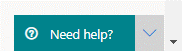

# Kontaktieren des Microsoft Defender for Endpoint-SupportContact Microsoft Defender for Endpoint support

[!INCLUDE [Microsoft 365 Defender rebranding](../../includes/microsoft-defender.md)]

**Gilt für:****Applies to:**
- [Microsoft Defender für EndpunktMicrosoft Defender for Endpoint](https://go.microsoft.com/fwlink/p/?linkid=2154037)
- [Microsoft 365 DefenderMicrosoft 365 Defender](https://go.microsoft.com/fwlink/?linkid=2118804)

>Möchten Sie Defender for Endpoint erleben?Want to experience Defender for Endpoint? [Registrieren Sie sich für eine kostenlose Testversion.Sign up for a free trial.](https://www.microsoft.com/microsoft-365/windows/microsoft-defender-atp?ocid=docs-wdatp-assignaccess-abovefoldlink)

Defender for Endpoint hat den Supportprozess kürzlich aktualisiert, um eine modernere und erweiterte Supporterfahrung zu bieten.Defender for Endpoint has recently upgraded the support process to offer a more modern and advanced support experience. 

Das neue Widget ermöglicht Kunden:The new widget allows customers to:
- Suchen von Lösungen für häufige ProblemeFind solutions to common problems
- Übermitteln eines Supportfalles an das Microsoft-SupportteamSubmit a support case to the Microsoft support team

## VoraussetzungenPrerequisites
Es ist wichtig, die spezifischen Rollen zu kennen, die über die Berechtigung zum Öffnen von Supportfällen verfügen.It's important to know the specific roles that have permission to open support cases.

Sie müssen mindestens über eine Rolle  "Dienstsupportadministrator" oder "Helpdeskadministrator" verfügen.At a minimum, you must have a Service Support Administrator **OR** Helpdesk Administrator role.

Weitere Informationen dazu, welche Rollen über Berechtigungen verfügen, finden Sie unter [Security Administrator permissions](https://docs.microsoft.com/azure/active-directory/users-groups-roles/directory-assign-admin-roles#security-administrator-permissions).For more information on which roles have permission see, [Security Administrator permissions](https://docs.microsoft.com/azure/active-directory/users-groups-roles/directory-assign-admin-roles#security-administrator-permissions). Rollen, die die Aktion `microsoft.office365.supportTickets/allEntities/allTasks` enthalten, können einen Fall übermitteln.Roles that include the action `microsoft.office365.supportTickets/allEntities/allTasks` can submit a case.

Allgemeine Informationen zu Administratorrollen finden Sie unter [Informationen zu Administratorrollen](https://docs.microsoft.com/microsoft-365/admin/add-users/about-admin-roles?view=o365-worldwide&preserve-view=true).For general information on admin roles, see [About admin roles](https://docs.microsoft.com/microsoft-365/admin/add-users/about-admin-roles?view=o365-worldwide&preserve-view=true).

## Zugreifen auf das WidgetAccess the widget
Der Zugriff auf das neue Support-Widget kann auf zwei Arten erfolgen:Accessing the new support widget can be done in one of two ways:

1.  Klicken Sie oben rechts im Portal auf das Fragezeichen, und klicken Sie dann auf "Microsoft Support":Clicking on the question mark on the top right of the portal and then clicking on "Microsoft support":

    

2. Klicken Sie auf Die **Hilfe benötigen?**Clicking on the **Need help?**  schaltfläche unten rechts im Microsoft Defender Security Center:button in the bottom right of the Microsoft Defender Security Center:

    

Im Widget werden ihnen zwei Optionen angeboten:In the widget you will be offered two options:

- Suchen von Lösungen für häufige ProblemeFind solutions to common problems    
- Öffnen einer ServiceanfrageOpen a service request  

## Suchen von Lösungen für häufige ProblemeFind solutions to common problems
Diese Option enthält Artikel, die sich möglicherweise auf die Frage, die Sie stellen können, bezogen sind.This option includes articles that might be related to the question you may ask. Geben Sie einfach die Frage in das Suchfeld ein, und Artikel zu Ihrer Suche werden angezeigt.Just start typing the question in the search box and articles related to your search will be surfaced.

Falls die vorgeschlagenen Artikel nicht ausreichen, können Sie eine Dienstanforderung öffnen.In case the suggested articles are not sufficient, you can open a service request.

## Öffnen einer ServiceanfrageOpen a service request

Erfahren Sie, wie Sie Supporttickets öffnen, indem Sie sich an den Defender for Endpoint-Support wenden.Learn how to open support tickets by contacting Defender for Endpoint support. 

### Support kontaktierenContact support
Diese Option ist verfügbar, indem Sie auf das Symbol klicken, das wie ein Headset aussieht.This option is available by clicking the icon that looks like a headset. Sie erhalten dann die folgende Seite, um Ihren Supportfall zu übermitteln:You will then get the following page to submit your support case:

1. Geben Sie einen Titel und eine Beschreibung für das Problem ein, mit dem Sie konfrontiert sind, sowie eine Telefonnummer und E-Mail-Adresse, unter der wir Sie möglicherweise erreichen können.Fill in a title and description for the issue you are facing, as well as a phone number and email address where we may reach you. 

2. (Optional) Fügen Sie bis zu fünf Anlagen ein, die für das Problem relevant sind, um zusätzlichen Kontext für den Supportfall zu bieten.(Optional) Include up to five attachments that are relevant to the issue in order to provide additional context for the support case. 

3. Wählen Sie ggf. Ihre Zeitzone und eine alternative Sprache aus.Select your time zone and an alternative language, if applicable. Die Anforderung wird an das Microsoft Support Team gesendet.The request will be sent to Microsoft Support Team. Das Team antwortet in Kürze auf Ihre Dienstanfrage.The team will respond to your service request shortly.

## Verwandte ThemenRelated topics
- [Behandeln von DienstproblemenTroubleshoot service issues](troubleshoot-mdatp.md)
- [Überprüfen des DienstzustandsCheck service health](service-status.md)