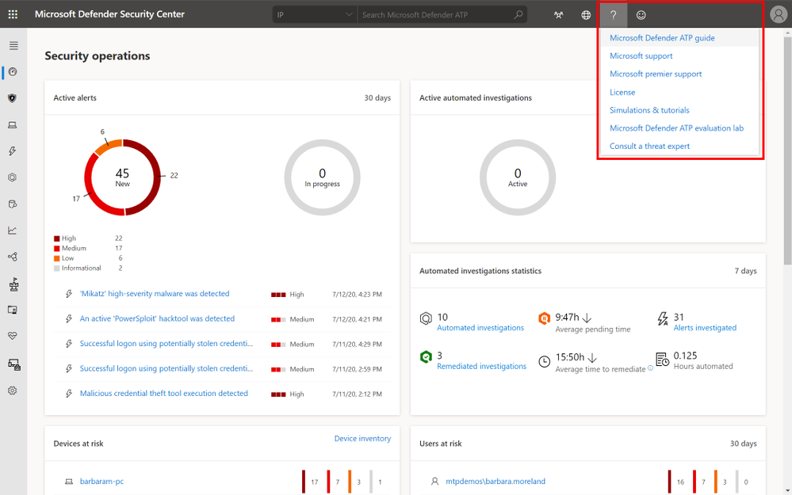

# Kontaktieren des Microsoft Defender für Endpunkt-Support

[!INCLUDE [Microsoft 365 Defender rebranding](../../includes/microsoft-defender.md)]

**Gilt für:**
- [Microsoft Defender für Endpunkt](https://go.microsoft.com/fwlink/p/?linkid=2154037)
- [Microsoft 365 Defender](https://go.microsoft.com/fwlink/?linkid=2118804)

>Möchten Sie Defender for Endpoint erleben? [Registrieren Sie sich für eine kostenlose Testversion.](https://www.microsoft.com/microsoft-365/windows/microsoft-defender-atp?ocid=docs-wdatp-assignaccess-abovefoldlink)

Defender for Endpoint hat den Supportprozess kürzlich aktualisiert, um eine modernere und erweiterte Supporterfahrung zu bieten. 

Das neue Widget ermöglicht Kunden:
- Suchen von Lösungen für häufige Probleme
- Übermitteln eines Supportfalles an das Microsoft-Supportteam

## Voraussetzungen
Es ist wichtig, die spezifischen Rollen zu kennen, die über die Berechtigung zum Öffnen von Supportfällen verfügen.

Sie müssen mindestens über eine Rolle  "Dienstsupportadministrator" oder "Helpdeskadministrator" verfügen.

Weitere Informationen dazu, welche Rollen über Berechtigungen verfügen, finden Sie unter [Security Administrator permissions](https://docs.microsoft.com/azure/active-directory/users-groups-roles/directory-assign-admin-roles#security-administrator-permissions). Rollen, die die Aktion `microsoft.office365.supportTickets/allEntities/allTasks` enthalten, können einen Fall übermitteln.

Allgemeine Informationen zu Administratorrollen finden Sie unter [Informationen zu Administratorrollen](https://docs.microsoft.com/microsoft-365/admin/add-users/about-admin-roles?view=o365-worldwide&preserve-view=true).

## Zugreifen auf das Widget
Der Zugriff auf das neue Support-Widget kann auf zwei Arten erfolgen:

1.  Klicken Sie oben rechts im Portal auf das Fragezeichen, und klicken Sie dann auf "Microsoft Support":

    

2. Klicken Sie auf Die **Hilfe benötigen?**  in der unteren rechten Seite des Microsoft Defender Security Center:

    

Im Widget werden ihnen zwei Optionen angeboten:

- Suchen von Lösungen für häufige Probleme    
- Öffnen einer Serviceanfrage  

## Suchen von Lösungen für häufige Probleme
Diese Option enthält Artikel, die sich möglicherweise auf die Frage, die Sie stellen können, bezogen sind. Geben Sie einfach die Frage in das Suchfeld ein, und Artikel zu Ihrer Suche werden angezeigt.

Falls die vorgeschlagenen Artikel nicht ausreichen, können Sie eine Dienstanforderung öffnen.

## Öffnen einer Serviceanfrage

Erfahren Sie, wie Sie Supporttickets öffnen, indem Sie sich an den Defender for Endpoint-Support wenden. 

> [!Note]
> Wenn Sie einen vertrag mit microsoft permier support haben, wird das premier-Tag auf dem Widget angezeigt. Wenn nicht, wenden Sie sich an Ihren Microsoft-Konto-Manager.

### wenden Sie sich an den Support,
Diese Option ist verfügbar, indem Sie auf das Symbol klicken, das wie ein Headset aussieht. Sie erhalten dann die folgende Seite, um Ihren Supportfall zu übermitteln:

1. Geben Sie einen Titel und eine Beschreibung für das Problem ein, mit dem Sie konfrontiert sind, sowie eine Telefonnummer und E-Mail-Adresse, unter der wir Sie möglicherweise erreichen können. 

2. (Optional) Fügen Sie bis zu fünf Anlagen ein, die für das Problem relevant sind, um zusätzlichen Kontext für den Supportfall zu bieten. 

3. Wählen Sie ggf. Ihre Zeitzone und eine alternative Sprache aus. Die Anforderung wird an das Microsoft Support Team gesendet. Das Team antwortet in Kürze auf Ihre Dienstanfrage.

## Verwandte Themen
- [Behandeln von Dienstproblemen](troubleshoot-mdatp.md)
- [Überprüfen des Dienststatus](service-status.md)
