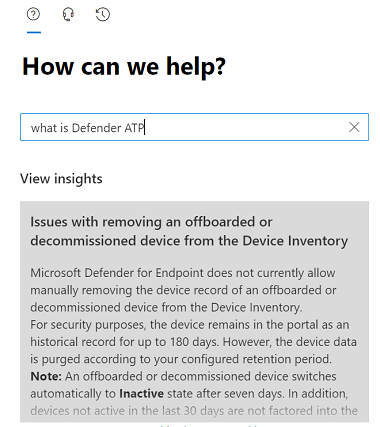

# Kontaktieren des Microsoft Defender für Endpunkt-Support

[!INCLUDE [Microsoft 365 Defender rebranding](../../includes/microsoft-defender.md)]

**Gilt für:**
- [Microsoft Defender für Endpunkt](https://go.microsoft.com/fwlink/p/?linkid=2154037)
- [Microsoft 365 Defender](https://go.microsoft.com/fwlink/?linkid=2118804)

>Möchten Sie Defender für Endpunkt erfahren? [Registrieren Sie sich für eine kostenlose Testversion](https://www.microsoft.com/microsoft-365/windows/microsoft-defender-atp?ocid=docs-wdatp-assignaccess-abovefoldlink)

Defender für Endpunkt hat kürzlich den Supportprozess aktualisiert, um eine modernere und erweiterte Supporterfahrung zu bieten.

Das neue Widget ermöglicht Kunden Folgendes:

- Suchen nach Lösungen für häufig auftretende Probleme
- Übermitteln eines Supportfalls an das Microsoft-Supportteam

## Voraussetzungen

Es ist wichtig, die spezifischen Rollen zu kennen, die über die Berechtigung zum Öffnen von Supportfällen verfügen.

Sie müssen mindestens über eine Rolle "Dienstsupportadministrator" **oder** "Helpdeskadministrator" verfügen.

Weitere Informationen dazu, welche Rollen über Berechtigungen verfügen, finden Sie unter [Sicherheitsadministratorberechtigungen.](/azure/active-directory/users-groups-roles/directory-assign-admin-roles#security-administrator-permissions) Rollen, die die Aktion `microsoft.office365.supportTickets/allEntities/allTasks` enthalten, können einen Fall übermitteln.

Allgemeine Informationen zu Administratorrollen finden Sie unter [Informationen zu Administratorrollen.](/microsoft-365/admin/add-users/about-admin-roles)

## Zugreifen auf das Widget
Der Zugriff auf das neue Support-Widget kann auf zwei Arten erfolgen:

1. Klicken Sie oben rechts im Portal auf das Fragezeichen, und klicken Sie dann auf "Microsoft-Support":

    

2. Klicken Sie auf **"Benötigen Sie Hilfe"?**  Schaltfläche unten rechts im Microsoft 365 Defender-Portal:

    

Im Widget werden Ihnen zwei Optionen angeboten:

- Suchen nach Lösungen für häufig auftretende Probleme
- Öffnen einer Serviceanfrage

## Suchen nach Lösungen für häufig auftretende Probleme
Diese Option enthält Artikel, die sich möglicherweise auf die Frage beziehen, die Sie stellen können. Beginnen Sie einfach mit der Eingabe der Frage im Suchfeld, und es werden Artikel im Zusammenhang mit Ihrer Suche angezeigt.

Falls die vorgeschlagenen Artikel nicht ausreichen, können Sie eine Serviceanfrage öffnen.

## Öffnen einer Serviceanfrage

Erfahren Sie, wie Sie Supporttickets öffnen, indem Sie sich an den Defender für Endpunkt-Support wenden.

> [!Note]
> Wenn Sie über einen Promier-Supportvertrag mit Microsoft verfügen, wird das Premier-Tag auf dem Widget angezeigt. Falls nicht, wenden Sie sich an Ihren Microsoft-Kontomanager.

### Support kontaktieren

Diese Option ist verfügbar, indem Sie auf das Symbol klicken, das wie ein Headset aussieht. Sie erhalten dann die folgende Seite, um Ihren Supportfall zu übermitteln:

1. Geben Sie einen Titel und eine Beschreibung des Problems ein, mit dem Sie konfrontiert sind, sowie eine Telefonnummer und E-Mail-Adresse, unter der wir Sie erreichen können.

2. (Optional) Fügen Sie bis zu fünf Anlagen hinzu, die für das Problem relevant sind, um zusätzlichen Kontext für den Supportfall bereitzustellen.

3. Wählen Sie Ihre Zeitzone und ggf. eine alternative Sprache aus. Die Anforderung wird an das Microsoft-Supportteam gesendet. Das Team antwortet in Kürze auf Ihre Serviceanfrage.

## Verwandte Themen

- [Behandeln von Dienstproblemen](troubleshoot-mdatp.md)
- [Überprüfen des Dienststatus](service-status.md)
