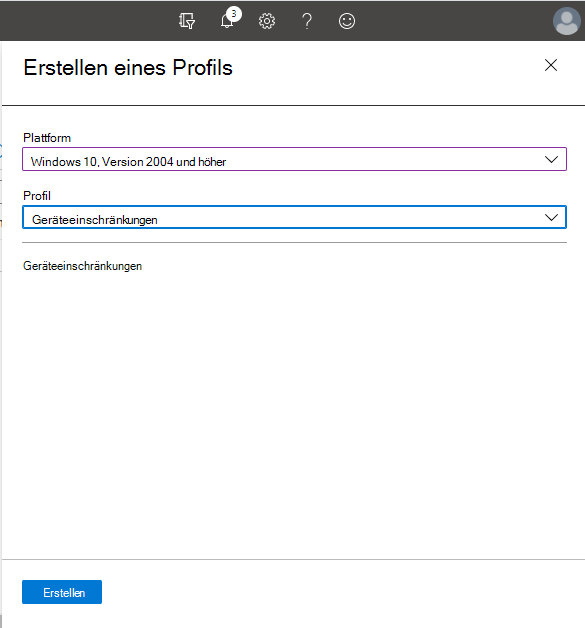

# <a name="how-to-control-usb-devices-and-other-removable-media-using-microsoft-defender-for-endpoint"></a><span data-ttu-id="3546e-103">Steuern von USB-Geräten und anderen Wechselmedien mithilfe von Microsoft Defender for Endpoint</span><span class="sxs-lookup"><span data-stu-id="3546e-103">How to control USB devices and other removable media using Microsoft Defender for Endpoint</span></span>

<span data-ttu-id="3546e-104">**Gilt für:** [Microsoft Defender for Endpoint](https://go.microsoft.com/fwlink/p/?linkid=2069559)</span><span class="sxs-lookup"><span data-stu-id="3546e-104">**Applies to:** [Microsoft Defender for Endpoint](https://go.microsoft.com/fwlink/p/?linkid=2069559)</span></span>

<span data-ttu-id="3546e-105">Microsoft [empfiehlt](https://aka.ms/devicecontrolblog)einen mehrschichtigen Ansatz zum Sichern von Wechselmedien, und Microsoft Defender for Endpoint bietet mehrere Überwachungs- und Steuerungsfunktionen, um zu verhindern, dass Bedrohungen in nicht autorisierten Peripheriegeräten Ihre Geräte kompromittieren:</span><span class="sxs-lookup"><span data-stu-id="3546e-105">Microsoft recommends [a layered approach to securing removable media](https://aka.ms/devicecontrolblog), and Microsoft Defender for Endpoint provides multiple monitoring and control features to help prevent threats in unauthorized peripherals from compromising your devices:</span></span>

1. <span data-ttu-id="3546e-106">[Entdecken Sie plug and play connected events for peripherals in Microsoft Defender for Endpoint Advanced Hunting](#discover-plug-and-play-connected-events).</span><span class="sxs-lookup"><span data-stu-id="3546e-106">[Discover plug and play connected events for peripherals in Microsoft Defender for Endpoint advanced hunting](#discover-plug-and-play-connected-events).</span></span> <span data-ttu-id="3546e-107">Identifizieren oder untersuchen Sie verdächtige Nutzungsaktivitäten.</span><span class="sxs-lookup"><span data-stu-id="3546e-107">Identify or investigate suspicious usage activity.</span></span>

2. <span data-ttu-id="3546e-108">Konfigurieren, um nur bestimmte Wechselmedien zu erlauben oder zu blockieren und Bedrohungen zu verhindern.</span><span class="sxs-lookup"><span data-stu-id="3546e-108">Configure to allow or block only certain removable devices and prevent threats.</span></span>
    1. <span data-ttu-id="3546e-109">[Zulassen oder Blockieren von](#allow-or-block-removable-devices) Wechselmedien basierend auf einer differenzierten Konfiguration, um schreibzugriff auf Wechseldatenträger zu verweigern und Geräte mithilfe von USB-Geräte-IDs zu genehmigen oder zu verweigern.</span><span class="sxs-lookup"><span data-stu-id="3546e-109">[Allow or block removable devices](#allow-or-block-removable-devices) based on granular configuration to deny write access to removable disks and approve or deny devices by using USB device IDs.</span></span> <span data-ttu-id="3546e-110">Flexible Richtlinienzuweisung von Geräteinstallationseinstellungen basierend auf einer person oder einer Gruppe von Azure Active Directory (Azure AD)-Benutzern und -Geräten.</span><span class="sxs-lookup"><span data-stu-id="3546e-110">Flexible policy assignment of device installation settings based on an individual or group of Azure Active Directory (Azure AD) users and devices.</span></span>

    2. <span data-ttu-id="3546e-111">[Verhindern Von Wechselmedien eingeführte](#prevent-threats-from-removable-storage) Bedrohungen durch Wechselmedien, indem Sie:</span><span class="sxs-lookup"><span data-stu-id="3546e-111">[Prevent threats from removable storage](#prevent-threats-from-removable-storage) introduced by removable storage devices by enabling:</span></span>  
        - <span data-ttu-id="3546e-112">Microsoft Defender Antivirus Echtzeitschutz (Real-Time Protection, RTP) zum Überprüfen des Wechselspeichers auf Schadsoftware.</span><span class="sxs-lookup"><span data-stu-id="3546e-112">Microsoft Defender Antivirus real-time protection (RTP) to scan removable storage for malware.</span></span>  
        - <span data-ttu-id="3546e-113">Die Attack Surface Reduction (ASR)-USB-Regel zum Blockieren nicht vertrauenswürdiger und nicht signierter Prozesse, die über USB ausgeführt werden.</span><span class="sxs-lookup"><span data-stu-id="3546e-113">The Attack Surface Reduction (ASR) USB rule to block untrusted and unsigned processes that run from USB.</span></span>  
        - <span data-ttu-id="3546e-114">Schutzeinstellungen für den direkten Arbeitsspeicherzugriff (Direct Memory Access, DMA), um DMA-Angriffe zu mindern, einschließlich Kernel-DMA-Schutz für Thunderbolt und Blockieren von DMA, bis sich ein Benutzer meldet.</span><span class="sxs-lookup"><span data-stu-id="3546e-114">Direct Memory Access (DMA) protection settings to mitigate DMA attacks, including Kernel DMA Protection for Thunderbolt and blocking DMA until a user signs in.</span></span>  

3. <span data-ttu-id="3546e-115">[Erstellen Sie angepasste Warnungen](#create-customized-alerts-and-response-actions) und Reaktionsaktionen, um die Verwendung von Wechselmedien basierend auf diesen Plug -and-Play-Ereignissen oder anderen Microsoft Defender for Endpoint-Ereignissen mit benutzerdefinierten [Erkennungsregeln zu überwachen.](/microsoft-365/security/defender-endpoint/custom-detection-rules)</span><span class="sxs-lookup"><span data-stu-id="3546e-115">[Create customized alerts and response actions](#create-customized-alerts-and-response-actions) to monitor usage of removable devices based on these plug and play events or any other Microsoft Defender for Endpoint events with [custom detection rules](/microsoft-365/security/defender-endpoint/custom-detection-rules).</span></span>

4. <span data-ttu-id="3546e-116">[Reagieren Sie auf Bedrohungen](#respond-to-threats) von Peripheriegeräten in Echtzeit basierend auf den von jedem Peripheriegerät gemeldeten Eigenschaften.</span><span class="sxs-lookup"><span data-stu-id="3546e-116">[Respond to threats](#respond-to-threats) from peripherals in real-time based on properties reported by each peripheral.</span></span>

>[!Note]
><span data-ttu-id="3546e-117">Diese Maßnahmen zur Bedrohungsminderung verhindern, dass Schadsoftware in Ihre Umgebung kommt.</span><span class="sxs-lookup"><span data-stu-id="3546e-117">These threat reduction measures help prevent malware from coming into your environment.</span></span> <span data-ttu-id="3546e-118">Um Unternehmensdaten vor dem Verlassen Ihrer Umgebung zu schützen, können Sie auch Maßnahmen zur Verhinderung von Datenverlust konfigurieren.</span><span class="sxs-lookup"><span data-stu-id="3546e-118">To protect enterprise data from leaving your environment, you can also configure data loss prevention measures.</span></span> <span data-ttu-id="3546e-119">Beispielsweise können Sie auf Windows 10-Geräten [BitLocker](/windows/security/information-protection/bitlocker/bitlocker-overview.md) und [Windows Information Protection](/windows/security/information-protection/create-wip-policy-using-intune-azure.md)konfigurieren, die Unternehmensdaten verschlüsseln, auch wenn sie auf einem persönlichen Gerät gespeichert sind, oder den [CSP Storage/RemovableDiskDenyWriteAccess](/windows/client-management/mdm/policy-csp-storage#storage-removablediskdenywriteaccess) verwenden, um den Schreibzugriff auf Wechseldatenträger zu verweigern.</span><span class="sxs-lookup"><span data-stu-id="3546e-119">For example, on Windows 10 devices you can configure [BitLocker](/windows/security/information-protection/bitlocker/bitlocker-overview.md) and [Windows Information Protection](/windows/security/information-protection/create-wip-policy-using-intune-azure.md), which will encrypt company data even if it is stored on a personal device, or use the [Storage/RemovableDiskDenyWriteAccess CSP](/windows/client-management/mdm/policy-csp-storage#storage-removablediskdenywriteaccess) to deny write access to removable disks.</span></span> <span data-ttu-id="3546e-120">Darüber hinaus können Sie Dateien auf Windows [Geräten](/windows/security/threat-protection/windows-defender-atp/information-protection-in-windows-overview) (einschließlich ihrer bereitgestellten USB-Geräte) mithilfe von Microsoft Defender for Endpoint und Azure Information Protection klassifizieren und schützen.</span><span class="sxs-lookup"><span data-stu-id="3546e-120">Additionally, you can [classify and protect files on Windows devices](/windows/security/threat-protection/windows-defender-atp/information-protection-in-windows-overview) (including their mounted USB devices) by using Microsoft Defender for Endpoint and Azure Information Protection.</span></span>

## <a name="discover-plug-and-play-connected-events"></a><span data-ttu-id="3546e-121">Entdecken von verbundenen Plug -and-Play-Ereignissen</span><span class="sxs-lookup"><span data-stu-id="3546e-121">Discover plug and play connected events</span></span>

<span data-ttu-id="3546e-122">Sie können verbundene Ereignisse in Microsoft Defender for Endpoint advanced hunting anzeigen und wiederverspielen, um verdächtige Nutzungsaktivitäten zu identifizieren oder interne Untersuchungen durchzuführen.</span><span class="sxs-lookup"><span data-stu-id="3546e-122">You can view plug and play connected events in Microsoft Defender for Endpoint advanced hunting to identify suspicious usage activity or perform internal investigations.</span></span>
<span data-ttu-id="3546e-123">Beispiele für erweiterte Suchabfragen von Defender for Endpoint finden Sie unter [Microsoft Defender for Endpoint hunting queries GitHub repository](https://github.com/Microsoft/WindowsDefenderATP-Hunting-Queries).</span><span class="sxs-lookup"><span data-stu-id="3546e-123">For examples of Defender for Endpoint advanced hunting queries, see the [Microsoft Defender for Endpoint hunting queries GitHub repo](https://github.com/Microsoft/WindowsDefenderATP-Hunting-Queries).</span></span>

<span data-ttu-id="3546e-124">Beispielvorlagen Power BI berichtsvorlagen sind für Microsoft Defender for Endpoint verfügbar, die Sie für erweiterte Suchabfragen verwenden können.</span><span class="sxs-lookup"><span data-stu-id="3546e-124">Sample Power BI report templates are available for Microsoft Defender for Endpoint that you can use for Advanced hunting queries.</span></span> <span data-ttu-id="3546e-125">Mit diesen Beispielvorlagen, einschließlich einer für die Gerätesteuerung, können Sie die Leistung der erweiterten Suche in Power BI.</span><span class="sxs-lookup"><span data-stu-id="3546e-125">With these sample templates, including one for device control, you can integrate the power of Advanced hunting into Power BI.</span></span> <span data-ttu-id="3546e-126">Weitere Informationen [finden GitHub Repository für PowerBI-Vorlagen.](https://github.com/microsoft/MDATP-PowerBI-Templates)</span><span class="sxs-lookup"><span data-stu-id="3546e-126">See the [GitHub repository for PowerBI templates](https://github.com/microsoft/MDATP-PowerBI-Templates) for more information.</span></span> <span data-ttu-id="3546e-127">Weitere Informationen zur integration finden Sie unter [Erstellen benutzerdefinierter Power BI](/microsoft-365/security/defender-endpoint/api-power-bi) mit Power BI.</span><span class="sxs-lookup"><span data-stu-id="3546e-127">See [Create custom reports using Power BI](/microsoft-365/security/defender-endpoint/api-power-bi) to learn more about Power BI integration.</span></span>

## <a name="allow-or-block-removable-devices"></a><span data-ttu-id="3546e-128">Zulassen oder Blockieren von Wechselmedien</span><span class="sxs-lookup"><span data-stu-id="3546e-128">Allow or block removable devices</span></span>
<span data-ttu-id="3546e-129">In der folgenden Tabelle wird beschrieben, wie Wechselmedien von Microsoft Defender for Endpoint basierend auf einer differenzierten Konfiguration zulässig oder blockiert werden können.</span><span class="sxs-lookup"><span data-stu-id="3546e-129">The following table describes the ways Microsoft Defender for Endpoint can allow or block removable devices based on granular configuration.</span></span>

| <span data-ttu-id="3546e-130">Steuerelement</span><span class="sxs-lookup"><span data-stu-id="3546e-130">Control</span></span>  | <span data-ttu-id="3546e-131">Beschreibung</span><span class="sxs-lookup"><span data-stu-id="3546e-131">Description</span></span> |
|----------|-------------|
| [<span data-ttu-id="3546e-132">Einschränken von USB-Laufwerken und anderen Peripheriegeräten</span><span class="sxs-lookup"><span data-stu-id="3546e-132">Restrict USB drives and other peripherals</span></span>](#restrict-usb-drives-and-other-peripherals) | <span data-ttu-id="3546e-133">Sie können zulassen/verhindern, dass Benutzer nur die USB-Laufwerke und andere Peripheriegeräte installieren, die in einer Liste autorisierter/nicht autorisierter Geräte oder Gerätetypen enthalten sind.</span><span class="sxs-lookup"><span data-stu-id="3546e-133">You can allow/prevent users to install only the USB drives and other peripherals included on a list of authorized/unauthorized devices or device types.</span></span> |
| [<span data-ttu-id="3546e-134">Blockieren der Installation und Verwendung von Wechselspeicher</span><span class="sxs-lookup"><span data-stu-id="3546e-134">Block installation and usage of removable storage</span></span>](#block-installation-and-usage-of-removable-storage) | <span data-ttu-id="3546e-135">Wechseldatenträger können nicht installiert oder verwendet werden.</span><span class="sxs-lookup"><span data-stu-id="3546e-135">You can't install or use removable storage.</span></span> |
| [<span data-ttu-id="3546e-136">Zulassen der Installation und Verwendung von speziell genehmigten Peripheriegeräten</span><span class="sxs-lookup"><span data-stu-id="3546e-136">Allow installation and usage of specifically approved peripherals</span></span>](#allow-installation-and-usage-of-specifically-approved-peripherals)   | <span data-ttu-id="3546e-137">Sie können nur genehmigte Peripheriegeräte installieren und verwenden, die bestimmte Eigenschaften in ihrer Firmware melden.</span><span class="sxs-lookup"><span data-stu-id="3546e-137">You can only install and use approved peripherals that report specific properties in their firmware.</span></span> |
| [<span data-ttu-id="3546e-138">Verhindern der Installation von speziell verbotenen Peripheriegeräten</span><span class="sxs-lookup"><span data-stu-id="3546e-138">Prevent installation of specifically prohibited peripherals</span></span>](#prevent-installation-of-specifically-prohibited-peripherals) | <span data-ttu-id="3546e-139">Verbotene Peripheriegeräte, die bestimmte Eigenschaften in ihrer Firmware melden, können nicht installiert oder verwendet werden.</span><span class="sxs-lookup"><span data-stu-id="3546e-139">You can't install or use prohibited peripherals that report specific properties in their firmware.</span></span> |
| [<span data-ttu-id="3546e-140">Zulassen der Installation und Verwendung von speziell genehmigten Peripheriegeräten mit übereinstimmenden Geräteinstanz-IDs</span><span class="sxs-lookup"><span data-stu-id="3546e-140">Allow installation and usage of specifically approved peripherals with matching device instance IDs</span></span>](#allow-installation-and-usage-of-specifically-approved-peripherals-with-matching-device-instance-ids) | <span data-ttu-id="3546e-141">Sie können nur genehmigte Peripheriegeräte installieren und verwenden, die mit diesen IDs der Geräteinstanz übereinstimmen.</span><span class="sxs-lookup"><span data-stu-id="3546e-141">You can only install and use approved peripherals that match any of these device instance IDs.</span></span> |
| [<span data-ttu-id="3546e-142">Verhindern der Installation und Verwendung von speziell verbotenen Peripheriegeräten mit übereinstimmenden Geräteinstanz-IDs</span><span class="sxs-lookup"><span data-stu-id="3546e-142">Prevent installation and usage of specifically prohibited peripherals with matching device instance IDs</span></span>](#prevent-installation-and-usage-of-specifically-prohibited-peripherals-with-matching-device-instance-ids) | <span data-ttu-id="3546e-143">Sie können keine verbotenen Peripheriegeräte installieren oder verwenden, die mit diesen IDs der Geräteinstanz übereinstimmen.</span><span class="sxs-lookup"><span data-stu-id="3546e-143">You can't install or use prohibited peripherals that match any of these device instance IDs.</span></span> |
| [<span data-ttu-id="3546e-144">Einschränken von Diensten, die Bluetooth</span><span class="sxs-lookup"><span data-stu-id="3546e-144">Limit services that use Bluetooth</span></span>](#limit-services-that-use-bluetooth) | <span data-ttu-id="3546e-145">Sie können die Dienste einschränken, die Bluetooth.</span><span class="sxs-lookup"><span data-stu-id="3546e-145">You can limit the services that can use Bluetooth.</span></span> |
| [<span data-ttu-id="3546e-146">Verwenden der Basiseinstellungen für Microsoft Defender for Endpoint</span><span class="sxs-lookup"><span data-stu-id="3546e-146">Use Microsoft Defender for Endpoint baseline settings</span></span>](#use-microsoft-defender-for-endpoint-baseline-settings) | <span data-ttu-id="3546e-147">Sie können die empfohlene Konfiguration für ATP mithilfe der Sicherheitsgrundlinie defender for Endpoint festlegen.</span><span class="sxs-lookup"><span data-stu-id="3546e-147">You can set the recommended configuration for ATP by using the Defender for Endpoint security baseline.</span></span> |

### <a name="restrict-usb-drives-and-other-peripherals"></a><span data-ttu-id="3546e-148">Einschränken von USB-Laufwerken und anderen Peripheriegeräten</span><span class="sxs-lookup"><span data-stu-id="3546e-148">Restrict USB drives and other peripherals</span></span>

<span data-ttu-id="3546e-149">Um Schadsoftwareinfektionen oder Datenverluste zu verhindern, kann eine Organisation USB-Laufwerke und andere Peripheriegeräte einschränken.</span><span class="sxs-lookup"><span data-stu-id="3546e-149">To prevent malware infections or data loss, an organization may restrict USB drives and other peripherals.</span></span> <span data-ttu-id="3546e-150">In der folgenden Tabelle wird beschrieben, wie Microsoft Defender for Endpoint die Installation und Verwendung von USB-Laufwerken und anderen Peripheriegeräten verhindern kann.</span><span class="sxs-lookup"><span data-stu-id="3546e-150">The following table describes the ways Microsoft Defender for Endpoint can help prevent installation and usage of USB drives and other peripherals.</span></span>

| <span data-ttu-id="3546e-151">Steuerelement</span><span class="sxs-lookup"><span data-stu-id="3546e-151">Control</span></span>  | <span data-ttu-id="3546e-152">Beschreibung</span><span class="sxs-lookup"><span data-stu-id="3546e-152">Description</span></span>
|----------|-------------|
| [<span data-ttu-id="3546e-153">Zulassen der Installation und Verwendung von USB-Laufwerken und anderen Peripheriegeräten</span><span class="sxs-lookup"><span data-stu-id="3546e-153">Allow installation and usage of USB drives and other peripherals</span></span>](#allow-installation-and-usage-of-usb-drives-and-other-peripherals) | <span data-ttu-id="3546e-154">Zulassen, dass Benutzer nur die USB-Laufwerke und andere Peripheriegeräte installieren, die in einer Liste autorisierter Geräte oder Gerätetypen enthalten sind</span><span class="sxs-lookup"><span data-stu-id="3546e-154">Allow users to install only the USB drives and other peripherals included on a list of authorized devices or device types</span></span> |
| [<span data-ttu-id="3546e-155">Verhindern der Installation und Verwendung von USB-Laufwerken und anderen Peripheriegeräten</span><span class="sxs-lookup"><span data-stu-id="3546e-155">Prevent installation and usage of USB drives and other peripherals</span></span>](#prevent-installation-and-usage-of-usb-drives-and-other-peripherals) | <span data-ttu-id="3546e-156">Verhindern, dass Benutzer USB-Laufwerke und andere Peripheriegeräte installieren, die in einer Liste nicht autorisierter Geräte und Gerätetypen enthalten sind</span><span class="sxs-lookup"><span data-stu-id="3546e-156">Prevent users from installing USB drives and other peripherals included on a list of unauthorized devices and device types</span></span> |

<span data-ttu-id="3546e-157">Alle oben genannten Steuerelemente können über die administrativen [Intune-Vorlagen festgelegt werden.](/intune/administrative-templates-windows)</span><span class="sxs-lookup"><span data-stu-id="3546e-157">All of the above controls can be set through the Intune [Administrative Templates](/intune/administrative-templates-windows).</span></span> <span data-ttu-id="3546e-158">Die relevanten Richtlinien finden Sie hier in den Intune-Administratorvorlagen:</span><span class="sxs-lookup"><span data-stu-id="3546e-158">The relevant policies are located here in the Intune Administrator Templates:</span></span>


>[!Note]
><span data-ttu-id="3546e-160">Mithilfe von Intune können Sie Gerätekonfigurationsrichtlinien auf Azure AD-Benutzer- und/oder Gerätegruppen anwenden.</span><span class="sxs-lookup"><span data-stu-id="3546e-160">Using Intune, you can apply device configuration policies to Azure AD user and/or device groups.</span></span>
<span data-ttu-id="3546e-161">Die oben genannten Richtlinien können auch über die #A0 für die [Geräteinstallation](/windows/client-management/mdm/policy-csp-deviceinstallation) und die Gruppenrichtlinienobjekte [für die Geräteinstallation festgelegt werden.](/previous-versions/dotnet/articles/bb530324(v=msdn.10))</span><span class="sxs-lookup"><span data-stu-id="3546e-161">The above policies can also be set through the [Device Installation CSP settings](/windows/client-management/mdm/policy-csp-deviceinstallation) and the [Device Installation GPOs](/previous-versions/dotnet/articles/bb530324(v=msdn.10)).</span></span>

> [!Note]
> <span data-ttu-id="3546e-162">Testen und verfeinern Sie diese Einstellungen immer zuerst mit einer Pilotgruppe von Benutzern und Geräten, bevor Sie sie in der Produktion anwenden.</span><span class="sxs-lookup"><span data-stu-id="3546e-162">Always test and refine these settings with a pilot group of users and devices first before applying them in production.</span></span>
<span data-ttu-id="3546e-163">Weitere Informationen zum Steuern von USB-Geräten finden Sie im [Microsoft Defender for Endpoint-Blog](https://www.microsoft.com/security/blog/2018/12/19/windows-defender-atp-has-protections-for-usb-and-removable-devices/).</span><span class="sxs-lookup"><span data-stu-id="3546e-163">For more information about controlling USB devices, see the [Microsoft Defender for Endpoint blog](https://www.microsoft.com/security/blog/2018/12/19/windows-defender-atp-has-protections-for-usb-and-removable-devices/).</span></span>

#### <a name="allow-installation-and-usage-of-usb-drives-and-other-peripherals"></a><span data-ttu-id="3546e-164">Zulassen der Installation und Verwendung von USB-Laufwerken und anderen Peripheriegeräten</span><span class="sxs-lookup"><span data-stu-id="3546e-164">Allow installation and usage of USB drives and other peripherals</span></span>

<span data-ttu-id="3546e-165">Eine Möglichkeit, die Installation und Verwendung von USB-Laufwerken und anderen Peripheriegeräten zu ermöglichen, besteht in der Ersten, indem Sie alles zulassen.</span><span class="sxs-lookup"><span data-stu-id="3546e-165">One way to approach allowing installation and usage of USB drives and other peripherals is to start by allowing everything.</span></span> <span data-ttu-id="3546e-166">Anschließend können Sie beginnen, die zulässigen USB-Treiber und andere Peripheriegeräte zu reduzieren.</span><span class="sxs-lookup"><span data-stu-id="3546e-166">Afterwards, you can start reducing the allowable USB drivers and other peripherals.</span></span>

>[!Note]
><span data-ttu-id="3546e-167">Da ein nicht autorisiertes USB-Peripheriegerät über Firmware verfügen kann, die seine USB-Eigenschaften spooft, wird empfohlen, nur speziell genehmigte USB-Peripheriegeräte zu erlauben und die Benutzer zu beschränken, die darauf zugreifen können.</span><span class="sxs-lookup"><span data-stu-id="3546e-167">Because an unauthorized USB peripheral can have firmware that spoofs its USB properties, we recommend only allowing specifically approved USB peripherals and limiting the users who can access them.</span></span>

1. <span data-ttu-id="3546e-168">Aktivieren **Sie Die Installation von Geräten verhindern, die nicht von anderen Richtlinieneinstellungen für** alle Benutzer beschrieben werden.</span><span class="sxs-lookup"><span data-stu-id="3546e-168">Enable **Prevent installation of devices not described by other policy settings** to all users.</span></span>
2. <span data-ttu-id="3546e-169">Aktivieren Sie Die Installation von Geräten mithilfe von Treibern zulassen, die diesen **Geräteeinrichtungsklassen für** alle [Geräteeinrichtungsklassen entsprechen.](/windows-hardware/drivers/install/system-defined-device-setup-classes-available-to-vendors)</span><span class="sxs-lookup"><span data-stu-id="3546e-169">Enable **Allow installation of devices using drivers that match these device setup classes** for all [device setup classes](/windows-hardware/drivers/install/system-defined-device-setup-classes-available-to-vendors).</span></span>

<span data-ttu-id="3546e-170">Um die Richtlinie für bereits installierte Geräte zu erzwingen, wenden Sie die Prevent-Richtlinien mit dieser Einstellung an.</span><span class="sxs-lookup"><span data-stu-id="3546e-170">To enforce the policy for already installed devices, apply the prevent policies that have this setting.</span></span>

<span data-ttu-id="3546e-171">Beim Konfigurieren der Richtlinie zur Geräteinstallation zulassen müssen Sie auch alle übergeordneten Attribute zulassen.</span><span class="sxs-lookup"><span data-stu-id="3546e-171">When configuring the allow device installation policy, you must allow all parent attributes as well.</span></span> <span data-ttu-id="3546e-172">Sie können die Eltern eines Geräts anzeigen, indem Sie den Geräte-Manager öffnen und nach Verbindung anzeigen.</span><span class="sxs-lookup"><span data-stu-id="3546e-172">You can view the parents of a device by opening Device Manager and view by connection.</span></span>


<span data-ttu-id="3546e-174">In diesem Beispiel mussten die folgenden Klassen hinzugefügt werden: HID, Keyboard und {36fc9e60-c465-11cf-8056-444553540000}.</span><span class="sxs-lookup"><span data-stu-id="3546e-174">In this example, the following classes needed to be added: HID, Keyboard, and {36fc9e60-c465-11cf-8056-444553540000}.</span></span> <span data-ttu-id="3546e-175">Weitere [Informationen finden Sie unter von Microsoft bereitgestellte USB-Treiber.](/windows-hardware/drivers/usbcon/supported-usb-classes)</span><span class="sxs-lookup"><span data-stu-id="3546e-175">See [Microsoft-provided USB drivers](/windows-hardware/drivers/usbcon/supported-usb-classes) for more information.</span></span>


<span data-ttu-id="3546e-177">Wenn Sie auf bestimmte Geräte beschränken möchten, entfernen Sie die Geräteeinrichtungsklasse des Peripheriegeräts, das Sie einschränken möchten.</span><span class="sxs-lookup"><span data-stu-id="3546e-177">If you want to restrict to certain devices, remove the device setup class of the peripheral that you want to limit.</span></span> <span data-ttu-id="3546e-178">Fügen Sie dann die Geräte-ID hinzu, die Sie hinzufügen möchten.</span><span class="sxs-lookup"><span data-stu-id="3546e-178">Then add the device ID that you want to add.</span></span> <span data-ttu-id="3546e-179">Die Geräte-ID basiert auf den Lieferanten-ID- und Produkt-ID-Werten für ein Gerät.</span><span class="sxs-lookup"><span data-stu-id="3546e-179">Device ID is based on the vendor ID and product ID values for a device.</span></span> <span data-ttu-id="3546e-180">Informationen zu Geräte-ID-Formaten finden Sie unter [Standard USB Identifiers](/windows-hardware/drivers/install/standard-usb-identifiers).</span><span class="sxs-lookup"><span data-stu-id="3546e-180">For information on device ID formats, see [Standard USB Identifiers](/windows-hardware/drivers/install/standard-usb-identifiers).</span></span> 

<span data-ttu-id="3546e-181">Informationen zum Suchen der Geräte-IDs finden Sie unter [Look up device ID](#look-up-device-id).</span><span class="sxs-lookup"><span data-stu-id="3546e-181">To find the device IDs, see [Look up device ID](#look-up-device-id).</span></span> 

<span data-ttu-id="3546e-182">Beispiel:</span><span class="sxs-lookup"><span data-stu-id="3546e-182">For example:</span></span>

1. <span data-ttu-id="3546e-183">Entfernen Sie die Klasse USBDevice aus der Einstellung Installation von Geräten mit Treibern **zulassen, die mit dieser Geräteeinrichtung übereinstimmen.**</span><span class="sxs-lookup"><span data-stu-id="3546e-183">Remove class USBDevice from the **Allow installation of devices using drivers that match these device setup**.</span></span>
2. <span data-ttu-id="3546e-184">Fügen Sie die geräte-ID hinzu, die in der Datei Installation von Geräten zulassen zulässig ist, die mit diesen **Geräte-IDs übereinstimmen.**</span><span class="sxs-lookup"><span data-stu-id="3546e-184">Add the device ID to allow in the **Allow installation of device that match any of these device IDs**.</span></span> 


#### <a name="prevent-installation-and-usage-of-usb-drives-and-other-peripherals"></a><span data-ttu-id="3546e-185">Verhindern der Installation und Verwendung von USB-Laufwerken und anderen Peripheriegeräten</span><span class="sxs-lookup"><span data-stu-id="3546e-185">Prevent installation and usage of USB drives and other peripherals</span></span>

<span data-ttu-id="3546e-186">Wenn Sie die Installation einer Geräteklasse oder bestimmter Geräte verhindern möchten, können Sie die Richtlinien für die Geräteinstallation verhindern verwenden:</span><span class="sxs-lookup"><span data-stu-id="3546e-186">If you want to prevent the installation of a device class or certain devices, you can use the prevent device installation policies:</span></span>

1. <span data-ttu-id="3546e-187">Aktivieren Sie Die Installation von Geräten verhindern, die mit diesen **Geräte-IDs übereinstimmen,** und fügen Sie diese Geräte der Liste hinzu.</span><span class="sxs-lookup"><span data-stu-id="3546e-187">Enable **Prevent installation of devices that match any of these device IDs** and add these devices to the list.</span></span>
2. <span data-ttu-id="3546e-188">Aktivieren **Sie Verhindern der Installation von Geräten mithilfe von Treibern, die diesen Geräteeinrichtungsklassen entsprechen.**</span><span class="sxs-lookup"><span data-stu-id="3546e-188">Enable **Prevent installation of devices using drivers that match these device setup classes**.</span></span>

> [!Note]
> <span data-ttu-id="3546e-189">Die Richtlinien für die Geräteinstallation verhindern haben Vorrang vor den Richtlinien für die Zulässige Geräteinstallation.</span><span class="sxs-lookup"><span data-stu-id="3546e-189">The prevent device installation policies take precedence over the allow device installation policies.</span></span>

<span data-ttu-id="3546e-190">Mit der Richtlinie Installation von Geräten verhindern, die mit einer dieser **Geräte-IDs-Richtlinie** übereinstimmen, können Sie eine Liste der Geräte angeben, Windows nicht installiert werden können.</span><span class="sxs-lookup"><span data-stu-id="3546e-190">The **Prevent installation of devices that match any of these device IDs** policy allows you to specify a list of devices that Windows is prevented from installing.</span></span> 

<span data-ttu-id="3546e-191">So verhindern Sie die Installation von Geräten, die mit diesen Geräte-IDs übereinstimmen:</span><span class="sxs-lookup"><span data-stu-id="3546e-191">To prevent installation of devices that match any of these device IDs:</span></span> 

1. <span data-ttu-id="3546e-192">[Suchen Sie nach der Geräte-ID](#look-up-device-id) für Geräte, die sie Windows installieren möchten.</span><span class="sxs-lookup"><span data-stu-id="3546e-192">[Look up device ID](#look-up-device-id) for devices that you want Windows to prevent from installing.</span></span>

   

2. <span data-ttu-id="3546e-194">Aktivieren Sie Die Installation von Geräten verhindern, die mit diesen **Geräte-IDs** übereinstimmen, und fügen Sie der Liste die Hersteller- oder Produkt-IDs hinzu.</span><span class="sxs-lookup"><span data-stu-id="3546e-194">Enable **Prevent installation of devices that match any of these device IDs** and add the vendor or product IDs to the list.</span></span>

    

#### <a name="look-up-device-id"></a><span data-ttu-id="3546e-196">Geräte-ID nachschauen</span><span class="sxs-lookup"><span data-stu-id="3546e-196">Look up device ID</span></span>

<span data-ttu-id="3546e-197">Sie können device manager verwenden, um nach einer Geräte-ID zu suchen.</span><span class="sxs-lookup"><span data-stu-id="3546e-197">You can use Device Manager to look up a device ID.</span></span>

1. <span data-ttu-id="3546e-198">Öffnen Sie den Geräte-Manager.</span><span class="sxs-lookup"><span data-stu-id="3546e-198">Open Device Manager.</span></span>
2. <span data-ttu-id="3546e-199">Klicken **Sie auf Anzeigen,** und wählen **Sie Geräte nach Verbindung aus.**</span><span class="sxs-lookup"><span data-stu-id="3546e-199">Click **View** and select **Devices by connection**.</span></span>
3. <span data-ttu-id="3546e-200">Klicken Sie in der Struktur mit der rechten Maustaste auf das Gerät, und wählen Sie **Eigenschaften aus.**</span><span class="sxs-lookup"><span data-stu-id="3546e-200">From the tree, right-click the device and select **Properties**.</span></span>
4. <span data-ttu-id="3546e-201">Klicken Sie im Dialogfeld für das ausgewählte Gerät auf die **Registerkarte Details.**</span><span class="sxs-lookup"><span data-stu-id="3546e-201">In the dialog box for the selected device, click the **Details** tab.</span></span>
5. <span data-ttu-id="3546e-202">Klicken Sie **auf die** Dropdownliste Eigenschaft, und wählen Sie **Hardware-IDs aus.**</span><span class="sxs-lookup"><span data-stu-id="3546e-202">Click the **Property** drop-down list and select **Hardware Ids**.</span></span>
6. <span data-ttu-id="3546e-203">Klicken Sie mit der rechten Maustaste auf den oberen ID-Wert, und wählen Sie **Kopieren aus.**</span><span class="sxs-lookup"><span data-stu-id="3546e-203">Right-click the top ID value and select **Copy**.</span></span>

<span data-ttu-id="3546e-204">Weitere Informationen zu Geräte-ID-Formaten finden Sie unter [Standard USB Identifiers](/windows-hardware/drivers/install/standard-usb-identifiers).</span><span class="sxs-lookup"><span data-stu-id="3546e-204">For information about Device ID formats, see [Standard USB Identifiers](/windows-hardware/drivers/install/standard-usb-identifiers).</span></span>

<span data-ttu-id="3546e-205">Informationen zu Hersteller-IDs finden Sie unter [USB-Member](https://www.usb.org/members).</span><span class="sxs-lookup"><span data-stu-id="3546e-205">For information on vendor IDs, see [USB members](https://www.usb.org/members).</span></span>

<span data-ttu-id="3546e-206">Im Folgenden finden Sie ein Beispiel für die Suche nach einer Geräteanbieter-ID oder Produkt-ID (die Teil der Geräte-ID ist) mithilfe von PowerShell:</span><span class="sxs-lookup"><span data-stu-id="3546e-206">The following is an example for looking up a device vendor ID or product ID (which is part of the device ID) using PowerShell:</span></span> 

```powershell
Get-WMIObject -Class Win32_DiskDrive |
Select-Object -Property * 
```

<span data-ttu-id="3546e-207">Mit **der Richtlinie** Verhindern der Installation von Geräten mithilfe von Treibern, die diesen Geräteeinrichtungsklassen entsprechen, können Sie Geräteeinrichtungsklassen angeben, Windows nicht installiert werden können.</span><span class="sxs-lookup"><span data-stu-id="3546e-207">The **Prevent installation of devices using drivers that match these device setup classes** policy allows you to specify device setup classes that Windows is prevented from installing.</span></span> 

<span data-ttu-id="3546e-208">So verhindern Sie die Installation bestimmter Geräteklassen:</span><span class="sxs-lookup"><span data-stu-id="3546e-208">To prevent installation of particular classes of devices:</span></span> 

1. <span data-ttu-id="3546e-209">Suchen Sie die GUID der Geräteeinrichtungsklasse aus [Systemdefinierten Geräteeinrichtungsklassen, die für Anbieter verfügbar sind.](/windows-hardware/drivers/install/system-defined-device-setup-classes-available-to-vendors)</span><span class="sxs-lookup"><span data-stu-id="3546e-209">Find the GUID of the device setup class from [System-Defined Device Setup Classes Available to Vendors](/windows-hardware/drivers/install/system-defined-device-setup-classes-available-to-vendors).</span></span>

2. <span data-ttu-id="3546e-210">Aktivieren Sie Verhindern der Installation von Geräten mithilfe von Treibern, die diesen **Geräteeinrichtungsklassen** entsprechen, und fügen Sie der Liste die Klassen-GUID hinzu.</span><span class="sxs-lookup"><span data-stu-id="3546e-210">Enable **Prevent installation of devices using drivers that match these device setup classes** and add the class GUID to the list.</span></span>

    > [!div class="mx-imgBorder"]
    > <span data-ttu-id="3546e-211"></span><span class="sxs-lookup"><span data-stu-id="3546e-211"></span></span>

### <a name="block-installation-and-usage-of-removable-storage"></a><span data-ttu-id="3546e-212">Blockieren der Installation und Verwendung von Wechselspeicher</span><span class="sxs-lookup"><span data-stu-id="3546e-212">Block installation and usage of removable storage</span></span>

1. <span data-ttu-id="3546e-213">Melden Sie sich beim [Microsoft Endpoint Manager Admin Center an.](https://endpoint.microsoft.com/)</span><span class="sxs-lookup"><span data-stu-id="3546e-213">Sign in to the [Microsoft Endpoint Manager admin center](https://endpoint.microsoft.com/).</span></span>

2. <span data-ttu-id="3546e-214">Klicken **Sie auf**  >  **Gerätekonfigurationsprofile**  >  **Profil erstellen.**</span><span class="sxs-lookup"><span data-stu-id="3546e-214">Click **Devices** > **Configuration Profiles** > **Create profile**.</span></span>

    > [!div class="mx-imgBorder"]
    > <span data-ttu-id="3546e-215"></span><span class="sxs-lookup"><span data-stu-id="3546e-215"></span></span>

3. <span data-ttu-id="3546e-216">Verwenden Sie die folgenden Einstellungen:</span><span class="sxs-lookup"><span data-stu-id="3546e-216">Use the following settings:</span></span>

   - <span data-ttu-id="3546e-217">Name: Geben Sie einen Namen für das Profil ein.</span><span class="sxs-lookup"><span data-stu-id="3546e-217">Name: Type a name for the profile</span></span>
   - <span data-ttu-id="3546e-218">Beschreibung: Geben Sie eine Beschreibung ein.</span><span class="sxs-lookup"><span data-stu-id="3546e-218">Description: Type a description</span></span>
   - <span data-ttu-id="3546e-219">Plattform: Windows 10 und höher</span><span class="sxs-lookup"><span data-stu-id="3546e-219">Platform: Windows 10 and later</span></span>
   - <span data-ttu-id="3546e-220">Profiltyp: Geräteeinschränkungen</span><span class="sxs-lookup"><span data-stu-id="3546e-220">Profile type: Device restrictions</span></span>

   > [!div class="mx-imgBorder"]
   > <span data-ttu-id="3546e-221"></span><span class="sxs-lookup"><span data-stu-id="3546e-221"></span></span>

4. <span data-ttu-id="3546e-222">Klicken **Sie auf** Allgemein  >  **konfigurieren.**</span><span class="sxs-lookup"><span data-stu-id="3546e-222">Click **Configure** > **General**.</span></span>  

5. <span data-ttu-id="3546e-223">Wählen **Sie für Wechselspeicher und** **USB-Verbindung (nur mobil)** **Block aus.**</span><span class="sxs-lookup"><span data-stu-id="3546e-223">For **Removable storage** and **USB connection (mobile only)**, choose **Block**.</span></span> <span data-ttu-id="3546e-224">**Wechselmedien enthalten** USB-Laufwerke, während **die USB-Verbindung (nur mobil)** das Laden von USB ausschließt, aber andere USB-Verbindungen nur auf mobilen Geräten umfasst.</span><span class="sxs-lookup"><span data-stu-id="3546e-224">**Removable storage** includes USB drives, whereas **USB connection (mobile only)** excludes USB charging but includes other USB connections on mobile devices only.</span></span> 

   

6. <span data-ttu-id="3546e-226">Klicken **Sie auf OK,** um **allgemeine** Einstellungen und **Geräteeinschränkungen zu schließen.**</span><span class="sxs-lookup"><span data-stu-id="3546e-226">Click **OK** to close **General** settings and **Device restrictions**.</span></span>

7. <span data-ttu-id="3546e-227">Klicken Sie **auf Erstellen,** um das Profil zu speichern.</span><span class="sxs-lookup"><span data-stu-id="3546e-227">Click **Create** to save the profile.</span></span>

### <a name="allow-installation-and-usage-of-specifically-approved-peripherals"></a><span data-ttu-id="3546e-228">Zulassen der Installation und Verwendung von speziell genehmigten Peripheriegeräten</span><span class="sxs-lookup"><span data-stu-id="3546e-228">Allow installation and usage of specifically approved peripherals</span></span>

<span data-ttu-id="3546e-229">Peripheriegeräte, die installiert werden dürfen, können durch ihre [Hardwareidentität angegeben werden.](/windows-hardware/drivers/install/device-identification-strings)</span><span class="sxs-lookup"><span data-stu-id="3546e-229">Peripherals that are allowed to be installed can be specified by their [hardware identity](/windows-hardware/drivers/install/device-identification-strings).</span></span> <span data-ttu-id="3546e-230">Eine Liste der allgemeinen Bezeichnerstrukturen finden Sie unter [Device Identifier Formats](/windows-hardware/drivers/install/device-identifier-formats).</span><span class="sxs-lookup"><span data-stu-id="3546e-230">For a list of common identifier structures, see [Device Identifier Formats](/windows-hardware/drivers/install/device-identifier-formats).</span></span> <span data-ttu-id="3546e-231">Testen Sie die Konfiguration vor dem Roll-out, um sicherzustellen, dass sie blockiert und die erwarteten Geräte zulässt.</span><span class="sxs-lookup"><span data-stu-id="3546e-231">Test the configuration prior to rolling it out to ensure it blocks and allows the devices expected.</span></span> <span data-ttu-id="3546e-232">Testen Sie im Idealfall verschiedene Instanzen der Hardware.</span><span class="sxs-lookup"><span data-stu-id="3546e-232">Ideally test various instances of the hardware.</span></span> <span data-ttu-id="3546e-233">Testen Sie beispielsweise mehrere USB-Schlüssel und nicht nur einen.</span><span class="sxs-lookup"><span data-stu-id="3546e-233">For example, test multiple USB keys rather than only one.</span></span>

<span data-ttu-id="3546e-234">Ein SyncML-Beispiel, das die Installation bestimmter Geräte-IDs zulässt, finden Sie unter [DeviceInstallation/AllowInstallationOfMatchingDeviceIDs CSP](/windows/client-management/mdm/policy-csp-deviceinstallation#deviceinstallation-allowinstallationofmatchingdeviceids).</span><span class="sxs-lookup"><span data-stu-id="3546e-234">For a SyncML example that allows installation of specific device IDs, see [DeviceInstallation/AllowInstallationOfMatchingDeviceIDs CSP](/windows/client-management/mdm/policy-csp-deviceinstallation#deviceinstallation-allowinstallationofmatchingdeviceids).</span></span> <span data-ttu-id="3546e-235">Informationen zum Zulassen bestimmter Geräteklassen finden Sie unter [DeviceInstallation/AllowInstallationOfMatchingDeviceSetupClasses CSP](/windows/client-management/mdm/policy-csp-deviceinstallation#deviceinstallation-allowinstallationofmatchingdevicesetupclasses).</span><span class="sxs-lookup"><span data-stu-id="3546e-235">To allow specific device classes, see [DeviceInstallation/AllowInstallationOfMatchingDeviceSetupClasses CSP](/windows/client-management/mdm/policy-csp-deviceinstallation#deviceinstallation-allowinstallationofmatchingdevicesetupclasses).</span></span>
<span data-ttu-id="3546e-236">Das Zulassen der Installation bestimmter Geräte erfordert auch das Aktivieren [von DeviceInstallation/PreventInstallationOfDevicesNotDescribedByOtherPolicySettings](/windows/client-management/mdm/policy-csp-deviceinstallation#deviceinstallation-preventinstallationofdevicesnotdescribedbyotherpolicysettings).</span><span class="sxs-lookup"><span data-stu-id="3546e-236">Allowing installation of specific devices requires also enabling [DeviceInstallation/PreventInstallationOfDevicesNotDescribedByOtherPolicySettings](/windows/client-management/mdm/policy-csp-deviceinstallation#deviceinstallation-preventinstallationofdevicesnotdescribedbyotherpolicysettings).</span></span>

### <a name="prevent-installation-of-specifically-prohibited-peripherals"></a><span data-ttu-id="3546e-237">Verhindern der Installation von speziell verbotenen Peripheriegeräten</span><span class="sxs-lookup"><span data-stu-id="3546e-237">Prevent installation of specifically prohibited peripherals</span></span>

<span data-ttu-id="3546e-238">Microsoft Defender for Endpoint blockiert die Installation und Verwendung verbotener Peripheriegeräte mithilfe einer der folgenden Optionen:</span><span class="sxs-lookup"><span data-stu-id="3546e-238">Microsoft Defender for Endpoint blocks installation and usage of prohibited peripherals by using either of these options:</span></span>

- <span data-ttu-id="3546e-239">[Administrative Vorlagen](/intune/administrative-templates-windows) können jedes Gerät mit einer übereinstimmenden Hardware-ID oder Setupklasse blockieren.</span><span class="sxs-lookup"><span data-stu-id="3546e-239">[Administrative Templates](/intune/administrative-templates-windows) can block any device with a matching hardware ID or setup class.</span></span>  
- <span data-ttu-id="3546e-240">[#A0 für die Geräteinstallation](/windows/client-management/mdm/policy-csp-deviceinstallation) mit einem benutzerdefinierten Profil in Intune.</span><span class="sxs-lookup"><span data-stu-id="3546e-240">[Device Installation CSP settings](/windows/client-management/mdm/policy-csp-deviceinstallation) with a custom profile in Intune.</span></span> <span data-ttu-id="3546e-241">Sie können [die Installation bestimmter Geräte-IDs verhindern](/windows/client-management/mdm/policy-csp-deviceinstallation#deviceinstallation-preventinstallationofmatchingdeviceids) oder bestimmte [Geräteklassen verhindern.](/windows/client-management/mdm/policy-csp-deviceinstallation#deviceinstallation-preventinstallationofmatchingdevicesetupclasses)</span><span class="sxs-lookup"><span data-stu-id="3546e-241">You can [prevent installation of specific device IDs](/windows/client-management/mdm/policy-csp-deviceinstallation#deviceinstallation-preventinstallationofmatchingdeviceids) or [prevent specific device classes](/windows/client-management/mdm/policy-csp-deviceinstallation#deviceinstallation-preventinstallationofmatchingdevicesetupclasses).</span></span>

### <a name="allow-installation-and-usage-of-specifically-approved-peripherals-with-matching-device-instance-ids"></a><span data-ttu-id="3546e-242">Zulassen der Installation und Verwendung von speziell genehmigten Peripheriegeräten mit übereinstimmenden Geräteinstanz-IDs</span><span class="sxs-lookup"><span data-stu-id="3546e-242">Allow installation and usage of specifically approved peripherals with matching device instance IDs</span></span>

<span data-ttu-id="3546e-243">Peripheriegeräte, die installiert werden dürfen, können durch ihre [Geräteinstanz-IDs angegeben werden.](/windows-hardware/drivers/install/device-instance-ids)</span><span class="sxs-lookup"><span data-stu-id="3546e-243">Peripherals that are allowed to be installed can be specified by their [device instance IDs](/windows-hardware/drivers/install/device-instance-ids).</span></span> <span data-ttu-id="3546e-244">Testen Sie die Konfiguration vor dem Roll-out, um sicherzustellen, dass sie die erwarteten Geräte zulässt.</span><span class="sxs-lookup"><span data-stu-id="3546e-244">Test the configuration prior to rolling it out to ensure it allows the devices expected.</span></span> <span data-ttu-id="3546e-245">Testen Sie im Idealfall verschiedene Instanzen der Hardware.</span><span class="sxs-lookup"><span data-stu-id="3546e-245">Ideally test various instances of the hardware.</span></span> <span data-ttu-id="3546e-246">Testen Sie beispielsweise mehrere USB-Schlüssel und nicht nur einen.</span><span class="sxs-lookup"><span data-stu-id="3546e-246">For example, test multiple USB keys rather than only one.</span></span>

<span data-ttu-id="3546e-247">Sie können die Installation und Verwendung genehmigter Peripheriegeräte mit übereinstimmenden Geräteinstanz-IDs zulassen, indem Sie die Richtlinieneinstellung [DeviceInstallation/AllowInstallationOfMatchingDeviceInstanceIDs](/windows/client-management/mdm/policy-csp-deviceinstallation#deviceinstallation-allowinstallationofmatchingdeviceinstanceids) konfigurieren.</span><span class="sxs-lookup"><span data-stu-id="3546e-247">You can allow installation and usage of approved peripherals with matching device instance IDs by configuring [DeviceInstallation/AllowInstallationOfMatchingDeviceInstanceIDs](/windows/client-management/mdm/policy-csp-deviceinstallation#deviceinstallation-allowinstallationofmatchingdeviceinstanceids) policy setting.</span></span>

### <a name="prevent-installation-and-usage-of-specifically-prohibited-peripherals-with-matching-device-instance-ids"></a><span data-ttu-id="3546e-248">Verhindern der Installation und Verwendung von speziell verbotenen Peripheriegeräten mit übereinstimmenden Geräteinstanz-IDs</span><span class="sxs-lookup"><span data-stu-id="3546e-248">Prevent installation and usage of specifically prohibited peripherals with matching device instance IDs</span></span>

<span data-ttu-id="3546e-249">Peripheriegeräte, die nicht installiert werden dürfen, können durch ihre [Geräteinstanz-IDs angegeben werden.](/windows-hardware/drivers/install/device-instance-ids)</span><span class="sxs-lookup"><span data-stu-id="3546e-249">Peripherals that are prohibited to be installed can be specified by their [device instance IDs](/windows-hardware/drivers/install/device-instance-ids).</span></span> <span data-ttu-id="3546e-250">Testen Sie die Konfiguration vor dem Roll-out, um sicherzustellen, dass sie die erwarteten Geräte zulässt.</span><span class="sxs-lookup"><span data-stu-id="3546e-250">Test the configuration prior to rolling it out to ensure it allows the devices expected.</span></span> <span data-ttu-id="3546e-251">Testen Sie im Idealfall verschiedene Instanzen der Hardware.</span><span class="sxs-lookup"><span data-stu-id="3546e-251">Ideally test various instances of the hardware.</span></span> <span data-ttu-id="3546e-252">Testen Sie beispielsweise mehrere USB-Schlüssel und nicht nur einen.</span><span class="sxs-lookup"><span data-stu-id="3546e-252">For example, test multiple USB keys rather than only one.</span></span>

<span data-ttu-id="3546e-253">Sie können die Installation der verbotenen Peripheriegeräte mit übereinstimmenden Geräteinstanz-IDs verhindern, indem Sie die Richtlinieneinstellung [DeviceInstallation/PreventInstallationOfMatchingDeviceInstanceIDs](/windows/client-management/mdm/policy-csp-deviceinstallation#deviceinstallation-preventinstallationofmatchingdeviceinstanceids) konfigurieren.</span><span class="sxs-lookup"><span data-stu-id="3546e-253">You can prevent installation of the prohibited peripherals with matching device instance IDs by configuring [DeviceInstallation/PreventInstallationOfMatchingDeviceInstanceIDs](/windows/client-management/mdm/policy-csp-deviceinstallation#deviceinstallation-preventinstallationofmatchingdeviceinstanceids) policy setting.</span></span>

### <a name="limit-services-that-use-bluetooth"></a><span data-ttu-id="3546e-254">Einschränken von Diensten, die Bluetooth</span><span class="sxs-lookup"><span data-stu-id="3546e-254">Limit services that use Bluetooth</span></span>

<span data-ttu-id="3546e-255">Mithilfe von Intune können Sie die Dienste einschränken, die Bluetooth über die ["Bluetooth dienste" verwenden können.](/windows/client-management/mdm/policy-csp-bluetooth#servicesallowedlist-usage-guide)</span><span class="sxs-lookup"><span data-stu-id="3546e-255">Using Intune, you can limit the services that can use Bluetooth through the ["Bluetooth allowed services"](/windows/client-management/mdm/policy-csp-bluetooth#servicesallowedlist-usage-guide).</span></span> <span data-ttu-id="3546e-256">Der Standardstatus "Bluetooth dienste" bedeutet, dass alles zulässig ist.</span><span class="sxs-lookup"><span data-stu-id="3546e-256">The default state of "Bluetooth allowed services" settings means everything is allowed.</span></span>  <span data-ttu-id="3546e-257">Sobald ein Dienst hinzugefügt wird, wird dies zur zulässigen Liste.</span><span class="sxs-lookup"><span data-stu-id="3546e-257">As soon as a service is added, that becomes the allowed list.</span></span> <span data-ttu-id="3546e-258">Wenn der Kunde die Werte Keyboards und Mice hinzufügt und die Dateiübertragungs-GUIDs nicht hinzufügt, sollte die Dateiübertragung blockiert werden.</span><span class="sxs-lookup"><span data-stu-id="3546e-258">If the customer adds the Keyboards and Mice values, and doesn’t add the file transfer GUIDs, file transfer should be blocked.</span></span>

> [!div class="mx-imgBorder"]
> <span data-ttu-id="3546e-259"></span><span class="sxs-lookup"><span data-stu-id="3546e-259"></span></span>

### <a name="use-microsoft-defender-for-endpoint-baseline-settings"></a><span data-ttu-id="3546e-260">Verwenden der Basiseinstellungen für Microsoft Defender for Endpoint</span><span class="sxs-lookup"><span data-stu-id="3546e-260">Use Microsoft Defender for Endpoint baseline settings</span></span>

<span data-ttu-id="3546e-261">Die Basiseinstellungen für Microsoft Defender for Endpoint stellen die empfohlene Konfiguration für den Bedrohungsschutz dar.</span><span class="sxs-lookup"><span data-stu-id="3546e-261">The Microsoft Defender for Endpoint baseline settings represent the recommended configuration for threat protection.</span></span> <span data-ttu-id="3546e-262">Konfigurationseinstellungen für basisplan befinden sich auf der Seite Profil bearbeiten der Konfigurationseinstellungen.</span><span class="sxs-lookup"><span data-stu-id="3546e-262">Configuration settings for baseline are located in the edit profile page of the configuration settings.</span></span>

> [!div class="mx-imgBorder"]
> <span data-ttu-id="3546e-263"></span><span class="sxs-lookup"><span data-stu-id="3546e-263"></span></span>

## <a name="prevent-threats-from-removable-storage"></a><span data-ttu-id="3546e-264">Verhindern von Bedrohungen am Wechselspeicher</span><span class="sxs-lookup"><span data-stu-id="3546e-264">Prevent threats from removable storage</span></span>
  
<span data-ttu-id="3546e-265">Wechselmedien können ein zusätzliches Sicherheitsrisiko für Ihre Organisation darstellen.</span><span class="sxs-lookup"><span data-stu-id="3546e-265">Removable storage devices can introduce additional security risk to your organization.</span></span> <span data-ttu-id="3546e-266">Microsoft Defender for Endpoint kann dazu beitragen, schädliche Dateien auf Wechselmedien zu identifizieren und zu blockieren.</span><span class="sxs-lookup"><span data-stu-id="3546e-266">Microsoft Defender for Endpoint can help identify and block malicious files on removable storage devices.</span></span>

<span data-ttu-id="3546e-267">Microsoft Defender for Endpoint kann auch verhindern, dass USB-Peripheriegeräte auf Geräten verwendet werden, um externe Bedrohungen zu verhindern.</span><span class="sxs-lookup"><span data-stu-id="3546e-267">Microsoft Defender for Endpoint can also prevent USB peripherals from being used on devices to help prevent external threats.</span></span> <span data-ttu-id="3546e-268">Dazu werden die von USB-Peripheriegeräten gemeldeten Eigenschaften verwendet, um zu bestimmen, ob sie auf dem Gerät installiert und verwendet werden können.</span><span class="sxs-lookup"><span data-stu-id="3546e-268">It does this by using the properties reported by USB peripherals to determine whether or not they can be installed and used on the device.</span></span>

<span data-ttu-id="3546e-269">Beachten Sie, dass verbundene Geräte, z. B. Telefone, weiterhin aufgeladen werden können, wenn Sie USB-Geräte oder andere Geräteklassen mithilfe der Geräteinstallationsrichtlinien blockieren.</span><span class="sxs-lookup"><span data-stu-id="3546e-269">Note that if you block USB devices or any other device classes using the device installation policies, connected devices, such as phones, can still charge.</span></span>

>[!NOTE]
><span data-ttu-id="3546e-270">Testen und verfeinern Sie diese Einstellungen immer zuerst mit einer Pilotgruppe von Benutzern und Geräten, bevor Sie sie an Ihre Organisation verteilen.</span><span class="sxs-lookup"><span data-stu-id="3546e-270">Always test and refine these settings with a pilot group of users and devices first before widely distributing to your organization.</span></span> 

<span data-ttu-id="3546e-271">In der folgenden Tabelle werden die Möglichkeiten beschrieben, mit denen Microsoft Defender for Endpoint verhindern kann, dass Bedrohungen aus wechselbarem Speicher entfernt werden.</span><span class="sxs-lookup"><span data-stu-id="3546e-271">The following table describes the ways Microsoft Defender for Endpoint can help prevent threats from removable storage.</span></span>

<span data-ttu-id="3546e-272">Weitere Informationen zum Steuern von USB-Geräten finden Sie im [Microsoft Defender for Endpoint-Blog](https://aka.ms/devicecontrolblog).</span><span class="sxs-lookup"><span data-stu-id="3546e-272">For more information about controlling USB devices, see the [Microsoft Defender for Endpoint blog](https://aka.ms/devicecontrolblog).</span></span>

| <span data-ttu-id="3546e-273">Steuerelement</span><span class="sxs-lookup"><span data-stu-id="3546e-273">Control</span></span>  | <span data-ttu-id="3546e-274">Beschreibung</span><span class="sxs-lookup"><span data-stu-id="3546e-274">Description</span></span> |
|----------|-------------|
| [<span data-ttu-id="3546e-275">Aktivieren Microsoft Defender Antivirus Überprüfung</span><span class="sxs-lookup"><span data-stu-id="3546e-275">Enable Microsoft Defender Antivirus Scanning</span></span>](#enable-microsoft-defender-antivirus-scanning) | <span data-ttu-id="3546e-276">Aktivieren Microsoft Defender Antivirus Überprüfung auf Echtzeitschutz oder geplante Scans.</span><span class="sxs-lookup"><span data-stu-id="3546e-276">Enable Microsoft Defender Antivirus scanning for real-time protection or scheduled scans.</span></span>|
| [<span data-ttu-id="3546e-277">Blockieren nicht vertrauenswürdiger und nicht signierter Prozesse auf USB-Peripheriegeräten</span><span class="sxs-lookup"><span data-stu-id="3546e-277">Block untrusted and unsigned processes on USB peripherals</span></span>](#block-untrusted-and-unsigned-processes-on-usb-peripherals) | <span data-ttu-id="3546e-278">Blockieren sie USB-Dateien, die nicht signiert oder nicht vertrauenswürdig sind.</span><span class="sxs-lookup"><span data-stu-id="3546e-278">Block USB files that are unsigned or untrusted.</span></span> |
| [<span data-ttu-id="3546e-279">Schutz vor Direct Memory Access (DMA)-Angriffen</span><span class="sxs-lookup"><span data-stu-id="3546e-279">Protect against Direct Memory Access (DMA) attacks</span></span>](#protect-against-direct-memory-access-dma-attacks) | <span data-ttu-id="3546e-280">Konfigurieren Von Einstellungen zum Schutz vor DMA-Angriffen.</span><span class="sxs-lookup"><span data-stu-id="3546e-280">Configure settings to protect against DMA attacks.</span></span> |

>[!NOTE]
><span data-ttu-id="3546e-281">Da ein nicht autorisiertes USB-Peripheriegerät über Firmware verfügen kann, die seine USB-Eigenschaften spooft, wird empfohlen, nur speziell genehmigte USB-Peripheriegeräte zu erlauben und die Benutzer zu beschränken, die darauf zugreifen können.</span><span class="sxs-lookup"><span data-stu-id="3546e-281">Because an unauthorized USB peripheral can have firmware that spoofs its USB properties, we recommend only allowing specifically approved USB peripherals and limiting the users who can access them.</span></span>

### <a name="enable-microsoft-defender-antivirus-scanning"></a><span data-ttu-id="3546e-282">Aktivieren Microsoft Defender Antivirus Überprüfung</span><span class="sxs-lookup"><span data-stu-id="3546e-282">Enable Microsoft Defender Antivirus Scanning</span></span>

<span data-ttu-id="3546e-283">Der Schutz autorisierter Wechseldatenträger mit [](/microsoft-365/security/defender-endpoint/configure-real-time-protection-microsoft-defender-antivirus) Microsoft Defender Antivirus erfordert die Aktivierung des Echtzeitschutzes oder die Planung von Scans und das Konfigurieren von Wechseldatenträgern für Scans.</span><span class="sxs-lookup"><span data-stu-id="3546e-283">Protecting authorized removable storage with Microsoft Defender Antivirus requires [enabling real-time protection](/microsoft-365/security/defender-endpoint/configure-real-time-protection-microsoft-defender-antivirus) or scheduling scans and configuring removable drives for scans.</span></span>

- <span data-ttu-id="3546e-284">Wenn der Echtzeitschutz aktiviert ist, werden Die Dateien überprüft, bevor auf sie zugegriffen und ausgeführt wird.</span><span class="sxs-lookup"><span data-stu-id="3546e-284">If real-time protection is enabled, files are scanned before they are accessed and executed.</span></span> <span data-ttu-id="3546e-285">Der Überprüfungsbereich umfasst alle Dateien, einschließlich der Dateien auf angeschlossenen Wechselmedien wie USB-Laufwerken.</span><span class="sxs-lookup"><span data-stu-id="3546e-285">The scanning scope includes all files, including those on mounted removable devices such as USB drives.</span></span> <span data-ttu-id="3546e-286">Sie können optional ein [PowerShell-Skript](/samples/browse/?redirectedfrom=TechNet-Gallery) ausführen, um eine benutzerdefinierte Überprüfung eines USB-Laufwerks durchzuführen, nachdem es bereitgestellt wurde, sodass Microsoft Defender Antivirus alle Dateien auf einem Wechselmedium scannt, sobald das Wechselmedium angeschlossen ist.</span><span class="sxs-lookup"><span data-stu-id="3546e-286">You can optionally [run a PowerShell script to perform a custom scan](/samples/browse/?redirectedfrom=TechNet-Gallery) of a USB drive after it is mounted, so that Microsoft Defender Antivirus starts scanning all files on a removable device once the removable device is attached.</span></span> <span data-ttu-id="3546e-287">Es wird jedoch empfohlen, den Echtzeitschutz zu aktivieren, um die Scanleistung zu verbessern, insbesondere bei großen Speichergeräten.</span><span class="sxs-lookup"><span data-stu-id="3546e-287">However, we recommend enabling real-time protection for improved scanning performance, especially for large storage devices.</span></span>

- <span data-ttu-id="3546e-288">Wenn geplante Scans verwendet werden, müssen Sie die Einstellung DisableRemovableDriveScanning deaktivieren (standardmäßig aktiviert), um das Wechselgerät während einer vollständigen Überprüfung zu überprüfen.</span><span class="sxs-lookup"><span data-stu-id="3546e-288">If scheduled scans are used, then you need to disable the DisableRemovableDriveScanning setting (enabled by default) to scan the removable device during a full scan.</span></span> <span data-ttu-id="3546e-289">Wechselmedien werden während einer schnellen oder benutzerdefinierten Überprüfung unabhängig von der DisableRemovableDriveScanning-Einstellung überprüft.</span><span class="sxs-lookup"><span data-stu-id="3546e-289">Removable devices are scanned during a quick or custom scan regardless of the DisableRemovableDriveScanning setting.</span></span>

>[!NOTE]
><span data-ttu-id="3546e-290">Es wird empfohlen, die Echtzeitüberwachung für die Überprüfung zu aktivieren.</span><span class="sxs-lookup"><span data-stu-id="3546e-290">We recommend enabling real-time monitoring for scanning.</span></span> <span data-ttu-id="3546e-291">In Intune können Sie die Echtzeitüberwachung für Windows 10 unter **Geräteeinschränkungen**  >  **konfigurieren**  >  **Microsoft Defender Antivirus**  >  **Echtzeitüberwachung aktivieren.**</span><span class="sxs-lookup"><span data-stu-id="3546e-291">In Intune, you can enable real-time monitoring for Windows 10 in **Device Restrictions** > **Configure** > **Microsoft Defender Antivirus** > **Real-time monitoring**.</span></span>

<!-- Need to build out point in the preceding note. 
-->

### <a name="block-untrusted-and-unsigned-processes-on-usb-peripherals"></a><span data-ttu-id="3546e-292">Blockieren nicht vertrauenswürdiger und nicht signierter Prozesse auf USB-Peripheriegeräten</span><span class="sxs-lookup"><span data-stu-id="3546e-292">Block untrusted and unsigned processes on USB peripherals</span></span>

<span data-ttu-id="3546e-293">Endbenutzer können Wechseldatenträger anschließen, die mit Schadsoftware infiziert sind.</span><span class="sxs-lookup"><span data-stu-id="3546e-293">End-users might plug in removable devices that are infected with malware.</span></span>
<span data-ttu-id="3546e-294">Um Infektionen zu verhindern, kann ein Unternehmen NICHT signierte oder nicht vertrauenswürdige USB-Dateien blockieren.</span><span class="sxs-lookup"><span data-stu-id="3546e-294">To prevent infections, a company can block USB files that are unsigned or untrusted.</span></span>
<span data-ttu-id="3546e-295">Alternativ können Unternehmen das Überwachungsfeature von Regeln zur Reduzierung der Angriffsfläche nutzen, um die Aktivität nicht vertrauenswürdiger und nicht signierter Prozesse zu überwachen, die auf einem USB-Peripheriegerät ausgeführt werden. [](/microsoft-365/security/defender-endpoint/attack-surface-reduction)</span><span class="sxs-lookup"><span data-stu-id="3546e-295">Alternatively, companies can leverage the audit feature of [attack surface reduction rules](/microsoft-365/security/defender-endpoint/attack-surface-reduction) to monitor the activity of untrusted and unsigned processes that execute on a USB peripheral.</span></span>
<span data-ttu-id="3546e-296">Dazu können Sie nicht vertrauenswürdige und **nicht signierte** Prozesse, die von USB ausgeführt werden, entweder **auf Nur blockieren** oder **nur** überwachen festlegen.</span><span class="sxs-lookup"><span data-stu-id="3546e-296">This can be done by setting **Untrusted and unsigned processes that run from USB** to either **Block** or **Audit only**, respectively.</span></span>
<span data-ttu-id="3546e-297">Mit dieser Regel können Administratoren verhindern, dass nicht signierte oder nicht vertrauenswürdige ausführbare Dateien von USB-Wechseldatenträgern ausgeführt werden, einschließlich SD-Karten.</span><span class="sxs-lookup"><span data-stu-id="3546e-297">With this rule, admins can prevent or audit unsigned or untrusted executable files from running from USB removable drives, including SD cards.</span></span>
<span data-ttu-id="3546e-298">Zu den betroffenen Dateitypen gehören ausführbare Dateien (z. B. .exe, .dll oder SCR) und Skriptdateien wie powerShell (.ps), VisualBasic (VBS) oder JavaScript (.js).</span><span class="sxs-lookup"><span data-stu-id="3546e-298">Affected file types include executable files (such as .exe, .dll, or .scr) and script files such as a PowerShell (.ps), VisualBasic (.vbs), or JavaScript (.js) files.</span></span>

<span data-ttu-id="3546e-299">Diese Einstellungen erfordern [die Aktivierung des Echtzeitschutzes.](/microsoft-365/security/defender-endpoint/configure-real-time-protection-microsoft-defender-antivirus)</span><span class="sxs-lookup"><span data-stu-id="3546e-299">These settings require [enabling real-time protection](/microsoft-365/security/defender-endpoint/configure-real-time-protection-microsoft-defender-antivirus).</span></span>

1. <span data-ttu-id="3546e-300">Melden Sie sich beim [Microsoft Endpoint Manager an.](https://endpoint.microsoft.com/)</span><span class="sxs-lookup"><span data-stu-id="3546e-300">Sign in to the [Microsoft Endpoint Manager](https://endpoint.microsoft.com/).</span></span>

2. <span data-ttu-id="3546e-301">Klicken **Sie auf** Geräte  >  **Windows**  >  **Konfigurationsrichtlinien Profil**  >  **erstellen**.</span><span class="sxs-lookup"><span data-stu-id="3546e-301">Click **Devices** > **Windows** > **Configuration Policies** > **Create profile**.</span></span> 

    

3. <span data-ttu-id="3546e-303">Verwenden Sie die folgenden Einstellungen:</span><span class="sxs-lookup"><span data-stu-id="3546e-303">Use the following settings:</span></span>
   - <span data-ttu-id="3546e-304">Plattform: Windows 10 und höher</span><span class="sxs-lookup"><span data-stu-id="3546e-304">Platform: Windows 10 and later</span></span> 
   - <span data-ttu-id="3546e-305">Profiltyp: Geräteeinschränkungen</span><span class="sxs-lookup"><span data-stu-id="3546e-305">Profile type: Device restrictions</span></span>

   > [!div class="mx-imgBorder"]
   > <span data-ttu-id="3546e-306"></span><span class="sxs-lookup"><span data-stu-id="3546e-306"></span></span>

4. <span data-ttu-id="3546e-307">Klicken Sie auf **Erstellen**.</span><span class="sxs-lookup"><span data-stu-id="3546e-307">Click **Create**.</span></span>  

5. <span data-ttu-id="3546e-308">Wählen **Sie für nicht signierte und nicht vertrauenswürdige Prozesse, die über USB** ausgeführt werden, Block **aus.**</span><span class="sxs-lookup"><span data-stu-id="3546e-308">For **Unsigned and untrusted processes that run from USB**, choose **Block**.</span></span>

   

6. <span data-ttu-id="3546e-310">Klicken Sie **auf OK,** um Einstellungen und **Geräteeinschränkungen zu schließen.**</span><span class="sxs-lookup"><span data-stu-id="3546e-310">Click **OK** to close settings and **Device restrictions**.</span></span>

### <a name="protect-against-direct-memory-access-dma-attacks"></a><span data-ttu-id="3546e-311">Schutz vor Direct Memory Access (DMA)-Angriffen</span><span class="sxs-lookup"><span data-stu-id="3546e-311">Protect against Direct Memory Access (DMA) attacks</span></span>

<span data-ttu-id="3546e-312">DMA-Angriffe können zur Offenlegung vertraulicher Informationen auf einem PC oder sogar zur Einschleusung von Schadsoftware führen, mit der Angreifer den Sperrbildschirm umgehen oder PCs remote steuern können.</span><span class="sxs-lookup"><span data-stu-id="3546e-312">DMA attacks can lead to disclosure of sensitive information residing on a PC, or even injection of malware that allows attackers to bypass the lock screen or control PCs remotely.</span></span> <span data-ttu-id="3546e-313">Die folgenden Einstellungen helfen, DMA-Angriffe zu verhindern:</span><span class="sxs-lookup"><span data-stu-id="3546e-313">The following settings help to prevent DMA attacks:</span></span>

1. <span data-ttu-id="3546e-314">Ab Windows 10 Version 1803 hat Microsoft [den Kernel-DMA-Schutz](/windows/security/information-protection/kernel-dma-protection-for-thunderbolt.md) für Thunderbolt eingeführt, um systemeigenen Schutz vor DMA-Angriffen über Thunderbolt-Ports zu bieten.</span><span class="sxs-lookup"><span data-stu-id="3546e-314">Beginning with Windows 10 version 1803, Microsoft introduced [Kernel DMA Protection for Thunderbolt](/windows/security/information-protection/kernel-dma-protection-for-thunderbolt.md) to provide native protection against DMA attacks via Thunderbolt ports.</span></span> <span data-ttu-id="3546e-315">Kernel-DMA-Schutz für Thunderbolt wird von Systemherstellern aktiviert und kann von Benutzern nicht aktiviert oder deaktiviert werden.</span><span class="sxs-lookup"><span data-stu-id="3546e-315">Kernel DMA Protection for Thunderbolt is enabled by system manufacturers and cannot be turned on or off by users.</span></span>

   <span data-ttu-id="3546e-316">Ab Windows 10 Version 1809 können Sie die Ebene des Kernel-DMA-Schutzes anpassen, indem Sie den [DMA Guard CSP konfigurieren.](/windows/client-management/mdm/policy-csp-dmaguard#dmaguard-deviceenumerationpolicy)</span><span class="sxs-lookup"><span data-stu-id="3546e-316">Beginning with Windows 10 version 1809, you can adjust the level of Kernel DMA Protection by configuring the [DMA Guard CSP](/windows/client-management/mdm/policy-csp-dmaguard#dmaguard-deviceenumerationpolicy).</span></span> <span data-ttu-id="3546e-317">Dies ist ein zusätzliches Steuerelement für Peripheriegeräte, die keine Gerätespeicherisolation unterstützen (auch als DMA-remapping bekannt).</span><span class="sxs-lookup"><span data-stu-id="3546e-317">This is an additional control for peripherals that don't support device memory isolation (also known as DMA-remapping).</span></span> <span data-ttu-id="3546e-318">Mit der Speicherisolation kann das Betriebssystem die E/A-Speicherverwaltungseinheit (IOMMU) eines Geräts nutzen, um nicht zugelassene E/A- oder Arbeitsspeicherzugriffe über das Peripheriegerät zu blockieren (Speicher-Sandboxing).</span><span class="sxs-lookup"><span data-stu-id="3546e-318">Memory isolation allows the OS to leverage the I/O Memory Management Unit (IOMMU) of a device to block unallowed I/O, or memory access, by the peripheral (memory sandboxing).</span></span> <span data-ttu-id="3546e-319">Anders ausgedrückt: Das Betriebssystem weist dem Peripheriegerät einen bestimmten Speicherbereich zu.</span><span class="sxs-lookup"><span data-stu-id="3546e-319">In other words, the OS assigns a certain memory range to the peripheral.</span></span> <span data-ttu-id="3546e-320">Wenn das Peripheriegerät versucht, den Speicher außerhalb des zugewiesenen Bereichs zu lesen/zu schreiben, blockiert das Betriebssystem ihn.</span><span class="sxs-lookup"><span data-stu-id="3546e-320">If the peripheral attempts to read/write to memory outside of the assigned range, the OS blocks it.</span></span>

   <span data-ttu-id="3546e-321">Peripheriegeräte, die die Gerätespeicherisolation unterstützen, können immer eine Verbindung herstellen.</span><span class="sxs-lookup"><span data-stu-id="3546e-321">Peripherals that support device memory isolation can always connect.</span></span> <span data-ttu-id="3546e-322">Peripheriegeräte, die nicht blockiert, zugelassen oder nur zugelassen werden können, nachdem sich der Benutzer (Standard) meldet.</span><span class="sxs-lookup"><span data-stu-id="3546e-322">Peripherals that don't can be blocked, allowed, or allowed only after the user signs in (default).</span></span>

2. <span data-ttu-id="3546e-323">Auf Windows 10 Systemen, die den Kernel-DMA-Schutz nicht unterstützen, können Sie:</span><span class="sxs-lookup"><span data-stu-id="3546e-323">On Windows 10 systems that do not support Kernel DMA Protection, you can:</span></span>

   - [<span data-ttu-id="3546e-324">DMA blockieren, bis sich ein Benutzer meldet</span><span class="sxs-lookup"><span data-stu-id="3546e-324">Block DMA until a user signs in</span></span>](/windows/client-management/mdm/policy-csp-dataprotection#dataprotection-allowdirectmemoryaccess)
   - [<span data-ttu-id="3546e-325">Blockieren aller Verbindungen über die Thunderbolt-Ports (einschließlich USB-Geräte)</span><span class="sxs-lookup"><span data-stu-id="3546e-325">Block all connections via the Thunderbolt ports (including USB devices)</span></span>](https://support.microsoft.com/help/2516445/blocking-the-sbp-2-driver-and-thunderbolt-controllers-to-reduce-1394-d)

## <a name="create-customized-alerts-and-response-actions"></a><span data-ttu-id="3546e-326">Erstellen angepasster Warnungen und Reaktionsaktionen</span><span class="sxs-lookup"><span data-stu-id="3546e-326">Create customized alerts and response actions</span></span>

<span data-ttu-id="3546e-327">Sie können benutzerdefinierte Warnungen und Reaktionsaktionen mit dem WDATP-Connector und den benutzerdefinierten Erkennungsregeln erstellen:</span><span class="sxs-lookup"><span data-stu-id="3546e-327">You can create custom alerts and response actions with the WDATP Connector and the custom detection rules:</span></span>

<span data-ttu-id="3546e-328">**Wdatp Connector-Antwortaktionen:**</span><span class="sxs-lookup"><span data-stu-id="3546e-328">**Wdatp Connector response Actions:**</span></span>

<span data-ttu-id="3546e-329">**Untersuchen Sie:** Initiieren von Untersuchungen, Sammeln von Untersuchungspaketen und Isolieren eines Computers.</span><span class="sxs-lookup"><span data-stu-id="3546e-329">**Investigate:** Initiate investigations, collect investigation package, and isolate a machine.</span></span>

<span data-ttu-id="3546e-330">**Bedrohungsscan** auf USB-Geräten.</span><span class="sxs-lookup"><span data-stu-id="3546e-330">**Threat Scanning** on USB devices.</span></span>

<span data-ttu-id="3546e-331">**Einschränken** der Ausführung aller Anwendungen auf dem Computer mit Ausnahme eines vordefinierten MDATP-Connectors ist einer von über 200 vordefinierten Connectors, einschließlich Outlook, Teams, Slack usw. Benutzerdefinierte Connectors können erstellt werden.</span><span class="sxs-lookup"><span data-stu-id="3546e-331">**Restrict execution of all applications** on the machine except a predefined set MDATP connector is one of over 200 pre-defined connectors including Outlook, Teams, Slack, etc. Custom connectors can be built.</span></span>
- [<span data-ttu-id="3546e-332">Weitere Informationen zu Reaktionsaktionen des WDATP-Connectors</span><span class="sxs-lookup"><span data-stu-id="3546e-332">More information on WDATP Connector Response Actions</span></span>](/connectors/wdatp/)

<span data-ttu-id="3546e-333">**Reaktionsaktion für benutzerdefinierte Erkennungsregeln:** Aktionen auf Computer- und Dateiebene können angewendet werden.</span><span class="sxs-lookup"><span data-stu-id="3546e-333">**Custom Detection Rules Response Action:** Both machine and file level actions can be applied.</span></span>
- [<span data-ttu-id="3546e-334">Weitere Informationen zu Reaktionsaktionen für benutzerdefinierte Erkennungsregeln</span><span class="sxs-lookup"><span data-stu-id="3546e-334">More information on Custom Detection Rules Response Actions</span></span>](/microsoft-365/security/defender-endpoint/custom-detection-rules)

<span data-ttu-id="3546e-335">Informationen zu Ereignissen der Gerätesteuerung und Beispiele zum Erstellen benutzerdefinierter Warnungen finden Sie unter [Advanced hunting updates: USB events, machine-level actions, and schema changes](https://techcommunity.microsoft.com/t5/Microsoft-Defender-ATP/Advanced-hunting-updates-USB-events-machine-level-actions-and/ba-p/824152).</span><span class="sxs-lookup"><span data-stu-id="3546e-335">For information on device control related advance hunting events and examples on how to create custom alerts, see [Advanced hunting updates: USB events, machine-level actions, and schema changes](https://techcommunity.microsoft.com/t5/Microsoft-Defender-ATP/Advanced-hunting-updates-USB-events-machine-level-actions-and/ba-p/824152).</span></span>

## <a name="respond-to-threats"></a><span data-ttu-id="3546e-336">Reagieren auf Bedrohungen</span><span class="sxs-lookup"><span data-stu-id="3546e-336">Respond to threats</span></span>

<span data-ttu-id="3546e-337">Sie können benutzerdefinierte Warnungen und automatische Reaktionsaktionen mit den benutzerdefinierten Erkennungsregeln von [Microsoft Defender for Endpoint erstellen.](/microsoft-365/security/defender-endpoint/custom-detection-rules)</span><span class="sxs-lookup"><span data-stu-id="3546e-337">You can create custom alerts and automatic response actions with the [Microsoft Defender for Endpoint Custom Detection Rules](/microsoft-365/security/defender-endpoint/custom-detection-rules).</span></span> <span data-ttu-id="3546e-338">Reaktionsaktionen innerhalb der benutzerdefinierten Erkennung umfassen Aktionen auf Computer- und Dateiebene.</span><span class="sxs-lookup"><span data-stu-id="3546e-338">Response actions within the custom detection cover both machine and file level actions.</span></span> <span data-ttu-id="3546e-339">Sie können auch Warnungen und automatische Reaktionsaktionen mithilfe von [PowerApps](https://powerapps.microsoft.com/) und [Flow](https://flow.microsoft.com/) [Microsoft Defender for Endpoint Connector erstellen.](/connectors/wdatp/)</span><span class="sxs-lookup"><span data-stu-id="3546e-339">You can also create alerts and automatic response actions using [PowerApps](https://powerapps.microsoft.com/) and [Flow](https://flow.microsoft.com/) with the [Microsoft Defender for Endpoint connector](/connectors/wdatp/).</span></span> <span data-ttu-id="3546e-340">Der Connector unterstützt Aktionen zur Untersuchung, Überprüfung von Bedrohungen und zum Einschränken ausgeführter Anwendungen.</span><span class="sxs-lookup"><span data-stu-id="3546e-340">The connector supports actions for investigation, threat scanning, and restricting running applications.</span></span> <span data-ttu-id="3546e-341">Es handelt sich um einen von mehr als 200 vordefinierten Connectors, einschließlich Outlook, Teams, Slack und mehr.</span><span class="sxs-lookup"><span data-stu-id="3546e-341">It is one of over 200 pre-defined connectors including Outlook, Teams, Slack, and more.</span></span> <span data-ttu-id="3546e-342">Benutzerdefinierte Connectors können ebenfalls erstellt werden.</span><span class="sxs-lookup"><span data-stu-id="3546e-342">Custom connectors can also be built.</span></span> <span data-ttu-id="3546e-343">Weitere Informationen zu Connectors finden Sie unter [Connectors.](/connectors/)</span><span class="sxs-lookup"><span data-stu-id="3546e-343">See [Connectors](/connectors/) to learn more about connectors.</span></span>
 
<span data-ttu-id="3546e-344">Bei beiden Vorgehensweisen können Sie beispielsweise automatisch die Microsoft Defender Antivirus ausführen lassen, wenn ein USB-Gerät auf einem Computer installiert ist.</span><span class="sxs-lookup"><span data-stu-id="3546e-344">For example, using either approach, you can automatically have the Microsoft Defender Antivirus run when a USB device is mounted onto a machine.</span></span>

## <a name="related-topics"></a><span data-ttu-id="3546e-345">Verwandte Themen</span><span class="sxs-lookup"><span data-stu-id="3546e-345">Related topics</span></span>

- [<span data-ttu-id="3546e-346">Konfigurieren des Echtzeitschutzes für Microsoft Defender Antivirus</span><span class="sxs-lookup"><span data-stu-id="3546e-346">Configure real-time protection for Microsoft Defender Antivirus</span></span>](/microsoft-365/security/defender-endpoint/configure-real-time-protection-microsoft-defender-antivirus)
- [<span data-ttu-id="3546e-347">Defender/AllowFullScanRemovableDriveScanning</span><span class="sxs-lookup"><span data-stu-id="3546e-347">Defender/AllowFullScanRemovableDriveScanning</span></span>](/windows/client-management/mdm/policy-csp-defender#defender-allowfullscanremovabledrivescanning)
- [<span data-ttu-id="3546e-348">Policy/DeviceInstallation CSP</span><span class="sxs-lookup"><span data-stu-id="3546e-348">Policy/DeviceInstallation CSP</span></span>](/windows/client-management/mdm/policy-csp-deviceinstallation)
- [<span data-ttu-id="3546e-349">Durchführen einer benutzerdefinierten Überprüfung eines Wechseldatenträgers</span><span class="sxs-lookup"><span data-stu-id="3546e-349">Perform a custom scan of a removable device</span></span>](/samples/browse/?redirectedfrom=TechNet-Gallery)
- [<span data-ttu-id="3546e-350">Gerätesteuerungs-PowerBI-Vorlage für benutzerdefinierte Berichte</span><span class="sxs-lookup"><span data-stu-id="3546e-350">Device Control PowerBI Template for custom reporting</span></span>](https://github.com/microsoft/MDATP-PowerBI-Templates)
- [<span data-ttu-id="3546e-351">BitLocker</span><span class="sxs-lookup"><span data-stu-id="3546e-351">BitLocker</span></span>](/windows/security/information-protection/bitlocker/bitlocker-overview.md) 
- [<span data-ttu-id="3546e-352">Windows Information Protection</span><span class="sxs-lookup"><span data-stu-id="3546e-352">Windows Information Protection</span></span>](/windows/security/information-protection/windows-information-protection/create-wip-policy-using-intune-azure.md)
