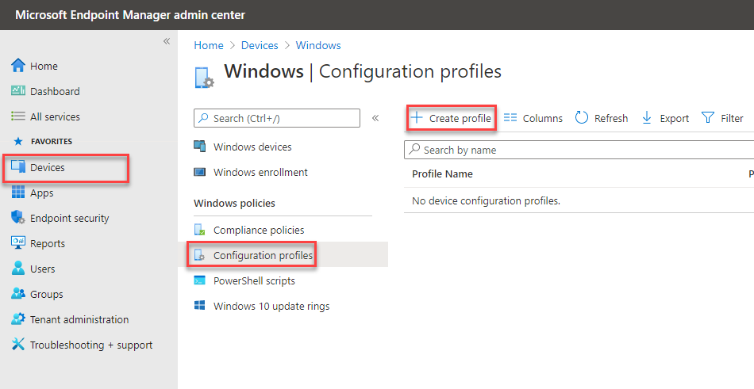
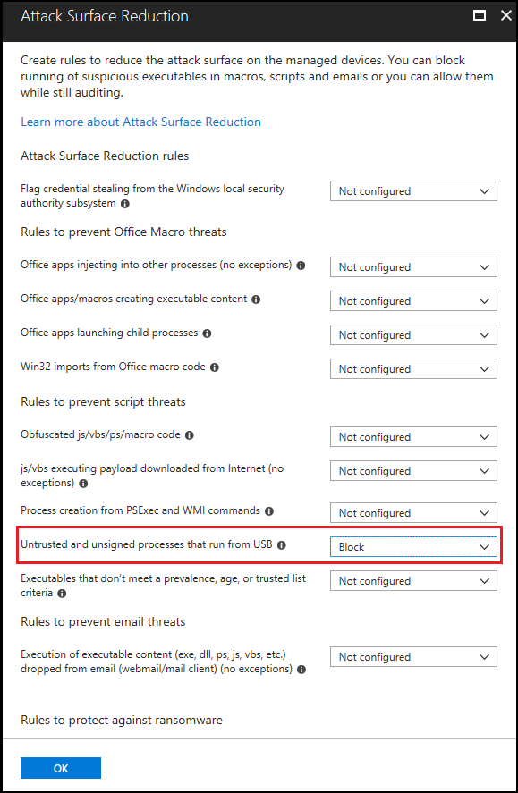

# <a name="how-to-control-usb-devices-and-other-removable-media-using-microsoft-defender-for-endpoint"></a><span data-ttu-id="e1638-103">Steuern von USB-Geräten und anderen Wechselmedien mit Microsoft Defender für Endpunkt</span><span class="sxs-lookup"><span data-stu-id="e1638-103">How to control USB devices and other removable media using Microsoft Defender for Endpoint</span></span>

<span data-ttu-id="e1638-104">**Gilt für:** [Microsoft Defender für Endpunkt](https://go.microsoft.com/fwlink/p/?linkid=2069559)</span><span class="sxs-lookup"><span data-stu-id="e1638-104">**Applies to:** [Microsoft Defender for Endpoint](https://go.microsoft.com/fwlink/p/?linkid=2069559)</span></span>

<span data-ttu-id="e1638-105">Microsoft empfiehlt [einen mehrstufigen Ansatz zum Schützen von Wechselmedien,](https://aka.ms/devicecontrolblog)und Microsoft Defender für Endpunkt bietet mehrere Überwachungs- und Kontrollfunktionen, um zu verhindern, dass Bedrohungen in nicht autorisierten Peripheriegeräten Ihre Geräte beeinträchtigen:</span><span class="sxs-lookup"><span data-stu-id="e1638-105">Microsoft recommends [a layered approach to securing removable media](https://aka.ms/devicecontrolblog), and Microsoft Defender for Endpoint provides multiple monitoring and control features to help prevent threats in unauthorized peripherals from compromising your devices:</span></span>

1. <span data-ttu-id="e1638-106">[Entdecken Sie verbundene Ereignisse für Peripheriegeräte in Der erweiterten Suche in Microsoft Defender für Endpunkt.](#discover-plug-and-play-connected-events)</span><span class="sxs-lookup"><span data-stu-id="e1638-106">[Discover plug and play connected events for peripherals in Microsoft Defender for Endpoint advanced hunting](#discover-plug-and-play-connected-events).</span></span> <span data-ttu-id="e1638-107">Identifizieren oder untersuchen Sie verdächtige Nutzungsaktivitäten.</span><span class="sxs-lookup"><span data-stu-id="e1638-107">Identify or investigate suspicious usage activity.</span></span>

2. <span data-ttu-id="e1638-108">Konfigurieren Sie die Konfiguration, um nur bestimmte Wechselmedien zuzulassen oder zu blockieren und Bedrohungen zu verhindern.</span><span class="sxs-lookup"><span data-stu-id="e1638-108">Configure to allow or block only certain removable devices and prevent threats.</span></span>
    1. <span data-ttu-id="e1638-109">[Zulassen oder Blockieren von Wechselmedien](#allow-or-block-removable-devices) basierend auf einer granularen Konfiguration, um den Schreibzugriff auf Wechseldatenträger zu verweigern und Geräte mithilfe von USB-Geräte-IDs zu genehmigen oder zu verweigern.</span><span class="sxs-lookup"><span data-stu-id="e1638-109">[Allow or block removable devices](#allow-or-block-removable-devices) based on granular configuration to deny write access to removable disks and approve or deny devices by using USB device IDs.</span></span> <span data-ttu-id="e1638-110">Flexible Richtlinienzuweisung von Geräteinstallationseinstellungen basierend auf einer Person oder Gruppe von Azure Active Directory (Azure AD)-Benutzern und -Geräten.</span><span class="sxs-lookup"><span data-stu-id="e1638-110">Flexible policy assignment of device installation settings based on an individual or group of Azure Active Directory (Azure AD) users and devices.</span></span>

    2. <span data-ttu-id="e1638-111">[Verhindern Sie Bedrohungen durch Wechselmedien,](#prevent-threats-from-removable-storage) die von Wechselmedien eingeführt wurden, indem Sie Folgendes aktivieren:</span><span class="sxs-lookup"><span data-stu-id="e1638-111">[Prevent threats from removable storage](#prevent-threats-from-removable-storage) introduced by removable storage devices by enabling:</span></span>  
        - <span data-ttu-id="e1638-112">Microsoft Defender Antivirus Echtzeitschutz (Real-Time Protection, RTP) zum Scannen von Wechselmedien auf Schadsoftware.</span><span class="sxs-lookup"><span data-stu-id="e1638-112">Microsoft Defender Antivirus real-time protection (RTP) to scan removable storage for malware.</span></span>  
        - <span data-ttu-id="e1638-113">Die ASR-USB-Regel (Attack Surface Reduction), um nicht vertrauenswürdige und nicht signierte Prozesse zu blockieren, die über USB ausgeführt werden.</span><span class="sxs-lookup"><span data-stu-id="e1638-113">The Attack Surface Reduction (ASR) USB rule to block untrusted and unsigned processes that run from USB.</span></span>  
        - <span data-ttu-id="e1638-114">DMA-Schutzeinstellungen (Direct Memory Access) zur Minderung von DMA-Angriffen, einschließlich Kernel-DMA-Schutz für Thunderbolt und Blockieren von DMA, bis sich ein Benutzer anmeldet.</span><span class="sxs-lookup"><span data-stu-id="e1638-114">Direct Memory Access (DMA) protection settings to mitigate DMA attacks, including Kernel DMA Protection for Thunderbolt and blocking DMA until a user signs in.</span></span>  

3. <span data-ttu-id="e1638-115">[Create customized alerts and response actions](#create-customized-alerts-and-response-actions) to monitor usage of removable devices based on these plug and play events or any other Microsoft Defender for Endpoint events with [custom detection rules](/microsoft-365/security/defender-endpoint/custom-detection-rules).</span><span class="sxs-lookup"><span data-stu-id="e1638-115">[Create customized alerts and response actions](#create-customized-alerts-and-response-actions) to monitor usage of removable devices based on these plug and play events or any other Microsoft Defender for Endpoint events with [custom detection rules](/microsoft-365/security/defender-endpoint/custom-detection-rules).</span></span>

4. <span data-ttu-id="e1638-116">Reagieren Sie basierend auf den von jedem Peripheriegerät gemeldeten Eigenschaften in Echtzeit auf [Bedrohungen](#respond-to-threats) durch Peripheriegeräte.</span><span class="sxs-lookup"><span data-stu-id="e1638-116">[Respond to threats](#respond-to-threats) from peripherals in real-time based on properties reported by each peripheral.</span></span>

>[!Note]
><span data-ttu-id="e1638-117">Diese Maßnahmen zur Bedrohungsreduzierung verhindern, dass Schadsoftware in Ihre Umgebung gelangt.</span><span class="sxs-lookup"><span data-stu-id="e1638-117">These threat reduction measures help prevent malware from coming into your environment.</span></span> <span data-ttu-id="e1638-118">Um zu verhindern, dass Unternehmensdaten Ihre Umgebung verlassen, können Sie auch Maßnahmen zur Verhinderung von Datenverlust konfigurieren.</span><span class="sxs-lookup"><span data-stu-id="e1638-118">To protect enterprise data from leaving your environment, you can also configure data loss prevention measures.</span></span> <span data-ttu-id="e1638-119">Beispielsweise können Sie auf Windows 10 Geräten [BitLocker](/windows/security/information-protection/bitlocker/bitlocker-overview.md) und [Windows Information Protection](/windows/security/information-protection/create-wip-policy-using-intune-azure.md)konfigurieren, wodurch Unternehmensdaten verschlüsselt werden, auch wenn sie auf einem persönlichen Gerät gespeichert sind, oder den [Storage/RemovableDiskDenyWriteAccess CSP](/windows/client-management/mdm/policy-csp-storage#storage-removablediskdenywriteaccess) verwenden, um den Schreibzugriff auf Wechseldatenträger zu verweigern.</span><span class="sxs-lookup"><span data-stu-id="e1638-119">For example, on Windows 10 devices you can configure [BitLocker](/windows/security/information-protection/bitlocker/bitlocker-overview.md) and [Windows Information Protection](/windows/security/information-protection/create-wip-policy-using-intune-azure.md), which will encrypt company data even if it is stored on a personal device, or use the [Storage/RemovableDiskDenyWriteAccess CSP](/windows/client-management/mdm/policy-csp-storage#storage-removablediskdenywriteaccess) to deny write access to removable disks.</span></span> <span data-ttu-id="e1638-120">Darüber hinaus können Sie Dateien auf Windows Geräten (einschließlich der angeschlossenen USB-Geräte) mithilfe von Microsoft Defender für Endpunkt und Azure Information Protection [klassifizieren](/windows/security/threat-protection/windows-defender-atp/information-protection-in-windows-overview) und schützen.</span><span class="sxs-lookup"><span data-stu-id="e1638-120">Additionally, you can [classify and protect files on Windows devices](/windows/security/threat-protection/windows-defender-atp/information-protection-in-windows-overview) (including their mounted USB devices) by using Microsoft Defender for Endpoint and Azure Information Protection.</span></span>

## <a name="discover-plug-and-play-connected-events"></a><span data-ttu-id="e1638-121">Entdecken von verbundenen Plug & Play-Ereignissen</span><span class="sxs-lookup"><span data-stu-id="e1638-121">Discover plug and play connected events</span></span>

<span data-ttu-id="e1638-122">Sie können verbundene Ereignisse in Der erweiterten Suche in Microsoft Defender für Endpunkt anzeigen und wiedergeben, um verdächtige Nutzungsaktivitäten zu identifizieren oder interne Untersuchungen durchzuführen.</span><span class="sxs-lookup"><span data-stu-id="e1638-122">You can view plug and play connected events in Microsoft Defender for Endpoint advanced hunting to identify suspicious usage activity or perform internal investigations.</span></span>
<span data-ttu-id="e1638-123">Beispiele für Erweiterte Suchabfragen für Defender für Endpunkt finden Sie im [Microsoft Defender für Endpunkt-Suchabfragen GitHub Repository.](https://github.com/Microsoft/WindowsDefenderATP-Hunting-Queries)</span><span class="sxs-lookup"><span data-stu-id="e1638-123">For examples of Defender for Endpoint advanced hunting queries, see the [Microsoft Defender for Endpoint hunting queries GitHub repo](https://github.com/Microsoft/WindowsDefenderATP-Hunting-Queries).</span></span>

<span data-ttu-id="e1638-124">Beispiel Power BI Berichtsvorlagen für Microsoft Defender für Endpunkt verfügbar sind, die Sie für erweiterte Suchabfragen verwenden können.</span><span class="sxs-lookup"><span data-stu-id="e1638-124">Sample Power BI report templates are available for Microsoft Defender for Endpoint that you can use for Advanced hunting queries.</span></span> <span data-ttu-id="e1638-125">Mit diesen Beispielvorlagen, einschließlich einer für die Gerätesteuerung, können Sie die Leistungsfähigkeit der erweiterten Suche in Power BI integrieren.</span><span class="sxs-lookup"><span data-stu-id="e1638-125">With these sample templates, including one for device control, you can integrate the power of Advanced hunting into Power BI.</span></span> <span data-ttu-id="e1638-126">Weitere Informationen finden Sie im [GitHub-Repository für PowerBI-Vorlagen.](https://github.com/microsoft/MDATP-PowerBI-Templates)</span><span class="sxs-lookup"><span data-stu-id="e1638-126">See the [GitHub repository for PowerBI templates](https://github.com/microsoft/MDATP-PowerBI-Templates) for more information.</span></span> <span data-ttu-id="e1638-127">Weitere Informationen zu Power BI Integration finden Sie unter [Erstellen von benutzerdefinierten Berichten mit Power BI.](/microsoft-365/security/defender-endpoint/api-power-bi)</span><span class="sxs-lookup"><span data-stu-id="e1638-127">See [Create custom reports using Power BI](/microsoft-365/security/defender-endpoint/api-power-bi) to learn more about Power BI integration.</span></span>

## <a name="allow-or-block-removable-devices"></a><span data-ttu-id="e1638-128">Zulassen oder Blockieren von Wechselmedien</span><span class="sxs-lookup"><span data-stu-id="e1638-128">Allow or block removable devices</span></span>
<span data-ttu-id="e1638-129">In der folgenden Tabelle werden die Möglichkeiten beschrieben, wie Microsoft Defender für Endpunkt Wechselmedien basierend auf einer granularen Konfiguration zulassen oder blockieren kann.</span><span class="sxs-lookup"><span data-stu-id="e1638-129">The following table describes the ways Microsoft Defender for Endpoint can allow or block removable devices based on granular configuration.</span></span>

| <span data-ttu-id="e1638-130">Steuerelement</span><span class="sxs-lookup"><span data-stu-id="e1638-130">Control</span></span>  | <span data-ttu-id="e1638-131">Beschreibung</span><span class="sxs-lookup"><span data-stu-id="e1638-131">Description</span></span> |
|----------|-------------|
| [<span data-ttu-id="e1638-132">Einschränken von USB-Laufwerken und anderen Peripheriegeräten</span><span class="sxs-lookup"><span data-stu-id="e1638-132">Restrict USB drives and other peripherals</span></span>](#restrict-usb-drives-and-other-peripherals) | <span data-ttu-id="e1638-133">Sie können zulassen/verhindern, dass Benutzer nur die USB-Laufwerke und andere Peripheriegeräte installieren, die in einer Liste autorisierter/nicht autorisierter Geräte oder Gerätetypen enthalten sind.</span><span class="sxs-lookup"><span data-stu-id="e1638-133">You can allow/prevent users to install only the USB drives and other peripherals included on a list of authorized/unauthorized devices or device types.</span></span> |
| [<span data-ttu-id="e1638-134">Blockieren der Installation und Verwendung von Wechselmedien</span><span class="sxs-lookup"><span data-stu-id="e1638-134">Block installation and usage of removable storage</span></span>](#block-installation-and-usage-of-removable-storage) | <span data-ttu-id="e1638-135">Wechselmedien können nicht installiert oder verwendet werden.</span><span class="sxs-lookup"><span data-stu-id="e1638-135">You can't install or use removable storage.</span></span> |
| [<span data-ttu-id="e1638-136">Zulassen der Installation und Verwendung von speziell genehmigten Peripheriegeräten</span><span class="sxs-lookup"><span data-stu-id="e1638-136">Allow installation and usage of specifically approved peripherals</span></span>](#allow-installation-and-usage-of-specifically-approved-peripherals)   | <span data-ttu-id="e1638-137">Sie können nur genehmigte Peripheriegeräte installieren und verwenden, die bestimmte Eigenschaften in ihrer Firmware melden.</span><span class="sxs-lookup"><span data-stu-id="e1638-137">You can only install and use approved peripherals that report specific properties in their firmware.</span></span> |
| [<span data-ttu-id="e1638-138">Verhindern der Installation von speziell verbotenen Peripheriegeräten</span><span class="sxs-lookup"><span data-stu-id="e1638-138">Prevent installation of specifically prohibited peripherals</span></span>](#prevent-installation-of-specifically-prohibited-peripherals) | <span data-ttu-id="e1638-139">Sie können keine verbotenen Peripheriegeräte installieren oder verwenden, die bestimmte Eigenschaften in ihrer Firmware melden.</span><span class="sxs-lookup"><span data-stu-id="e1638-139">You can't install or use prohibited peripherals that report specific properties in their firmware.</span></span> |
| [<span data-ttu-id="e1638-140">Installation und Verwendung von speziell genehmigten Peripheriegeräten mit übereinstimmenden Geräteinstanz-IDs zulassen</span><span class="sxs-lookup"><span data-stu-id="e1638-140">Allow installation and usage of specifically approved peripherals with matching device instance IDs</span></span>](#allow-installation-and-usage-of-specifically-approved-peripherals-with-matching-device-instance-ids) | <span data-ttu-id="e1638-141">Sie können nur genehmigte Peripheriegeräte installieren und verwenden, die einer dieser Geräteinstanz-IDs entsprechen.</span><span class="sxs-lookup"><span data-stu-id="e1638-141">You can only install and use approved peripherals that match any of these device instance IDs.</span></span> |
| [<span data-ttu-id="e1638-142">Verhindern der Installation und Verwendung von speziell verbotenen Peripheriegeräten mit übereinstimmenden Geräteinstanz-IDs</span><span class="sxs-lookup"><span data-stu-id="e1638-142">Prevent installation and usage of specifically prohibited peripherals with matching device instance IDs</span></span>](#prevent-installation-and-usage-of-specifically-prohibited-peripherals-with-matching-device-instance-ids) | <span data-ttu-id="e1638-143">Sie können keine verbotenen Peripheriegeräte installieren oder verwenden, die einer dieser Geräteinstanz-IDs entsprechen.</span><span class="sxs-lookup"><span data-stu-id="e1638-143">You can't install or use prohibited peripherals that match any of these device instance IDs.</span></span> |
| [<span data-ttu-id="e1638-144">Einschränken von Diensten, die Bluetooth verwenden</span><span class="sxs-lookup"><span data-stu-id="e1638-144">Limit services that use Bluetooth</span></span>](#limit-services-that-use-bluetooth) | <span data-ttu-id="e1638-145">Sie können die Dienste einschränken, die Bluetooth verwenden können.</span><span class="sxs-lookup"><span data-stu-id="e1638-145">You can limit the services that can use Bluetooth.</span></span> |
| [<span data-ttu-id="e1638-146">Verwenden von Microsoft Defender für Endpunkt-Basisplaneinstellungen</span><span class="sxs-lookup"><span data-stu-id="e1638-146">Use Microsoft Defender for Endpoint baseline settings</span></span>](#use-microsoft-defender-for-endpoint-baseline-settings) | <span data-ttu-id="e1638-147">Sie können die empfohlene Konfiguration für ATP mithilfe der Defender für Endpunkt-Sicherheitsgrundwerte festlegen.</span><span class="sxs-lookup"><span data-stu-id="e1638-147">You can set the recommended configuration for ATP by using the Defender for Endpoint security baseline.</span></span> |

### <a name="restrict-usb-drives-and-other-peripherals"></a><span data-ttu-id="e1638-148">Einschränken von USB-Laufwerken und anderen Peripheriegeräten</span><span class="sxs-lookup"><span data-stu-id="e1638-148">Restrict USB drives and other peripherals</span></span>

<span data-ttu-id="e1638-149">Um Schadsoftware-Infektionen oder Datenverluste zu verhindern, kann eine Organisation USB-Laufwerke und andere Peripheriegeräte einschränken.</span><span class="sxs-lookup"><span data-stu-id="e1638-149">To prevent malware infections or data loss, an organization may restrict USB drives and other peripherals.</span></span> <span data-ttu-id="e1638-150">In der folgenden Tabelle wird beschrieben, wie Microsoft Defender für Endpunkt die Installation und Verwendung von USB-Laufwerken und anderen Peripheriegeräten verhindern kann.</span><span class="sxs-lookup"><span data-stu-id="e1638-150">The following table describes the ways Microsoft Defender for Endpoint can help prevent installation and usage of USB drives and other peripherals.</span></span>

| <span data-ttu-id="e1638-151">Steuerelement</span><span class="sxs-lookup"><span data-stu-id="e1638-151">Control</span></span>  | <span data-ttu-id="e1638-152">Beschreibung</span><span class="sxs-lookup"><span data-stu-id="e1638-152">Description</span></span>
|----------|-------------|
| [<span data-ttu-id="e1638-153">Installation und Verwendung von USB-Laufwerken und anderen Peripheriegeräten zulassen</span><span class="sxs-lookup"><span data-stu-id="e1638-153">Allow installation and usage of USB drives and other peripherals</span></span>](#allow-installation-and-usage-of-usb-drives-and-other-peripherals) | <span data-ttu-id="e1638-154">Zulassen, dass Benutzer nur die USB-Laufwerke und andere Peripheriegeräte installieren können, die in einer Liste autorisierter Geräte oder Gerätetypen enthalten sind</span><span class="sxs-lookup"><span data-stu-id="e1638-154">Allow users to install only the USB drives and other peripherals included on a list of authorized devices or device types</span></span> |
| [<span data-ttu-id="e1638-155">Verhindern der Installation und Verwendung von USB-Laufwerken und anderen Peripheriegeräten</span><span class="sxs-lookup"><span data-stu-id="e1638-155">Prevent installation and usage of USB drives and other peripherals</span></span>](#prevent-installation-and-usage-of-usb-drives-and-other-peripherals) | <span data-ttu-id="e1638-156">Verhindern, dass Benutzer USB-Laufwerke und andere Peripheriegeräte installieren, die in einer Liste nicht autorisierter Geräte und Gerätetypen enthalten sind</span><span class="sxs-lookup"><span data-stu-id="e1638-156">Prevent users from installing USB drives and other peripherals included on a list of unauthorized devices and device types</span></span> |

<span data-ttu-id="e1638-157">Alle oben genannten Steuerelemente können über die [administrativen Intune-Vorlagen](/intune/administrative-templates-windows)festgelegt werden.</span><span class="sxs-lookup"><span data-stu-id="e1638-157">All of the above controls can be set through the Intune [Administrative Templates](/intune/administrative-templates-windows).</span></span> <span data-ttu-id="e1638-158">Die relevanten Richtlinien finden Sie hier in den Intune-Administratorvorlagen:</span><span class="sxs-lookup"><span data-stu-id="e1638-158">The relevant policies are located here in the Intune Administrator Templates:</span></span>


>[!Note]
><span data-ttu-id="e1638-160">Mit Intune können Sie Gerätekonfigurationsrichtlinien auf Azure AD-Benutzer und/oder Gerätegruppen anwenden.</span><span class="sxs-lookup"><span data-stu-id="e1638-160">Using Intune, you can apply device configuration policies to Azure AD user and/or device groups.</span></span>
<span data-ttu-id="e1638-161">Die oben genannten Richtlinien können auch über die [CSP-Einstellungen](/windows/client-management/mdm/policy-csp-deviceinstallation) für die Geräteinstallation und die [Geräteinstallations-GPOs](/previous-versions/dotnet/articles/bb530324(v=msdn.10))festgelegt werden.</span><span class="sxs-lookup"><span data-stu-id="e1638-161">The above policies can also be set through the [Device Installation CSP settings](/windows/client-management/mdm/policy-csp-deviceinstallation) and the [Device Installation GPOs](/previous-versions/dotnet/articles/bb530324(v=msdn.10)).</span></span>

> [!Note]
> <span data-ttu-id="e1638-162">Testen und verfeinern Sie diese Einstellungen immer zuerst mit einer Pilotgruppe von Benutzern und Geräten, bevor Sie sie in der Produktion anwenden.</span><span class="sxs-lookup"><span data-stu-id="e1638-162">Always test and refine these settings with a pilot group of users and devices first before applying them in production.</span></span>
<span data-ttu-id="e1638-163">Weitere Informationen zum Steuern von USB-Geräten finden Sie im [Microsoft Defender für Endpunkt-Blog.](https://www.microsoft.com/security/blog/2018/12/19/windows-defender-atp-has-protections-for-usb-and-removable-devices/)</span><span class="sxs-lookup"><span data-stu-id="e1638-163">For more information about controlling USB devices, see the [Microsoft Defender for Endpoint blog](https://www.microsoft.com/security/blog/2018/12/19/windows-defender-atp-has-protections-for-usb-and-removable-devices/).</span></span>

#### <a name="allow-installation-and-usage-of-usb-drives-and-other-peripherals"></a><span data-ttu-id="e1638-164">Installation und Verwendung von USB-Laufwerken und anderen Peripheriegeräten zulassen</span><span class="sxs-lookup"><span data-stu-id="e1638-164">Allow installation and usage of USB drives and other peripherals</span></span>

<span data-ttu-id="e1638-165">Eine Möglichkeit, die Installation und Verwendung von USB-Laufwerken und anderen Peripheriegeräten zuzulassen, besteht darin, zunächst alles zuzulassen.</span><span class="sxs-lookup"><span data-stu-id="e1638-165">One way to approach allowing installation and usage of USB drives and other peripherals is to start by allowing everything.</span></span> <span data-ttu-id="e1638-166">Danach können Sie damit beginnen, die zulässigen USB-Treiber und andere Peripheriegeräte zu reduzieren.</span><span class="sxs-lookup"><span data-stu-id="e1638-166">Afterwards, you can start reducing the allowable USB drivers and other peripherals.</span></span>

>[!Note]
><span data-ttu-id="e1638-167">Da ein nicht autorisiertes USB-Peripheriegerät Firmware haben kann, die die USB-Eigenschaften spooft, wird empfohlen, nur speziell genehmigte USB-Peripheriegeräte zuzulassen und die Benutzer einzuschränken, die darauf zugreifen können.</span><span class="sxs-lookup"><span data-stu-id="e1638-167">Because an unauthorized USB peripheral can have firmware that spoofs its USB properties, we recommend only allowing specifically approved USB peripherals and limiting the users who can access them.</span></span>

1. <span data-ttu-id="e1638-168">Enable **Prevent installation of devices not described by other policy settings** to all users.</span><span class="sxs-lookup"><span data-stu-id="e1638-168">Enable **Prevent installation of devices not described by other policy settings** to all users.</span></span>
2. <span data-ttu-id="e1638-169">Enable **Allow installation of devices using drivers that match these device setup classes** for all device setup [classes](/windows-hardware/drivers/install/system-defined-device-setup-classes-available-to-vendors).</span><span class="sxs-lookup"><span data-stu-id="e1638-169">Enable **Allow installation of devices using drivers that match these device setup classes** for all [device setup classes](/windows-hardware/drivers/install/system-defined-device-setup-classes-available-to-vendors).</span></span>

<span data-ttu-id="e1638-170">Um die Richtlinie für bereits installierte Geräte zu erzwingen, wenden Sie die Richtlinien zur Verhinderung dieser Einstellung an.</span><span class="sxs-lookup"><span data-stu-id="e1638-170">To enforce the policy for already installed devices, apply the prevent policies that have this setting.</span></span>

<span data-ttu-id="e1638-171">Wenn Sie die Richtlinie für die Installation von Geräten zulassen konfigurieren, müssen Sie auch alle übergeordneten Attribute zulassen.</span><span class="sxs-lookup"><span data-stu-id="e1638-171">When configuring the allow device installation policy, you must allow all parent attributes as well.</span></span> <span data-ttu-id="e1638-172">Sie können die untergeordneten Elemente eines Geräts anzeigen, indem Sie den Geräte-Manager öffnen und nach Verbindung anzeigen.</span><span class="sxs-lookup"><span data-stu-id="e1638-172">You can view the parents of a device by opening Device Manager and view by connection.</span></span>


<span data-ttu-id="e1638-174">In diesem Beispiel mussten die folgenden Klassen hinzugefügt werden: HID, Tastatur und {36fc9e60-c465-11cf-8056-444553540000}.</span><span class="sxs-lookup"><span data-stu-id="e1638-174">In this example, the following classes needed to be added: HID, Keyboard, and {36fc9e60-c465-11cf-8056-444553540000}.</span></span> <span data-ttu-id="e1638-175">Weitere Informationen finden Sie unter von [Microsoft bereitgestellte USB-Treiber.](/windows-hardware/drivers/usbcon/supported-usb-classes)</span><span class="sxs-lookup"><span data-stu-id="e1638-175">See [Microsoft-provided USB drivers](/windows-hardware/drivers/usbcon/supported-usb-classes) for more information.</span></span>


<span data-ttu-id="e1638-177">Wenn Sie bestimmte Geräte einschränken möchten, entfernen Sie die Geräteeinrichtungsklasse des Peripheriegeräts, das Sie einschränken möchten.</span><span class="sxs-lookup"><span data-stu-id="e1638-177">If you want to restrict to certain devices, remove the device setup class of the peripheral that you want to limit.</span></span> <span data-ttu-id="e1638-178">Fügen Sie dann die Geräte-ID hinzu, die Sie hinzufügen möchten.</span><span class="sxs-lookup"><span data-stu-id="e1638-178">Then add the device ID that you want to add.</span></span> <span data-ttu-id="e1638-179">Die Geräte-ID basiert auf den Lieferanten-ID- und Produkt-ID-Werten für ein Gerät.</span><span class="sxs-lookup"><span data-stu-id="e1638-179">Device ID is based on the vendor ID and product ID values for a device.</span></span> <span data-ttu-id="e1638-180">Informationen zu Geräte-ID-Formaten finden Sie unter [Standard-USB-IDs.](/windows-hardware/drivers/install/standard-usb-identifiers)</span><span class="sxs-lookup"><span data-stu-id="e1638-180">For information on device ID formats, see [Standard USB Identifiers](/windows-hardware/drivers/install/standard-usb-identifiers).</span></span> 

<span data-ttu-id="e1638-181">Informationen zum Suchen der Geräte-IDs finden Sie unter ["Geräte-ID nachschlagen".](#look-up-device-id)</span><span class="sxs-lookup"><span data-stu-id="e1638-181">To find the device IDs, see [Look up device ID](#look-up-device-id).</span></span> 

<span data-ttu-id="e1638-182">Beispiel:</span><span class="sxs-lookup"><span data-stu-id="e1638-182">For example:</span></span>

1. <span data-ttu-id="e1638-183">Entfernen Sie die Klasse USBDevice aus der **Allow installation of devices using drivers that match these device setup**.</span><span class="sxs-lookup"><span data-stu-id="e1638-183">Remove class USBDevice from the **Allow installation of devices using drivers that match these device setup**.</span></span>
2. <span data-ttu-id="e1638-184">Fügen Sie die zuzulassende Geräte-ID in der **Option "Installation zulassen" eines Geräts hinzu, das einer dieser Geräte-IDs entspricht.**</span><span class="sxs-lookup"><span data-stu-id="e1638-184">Add the device ID to allow in the **Allow installation of device that match any of these device IDs**.</span></span> 


#### <a name="prevent-installation-and-usage-of-usb-drives-and-other-peripherals"></a><span data-ttu-id="e1638-185">Verhindern der Installation und Verwendung von USB-Laufwerken und anderen Peripheriegeräten</span><span class="sxs-lookup"><span data-stu-id="e1638-185">Prevent installation and usage of USB drives and other peripherals</span></span>

<span data-ttu-id="e1638-186">Wenn Sie die Installation einer Geräteklasse oder bestimmter Geräte verhindern möchten, können Sie die Richtlinien zum Verhindern der Geräteinstallation verwenden:</span><span class="sxs-lookup"><span data-stu-id="e1638-186">If you want to prevent the installation of a device class or certain devices, you can use the prevent device installation policies:</span></span>

1. <span data-ttu-id="e1638-187">Aktivieren Sie **"Installation von Geräten verhindern", die einer dieser Geräte-IDs entsprechen,** und fügen Sie diese Geräte der Liste hinzu.</span><span class="sxs-lookup"><span data-stu-id="e1638-187">Enable **Prevent installation of devices that match any of these device IDs** and add these devices to the list.</span></span>
2. <span data-ttu-id="e1638-188">Enable **Prevent installation of devices using drivers that match these device setup classes**.</span><span class="sxs-lookup"><span data-stu-id="e1638-188">Enable **Prevent installation of devices using drivers that match these device setup classes**.</span></span>

> [!Note]
> <span data-ttu-id="e1638-189">Die Richtlinien zum Verhindern der Geräteinstallation haben Vorrang vor den Richtlinien für die Geräteinstallation zulassen.</span><span class="sxs-lookup"><span data-stu-id="e1638-189">The prevent device installation policies take precedence over the allow device installation policies.</span></span>

<span data-ttu-id="e1638-190">Mit der Richtlinie zum Verhindern der Installation von Geräten, die einer **dieser Geräte-IDs-Richtlinien entsprechen,** können Sie eine Liste der Geräte angeben, die Windows nicht installiert werden kann.</span><span class="sxs-lookup"><span data-stu-id="e1638-190">The **Prevent installation of devices that match any of these device IDs** policy allows you to specify a list of devices that Windows is prevented from installing.</span></span> 

<span data-ttu-id="e1638-191">So verhindern Sie die Installation von Geräten, die einer dieser Geräte-IDs entsprechen:</span><span class="sxs-lookup"><span data-stu-id="e1638-191">To prevent installation of devices that match any of these device IDs:</span></span> 

1. <span data-ttu-id="e1638-192">[Suchen Sie die Geräte-ID](#look-up-device-id) für Geräte, die Windows verhindern möchten, dass sie installiert werden.</span><span class="sxs-lookup"><span data-stu-id="e1638-192">[Look up device ID](#look-up-device-id) for devices that you want Windows to prevent from installing.</span></span>

   

2. <span data-ttu-id="e1638-194">Aktivieren Sie **"Verhindern der Installation von Geräten, die einer dieser Geräte-IDs entsprechen",** und fügen Sie der Liste die Anbieter- oder Produkt-IDs hinzu.</span><span class="sxs-lookup"><span data-stu-id="e1638-194">Enable **Prevent installation of devices that match any of these device IDs** and add the vendor or product IDs to the list.</span></span>

    

#### <a name="look-up-device-id"></a><span data-ttu-id="e1638-196">Geräte-ID nachschlagen</span><span class="sxs-lookup"><span data-stu-id="e1638-196">Look up device ID</span></span>

<span data-ttu-id="e1638-197">Sie können den Geräte-Manager verwenden, um eine Geräte-ID nachzuschlagen.</span><span class="sxs-lookup"><span data-stu-id="e1638-197">You can use Device Manager to look up a device ID.</span></span>

1. <span data-ttu-id="e1638-198">Öffnen Sie den Geräte-Manager.</span><span class="sxs-lookup"><span data-stu-id="e1638-198">Open Device Manager.</span></span>
2. <span data-ttu-id="e1638-199">Klicken Sie auf **"Anzeigen",** und wählen Sie **"Geräte nach Verbindung" aus.**</span><span class="sxs-lookup"><span data-stu-id="e1638-199">Click **View** and select **Devices by connection**.</span></span>
3. <span data-ttu-id="e1638-200">Klicken Sie in der Struktur mit der rechten Maustaste auf das Gerät, und wählen Sie **"Eigenschaften"** aus.</span><span class="sxs-lookup"><span data-stu-id="e1638-200">From the tree, right-click the device and select **Properties**.</span></span>
4. <span data-ttu-id="e1638-201">Klicken Sie im Dialogfeld für das ausgewählte Gerät auf die Registerkarte **"Details".**</span><span class="sxs-lookup"><span data-stu-id="e1638-201">In the dialog box for the selected device, click the **Details** tab.</span></span>
5. <span data-ttu-id="e1638-202">Klicken Sie auf die Dropdownliste **"Eigenschaft",** und wählen Sie **"Hardware-IDs" aus.**</span><span class="sxs-lookup"><span data-stu-id="e1638-202">Click the **Property** drop-down list and select **Hardware Ids**.</span></span>
6. <span data-ttu-id="e1638-203">Klicken Sie mit der rechten Maustaste auf den obersten ID-Wert, und wählen Sie **"Kopieren"** aus.</span><span class="sxs-lookup"><span data-stu-id="e1638-203">Right-click the top ID value and select **Copy**.</span></span>

<span data-ttu-id="e1638-204">Informationen zu Geräte-ID-Formaten finden Sie unter [Standard-USB-IDs.](/windows-hardware/drivers/install/standard-usb-identifiers)</span><span class="sxs-lookup"><span data-stu-id="e1638-204">For information about Device ID formats, see [Standard USB Identifiers](/windows-hardware/drivers/install/standard-usb-identifiers).</span></span>

<span data-ttu-id="e1638-205">Informationen zu Anbieter-IDs finden Sie unter ["USB-Mitglieder".](https://www.usb.org/members)</span><span class="sxs-lookup"><span data-stu-id="e1638-205">For information on vendor IDs, see [USB members](https://www.usb.org/members).</span></span>

<span data-ttu-id="e1638-206">Es folgt ein Beispiel für die Suche nach einer Geräteanbieter-ID oder Produkt-ID (die Teil der Geräte-ID ist) mithilfe von PowerShell:</span><span class="sxs-lookup"><span data-stu-id="e1638-206">The following is an example for looking up a device vendor ID or product ID (which is part of the device ID) using PowerShell:</span></span> 

```powershell
Get-WMIObject -Class Win32_DiskDrive |
Select-Object -Property * 
```

<span data-ttu-id="e1638-207">Die Richtlinie **zum Verhindern der Installation von Geräten mitHilfe von Treibern, die dieser Richtlinie für Geräteeinrichtungsklassen entsprechen,** ermöglicht es Ihnen, Geräteeinrichtungsklassen anzugeben, die Windows nicht installiert werden kann.</span><span class="sxs-lookup"><span data-stu-id="e1638-207">The **Prevent installation of devices using drivers that match these device setup classes** policy allows you to specify device setup classes that Windows is prevented from installing.</span></span> 

<span data-ttu-id="e1638-208">So verhindern Sie die Installation bestimmter Geräteklassen:</span><span class="sxs-lookup"><span data-stu-id="e1638-208">To prevent installation of particular classes of devices:</span></span> 

1. <span data-ttu-id="e1638-209">Suchen Sie die GUID der Geräteeinrichtungsklasse aus [systemdefinierten Geräteeinrichtungsklassen, die für Anbieter verfügbar sind.](/windows-hardware/drivers/install/system-defined-device-setup-classes-available-to-vendors)</span><span class="sxs-lookup"><span data-stu-id="e1638-209">Find the GUID of the device setup class from [System-Defined Device Setup Classes Available to Vendors](/windows-hardware/drivers/install/system-defined-device-setup-classes-available-to-vendors).</span></span>

2. <span data-ttu-id="e1638-210">Aktivieren Sie **"Installation von Geräten mit Treibern verhindern", die diesen Geräteeinrichtungsklassen entsprechen,** und fügen Sie der Liste die Klassen-GUID hinzu.</span><span class="sxs-lookup"><span data-stu-id="e1638-210">Enable **Prevent installation of devices using drivers that match these device setup classes** and add the class GUID to the list.</span></span>

    > [!div class="mx-imgBorder"]
    > <span data-ttu-id="e1638-211"></span><span class="sxs-lookup"><span data-stu-id="e1638-211"></span></span>

### <a name="block-installation-and-usage-of-removable-storage"></a><span data-ttu-id="e1638-212">Blockieren der Installation und Verwendung von Wechselmedien</span><span class="sxs-lookup"><span data-stu-id="e1638-212">Block installation and usage of removable storage</span></span>

1. <span data-ttu-id="e1638-213">Melden Sie sich beim [Microsoft Endpoint Manager Admin Center](https://endpoint.microsoft.com/)an.</span><span class="sxs-lookup"><span data-stu-id="e1638-213">Sign in to the [Microsoft Endpoint Manager admin center](https://endpoint.microsoft.com/).</span></span>

2. <span data-ttu-id="e1638-214">Klicken Sie auf **"Gerätekonfigurationsprofile**  >    >  **erstellen".**</span><span class="sxs-lookup"><span data-stu-id="e1638-214">Click **Devices** > **Configuration Profiles** > **Create profile**.</span></span>

    > [!div class="mx-imgBorder"]
    > <span data-ttu-id="e1638-215"></span><span class="sxs-lookup"><span data-stu-id="e1638-215"></span></span>

3. <span data-ttu-id="e1638-216">Verwenden Sie die folgenden Einstellungen:</span><span class="sxs-lookup"><span data-stu-id="e1638-216">Use the following settings:</span></span>

   - <span data-ttu-id="e1638-217">Name: Geben Sie einen Namen für das Profil ein.</span><span class="sxs-lookup"><span data-stu-id="e1638-217">Name: Type a name for the profile</span></span>
   - <span data-ttu-id="e1638-218">Beschreibung: Eingeben einer Beschreibung</span><span class="sxs-lookup"><span data-stu-id="e1638-218">Description: Type a description</span></span>
   - <span data-ttu-id="e1638-219">Plattform: Windows 10 und höher</span><span class="sxs-lookup"><span data-stu-id="e1638-219">Platform: Windows 10 and later</span></span>
   - <span data-ttu-id="e1638-220">Profiltyp: Geräteeinschränkungen</span><span class="sxs-lookup"><span data-stu-id="e1638-220">Profile type: Device restrictions</span></span>

   > [!div class="mx-imgBorder"]
   > <span data-ttu-id="e1638-221"></span><span class="sxs-lookup"><span data-stu-id="e1638-221"></span></span>

4. <span data-ttu-id="e1638-222">Klicken Sie auf   >  **"Allgemein konfigurieren".**</span><span class="sxs-lookup"><span data-stu-id="e1638-222">Click **Configure** > **General**.</span></span>  

5. <span data-ttu-id="e1638-223">Wählen Sie für **Wechselmedien** und **USB-Verbindung (nur mobil)** die Option **"Blockieren"** aus.</span><span class="sxs-lookup"><span data-stu-id="e1638-223">For **Removable storage** and **USB connection (mobile only)**, choose **Block**.</span></span> <span data-ttu-id="e1638-224">**Wechselmedien** enthalten USB-Laufwerke, während **usb-Verbindung (nur mobil)** USB-Ladevorgänge ausschließt, aber nur andere USB-Verbindungen auf mobilen Geräten enthält.</span><span class="sxs-lookup"><span data-stu-id="e1638-224">**Removable storage** includes USB drives, whereas **USB connection (mobile only)** excludes USB charging but includes other USB connections on mobile devices only.</span></span> 

   

6. <span data-ttu-id="e1638-226">Klicken Sie auf **"OK",** um **die allgemeinen** Einstellungen und **Geräteeinschränkungen** zu schließen.</span><span class="sxs-lookup"><span data-stu-id="e1638-226">Click **OK** to close **General** settings and **Device restrictions**.</span></span>

7. <span data-ttu-id="e1638-227">Klicken Sie auf **"Erstellen",** um das Profil zu speichern.</span><span class="sxs-lookup"><span data-stu-id="e1638-227">Click **Create** to save the profile.</span></span>

### <a name="allow-installation-and-usage-of-specifically-approved-peripherals"></a><span data-ttu-id="e1638-228">Zulassen der Installation und Verwendung von speziell genehmigten Peripheriegeräten</span><span class="sxs-lookup"><span data-stu-id="e1638-228">Allow installation and usage of specifically approved peripherals</span></span>

<span data-ttu-id="e1638-229">Peripheriegeräte, die installiert werden dürfen, können durch ihre [Hardwareidentität](/windows-hardware/drivers/install/device-identification-strings)angegeben werden.</span><span class="sxs-lookup"><span data-stu-id="e1638-229">Peripherals that are allowed to be installed can be specified by their [hardware identity](/windows-hardware/drivers/install/device-identification-strings).</span></span> <span data-ttu-id="e1638-230">Eine Liste allgemeiner Bezeichnerstrukturen finden Sie unter ["Gerätebezeichnerformate".](/windows-hardware/drivers/install/device-identifier-formats)</span><span class="sxs-lookup"><span data-stu-id="e1638-230">For a list of common identifier structures, see [Device Identifier Formats](/windows-hardware/drivers/install/device-identifier-formats).</span></span> <span data-ttu-id="e1638-231">Testen Sie die Konfiguration vor dem Rollout, um sicherzustellen, dass sie blockiert wird und die erwarteten Geräte zulässt.</span><span class="sxs-lookup"><span data-stu-id="e1638-231">Test the configuration prior to rolling it out to ensure it blocks and allows the devices expected.</span></span> <span data-ttu-id="e1638-232">Testen Sie im Idealfall verschiedene Instanzen der Hardware.</span><span class="sxs-lookup"><span data-stu-id="e1638-232">Ideally test various instances of the hardware.</span></span> <span data-ttu-id="e1638-233">Testen Sie beispielsweise mehrere USB-Sticks und nicht nur einen.</span><span class="sxs-lookup"><span data-stu-id="e1638-233">For example, test multiple USB keys rather than only one.</span></span>

<span data-ttu-id="e1638-234">Ein SyncML-Beispiel, das die Installation bestimmter Geräte-IDs zulässt, finden Sie unter [DeviceInstallation/AllowInstallationOfMatchingDeviceIDs CSP.](/windows/client-management/mdm/policy-csp-deviceinstallation#deviceinstallation-allowinstallationofmatchingdeviceids)</span><span class="sxs-lookup"><span data-stu-id="e1638-234">For a SyncML example that allows installation of specific device IDs, see [DeviceInstallation/AllowInstallationOfMatchingDeviceIDs CSP](/windows/client-management/mdm/policy-csp-deviceinstallation#deviceinstallation-allowinstallationofmatchingdeviceids).</span></span> <span data-ttu-id="e1638-235">Informationen zum Zulassen bestimmter Geräteklassen finden Sie unter [DeviceInstallation/AllowInstallationOfMatchingDeviceSetupClasses CSP.](/windows/client-management/mdm/policy-csp-deviceinstallation#deviceinstallation-allowinstallationofmatchingdevicesetupclasses)</span><span class="sxs-lookup"><span data-stu-id="e1638-235">To allow specific device classes, see [DeviceInstallation/AllowInstallationOfMatchingDeviceSetupClasses CSP](/windows/client-management/mdm/policy-csp-deviceinstallation#deviceinstallation-allowinstallationofmatchingdevicesetupclasses).</span></span>
<span data-ttu-id="e1638-236">Um die Installation bestimmter Geräte zuzulassen, muss auch [DeviceInstallation/PreventInstallationOfDevicesNotDescribedByOtherPolicySettings](/windows/client-management/mdm/policy-csp-deviceinstallation#deviceinstallation-preventinstallationofdevicesnotdescribedbyotherpolicysettings)aktiviert werden.</span><span class="sxs-lookup"><span data-stu-id="e1638-236">Allowing installation of specific devices requires also enabling [DeviceInstallation/PreventInstallationOfDevicesNotDescribedByOtherPolicySettings](/windows/client-management/mdm/policy-csp-deviceinstallation#deviceinstallation-preventinstallationofdevicesnotdescribedbyotherpolicysettings).</span></span>

### <a name="prevent-installation-of-specifically-prohibited-peripherals"></a><span data-ttu-id="e1638-237">Verhindern der Installation von speziell verbotenen Peripheriegeräten</span><span class="sxs-lookup"><span data-stu-id="e1638-237">Prevent installation of specifically prohibited peripherals</span></span>

<span data-ttu-id="e1638-238">Microsoft Defender für Endpunkt blockiert die Installation und Verwendung verbotener Peripheriegeräte mithilfe einer der folgenden Optionen:</span><span class="sxs-lookup"><span data-stu-id="e1638-238">Microsoft Defender for Endpoint blocks installation and usage of prohibited peripherals by using either of these options:</span></span>

- <span data-ttu-id="e1638-239">[Administrative Vorlagen](/intune/administrative-templates-windows) können alle Geräte mit einer übereinstimmenden Hardware-ID oder Setupklasse blockieren.</span><span class="sxs-lookup"><span data-stu-id="e1638-239">[Administrative Templates](/intune/administrative-templates-windows) can block any device with a matching hardware ID or setup class.</span></span>  
- <span data-ttu-id="e1638-240">[CSP-Einstellungen](/windows/client-management/mdm/policy-csp-deviceinstallation) für die Geräteinstallation mit einem benutzerdefinierten Profil in Intune.</span><span class="sxs-lookup"><span data-stu-id="e1638-240">[Device Installation CSP settings](/windows/client-management/mdm/policy-csp-deviceinstallation) with a custom profile in Intune.</span></span> <span data-ttu-id="e1638-241">Sie können [die Installation bestimmter Geräte-IDs](/windows/client-management/mdm/policy-csp-deviceinstallation#deviceinstallation-preventinstallationofmatchingdeviceids) oder [bestimmte Geräteklassen verhindern.](/windows/client-management/mdm/policy-csp-deviceinstallation#deviceinstallation-preventinstallationofmatchingdevicesetupclasses)</span><span class="sxs-lookup"><span data-stu-id="e1638-241">You can [prevent installation of specific device IDs](/windows/client-management/mdm/policy-csp-deviceinstallation#deviceinstallation-preventinstallationofmatchingdeviceids) or [prevent specific device classes](/windows/client-management/mdm/policy-csp-deviceinstallation#deviceinstallation-preventinstallationofmatchingdevicesetupclasses).</span></span>

### <a name="allow-installation-and-usage-of-specifically-approved-peripherals-with-matching-device-instance-ids"></a><span data-ttu-id="e1638-242">Installation und Verwendung von speziell genehmigten Peripheriegeräten mit übereinstimmenden Geräteinstanz-IDs zulassen</span><span class="sxs-lookup"><span data-stu-id="e1638-242">Allow installation and usage of specifically approved peripherals with matching device instance IDs</span></span>

<span data-ttu-id="e1638-243">Peripheriegeräte, die installiert werden dürfen, können durch ihre [Geräteinstanz-IDs](/windows-hardware/drivers/install/device-instance-ids)angegeben werden.</span><span class="sxs-lookup"><span data-stu-id="e1638-243">Peripherals that are allowed to be installed can be specified by their [device instance IDs](/windows-hardware/drivers/install/device-instance-ids).</span></span> <span data-ttu-id="e1638-244">Testen Sie die Konfiguration vor dem Rollout, um sicherzustellen, dass sie die erwarteten Geräte zulässt.</span><span class="sxs-lookup"><span data-stu-id="e1638-244">Test the configuration prior to rolling it out to ensure it allows the devices expected.</span></span> <span data-ttu-id="e1638-245">Testen Sie im Idealfall verschiedene Instanzen der Hardware.</span><span class="sxs-lookup"><span data-stu-id="e1638-245">Ideally test various instances of the hardware.</span></span> <span data-ttu-id="e1638-246">Testen Sie beispielsweise mehrere USB-Sticks und nicht nur einen.</span><span class="sxs-lookup"><span data-stu-id="e1638-246">For example, test multiple USB keys rather than only one.</span></span>

<span data-ttu-id="e1638-247">Sie können die Installation und Verwendung genehmigter Peripheriegeräte mit übereinstimmenden Geräteinstanz-IDs zulassen, indem Sie die Richtlinieneinstellung ["DeviceInstallation/AllowInstallationOfMatchingDeviceInstanceIDs"](/windows/client-management/mdm/policy-csp-deviceinstallation#deviceinstallation-allowinstallationofmatchingdeviceinstanceids) konfigurieren.</span><span class="sxs-lookup"><span data-stu-id="e1638-247">You can allow installation and usage of approved peripherals with matching device instance IDs by configuring [DeviceInstallation/AllowInstallationOfMatchingDeviceInstanceIDs](/windows/client-management/mdm/policy-csp-deviceinstallation#deviceinstallation-allowinstallationofmatchingdeviceinstanceids) policy setting.</span></span>

### <a name="prevent-installation-and-usage-of-specifically-prohibited-peripherals-with-matching-device-instance-ids"></a><span data-ttu-id="e1638-248">Verhindern der Installation und Verwendung von speziell verbotenen Peripheriegeräten mit übereinstimmenden Geräteinstanz-IDs</span><span class="sxs-lookup"><span data-stu-id="e1638-248">Prevent installation and usage of specifically prohibited peripherals with matching device instance IDs</span></span>

<span data-ttu-id="e1638-249">Peripheriegeräte, die nicht installiert werden dürfen, können durch ihre [Geräteinstanz-IDs](/windows-hardware/drivers/install/device-instance-ids)angegeben werden.</span><span class="sxs-lookup"><span data-stu-id="e1638-249">Peripherals that are prohibited to be installed can be specified by their [device instance IDs](/windows-hardware/drivers/install/device-instance-ids).</span></span> <span data-ttu-id="e1638-250">Testen Sie die Konfiguration vor dem Rollout, um sicherzustellen, dass sie die erwarteten Geräte zulässt.</span><span class="sxs-lookup"><span data-stu-id="e1638-250">Test the configuration prior to rolling it out to ensure it allows the devices expected.</span></span> <span data-ttu-id="e1638-251">Testen Sie im Idealfall verschiedene Instanzen der Hardware.</span><span class="sxs-lookup"><span data-stu-id="e1638-251">Ideally test various instances of the hardware.</span></span> <span data-ttu-id="e1638-252">Testen Sie beispielsweise mehrere USB-Sticks und nicht nur einen.</span><span class="sxs-lookup"><span data-stu-id="e1638-252">For example, test multiple USB keys rather than only one.</span></span>

<span data-ttu-id="e1638-253">Sie können die Installation der verbotenen Peripheriegeräte mit übereinstimmenden Geräteinstanz-IDs verhindern, indem Sie die Richtlinieneinstellung ["DeviceInstallation/PreventInstallationOfMatchingDeviceInstanceIDs"](/windows/client-management/mdm/policy-csp-deviceinstallation#deviceinstallation-preventinstallationofmatchingdeviceinstanceids) konfigurieren.</span><span class="sxs-lookup"><span data-stu-id="e1638-253">You can prevent installation of the prohibited peripherals with matching device instance IDs by configuring [DeviceInstallation/PreventInstallationOfMatchingDeviceInstanceIDs](/windows/client-management/mdm/policy-csp-deviceinstallation#deviceinstallation-preventinstallationofmatchingdeviceinstanceids) policy setting.</span></span>

### <a name="limit-services-that-use-bluetooth"></a><span data-ttu-id="e1638-254">Beschränken von Diensten, die Bluetooth verwenden</span><span class="sxs-lookup"><span data-stu-id="e1638-254">Limit services that use Bluetooth</span></span>

<span data-ttu-id="e1638-255">Mit Intune können Sie die Dienste einschränken, die Bluetooth über die ["Bluetooth zulässigen Dienste"](/windows/client-management/mdm/policy-csp-bluetooth#servicesallowedlist-usage-guide)verwenden können.</span><span class="sxs-lookup"><span data-stu-id="e1638-255">Using Intune, you can limit the services that can use Bluetooth through the ["Bluetooth allowed services"](/windows/client-management/mdm/policy-csp-bluetooth#servicesallowedlist-usage-guide).</span></span> <span data-ttu-id="e1638-256">Der Standardstatus der Einstellungen "Bluetooth zugelassene Dienste" bedeutet, dass alles zulässig ist.</span><span class="sxs-lookup"><span data-stu-id="e1638-256">The default state of "Bluetooth allowed services" settings means everything is allowed.</span></span>  <span data-ttu-id="e1638-257">Sobald ein Dienst hinzugefügt wird, wird dieser zur Liste zugelassener Dienste.</span><span class="sxs-lookup"><span data-stu-id="e1638-257">As soon as a service is added, that becomes the allowed list.</span></span> <span data-ttu-id="e1638-258">Wenn der Kunde die Tastatur- und Mauswerte hinzufügt und die GUIDs für die Dateiübertragung nicht hinzufügt, sollte die Dateiübertragung blockiert werden.</span><span class="sxs-lookup"><span data-stu-id="e1638-258">If the customer adds the Keyboards and Mice values, and doesn’t add the file transfer GUIDs, file transfer should be blocked.</span></span>

> [!div class="mx-imgBorder"]
> <span data-ttu-id="e1638-259"></span><span class="sxs-lookup"><span data-stu-id="e1638-259"></span></span>

### <a name="use-microsoft-defender-for-endpoint-baseline-settings"></a><span data-ttu-id="e1638-260">Verwenden von Microsoft Defender für Endpunkt-Basisplaneinstellungen</span><span class="sxs-lookup"><span data-stu-id="e1638-260">Use Microsoft Defender for Endpoint baseline settings</span></span>

<span data-ttu-id="e1638-261">Die Microsoft Defender für Endpunkt-Basiseinstellungen stellen die empfohlene Konfiguration für den Bedrohungsschutz dar.</span><span class="sxs-lookup"><span data-stu-id="e1638-261">The Microsoft Defender for Endpoint baseline settings represent the recommended configuration for threat protection.</span></span> <span data-ttu-id="e1638-262">Konfigurationseinstellungen für den Basisplan befinden sich auf der Bearbeitungsprofilseite der Konfigurationseinstellungen.</span><span class="sxs-lookup"><span data-stu-id="e1638-262">Configuration settings for baseline are located in the edit profile page of the configuration settings.</span></span>

> [!div class="mx-imgBorder"]
> <span data-ttu-id="e1638-263"></span><span class="sxs-lookup"><span data-stu-id="e1638-263"></span></span>

## <a name="prevent-threats-from-removable-storage"></a><span data-ttu-id="e1638-264">Verhindern von Bedrohungen durch Wechselmedien</span><span class="sxs-lookup"><span data-stu-id="e1638-264">Prevent threats from removable storage</span></span>
  
<span data-ttu-id="e1638-265">Wechselmedien können ein zusätzliches Sicherheitsrisiko für Ihre Organisation darstellen.</span><span class="sxs-lookup"><span data-stu-id="e1638-265">Removable storage devices can introduce additional security risk to your organization.</span></span> <span data-ttu-id="e1638-266">Microsoft Defender für Endpunkt kann dabei helfen, schädliche Dateien auf Wechselmedien zu identifizieren und zu blockieren.</span><span class="sxs-lookup"><span data-stu-id="e1638-266">Microsoft Defender for Endpoint can help identify and block malicious files on removable storage devices.</span></span>

<span data-ttu-id="e1638-267">Microsoft Defender für Endpunkt kann auch verhindern, dass USB-Peripheriegeräte auf Geräten verwendet werden, um externe Bedrohungen zu verhindern.</span><span class="sxs-lookup"><span data-stu-id="e1638-267">Microsoft Defender for Endpoint can also prevent USB peripherals from being used on devices to help prevent external threats.</span></span> <span data-ttu-id="e1638-268">Dazu werden die von USB-Peripheriegeräten gemeldeten Eigenschaften verwendet, um zu bestimmen, ob sie auf dem Gerät installiert und verwendet werden können.</span><span class="sxs-lookup"><span data-stu-id="e1638-268">It does this by using the properties reported by USB peripherals to determine whether or not they can be installed and used on the device.</span></span>

<span data-ttu-id="e1638-269">Wenn Sie USB-Geräte oder andere Geräteklassen mithilfe der Geräteinstallationsrichtlinien blockieren, können verbundene Geräte wie Smartphones weiterhin aufgeladen werden.</span><span class="sxs-lookup"><span data-stu-id="e1638-269">Note that if you block USB devices or any other device classes using the device installation policies, connected devices, such as phones, can still charge.</span></span>

>[!NOTE]
><span data-ttu-id="e1638-270">Testen und verfeinern Sie diese Einstellungen immer zuerst mit einer Pilotgruppe von Benutzern und Geräten, bevor Sie sie an Ihre Organisation verteilen.</span><span class="sxs-lookup"><span data-stu-id="e1638-270">Always test and refine these settings with a pilot group of users and devices first before widely distributing to your organization.</span></span> 

<span data-ttu-id="e1638-271">In der folgenden Tabelle werden die Möglichkeiten beschrieben, wie Microsoft Defender für Endpunkt dazu beitragen kann, Bedrohungen durch Wechselmedien zu verhindern.</span><span class="sxs-lookup"><span data-stu-id="e1638-271">The following table describes the ways Microsoft Defender for Endpoint can help prevent threats from removable storage.</span></span>

<span data-ttu-id="e1638-272">Weitere Informationen zum Steuern von USB-Geräten finden Sie im [Microsoft Defender für Endpunkt-Blog.](https://aka.ms/devicecontrolblog)</span><span class="sxs-lookup"><span data-stu-id="e1638-272">For more information about controlling USB devices, see the [Microsoft Defender for Endpoint blog](https://aka.ms/devicecontrolblog).</span></span>

| <span data-ttu-id="e1638-273">Steuerelement</span><span class="sxs-lookup"><span data-stu-id="e1638-273">Control</span></span>  | <span data-ttu-id="e1638-274">Beschreibung</span><span class="sxs-lookup"><span data-stu-id="e1638-274">Description</span></span> |
|----------|-------------|
| [<span data-ttu-id="e1638-275">Aktivieren der Microsoft Defender Antivirus Überprüfung</span><span class="sxs-lookup"><span data-stu-id="e1638-275">Enable Microsoft Defender Antivirus Scanning</span></span>](#enable-microsoft-defender-antivirus-scanning) | <span data-ttu-id="e1638-276">Aktivieren Sie Microsoft Defender Antivirus Überprüfung auf Echtzeitschutz oder geplante Scans.</span><span class="sxs-lookup"><span data-stu-id="e1638-276">Enable Microsoft Defender Antivirus scanning for real-time protection or scheduled scans.</span></span>|
| [<span data-ttu-id="e1638-277">Blockieren nicht vertrauenswürdiger und nicht signierter Prozesse auf USB-Peripheriegeräten</span><span class="sxs-lookup"><span data-stu-id="e1638-277">Block untrusted and unsigned processes on USB peripherals</span></span>](#block-untrusted-and-unsigned-processes-on-usb-peripherals) | <span data-ttu-id="e1638-278">Blockieren sie USB-Dateien, die nicht signiert oder nicht vertrauenswürdig sind.</span><span class="sxs-lookup"><span data-stu-id="e1638-278">Block USB files that are unsigned or untrusted.</span></span> |
| [<span data-ttu-id="e1638-279">Schutz vor Angriffen auf den direkten Speicherzugriff (Direct Memory Access, DMA)</span><span class="sxs-lookup"><span data-stu-id="e1638-279">Protect against Direct Memory Access (DMA) attacks</span></span>](#protect-against-direct-memory-access-dma-attacks) | <span data-ttu-id="e1638-280">Konfigurieren Sie Einstellungen zum Schutz vor DMA-Angriffen.</span><span class="sxs-lookup"><span data-stu-id="e1638-280">Configure settings to protect against DMA attacks.</span></span> |

>[!NOTE]
><span data-ttu-id="e1638-281">Da ein nicht autorisiertes USB-Peripheriegerät Firmware haben kann, die die USB-Eigenschaften spooft, wird empfohlen, nur speziell genehmigte USB-Peripheriegeräte zuzulassen und die Benutzer einzuschränken, die darauf zugreifen können.</span><span class="sxs-lookup"><span data-stu-id="e1638-281">Because an unauthorized USB peripheral can have firmware that spoofs its USB properties, we recommend only allowing specifically approved USB peripherals and limiting the users who can access them.</span></span>

### <a name="enable-microsoft-defender-antivirus-scanning"></a><span data-ttu-id="e1638-282">Aktivieren der Microsoft Defender Antivirus Überprüfung</span><span class="sxs-lookup"><span data-stu-id="e1638-282">Enable Microsoft Defender Antivirus Scanning</span></span>

<span data-ttu-id="e1638-283">Zum Schutz autorisierter Wechselmedien mit Microsoft Defender Antivirus müssen [Sie Echtzeitschutz aktivieren](/microsoft-365/security/defender-endpoint/configure-real-time-protection-microsoft-defender-antivirus) oder Scans planen und Wechseldatenträger für Scans konfigurieren.</span><span class="sxs-lookup"><span data-stu-id="e1638-283">Protecting authorized removable storage with Microsoft Defender Antivirus requires [enabling real-time protection](/microsoft-365/security/defender-endpoint/configure-real-time-protection-microsoft-defender-antivirus) or scheduling scans and configuring removable drives for scans.</span></span>

- <span data-ttu-id="e1638-284">Wenn der Echtzeitschutz aktiviert ist, werden Dateien gescannt, bevor auf sie zugegriffen und ausgeführt wird.</span><span class="sxs-lookup"><span data-stu-id="e1638-284">If real-time protection is enabled, files are scanned before they are accessed and executed.</span></span> <span data-ttu-id="e1638-285">Der Überprüfungsbereich umfasst alle Dateien, einschließlich der Dateien auf bereitgestellten Wechselmedien wie USB-Laufwerken.</span><span class="sxs-lookup"><span data-stu-id="e1638-285">The scanning scope includes all files, including those on mounted removable devices such as USB drives.</span></span> <span data-ttu-id="e1638-286">Sie können optional [ein PowerShell-Skript ausführen, um eine benutzerdefinierte Überprüfung](/samples/browse/?redirectedfrom=TechNet-Gallery) eines USB-Laufwerks nach der Bereitstellung durchzuführen, sodass Microsoft Defender Antivirus alle Dateien auf einem Wechselgerät überprüft, sobald das Wechselmedium angeschlossen ist.</span><span class="sxs-lookup"><span data-stu-id="e1638-286">You can optionally [run a PowerShell script to perform a custom scan](/samples/browse/?redirectedfrom=TechNet-Gallery) of a USB drive after it is mounted, so that Microsoft Defender Antivirus starts scanning all files on a removable device once the removable device is attached.</span></span> <span data-ttu-id="e1638-287">Es wird jedoch empfohlen, den Echtzeitschutz für eine verbesserte Scanleistung zu aktivieren, insbesondere für große Speichergeräte.</span><span class="sxs-lookup"><span data-stu-id="e1638-287">However, we recommend enabling real-time protection for improved scanning performance, especially for large storage devices.</span></span>

- <span data-ttu-id="e1638-288">Wenn geplante Scans verwendet werden, müssen Sie die Einstellung DisableRemovableDriveScanning deaktivieren (standardmäßig aktiviert), um das Wechselmedium während einer vollständigen Überprüfung zu scannen.</span><span class="sxs-lookup"><span data-stu-id="e1638-288">If scheduled scans are used, then you need to disable the DisableRemovableDriveScanning setting (enabled by default) to scan the removable device during a full scan.</span></span> <span data-ttu-id="e1638-289">Wechselmedien werden während einer schnellen oder benutzerdefinierten Überprüfung unabhängig von der DisableRemovableDriveScanning-Einstellung gescannt.</span><span class="sxs-lookup"><span data-stu-id="e1638-289">Removable devices are scanned during a quick or custom scan regardless of the DisableRemovableDriveScanning setting.</span></span>

>[!NOTE]
><span data-ttu-id="e1638-290">Es wird empfohlen, die Echtzeitüberwachung für die Überprüfung zu aktivieren.</span><span class="sxs-lookup"><span data-stu-id="e1638-290">We recommend enabling real-time monitoring for scanning.</span></span> <span data-ttu-id="e1638-291">In Intune können Sie die Echtzeitüberwachung für Windows 10 in **Geräteeinschränkungen**  >  **konfigurieren**  >  **Microsoft Defender Antivirus**  >  **Echtzeitüberwachung** aktivieren.</span><span class="sxs-lookup"><span data-stu-id="e1638-291">In Intune, you can enable real-time monitoring for Windows 10 in **Device Restrictions** > **Configure** > **Microsoft Defender Antivirus** > **Real-time monitoring**.</span></span>

<!-- Need to build out point in the preceding note. 
-->

### <a name="block-untrusted-and-unsigned-processes-on-usb-peripherals"></a><span data-ttu-id="e1638-292">Blockieren nicht vertrauenswürdiger und nicht signierter Prozesse auf USB-Peripheriegeräten</span><span class="sxs-lookup"><span data-stu-id="e1638-292">Block untrusted and unsigned processes on USB peripherals</span></span>

<span data-ttu-id="e1638-293">Endbenutzer können Wechselmedien anschließen, die mit Schadsoftware infiziert sind.</span><span class="sxs-lookup"><span data-stu-id="e1638-293">End-users might plug in removable devices that are infected with malware.</span></span>
<span data-ttu-id="e1638-294">Um Infektionen zu verhindern, kann ein Unternehmen USB-Dateien blockieren, die nicht signiert oder nicht vertrauenswürdig sind.</span><span class="sxs-lookup"><span data-stu-id="e1638-294">To prevent infections, a company can block USB files that are unsigned or untrusted.</span></span>
<span data-ttu-id="e1638-295">Alternativ können Unternehmen die Überwachungsfunktion von Regeln zur Verringerung der [Angriffsfläche](/microsoft-365/security/defender-endpoint/attack-surface-reduction) nutzen, um die Aktivitäten von nicht vertrauenswürdigen und nicht signierten Prozessen zu überwachen, die auf einem USB-Peripheriegerät ausgeführt werden.</span><span class="sxs-lookup"><span data-stu-id="e1638-295">Alternatively, companies can leverage the audit feature of [attack surface reduction rules](/microsoft-365/security/defender-endpoint/attack-surface-reduction) to monitor the activity of untrusted and unsigned processes that execute on a USB peripheral.</span></span>
<span data-ttu-id="e1638-296">Dazu können Sie **nicht vertrauenswürdige und nicht signierte Prozesse, die von USB ausgeführt werden,** entweder auf **"Blockieren"** oder **"Nur überwachen"** festlegen.</span><span class="sxs-lookup"><span data-stu-id="e1638-296">This can be done by setting **Untrusted and unsigned processes that run from USB** to either **Block** or **Audit only**, respectively.</span></span>
<span data-ttu-id="e1638-297">Mit dieser Regel können Administratoren verhindern oder überwachen, dass nicht signierte oder nicht vertrauenswürdige ausführbare Dateien von USB-Wechseldatenträgern ausgeführt werden, einschließlich SD-Karten.</span><span class="sxs-lookup"><span data-stu-id="e1638-297">With this rule, admins can prevent or audit unsigned or untrusted executable files from running from USB removable drives, including SD cards.</span></span>
<span data-ttu-id="e1638-298">Zu den betroffenen Dateitypen gehören ausführbare Dateien (z. B. .exe, .dll oder SCR) und Skriptdateien wie PowerShell-Dateien (PS), VisualBasic -Dateien (VBS) oder JavaScript-Dateien (.js).</span><span class="sxs-lookup"><span data-stu-id="e1638-298">Affected file types include executable files (such as .exe, .dll, or .scr) and script files such as a PowerShell (.ps), VisualBasic (.vbs), or JavaScript (.js) files.</span></span>

<span data-ttu-id="e1638-299">Diese Einstellungen erfordern [das Aktivieren des Echtzeitschutzes.](/microsoft-365/security/defender-endpoint/configure-real-time-protection-microsoft-defender-antivirus)</span><span class="sxs-lookup"><span data-stu-id="e1638-299">These settings require [enabling real-time protection](/microsoft-365/security/defender-endpoint/configure-real-time-protection-microsoft-defender-antivirus).</span></span>

1. <span data-ttu-id="e1638-300">Melden Sie sich beim [Microsoft Endpoint Manager](https://endpoint.microsoft.com/)an.</span><span class="sxs-lookup"><span data-stu-id="e1638-300">Sign in to the [Microsoft Endpoint Manager](https://endpoint.microsoft.com/).</span></span>

2. <span data-ttu-id="e1638-301">Klicken Sie auf **"Geräte**  >  **Windows**  >  **Konfigurationsrichtlinien**  >  **Profil erstellen".**</span><span class="sxs-lookup"><span data-stu-id="e1638-301">Click **Devices** > **Windows** > **Configuration Policies** > **Create profile**.</span></span> 

    

3. <span data-ttu-id="e1638-303">Verwenden Sie die folgenden Einstellungen:</span><span class="sxs-lookup"><span data-stu-id="e1638-303">Use the following settings:</span></span>
   - <span data-ttu-id="e1638-304">Plattform: Windows 10 und höher</span><span class="sxs-lookup"><span data-stu-id="e1638-304">Platform: Windows 10 and later</span></span> 
   - <span data-ttu-id="e1638-305">Profiltyp: Geräteeinschränkungen</span><span class="sxs-lookup"><span data-stu-id="e1638-305">Profile type: Device restrictions</span></span>

   > [!div class="mx-imgBorder"]
   > <span data-ttu-id="e1638-306"></span><span class="sxs-lookup"><span data-stu-id="e1638-306"></span></span>

4. <span data-ttu-id="e1638-307">Klicken Sie auf **Erstellen**.</span><span class="sxs-lookup"><span data-stu-id="e1638-307">Click **Create**.</span></span>  

5. <span data-ttu-id="e1638-308">Wählen Sie für **nicht signierte und nicht vertrauenswürdige Prozesse, die über USB ausgeführt werden,** die Option **"Blockieren"** aus.</span><span class="sxs-lookup"><span data-stu-id="e1638-308">For **Unsigned and untrusted processes that run from USB**, choose **Block**.</span></span>

   

6. <span data-ttu-id="e1638-310">Klicken Sie auf **"OK",** um Einstellungen und **Geräteeinschränkungen** zu schließen.</span><span class="sxs-lookup"><span data-stu-id="e1638-310">Click **OK** to close settings and **Device restrictions**.</span></span>

### <a name="protect-against-direct-memory-access-dma-attacks"></a><span data-ttu-id="e1638-311">Schutz vor Angriffen auf den direkten Speicherzugriff (Direct Memory Access, DMA)</span><span class="sxs-lookup"><span data-stu-id="e1638-311">Protect against Direct Memory Access (DMA) attacks</span></span>

<span data-ttu-id="e1638-312">DMA-Angriffe können zur Offenlegung vertraulicher Informationen führen, die sich auf einem PC befinden, oder sogar zur Einschleusung von Schadsoftware, die es Angreifern ermöglicht, den Sperrbildschirm zu umgehen oder PCs remote zu steuern.</span><span class="sxs-lookup"><span data-stu-id="e1638-312">DMA attacks can lead to disclosure of sensitive information residing on a PC, or even injection of malware that allows attackers to bypass the lock screen or control PCs remotely.</span></span> <span data-ttu-id="e1638-313">Die folgenden Einstellungen helfen, DMA-Angriffe zu verhindern:</span><span class="sxs-lookup"><span data-stu-id="e1638-313">The following settings help to prevent DMA attacks:</span></span>

1. <span data-ttu-id="e1638-314">Ab Windows 10 Version 1803 hat Microsoft [den Kernel-DMA-Schutz für Thunderbolt](/windows/security/information-protection/kernel-dma-protection-for-thunderbolt.md) eingeführt, um nativen Schutz vor DMA-Angriffen über Thunderbolt-Ports bereitzustellen.</span><span class="sxs-lookup"><span data-stu-id="e1638-314">Beginning with Windows 10 version 1803, Microsoft introduced [Kernel DMA Protection for Thunderbolt](/windows/security/information-protection/kernel-dma-protection-for-thunderbolt.md) to provide native protection against DMA attacks via Thunderbolt ports.</span></span> <span data-ttu-id="e1638-315">Kernel-DMA-Schutz für Thunderbolt wird von Systemherstellern aktiviert und kann von Benutzern nicht aktiviert oder deaktiviert werden.</span><span class="sxs-lookup"><span data-stu-id="e1638-315">Kernel DMA Protection for Thunderbolt is enabled by system manufacturers and cannot be turned on or off by users.</span></span>

   <span data-ttu-id="e1638-316">Ab Windows 10 Version 1809 können Sie die Kernel-DMA-Schutzebene anpassen, indem Sie den [DMA Guard-CSP](/windows/client-management/mdm/policy-csp-dmaguard#dmaguard-deviceenumerationpolicy)konfigurieren.</span><span class="sxs-lookup"><span data-stu-id="e1638-316">Beginning with Windows 10 version 1809, you can adjust the level of Kernel DMA Protection by configuring the [DMA Guard CSP](/windows/client-management/mdm/policy-csp-dmaguard#dmaguard-deviceenumerationpolicy).</span></span> <span data-ttu-id="e1638-317">Dies ist ein zusätzliches Steuerelement für Peripheriegeräte, die keine Gerätespeicherisolation (auch als DMA-Remapping bezeichnet) unterstützen.</span><span class="sxs-lookup"><span data-stu-id="e1638-317">This is an additional control for peripherals that don't support device memory isolation (also known as DMA-remapping).</span></span> <span data-ttu-id="e1638-318">Die Speicherisolation ermöglicht es dem Betriebssystem, die E/A-Speicherverwaltungseinheit (IOMMU) eines Geräts zu nutzen, um nicht zulässige E/A- oder Arbeitsspeicherzugriffe durch das Peripheriegerät (Speicher-Sandboxing) zu blockieren.</span><span class="sxs-lookup"><span data-stu-id="e1638-318">Memory isolation allows the OS to leverage the I/O Memory Management Unit (IOMMU) of a device to block unallowed I/O, or memory access, by the peripheral (memory sandboxing).</span></span> <span data-ttu-id="e1638-319">Mit anderen Worten, das Betriebssystem weist dem Peripheriegerät einen bestimmten Speicherbereich zu.</span><span class="sxs-lookup"><span data-stu-id="e1638-319">In other words, the OS assigns a certain memory range to the peripheral.</span></span> <span data-ttu-id="e1638-320">Wenn das Peripheriegerät versucht, Lese-/Schreibzugriff auf den Speicher außerhalb des zugewiesenen Bereichs zu erstellen, wird es vom Betriebssystem blockiert.</span><span class="sxs-lookup"><span data-stu-id="e1638-320">If the peripheral attempts to read/write to memory outside of the assigned range, the OS blocks it.</span></span>

   <span data-ttu-id="e1638-321">Peripheriegeräte, die die Gerätespeicherisolation unterstützen, können immer eine Verbindung herstellen.</span><span class="sxs-lookup"><span data-stu-id="e1638-321">Peripherals that support device memory isolation can always connect.</span></span> <span data-ttu-id="e1638-322">Peripheriegeräte, die nicht blockiert, zugelassen oder zugelassen werden können, erst nach der Anmeldung des Benutzers (Standard).</span><span class="sxs-lookup"><span data-stu-id="e1638-322">Peripherals that don't can be blocked, allowed, or allowed only after the user signs in (default).</span></span>

2. <span data-ttu-id="e1638-323">Auf Windows 10 Systemen, die keinen Kernel-DMA-Schutz unterstützen, können Sie Folgendes tun:</span><span class="sxs-lookup"><span data-stu-id="e1638-323">On Windows 10 systems that do not support Kernel DMA Protection, you can:</span></span>

   - [<span data-ttu-id="e1638-324">Blockieren von DMA, bis sich ein Benutzer anmeldet</span><span class="sxs-lookup"><span data-stu-id="e1638-324">Block DMA until a user signs in</span></span>](/windows/client-management/mdm/policy-csp-dataprotection#dataprotection-allowdirectmemoryaccess)
   - [<span data-ttu-id="e1638-325">Blockieren aller Verbindungen über die Thunderbolt-Anschlüsse (einschließlich USB-Geräten)</span><span class="sxs-lookup"><span data-stu-id="e1638-325">Block all connections via the Thunderbolt ports (including USB devices)</span></span>](https://support.microsoft.com/help/2516445/blocking-the-sbp-2-driver-and-thunderbolt-controllers-to-reduce-1394-d)

## <a name="create-customized-alerts-and-response-actions"></a><span data-ttu-id="e1638-326">Erstellen benutzerdefinierter Warnungen und Reaktionsaktionen</span><span class="sxs-lookup"><span data-stu-id="e1638-326">Create customized alerts and response actions</span></span>

<span data-ttu-id="e1638-327">Sie können benutzerdefinierte Warnungen und Reaktionsaktionen mit dem WDATP-Connector und den benutzerdefinierten Erkennungsregeln erstellen:</span><span class="sxs-lookup"><span data-stu-id="e1638-327">You can create custom alerts and response actions with the WDATP Connector and the custom detection rules:</span></span>

<span data-ttu-id="e1638-328">**Wdatp Connector-Antwortaktionen:**</span><span class="sxs-lookup"><span data-stu-id="e1638-328">**Wdatp Connector response Actions:**</span></span>

<span data-ttu-id="e1638-329">**Untersuchen Sie:** Initiieren Sie Untersuchungen, erfassen Sie ein Untersuchungspaket, und isolieren Sie einen Computer.</span><span class="sxs-lookup"><span data-stu-id="e1638-329">**Investigate:** Initiate investigations, collect investigation package, and isolate a machine.</span></span>

<span data-ttu-id="e1638-330">**Bedrohungsüberprüfung** auf USB-Geräten.</span><span class="sxs-lookup"><span data-stu-id="e1638-330">**Threat Scanning** on USB devices.</span></span>

<span data-ttu-id="e1638-331">**Beschränken Sie** die Ausführung aller Anwendungen auf dem Computer, mit Ausnahme eines vordefinierten Satzes, MDATP Connector einer von über 200 vordefinierten Connectors ist, einschließlich Outlook, Teams, Slack usw. Benutzerdefinierte Connectors können erstellt werden.</span><span class="sxs-lookup"><span data-stu-id="e1638-331">**Restrict execution of all applications** on the machine except a predefined set MDATP connector is one of over 200 pre-defined connectors including Outlook, Teams, Slack, etc. Custom connectors can be built.</span></span>
- [<span data-ttu-id="e1638-332">Weitere Informationen zu WDATP-Connector-Antwortaktionen</span><span class="sxs-lookup"><span data-stu-id="e1638-332">More information on WDATP Connector Response Actions</span></span>](/connectors/wdatp/)

<span data-ttu-id="e1638-333">**Reaktionsaktion für benutzerdefinierte Erkennungsregeln:** Aktionen auf Computer- und Dateiebene können angewendet werden.</span><span class="sxs-lookup"><span data-stu-id="e1638-333">**Custom Detection Rules Response Action:** Both machine and file level actions can be applied.</span></span>
- [<span data-ttu-id="e1638-334">Weitere Informationen zu Reaktionsaktionen für benutzerdefinierte Erkennungsregeln</span><span class="sxs-lookup"><span data-stu-id="e1638-334">More information on Custom Detection Rules Response Actions</span></span>](/microsoft-365/security/defender-endpoint/custom-detection-rules)

<span data-ttu-id="e1638-335">Informationen zur Gerätesteuerung im Zusammenhang mit Vorab-Suchereignissen und Beispiele zum Erstellen benutzerdefinierter Warnungen finden Sie unter ["Erweiterte Suche"-Updates: USB-Ereignisse, Aktionen auf Computerebene und Schemaänderungen.](https://techcommunity.microsoft.com/t5/Microsoft-Defender-ATP/Advanced-hunting-updates-USB-events-machine-level-actions-and/ba-p/824152)</span><span class="sxs-lookup"><span data-stu-id="e1638-335">For information on device control related advance hunting events and examples on how to create custom alerts, see [Advanced hunting updates: USB events, machine-level actions, and schema changes](https://techcommunity.microsoft.com/t5/Microsoft-Defender-ATP/Advanced-hunting-updates-USB-events-machine-level-actions-and/ba-p/824152).</span></span>

## <a name="respond-to-threats"></a><span data-ttu-id="e1638-336">Reagieren auf Bedrohungen</span><span class="sxs-lookup"><span data-stu-id="e1638-336">Respond to threats</span></span>

<span data-ttu-id="e1638-337">Sie können benutzerdefinierte Warnungen und automatische Reaktionsaktionen mit den [benutzerdefinierten Erkennungsregeln von Microsoft Defender für Endpunkt](/microsoft-365/security/defender-endpoint/custom-detection-rules)erstellen.</span><span class="sxs-lookup"><span data-stu-id="e1638-337">You can create custom alerts and automatic response actions with the [Microsoft Defender for Endpoint Custom Detection Rules](/microsoft-365/security/defender-endpoint/custom-detection-rules).</span></span> <span data-ttu-id="e1638-338">Reaktionsaktionen innerhalb der benutzerdefinierten Erkennung umfassen Aktionen auf Computer- und Dateiebene.</span><span class="sxs-lookup"><span data-stu-id="e1638-338">Response actions within the custom detection cover both machine and file level actions.</span></span> <span data-ttu-id="e1638-339">Sie können auch Warnungen und automatische Reaktionsaktionen mitHilfe von [PowerApps](https://powerapps.microsoft.com/) und [Flow](https://flow.microsoft.com/) mit dem [Microsoft Defender für Endpunkt-Connector](/connectors/wdatp/)erstellen.</span><span class="sxs-lookup"><span data-stu-id="e1638-339">You can also create alerts and automatic response actions using [PowerApps](https://powerapps.microsoft.com/) and [Flow](https://flow.microsoft.com/) with the [Microsoft Defender for Endpoint connector](/connectors/wdatp/).</span></span> <span data-ttu-id="e1638-340">Der Connector unterstützt Aktionen zum Untersuchen, Überprüfen von Bedrohungen und Einschränken ausgeführter Anwendungen.</span><span class="sxs-lookup"><span data-stu-id="e1638-340">The connector supports actions for investigation, threat scanning, and restricting running applications.</span></span> <span data-ttu-id="e1638-341">Es ist einer von über 200 vordefinierten Connectors, einschließlich Outlook, Teams, Slack und mehr.</span><span class="sxs-lookup"><span data-stu-id="e1638-341">It is one of over 200 pre-defined connectors including Outlook, Teams, Slack, and more.</span></span> <span data-ttu-id="e1638-342">Benutzerdefinierte Connectors können auch erstellt werden.</span><span class="sxs-lookup"><span data-stu-id="e1638-342">Custom connectors can also be built.</span></span> <span data-ttu-id="e1638-343">Weitere Informationen zu Connectors finden Sie unter [Connectors.](/connectors/)</span><span class="sxs-lookup"><span data-stu-id="e1638-343">See [Connectors](/connectors/) to learn more about connectors.</span></span>
 
<span data-ttu-id="e1638-344">Mit beiden Methoden können Sie beispielsweise die Microsoft Defender Antivirus automatisch ausführen lassen, wenn ein USB-Gerät auf einem Computer installiert ist.</span><span class="sxs-lookup"><span data-stu-id="e1638-344">For example, using either approach, you can automatically have the Microsoft Defender Antivirus run when a USB device is mounted onto a machine.</span></span>

## <a name="related-topics"></a><span data-ttu-id="e1638-345">Verwandte Themen</span><span class="sxs-lookup"><span data-stu-id="e1638-345">Related topics</span></span>

- [<span data-ttu-id="e1638-346">Konfigurieren des Echtzeitschutzes für Microsoft Defender Antivirus</span><span class="sxs-lookup"><span data-stu-id="e1638-346">Configure real-time protection for Microsoft Defender Antivirus</span></span>](/microsoft-365/security/defender-endpoint/configure-real-time-protection-microsoft-defender-antivirus)
- [<span data-ttu-id="e1638-347">Defender/AllowFullScanRemovableDriveScanning</span><span class="sxs-lookup"><span data-stu-id="e1638-347">Defender/AllowFullScanRemovableDriveScanning</span></span>](/windows/client-management/mdm/policy-csp-defender#defender-allowfullscanremovabledrivescanning)
- [<span data-ttu-id="e1638-348">Policy/DeviceInstallation CSP</span><span class="sxs-lookup"><span data-stu-id="e1638-348">Policy/DeviceInstallation CSP</span></span>](/windows/client-management/mdm/policy-csp-deviceinstallation)
- [<span data-ttu-id="e1638-349">Durchführen einer benutzerdefinierten Überprüfung eines Wechselgeräts</span><span class="sxs-lookup"><span data-stu-id="e1638-349">Perform a custom scan of a removable device</span></span>](/samples/browse/?redirectedfrom=TechNet-Gallery)
- [<span data-ttu-id="e1638-350">PowerBI-Vorlage für Gerätesteuerelemente für benutzerdefinierte Berichte</span><span class="sxs-lookup"><span data-stu-id="e1638-350">Device Control PowerBI Template for custom reporting</span></span>](https://github.com/microsoft/MDATP-PowerBI-Templates)
- [<span data-ttu-id="e1638-351">BitLocker</span><span class="sxs-lookup"><span data-stu-id="e1638-351">BitLocker</span></span>](/windows/security/information-protection/bitlocker/bitlocker-overview.md) 
- [<span data-ttu-id="e1638-352">Windows Information Protection</span><span class="sxs-lookup"><span data-stu-id="e1638-352">Windows Information Protection</span></span>](/windows/security/information-protection/windows-information-protection/create-wip-policy-using-intune-azure.md)
