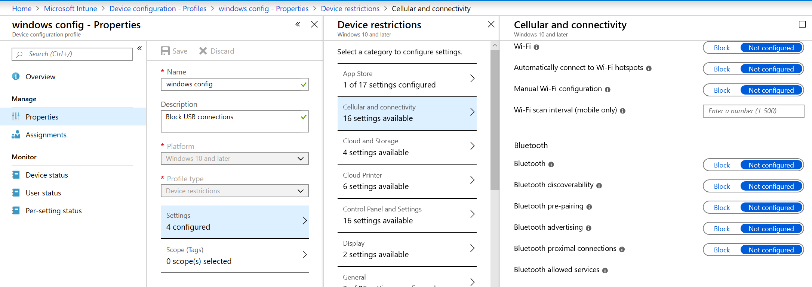

# <a name="how-to-control-usb-devices-and-other-removable-media-using-microsoft-defender-for-endpoint"></a>Steuern von USB-Geräten und anderen Wechselmedien mithilfe von Microsoft Defender for Endpoint

**Gilt für:** [Microsoft Defender for Endpoint](https://go.microsoft.com/fwlink/p/?linkid=2069559)

Microsoft [empfiehlt](https://aka.ms/devicecontrolblog)einen mehrschichtigen Ansatz zum Sichern von Wechselmedien, und Microsoft Defender for Endpoint bietet mehrere Überwachungs- und Steuerungsfunktionen, um zu verhindern, dass Bedrohungen in nicht autorisierten Peripheriegeräten Ihre Geräte kompromittieren:

1. [Entdecken Sie plug and play connected events for peripherals in Microsoft Defender for Endpoint Advanced Hunting](#discover-plug-and-play-connected-events). Identifizieren oder untersuchen Sie verdächtige Nutzungsaktivitäten.

2. Konfigurieren, um nur bestimmte Wechselmedien zu erlauben oder zu blockieren und Bedrohungen zu verhindern.
    1. [Zulassen oder Blockieren von](#allow-or-block-removable-devices) Wechselmedien basierend auf einer differenzierten Konfiguration, um schreibzugriff auf Wechseldatenträger zu verweigern und Geräte mithilfe von USB-Geräte-IDs zu genehmigen oder zu verweigern. Flexible Richtlinienzuweisung von Geräteinstallationseinstellungen basierend auf einer Einzelnen oder Gruppe von Azure Active Directory (Azure AD)-Benutzern und -Geräten.

    2. [Verhindern Von Wechselmedien eingeführte](#prevent-threats-from-removable-storage) Bedrohungen durch Wechselmedien, indem Sie:  
        - Microsoft Defender Antivirus Real-Time Protection (RTP), um Wechseldatenträger auf Schadsoftware zu überprüfen.  
        - Die Attack Surface Reduction (ASR)-USB-Regel zum Blockieren nicht vertrauenswürdiger und nicht signierter Prozesse, die über USB ausgeführt werden.  
        - Schutzeinstellungen für den direkten Arbeitsspeicherzugriff (Direct Memory Access, DMA), um DMA-Angriffe zu mindern, einschließlich Kernel-DMA-Schutz für Thunderbolt und Blockieren von DMA, bis sich ein Benutzer meldet.  

3. [Erstellen Sie angepasste Warnungen](#create-customized-alerts-and-response-actions) und Reaktionsaktionen, um die Verwendung von Wechselmedien basierend auf diesen Plug -and-Play-Ereignissen oder anderen Microsoft Defender for Endpoint-Ereignissen mit benutzerdefinierten [Erkennungsregeln zu überwachen.](/microsoft-365/security/defender-endpoint/custom-detection-rules)

4. [Reagieren Sie auf Bedrohungen](#respond-to-threats) von Peripheriegeräten in Echtzeit basierend auf den von jedem Peripheriegerät gemeldeten Eigenschaften.

>[!Note]
>Diese Maßnahmen zur Bedrohungsminderung verhindern, dass Schadsoftware in Ihre Umgebung kommt. Um Unternehmensdaten vor dem Verlassen Ihrer Umgebung zu schützen, können Sie auch Maßnahmen zur Verhinderung von Datenverlust konfigurieren. Beispielsweise können Sie auf Windows 10-Geräten [BitLocker](/windows/security/information-protection/bitlocker/bitlocker-overview.md) und [Windows Information Protection](/windows/security/information-protection/create-wip-policy-using-intune-azure.md)konfigurieren, die Unternehmensdaten verschlüsseln, auch wenn sie auf einem persönlichen Gerät gespeichert sind, oder den [Speicher-/WechseldatenträgerDiskDenyWriteAccess-CSP](/windows/client-management/mdm/policy-csp-storage#storage-removablediskdenywriteaccess) verwenden, um den Schreibzugriff auf Wechseldatenträger zu verweigern. Darüber hinaus können Sie Dateien auf [Windows-Geräten](/windows/security/threat-protection/windows-defender-atp/information-protection-in-windows-overview) (einschließlich ihrer bereitgestellten USB-Geräte) mithilfe von Microsoft Defender for Endpoint und Azure Information Protection klassifizieren und schützen.

## <a name="discover-plug-and-play-connected-events"></a>Entdecken von verbundenen Plug -and-Play-Ereignissen

Sie können verbundene Ereignisse in Microsoft Defender for Endpoint advanced hunting anzeigen und wiederverspielen, um verdächtige Nutzungsaktivitäten zu identifizieren oder interne Untersuchungen durchzuführen.
Beispiele für Erweiterte Suchabfragen von Defender for Endpoint finden Sie im [GitHub-Repository von Microsoft Defender for Endpoint-Suchabfragen.](https://github.com/Microsoft/WindowsDefenderATP-Hunting-Queries)

Beispielvorlagen für Power BI-Berichte sind für Microsoft Defender for Endpoint verfügbar, die Sie für erweiterte Suchabfragen verwenden können. Mit diesen Beispielvorlagen, einschließlich einer für die Gerätesteuerung, können Sie die Leistung der erweiterten Suche in Power BI integrieren. Weitere Informationen [finden Sie im GitHub-Repository](https://github.com/microsoft/MDATP-PowerBI-Templates) für PowerBI-Vorlagen. Weitere Informationen zur Power BI-Integration finden Sie unter Erstellen [benutzerdefinierter](/microsoft-365/security/defender-endpoint/api-power-bi) Berichte mit Power BI.

## <a name="allow-or-block-removable-devices"></a>Zulassen oder Blockieren von Wechselmedien
In der folgenden Tabelle wird beschrieben, wie Wechselmedien von Microsoft Defender for Endpoint basierend auf einer differenzierten Konfiguration zulässig oder blockiert werden können.

| Steuerelement  | Beschreibung |
|----------|-------------|
| [Einschränken von USB-Laufwerken und anderen Peripheriegeräten](#restrict-usb-drives-and-other-peripherals) | Sie können zulassen/verhindern, dass Benutzer nur die USB-Laufwerke und andere Peripheriegeräte installieren, die in einer Liste autorisierter/nicht autorisierter Geräte oder Gerätetypen enthalten sind. |
| [Blockieren der Installation und Verwendung von Wechselspeicher](#block-installation-and-usage-of-removable-storage) | Wechseldatenträger können nicht installiert oder verwendet werden. |
| [Zulassen der Installation und Verwendung von speziell genehmigten Peripheriegeräten](#allow-installation-and-usage-of-specifically-approved-peripherals)   | Sie können nur genehmigte Peripheriegeräte installieren und verwenden, die bestimmte Eigenschaften in ihrer Firmware melden. |
| [Verhindern der Installation von speziell verbotenen Peripheriegeräten](#prevent-installation-of-specifically-prohibited-peripherals) | Verbotene Peripheriegeräte, die bestimmte Eigenschaften in ihrer Firmware melden, können nicht installiert oder verwendet werden. |
| [Zulassen der Installation und Verwendung von speziell genehmigten Peripheriegeräten mit übereinstimmenden Geräteinstanz-IDs](#allow-installation-and-usage-of-specifically-approved-peripherals-with-matching-device-instance-ids) | Sie können nur genehmigte Peripheriegeräte installieren und verwenden, die mit diesen IDs der Geräteinstanz übereinstimmen. |
| [Verhindern der Installation und Verwendung von speziell verbotenen Peripheriegeräten mit übereinstimmenden Geräteinstanz-IDs](#prevent-installation-and-usage-of-specifically-prohibited-peripherals-with-matching-device-instance-ids) | Sie können keine verbotenen Peripheriegeräte installieren oder verwenden, die mit diesen IDs der Geräteinstanz übereinstimmen. |
| [Einschränken von Diensten, die Bluetooth](#limit-services-that-use-bluetooth) | Sie können die Dienste einschränken, die Bluetooth. |
| [Verwenden der Basiseinstellungen für Microsoft Defender for Endpoint](#use-microsoft-defender-for-endpoint-baseline-settings) | Sie können die empfohlene Konfiguration für ATP mithilfe der Sicherheitsgrundlinie defender for Endpoint festlegen. |

### <a name="restrict-usb-drives-and-other-peripherals"></a>Einschränken von USB-Laufwerken und anderen Peripheriegeräten

Um Schadsoftwareinfektionen oder Datenverluste zu verhindern, kann eine Organisation USB-Laufwerke und andere Peripheriegeräte einschränken. In der folgenden Tabelle wird beschrieben, wie Microsoft Defender for Endpoint die Installation und Verwendung von USB-Laufwerken und anderen Peripheriegeräten verhindern kann.

| Steuerelement  | Beschreibung
|----------|-------------|
| [Zulassen der Installation und Verwendung von USB-Laufwerken und anderen Peripheriegeräten](#allow-installation-and-usage-of-usb-drives-and-other-peripherals) | Zulassen, dass Benutzer nur die USB-Laufwerke und andere Peripheriegeräte installieren, die in einer Liste autorisierter Geräte oder Gerätetypen enthalten sind |
| [Verhindern der Installation und Verwendung von USB-Laufwerken und anderen Peripheriegeräten](#prevent-installation-and-usage-of-usb-drives-and-other-peripherals) | Verhindern, dass Benutzer USB-Laufwerke und andere Peripheriegeräte installieren, die in einer Liste nicht autorisierter Geräte und Gerätetypen enthalten sind |

Alle oben genannten Steuerelemente können über die administrativen [Intune-Vorlagen festgelegt werden.](/intune/administrative-templates-windows) Die relevanten Richtlinien finden Sie hier in den Intune-Administratorvorlagen:


>[!Note]
>Mithilfe von Intune können Sie Gerätekonfigurationsrichtlinien auf Azure AD-Benutzer- und/oder Gerätegruppen anwenden.
Die oben genannten Richtlinien können auch über die #A0 für die [Geräteinstallation](/windows/client-management/mdm/policy-csp-deviceinstallation) und die Gruppenrichtlinienobjekte [für die Geräteinstallation festgelegt werden.](/previous-versions/dotnet/articles/bb530324(v=msdn.10))

> [!Note]
> Testen und verfeinern Sie diese Einstellungen immer zuerst mit einer Pilotgruppe von Benutzern und Geräten, bevor Sie sie in der Produktion anwenden.
Weitere Informationen zum Steuern von USB-Geräten finden Sie im [Microsoft Defender for Endpoint-Blog](https://www.microsoft.com/security/blog/2018/12/19/windows-defender-atp-has-protections-for-usb-and-removable-devices/).

#### <a name="allow-installation-and-usage-of-usb-drives-and-other-peripherals"></a>Zulassen der Installation und Verwendung von USB-Laufwerken und anderen Peripheriegeräten

Eine Möglichkeit, die Installation und Verwendung von USB-Laufwerken und anderen Peripheriegeräten zu ermöglichen, besteht in der Ersten, indem Sie alles zulassen. Anschließend können Sie beginnen, die zulässigen USB-Treiber und andere Peripheriegeräte zu reduzieren.

>[!Note]
>Da ein nicht autorisiertes USB-Peripheriegerät über Firmware verfügen kann, die seine USB-Eigenschaften spooft, wird empfohlen, nur speziell genehmigte USB-Peripheriegeräte zu erlauben und die Benutzer zu beschränken, die darauf zugreifen können.

1. Aktivieren **Sie Die Installation von Geräten verhindern, die nicht von anderen Richtlinieneinstellungen für** alle Benutzer beschrieben werden.
2. Aktivieren Sie Die Installation von Geräten mithilfe von Treibern zulassen, die diesen **Geräteeinrichtungsklassen für** alle [Geräteeinrichtungsklassen entsprechen.](/windows-hardware/drivers/install/system-defined-device-setup-classes-available-to-vendors)

Um die Richtlinie für bereits installierte Geräte zu erzwingen, wenden Sie die Prevent-Richtlinien mit dieser Einstellung an.

Beim Konfigurieren der Richtlinie zur Geräteinstallation zulassen müssen Sie auch alle übergeordneten Attribute zulassen. Sie können die Eltern eines Geräts anzeigen, indem Sie den Geräte-Manager öffnen und nach Verbindung anzeigen.


In diesem Beispiel mussten die folgenden Klassen hinzugefügt werden: HID, Keyboard und {36fc9e60-c465-11cf-8056-444553540000}. Weitere [Informationen finden Sie unter von Microsoft bereitgestellte USB-Treiber.](/windows-hardware/drivers/usbcon/supported-usb-classes)


Wenn Sie auf bestimmte Geräte beschränken möchten, entfernen Sie die Geräteeinrichtungsklasse des Peripheriegeräts, das Sie einschränken möchten. Fügen Sie dann die Geräte-ID hinzu, die Sie hinzufügen möchten. Die Geräte-ID basiert auf den Lieferanten-ID- und Produkt-ID-Werten für ein Gerät. Informationen zu Geräte-ID-Formaten finden Sie unter [Standard USB Identifiers](/windows-hardware/drivers/install/standard-usb-identifiers). 

Informationen zum Suchen der Geräte-IDs finden Sie unter [Look up device ID](#look-up-device-id). 

Beispiel:

1. Entfernen Sie die Klasse USBDevice aus der Einstellung Installation von Geräten mit Treibern **zulassen, die mit dieser Geräteeinrichtung übereinstimmen.**
2. Fügen Sie die geräte-ID hinzu, die in der Datei Installation von Geräten zulassen zulässig ist, die mit diesen **Geräte-IDs übereinstimmen.** 


#### <a name="prevent-installation-and-usage-of-usb-drives-and-other-peripherals"></a>Verhindern der Installation und Verwendung von USB-Laufwerken und anderen Peripheriegeräten

Wenn Sie die Installation einer Geräteklasse oder bestimmter Geräte verhindern möchten, können Sie die Richtlinien für die Geräteinstallation verhindern verwenden:

1. Aktivieren Sie Die Installation von Geräten verhindern, die mit diesen **Geräte-IDs übereinstimmen,** und fügen Sie diese Geräte der Liste hinzu.
2. Aktivieren **Sie Verhindern der Installation von Geräten mithilfe von Treibern, die diesen Geräteeinrichtungsklassen entsprechen.**

> [!Note]
> Die Richtlinien für die Geräteinstallation verhindern haben Vorrang vor den Richtlinien für die Zulässige Geräteinstallation.

Mit der Richtlinie Installation von Geräten verhindern, die mit einer dieser **Geräte-IDs-Richtlinie** übereinstimmen, können Sie eine Liste der Geräte angeben, die von Windows nicht installiert werden können. 

So verhindern Sie die Installation von Geräten, die mit diesen Geräte-IDs übereinstimmen: 

1. [Suchen Sie nach der Geräte-ID](#look-up-device-id) für Geräte, die von Windows nicht installiert werden sollten.

   

2. Aktivieren Sie Die Installation von Geräten verhindern, die mit diesen **Geräte-IDs** übereinstimmen, und fügen Sie der Liste die Hersteller- oder Produkt-IDs hinzu.

    

#### <a name="look-up-device-id"></a>Geräte-ID nachschauen

Sie können device manager verwenden, um nach einer Geräte-ID zu suchen.

1. Öffnen Sie den Geräte-Manager.
2. Klicken **Sie auf Anzeigen,** und wählen **Sie Geräte nach Verbindung aus.**
3. Klicken Sie in der Struktur mit der rechten Maustaste auf das Gerät, und wählen Sie **Eigenschaften aus.**
4. Klicken Sie im Dialogfeld für das ausgewählte Gerät auf die **Registerkarte Details.**
5. Klicken Sie **auf die** Dropdownliste Eigenschaft, und wählen Sie **Hardware-IDs aus.**
6. Klicken Sie mit der rechten Maustaste auf den oberen ID-Wert, und wählen Sie **Kopieren aus.**

Weitere Informationen zu Geräte-ID-Formaten finden Sie unter [Standard USB Identifiers](/windows-hardware/drivers/install/standard-usb-identifiers).

Informationen zu Hersteller-IDs finden Sie unter [USB-Member](https://www.usb.org/members).

Im Folgenden finden Sie ein Beispiel für die Suche nach einer Geräteanbieter-ID oder Produkt-ID (die Teil der Geräte-ID ist) mithilfe von PowerShell: 

```powershell
Get-WMIObject -Class Win32_DiskDrive |
Select-Object -Property * 
```

Mit der Richtlinie Verhindern **der Installation von** Geräten mithilfe von Treibern, die diesen Geräteeinrichtungsklassen entsprechen, können Sie Geräteeinrichtungsklassen angeben, die von Windows nicht installiert werden können. 

So verhindern Sie die Installation bestimmter Geräteklassen: 

1. Suchen Sie die GUID der Geräteeinrichtungsklasse aus [Systemdefinierten Geräteeinrichtungsklassen, die für Anbieter verfügbar sind.](/windows-hardware/drivers/install/system-defined-device-setup-classes-available-to-vendors)

2. Aktivieren Sie Verhindern der Installation von Geräten mithilfe von Treibern, die diesen **Geräteeinrichtungsklassen** entsprechen, und fügen Sie der Liste die Klassen-GUID hinzu.

    > [!div class="mx-imgBorder"]
    > 

### <a name="block-installation-and-usage-of-removable-storage"></a>Blockieren der Installation und Verwendung von Wechselspeicher

1. Melden Sie sich im [Microsoft Azure-Portal](https://portal.azure.com/) an.

2. Klicken **Sie auf**  >  **Intune-Gerätekonfigurationsprofile**  >    >  **Profil erstellen.**

    > [!div class="mx-imgBorder"]
    > 

3. Verwenden Sie die folgenden Einstellungen:

   - Name: Geben Sie einen Namen für das Profil ein.
   - Beschreibung: Geben Sie eine Beschreibung ein.
   - Plattform: Windows 10 und höher
   - Profiltyp: Geräteeinschränkungen

   > [!div class="mx-imgBorder"]
   > 

4. Klicken **Sie auf** Allgemein  >  **konfigurieren.**  

5. Wählen **Sie für Wechselspeicher und** **USB-Verbindung (nur mobil)** **Block aus.** **Wechselmedien enthalten** USB-Laufwerke, während **die USB-Verbindung (nur mobil)** das Laden von USB ausschließt, aber andere USB-Verbindungen nur auf mobilen Geräten umfasst. 

   

6. Klicken **Sie auf OK,** um **allgemeine** Einstellungen und **Geräteeinschränkungen zu schließen.**

7. Klicken Sie **auf Erstellen,** um das Profil zu speichern.

### <a name="allow-installation-and-usage-of-specifically-approved-peripherals"></a>Zulassen der Installation und Verwendung von speziell genehmigten Peripheriegeräten

Peripheriegeräte, die installiert werden dürfen, können durch ihre [Hardwareidentität angegeben werden.](/windows-hardware/drivers/install/device-identification-strings) Eine Liste der allgemeinen Bezeichnerstrukturen finden Sie unter [Device Identifier Formats](/windows-hardware/drivers/install/device-identifier-formats). Testen Sie die Konfiguration vor dem Roll-out, um sicherzustellen, dass sie blockiert und die erwarteten Geräte zulässt. Testen Sie im Idealfall verschiedene Instanzen der Hardware. Testen Sie beispielsweise mehrere USB-Schlüssel und nicht nur einen.

Ein SyncML-Beispiel, das die Installation bestimmter Geräte-IDs zulässt, finden Sie unter [DeviceInstallation/AllowInstallationOfMatchingDeviceIDs CSP](/windows/client-management/mdm/policy-csp-deviceinstallation#deviceinstallation-allowinstallationofmatchingdeviceids). Informationen zum Zulassen bestimmter Geräteklassen finden Sie unter [DeviceInstallation/AllowInstallationOfMatchingDeviceSetupClasses CSP](/windows/client-management/mdm/policy-csp-deviceinstallation#deviceinstallation-allowinstallationofmatchingdevicesetupclasses).
Das Zulassen der Installation bestimmter Geräte erfordert auch das Aktivieren [von DeviceInstallation/PreventInstallationOfDevicesNotDescribedByOtherPolicySettings](/windows/client-management/mdm/policy-csp-deviceinstallation#deviceinstallation-preventinstallationofdevicesnotdescribedbyotherpolicysettings).

### <a name="prevent-installation-of-specifically-prohibited-peripherals"></a>Verhindern der Installation von speziell verbotenen Peripheriegeräten

Microsoft Defender for Endpoint blockiert die Installation und Verwendung verbotener Peripheriegeräte mithilfe einer der folgenden Optionen:

- [Administrative Vorlagen](/intune/administrative-templates-windows) können jedes Gerät mit einer übereinstimmenden Hardware-ID oder Setupklasse blockieren.  
- [#A0 für die Geräteinstallation](/windows/client-management/mdm/policy-csp-deviceinstallation) mit einem benutzerdefinierten Profil in Intune. Sie können [die Installation bestimmter Geräte-IDs verhindern](/windows/client-management/mdm/policy-csp-deviceinstallation#deviceinstallation-preventinstallationofmatchingdeviceids) oder bestimmte [Geräteklassen verhindern.](/windows/client-management/mdm/policy-csp-deviceinstallation#deviceinstallation-preventinstallationofmatchingdevicesetupclasses)

### <a name="allow-installation-and-usage-of-specifically-approved-peripherals-with-matching-device-instance-ids"></a>Zulassen der Installation und Verwendung von speziell genehmigten Peripheriegeräten mit übereinstimmenden Geräteinstanz-IDs

Peripheriegeräte, die installiert werden dürfen, können durch ihre [Geräteinstanz-IDs angegeben werden.](/windows-hardware/drivers/install/device-instance-ids) Testen Sie die Konfiguration vor dem Roll-out, um sicherzustellen, dass sie die erwarteten Geräte zulässt. Testen Sie im Idealfall verschiedene Instanzen der Hardware. Testen Sie beispielsweise mehrere USB-Schlüssel und nicht nur einen.

Sie können die Installation und Verwendung genehmigter Peripheriegeräte mit übereinstimmenden Geräteinstanz-IDs zulassen, indem Sie die Richtlinieneinstellung [DeviceInstallation/AllowInstallationOfMatchingDeviceInstanceIDs](/windows/client-management/mdm/policy-csp-deviceinstallation#deviceinstallation-allowinstallationofmatchingdeviceinstanceids) konfigurieren.

### <a name="prevent-installation-and-usage-of-specifically-prohibited-peripherals-with-matching-device-instance-ids"></a>Verhindern der Installation und Verwendung von speziell verbotenen Peripheriegeräten mit übereinstimmenden Geräteinstanz-IDs

Peripheriegeräte, die nicht installiert werden dürfen, können durch ihre [Geräteinstanz-IDs angegeben werden.](/windows-hardware/drivers/install/device-instance-ids) Testen Sie die Konfiguration vor dem Roll-out, um sicherzustellen, dass sie die erwarteten Geräte zulässt. Testen Sie im Idealfall verschiedene Instanzen der Hardware. Testen Sie beispielsweise mehrere USB-Schlüssel und nicht nur einen.

Sie können die Installation der verbotenen Peripheriegeräte mit übereinstimmenden Geräteinstanz-IDs verhindern, indem Sie die Richtlinieneinstellung [DeviceInstallation/PreventInstallationOfMatchingDeviceInstanceIDs](/windows/client-management/mdm/policy-csp-deviceinstallation#deviceinstallation-preventinstallationofmatchingdeviceinstanceids) konfigurieren.

### <a name="limit-services-that-use-bluetooth"></a>Einschränken von Diensten, die Bluetooth

Mithilfe von Intune können Sie die Dienste einschränken, die Bluetooth über die ["Bluetooth dienste" verwenden können.](/windows/client-management/mdm/policy-csp-bluetooth#servicesallowedlist-usage-guide) Der Standardstatus "Bluetooth zugelassene Dienste" bedeutet, dass alles zulässig ist.  Sobald ein Dienst hinzugefügt wird, wird dies zur zulässigen Liste. Wenn der Kunde die Werte Keyboards und Mice hinzufügt und die Dateiübertragungs-GUIDs nicht hinzufügt, sollte die Dateiübertragung blockiert werden.

> [!div class="mx-imgBorder"]
> 

### <a name="use-microsoft-defender-for-endpoint-baseline-settings"></a>Verwenden der Basiseinstellungen für Microsoft Defender for Endpoint

Die Basiseinstellungen für Microsoft Defender for Endpoint stellen die empfohlene Konfiguration für den Bedrohungsschutz dar. Konfigurationseinstellungen für basisplan befinden sich auf der Seite Profil bearbeiten der Konfigurationseinstellungen.

> [!div class="mx-imgBorder"]
> 

## <a name="prevent-threats-from-removable-storage"></a>Verhindern von Bedrohungen am Wechselspeicher
  
Wechselmedien können ein zusätzliches Sicherheitsrisiko für Ihre Organisation darstellen. Microsoft Defender for Endpoint kann dazu beitragen, schädliche Dateien auf Wechselmedien zu identifizieren und zu blockieren.

Microsoft Defender for Endpoint kann auch verhindern, dass USB-Peripheriegeräte auf Geräten verwendet werden, um externe Bedrohungen zu verhindern. Dazu werden die von USB-Peripheriegeräten gemeldeten Eigenschaften verwendet, um zu bestimmen, ob sie auf dem Gerät installiert und verwendet werden können.

Beachten Sie, dass verbundene Geräte, z. B. Telefone, weiterhin aufgeladen werden können, wenn Sie USB-Geräte oder andere Geräteklassen mithilfe der Geräteinstallationsrichtlinien blockieren.

>[!NOTE]
>Testen und verfeinern Sie diese Einstellungen immer zuerst mit einer Pilotgruppe von Benutzern und Geräten, bevor Sie sie an Ihre Organisation verteilen. 

In der folgenden Tabelle werden die Möglichkeiten beschrieben, mit denen Microsoft Defender for Endpoint verhindern kann, dass Bedrohungen aus wechselbarem Speicher entfernt werden.

Weitere Informationen zum Steuern von USB-Geräten finden Sie im [Microsoft Defender for Endpoint-Blog](https://aka.ms/devicecontrolblog).

| Steuerelement  | Beschreibung |
|----------|-------------|
| [Aktivieren der Microsoft Defender Antivirus-Überprüfung](#enable-microsoft-defender-antivirus-scanning) | Aktivieren Sie die Microsoft Defender Antivirus-Überprüfung für Echtzeitschutz oder geplante Scans.|
| [Blockieren nicht vertrauenswürdiger und nicht signierter Prozesse auf USB-Peripheriegeräten](#block-untrusted-and-unsigned-processes-on-usb-peripherals) | Blockieren sie USB-Dateien, die nicht signiert oder nicht vertrauenswürdig sind. |
| [Schutz vor Direct Memory Access (DMA)-Angriffen](#protect-against-direct-memory-access-dma-attacks) | Konfigurieren Von Einstellungen zum Schutz vor DMA-Angriffen. |

>[!NOTE]
>Da ein nicht autorisiertes USB-Peripheriegerät über Firmware verfügen kann, die seine USB-Eigenschaften spooft, wird empfohlen, nur speziell genehmigte USB-Peripheriegeräte zu erlauben und die Benutzer zu beschränken, die darauf zugreifen können.

### <a name="enable-microsoft-defender-antivirus-scanning"></a>Aktivieren der Microsoft Defender Antivirus-Überprüfung

Der Schutz autorisierter Wechseldatenträger [](/microsoft-365/security/defender-endpoint/configure-real-time-protection-microsoft-defender-antivirus) mit Microsoft Defender Antivirus erfordert die Aktivierung des Echtzeitschutzes oder die Planung von Scans und das Konfigurieren von Wechseldatenträgern für Scans.

- Wenn der Echtzeitschutz aktiviert ist, werden Die Dateien überprüft, bevor auf sie zugegriffen und ausgeführt wird. Der Überprüfungsbereich umfasst alle Dateien, einschließlich der Dateien auf angeschlossenen Wechselmedien wie USB-Laufwerken. Sie können optional ein [PowerShell-Skript](/samples/browse/?redirectedfrom=TechNet-Gallery) ausführen, um eine benutzerdefinierte Überprüfung eines USB-Laufwerks durchzuführen, nachdem es bereitgestellt wurde, sodass Microsoft Defender Antivirus alle Dateien auf einem Wechselmedium scannt, sobald das Wechselmedium angeschlossen ist. Es wird jedoch empfohlen, den Echtzeitschutz zu aktivieren, um die Scanleistung zu verbessern, insbesondere bei großen Speichergeräten.

- Wenn geplante Scans verwendet werden, müssen Sie die Einstellung DisableRemovableDriveScanning deaktivieren (standardmäßig aktiviert), um das Wechselgerät während einer vollständigen Überprüfung zu überprüfen. Wechselmedien werden während einer schnellen oder benutzerdefinierten Überprüfung unabhängig von der DisableRemovableDriveScanning-Einstellung überprüft.

>[!NOTE]
>Es wird empfohlen, die Echtzeitüberwachung für die Überprüfung zu aktivieren. In Intune können Sie die Echtzeitüberwachung für Windows 10 unter **Geräteeinschränkungen**  >  **Konfigurieren der** Microsoft Defender  >  **Antivirus**  >  **Echtzeitüberwachung aktivieren.**

<!-- Need to build out point in the preceding note. 
-->

### <a name="block-untrusted-and-unsigned-processes-on-usb-peripherals"></a>Blockieren nicht vertrauenswürdiger und nicht signierter Prozesse auf USB-Peripheriegeräten

Endbenutzer können Wechseldatenträger anschließen, die mit Schadsoftware infiziert sind.
Um Infektionen zu verhindern, kann ein Unternehmen NICHT signierte oder nicht vertrauenswürdige USB-Dateien blockieren.
Alternativ können Unternehmen das Überwachungsfeature von Regeln zur Reduzierung der Angriffsfläche nutzen, um die Aktivität nicht vertrauenswürdiger und nicht signierter Prozesse zu überwachen, die auf einem USB-Peripheriegerät ausgeführt werden. [](/microsoft-365/security/defender-endpoint/attack-surface-reduction)
Dazu können Sie nicht vertrauenswürdige und **nicht signierte** Prozesse, die von USB ausgeführt werden, entweder **auf Nur blockieren** oder **nur** überwachen festlegen.
Mit dieser Regel können Administratoren verhindern, dass nicht signierte oder nicht vertrauenswürdige ausführbare Dateien von USB-Wechseldatenträgern ausgeführt werden, einschließlich SD-Karten.
Zu den betroffenen Dateitypen gehören ausführbare Dateien (z. B. EXE, DLL oder SCR) und Skriptdateien wie powerShell (.ps), VisualBasic (.vbs) oder JavaScript -Dateien (JS).

Diese Einstellungen erfordern [die Aktivierung des Echtzeitschutzes.](/microsoft-365/security/defender-endpoint/configure-real-time-protection-microsoft-defender-antivirus)

1. Melden Sie sich beim [Microsoft Endpoint Manager an.](https://endpoint.microsoft.com/)

2. Klicken **Sie auf Geräte**  >    >  **Windows-Konfigurationsrichtlinien Profil**  >  **erstellen.** 

    

3. Verwenden Sie die folgenden Einstellungen:
   - Plattform: Windows 10 und höher 
   - Profiltyp: Geräteeinschränkungen

   > [!div class="mx-imgBorder"]
   > 

4. Klicken Sie auf **Erstellen**.  

5. Wählen **Sie für nicht signierte und nicht vertrauenswürdige Prozesse, die über USB** ausgeführt werden, Block **aus.**

   

6. Klicken Sie **auf OK,** um Einstellungen und **Geräteeinschränkungen zu schließen.**

### <a name="protect-against-direct-memory-access-dma-attacks"></a>Schutz vor Direct Memory Access (DMA)-Angriffen

DMA-Angriffe können zur Offenlegung vertraulicher Informationen auf einem PC oder sogar zur Einschleusung von Schadsoftware führen, mit der Angreifer den Sperrbildschirm umgehen oder PCs remote steuern können. Die folgenden Einstellungen helfen, DMA-Angriffe zu verhindern:

1. Ab Windows 10, Version 1803, hat Microsoft [den Kernel-DMA-Schutz für "Thunderbolt"](/windows/security/information-protection/kernel-dma-protection-for-thunderbolt.md) eingeführt, um systemeigenen Schutz vor DMA-Angriffen über Thunderbolt-Ports zu bieten. Kernel-DMA-Schutz für Thunderbolt wird von Systemherstellern aktiviert und kann von Benutzern nicht aktiviert oder deaktiviert werden.

   Ab Windows 10, Version 1809, können Sie die Ebene des Kernel-DMA-Schutzes anpassen, indem Sie den [DMA Guard CSP konfigurieren.](/windows/client-management/mdm/policy-csp-dmaguard#dmaguard-deviceenumerationpolicy) Dies ist ein zusätzliches Steuerelement für Peripheriegeräte, die keine Gerätespeicherisolation unterstützen (auch als DMA-remapping bekannt). Mit der Speicherisolation kann das Betriebssystem die E/A-Speicherverwaltungseinheit (IOMMU) eines Geräts nutzen, um nicht zugelassene E/A- oder Arbeitsspeicherzugriffe über das Peripheriegerät zu blockieren (Speicher-Sandboxing). Anders ausgedrückt: Das Betriebssystem weist dem Peripheriegerät einen bestimmten Speicherbereich zu. Wenn das Peripheriegerät versucht, den Speicher außerhalb des zugewiesenen Bereichs zu lesen/zu schreiben, blockiert das Betriebssystem ihn.

   Peripheriegeräte, die die Gerätespeicherisolation unterstützen, können immer eine Verbindung herstellen. Peripheriegeräte, die nicht blockiert, zugelassen oder nur zugelassen werden können, nachdem sich der Benutzer (Standard) meldet.

2. Unter Windows 10-Systemen, die kernel-DMA-Schutz nicht unterstützen, können Sie:

   - [DMA blockieren, bis sich ein Benutzer meldet](/windows/client-management/mdm/policy-csp-dataprotection#dataprotection-allowdirectmemoryaccess)
   - [Blockieren aller Verbindungen über die Thunderbolt-Ports (einschließlich USB-Geräte)](https://support.microsoft.com/help/2516445/blocking-the-sbp-2-driver-and-thunderbolt-controllers-to-reduce-1394-d)

## <a name="create-customized-alerts-and-response-actions"></a>Erstellen angepasster Warnungen und Reaktionsaktionen

Sie können benutzerdefinierte Warnungen und Reaktionsaktionen mit dem WDATP-Connector und den benutzerdefinierten Erkennungsregeln erstellen:

**Wdatp Connector-Antwortaktionen:**

**Untersuchen Sie:** Initiieren von Untersuchungen, Sammeln von Untersuchungspaketen und Isolieren eines Computers.

**Bedrohungsscan** auf USB-Geräten.

**Einschränken der Ausführung** aller Anwendungen auf dem Computer mit Ausnahme eines vordefinierten MDATP-Connectors ist einer von mehr als 200 vordefinierten Connectors, einschließlich Outlook, Teams, Slack usw. Benutzerdefinierte Connectors können erstellt werden.
- [Weitere Informationen zu Reaktionsaktionen des WDATP-Connectors](/connectors/wdatp/)

**Reaktionsaktion für benutzerdefinierte Erkennungsregeln:** Aktionen auf Computer- und Dateiebene können angewendet werden.
- [Weitere Informationen zu Reaktionsaktionen für benutzerdefinierte Erkennungsregeln](/microsoft-365/security/defender-endpoint/custom-detection-rules)

Informationen zu Ereignissen der Gerätesteuerung und Beispiele zum Erstellen benutzerdefinierter Warnungen finden Sie unter [Advanced hunting updates: USB events, machine-level actions, and schema changes](https://techcommunity.microsoft.com/t5/Microsoft-Defender-ATP/Advanced-hunting-updates-USB-events-machine-level-actions-and/ba-p/824152).

## <a name="respond-to-threats"></a>Reagieren auf Bedrohungen

Sie können benutzerdefinierte Warnungen und automatische Reaktionsaktionen mit den benutzerdefinierten Erkennungsregeln von [Microsoft Defender for Endpoint erstellen.](/microsoft-365/security/defender-endpoint/custom-detection-rules) Reaktionsaktionen innerhalb der benutzerdefinierten Erkennung umfassen Aktionen auf Computer- und Dateiebene. Sie können auch Warnungen und automatische [Reaktionsaktionen](https://powerapps.microsoft.com/) mithilfe von PowerApps und [Flow mit](https://flow.microsoft.com/) dem Microsoft Defender for [Endpoint-Connector erstellen.](/connectors/wdatp/) Der Connector unterstützt Aktionen zur Untersuchung, Überprüfung von Bedrohungen und zum Einschränken ausgeführter Anwendungen. Es ist einer von mehr als 200 vordefinierten Connectors, einschließlich Outlook, Teams, Slack und mehr. Benutzerdefinierte Connectors können ebenfalls erstellt werden. Weitere Informationen zu Connectors finden Sie unter [Connectors.](/connectors/)
 
Bei beiden Vorgehensweisen können Sie z. B. das Microsoft Defender Antivirus automatisch ausführen lassen, wenn ein USB-Gerät auf einem Computer bereitgestellt wird.

## <a name="related-topics"></a>Verwandte Themen

- [Konfigurieren des Echtzeitschutzes für Microsoft Defender Antivirus](/microsoft-365/security/defender-endpoint/configure-real-time-protection-microsoft-defender-antivirus)
- [Defender/AllowFullScanRemovableDriveScanning](/windows/client-management/mdm/policy-csp-defender#defender-allowfullscanremovabledrivescanning)
- [Policy/DeviceInstallation CSP](/windows/client-management/mdm/policy-csp-deviceinstallation)
- [Durchführen einer benutzerdefinierten Überprüfung eines Wechseldatenträgers](/samples/browse/?redirectedfrom=TechNet-Gallery)
- [Gerätesteuerungs-PowerBI-Vorlage für benutzerdefinierte Berichte](https://github.com/microsoft/MDATP-PowerBI-Templates)
- [BitLocker](/windows/security/information-protection/bitlocker/bitlocker-overview.md) 
- [Windows Information Protection](/windows/security/information-protection/windows-information-protection/create-wip-policy-using-intune-azure.md)