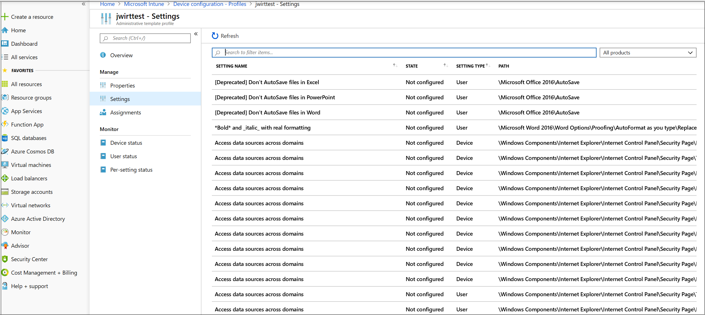
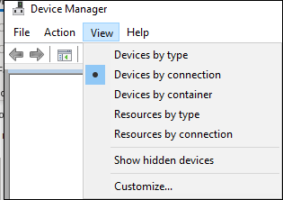
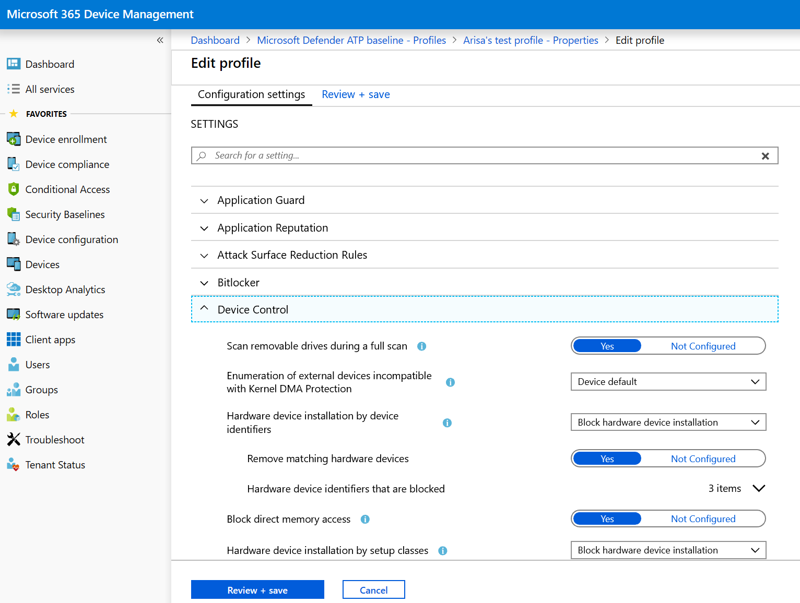

# <a name="how-to-control-usb-devices-and-other-removable-media-using-microsoft-defender-for-endpoint"></a>Steuern von USB-Geräten und anderen Wechselmedien mit Microsoft Defender für Endpunkt

**Gilt für:** [Microsoft Defender für Endpunkt](https://go.microsoft.com/fwlink/p/?linkid=2069559)

Microsoft empfiehlt [einen mehrstufigen Ansatz zum Schützen von Wechselmedien,](https://aka.ms/devicecontrolblog)und Microsoft Defender für Endpunkt bietet mehrere Überwachungs- und Kontrollfunktionen, um zu verhindern, dass Bedrohungen in nicht autorisierten Peripheriegeräten Ihre Geräte beeinträchtigen:

1. [Entdecken Sie verbundene Ereignisse für Peripheriegeräte in Der erweiterten Suche in Microsoft Defender für Endpunkt.](#discover-plug-and-play-connected-events) Identifizieren oder untersuchen Sie verdächtige Nutzungsaktivitäten.

2. Konfigurieren Sie die Konfiguration, um nur bestimmte Wechselmedien zuzulassen oder zu blockieren und Bedrohungen zu verhindern.
    1. [Zulassen oder Blockieren von Wechselmedien](#allow-or-block-removable-devices) basierend auf einer granularen Konfiguration, um den Schreibzugriff auf Wechseldatenträger zu verweigern und Geräte mithilfe von USB-Geräte-IDs zu genehmigen oder zu verweigern. Flexible Richtlinienzuweisung von Geräteinstallationseinstellungen basierend auf einer Person oder Gruppe von Azure Active Directory (Azure AD)-Benutzern und -Geräten.

    2. [Verhindern Sie Bedrohungen durch Wechselmedien,](#prevent-threats-from-removable-storage) die von Wechselmedien eingeführt wurden, indem Sie Folgendes aktivieren:  
        - Microsoft Defender Antivirus Echtzeitschutz (Real-Time Protection, RTP) zum Scannen von Wechselmedien auf Schadsoftware.  
        - Die ASR-USB-Regel (Attack Surface Reduction), um nicht vertrauenswürdige und nicht signierte Prozesse zu blockieren, die über USB ausgeführt werden.  
        - DMA-Schutzeinstellungen (Direct Memory Access) zur Minderung von DMA-Angriffen, einschließlich Kernel-DMA-Schutz für Thunderbolt und Blockieren von DMA, bis sich ein Benutzer anmeldet.  

3. [Create customized alerts and response actions](#create-customized-alerts-and-response-actions) to monitor usage of removable devices based on these plug and play events or any other Microsoft Defender for Endpoint events with [custom detection rules](/microsoft-365/security/defender-endpoint/custom-detection-rules).

4. Reagieren Sie basierend auf den von jedem Peripheriegerät gemeldeten Eigenschaften in Echtzeit auf [Bedrohungen](#respond-to-threats) durch Peripheriegeräte.

>[!Note]
>Diese Maßnahmen zur Bedrohungsreduzierung verhindern, dass Schadsoftware in Ihre Umgebung gelangt. Um zu verhindern, dass Unternehmensdaten Ihre Umgebung verlassen, können Sie auch Maßnahmen zur Verhinderung von Datenverlust konfigurieren. Beispielsweise können Sie auf Windows 10 Geräten [BitLocker](/windows/security/information-protection/bitlocker/bitlocker-overview.md) und [Windows Information Protection](/windows/security/information-protection/create-wip-policy-using-intune-azure.md)konfigurieren, wodurch Unternehmensdaten verschlüsselt werden, auch wenn sie auf einem persönlichen Gerät gespeichert sind, oder den [Storage/RemovableDiskDenyWriteAccess CSP](/windows/client-management/mdm/policy-csp-storage#storage-removablediskdenywriteaccess) verwenden, um den Schreibzugriff auf Wechseldatenträger zu verweigern. Darüber hinaus können Sie Dateien auf Windows Geräten (einschließlich der angeschlossenen USB-Geräte) mithilfe von Microsoft Defender für Endpunkt und Azure Information Protection [klassifizieren](/windows/security/threat-protection/windows-defender-atp/information-protection-in-windows-overview) und schützen.

## <a name="discover-plug-and-play-connected-events"></a>Entdecken von verbundenen Plug & Play-Ereignissen

Sie können verbundene Ereignisse in Der erweiterten Suche in Microsoft Defender für Endpunkt anzeigen und wiedergeben, um verdächtige Nutzungsaktivitäten zu identifizieren oder interne Untersuchungen durchzuführen.
Beispiele für Erweiterte Suchabfragen für Defender für Endpunkt finden Sie im [Microsoft Defender für Endpunkt-Suchabfragen GitHub Repository.](https://github.com/Microsoft/WindowsDefenderATP-Hunting-Queries)

Beispiel Power BI Berichtsvorlagen für Microsoft Defender für Endpunkt verfügbar sind, die Sie für erweiterte Suchabfragen verwenden können. Mit diesen Beispielvorlagen, einschließlich einer für die Gerätesteuerung, können Sie die Leistungsfähigkeit der erweiterten Suche in Power BI integrieren. Weitere Informationen finden Sie im [GitHub-Repository für PowerBI-Vorlagen.](https://github.com/microsoft/MDATP-PowerBI-Templates) Weitere Informationen zu Power BI Integration finden Sie unter [Erstellen von benutzerdefinierten Berichten mit Power BI.](/microsoft-365/security/defender-endpoint/api-power-bi)

## <a name="allow-or-block-removable-devices"></a>Zulassen oder Blockieren von Wechselmedien
In der folgenden Tabelle werden die Möglichkeiten beschrieben, wie Microsoft Defender für Endpunkt Wechselmedien basierend auf einer granularen Konfiguration zulassen oder blockieren kann.

| Steuerelement  | Beschreibung |
|----------|-------------|
| [Einschränken von USB-Laufwerken und anderen Peripheriegeräten](#restrict-usb-drives-and-other-peripherals) | Sie können zulassen/verhindern, dass Benutzer nur die USB-Laufwerke und andere Peripheriegeräte installieren, die in einer Liste autorisierter/nicht autorisierter Geräte oder Gerätetypen enthalten sind. |
| [Blockieren der Installation und Verwendung von Wechselmedien](#block-installation-and-usage-of-removable-storage) | Wechselmedien können nicht installiert oder verwendet werden. |
| [Zulassen der Installation und Verwendung von speziell genehmigten Peripheriegeräten](#allow-installation-and-usage-of-specifically-approved-peripherals)   | Sie können nur genehmigte Peripheriegeräte installieren und verwenden, die bestimmte Eigenschaften in ihrer Firmware melden. |
| [Verhindern der Installation von speziell verbotenen Peripheriegeräten](#prevent-installation-of-specifically-prohibited-peripherals) | Sie können keine verbotenen Peripheriegeräte installieren oder verwenden, die bestimmte Eigenschaften in ihrer Firmware melden. |
| [Installation und Verwendung von speziell genehmigten Peripheriegeräten mit übereinstimmenden Geräteinstanz-IDs zulassen](#allow-installation-and-usage-of-specifically-approved-peripherals-with-matching-device-instance-ids) | Sie können nur genehmigte Peripheriegeräte installieren und verwenden, die einer dieser Geräteinstanz-IDs entsprechen. |
| [Verhindern der Installation und Verwendung von speziell verbotenen Peripheriegeräten mit übereinstimmenden Geräteinstanz-IDs](#prevent-installation-and-usage-of-specifically-prohibited-peripherals-with-matching-device-instance-ids) | Sie können keine verbotenen Peripheriegeräte installieren oder verwenden, die einer dieser Geräteinstanz-IDs entsprechen. |
| [Einschränken von Diensten, die Bluetooth verwenden](#limit-services-that-use-bluetooth) | Sie können die Dienste einschränken, die Bluetooth verwenden können. |
| [Verwenden von Microsoft Defender für Endpunkt-Basisplaneinstellungen](#use-microsoft-defender-for-endpoint-baseline-settings) | Sie können die empfohlene Konfiguration für ATP mithilfe der Defender für Endpunkt-Sicherheitsgrundwerte festlegen. |

### <a name="restrict-usb-drives-and-other-peripherals"></a>Einschränken von USB-Laufwerken und anderen Peripheriegeräten

Um Schadsoftware-Infektionen oder Datenverluste zu verhindern, kann eine Organisation USB-Laufwerke und andere Peripheriegeräte einschränken. In der folgenden Tabelle wird beschrieben, wie Microsoft Defender für Endpunkt die Installation und Verwendung von USB-Laufwerken und anderen Peripheriegeräten verhindern kann.

| Steuerelement  | Beschreibung
|----------|-------------|
| [Installation und Verwendung von USB-Laufwerken und anderen Peripheriegeräten zulassen](#allow-installation-and-usage-of-usb-drives-and-other-peripherals) | Zulassen, dass Benutzer nur die USB-Laufwerke und andere Peripheriegeräte installieren können, die in einer Liste autorisierter Geräte oder Gerätetypen enthalten sind |
| [Verhindern der Installation und Verwendung von USB-Laufwerken und anderen Peripheriegeräten](#prevent-installation-and-usage-of-usb-drives-and-other-peripherals) | Verhindern, dass Benutzer USB-Laufwerke und andere Peripheriegeräte installieren, die in einer Liste nicht autorisierter Geräte und Gerätetypen enthalten sind |

Alle oben genannten Steuerelemente können über die [administrativen Intune-Vorlagen](/intune/administrative-templates-windows)festgelegt werden. Die relevanten Richtlinien finden Sie hier in den Intune-Administratorvorlagen:



>[!Note]
>Mit Intune können Sie Gerätekonfigurationsrichtlinien auf Azure AD-Benutzer und/oder Gerätegruppen anwenden.
Die oben genannten Richtlinien können auch über die [CSP-Einstellungen](/windows/client-management/mdm/policy-csp-deviceinstallation) für die Geräteinstallation und die [Geräteinstallations-GPOs](/previous-versions/dotnet/articles/bb530324(v=msdn.10))festgelegt werden.

> [!Note]
> Testen und verfeinern Sie diese Einstellungen immer zuerst mit einer Pilotgruppe von Benutzern und Geräten, bevor Sie sie in der Produktion anwenden.
Weitere Informationen zum Steuern von USB-Geräten finden Sie im [Microsoft Defender für Endpunkt-Blog.](https://www.microsoft.com/security/blog/2018/12/19/windows-defender-atp-has-protections-for-usb-and-removable-devices/)

#### <a name="allow-installation-and-usage-of-usb-drives-and-other-peripherals"></a>Installation und Verwendung von USB-Laufwerken und anderen Peripheriegeräten zulassen

Eine Möglichkeit, die Installation und Verwendung von USB-Laufwerken und anderen Peripheriegeräten zuzulassen, besteht darin, zunächst alles zuzulassen. Danach können Sie damit beginnen, die zulässigen USB-Treiber und andere Peripheriegeräte zu reduzieren.

>[!Note]
>Da ein nicht autorisiertes USB-Peripheriegerät Firmware haben kann, die die USB-Eigenschaften spooft, wird empfohlen, nur speziell genehmigte USB-Peripheriegeräte zuzulassen und die Benutzer einzuschränken, die darauf zugreifen können.

1. Enable **Prevent installation of devices not described by other policy settings** to all users.
2. Enable **Allow installation of devices using drivers that match these device setup classes** for all device setup [classes](/windows-hardware/drivers/install/system-defined-device-setup-classes-available-to-vendors).

Um die Richtlinie für bereits installierte Geräte zu erzwingen, wenden Sie die Richtlinien zur Verhinderung dieser Einstellung an.

Wenn Sie die Richtlinie für die Installation von Geräten zulassen konfigurieren, müssen Sie auch alle übergeordneten Attribute zulassen. Sie können die untergeordneten Elemente eines Geräts anzeigen, indem Sie den Geräte-Manager öffnen und nach Verbindung anzeigen.



In diesem Beispiel mussten die folgenden Klassen hinzugefügt werden: HID, Tastatur und {36fc9e60-c465-11cf-8056-444553540000}. Weitere Informationen finden Sie unter von [Microsoft bereitgestellte USB-Treiber.](/windows-hardware/drivers/usbcon/supported-usb-classes)


Wenn Sie bestimmte Geräte einschränken möchten, entfernen Sie die Geräteeinrichtungsklasse des Peripheriegeräts, das Sie einschränken möchten. Fügen Sie dann die Geräte-ID hinzu, die Sie hinzufügen möchten. Die Geräte-ID basiert auf den Lieferanten-ID- und Produkt-ID-Werten für ein Gerät. Informationen zu Geräte-ID-Formaten finden Sie unter [Standard-USB-IDs.](/windows-hardware/drivers/install/standard-usb-identifiers) 

Informationen zum Suchen der Geräte-IDs finden Sie unter ["Geräte-ID nachschlagen".](#look-up-device-id) 

Beispiel:

1. Entfernen Sie die Klasse USBDevice aus der **Allow installation of devices using drivers that match these device setup**.
2. Fügen Sie die zuzulassende Geräte-ID in der **Option "Installation zulassen" eines Geräts hinzu, das einer dieser Geräte-IDs entspricht.** 


#### <a name="prevent-installation-and-usage-of-usb-drives-and-other-peripherals"></a>Verhindern der Installation und Verwendung von USB-Laufwerken und anderen Peripheriegeräten

Wenn Sie die Installation einer Geräteklasse oder bestimmter Geräte verhindern möchten, können Sie die Richtlinien zum Verhindern der Geräteinstallation verwenden:

1. Aktivieren Sie **"Installation von Geräten verhindern", die einer dieser Geräte-IDs entsprechen,** und fügen Sie diese Geräte der Liste hinzu.
2. Enable **Prevent installation of devices using drivers that match these device setup classes**.

> [!Note]
> Die Richtlinien zum Verhindern der Geräteinstallation haben Vorrang vor den Richtlinien für die Geräteinstallation zulassen.

Mit der Richtlinie zum Verhindern der Installation von Geräten, die einer **dieser Geräte-IDs-Richtlinien entsprechen,** können Sie eine Liste der Geräte angeben, die Windows nicht installiert werden kann. 

So verhindern Sie die Installation von Geräten, die einer dieser Geräte-IDs entsprechen: 

1. [Suchen Sie die Geräte-ID](#look-up-device-id) für Geräte, die Windows verhindern möchten, dass sie installiert werden.

   

2. Aktivieren Sie **"Verhindern der Installation von Geräten, die einer dieser Geräte-IDs entsprechen",** und fügen Sie der Liste die Anbieter- oder Produkt-IDs hinzu.

    

#### <a name="look-up-device-id"></a>Geräte-ID nachschlagen

Sie können den Geräte-Manager verwenden, um eine Geräte-ID nachzuschlagen.

1. Öffnen Sie den Geräte-Manager.
2. Klicken Sie auf **"Anzeigen",** und wählen Sie **"Geräte nach Verbindung" aus.**
3. Klicken Sie in der Struktur mit der rechten Maustaste auf das Gerät, und wählen Sie **"Eigenschaften"** aus.
4. Klicken Sie im Dialogfeld für das ausgewählte Gerät auf die Registerkarte **"Details".**
5. Klicken Sie auf die Dropdownliste **"Eigenschaft",** und wählen Sie **"Hardware-IDs" aus.**
6. Klicken Sie mit der rechten Maustaste auf den obersten ID-Wert, und wählen Sie **"Kopieren"** aus.

Informationen zu Geräte-ID-Formaten finden Sie unter [Standard-USB-IDs.](/windows-hardware/drivers/install/standard-usb-identifiers)

Informationen zu Anbieter-IDs finden Sie unter ["USB-Mitglieder".](https://www.usb.org/members)

Es folgt ein Beispiel für die Suche nach einer Geräteanbieter-ID oder Produkt-ID (die Teil der Geräte-ID ist) mithilfe von PowerShell: 

```powershell
Get-WMIObject -Class Win32_DiskDrive |
Select-Object -Property * 
```

Die Richtlinie **zum Verhindern der Installation von Geräten mitHilfe von Treibern, die dieser Richtlinie für Geräteeinrichtungsklassen entsprechen,** ermöglicht es Ihnen, Geräteeinrichtungsklassen anzugeben, die Windows nicht installiert werden kann. 

So verhindern Sie die Installation bestimmter Geräteklassen: 

1. Suchen Sie die GUID der Geräteeinrichtungsklasse aus [systemdefinierten Geräteeinrichtungsklassen, die für Anbieter verfügbar sind.](/windows-hardware/drivers/install/system-defined-device-setup-classes-available-to-vendors)

2. Aktivieren Sie **"Installation von Geräten mit Treibern verhindern", die diesen Geräteeinrichtungsklassen entsprechen,** und fügen Sie der Liste die Klassen-GUID hinzu.

    > [!div class="mx-imgBorder"]
    > 

### <a name="block-installation-and-usage-of-removable-storage"></a>Blockieren der Installation und Verwendung von Wechselmedien

1. Melden Sie sich beim [Microsoft Endpoint Manager Admin Center](https://endpoint.microsoft.com/)an.

2. Klicken Sie auf **"Gerätekonfigurationsprofile**  >    >  **erstellen".**

    > [!div class="mx-imgBorder"]
    > 

3. Verwenden Sie die folgenden Einstellungen:

   - Name: Geben Sie einen Namen für das Profil ein.
   - Beschreibung: Eingeben einer Beschreibung
   - Plattform: Windows 10 und höher
   - Profiltyp: Geräteeinschränkungen

   > [!div class="mx-imgBorder"]
   > 

4. Klicken Sie auf   >  **"Allgemein konfigurieren".**  

5. Wählen Sie für **Wechselmedien** und **USB-Verbindung (nur mobil)** die Option **"Blockieren"** aus. **Wechselmedien** enthalten USB-Laufwerke, während **usb-Verbindung (nur mobil)** USB-Ladevorgänge ausschließt, aber nur andere USB-Verbindungen auf mobilen Geräten enthält. 

   

6. Klicken Sie auf **"OK",** um **die allgemeinen** Einstellungen und **Geräteeinschränkungen** zu schließen.

7. Klicken Sie auf **"Erstellen",** um das Profil zu speichern.

### <a name="allow-installation-and-usage-of-specifically-approved-peripherals"></a>Zulassen der Installation und Verwendung von speziell genehmigten Peripheriegeräten

Peripheriegeräte, die installiert werden dürfen, können durch ihre [Hardwareidentität](/windows-hardware/drivers/install/device-identification-strings)angegeben werden. Eine Liste allgemeiner Bezeichnerstrukturen finden Sie unter ["Gerätebezeichnerformate".](/windows-hardware/drivers/install/device-identifier-formats) Testen Sie die Konfiguration vor dem Rollout, um sicherzustellen, dass sie blockiert wird und die erwarteten Geräte zulässt. Testen Sie im Idealfall verschiedene Instanzen der Hardware. Testen Sie beispielsweise mehrere USB-Sticks und nicht nur einen.

Ein SyncML-Beispiel, das die Installation bestimmter Geräte-IDs zulässt, finden Sie unter [DeviceInstallation/AllowInstallationOfMatchingDeviceIDs CSP.](/windows/client-management/mdm/policy-csp-deviceinstallation#deviceinstallation-allowinstallationofmatchingdeviceids) Informationen zum Zulassen bestimmter Geräteklassen finden Sie unter [DeviceInstallation/AllowInstallationOfMatchingDeviceSetupClasses CSP.](/windows/client-management/mdm/policy-csp-deviceinstallation#deviceinstallation-allowinstallationofmatchingdevicesetupclasses)
Um die Installation bestimmter Geräte zuzulassen, muss auch [DeviceInstallation/PreventInstallationOfDevicesNotDescribedByOtherPolicySettings](/windows/client-management/mdm/policy-csp-deviceinstallation#deviceinstallation-preventinstallationofdevicesnotdescribedbyotherpolicysettings)aktiviert werden.

### <a name="prevent-installation-of-specifically-prohibited-peripherals"></a>Verhindern der Installation von speziell verbotenen Peripheriegeräten

Microsoft Defender für Endpunkt blockiert die Installation und Verwendung verbotener Peripheriegeräte mithilfe einer der folgenden Optionen:

- [Administrative Vorlagen](/intune/administrative-templates-windows) können alle Geräte mit einer übereinstimmenden Hardware-ID oder Setupklasse blockieren.  
- [CSP-Einstellungen](/windows/client-management/mdm/policy-csp-deviceinstallation) für die Geräteinstallation mit einem benutzerdefinierten Profil in Intune. Sie können [die Installation bestimmter Geräte-IDs](/windows/client-management/mdm/policy-csp-deviceinstallation#deviceinstallation-preventinstallationofmatchingdeviceids) oder [bestimmte Geräteklassen verhindern.](/windows/client-management/mdm/policy-csp-deviceinstallation#deviceinstallation-preventinstallationofmatchingdevicesetupclasses)

### <a name="allow-installation-and-usage-of-specifically-approved-peripherals-with-matching-device-instance-ids"></a>Installation und Verwendung von speziell genehmigten Peripheriegeräten mit übereinstimmenden Geräteinstanz-IDs zulassen

Peripheriegeräte, die installiert werden dürfen, können durch ihre [Geräteinstanz-IDs](/windows-hardware/drivers/install/device-instance-ids)angegeben werden. Testen Sie die Konfiguration vor dem Rollout, um sicherzustellen, dass sie die erwarteten Geräte zulässt. Testen Sie im Idealfall verschiedene Instanzen der Hardware. Testen Sie beispielsweise mehrere USB-Sticks und nicht nur einen.

Sie können die Installation und Verwendung genehmigter Peripheriegeräte mit übereinstimmenden Geräteinstanz-IDs zulassen, indem Sie die Richtlinieneinstellung ["DeviceInstallation/AllowInstallationOfMatchingDeviceInstanceIDs"](/windows/client-management/mdm/policy-csp-deviceinstallation#deviceinstallation-allowinstallationofmatchingdeviceinstanceids) konfigurieren.

### <a name="prevent-installation-and-usage-of-specifically-prohibited-peripherals-with-matching-device-instance-ids"></a>Verhindern der Installation und Verwendung von speziell verbotenen Peripheriegeräten mit übereinstimmenden Geräteinstanz-IDs

Peripheriegeräte, die nicht installiert werden dürfen, können durch ihre [Geräteinstanz-IDs](/windows-hardware/drivers/install/device-instance-ids)angegeben werden. Testen Sie die Konfiguration vor dem Rollout, um sicherzustellen, dass sie die erwarteten Geräte zulässt. Testen Sie im Idealfall verschiedene Instanzen der Hardware. Testen Sie beispielsweise mehrere USB-Sticks und nicht nur einen.

Sie können die Installation der verbotenen Peripheriegeräte mit übereinstimmenden Geräteinstanz-IDs verhindern, indem Sie die Richtlinieneinstellung ["DeviceInstallation/PreventInstallationOfMatchingDeviceInstanceIDs"](/windows/client-management/mdm/policy-csp-deviceinstallation#deviceinstallation-preventinstallationofmatchingdeviceinstanceids) konfigurieren.

### <a name="limit-services-that-use-bluetooth"></a>Beschränken von Diensten, die Bluetooth verwenden

Mit Intune können Sie die Dienste einschränken, die Bluetooth über die ["Bluetooth zulässigen Dienste"](/windows/client-management/mdm/policy-csp-bluetooth#servicesallowedlist-usage-guide)verwenden können. Der Standardstatus der Einstellungen "Bluetooth zugelassene Dienste" bedeutet, dass alles zulässig ist.  Sobald ein Dienst hinzugefügt wird, wird dieser zur Liste zugelassener Dienste. Wenn der Kunde die Tastatur- und Mauswerte hinzufügt und die GUIDs für die Dateiübertragung nicht hinzufügt, sollte die Dateiübertragung blockiert werden.

> [!div class="mx-imgBorder"]
> 

### <a name="use-microsoft-defender-for-endpoint-baseline-settings"></a>Verwenden von Microsoft Defender für Endpunkt-Basisplaneinstellungen

Die Microsoft Defender für Endpunkt-Basiseinstellungen stellen die empfohlene Konfiguration für den Bedrohungsschutz dar. Konfigurationseinstellungen für den Basisplan befinden sich auf der Bearbeitungsprofilseite der Konfigurationseinstellungen.

> [!div class="mx-imgBorder"]
> 

## <a name="prevent-threats-from-removable-storage"></a>Verhindern von Bedrohungen durch Wechselmedien
  
Wechselmedien können ein zusätzliches Sicherheitsrisiko für Ihre Organisation darstellen. Microsoft Defender für Endpunkt kann dabei helfen, schädliche Dateien auf Wechselmedien zu identifizieren und zu blockieren.

Microsoft Defender für Endpunkt kann auch verhindern, dass USB-Peripheriegeräte auf Geräten verwendet werden, um externe Bedrohungen zu verhindern. Dazu werden die von USB-Peripheriegeräten gemeldeten Eigenschaften verwendet, um zu bestimmen, ob sie auf dem Gerät installiert und verwendet werden können.

Wenn Sie USB-Geräte oder andere Geräteklassen mithilfe der Geräteinstallationsrichtlinien blockieren, können verbundene Geräte wie Smartphones weiterhin aufgeladen werden.

>[!NOTE]
>Testen und verfeinern Sie diese Einstellungen immer zuerst mit einer Pilotgruppe von Benutzern und Geräten, bevor Sie sie an Ihre Organisation verteilen. 

In der folgenden Tabelle werden die Möglichkeiten beschrieben, wie Microsoft Defender für Endpunkt dazu beitragen kann, Bedrohungen durch Wechselmedien zu verhindern.

Weitere Informationen zum Steuern von USB-Geräten finden Sie im [Microsoft Defender für Endpunkt-Blog.](https://aka.ms/devicecontrolblog)

| Steuerelement  | Beschreibung |
|----------|-------------|
| [Aktivieren der Microsoft Defender Antivirus Überprüfung](#enable-microsoft-defender-antivirus-scanning) | Aktivieren Sie Microsoft Defender Antivirus Überprüfung auf Echtzeitschutz oder geplante Scans.|
| [Blockieren nicht vertrauenswürdiger und nicht signierter Prozesse auf USB-Peripheriegeräten](#block-untrusted-and-unsigned-processes-on-usb-peripherals) | Blockieren sie USB-Dateien, die nicht signiert oder nicht vertrauenswürdig sind. |
| [Schutz vor Angriffen auf den direkten Speicherzugriff (Direct Memory Access, DMA)](#protect-against-direct-memory-access-dma-attacks) | Konfigurieren Sie Einstellungen zum Schutz vor DMA-Angriffen. |

>[!NOTE]
>Da ein nicht autorisiertes USB-Peripheriegerät Firmware haben kann, die die USB-Eigenschaften spooft, wird empfohlen, nur speziell genehmigte USB-Peripheriegeräte zuzulassen und die Benutzer einzuschränken, die darauf zugreifen können.

### <a name="enable-microsoft-defender-antivirus-scanning"></a>Aktivieren der Microsoft Defender Antivirus Überprüfung

Zum Schutz autorisierter Wechselmedien mit Microsoft Defender Antivirus müssen [Sie Echtzeitschutz aktivieren](/microsoft-365/security/defender-endpoint/configure-real-time-protection-microsoft-defender-antivirus) oder Scans planen und Wechseldatenträger für Scans konfigurieren.

- Wenn der Echtzeitschutz aktiviert ist, werden Dateien gescannt, bevor auf sie zugegriffen und ausgeführt wird. Der Überprüfungsbereich umfasst alle Dateien, einschließlich der Dateien auf bereitgestellten Wechselmedien wie USB-Laufwerken. Sie können optional [ein PowerShell-Skript ausführen, um eine benutzerdefinierte Überprüfung](/samples/browse/?redirectedfrom=TechNet-Gallery) eines USB-Laufwerks nach der Bereitstellung durchzuführen, sodass Microsoft Defender Antivirus alle Dateien auf einem Wechselgerät überprüft, sobald das Wechselmedium angeschlossen ist. Es wird jedoch empfohlen, den Echtzeitschutz für eine verbesserte Scanleistung zu aktivieren, insbesondere für große Speichergeräte.

- Wenn geplante Scans verwendet werden, müssen Sie die Einstellung DisableRemovableDriveScanning deaktivieren (standardmäßig aktiviert), um das Wechselmedium während einer vollständigen Überprüfung zu scannen. Wechselmedien werden während einer schnellen oder benutzerdefinierten Überprüfung unabhängig von der DisableRemovableDriveScanning-Einstellung gescannt.

>[!NOTE]
>Es wird empfohlen, die Echtzeitüberwachung für die Überprüfung zu aktivieren. In Intune können Sie die Echtzeitüberwachung für Windows 10 in **Geräteeinschränkungen**  >  **konfigurieren**  >  **Microsoft Defender Antivirus**  >  **Echtzeitüberwachung** aktivieren.

<!-- Need to build out point in the preceding note. 
-->

### <a name="block-untrusted-and-unsigned-processes-on-usb-peripherals"></a>Blockieren nicht vertrauenswürdiger und nicht signierter Prozesse auf USB-Peripheriegeräten

Endbenutzer können Wechselmedien anschließen, die mit Schadsoftware infiziert sind.
Um Infektionen zu verhindern, kann ein Unternehmen USB-Dateien blockieren, die nicht signiert oder nicht vertrauenswürdig sind.
Alternativ können Unternehmen die Überwachungsfunktion von Regeln zur Verringerung der [Angriffsfläche](/microsoft-365/security/defender-endpoint/attack-surface-reduction) nutzen, um die Aktivitäten von nicht vertrauenswürdigen und nicht signierten Prozessen zu überwachen, die auf einem USB-Peripheriegerät ausgeführt werden.
Dazu können Sie **nicht vertrauenswürdige und nicht signierte Prozesse, die von USB ausgeführt werden,** entweder auf **"Blockieren"** oder **"Nur überwachen"** festlegen.
Mit dieser Regel können Administratoren verhindern oder überwachen, dass nicht signierte oder nicht vertrauenswürdige ausführbare Dateien von USB-Wechseldatenträgern ausgeführt werden, einschließlich SD-Karten.
Zu den betroffenen Dateitypen gehören ausführbare Dateien (z. B. .exe, .dll oder SCR) und Skriptdateien wie PowerShell-Dateien (PS), VisualBasic -Dateien (VBS) oder JavaScript-Dateien (.js).

Diese Einstellungen erfordern [das Aktivieren des Echtzeitschutzes.](/microsoft-365/security/defender-endpoint/configure-real-time-protection-microsoft-defender-antivirus)

1. Melden Sie sich beim [Microsoft Endpoint Manager](https://endpoint.microsoft.com/)an.

2. Klicken Sie auf **"Geräte**  >  **Windows**  >  **Konfigurationsrichtlinien**  >  **Profil erstellen".** 

    

3. Verwenden Sie die folgenden Einstellungen:
   - Plattform: Windows 10 und höher 
   - Profiltyp: Geräteeinschränkungen

   > [!div class="mx-imgBorder"]
   > 

4. Klicken Sie auf **Erstellen**.  

5. Wählen Sie für **nicht signierte und nicht vertrauenswürdige Prozesse, die über USB ausgeführt werden,** die Option **"Blockieren"** aus.

   

6. Klicken Sie auf **"OK",** um Einstellungen und **Geräteeinschränkungen** zu schließen.

### <a name="protect-against-direct-memory-access-dma-attacks"></a>Schutz vor Angriffen auf den direkten Speicherzugriff (Direct Memory Access, DMA)

DMA-Angriffe können zur Offenlegung vertraulicher Informationen führen, die sich auf einem PC befinden, oder sogar zur Einschleusung von Schadsoftware, die es Angreifern ermöglicht, den Sperrbildschirm zu umgehen oder PCs remote zu steuern. Die folgenden Einstellungen helfen, DMA-Angriffe zu verhindern:

1. Ab Windows 10 Version 1803 hat Microsoft [den Kernel-DMA-Schutz für Thunderbolt](/windows/security/information-protection/kernel-dma-protection-for-thunderbolt.md) eingeführt, um nativen Schutz vor DMA-Angriffen über Thunderbolt-Ports bereitzustellen. Kernel-DMA-Schutz für Thunderbolt wird von Systemherstellern aktiviert und kann von Benutzern nicht aktiviert oder deaktiviert werden.

   Ab Windows 10 Version 1809 können Sie die Kernel-DMA-Schutzebene anpassen, indem Sie den [DMA Guard-CSP](/windows/client-management/mdm/policy-csp-dmaguard#dmaguard-deviceenumerationpolicy)konfigurieren. Dies ist ein zusätzliches Steuerelement für Peripheriegeräte, die keine Gerätespeicherisolation (auch als DMA-Remapping bezeichnet) unterstützen. Die Speicherisolation ermöglicht es dem Betriebssystem, die E/A-Speicherverwaltungseinheit (IOMMU) eines Geräts zu nutzen, um nicht zulässige E/A- oder Arbeitsspeicherzugriffe durch das Peripheriegerät (Speicher-Sandboxing) zu blockieren. Mit anderen Worten, das Betriebssystem weist dem Peripheriegerät einen bestimmten Speicherbereich zu. Wenn das Peripheriegerät versucht, Lese-/Schreibzugriff auf den Speicher außerhalb des zugewiesenen Bereichs zu erstellen, wird es vom Betriebssystem blockiert.

   Peripheriegeräte, die die Gerätespeicherisolation unterstützen, können immer eine Verbindung herstellen. Peripheriegeräte, die nicht blockiert, zugelassen oder zugelassen werden können, erst nach der Anmeldung des Benutzers (Standard).

2. Auf Windows 10 Systemen, die keinen Kernel-DMA-Schutz unterstützen, können Sie Folgendes tun:

   - [Blockieren von DMA, bis sich ein Benutzer anmeldet](/windows/client-management/mdm/policy-csp-dataprotection#dataprotection-allowdirectmemoryaccess)
   - [Blockieren aller Verbindungen über die Thunderbolt-Anschlüsse (einschließlich USB-Geräten)](https://support.microsoft.com/help/2516445/blocking-the-sbp-2-driver-and-thunderbolt-controllers-to-reduce-1394-d)

## <a name="create-customized-alerts-and-response-actions"></a>Erstellen benutzerdefinierter Warnungen und Reaktionsaktionen

Sie können benutzerdefinierte Warnungen und Reaktionsaktionen mit dem WDATP-Connector und den benutzerdefinierten Erkennungsregeln erstellen:

**Wdatp Connector-Antwortaktionen:**

**Untersuchen Sie:** Initiieren Sie Untersuchungen, erfassen Sie ein Untersuchungspaket, und isolieren Sie einen Computer.

**Bedrohungsüberprüfung** auf USB-Geräten.

**Beschränken Sie** die Ausführung aller Anwendungen auf dem Computer, mit Ausnahme eines vordefinierten Satzes, MDATP Connector einer von über 200 vordefinierten Connectors ist, einschließlich Outlook, Teams, Slack usw. Benutzerdefinierte Connectors können erstellt werden.
- [Weitere Informationen zu WDATP-Connector-Antwortaktionen](/connectors/wdatp/)

**Reaktionsaktion für benutzerdefinierte Erkennungsregeln:** Aktionen auf Computer- und Dateiebene können angewendet werden.
- [Weitere Informationen zu Reaktionsaktionen für benutzerdefinierte Erkennungsregeln](/microsoft-365/security/defender-endpoint/custom-detection-rules)

Informationen zur Gerätesteuerung im Zusammenhang mit Vorab-Suchereignissen und Beispiele zum Erstellen benutzerdefinierter Warnungen finden Sie unter ["Erweiterte Suche"-Updates: USB-Ereignisse, Aktionen auf Computerebene und Schemaänderungen.](https://techcommunity.microsoft.com/t5/Microsoft-Defender-ATP/Advanced-hunting-updates-USB-events-machine-level-actions-and/ba-p/824152)

## <a name="respond-to-threats"></a>Reagieren auf Bedrohungen

Sie können benutzerdefinierte Warnungen und automatische Reaktionsaktionen mit den [benutzerdefinierten Erkennungsregeln von Microsoft Defender für Endpunkt](/microsoft-365/security/defender-endpoint/custom-detection-rules)erstellen. Reaktionsaktionen innerhalb der benutzerdefinierten Erkennung umfassen Aktionen auf Computer- und Dateiebene. Sie können auch Warnungen und automatische Reaktionsaktionen mitHilfe von [PowerApps](https://powerapps.microsoft.com/) und [Flow](https://flow.microsoft.com/) mit dem [Microsoft Defender für Endpunkt-Connector](/connectors/wdatp/)erstellen. Der Connector unterstützt Aktionen zum Untersuchen, Überprüfen von Bedrohungen und Einschränken ausgeführter Anwendungen. Es ist einer von über 200 vordefinierten Connectors, einschließlich Outlook, Teams, Slack und mehr. Benutzerdefinierte Connectors können auch erstellt werden. Weitere Informationen zu Connectors finden Sie unter [Connectors.](/connectors/)
 
Mit beiden Methoden können Sie beispielsweise die Microsoft Defender Antivirus automatisch ausführen lassen, wenn ein USB-Gerät auf einem Computer installiert ist.

## <a name="related-topics"></a>Verwandte Themen

- [Konfigurieren des Echtzeitschutzes für Microsoft Defender Antivirus](/microsoft-365/security/defender-endpoint/configure-real-time-protection-microsoft-defender-antivirus)
- [Defender/AllowFullScanRemovableDriveScanning](/windows/client-management/mdm/policy-csp-defender#defender-allowfullscanremovabledrivescanning)
- [Policy/DeviceInstallation CSP](/windows/client-management/mdm/policy-csp-deviceinstallation)
- [Durchführen einer benutzerdefinierten Überprüfung eines Wechselgeräts](/samples/browse/?redirectedfrom=TechNet-Gallery)
- [PowerBI-Vorlage für Gerätesteuerelemente für benutzerdefinierte Berichte](https://github.com/microsoft/MDATP-PowerBI-Templates)
- [BitLocker](/windows/security/information-protection/bitlocker/bitlocker-overview.md) 
- [Windows Information Protection](/windows/security/information-protection/windows-information-protection/create-wip-policy-using-intune-azure.md)
