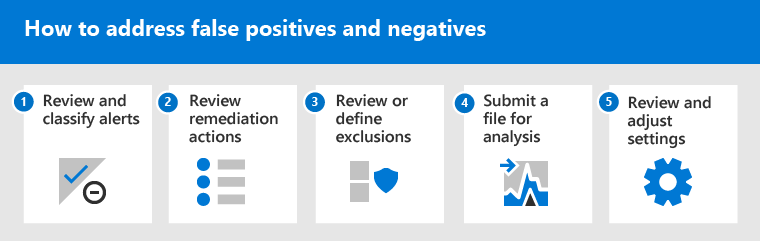

# Adressiert falsch positive/negative Ergebnisse in Microsoft Defender für Endpunkt

[!INCLUDE [Microsoft 365 Defender rebranding](../../includes/microsoft-defender.md)]

**Gilt für**

- [Microsoft Defender für Endpunkt](https://go.microsoft.com/fwlink/p/?linkid=2146806)

In Endpunktschutzlösungen ist ein falsch positives Element eine Entität, z. B. eine Datei oder ein Prozess, die erkannt und als schädlich identifiziert wurde, obwohl die Entität keine bedrohung ist. Ein falsch negativer Wert ist eine Entität, die nicht als Bedrohung erkannt wurde, obwohl sie tatsächlich bösartig ist. Falsch positive/negative Werte können bei jeder Bedrohungsschutzlösung auftreten, einschließlich [Microsoft Defender for Endpoint](microsoft-defender-endpoint.md).

Glücklicherweise können Schritte unternommen werden, um diese Art von Problemen zu beheben und zu reduzieren. Wenn falsch positive/negative Ergebnisse in Ihrem [Microsoft Defender Security Center](../defender/microsoft-365-security-center-mde.md)zu sehen sind, können Ihre Sicherheitsvorgänge Schritte unternehmen, um sie mithilfe des folgenden Prozesses zu adressieren:

1.  [Überprüfen und Klassifizieren von Warnungen](#part-1-review-and-classify-alerts) 
2.  [Überprüfen der ergriffenen Korrekturaktionen](#part-2-review-remediation-actions)
3.  [Überprüfen und Definieren von Ausschlüssen](#part-3-review-or-define-exclusions)
4.  [Übermitteln einer Entität zur Analyse](#part-4-submit-a-file-for-analysis)
5.  [Überprüfen und Anpassen der Einstellungen für den Bedrohungsschutz](#part-5-review-and-adjust-your-threat-protection-settings)

Sie können Hilfe erhalten, wenn nach der Ausführung der in diesem Artikel beschriebenen Aufgaben weiterhin Probleme mit falsch positiven/negativen Auswirkungen auftreten. Weitere [Informationen finden Sie unter Weitere Hilfe benötigen?](#still-need-help)

> [!NOTE]
> Dieser Artikel dient als Leitfaden für Sicherheitsoperatoren und Sicherheitsadministratoren, die [Microsoft Defender for Endpoint verwenden.](microsoft-defender-endpoint.md)

## Teil 1: Überprüfen und Klassifizieren von Warnungen

Wenn eine Warnung [angezeigt](alerts.md) wird, die ausgelöst wurde, weil etwas als bösartig oder verdächtig erkannt wurde, das nicht hätte sein dürfen, können Sie die Warnung für diese Entität unterdrücken. Sie können auch Warnungen unterdrücken, die nicht unbedingt falsch positive Ergebnisse sind, aber unwichtig sind. Es wird empfohlen, auch Warnungen zu klassifizieren. 

Die Verwaltung Ihrer Warnungen und das Klassifizieren von true/false-Positiven hilft Ihnen, Ihre Lösung zum Schutz vor Bedrohungen zu schulen und die Anzahl falsch positiver oder falsch negativer Ergebnisse im Laufe der Zeit zu reduzieren. Wenn Sie diese Schritte ausführen, können Sie auch das Rauschen in Ihrem Sicherheitsbetriebsdashboard reduzieren, damit sich Ihr Sicherheitsteam auf Arbeitsaufgaben mit höherer Priorität konzentrieren kann.

### Ermitteln, ob eine Warnung korrekt ist

Bevor Sie eine Warnung klassifizieren oder unterdrücken, bestimmen Sie, ob die Warnung richtig, falsch positiv oder gutartig ist.

1. Wechseln Sie zum Microsoft Defender Security Center ( [https://securitycenter.windows.com](https://securitycenter.windows.com) ) und melden Sie sich an.

2. Wählen Sie im Navigationsbereich **Benachrichtigungswarteschlange aus.**

3. Wählen Sie eine Warnung aus, um weitere Details zur Warnung zu erhalten. (Weitere [Informationen finden Sie unter Überprüfen von Warnungen in Microsoft Defender for Endpoint](review-alerts.md).)

4. Gehen Sie je nach Warnungsstatus wie in der folgenden Tabelle beschrieben vor: 

| Warnungsstatus | Vorgehensweise |
|:---|:---|
| Die Warnung ist genau. | Weisen Sie die Warnung zu, und untersuchen [Sie sie dann](investigate-alerts.md) weiter. |
| Die Warnung ist falsch positiv | 1. [Klassifizieren Sie die Warnung](#classify-an-alert) als falsch positiv.  2. [Unterdrücken Sie die Warnung](#suppress-an-alert).   3. [Erstellen Sie einen Indikator](#indicators-for-microsoft-defender-for-endpoint) für Microsoft Defender for Endpoint.   4. [Übermitteln Sie eine Datei zur Analyse an Microsoft.](#part-4-submit-a-file-for-analysis) |
| Die Warnung ist präzise, aber gutartig (unwichtig) | [Klassifizieren Sie die](#classify-an-alert) Warnung als echtes Positives, und unterdrücken Sie [dann die Warnung.](#suppress-an-alert) |

### Klassifizieren einer Warnung

Warnungen können im Microsoft Defender Security Center als falsch positive oder als echte Positive klassifiziert werden. Das Klassifizieren von Warnungen hilft, Microsoft Defender for Endpoint so zu schulen, dass im Laufe der Zeit mehr echte Warnungen und weniger falsche Warnungen angezeigt werden.

1. Wechseln Sie zum Microsoft Defender Security Center ( [https://securitycenter.windows.com](https://securitycenter.windows.com) ) und melden Sie sich an.

2. Wählen **Sie Benachrichtigungswarteschlange** aus, und wählen Sie dann eine Warnung aus.

3. Wählen Sie für die ausgewählte Warnung Die Warnung  >  **verwalten aus.** Ein Flyoutbereich wird geöffnet.

4. Wählen Sie **im Abschnitt Warnung** verwalten entweder True alert **oder** False **alert aus.** (Verwenden **Sie False-Warnung,** um ein falsch positives Ergebnis zu klassifizieren.)

> [!TIP]
> Weitere Informationen zum Unterdrücken von Warnungen finden Sie unter [Manage Microsoft Defender for Endpoint alerts](/microsoft-365/security/defender-endpoint/manage-alerts). Und wenn Ihre Organisation einen SieM-Server (Security Information and Event Management) verwendet, müssen Sie auch dort eine Unterdrückungsregel definieren. 

### Unterdrücken einer Warnung

Wenn Sie Warnungen haben, bei denen es sich entweder um falsch positive Oder um echte Positive handelt, aber für unwichtige Ereignisse, können Sie diese Warnungen im Microsoft Defender Security Center unterdrücken. Das Unterdrücken von Warnungen trägt dazu bei, das Rauschen in Ihrem Sicherheitsbetriebsdashboard zu reduzieren. 

1. Wechseln Sie zum Microsoft Defender Security Center ( [https://securitycenter.windows.com](https://securitycenter.windows.com) ) und melden Sie sich an.

2. Wählen Sie im Navigationsbereich **Benachrichtigungswarteschlange aus.**

3. Wählen Sie eine Warnung aus, die Sie unterdrücken möchten, um den **Detailbereich zu** öffnen.

4. Wählen Sie **im Detailbereich** die Auslassungspunkte (**...**) aus, und erstellen Sie **dann eine Unterdrückungsregel**.

5. Geben Sie alle Einstellungen für die Unterdrückungsregel an, und wählen Sie dann **Speichern aus.**

> [!TIP]
> Benötigen Sie Hilfe bei Unterdrückungsregeln? Weitere [Informationen finden Sie unter Unterdrücken einer Warnung und Erstellen einer neuen Unterdrückungsregel.](/microsoft-365/security/defender-endpoint/manage-alerts#suppress-an-alert-and-create-a-new-suppression-rule)

## Teil 2: Überprüfen von Korrekturaktionen

[Korrekturaktionen,](manage-auto-investigation.md#remediation-actions)z. B. das Senden einer Datei in quarantäne oder das Beenden eines Prozesses, werden für Entitäten (z. B. Dateien) ergriffen, die als Bedrohungen erkannt werden. Mehrere Arten von Abhilfemaßnahmen werden automatisch durch automatisierte Untersuchung und Microsoft Defender Antivirus ausgeführt:   
- Isolieren einer Datei
- Entfernen eines Registrierungsschlüssels
- Kill a process
- Beenden eines Diensts
- Deaktivieren eines Treibers
- Entfernen eines geplanten Vorgangs

Andere Aktionen, z. B. das Starten eines Antivirenscans oder das Sammeln eines Untersuchungspakets, erfolgen manuell oder über [Live Response](live-response.md). Aktionen, die über die Liveantwort ergriffen werden, können nicht rückgängig gemacht werden.

Nachdem Sie Ihre Warnungen überprüft haben, besteht der nächste Schritt in der Überprüfung [von Korrekturaktionen.](manage-auto-investigation.md) Wenn Aktionen als Ergebnis falsch positiver Ergebnisse ergriffen wurden, können Sie die meisten Arten von Korrekturaktionen rückgängig machen. Insbesondere können Sie:
- [Rückgängig machen eine Aktion nach dem anderen](#undo-an-action);
- [Rückgängig machen mehrerer Aktionen gleichzeitig](#undo-multiple-actions-at-one-time); und 
- [Entfernen einer Datei aus der Quarantäne auf mehreren Geräten](#remove-a-file-from-quarantine-across-multiple-devices). 

Wenn Sie aktionen überprüft und rückgängig gemacht haben, die als Ergebnis falsch positiver Ergebnisse durchgeführt wurden, fahren Sie mit dem Überprüfen oder Definieren von [Ausschlüssen fort.](#part-3-review-or-define-exclusions)

### Überprüfen abgeschlossener Aktionen

1. Wechseln Sie zum Aktionscenter ( [https://securitycenter.windows.com/action-center](https://securitycenter.windows.com/action-center) ) und melden Sie sich an. 

2. Wählen Sie die **Registerkarte Verlauf** aus, um eine Liste der ergriffenen Aktionen anzeigen zu können.  

3. Wählen Sie ein Element aus, um weitere Details zu der ergriffenen Korrekturaktion anzuzeigen.

### Rückgängig machen einer Aktion

1. Wechseln Sie zum Aktionscenter ( [https://securitycenter.windows.com/action-center](https://securitycenter.windows.com/action-center) ) und melden Sie sich an.

2. Wählen Sie **auf der** Registerkarte Verlauf eine Aktion aus, die Rückgängig gemacht werden soll.

3. Wählen Sie im Flyoutbereich **Rückgängig aus.** Wenn die Aktion mit dieser Methode nicht rückgängig gemacht werden kann, wird keine **Schaltfläche Rückgängig** angezeigt. (Weitere Informationen finden Sie unter [Rückgängig gemachte Aktionen](manage-auto-investigation.md#undo-completed-actions).)

### Rückgängig machen mehrerer Aktionen gleichzeitig

1. Wechseln Sie zum Aktionscenter ( [https://securitycenter.windows.com/action-center](https://securitycenter.windows.com/action-center) ) und melden Sie sich an.

2. Wählen Sie **auf der Registerkarte** Verlauf die Aktionen aus, die Rückgängig gemacht werden sollen.

3. Wählen Sie im Bereich auf der rechten Seite des Bildschirms **Rückgängig aus.**

### Entfernen einer Datei aus der Quarantäne auf mehreren Geräten 

> [!div class="mx-imgBorder"]
> 

1. Wechseln Sie zum Aktionscenter ( [https://securitycenter.windows.com/action-center](https://securitycenter.windows.com/action-center) ) und melden Sie sich an.

2. Wählen Sie **auf der Registerkarte** Verlauf eine Datei mit dem Aktionstyp **Quarantänedatei aus.**

3. Wählen Sie im Bereich auf der rechten Seite des Bildschirms Anwenden auf **X** weitere Instanzen dieser Datei aus, und wählen Sie **dann Rückgängig aus.** 

## Teil 3: Überprüfen oder Definieren von Ausschlüssen

Ein Ausschluss ist eine Entität, z. B. eine Datei oder URL, die Sie als Ausnahme für Korrekturaktionen angeben. Die ausgeschlossene Entität kann weiterhin erkannt werden, es werden jedoch keine Korrekturaktionen für diese Entität ergriffen. Das heißt, die erkannte Datei oder der erkannte Prozess wird von Microsoft Defender for Endpoint nicht beendet, in Quarantäne gesendet, entfernt oder anderweitig geändert. 

Führen Sie die folgenden Aufgaben aus, um Ausschlüsse in Microsoft Defender for Endpoint zu definieren:
- [Definieren von Ausschlüssen für Microsoft Defender Antivirus](#exclusions-for-microsoft-defender-antivirus)
- [Erstellen von "zulassen"-Indikatoren für Microsoft Defender for Endpoint](#indicators-for-microsoft-defender-for-endpoint)

> [!NOTE]
> Microsoft Defender Antivirus-Ausschlüsse gelten nur für den Antivirenschutz, nicht für andere Microsoft Defender for Endpoint-Funktionen. Um Dateien allgemein auszuschließen, verwenden Sie Ausschlüsse für Microsoft Defender Antivirus [und](/microsoft-365/security/defender-endpoint/manage-indicators) benutzerdefinierte Indikatoren für Microsoft Defender for Endpoint.

In den Verfahren in diesem Abschnitt wird beschrieben, wie Ausschlüsse und Indikatoren definiert werden.

### Ausschlüsse für Microsoft Defender Antivirus

Im Allgemeinen sollten Sie keine Ausschlüsse für Microsoft Defender Antivirus definieren müssen. Stellen Sie sicher, dass Sie Ausschlüsse sparsam definieren und nur die Dateien, Ordner, Prozesse und vom Prozess geöffneten Dateien enthalten, die zu falsch positiven Ergebnisse führen. Achten Sie außerdem darauf, die definierten Ausschlüsse regelmäßig zu überprüfen. Es wird [empfohlen, Microsoft Endpoint Manager](/mem/endpoint-manager-overview) zu verwenden, um Ihre Antivirenausschlüsse zu definieren oder zu bearbeiten. Sie können jedoch andere Methoden verwenden, z. B. [Gruppenrichtlinien](/azure/active-directory-domain-services/manage-group-policy) (siehe [Verwalten von Microsoft Defender for Endpoint](manage-atp-post-migration.md)).

> [!TIP]
> Benötigen Sie Hilfe bei Antivirenausschlüssen? Weitere [Informationen finden Sie unter Configure and validate exclusions for Microsoft Defender Antivirus scans](/windows/security/threat-protection/microsoft-defender-antivirus/configure-exclusions-microsoft-defender-antivirus).

#### Verwenden von Microsoft Endpoint Manager zum Verwalten von Antivirenausschlüssen (für vorhandene Richtlinien)

1. Wechseln Sie zum Microsoft Endpoint Manager Admin Center ( [https://endpoint.microsoft.com](https://endpoint.microsoft.com) ) und melden Sie sich an.

2. Wählen **Sie Endpoint security**  >  **Antivirus** aus, und wählen Sie dann eine vorhandene Richtlinie aus. (Wenn Sie nicht über eine vorhandene Richtlinie verfügen oder eine neue Richtlinie erstellen möchten, fahren Sie mit dem [nächsten Verfahren weiter.](#use-microsoft-endpoint-manager-to-create-a-new-antivirus-policy-with-exclusions)

3. Wählen **Sie Eigenschaften** aus, und wählen Sie neben **Konfigurationseinstellungen** bearbeiten **aus.**

4. Erweitern **Sie Microsoft Defender Antivirus-Ausschlüsse,** und geben Sie dann Ihre Ausschlüsse an.

5. Wählen **Sie Überprüfen + Speichern** aus, und wählen Sie dann Speichern **aus.**

#### Erstellen einer neuen Antivirenrichtlinie mit Ausschlüssen mithilfe von Microsoft Endpoint Manager

1. Wechseln Sie zum Microsoft Endpoint Manager Admin Center ( [https://endpoint.microsoft.com](https://endpoint.microsoft.com) ) und melden Sie sich an.

2. Wählen **Sie Endpoint security**  >  **Antivirus**+ Create Policy  >  **aus.** 

3. Wählen Sie eine Plattform aus (z. B. **Windows 10 und höher**, **macOS** oder **Windows 10 und Windows Server**).

4. Wählen **Sie unter Profil** die Option Microsoft Defender **Antivirus-Ausschlüsse** aus, und wählen Sie dann **Erstellen aus.**

5. Geben Sie einen Namen und eine Beschreibung für das Profil an, und wählen Sie dann **Weiter aus.**

6. Geben Sie **auf der Registerkarte** Konfigurationseinstellungen Ihre Antivirenausschlüsse an, und wählen Sie dann Weiter **aus.**

7. Wenn Sie **Bereichstags** in Ihrer Organisation verwenden, geben Sie auf der Registerkarte Bereichstags Bereichstags für die Richtlinie an, die Sie erstellen. (Siehe [Bereichstags](/mem/intune/fundamentals/scope-tags).)

8. Geben Sie **auf** der Registerkarte Zuweisungen die Benutzer und Gruppen an, auf die Ihre Richtlinie angewendet werden soll, und wählen Sie dann **Weiter aus.** (Wenn Sie Hilfe bei Zuweisungen benötigen, lesen [Sie Zuweisen von Benutzer- und Geräteprofilen in Microsoft Intune](/mem/intune/configuration/device-profile-assign).)

9. Überprüfen Sie **auf der** Registerkarte Überprüfen + Erstellen die Einstellungen, und wählen Sie dann **Erstellen aus.**

### Indikatoren für Microsoft Defender for Endpoint

[Indikatoren](/microsoft-365/security/defender-endpoint/manage-indicators) (insbesondere Indikatoren für Kompromisse oder IoCs) ermöglichen Es Ihrem Sicherheitsbetriebsteam, die Erkennung, Verhinderung und den Ausschluss von Entitäten zu definieren. Sie können beispielsweise bestimmte Dateien angeben, die in Denk- und Korrekturaktionen in Microsoft Defender for Endpoint ausgelassen werden sollen. Oder Indikatoren können verwendet werden, um Warnungen für bestimmte Dateien, IP-Adressen oder URLs zu generieren.

Um Entitäten als Ausschlüsse für Microsoft Defender for Endpoint anzugeben, erstellen Sie "Zulassen"-Indikatoren für diese Entitäten. Solche ["allow"-Indikatoren](/windows/security/threat-protection/microsoft-defender-antivirus/microsoft-defender-antivirus-in-windows-10)in Microsoft Defender for Endpoint gelten für den Schutz [der](/microsoft-365/security/defender-endpoint/overview-endpoint-detection-response)nächsten Generation, die Erkennung und Reaktion von Endpunkten und die automatisierte Untersuchung [& Korrektur.](/microsoft-365/security/defender-endpoint/automated-investigations)

"Zulassen"-Indikatoren können für:

- [Files](#indicators-for-files)
- [IP-Adressen, URLs und Domänen](#indicators-for-ip-addresses-urls-or-domains)
- [Anwendungszertifikate](#indicators-for-application-certificates)

#### Indikatoren für Dateien

Wenn Sie [einen "zulassen"-Indikator](/microsoft-365/security/defender-endpoint/indicator-file)für eine Datei erstellen, z. B. eine ausführbare Datei, wird verhindert, dass Dateien, die Von Ihrer Organisation verwendet werden, blockiert werden. Dateien können portable ausführbare Dateien (PORTABLE Executable, PE) wie und `.exe` Dateien `.dll` enthalten. 

Stellen Sie vor dem Erstellen von Indikatoren für Dateien sicher, dass die folgenden Anforderungen erfüllt sind:
- Microsoft Defender Antivirus ist mit aktivierter cloudbasiertem Schutz konfiguriert (siehe [Verwalten des cloudbasierten Schutzes](/windows/security/threat-protection/microsoft-defender-antivirus/deploy-manage-report-microsoft-defender-antivirus))
- Antischalwareclientversion ist 4.18.1901.x oder höher 
- Auf Geräten wird Windows 10, Version 1703 oder höher, ausgeführt. Windows Server 2016; oder Windows Server 2019 
- Das [Feature Blockieren oder Zulassen ist aktiviert](/microsoft-365/security/defender-endpoint/advanced-features) 

#### Indikatoren für IP-Adressen, URLs oder Domänen

Wenn Sie [einen "zulassen"-Indikator](/microsoft-365/security/defender-endpoint/indicator-ip-domain)für eine IP-Adresse, URL oder Domäne erstellen, wird verhindert, dass die von Ihrer Organisation verwendeten Websites oder IP-Adressen blockiert werden.

Stellen Sie vor dem Erstellen von Indikatoren für IP-Adressen, URLs oder Domänen sicher, dass die folgenden Anforderungen erfüllt sind:
- Der Netzwerkschutz in Defender for Endpoint ist im Blockmodus aktiviert (siehe [Aktivieren des Netzwerkschutzes](/microsoft-365/security/defender-endpoint/enable-network-protection))
- Antischalware-Clientversion ist 4.18.1906.x oder höher 
- Auf Geräten wird Windows 10, Version 1709 oder höher, ausgeführt. 

Benutzerdefinierte Netzwerkindikatoren sind im Microsoft Defender Security Center aktiviert (siehe [Erweiterte Features](/microsoft-365/security/defender-endpoint/advanced-features))   

#### Indikatoren für Anwendungszertifikate 

Wenn Sie [einen "zulassen"-Indikator](/microsoft-365/security/defender-endpoint/indicator-certificates)für ein Anwendungszertifikat erstellen, wird verhindert, dass Anwendungen, z. B. intern entwickelte Anwendungen, blockiert werden, die Von Ihrer Organisation verwendet werden. `.CER` oder `.PEM` Dateierweiterungen werden unterstützt.   

Stellen Sie vor dem Erstellen von Indikatoren für Anwendungszertifikate sicher, dass die folgenden Anforderungen erfüllt sind:
- Microsoft Defender Antivirus ist mit aktivierter cloudbasiertem Schutz konfiguriert (siehe [Verwalten des cloudbasierten Schutzes](/windows/security/threat-protection/microsoft-defender-antivirus/deploy-manage-report-microsoft-defender-antivirus))
- Antischalwareclientversion ist 4.18.1901.x oder höher 
- Auf Geräten wird Windows 10, Version 1703 oder höher, ausgeführt. Windows Server 2016; oder Windows Server 2019 
- Viren- und Bedrohungsschutzdefinitionen sind auf dem neuesten Stand  

> [!TIP]
> Wenn Sie Indikatoren erstellen, können Sie sie nach und nach definieren oder mehrere Elemente gleichzeitig importieren. Beachten Sie, dass für einen einzelnen Mandanten ein Grenzwert von 15.000 Indikatoren besteht. Möglicherweise müssen Sie zunächst bestimmte Details sammeln, z. B. Dateihashinformationen. Überprüfen Sie unbedingt die Voraussetzungen, bevor Sie [Indikatoren erstellen.](manage-indicators.md) 

## Teil 4: Übermitteln einer Datei zur Analyse

Sie können Entitäten, z. B. Dateien und dateilose Erkennungen, zur Analyse an Microsoft übermitteln. Microsoft-Sicherheitsforscher analysieren alle Übermittlungen, und ihre Ergebnisse helfen, Microsoft Defender for Endpoint-Funktionen zum Schutz vor Bedrohungen zu informieren. Wenn Sie sich auf der Übermittlungswebsite anmelden, können Sie Ihre Übermittlungen nachverfolgen.

### Übermitteln einer Datei zur Analyse

Wenn Sie über eine Datei verfügen, die entweder falsch als schädlich erkannt oder verpasst wurde, führen Sie die folgenden Schritte aus, um die Datei zur Analyse zu übermitteln.

1. Lesen Sie die Richtlinien hier: [Übermitteln von Dateien zur Analyse](/windows/security/threat-protection/intelligence/submission-guide).

2. Besuchen Sie die Microsoft Security Intelligence-Übermittlungswebsite ( [https://www.microsoft.com/wdsi/filesubmission](https://www.microsoft.com/wdsi/filesubmission) ), und übermitteln Sie Ihre Dateien.

### Übermitteln einer dateilosen Erkennung für die Analyse

Wenn etwas basierend auf dem Verhalten als Schadsoftware erkannt wurde und Sie keine Datei haben, können Sie Ihre Datei zur `Mpsupport.cab` Analyse übermitteln. Sie können die *CAB-Datei mithilfe* des Microsoft Malware Protection Command-Line Utility (MPCmdRun.exe)-Tools unter Windows 10 erhalten.

1.  Wechseln Sie ` C:\ProgramData\Microsoft\Windows Defender\Platform\<version>` zu , und führen Sie dann als Administrator `MpCmdRun.exe` aus.

2.  Geben `mpcmdrun.exe -GetFiles` Sie ein, und drücken Sie dann die **EINGABETASTE.**
   Es wird eine CAB-Datei generiert, die verschiedene Diagnoseprotokolle enthält. Der Speicherort der Datei wird in der Ausgabe der Eingabeaufforderung angegeben. Standardmäßig ist der Speicherort `C:\ProgramData\Microsoft\Microsoft Defender\Support\MpSupportFiles.cab` .

3.  Lesen Sie die Richtlinien hier: [Übermitteln von Dateien zur Analyse](/windows/security/threat-protection/intelligence/submission-guide).

4.  Besuchen Sie die Microsoft Security Intelligence-Übermittlungswebsite ( [https://www.microsoft.com/wdsi/filesubmission](https://www.microsoft.com/wdsi/filesubmission) ), und übermitteln Sie Ihre CAB-Dateien.

### Was geschieht, nachdem eine Datei übermittelt wurde?

Ihre Übermittlung wird sofort von unseren Systemen überprüft, um Ihnen die neueste Bestimmung zu geben, noch bevor ein Analyst mit der Behandlung Ihres Falls beginnt. Es ist möglich, dass eine Datei bereits von einem Analysten übermittelt und verarbeitet wurde. In diesen Fällen wird schnell eine Bestimmung vorgenommen.

Für Übermittlungen, die noch nicht verarbeitet wurden, werden sie für die Analyse wie folgt priorisiert:

- Weit verbreitete Dateien, die sich auf eine große Anzahl von Computern auswirken können, erhalten eine höhere Priorität.
- Authentifizierte Kunden, insbesondere Unternehmenskunden mit gültigen [Software Assurance-IDs (SAIDs),](https://www.microsoft.com/licensing/licensing-programs/software-assurance-default.aspx)erhalten eine höhere Priorität.
- Übermittlungen, die von den BESITZERn von SAID als hohe Priorität gekennzeichnet sind, werden sofort behandelt.

Um nach Updates für Ihre Übermittlung zu suchen, melden Sie sich auf der [Microsoft Security Intelligence-Übermittlungswebsite an.](https://www.microsoft.com/wdsi/filesubmission) 

> [!TIP]
> Weitere Informationen finden Sie unter [Submit files for analysis](/windows/security/threat-protection/intelligence/submission-guide#how-does-microsoft-prioritize-submissions).

## Teil 5: Überprüfen und Anpassen der Einstellungen für den Bedrohungsschutz

Microsoft Defender for Endpoint bietet eine Vielzahl von Optionen, einschließlich der Möglichkeit, Einstellungen für verschiedene Features und Funktionen zu optimieren. Wenn Sie zahlreiche falsch positive Ergebnisse erhalten, überprüfen Sie unbedingt die Bedrohungsschutzeinstellungen Ihrer Organisation. Möglicherweise müssen Sie einige Anpassungen an:

- [In der Cloud zugestellter Schutz](#cloud-delivered-protection)
- [Behebung von potenziell unerwünschten Anwendungen](#remediation-for-potentially-unwanted-applications)
- [Automatisierte Untersuchung und Behebung](#automated-investigation-and-remediation)

### In der Cloud zugestellter Schutz

Überprüfen Sie Ihre in der Cloud zugestellte Schutzstufe für Microsoft Defender Antivirus. Standardmäßig ist der in der Cloud zugestellte Schutz auf **Nicht** konfiguriert festgelegt, was einem normalen Schutzniveau für die meisten Organisationen entspricht. Wenn Ihr in der Cloud zugestellter Schutz auf **Hohe**, Hohe **+** oder **Nulltoleranz** festgelegt ist, wird möglicherweise eine höhere Anzahl falsch positiver Ergebnisse erreicht.

> [!TIP]
> Weitere Informationen zum Konfigurieren ihres in der Cloud übermittelten Schutzes finden Sie unter [Angeben der in der Cloud übermittelten Schutzstufe](/windows/security/threat-protection/microsoft-defender-antivirus/specify-cloud-protection-level-microsoft-defender-antivirus).

Wir empfehlen die [Verwendung von Microsoft Endpoint Manager](/mem/endpoint-manager-overview) zum Bearbeiten oder Festlegen ihrer in der Cloud übermittelten Schutzeinstellungen. Sie können jedoch andere Methoden verwenden, z. B. [Gruppenrichtlinien](/azure/active-directory-domain-services/manage-group-policy) (siehe [Verwalten von Microsoft Defender for Endpoint](manage-atp-post-migration.md)).

#### Verwenden von Microsoft Endpoint Manager zum Überprüfen und Bearbeiten von in der Cloud übermittelten Schutzeinstellungen (für vorhandene Richtlinien)

1. Wechseln Sie zum Microsoft Endpoint Manager Admin Center ( [https://endpoint.microsoft.com](https://endpoint.microsoft.com) ) und melden Sie sich an.

2. Wählen **Sie Endpoint security**  >  **Antivirus** aus, und wählen Sie dann eine vorhandene Richtlinie aus. (Wenn Sie nicht über eine vorhandene Richtlinie verfügen oder eine neue Richtlinie erstellen möchten, fahren Sie mit dem [nächsten Verfahren weiter.](#use-microsoft-endpoint-manager-to-set-cloud-delivered-protection-settings-for-a-new-policy)

3. Wählen **Sie unter Verwalten** die Option Eigenschaften **aus.** Wählen Sie dann neben **Konfigurationseinstellungen** bearbeiten **aus.**

4. Erweitern **Sie Cloudschutz,** und überprüfen Sie Ihre aktuelle Einstellung in der **Zeile Cloud-delivered protection level.** Es wird empfohlen, den in der Cloud übermittelten Schutz auf **Nicht** konfiguriert zu setzen, was einen starken Schutz bietet und gleichzeitig die Wahrscheinlichkeit verringert, falsch positive Ergebnisse zu erhalten.

5. Wählen **Sie Überprüfen + speichern** und dann Speichern **aus.**

#### Festlegen von in der Cloud übermittelten Schutzeinstellungen mithilfe von Microsoft Endpoint Manager (für eine neue Richtlinie)

1. Wechseln Sie zum Microsoft Endpoint Manager Admin Center ( [https://endpoint.microsoft.com](https://endpoint.microsoft.com) ) und melden Sie sich an.

2. Wählen **Sie Endpoint security**  >  **Antivirus**+ Create policy  >  **aus.**

3. Wählen **Sie für Plattform** eine Option aus, und wählen Sie dann für **Profil** die Option **Antivirus** oder Microsoft **Defender Antivirus** aus (die spezifische Option hängt davon ab, was Sie für die Plattform ausgewählt **haben**.) Wählen Sie dann **Erstellen aus.**

4. Geben Sie **auf der Registerkarte** Grundlagen einen Namen und eine Beschreibung für die Richtlinie an. Wählen Sie dann **Weiter** aus.

5. Erweitern Sie **auf der** Registerkarte Konfigurationseinstellungen **den Cloudschutz,** und geben Sie die folgenden Einstellungen an:
   - Legen **Sie Den in der Cloud übermittelten Schutz auf** Ja **ein.**
   - Legen **Sie in der Cloud zugestellte Schutzstufe** auf Nicht **konfiguriert.** (Diese Stufe bietet standardmäßig ein hohes Schutzniveau und verringert gleichzeitig die Wahrscheinlichkeit, dass falsch positive Ergebnisse angezeigt werden.)

6. Wenn Sie **Bereichstags** in Ihrer Organisation verwenden, geben Sie auf der Registerkarte Bereichstags Bereichstags für die Richtlinie an. (Siehe [Bereichstags](/mem/intune/fundamentals/scope-tags).)

7. Geben Sie **auf** der Registerkarte Zuweisungen die Benutzer und Gruppen an, auf die Ihre Richtlinie angewendet werden soll, und wählen Sie dann **Weiter aus.** (Wenn Sie Hilfe bei Zuweisungen benötigen, lesen [Sie Zuweisen von Benutzer- und Geräteprofilen in Microsoft Intune](/mem/intune/configuration/device-profile-assign).)

8. Überprüfen Sie **auf der** Registerkarte Überprüfen + Erstellen die Einstellungen, und wählen Sie dann **Erstellen aus.**  

### Behebung von potenziell unerwünschten Anwendungen

Potenziell unerwünschte Anwendungen (PUA) sind eine Kategorie von Software, die dazu führen kann, dass Geräte langsam ausgeführt werden, unerwartete Anzeigen anzeigen oder andere Software installieren, die unerwartet oder unerwünscht sein kann. Beispiele für PUA sind Werbesoftware, Bündelungssoftware und Software zum Ausweichen, die sich bei Sicherheitsprodukten anders verhält. Obwohl PUA nicht als Schadsoftware betrachtet wird, sind einige Arten von Software PUA basierend auf ihrem Verhalten und ihrer Reputation.

> [!TIP]
> Weitere Informationen zu PUA finden Sie unter [Detect and block potentially unwanted applications](/windows/security/threat-protection/microsoft-defender-antivirus/detect-block-potentially-unwanted-apps-microsoft-defender-antivirus).
 
Je nach den apps, die Ihre Organisation verwendet, erhalten Sie möglicherweise falsch positive Ergebnisse als Ergebnis Ihrer PUA-Schutzeinstellungen. Erwägen Sie bei Bedarf, den PUA-Schutz für eine Weile im Überwachungsmodus zu verwenden, oder wenden Sie den PUA-Schutz auf eine Teilmenge von Geräten in Ihrer Organisation an. Der PUA-Schutz kann für den Microsoft Edge-Browser und für Microsoft Defender Antivirus konfiguriert werden.

Es wird [empfohlen, microsoft Endpoint Manager](/mem/endpoint-manager-overview) zum Bearbeiten oder Festlegen von PUA-Schutzeinstellungen zu verwenden. Sie können jedoch andere Methoden verwenden, z. B. [Gruppenrichtlinien](/azure/active-directory-domain-services/manage-group-policy) (siehe [Verwalten von Microsoft Defender for Endpoint](manage-atp-post-migration.md)).

#### Bearbeiten des PUA-Schutzes mithilfe von Microsoft Endpoint Manager (für vorhandene Konfigurationsprofile)

1. Wechseln Sie zum Microsoft Endpoint Manager Admin Center ( [https://endpoint.microsoft.com](https://endpoint.microsoft.com) ) und melden Sie sich an.

2. Wählen **Sie**  >  **Gerätekonfigurationsprofile** aus, und wählen Sie dann eine vorhandene Richtlinie aus. (Wenn Sie über keine vorhandene Richtlinie verfügen oder eine neue Richtlinie erstellen möchten, fahren Sie mit dem [nächsten Verfahren weiter.)](#use-microsoft-endpoint-manager-to-set-pua-protection-for-a-new-configuration-profile)

3. Wählen **Sie unter Verwalten** die Option **Eigenschaften** aus, und wählen Sie dann neben **Konfigurationseinstellungen** **bearbeiten aus.**

4. Scrollen Sie **auf der** Registerkarte Konfigurationseinstellungen nach unten, und erweitern Sie Microsoft **Defender Antivirus**.

5. Legen **Sie "Potenziell unerwünschte Anwendungen erkennen" auf** Überwachung **festgelegt.** (Sie können es deaktivieren, aber mithilfe des Überwachungsmodus können Sie Erkennungen sehen.)

6. Wählen **Sie Überprüfen + Speichern** aus, und wählen Sie dann Speichern **aus.**

#### Festlegen des PUA-Schutzes mithilfe von Microsoft Endpoint Manager (für ein neues Konfigurationsprofil)

1. Wechseln Sie zum Microsoft Endpoint Manager Admin Center ( [https://endpoint.microsoft.com](https://endpoint.microsoft.com) ) und melden Sie sich an.

2. Wählen **Sie**  >  **Gerätekonfigurationsprofile**  >  **+ Profil erstellen aus.**

3. Wählen Sie **für die Plattform** Windows **10 und höher** aus, und wählen Sie unter **Profil** **geräteeinschränkungen aus.**

4. Geben Sie **auf der Registerkarte** Grundlagen einen Namen und eine Beschreibung für Ihre Richtlinie an. Wählen Sie dann **Weiter** aus.

5. Scrollen Sie **auf der** Registerkarte Konfigurationseinstellungen nach unten, und erweitern Sie Microsoft **Defender Antivirus**.

6. Legen **Sie "Potenziell unerwünschte Anwendungen erkennen" auf** **"Überwachung"** und dann auf **Weiter .** (Sie können den PUA-Schutz deaktivieren, aber mithilfe des Überwachungsmodus können Sie Erkennungen sehen.)

7. Geben Sie **auf** der Registerkarte Zuweisungen die Benutzer und Gruppen an, auf die Ihre Richtlinie angewendet werden soll, und wählen Sie dann **Weiter aus.** (Wenn Sie Hilfe bei Zuweisungen benötigen, lesen [Sie Zuweisen von Benutzer- und Geräteprofilen in Microsoft Intune](/mem/intune/configuration/device-profile-assign).)

8. Geben Sie auf der Registerkarte **Anwendbarkeitsregeln** die Betriebssystemeditionen oder -versionen an, die in die Richtlinie ein- oder ausgeschlossen werden sollen. Sie können beispielsweise festlegen, dass die Richtlinie auf alle Geräte angewendet werden soll, die bestimmte Editionen von Windows 10 enthalten. Wählen Sie dann **Weiter** aus.

9. Überprüfen Sie **auf der** Registerkarte Überprüfen + Erstellen Ihre Einstellungen, und wählen Sie dann **Erstellen aus.**

### Automatische Untersuchung und Reaktion

[Die Funktionen für die automatisierte](automated-investigations.md) Untersuchung und Behebung (AIR) sind so konzipiert, dass sie Warnungen untersuchen und sofortige Maßnahmen zur Behebung von Verstößen ergreifen. Wenn Warnungen ausgelöst werden und eine automatisierte Untersuchung ausgeführt wird, wird für jeden untersuchten Nachweis ein Urteil generiert. Die Urteile können *"Bösartig",* *"Verdächtig"* oder *"Keine Bedrohungen" sein.* 

Abhängig vom [Automatisierungsgrad](/microsoft-365/security/defender-endpoint/automation-levels) für Ihre Organisation und anderen Sicherheitseinstellungen werden Korrekturaktionen für Artefakte ergriffen, die als bösartig oder *verdächtig* *betrachtet werden.* In einigen Fällen werden Korrekturaktionen automatisch ausgeführt. In anderen Fällen werden Korrekturaktionen manuell oder nur nach Genehmigung durch Ihr Sicherheitsteam ergriffen. 

- [Erfahren Sie mehr über Automatisierungsebenen;](/microsoft-365/security/defender-endpoint/automation-levels) Und dann 
- [Konfigurieren von AIR-Funktionen in Defender for Endpoint](/microsoft-365/security/defender-endpoint/configure-automated-investigations-remediation).

> [!IMPORTANT]
> Es wird empfohlen, *die vollständige Automatisierung* für die automatisierte Untersuchung und Korrektur zu verwenden. Deaktivieren Sie diese Funktionen nicht aufgrund eines falsch positiven Werts. Verwenden Sie stattdessen ["Zulassen"-Indikatoren,](#indicators-for-microsoft-defender-for-endpoint)um Ausnahmen zu definieren und die automatische Untersuchung und Korrektur so zu halten, dass entsprechende Aktionen automatisch ausgeführt werden. Das [Folgen dieser Anleitung](automation-levels.md#levels-of-automation) hilft Ihnen, die Anzahl der Warnungen zu reduzieren, die Ihr Sicherheitsbetriebsteam verarbeiten muss. 

## Benötigen Sie weitere Hilfe?

Wenn Sie alle Schritte in diesem Artikel durchgearbeitet haben und weiterhin Hilfe benötigen, wenden Sie sich an den technischen Support.

1. Wechseln Sie zum Microsoft Defender Security Center ( [https://securitycenter.windows.com](https://securitycenter.windows.com) ) und melden Sie sich an.

2. Wählen Sie in der oberen rechten Ecke das Fragezeichen (**?**) aus, und wählen Sie dann **Microsoft Support aus.**

3. Beschreiben Sie **im Fenster Support-Assistent** Ihr Problem, und senden Sie ihre Nachricht. Von dort aus können Sie eine Dienstanforderung öffnen.  

## Siehe auch

[Verwalten von Microsoft Defender for Endpoint](manage-atp-post-migration.md)

[Übersicht über das Microsoft Defender Security Center](/microsoft-365/security/defender-endpoint/use) 
