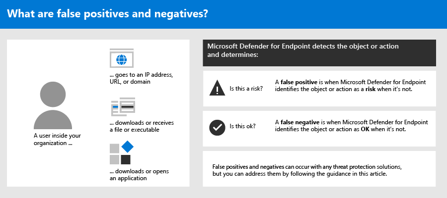

# Adress false positives/negatives in Microsoft Defender for EndpointAddress false positives/negatives in Microsoft Defender for Endpoint

[!INCLUDE [Microsoft 365 Defender rebranding](../../includes/microsoft-defender.md)]

**Gilt für****Applies to**

- [Microsoft Defender für EndpunktMicrosoft Defender for Endpoint](https://go.microsoft.com/fwlink/p/?linkid=2146806)

In Endpunktschutzlösungen ist ein falsch positives Element eine Entität, z. B. eine Datei oder ein Prozess, die erkannt und als schädlich identifiziert wurde, obwohl die Entität keine bedrohung ist.In endpoint protection solutions, a false positive is an entity, such as a file or a process, that was detected and identified as malicious, even though the entity isn't actually a threat. Ein falsch negativer Wert ist eine Entität, die nicht als Bedrohung erkannt wurde, obwohl sie tatsächlich bösartig ist.A false negative is an entity that was not detected as a threat, even though it actually is malicious. Falsch positive/negative Werte können bei jeder Bedrohungsschutzlösung auftreten, einschließlich [Microsoft Defender for Endpoint](https://docs.microsoft.com/microsoft-365/security/defender-endpoint/microsoft-defender-advanced-threat-protection).False positives/negatives can occur with any threat protection solution, including [Microsoft Defender for Endpoint](https://docs.microsoft.com/microsoft-365/security/defender-endpoint/microsoft-defender-advanced-threat-protection).

Glücklicherweise können Schritte unternommen werden, um diese Art von Problemen zu beheben und zu reduzieren.Fortunately, steps can be taken to address and reduce these kinds of issues. Wenn falsch positive/negative Ergebnisse in Ihrem [Microsoft Defender Security Center](https://docs.microsoft.com/microsoft-365/security/defender-endpoint/use)zu sehen sind, können Ihre Sicherheitsvorgänge Schritte unternehmen, um sie mithilfe des folgenden Prozesses zu adressieren:If you're seeing false positives/negatives in your [Microsoft Defender Security Center](https://docs.microsoft.com/microsoft-365/security/defender-endpoint/use), your security operations can take steps to address them by using the following process:

1.  [Überprüfen und Klassifizieren von WarnungenReview and classify alerts](#part-1-review-and-classify-alerts) 
2.  [Überprüfen der ergriffenen KorrekturaktionenReview remediation actions that were taken](#part-2-review-remediation-actions)
3.  [Überprüfen und Definieren von AusschlüssenReview and define exclusions](#part-3-review-or-define-exclusions)
4.  [Übermitteln einer Entität zur AnalyseSubmit an entity for analysis](#part-4-submit-a-file-for-analysis)
5.  [Überprüfen und Anpassen der Einstellungen für den BedrohungsschutzReview and adjust your threat protection settings](#part-5-review-and-adjust-your-threat-protection-settings)

Und Sie können Hilfe erhalten, wenn nach der Ausführung der in diesem Artikel beschriebenen Aufgaben weiterhin Probleme mit falsch [positiven/negativen](#still-need-help) Auswirkungen auftreten.And, you can [get help if you still have issues with false positives/negatives](#still-need-help) after performing the tasks described in this article.

> [!NOTE]
> Dieser Artikel dient als Leitfaden für Sicherheitsoperatoren und Sicherheitsadministratoren, die [Microsoft Defender for Endpoint verwenden.](microsoft-defender-endpoint.md)This article is intended as guidance for security operators and security administrators who are using [Microsoft Defender for Endpoint](microsoft-defender-endpoint.md).

## Teil 1: Überprüfen und Klassifizieren von WarnungenPart 1: Review and classify alerts

Wenn eine Warnung [angezeigt](alerts.md) wird, die ausgelöst wurde, weil etwas als bösartig oder verdächtig erkannt wurde, das nicht hätte sein dürfen, können Sie die Warnung für diese Entität unterdrücken.If you see an [alert](alerts.md) that was triggered because something was detected as malicious or suspicious that should not have been, you can suppress the alert for that entity. Sie können auch Warnungen unterdrücken, die nicht unbedingt falsch positive Ergebnisse sind, aber unwichtig sind.You can also suppress alerts that are not necessarily false positives, but are unimportant. Es wird empfohlen, auch Warnungen zu klassifizieren.We recommend that you classify alerts as well. 

Die Verwaltung Ihrer Warnungen und das Klassifizieren von true/false-Positiven hilft Ihnen, Ihre Lösung zum Schutz vor Bedrohungen zu schulen und die Anzahl falsch positiver oder falsch negativer Ergebnisse im Laufe der Zeit zu reduzieren.Managing your alerts and classifying true/false positives helps to train your threat protection solution and can reduce the number of false positives or false negatives over time. Wenn Sie diese Schritte ausführen, können Sie auch das Rauschen in Ihrem Sicherheitsbetriebsdashboard reduzieren, damit sich Ihr Sicherheitsteam auf Arbeitsaufgaben mit höherer Priorität konzentrieren kann.Taking these steps also helps reduce noise in your security operations dashboard so that your security team can focus on higher priority work items.

### Ermitteln, ob eine Warnung korrekt istDetermine whether an alert is accurate

Bevor Sie eine Warnung klassifizieren oder unterdrücken, bestimmen Sie, ob die Warnung richtig, falsch positiv oder gutartig ist.Before you classify or suppress an alert, determine whether the alert is accurate, a false positive, or benign.

1. Wechseln Sie zum Microsoft Defender Security Center ( [https://securitycenter.windows.com](https://securitycenter.windows.com) ) und melden Sie sich an.Go to the Microsoft Defender Security Center ([https://securitycenter.windows.com](https://securitycenter.windows.com)) and sign in.
2. Wählen Sie im Navigationsbereich **Benachrichtigungswarteschlange aus.**In the navigation pane, choose **Alerts queue**.
3. Wählen Sie eine Warnung aus, um weitere Details zur Warnung zu erhalten.Select an alert to more details about the alert. (Siehe [Überprüfen von Warnungen](https://docs.microsoft.com/microsoft-365/security/defender-endpoint/review-alerts).)(See [Review alerts](https://docs.microsoft.com/microsoft-365/security/defender-endpoint/review-alerts).)
4. Gehen Sie je nach Warnungsstatus wie in der folgenden Tabelle beschrieben vor:Depending on the alert status, take the steps described in the following table: 

| WarnungsstatusAlert status | VorgehensweiseWhat to do |
|:---|:---|
| Die Warnung ist genau.The alert is accurate | Weisen Sie die Warnung zu, und untersuchen [Sie sie dann](investigate-alerts.md) weiter.Assign the alert, and then [investigate it](investigate-alerts.md) further. |
| Die Warnung ist falsch positivThe alert is a false positive | 1. [Klassifizieren Sie die Warnung](#classify-an-alert) als falsch positiv.1. [Classify the alert](#classify-an-alert) as a false positive.  2. [Unterdrücken Sie die Warnung](#suppress-an-alert).2. [Suppress the alert](#suppress-an-alert).   3. [Erstellen Sie einen Indikator](#indicators-for-microsoft-defender-for-endpoint) für Microsoft Defender for Endpoint.3. [Create an indicator](#indicators-for-microsoft-defender-for-endpoint) for Microsoft Defender for Endpoint.   4. [Übermitteln Sie eine Datei zur Analyse an Microsoft.](#part-4-submit-a-file-for-analysis)4. [Submit a file to Microsoft for analysis](#part-4-submit-a-file-for-analysis). |
| Die Warnung ist präzise, aber gutartig (unwichtig)The alert is accurate, but benign (unimportant) | [Klassifizieren Sie die](#classify-an-alert) Warnung als echtes Positives, und unterdrücken Sie [dann die Warnung.](#suppress-an-alert)[Classify the alert](#classify-an-alert) as a true positive, and then [suppress the alert](#suppress-an-alert). |

### Klassifizieren einer WarnungClassify an alert

Warnungen können im Microsoft Defender Security Center als falsch positive oder als echte Positive klassifiziert werden.Alerts can be classified as false positives or true positives in the Microsoft Defender Security Center. Das Klassifizieren von Warnungen hilft, Microsoft Defender for Endpoint so zu schulen, dass im Laufe der Zeit mehr echte Warnungen und weniger falsche Warnungen angezeigt werden.Classifying alerts helps train Microsoft Defender for Endpoint so that, over time, you'll see more true alerts and fewer false alerts.

1. Wechseln Sie zum Microsoft Defender Security Center ( [https://securitycenter.windows.com](https://securitycenter.windows.com) ) und melden Sie sich an.Go to the Microsoft Defender Security Center ([https://securitycenter.windows.com](https://securitycenter.windows.com)) and sign in.
2. Wählen **Sie Benachrichtigungswarteschlange** aus, und wählen Sie dann eine Warnung aus.Select **Alerts queue**, and then select an alert.
3. Wählen Sie für die ausgewählte Warnung Die Warnung  >  **verwalten aus.**For the selected alert, select **Actions** > **Manage alert**. Ein Flyoutbereich wird geöffnet.A flyout pane opens.
4. Wählen Sie **im Abschnitt Warnung** verwalten entweder True alert **oder** False **alert aus.**In the **Manage alert** section, select either **True alert** or **False alert**. (Verwenden **Sie False-Warnung,** um ein falsch positives Ergebnis zu klassifizieren.)(Use **False alert** to classify a false positive.)

> [!TIP]
> Weitere Informationen zum Unterdrücken von Warnungen finden Sie unter [Manage Microsoft Defender for Endpoint alerts](https://docs.microsoft.com/microsoft-365/security/defender-endpoint/manage-alerts).For more information about suppressing alerts, see [Manage Microsoft Defender for Endpoint alerts](https://docs.microsoft.com/microsoft-365/security/defender-endpoint/manage-alerts). Und wenn Ihre Organisation einen SieM-Server (Security Information and Event Management) verwendet, müssen Sie auch dort eine Unterdrückungsregel definieren.And, if your organization is using a security information and event management (SIEM) server, make sure to define a suppression rule there, too. 

### Unterdrücken einer WarnungSuppress an alert

Wenn Sie Warnungen haben, bei denen es sich entweder um falsch positive Oder um echte Positive handelt, aber für unwichtige Ereignisse, können Sie diese Warnungen im Microsoft Defender Security Center unterdrücken.If you have alerts that are either false positives or that are true positives but for unimportant events, you can suppress those alerts in the Microsoft Defender Security Center. Das Unterdrücken von Warnungen trägt dazu bei, das Rauschen in Ihrem Sicherheitsbetriebsdashboard zu reduzieren.Suppressing alerts helps reduce noise in your security operations dashboard. 

1. Wechseln Sie zum Microsoft Defender Security Center ( [https://securitycenter.windows.com](https://securitycenter.windows.com) ) und melden Sie sich an.Go to the Microsoft Defender Security Center ([https://securitycenter.windows.com](https://securitycenter.windows.com)) and sign in.
2. Wählen Sie im Navigationsbereich **Benachrichtigungswarteschlange aus.**In the navigation pane, select **Alerts queue**.
3. Wählen Sie eine Warnung aus, die Sie unterdrücken möchten, um den **Detailbereich zu** öffnen.Select an alert that you want to suppress to open its **Details** pane.
4. Wählen Sie **im Detailbereich** die Auslassungspunkte (**...**) aus, und erstellen Sie **dann eine Unterdrückungsregel**.In the **Details** pane, choose the ellipsis (**...**), and then **Create a suppression rule**.
5. Geben Sie alle Einstellungen für die Unterdrückungsregel an, und wählen Sie dann **Speichern aus.**Specify all the settings for your suppression rule, and then choose **Save**.

> [!TIP]
> Benötigen Sie Hilfe bei Unterdrückungsregeln?Need help with suppression rules? Weitere [Informationen finden Sie unter Unterdrücken einer Warnung und Erstellen einer neuen Unterdrückungsregel.](https://docs.microsoft.com/microsoft-365/security/defender-endpoint/manage-alerts#suppress-an-alert-and-create-a-new-suppression-rule)See [Suppress an alert and create a new suppression rule](https://docs.microsoft.com/microsoft-365/security/defender-endpoint/manage-alerts#suppress-an-alert-and-create-a-new-suppression-rule).

## Teil 2: Überprüfen von KorrekturaktionenPart 2: Review remediation actions

[Korrekturaktionen,](manage-auto-investigation.md#remediation-actions)z. B. das Senden einer Datei in quarantäne oder das Beenden eines Prozesses, werden für Entitäten (z. B. Dateien) ergriffen, die als Bedrohungen erkannt werden.[Remediation actions](manage-auto-investigation.md#remediation-actions), such as sending a file to quarantine or stopping a process, are taken on entities (such as files) that are detected as threats. Mehrere Arten von Abhilfemaßnahmen werden automatisch durch automatisierte Untersuchung und Microsoft Defender Antivirus ausgeführt:Several types of remediation actions occur automatically through automated investigation and Microsoft Defender Antivirus:   
- Isolieren einer DateiQuarantine a file
- Entfernen eines RegistrierungsschlüsselsRemove a registry key
- Kill a processKill a process
- Beenden eines DienstsStop a service
- Deaktivieren eines TreibersDisable a driver
- Entfernen eines geplanten VorgangsRemove a scheduled task

Andere Aktionen, z. B. das Starten eines Antivirenscans oder das Sammeln eines Untersuchungspakets, erfolgen manuell oder über [Live Response](live-response.md).Other actions, such as starting an antivirus scan or collecting an investigation package, occur manually or through [Live Response](live-response.md). Aktionen, die über die Liveantwort ergriffen werden, können nicht rückgängig gemacht werden.Actions taken through Live Response cannot be undone.

Nachdem Sie Ihre Warnungen überprüft haben, besteht der nächste Schritt in der Überprüfung [von Korrekturaktionen.](manage-auto-investigation.md)After you have reviewed your alerts, your next step is to [review remediation actions](manage-auto-investigation.md). Wenn Aktionen als Ergebnis falsch positiver Ergebnisse ergriffen wurden, können Sie die meisten Arten von Korrekturaktionen rückgängig machen.If any actions were taken as a result of false positives, you can undo most kinds of remediation actions. Insbesondere können Sie:Specifically, you can:
- [Rückgängig machen eine Aktion nach dem anderen](#undo-an-action);[Undo one action at a time](#undo-an-action);
- [Rückgängig machen mehrerer Aktionen gleichzeitig](#undo-multiple-actions-at-one-time); und[Undo multiple actions at one time](#undo-multiple-actions-at-one-time); and 
- [Entfernen einer Datei aus der Quarantäne auf mehreren Geräten](#remove-a-file-from-quarantine-across-multiple-devices).[Remove a file from quarantine across multiple devices](#remove-a-file-from-quarantine-across-multiple-devices). 

Wenn Sie aktionen überprüft und rückgängig gemacht haben, die als Ergebnis falsch positiver Ergebnisse durchgeführt wurden, fahren Sie mit dem Überprüfen oder Definieren von [Ausschlüssen fort.](#part-3-review-or-define-exclusions)When you're done reviewing and undoing actions that were taken as a result of false positives, proceed to [review or define exclusions](#part-3-review-or-define-exclusions).

### Überprüfen abgeschlossener AktionenReview completed actions

1. Wechseln Sie zum Aktionscenter ( [https://securitycenter.windows.com/action-center](https://securitycenter.windows.com/action-center) ) und melden Sie sich an.Go to the Action center ([https://securitycenter.windows.com/action-center](https://securitycenter.windows.com/action-center)) and sign in. 
2. Wählen Sie die **Registerkarte Verlauf** aus, um eine Liste der ergriffenen Aktionen anzeigen zu können.Select the **History** tab to view a list of actions that were taken.  
3. Wählen Sie ein Element aus, um weitere Details zu der ergriffenen Korrekturaktion anzuzeigen.Select an item to view more details about the remediation action that was taken.

### Rückgängig machen einer AktionUndo an action

1. Wechseln Sie zum Aktionscenter ( [https://securitycenter.windows.com/action-center](https://securitycenter.windows.com/action-center) ) und melden Sie sich an.Go to the Action center ([https://securitycenter.windows.com/action-center](https://securitycenter.windows.com/action-center)) and sign in.
2. Wählen Sie **auf der** Registerkarte Verlauf eine Aktion aus, die Rückgängig gemacht werden soll.On the **History** tab, select an action that you want to undo.
3. Wählen Sie im Flyoutbereich **Rückgängig aus.**In the flyout pane, select **Undo**. Wenn die Aktion mit dieser Methode nicht rückgängig gemacht werden kann, wird keine **Schaltfläche Rückgängig** angezeigt.If the action cannot be undone with this method, you will not see an **Undo** button. (Weitere Informationen finden Sie unter [Rückgängig gemachte Aktionen](manage-auto-investigation.md#undo-completed-actions).)(To learn more, see [Undo completed actions](manage-auto-investigation.md#undo-completed-actions).)

### Rückgängig machen mehrerer Aktionen gleichzeitigUndo multiple actions at one time

1. Wechseln Sie zum Aktionscenter ( [https://securitycenter.windows.com/action-center](https://securitycenter.windows.com/action-center) ) und melden Sie sich an.Go to the Action center ([https://securitycenter.windows.com/action-center](https://securitycenter.windows.com/action-center)) and sign in.
2. Wählen Sie **auf der Registerkarte** Verlauf die Aktionen aus, die Rückgängig gemacht werden sollen.On the **History** tab, select the actions that you want to undo.
3. Wählen Sie im Bereich auf der rechten Seite des Bildschirms **Rückgängig aus.**In the pane on the right side of the screen, select **Undo**.

### Entfernen einer Datei aus der Quarantäne auf mehreren GerätenRemove a file from quarantine across multiple devices 

> [!div class="mx-imgBorder"]
> 

1. Wechseln Sie zum Aktionscenter ( [https://securitycenter.windows.com/action-center](https://securitycenter.windows.com/action-center) ) und melden Sie sich an.Go to the Action center ([https://securitycenter.windows.com/action-center](https://securitycenter.windows.com/action-center)) and sign in.
2. Wählen Sie **auf der Registerkarte** Verlauf eine Datei mit dem Aktionstyp **Quarantänedatei aus.**On the **History** tab, select a file that has the Action type **Quarantine file**.
3. Wählen Sie im Bereich auf der rechten Seite des Bildschirms Anwenden auf **X** weitere Instanzen dieser Datei aus, und wählen Sie **dann Rückgängig aus.**In the pane on the right side of the screen, select **Apply to X more instances of this file**, and then select **Undo**. 

## Teil 3: Überprüfen oder Definieren von AusschlüssenPart 3: Review or define exclusions

Ein Ausschluss ist eine Entität, z. B. eine Datei oder URL, die Sie als Ausnahme für Korrekturaktionen angeben.An exclusion is an entity, such as a file or URL, that you specify as an exception to remediation actions. Die ausgeschlossene Entität kann weiterhin erkannt werden, es werden jedoch keine Korrekturaktionen für diese Entität ergriffen.The excluded entity can still get detected, but no remediation actions are taken on that entity. Das heißt, die erkannte Datei oder der erkannte Prozess wird von Microsoft Defender for Endpoint nicht beendet, in Quarantäne gesendet, entfernt oder anderweitig geändert.That is, the detected file or process won’t be stopped, sent to quarantine, removed, or otherwise changed by Microsoft Defender for Endpoint. 

Führen Sie die folgenden Aufgaben aus, um Ausschlüsse in Microsoft Defender for Endpoint zu definieren:To define exclusions across Microsoft Defender for Endpoint, perform the following tasks:
- [Definieren von Ausschlüssen für Microsoft Defender AntivirusDefine exclusions for Microsoft Defender Antivirus](#exclusions-for-microsoft-defender-antivirus)
- [Erstellen von "zulassen"-Indikatoren für Microsoft Defender for EndpointCreate “allow” indicators for Microsoft Defender for Endpoint](#indicators-for-microsoft-defender-for-endpoint)

> [!NOTE]
> Microsoft Defender Antivirus-Ausschlüsse gelten nur für den Antivirenschutz, nicht für andere Microsoft Defender for Endpoint-Funktionen.Microsoft Defender Antivirus exclusions apply only to antivirus protection, not across other Microsoft Defender for Endpoint capabilities. Um Dateien allgemein auszuschließen, verwenden Sie Ausschlüsse für Microsoft Defender Antivirus [und](https://docs.microsoft.com/microsoft-365/security/defender-endpoint/manage-indicators) benutzerdefinierte Indikatoren für Microsoft Defender for Endpoint.To exclude files broadly, use exclusions for Microsoft Defender Antivirus and [custom indicators](https://docs.microsoft.com/microsoft-365/security/defender-endpoint/manage-indicators) for Microsoft Defender for Endpoint.

In den Verfahren in diesem Abschnitt wird beschrieben, wie Ausschlüsse und Indikatoren definiert werden.The procedures in this section describe how to define exclusions and indicators.

### Ausschlüsse für Microsoft Defender AntivirusExclusions for Microsoft Defender Antivirus

Im Allgemeinen sollten Sie keine Ausschlüsse für Microsoft Defender Antivirus definieren müssen.In general, you should not need to define exclusions for Microsoft Defender Antivirus. Stellen Sie sicher, dass Sie Ausschlüsse sparsam definieren und nur die Dateien, Ordner, Prozesse und vom Prozess geöffneten Dateien enthalten, die zu falsch positiven Ergebnisse führen.Make sure that you define exclusions sparingly, and that you only include the files, folders, processes, and process-opened files that are resulting in false positives. Achten Sie außerdem darauf, die definierten Ausschlüsse regelmäßig zu überprüfen.In addition, make sure to review your defined exclusions regularly. Es wird [empfohlen, Microsoft Endpoint Manager](https://docs.microsoft.com/mem/endpoint-manager-overview) zu verwenden, um Ihre Antivirenausschlüsse zu definieren oder zu bearbeiten. Sie können jedoch andere Methoden verwenden, z. B. [Gruppenrichtlinien](https://docs.microsoft.com/azure/active-directory-domain-services/manage-group-policy) (siehe [Verwalten von Microsoft Defender for Endpoint](manage-atp-post-migration.md)).We recommend using [Microsoft Endpoint Manager](https://docs.microsoft.com/mem/endpoint-manager-overview) to define or edit your antivirus exclusions; however, you can use other methods, such as [Group Policy](https://docs.microsoft.com/azure/active-directory-domain-services/manage-group-policy) (see [Manage Microsoft Defender for Endpoint](manage-atp-post-migration.md)).

> [!TIP]
> Benötigen Sie Hilfe bei Antivirenausschlüssen?Need help with antivirus exclusions? Weitere [Informationen finden Sie unter Configure and validate exclusions for Microsoft Defender Antivirus scans](https://docs.microsoft.com/windows/security/threat-protection/microsoft-defender-antivirus/configure-exclusions-microsoft-defender-antivirus).See [Configure and validate exclusions for Microsoft Defender Antivirus scans](https://docs.microsoft.com/windows/security/threat-protection/microsoft-defender-antivirus/configure-exclusions-microsoft-defender-antivirus).

#### Verwenden von Microsoft Endpoint Manager zum Verwalten von Antivirenausschlüssen (für vorhandene Richtlinien)Use Microsoft Endpoint Manager to manage antivirus exclusions (for existing policies)

1. Wechseln Sie zum Microsoft Endpoint Manager Admin Center ( [https://endpoint.microsoft.com](https://endpoint.microsoft.com) ) und melden Sie sich an.Go to the Microsoft Endpoint Manager admin center ([https://endpoint.microsoft.com](https://endpoint.microsoft.com)) and sign in.
2. Wählen **Sie Endpoint security**  >  **Antivirus** aus, und wählen Sie dann eine vorhandene Richtlinie aus.Choose **Endpoint security** > **Antivirus**, and then select an existing policy. (Wenn Sie nicht über eine vorhandene Richtlinie verfügen oder eine neue Richtlinie erstellen möchten, fahren Sie mit dem [nächsten Verfahren weiter.](#use-microsoft-endpoint-manager-to-create-a-new-antivirus-policy-with-exclusions)(If you don’t have an existing policy, or you want to create a new policy, skip to [the next procedure](#use-microsoft-endpoint-manager-to-create-a-new-antivirus-policy-with-exclusions)).
3. Wählen **Sie Eigenschaften** aus, und wählen Sie neben **Konfigurationseinstellungen** bearbeiten **aus.**Choose **Properties**, and next to **Configuration settings**, choose **Edit**.
4. Erweitern **Sie Microsoft Defender Antivirus-Ausschlüsse,** und geben Sie dann Ihre Ausschlüsse an.Expand **Microsoft Defender Antivirus Exclusions** and then specify your exclusions.
5. Wählen **Sie Überprüfen + Speichern** aus, und wählen Sie dann Speichern **aus.**Choose **Review + save**, and then choose **Save**.

#### Erstellen einer neuen Antivirenrichtlinie mit Ausschlüssen mithilfe von Microsoft Endpoint ManagerUse Microsoft Endpoint Manager to create a new antivirus policy with exclusions

1. Wechseln Sie zum Microsoft Endpoint Manager Admin Center ( [https://endpoint.microsoft.com](https://endpoint.microsoft.com) ) und melden Sie sich an.Go to the Microsoft Endpoint Manager admin center ([https://endpoint.microsoft.com](https://endpoint.microsoft.com)) and sign in.
2. Wählen **Sie Endpoint security**  >  **Antivirus**+ Create Policy  >  **aus.**Choose **Endpoint security** > **Antivirus** > **+ Create Policy**. 
3. Wählen Sie eine Plattform aus (z. B. **Windows 10 und höher**, **macOS** oder **Windows 10 und Windows Server**).Select a platform (such as **Windows 10 and later**, **macOS**, or **Windows 10 and Windows Server**).
4. Wählen **Sie unter Profil** die Option Microsoft Defender **Antivirus-Ausschlüsse** aus, und wählen Sie dann **Erstellen aus.**For **Profile**, select **Microsoft Defender Antivirus exclusions**, and then choose **Create**.
5. Geben Sie einen Namen und eine Beschreibung für das Profil an, und wählen Sie dann **Weiter aus.**Specify a name and description for the profile, and then choose **Next**.
6. Geben Sie **auf der Registerkarte** Konfigurationseinstellungen Ihre Antivirenausschlüsse an, und wählen Sie dann Weiter **aus.**On the **Configuration settings** tab, specify your antivirus exclusions, and then choose **Next**.
7. Wenn Sie **Bereichstags** in Ihrer Organisation verwenden, geben Sie auf der Registerkarte Bereichstags Bereichstags für die Richtlinie an, die Sie erstellen.On the **Scope tags** tab, if you are using scope tags in your organization, specify scope tags for the policy you are creating. (Siehe [Bereichstags](https://docs.microsoft.com/mem/intune/fundamentals/scope-tags).)(See [Scope tags](https://docs.microsoft.com/mem/intune/fundamentals/scope-tags).)
8. Geben Sie **auf** der Registerkarte Zuweisungen die Benutzer und Gruppen an, auf die Ihre Richtlinie angewendet werden soll, und wählen Sie dann **Weiter aus.**On the **Assignments** tab, specify the users and groups to whom your policy should be applied, and then choose **Next**. (Wenn Sie Hilfe bei Zuweisungen benötigen, lesen [Sie Zuweisen von Benutzer- und Geräteprofilen in Microsoft Intune](https://docs.microsoft.com/mem/intune/configuration/device-profile-assign).)(If you need help with assignments, see [Assign user and device profiles in Microsoft Intune](https://docs.microsoft.com/mem/intune/configuration/device-profile-assign).)
9. Überprüfen Sie **auf der** Registerkarte Überprüfen + Erstellen die Einstellungen, und wählen Sie dann **Erstellen aus.**On the **Review + create** tab, review the settings, and then choose **Create**.

### Indikatoren für Microsoft Defender for EndpointIndicators for Microsoft Defender for Endpoint

[Indikatoren](https://docs.microsoft.com/microsoft-365/security/defender-endpoint/manage-indicators) (insbesondere Indikatoren für Kompromisse oder IoCs) ermöglichen Es Ihrem Sicherheitsbetriebsteam, die Erkennung, Verhinderung und den Ausschluss von Entitäten zu definieren.[Indicators](https://docs.microsoft.com/microsoft-365/security/defender-endpoint/manage-indicators) (specifically, indicators of compromise, or IoCs) enable your security operations team to define the detection, prevention, and exclusion of entities. Sie können beispielsweise bestimmte Dateien angeben, die in Denk- und Korrekturaktionen in Microsoft Defender for Endpoint ausgelassen werden sollen.For example, you can specify certain files to be omitted from scans and remediation actions in Microsoft Defender for Endpoint. Oder Indikatoren können verwendet werden, um Warnungen für bestimmte Dateien, IP-Adressen oder URLs zu generieren.Or, indicators can be used to generate alerts for certain files, IP addresses, or URLs.

Um Entitäten als Ausschlüsse für Microsoft Defender for Endpoint anzugeben, erstellen Sie "Zulassen"-Indikatoren für diese Entitäten.To specify entities as exclusions for Microsoft Defender for Endpoint, create "allow" indicators for those entities. Solche ["allow"-Indikatoren](https://docs.microsoft.com/windows/security/threat-protection/microsoft-defender-antivirus/microsoft-defender-antivirus-in-windows-10)in Microsoft Defender for Endpoint gelten für den Schutz [der](https://docs.microsoft.com/microsoft-365/security/defender-endpoint/overview-endpoint-detection-response)nächsten Generation, die Erkennung und Reaktion von Endpunkten und die automatisierte Untersuchung [& Korrektur.](https://docs.microsoft.com/microsoft-365/security/defender-endpoint/automated-investigations)Such "allow" indicators in Microsoft Defender for Endpoint apply to [next-generation protection](https://docs.microsoft.com/windows/security/threat-protection/microsoft-defender-antivirus/microsoft-defender-antivirus-in-windows-10), [endpoint detection and response](https://docs.microsoft.com/microsoft-365/security/defender-endpoint/overview-endpoint-detection-response), and [automated investigation & remediation](https://docs.microsoft.com/microsoft-365/security/defender-endpoint/automated-investigations).

"Zulassen"-Indikatoren können für:"Allow" indicators can be created for:

- [FilesFiles](#indicators-for-files)
- [IP-Adressen, URLs und DomänenIP addresses, URLs, and domains](#indicators-for-ip-addresses-urls-or-domains)
- [AnwendungszertifikateApplication certificates](#indicators-for-application-certificates)

#### Indikatoren für DateienIndicators for files

Wenn Sie [einen "zulassen"-Indikator](https://docs.microsoft.com/microsoft-365/security/defender-endpoint/indicator-file)für eine Datei erstellen, z. B. eine ausführbare Datei, wird verhindert, dass Dateien, die Von Ihrer Organisation verwendet werden, blockiert werden.When you [create an "allow" indicator for a file, such as an executable](https://docs.microsoft.com/microsoft-365/security/defender-endpoint/indicator-file), it helps prevent files that your organization is using from being blocked. Dateien können portable ausführbare Dateien (PORTABLE Executable, PE) wie und `.exe` Dateien `.dll` enthalten.Files can include portable executable (PE) files, such as `.exe` and `.dll` files. 

Stellen Sie vor dem Erstellen von Indikatoren für Dateien sicher, dass die folgenden Anforderungen erfüllt sind:Before you create indicators for files, make sure the following requirements are met:
- Microsoft Defender Antivirus ist mit aktivierter cloudbasiertem Schutz konfiguriert (siehe [Verwalten des cloudbasierten Schutzes](https://docs.microsoft.com/windows/security/threat-protection/microsoft-defender-antivirus/deploy-manage-report-microsoft-defender-antivirus))Microsoft Defender Antivirus is configured with cloud-based protection enabled (see [Manage cloud-based protection](https://docs.microsoft.com/windows/security/threat-protection/microsoft-defender-antivirus/deploy-manage-report-microsoft-defender-antivirus))
- Antischalwareclientversion ist 4.18.1901.x oder höherAntimalware client version is 4.18.1901.x or later 
- Auf Geräten wird Windows 10, Version 1703 oder höher, ausgeführt. Windows Server 2016; oder Windows Server 2019Devices are running Windows 10, version 1703 or later; Windows Server 2016; or Windows Server 2019 
- Das [Feature Blockieren oder Zulassen ist aktiviert](https://docs.microsoft.com/microsoft-365/security/defender-endpoint/advanced-features)The [Block or allow feature is turned on](https://docs.microsoft.com/microsoft-365/security/defender-endpoint/advanced-features) 

#### Indikatoren für IP-Adressen, URLs oder DomänenIndicators for IP addresses, URLs, or domains

Wenn Sie [einen "zulassen"-Indikator](https://docs.microsoft.com/microsoft-365/security/defender-endpoint/indicator-ip-domain)für eine IP-Adresse, URL oder Domäne erstellen, wird verhindert, dass die von Ihrer Organisation verwendeten Websites oder IP-Adressen blockiert werden.When you [create an "allow" indicator for an IP address, URL, or domain](https://docs.microsoft.com/microsoft-365/security/defender-endpoint/indicator-ip-domain), it helps prevent the sites or IP addresses your organization uses from being blocked.

Stellen Sie vor dem Erstellen von Indikatoren für IP-Adressen, URLs oder Domänen sicher, dass die folgenden Anforderungen erfüllt sind:Before you create indicators for IP addresses, URLs, or domains, make sure the following requirements are met:
- Der Netzwerkschutz in Defender for Endpoint ist im Blockmodus aktiviert (siehe [Aktivieren des Netzwerkschutzes](https://docs.microsoft.com/microsoft-365/security/defender-endpoint/enable-network-protection))Network protection in Defender for Endpoint is enabled in block mode (see [Enable network protection](https://docs.microsoft.com/microsoft-365/security/defender-endpoint/enable-network-protection))
- Antischalware-Clientversion ist 4.18.1906.x oder höherAntimalware client version is 4.18.1906.x or later 
- Auf Geräten wird Windows 10, Version 1709 oder höher, ausgeführt.Devices are running Windows 10, version 1709, or later 

Benutzerdefinierte Netzwerkindikatoren sind im Microsoft Defender Security Center aktiviert (siehe [Erweiterte Features](https://docs.microsoft.com/microsoft-365/security/defender-endpoint/advanced-features))Custom network indicators are turned on in the Microsoft Defender Security Center (see [Advanced features](https://docs.microsoft.com/microsoft-365/security/defender-endpoint/advanced-features))   

#### Indikatoren für AnwendungszertifikateIndicators for application certificates 

Wenn Sie [einen "zulassen"-Indikator](https://docs.microsoft.com/microsoft-365/security/defender-endpoint/indicator-certificates)für ein Anwendungszertifikat erstellen, wird verhindert, dass Anwendungen, z. B. intern entwickelte Anwendungen, blockiert werden, die Von Ihrer Organisation verwendet werden.When you [create an "allow" indicator for an application certificate](https://docs.microsoft.com/microsoft-365/security/defender-endpoint/indicator-certificates), it helps prevent applications, such as internally developed applications, that your organization uses from being blocked. `.CER` oder `.PEM` Dateierweiterungen werden unterstützt.`.CER` or `.PEM` file extensions are supported.   

Stellen Sie vor dem Erstellen von Indikatoren für Anwendungszertifikate sicher, dass die folgenden Anforderungen erfüllt sind:Before you create indicators for application certificates, make sure the following requirements are met:
- Microsoft Defender Antivirus ist mit aktivierter cloudbasiertem Schutz konfiguriert (siehe [Verwalten des cloudbasierten Schutzes](https://docs.microsoft.com/windows/security/threat-protection/microsoft-defender-antivirus/deploy-manage-report-microsoft-defender-antivirus))Microsoft Defender Antivirus is configured with cloud-based protection enabled (see [Manage cloud-based protection](https://docs.microsoft.com/windows/security/threat-protection/microsoft-defender-antivirus/deploy-manage-report-microsoft-defender-antivirus))
- Antischalwareclientversion ist 4.18.1901.x oder höherAntimalware client version is 4.18.1901.x or later 
- Auf Geräten wird Windows 10, Version 1703 oder höher, ausgeführt. Windows Server 2016; oder Windows Server 2019Devices are running Windows 10, version 1703 or later; Windows Server 2016; or Windows Server 2019 
- Viren- und Bedrohungsschutzdefinitionen sind auf dem neuesten StandVirus and threat protection definitions are up to date  

> [!TIP]
> Wenn Sie Indikatoren erstellen, können Sie sie nach und nach definieren oder mehrere Elemente gleichzeitig importieren.When you create indicators, you can define them one by one, or import multiple items at once. Beachten Sie, dass für einen einzelnen Mandanten ein Grenzwert von 15.000 Indikatoren besteht.Keep in mind there's a limit of 15,000 indicators for a single tenant. Möglicherweise müssen Sie zunächst bestimmte Details sammeln, z. B. Dateihashinformationen.And, you might need to gather certain details first, such as file hash information. Überprüfen Sie unbedingt die Voraussetzungen, bevor Sie [Indikatoren erstellen.](manage-indicators.md)Make sure to review the prerequisites before you [create indicators](manage-indicators.md). 

## Teil 4: Übermitteln einer Datei zur AnalysePart 4: Submit a file for analysis

Sie können Entitäten, z. B. Dateien und dateilose Erkennungen, zur Analyse an Microsoft übermitteln.You can submit entities, such as files and fileless detections, to Microsoft for analysis. Microsoft-Sicherheitsforscher analysieren alle Übermittlungen, und ihre Ergebnisse helfen, Microsoft Defender for Endpoint-Funktionen zum Schutz vor Bedrohungen zu informieren.Microsoft security researchers analyze all submissions, and their results help inform Microsoft Defender for Endpoint threat protection capabilities. Wenn Sie sich auf der Übermittlungswebsite anmelden, können Sie Ihre Übermittlungen nachverfolgen.When you sign in at the submission site, you can track your submissions.

### Übermitteln einer Datei zur AnalyseSubmit a file for analysis

Wenn Sie über eine Datei verfügen, die entweder falsch als schädlich erkannt oder verpasst wurde, führen Sie die folgenden Schritte aus, um die Datei zur Analyse zu übermitteln.If you have a file that was either wrongly detected as malicious or was missed, follow these steps to submit the file for analysis.

1. Lesen Sie die Richtlinien hier: [Übermitteln von Dateien zur Analyse](https://docs.microsoft.com/windows/security/threat-protection/intelligence/submission-guide).Review the guidelines here: [Submit files for analysis](https://docs.microsoft.com/windows/security/threat-protection/intelligence/submission-guide).
2. Besuchen Sie die Microsoft Security Intelligence-Übermittlungswebsite ( [https://www.microsoft.com/wdsi/filesubmission](https://www.microsoft.com/wdsi/filesubmission) ), und übermitteln Sie Ihre Dateien.Visit the Microsoft Security Intelligence submission site ([https://www.microsoft.com/wdsi/filesubmission](https://www.microsoft.com/wdsi/filesubmission)), and submit your file(s).

### Übermitteln einer dateilosen Erkennung für die AnalyseSubmit a fileless detection for analysis

Wenn etwas basierend auf dem Verhalten als Schadsoftware erkannt wurde und Sie keine Datei haben, können Sie Ihre Datei zur `Mpsupport.cab` Analyse übermitteln.If something was detected as malware based on behavior, and you don’t have a file, you can submit your `Mpsupport.cab` file for analysis. Sie können die *CAB-Datei mithilfe* des Microsoft Malware Protection Command-Line Utility (MPCmdRun.exe)-Tools unter Windows 10 erhalten.You can get the *.cab* file by using the Microsoft Malware Protection Command-Line Utility (MPCmdRun.exe) tool on Windows 10.

1.  Wechseln Sie ` C:\ProgramData\Microsoft\Windows Defender\Platform\<version>` zu , und führen Sie dann als Administrator `MpCmdRun.exe` aus.Go to ` C:\ProgramData\Microsoft\Windows Defender\Platform\<version>`, and then run `MpCmdRun.exe` as an administrator.
2.  Geben `mpcmdrun.exe -GetFiles` Sie ein, und drücken Sie dann die **EINGABETASTE.**Type `mpcmdrun.exe -GetFiles`, and then press **Enter**.
   Es wird eine CAB-Datei generiert, die verschiedene Diagnoseprotokolle enthält.A .cab file is generated that contains various diagnostic logs. Der Speicherort der Datei wird in der Ausgabe der Eingabeaufforderung angegeben.The location of the file is specified in the output of the command prompt. Standardmäßig ist der Speicherort `C:\ProgramData\Microsoft\Microsoft Defender\Support\MpSupportFiles.cab` .By default, the location is `C:\ProgramData\Microsoft\Microsoft Defender\Support\MpSupportFiles.cab`.
3.  Lesen Sie die Richtlinien hier: [Übermitteln von Dateien zur Analyse](https://docs.microsoft.com/windows/security/threat-protection/intelligence/submission-guide).Review the guidelines here: [Submit files for analysis](https://docs.microsoft.com/windows/security/threat-protection/intelligence/submission-guide).
4.  Besuchen Sie die Microsoft Security Intelligence-Übermittlungswebsite ( [https://www.microsoft.com/wdsi/filesubmission](https://www.microsoft.com/wdsi/filesubmission) ), und übermitteln Sie Ihre CAB-Dateien.Visit the Microsoft Security Intelligence submission site ([https://www.microsoft.com/wdsi/filesubmission](https://www.microsoft.com/wdsi/filesubmission)), and submit your .cab files.

### Was geschieht, nachdem eine Datei übermittelt wurde?What happens after a file is submitted?

Ihre Übermittlung wird sofort von unseren Systemen überprüft, um Ihnen die neueste Bestimmung zu geben, noch bevor ein Analyst mit der Behandlung Ihres Falls beginnt.Your submission is immediately scanned by our systems to give you the latest determination even before an analyst starts handling your case. Es ist möglich, dass eine Datei bereits von einem Analysten übermittelt und verarbeitet wurde.It’s possible that a file might have already been submitted and processed by an analyst. In diesen Fällen wird schnell eine Bestimmung vorgenommen.In those cases, a determination is made quickly.

Für Übermittlungen, die noch nicht verarbeitet wurden, werden sie für die Analyse wie folgt priorisiert:For submissions that were not already processed, they are prioritized for analysis as follows:

- Weit verbreitete Dateien, die sich auf eine große Anzahl von Computern auswirken können, erhalten eine höhere Priorität.Prevalent files with the potential to impact large numbers of computers are given a higher priority.
- Authentifizierte Kunden, insbesondere Unternehmenskunden mit gültigen [Software Assurance-IDs (SAIDs),](https://www.microsoft.com/licensing/licensing-programs/software-assurance-default.aspx)erhalten eine höhere Priorität.Authenticated customers, especially enterprise customers with valid [Software Assurance IDs (SAIDs)](https://www.microsoft.com/licensing/licensing-programs/software-assurance-default.aspx), are given a higher priority.
- Übermittlungen, die von den BESITZERn von SAID als hohe Priorität gekennzeichnet sind, werden sofort behandelt.Submissions flagged as high priority by SAID holders are given immediate attention.

Um nach Updates für Ihre Übermittlung zu suchen, melden Sie sich auf der [Microsoft Security Intelligence-Übermittlungswebsite an.](https://www.microsoft.com/wdsi/filesubmission)To check for updates regarding your submission, sign in at the [Microsoft Security Intelligence submission site](https://www.microsoft.com/wdsi/filesubmission). 

> [!TIP]
> Weitere Informationen finden Sie unter [Submit files for analysis](https://docs.microsoft.com/windows/security/threat-protection/intelligence/submission-guide#how-does-microsoft-prioritize-submissions).To learn more, see [Submit files for analysis](https://docs.microsoft.com/windows/security/threat-protection/intelligence/submission-guide#how-does-microsoft-prioritize-submissions).

## Teil 5: Überprüfen und Anpassen der Einstellungen für den BedrohungsschutzPart 5: Review and adjust your threat protection settings

Microsoft Defender for Endpoint bietet eine Vielzahl von Optionen, einschließlich der Möglichkeit, Einstellungen für verschiedene Features und Funktionen zu optimieren.Microsoft Defender for Endpoint offers a wide variety of options, including the ability to fine-tune settings for various features and capabilities. Wenn Sie zahlreiche falsch positive Ergebnisse erhalten, überprüfen Sie unbedingt die Bedrohungsschutzeinstellungen Ihrer Organisation.If you’re getting numerous false positives, make sure to review your organization’s threat protection settings. Möglicherweise müssen Sie einige Anpassungen an:You might need to make some adjustments to:

- [In der Cloud zugestellter SchutzCloud-delivered protection](#cloud-delivered-protection)
- [Behebung von potenziell unerwünschten AnwendungenRemediation for potentially unwanted applications](#remediation-for-potentially-unwanted-applications)
- [Automatisierte Untersuchung und BehebungAutomated investigation and remediation](#automated-investigation-and-remediation)

### In der Cloud zugestellter SchutzCloud-delivered protection

Überprüfen Sie Ihre in der Cloud zugestellte Schutzstufe für Microsoft Defender Antivirus.Check your cloud-delivered protection level for Microsoft Defender Antivirus. Standardmäßig ist der in der Cloud zugestellte Schutz auf **Nicht** konfiguriert festgelegt, was einem normalen Schutzniveau für die meisten Organisationen entspricht.By default, cloud-delivered protection is set to **Not configured**, which corresponds to a normal level of protection for most organizations. Wenn Ihr in der Cloud zugestellter Schutz auf **Hohe**, Hohe **+** oder **Nulltoleranz** festgelegt ist, wird möglicherweise eine höhere Anzahl falsch positiver Ergebnisse erreicht.If your cloud-delivered protection is set to **High**, **High +**, or **Zero tolerance**, you might experience a higher number of false positives.

> [!TIP]
> Weitere Informationen zum Konfigurieren ihres in der Cloud übermittelten Schutzes finden Sie unter [Angeben der in der Cloud übermittelten Schutzstufe](https://docs.microsoft.com/windows/security/threat-protection/microsoft-defender-antivirus/specify-cloud-protection-level-microsoft-defender-antivirus).To learn more about configuring your cloud-delivered protection, see [Specify the cloud-delivered protection level](https://docs.microsoft.com/windows/security/threat-protection/microsoft-defender-antivirus/specify-cloud-protection-level-microsoft-defender-antivirus).

Wir empfehlen die [Verwendung von Microsoft Endpoint Manager](https://docs.microsoft.com/mem/endpoint-manager-overview) zum Bearbeiten oder Festlegen ihrer in der Cloud übermittelten Schutzeinstellungen. Sie können jedoch andere Methoden verwenden, z. B. [Gruppenrichtlinien](https://docs.microsoft.com/azure/active-directory-domain-services/manage-group-policy) (siehe [Verwalten von Microsoft Defender for Endpoint](manage-atp-post-migration.md)).We recommend using [Microsoft Endpoint Manager](https://docs.microsoft.com/mem/endpoint-manager-overview) to edit or set your cloud-delivered protection settings; however, you can use other methods, such as [Group Policy](https://docs.microsoft.com/azure/active-directory-domain-services/manage-group-policy) (see [Manage Microsoft Defender for Endpoint](manage-atp-post-migration.md)).

#### Verwenden von Microsoft Endpoint Manager zum Überprüfen und Bearbeiten von in der Cloud übermittelten Schutzeinstellungen (für vorhandene Richtlinien)Use Microsoft Endpoint Manager to review and edit cloud-delivered protection settings (for existing policies)

1. Wechseln Sie zum Microsoft Endpoint Manager Admin Center ( [https://endpoint.microsoft.com](https://endpoint.microsoft.com) ) und melden Sie sich an.Go to the Microsoft Endpoint Manager admin center ([https://endpoint.microsoft.com](https://endpoint.microsoft.com)) and sign in.
2. Wählen **Sie Endpoint security**  >  **Antivirus** aus, und wählen Sie dann eine vorhandene Richtlinie aus.Choose **Endpoint security** > **Antivirus** and then select an existing policy. (Wenn Sie nicht über eine vorhandene Richtlinie verfügen oder eine neue Richtlinie erstellen möchten, fahren Sie mit dem [nächsten Verfahren weiter.](#use-microsoft-endpoint-manager-to-set-cloud-delivered-protection-settings-for-a-new-policy)(If you don’t have an existing policy, or you want to create a new policy, skip to [the next procedure](#use-microsoft-endpoint-manager-to-set-cloud-delivered-protection-settings-for-a-new-policy)).
3. Wählen **Sie unter Verwalten** die Option Eigenschaften **aus.**Under **Manage**, select **Properties**. Wählen Sie dann neben **Konfigurationseinstellungen** bearbeiten **aus.**Then, next to **Configuration settings**, choose **Edit**.
4. Erweitern **Sie Cloudschutz,** und überprüfen Sie Ihre aktuelle Einstellung in der **Zeile Cloud-delivered protection level.**Expand **Cloud protection**, and review your current setting in the **Cloud-delivered protection level** row. Es wird empfohlen, den in der Cloud übermittelten Schutz auf **Nicht** konfiguriert zu setzen, was einen starken Schutz bietet und gleichzeitig die Wahrscheinlichkeit verringert, falsch positive Ergebnisse zu erhalten.We recommend setting cloud-delivered protection to **Not configured**, which provides strong protection while reducing the chances of getting false positives.
5. Wählen **Sie Überprüfen + speichern** und dann Speichern **aus.**Choose **Review + save**, and then **Save**.

#### Festlegen von in der Cloud übermittelten Schutzeinstellungen mithilfe von Microsoft Endpoint Manager (für eine neue Richtlinie)Use Microsoft Endpoint Manager to set cloud-delivered protection settings (for a new policy)

1. Wechseln Sie zum Microsoft Endpoint Manager Admin Center ( [https://endpoint.microsoft.com](https://endpoint.microsoft.com) ) und melden Sie sich an.Go to the Microsoft Endpoint Manager admin center ([https://endpoint.microsoft.com](https://endpoint.microsoft.com)) and sign in.
2. Wählen **Sie Endpoint security**  >  **Antivirus**+ Create policy  >  **aus.**Choose **Endpoint security** > **Antivirus** > **+ Create policy**.
3. Wählen **Sie für Plattform** eine Option aus, und wählen Sie dann für **Profil** die Option **Antivirus** oder Microsoft **Defender Antivirus** aus (die spezifische Option hängt davon ab, was Sie für die Plattform ausgewählt **haben**.) Wählen Sie dann **Erstellen aus.**For **Platform**, select an option, and then for **Profile**, select **Antivirus** or **Microsoft Defender Antivirus** (the specific option depends on what you selected for **Platform**.) Then choose **Create**.
4. Geben Sie **auf der Registerkarte** Grundlagen einen Namen und eine Beschreibung für die Richtlinie an.On the **Basics** tab, specify a name and description for the policy. Wählen Sie dann **Weiter** aus.Then choose **Next**.
5. Erweitern Sie **auf der** Registerkarte Konfigurationseinstellungen **den Cloudschutz,** und geben Sie die folgenden Einstellungen an:On the **Configuration settings** tab, expand **Cloud protection**, and specify the following settings:
   - Legen **Sie Den in der Cloud übermittelten Schutz auf** Ja **ein.**Set **Turn on cloud-delivered protection** to **Yes**.
   - Legen **Sie in der Cloud zugestellte Schutzstufe** auf Nicht **konfiguriert.**Set **Cloud-delivered protection level** to **Not configured**. (Diese Stufe bietet standardmäßig ein hohes Schutzniveau und verringert gleichzeitig die Wahrscheinlichkeit, dass falsch positive Ergebnisse angezeigt werden.)(This level provides a strong level of protection by default while reducing the chances of getting false positives.)
6. Wenn Sie **Bereichstags** in Ihrer Organisation verwenden, geben Sie auf der Registerkarte Bereichstags Bereichstags für die Richtlinie an.On the **Scope tags** tab, if you are using scope tags in your organization, specify scope tags for the policy. (Siehe [Bereichstags](https://docs.microsoft.com/mem/intune/fundamentals/scope-tags).)(See [Scope tags](https://docs.microsoft.com/mem/intune/fundamentals/scope-tags).)
8. Geben Sie **auf** der Registerkarte Zuweisungen die Benutzer und Gruppen an, auf die Ihre Richtlinie angewendet werden soll, und wählen Sie dann **Weiter aus.**On the **Assignments** tab, specify the users and groups to whom your policy should be applied, and then choose **Next**. (Wenn Sie Hilfe bei Zuweisungen benötigen, lesen [Sie Zuweisen von Benutzer- und Geräteprofilen in Microsoft Intune](https://docs.microsoft.com/mem/intune/configuration/device-profile-assign).)(If you need help with assignments, see [Assign user and device profiles in Microsoft Intune](https://docs.microsoft.com/mem/intune/configuration/device-profile-assign).)
9. Überprüfen Sie **auf der** Registerkarte Überprüfen + Erstellen die Einstellungen, und wählen Sie dann **Erstellen aus.**On the **Review + create** tab, review the settings, and then choose **Create**.  

### Behebung von potenziell unerwünschten AnwendungenRemediation for potentially unwanted applications

Potenziell unerwünschte Anwendungen (PUA) sind eine Kategorie von Software, die dazu führen kann, dass Geräte langsam ausgeführt werden, unerwartete Anzeigen anzeigen oder andere Software installieren, die unerwartet oder unerwünscht sein kann.Potentially unwanted applications (PUA) are a category of software that can cause devices to run slowly, display unexpected ads, or install other software that might be unexpected or unwanted. Beispiele für PUA sind Werbesoftware, Bündelungssoftware und Software zum Ausweichen, die sich bei Sicherheitsprodukten anders verhält.Examples of PUA include advertising software, bundling software, and evasion software that behaves differently with security products. Obwohl PUA nicht als Schadsoftware betrachtet wird, sind einige Arten von Software PUA basierend auf ihrem Verhalten und ihrer Reputation.Although PUA is not considered malware, some kinds of software are PUA based on their behavior and reputation.

> [!TIP]
> Weitere Informationen zu PUA finden Sie unter [Detect and block potentially unwanted applications](https://docs.microsoft.com/windows/security/threat-protection/microsoft-defender-antivirus/detect-block-potentially-unwanted-apps-microsoft-defender-antivirus).To learn more about PUA, see [Detect and block potentially unwanted applications](https://docs.microsoft.com/windows/security/threat-protection/microsoft-defender-antivirus/detect-block-potentially-unwanted-apps-microsoft-defender-antivirus).
 
Je nach den apps, die Ihre Organisation verwendet, erhalten Sie möglicherweise falsch positive Ergebnisse als Ergebnis Ihrer PUA-Schutzeinstellungen.Depending on the apps your organization is using, you might be getting false positives as a result of your PUA protection settings. Erwägen Sie bei Bedarf, den PUA-Schutz für eine Weile im Überwachungsmodus zu verwenden, oder wenden Sie den PUA-Schutz auf eine Teilmenge von Geräten in Ihrer Organisation an.If necessary, consider running PUA protection in audit mode for a while, or apply PUA protection to a subset of devices in your organization. Der PUA-Schutz kann für den Microsoft Edge-Browser und für Microsoft Defender Antivirus konfiguriert werden.PUA protection can be configured for the Microsoft Edge browser and for Microsoft Defender Antivirus.

Es wird [empfohlen, microsoft Endpoint Manager](https://docs.microsoft.com/mem/endpoint-manager-overview) zum Bearbeiten oder Festlegen von PUA-Schutzeinstellungen zu verwenden. Sie können jedoch andere Methoden verwenden, z. B. [Gruppenrichtlinien](https://docs.microsoft.com/azure/active-directory-domain-services/manage-group-policy) (siehe [Verwalten von Microsoft Defender for Endpoint](manage-atp-post-migration.md)).We recommend using [Microsoft Endpoint Manager](https://docs.microsoft.com/mem/endpoint-manager-overview) to edit or set PUA protection settings; however, you can use other methods, such as [Group Policy](https://docs.microsoft.com/azure/active-directory-domain-services/manage-group-policy) (see [Manage Microsoft Defender for Endpoint](manage-atp-post-migration.md)).

#### Bearbeiten des PUA-Schutzes mithilfe von Microsoft Endpoint Manager (für vorhandene Konfigurationsprofile)Use Microsoft Endpoint Manager to edit PUA protection (for existing configuration profiles)

1. Wechseln Sie zum Microsoft Endpoint Manager Admin Center ( [https://endpoint.microsoft.com](https://endpoint.microsoft.com) ) und melden Sie sich an.Go to the Microsoft Endpoint Manager admin center ([https://endpoint.microsoft.com](https://endpoint.microsoft.com)) and sign in.
2. Wählen **Sie**  >  **Gerätekonfigurationsprofile** aus, und wählen Sie dann eine vorhandene Richtlinie aus.Choose **Devices** > **Configuration profiles**, and then select an existing policy. (Wenn Sie über keine vorhandene Richtlinie verfügen oder eine neue Richtlinie erstellen möchten, fahren Sie mit dem [nächsten Verfahren weiter.)](#use-microsoft-endpoint-manager-to-set-pua-protection-for-a-new-configuration-profile)(If you don’t have an existing policy, or you want to create a new policy, skip to [the next procedure](#use-microsoft-endpoint-manager-to-set-pua-protection-for-a-new-configuration-profile).)
3. Wählen **Sie unter Verwalten** die Option **Eigenschaften** aus, und wählen Sie dann neben **Konfigurationseinstellungen** **bearbeiten aus.**Under **Manage**, choose **Properties**, and then, next to **Configuration settings**, choose **Edit**.
4. Scrollen Sie **auf der** Registerkarte Konfigurationseinstellungen nach unten, und erweitern Sie Microsoft **Defender Antivirus**.On the **Configuration settings** tab, scroll down and expand **Microsoft Defender Antivirus**.
5. Legen **Sie "Potenziell unerwünschte Anwendungen erkennen" auf** Überwachung **festgelegt.**Set **Detect potentially unwanted applications** to **Audit**. (Sie können es deaktivieren, aber mithilfe des Überwachungsmodus können Sie Erkennungen sehen.)(You can turn it off, but by using audit mode, you will be able to see detections.)
6. Wählen **Sie Überprüfen + Speichern** aus, und wählen Sie dann Speichern **aus.**Choose **Review + save**, and then choose **Save**.

#### Festlegen des PUA-Schutzes mithilfe von Microsoft Endpoint Manager (für ein neues Konfigurationsprofil)Use Microsoft Endpoint Manager to set PUA protection (for a new configuration profile)

1. Wechseln Sie zum Microsoft Endpoint Manager Admin Center ( [https://endpoint.microsoft.com](https://endpoint.microsoft.com) ) und melden Sie sich an.Go to the Microsoft Endpoint Manager admin center ([https://endpoint.microsoft.com](https://endpoint.microsoft.com)) and sign in.
2. Wählen **Sie**  >  **Gerätekonfigurationsprofile**  >  **+ Profil erstellen aus.**Choose **Devices** > **Configuration profiles** > **+ Create profile**.
3. Wählen Sie **für die Plattform** Windows **10 und höher** aus, und wählen Sie unter **Profil** **geräteeinschränkungen aus.**For the **Platform**, choose **Windows 10 and later**, and for **Profile**, select **Device restrictions**.
4. Geben Sie **auf der Registerkarte** Grundlagen einen Namen und eine Beschreibung für Ihre Richtlinie an.On the **Basics** tab, specify a name and description for your policy. Wählen Sie dann **Weiter** aus.Then choose **Next**.
5. Scrollen Sie **auf der** Registerkarte Konfigurationseinstellungen nach unten, und erweitern Sie Microsoft **Defender Antivirus**.On the **Configuration settings** tab, scroll down and expand **Microsoft Defender Antivirus**.
6. Legen **Sie "Potenziell unerwünschte Anwendungen erkennen" auf** **"Überwachung"** und dann auf **Weiter .**Set **Detect potentially unwanted applications** to **Audit**, and then choose **Next**. (Sie können den PUA-Schutz deaktivieren, aber mithilfe des Überwachungsmodus können Sie Erkennungen sehen.)(You can turn off PUA protection, but by using audit mode, you will be able to see detections.)
7. Geben Sie **auf** der Registerkarte Zuweisungen die Benutzer und Gruppen an, auf die Ihre Richtlinie angewendet werden soll, und wählen Sie dann **Weiter aus.**On the **Assignments** tab, specify the users and groups to whom your policy should be applied, and then choose **Next**. (Wenn Sie Hilfe bei Zuweisungen benötigen, lesen [Sie Zuweisen von Benutzer- und Geräteprofilen in Microsoft Intune](https://docs.microsoft.com/mem/intune/configuration/device-profile-assign).)(If you need help with assignments, see [Assign user and device profiles in Microsoft Intune](https://docs.microsoft.com/mem/intune/configuration/device-profile-assign).)
8. Geben Sie auf der Registerkarte **Anwendbarkeitsregeln** die Betriebssystemeditionen oder -versionen an, die in die Richtlinie ein- oder ausgeschlossen werden sollen.On the **Applicability Rules** tab, specify the OS editions or versions to include or exclude from the policy. Sie können beispielsweise festlegen, dass die Richtlinie auf alle Geräte angewendet werden soll, die bestimmte Editionen von Windows 10 enthalten.For example, you can set the policy to be applied to all devices certain editions of Windows 10. Wählen Sie dann **Weiter** aus.Then choose **Next**.
9. Überprüfen Sie **auf der** Registerkarte Überprüfen + Erstellen Ihre Einstellungen, und wählen Sie dann **Erstellen aus.**On the **Review + create** tab, review your settings, and, and then choose **Create**.

### Automatische Untersuchung und ReaktionAutomated investigation and remediation

[Die Funktionen für die automatisierte](automated-investigations.md) Untersuchung und Behebung (AIR) sind so konzipiert, dass sie Warnungen untersuchen und sofortige Maßnahmen zur Behebung von Verstößen ergreifen.[Automated investigation and remediation](automated-investigations.md) (AIR) capabilities are designed to examine alerts and take immediate action to resolve breaches. Wenn Warnungen ausgelöst werden und eine automatisierte Untersuchung ausgeführt wird, wird für jeden untersuchten Nachweis ein Urteil generiert.As alerts are triggered, and an automated investigation runs, a verdict is generated for each piece of evidence investigated. Die Urteile können *"Bösartig",* *"Verdächtig"* oder *"Keine Bedrohungen" sein.*Verdicts can be *Malicious*, *Suspicious*, or *No threats found*. 

Abhängig vom [Automatisierungsgrad](https://docs.microsoft.com/microsoft-365/security/defender-endpoint/automation-levels) für Ihre Organisation und anderen Sicherheitseinstellungen werden Korrekturaktionen für Artefakte ergriffen, die als bösartig oder *verdächtig* *betrachtet werden.*Depending on the [level of automation](https://docs.microsoft.com/microsoft-365/security/defender-endpoint/automation-levels) set for your organization and other security settings, remediation actions are taken on artifacts that are considered to be *Malicious* or *Suspicious*. In einigen Fällen werden Korrekturaktionen automatisch ausgeführt. In anderen Fällen werden Korrekturaktionen manuell oder nur nach Genehmigung durch Ihr Sicherheitsteam ergriffen.In some cases, remediation actions occur automatically; in other cases, remediation actions are taken manually or only upon approval by your security operations team. 

- [Erfahren Sie mehr über Automatisierungsebenen;](https://docs.microsoft.com/microsoft-365/security/defender-endpoint/automation-levels) Und dann[Learn more about automation levels](https://docs.microsoft.com/microsoft-365/security/defender-endpoint/automation-levels); and then 
- [Konfigurieren von AIR-Funktionen in Defender for Endpoint](https://docs.microsoft.com/microsoft-365/security/defender-endpoint/configure-automated-investigations-remediation).[Configure AIR capabilities in Defender for Endpoint](https://docs.microsoft.com/microsoft-365/security/defender-endpoint/configure-automated-investigations-remediation).

> [!IMPORTANT]
> Es wird empfohlen, *die vollständige Automatisierung* für die automatisierte Untersuchung und Korrektur zu verwenden.We recommend using *Full automation* for automated investigation and remediation. Deaktivieren Sie diese Funktionen nicht aufgrund eines falsch positiven Werts.Don't turn these capabilities off because of a false positive. Verwenden Sie stattdessen ["Zulassen"-Indikatoren,](#indicators-for-microsoft-defender-for-endpoint)um Ausnahmen zu definieren und die automatische Untersuchung und Korrektur so zu halten, dass entsprechende Aktionen automatisch ausgeführt werden.Instead, use ["allow" indicators to define exceptions](#indicators-for-microsoft-defender-for-endpoint), and keep automated investigation and remediation set to take appropriate actions automatically. Das [Folgen dieser Anleitung](automation-levels.md#levels-of-automation) hilft Ihnen, die Anzahl der Warnungen zu reduzieren, die Ihr Sicherheitsbetriebsteam verarbeiten muss.Following [this guidance](automation-levels.md#levels-of-automation) helps reduce the number of alerts your security operations team must handle. 

## Benötigen Sie weitere Hilfe?Still need help?

Wenn Sie alle Schritte in diesem Artikel durchgearbeitet haben und weiterhin Hilfe benötigen, wenden Sie sich an den technischen Support.If you have worked through all the steps in this article and still need help, contact technical support.

1. Wechseln Sie zum Microsoft Defender Security Center ( [https://securitycenter.windows.com](https://securitycenter.windows.com) ) und melden Sie sich an.Go to the Microsoft Defender Security Center ([https://securitycenter.windows.com](https://securitycenter.windows.com)) and sign in.
2. Wählen Sie in der oberen rechten Ecke das Fragezeichen (**?**) aus, und wählen Sie dann **Microsoft Support aus.**In the upper right corner, select the question mark (**?**), and then select **Microsoft support**.
3. Beschreiben Sie im Fenster Support-Assistent Ihr Problem, und senden Sie ihre Nachricht.In the Support Assistant window, describe your issue, and then send your message. Von dort aus können Sie eine Dienstanforderung öffnen.From there, you can open a service request.  

## Siehe auchSee also

[Verwalten von Microsoft Defender for EndpointManage Microsoft Defender for Endpoint](manage-atp-post-migration.md)

[Übersicht über Microsoft Defender Security CenterOverview of Microsoft Defender Security Center](https://docs.microsoft.com/microsoft-365/security/defender-endpoint/use) 
