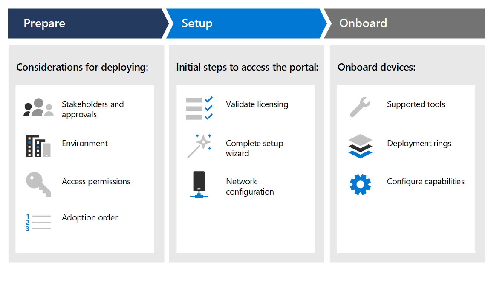

# BereitstellungsphasenDeployment phases

[!INCLUDE [Microsoft 365 Defender rebranding](../../includes/microsoft-defender.md)]

**Gilt für:****Applies to:**
- [Microsoft Defender für EndpunktMicrosoft Defender for Endpoint](https://go.microsoft.com/fwlink/p/?linkid=2154037)
- [Microsoft 365 DefenderMicrosoft 365 Defender](https://go.microsoft.com/fwlink/?linkid=2118804)

>Möchten Sie Defender for Endpoint erleben?Want to experience Defender for Endpoint? [Registrieren Sie sich für eine kostenlose Testversion.Sign up for a free trial.](https://www.microsoft.com/microsoft-365/windows/microsoft-defender-atp?ocid=docs-wdatp-assignaccess-abovefoldlink)

Erfahren Sie, wie Sie Microsoft Defender for Endpoint bereitstellen, damit Ihr Unternehmen den vorbeugenden Schutz, die Erkennung nach der Verletzung, die automatisierte Untersuchung und die Reaktion nutzen kann.Learn how to deploy Microsoft Defender for Endpoint so that your enterprise can take advantage of preventative protection, post-breach detection, automated investigation, and response. 

Dieses Handbuch unterstützt Sie bei der Vorbereitung Ihrer Umgebung und der anschließenden methodischen Integration von Geräten von der Evaluierung zu einem aussagekräftigen Pilotprojekt zur vollständigen Bereitstellung.This guide helps you work across stakeholders to prepare your environment and then onboard devices in a methodical way, moving from evaluation, to a meaningful pilot, to full deployment.

Jeder Abschnitt entspricht einem separaten Artikel in dieser Lösung.Each section corresponds to a separate article in this solution.

|PhasePhase | BeschreibungDescription | 
|:-------|:-----|
| [Phase 1: VorbereitenPhase 1: Prepare](prepare-deployment.md)| Erfahren Sie, was Sie bei der Bereitstellung von Defender for Endpoint berücksichtigen müssen, z. B. Genehmigungen von Beteiligten, Umgebungsüberlegungen, Zugriffsberechtigungen und Einführungsreihenfolge von Funktionen.Learn about what you need to consider when deploying Defender for Endpoint such as stakeholder approvals, environment considerations, access permissions, and adoption order of capabilities. 
| [Phase 2: SetupPhase 2: Setup](production-deployment.md)|  Erhalten Sie Anleitungen zu den ersten Schritten, die Sie ausführen müssen, damit Sie auf das Portal zugreifen können, z. B. das Überprüfen der Lizenzierung, das Abschließen des Setup-Assistenten und die Netzwerkkonfiguration.Get guidance on the initial steps you need to take so that you can access the portal such as validating licensing, completing the setup wizard, and network configuration. 
| [Phase 3: OnboardingPhase 3: Onboard](onboarding.md) | Erfahren Sie, wie Sie Bereitstellungsringe, unterstützte Onboardingtools basierend auf dem Endpunkttyp und das Konfigurieren der verfügbaren Funktionen verwenden.Learn how to make use of deployment rings, supported onboarding tools based on the type of endpoint, and configuring available capabilities. 

Nachdem Sie dieses Handbuch abgeschlossen haben, werden Sie mit den richtigen Zugriffsberechtigungen eingerichtet, Ihre Endpunkte werden onboardiert und Sensordaten für den Dienst melden, und Funktionen wie Schutz der nächsten Generation und Reduzierung der Angriffsfläche sind verfügbar.After you've completed this guide, you'll be setup with the right access permissions, your endpoints will be onboarded and reporting sensor data to the service, and capabilities such as next-generation protection and attack surface reduction will be in place.

Unabhängig von der Umgebungsarchitektur und der Bereitstellungsmethode, die Sie im [Leitfaden](deployment-strategy.md) Planen der Bereitstellung beschrieben haben, wird dieses Handbuch Sie beim Onboarding von Endpunkten unterstützen.Regardless of the environment architecture and method of deployment you choose outlined in the [Plan deployment](deployment-strategy.md) guidance, this guide is going to support you in onboarding endpoints. 

## Wichtige FunktionenKey capabilities

Obwohl Microsoft Defender for Endpoint viele Funktionen bietet, besteht der Hauptzweck dieses Bereitstellungshandbuchs in der Einführung in das Onboarding von Geräten.While Microsoft Defender for Endpoint provides many capabilities, the primary purpose of this deployment guide is to get you started by onboarding devices. Zusätzlich zum Onboarding werden Sie in diesem Leitfaden mit den folgenden Funktionen gestartet.In addition to onboarding, this guidance gets you started with the following capabilities.

FunktionCapability | BeschreibungDescription 
:---|:---
Erkennung und Reaktion am EndpunktEndpoint detection and response | Funktionen zur Erkennung und Reaktion von Endpunkten werden zum Erkennen, Untersuchen und Reagieren auf Angriffsversuche und aktive Sicherheitsverletzungen verwendet.Endpoint detection and response capabilities are put in place to detect, investigate, and respond to intrusion attempts and active breaches.
Schutzlösungen der nächsten GenerationNext-generation protection | Zur weiteren Verstärkung des Sicherheitsperimeters Ihres Netzwerks verwendet Microsoft Defender for Endpoint den Schutz der nächsten Generation, der alle Arten neuer Bedrohungen abfangen soll.To further reinforce the security perimeter of your network, Microsoft Defender for Endpoint uses next-generation protection designed to catch all types of emerging threats.
Verringerung der AngriffsflächeAttack surface reduction |  Stellen Sie die erste Verteidigungslinie im Stapel zur Verfügung.Provide the first line of defense in the stack. Indem sie sicherstellen, dass Konfigurationseinstellungen ordnungsgemäß festgelegt sind und Techniken zur Exploitminderung angewendet werden, wehren sich diese Funktionen gegen Angriffe und Nutzung.By ensuring configuration settings are properly set and exploit mitigation techniques are applied, these set of capabilities resist attacks and exploitation.

Alle diese Funktionen sind für Microsoft Defender for Endpoint-Lizenzinhaber verfügbar.All these capabilities are available for Microsoft Defender for Endpoint license holders. Weitere Informationen finden Sie unter [Lizenzierungsanforderungen](minimum-requirements.md#licensing-requirements).For more information, see [Licensing requirements](minimum-requirements.md#licensing-requirements).

## BereichScope

### Im BereichIn scope

-   Verwenden von Microsoft Endpoint Manager und Microsoft Endpoint Manager, um Endpunkte in den Dienst zu integrieren und Funktionen zu konfigurierenUse of Microsoft Endpoint Manager and Microsoft Endpoint Manager to onboard endpoints into the service and configure capabilities

-   Aktivieren von Defender for Endpoint EDR (EDR)Enabling Defender for Endpoint endpoint detection and response (EDR)  capabilities

-   Aktivieren von Funktionen der Defender for Endpoint Endpoint Protection Platform (EPP)Enabling Defender for Endpoint endpoint protection platform (EPP) capabilities

    -   Schutzlösungen der nächsten GenerationNext-generation protection

    -   Verringerung der AngriffsflächeAttack surface reduction

### Nicht inbegriffenOut of scope

Die folgenden Informationen sind nicht in diesem Bereitstellungshandbuch beschrieben:The following are out of scope of this deployment guide:

-   Konfiguration von Drittanbieterlösungen, die in Defender for Endpoint integriert werden könnenConfiguration of third-party solutions that might integrate with Defender for Endpoint

-   Penetrationstests in der ProduktionsumgebungPenetration testing in production environment

## Siehe auchSee also
- [Phase 1: VorbereitenPhase 1: Prepare](prepare-deployment.md)
- [Phase 2: EinrichtenPhase 2: Set up](production-deployment.md)
- [Phase 3: OnboardingPhase 3: Onboard](onboarding.md)
- [Planen der BereitstellungPlan deployment](deployment-strategy.md)