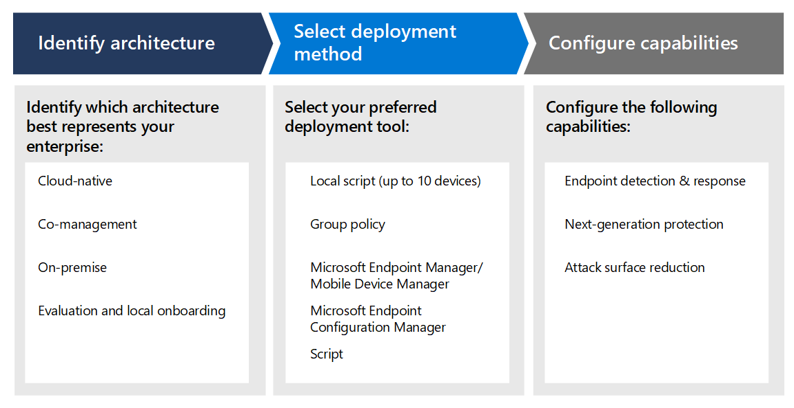

# Planen der Bereitstellung von Microsoft Defender for Endpoint 

[!INCLUDE [Microsoft 365 Defender rebranding](../../includes/microsoft-defender.md)]

**Gilt für:**
- [Microsoft Defender für Endpunkt](https://go.microsoft.com/fwlink/p/?linkid=2154037)
- [Microsoft 365 Defender](https://go.microsoft.com/fwlink/?linkid=2118804)

>Möchten Sie Defender for Endpoint erleben? [Registrieren Sie sich für eine kostenlose Testversion.](https://www.microsoft.com/microsoft-365/windows/microsoft-defender-atp?ocid=docs-wdatp-secopsdashboard-abovefoldlink) 

Planen Sie Ihre Microsoft Defender for Endpoint-Bereitstellung, damit Sie die Sicherheitsfunktionen innerhalb der Suite maximieren und Ihr Unternehmen besser vor Cyberbedrohungen schützen können.

Diese Lösung enthält Anleitungen zum Identifizieren Ihrer Umgebungsarchitektur, zum Auswählen der Art des Bereitstellungstools, das Ihren Anforderungen am besten entspricht, und Anleitungen zum Konfigurieren von Funktionen.

## Schritt 1: Identifizieren der Architektur
Wir wissen, dass jede Unternehmensumgebung einzigartig ist, daher haben wir verschiedene Optionen bereitgestellt, um Ihnen die Flexibilität bei der Auswahl der Bereitstellung des Diensts zu ermöglichen.

Je nach Ihrer Umgebung eignen sich einige Tools für bestimmte Architekturen besser. 

Verwenden Sie das folgende Material, um die geeignete Defender for Endpoint-Architektur auszuwählen, die am besten in Ihrer Organisation verwendet wird.

| Element | Beschreibung |
|:-----|:-----|
|  [PDF](https://github.com/MicrosoftDocs/microsoft-365-docs/raw/public/microsoft-365/security/defender-endpoint/downloads/mdatp-deployment-strategy.pdf)  \| [Visio](https://github.com/MicrosoftDocs/microsoft-365-docs/raw/public/microsoft-365/security/defender-endpoint/downloads/mdatp-deployment-strategy.vsdx) | Das Architekturmaterial hilft Ihnen bei der Planung der Bereitstellung für die folgenden Architekturen: <ul><li> Cloudspezifisch </li><li> Co-Management </li><li> Lokal</li><li>Auswertung und lokales Onboarding</li>

## Schritt 2: Bereitstellungsmethode auswählen
Defender for Endpoint unterstützt eine Vielzahl von Endpunkten, die Sie in den Dienst integrieren können. 

In der folgenden Tabelle sind die unterstützten Endpunkte und das entsprechende Bereitstellungstool aufgeführt, das Sie verwenden können, damit Sie die Bereitstellung entsprechend planen können.

| Endpunkt     | Bereitstellungstool                       |
|--------------|------------------------------------------|
| **Windows**  |  [Lokales Skript (bis zu 10 Geräte)](configure-endpoints-script.md)    [Gruppenrichtlinie](configure-endpoints-gp.md)    [Microsoft Endpoint Manager/ Mobile Device Manager](configure-endpoints-mdm.md)     [Microsoft Endpoint Configuration Manager](configure-endpoints-sccm.md)   [VDI-Skripts](configure-endpoints-vdi.md)   |
| **macOS**    | [Lokales Skript](mac-install-manually.md)   [Microsoft Endpoint Manager](mac-install-with-intune.md)   [JAMF Pro](mac-install-with-jamf.md)   [Verwaltung mobiler Geräte - Mobile Device Management](mac-install-with-other-mdm.md) |
| **Linux Server** | [Lokales Skript](linux-install-manually.md)   [100](linux-install-with-puppet.md)   [Ansible](linux-install-with-ansible.md)|
| **iOS**      | [App-basiert](ios-install.md)                                |
| **Android**  | [Microsoft Endpoint Manager](android-intune.md)               | 

## Schritt 3: Konfigurieren von Funktionen
Konfigurieren Sie nach dem Onboarding von Endpunkten die Sicherheitsfunktionen in Defender for Endpoint, damit Sie den robusten Sicherheitsschutz maximieren können, der in der Suite verfügbar ist. Zu den Funktionen gehören:

- Erkennung und Reaktion am Endpunkt
- Schutz der nächsten Generation
- Angriffsfläche verringern

  
## Verwandte Themen
- [Bereitstellungsphasen](deployment-phases.md)
