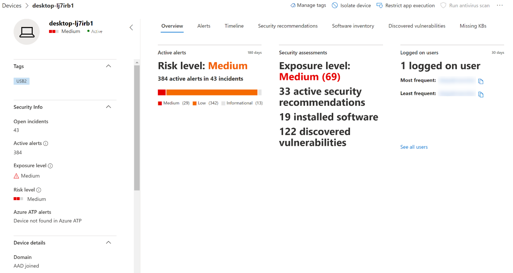

# Schützen der Daten Ihrer Organisation mit Gerätesteuerung

**Gilt für:** [Microsoft Defender for Endpoint](https://go.microsoft.com/fwlink/p/?linkid=2069559)

Die Gerätesteuerung von Microsoft Defender for Endpoint schützt vor Datenverlust durch Überwachen und Steuern der Mediennutzung durch Geräte in Ihrer Organisation, z. B. die Verwendung von Wechselmedien und USB-Laufwerken.

Mit dem Gerätesteuerungsbericht können Sie Ereignisse anzeigen, die sich auf die Mediennutzung beziehen, z. B.:

- **Überwachungsereignisse:** Zeigt die Anzahl der Überwachungsereignisse an, die auftreten, wenn externe Medien verbunden sind.
- **Richtlinienereignisse:** Zeigt die Anzahl der Richtlinienereignisse an, die auftreten, wenn eine Gerätesteuerungsrichtlinie ausgelöst wird.

> [!NOTE]
> Das Überwachungsereignis zum Nachverfolgen der Mediennutzung ist standardmäßig für Geräte aktiviert, die in Microsoft Defender for Endpoint onboarded sind.

## Grundlegendes zu den Überwachungsereignissen

Zu den Überwachungsereignissen gehören:

- **USB-Laufwerkhalterung und Unmount:** Überwachung von Ereignissen, die generiert werden, wenn ein USB-Laufwerk bereitgestellt oder nicht bereitgestellt wird.
- **PnP:** Plug-and-Play-Überwachungsereignisse werden generiert, wenn wechselbarer Speicher, ein Drucker oder Bluetooth angeschlossen ist.

## Überwachen der Gerätesteuerungssicherheit

Die Gerätesteuerung in Microsoft Defender for Endpoint ermöglicht Sicherheitsadministratoren Tools, mit denen sie die Gerätesteuerungssicherheit ihrer Organisation über Berichte nachverfolgen können. Den Gerätesteuerungsbericht finden Sie im Microsoft 365 Security Center unter **Berichte > Geräteschutz**.

Die Geräteschutzkarte im Dashboard **Berichte** zeigt die Anzahl der Überwachungsereignisse an, die in den letzten 180 Tagen vom Medientyp generiert wurden.

> [!div class="mx-imgBorder"]
> 

Die **Schaltfläche Details anzeigen** zeigt auf der Seite Gerätesteuerungsbericht weitere **Mediennutzungsdaten** an.

Die Seite stellt ein Dashboard mit der aggregierten Anzahl von Ereignissen pro Typ und einer Liste von Ereignissen zur Verfügung. Administratoren können nach Zeitbereich, Medienklassenname und Geräte-ID filtern.

> [!div class="mx-imgBorder"]
> 

Wenn Sie ein Ereignis auswählen, wird ein Flyout mit weiteren Informationen angezeigt:

- **Allgemeine Details:** Datum, Aktionsmodus und die Richtlinie dieses Ereignisses.
- **Medieninformationen:** Medieninformationen umfassen Medienname, Klassenname, Klassen-GUID, Geräte-ID, Hersteller-ID, Volume, Seriennummer und Bustyp.
- **Standortdetails:** Gerätename und MDATP-Geräte-ID.

> [!div class="mx-imgBorder"]
> 

Um Echtzeitaktivitäten für diese Medien in der gesamten Organisation zu sehen, wählen Sie die Schaltfläche **Erweiterte** Suche öffnen aus. Dies umfasst eine eingebettete, vordefinierte Abfrage.

> [!div class="mx-imgBorder"]
> 

Um die Sicherheit des Geräts zu sehen, wählen Sie im **Flyout** die Schaltfläche Geräteseite öffnen aus. Mit dieser Schaltfläche wird die Geräteentitätsseite geöffnet.

> [!div class="mx-imgBorder"]
> 

## Verzögerungen bei der Berichterstellung

Der Gerätesteuerungsbericht kann eine Verzögerung von 12 Stunden von dem Zeitpunkt einer Medienverbindung bis zu dem Zeitpunkt haben, zu dem das Ereignis in der Karte oder in der Domänenliste widergespiegelt wird.
