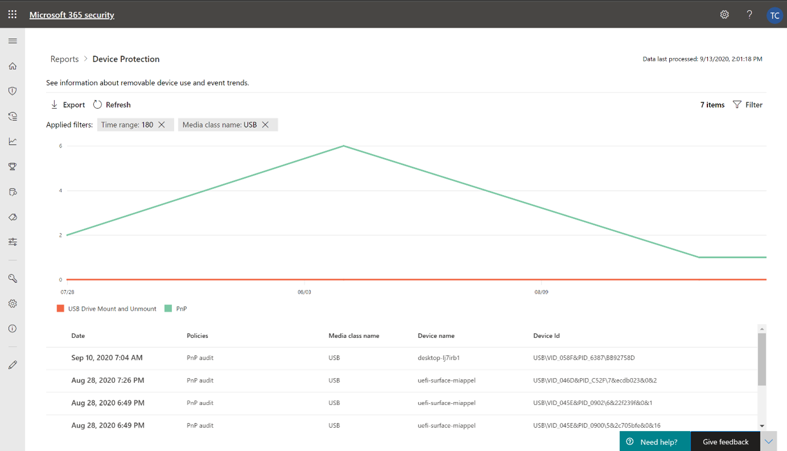

# Schützen der Daten Ihrer Organisation mit gerätesteuerungProtect your organization’s data with device control

**Gilt für:** [Microsoft Defender für Endpunkt](https://go.microsoft.com/fwlink/p/?linkid=2069559)**Applies to:** [Microsoft Defender for Endpoint](https://go.microsoft.com/fwlink/p/?linkid=2069559)

Die Gerätesteuerung von Microsoft Defender für Endpunkt schützt vor Datenverlust, indem die Mediennutzung durch Geräte in Ihrer Organisation überwacht und gesteuert wird, z. B. die Verwendung von Wechselmedien und USB-Laufwerken.Microsoft Defender for Endpoint device control protects against data loss, by monitoring and controlling media use by devices in your organization, such as the use of removable storage devices and USB drives.

Mit dem Gerätesteuerungsbericht können Sie Ereignisse anzeigen, die sich auf die Mediennutzung beziehen, z. B.:With the device control report, you can view events that relate to media usage, such as:

- **Überwachungsereignisse:** Zeigt die Anzahl der Überwachungsereignisse an, die auftreten, wenn externe Medien verbunden sind.**Audit events:** Shows the number of audit events that occur when external media is connected.
- **Richtlinienereignisse:** Zeigt die Anzahl der Richtlinienereignisse an, die auftreten, wenn eine Gerätesteuerungsrichtlinie ausgelöst wird.**Policy events:** Shows the number of policy events that occur when a device control policy is triggered.

> [!NOTE]
> Das Überwachungsereignis zum Nachverfolgen der Mediennutzung ist standardmäßig für Geräte aktiviert, die in Microsoft Defender für Endpunkt integriert sind.The audit event to track media usage is enabled by default for devices onboarded to Microsoft Defender for Endpoint.

## Grundlegendes zu den ÜberwachungsereignissenUnderstanding the audit events

Zu den Überwachungsereignissen gehören:The audit events include:

- **USB-Laufwerkshalterung und Aufheben der Bereitstellung:** Überwachungsereignisse, die generiert werden, wenn ein USB-Laufwerk bereitgestellt oder die Bereitstellung aufgehoben wird.**USB drive mount and unmount:** Audit events that are generated when a USB drive is mounted or unmounted.
- **PnP:** Plug and Play audit events are generated when removable storage, a printer, or Bluetooth media is connected.**PnP:** Plug and Play audit events are generated when removable storage, a printer, or Bluetooth media is connected.

## Überwachen der GerätesteuerungssicherheitMonitor device control security

Die Gerätesteuerung in Microsoft Defender für Endpunkt ermöglicht Sicherheitsadministratoren Tools, mit denen sie die Gerätesteuerungssicherheit ihrer Organisation über Berichte nachverfolgen können.Device control in Microsoft Defender for Endpoint empowers security administrators with tools that enable them to track their organization’s device control security through reports. Sie finden den Gerätesteuerungsbericht im Microsoft 365 Security Center, indem Sie zu **"Berichte > Geräteschutz"** wechseln.You can find the device control report in the Microsoft 365 security center by going to **Reports > Device protection**.

Die Karte "Geräteschutz" im **Dashboard "Berichte"** zeigt die Anzahl von Überwachungsereignissen an, die vom Medientyp in den letzten 180 Tagen generiert wurden.The Device protection card on the **Reports** dashboard shows the number of audit events generated by media type, over the last 180 days.

> [!div class="mx-imgBorder"]
> 

Die Schaltfläche **"Details anzeigen"** zeigt weitere Mediennutzungsdaten auf der Berichtsseite des **Gerätesteuerelements** an.The **View details** button shows more media usage data in the **device control report** page.

Die Seite bietet ein Dashboard mit der aggregierten Anzahl von Ereignissen pro Typ und einer Liste von Ereignissen.The page provides a dashboard with aggregated number of events per type and a list of events. Administratoren können nach Zeitbereich, Medienklassenname und Geräte-ID filtern.Administrators can filter on time range, media class name, and device ID.

> [!div class="mx-imgBorder"]
> 

Wenn Sie ein Ereignis auswählen, wird ein Flyout mit weiteren Informationen angezeigt:When you select an event, a flyout appears that shows you more information:

- **Allgemeine Details:** Datum, Aktionsmodus und die Richtlinie dieses Ereignisses.**General details:** Date, Action mode, and the policy of this event.
- **Medieninformationen:** Medieninformationen umfassen Medienname, Klassenname, Klassen-GUID, Geräte-ID, Anbieter-ID, Volume, Seriennummer und Bustyp.**Media information:** Media information includes Media name, Class name, Class GUID, Device ID, Vendor ID, Volume, Serial number, and Bus type.
- **Standortdetails:** Gerätename und MDATP Geräte-ID.**Location details:** Device name and MDATP device ID.

> [!div class="mx-imgBorder"]
> 

Um Echtzeitaktivitäten für diese Medien in der gesamten Organisation anzuzeigen, wählen Sie die Schaltfläche **"Erweiterte Suche öffnen"** aus.To see real-time activity for this media across the organization, select the **Open Advanced hunting** button. Dazu gehört eine eingebettete, vordefinierte Abfrage.This includes an embedded, pre-defined query.

> [!div class="mx-imgBorder"]
> 

Um die Sicherheit des Geräts anzuzeigen, wählen Sie die Schaltfläche **"Geräteseite öffnen"** im Flyout aus.To see the security of the device, select the **Open device page** button on the flyout. Mit dieser Schaltfläche wird die Geräteentitätsseite geöffnet.This button opens the device entity page.

> [!div class="mx-imgBorder"]
> 

## Melden von VerzögerungenReporting delays

Der Gerätesteuerungsbericht kann eine 12-Stunden-Verzögerung von dem Zeitpunkt, zu dem eine Medienverbindung auftritt, bis zu dem Zeitpunkt haben, an dem das Ereignis auf der Karte oder in der Domänenliste wiedergegeben wird.The device control report can have a 12-hour delay from the time a media connection occurs to the time the event is reflected in the card or in the domain list.
