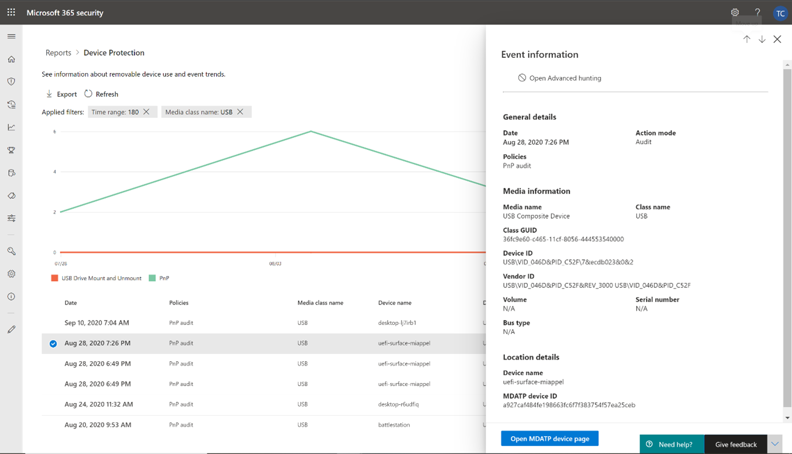

# Schützen der Daten Ihrer Organisation mit GerätesteuerungProtect your organization’s data with device control

**Gilt für:** [Microsoft Defender for Endpoint](https://go.microsoft.com/fwlink/p/?linkid=2069559)**Applies to:** [Microsoft Defender for Endpoint](https://go.microsoft.com/fwlink/p/?linkid=2069559)

Die Gerätesteuerung von Microsoft Defender for Endpoint schützt vor Datenverlust durch Überwachen und Steuern der Mediennutzung durch Geräte in Ihrer Organisation, z. B. die Verwendung von Wechselmedien und USB-Laufwerken.Microsoft Defender for Endpoint device control protects against data loss, by monitoring and controlling media use by devices in your organization, such as the use of removable storage devices and USB drives.

Mit dem Gerätesteuerungsbericht können Sie Ereignisse anzeigen, die sich auf die Mediennutzung beziehen, z. B.:With the device control report, you can view events that relate to media usage, such as:

- **Überwachungsereignisse:** Zeigt die Anzahl der Überwachungsereignisse an, die auftreten, wenn externe Medien verbunden sind.**Audit events:** Shows the number of audit events that occur when external media is connected.
- **Richtlinienereignisse:** Zeigt die Anzahl der Richtlinienereignisse an, die auftreten, wenn eine Gerätesteuerungsrichtlinie ausgelöst wird.**Policy events:** Shows the number of policy events that occur when a device control policy is triggered.

> [!NOTE]
> Das Überwachungsereignis zum Nachverfolgen der Mediennutzung ist standardmäßig für Geräte aktiviert, die in Microsoft Defender for Endpoint onboarded sind.The audit event to track media usage is enabled by default for devices onboarded to Microsoft Defender for Endpoint.

## Grundlegendes zu den ÜberwachungsereignissenUnderstanding the audit events

Zu den Überwachungsereignissen gehören:The audit events include:

- **USB-Laufwerkhalterung und Unmount:** Überwachung von Ereignissen, die generiert werden, wenn ein USB-Laufwerk bereitgestellt oder nicht bereitgestellt wird.**USB drive mount and unmount:** Audit events that are generated when a USB drive is mounted or unmounted.
- **PnP:** Plug-and-Play-Überwachungsereignisse werden generiert, wenn wechselbarer Speicher, ein Drucker oder Bluetooth angeschlossen ist.**PnP:** Plug and Play audit events are generated when removable storage, a printer, or Bluetooth media is connected.

## Überwachen der GerätesteuerungssicherheitMonitor device control security

Die Gerätesteuerung in Microsoft Defender for Endpoint ermöglicht Sicherheitsadministratoren Tools, mit denen sie die Gerätesteuerungssicherheit ihrer Organisation über Berichte nachverfolgen können.Device control in Microsoft Defender for Endpoint empowers security administrators with tools that enable them to track their organization’s device control security through reports. Den Gerätesteuerungsbericht finden Sie im Microsoft 365 Security Center unter **Berichte > Geräteschutz**.You can find the device control report in the Microsoft 365 security center by going to **Reports > Device protection**.

Die Geräteschutzkarte im Dashboard **Berichte** zeigt die Anzahl der Überwachungsereignisse an, die in den letzten 180 Tagen vom Medientyp generiert wurden.The Device protection card on the **Reports** dashboard shows the number of audit events generated by media type, over the last 180 days.

> [!div class="mx-imgBorder"]
> 

Die **Schaltfläche Details anzeigen** zeigt auf der Seite Gerätesteuerungsbericht weitere **Mediennutzungsdaten** an.The **View details** button shows more media usage data in the **device control report** page.

Die Seite stellt ein Dashboard mit der aggregierten Anzahl von Ereignissen pro Typ und einer Liste von Ereignissen zur Verfügung.The page provides a dashboard with aggregated number of events per type and a list of events. Administratoren können nach Zeitbereich, Medienklassenname und Geräte-ID filtern.Administrators can filter on time range, media class name, and device ID.

> [!div class="mx-imgBorder"]
> 

Wenn Sie ein Ereignis auswählen, wird ein Flyout mit weiteren Informationen angezeigt:When you select an event, a flyout appears that shows you more information:

- **Allgemeine Details:** Datum, Aktionsmodus und die Richtlinie dieses Ereignisses.**General details:** Date, Action mode, and the policy of this event.
- **Medieninformationen:** Medieninformationen umfassen Medienname, Klassenname, Klassen-GUID, Geräte-ID, Hersteller-ID, Volume, Seriennummer und Bustyp.**Media information:** Media information includes Media name, Class name, Class GUID, Device ID, Vendor ID, Volume, Serial number, and Bus type.
- **Standortdetails:** Gerätename und MDATP-Geräte-ID.**Location details:** Device name and MDATP device ID.

> [!div class="mx-imgBorder"]
> 

Um Echtzeitaktivitäten für diese Medien in der gesamten Organisation zu sehen, wählen Sie die Schaltfläche **Erweiterte** Suche öffnen aus.To see real-time activity for this media across the organization, select the **Open Advanced hunting** button. Dies umfasst eine eingebettete, vordefinierte Abfrage.This includes an embedded, pre-defined query.

> [!div class="mx-imgBorder"]
> 

Um die Sicherheit des Geräts zu sehen, wählen Sie im **Flyout** die Schaltfläche Geräteseite öffnen aus.To see the security of the device, select the **Open device page** button on the flyout. Mit dieser Schaltfläche wird die Geräteentitätsseite geöffnet.This button opens the device entity page.

> [!div class="mx-imgBorder"]
> 

## Verzögerungen bei der BerichterstellungReporting delays

Der Gerätesteuerungsbericht kann eine Verzögerung von 12 Stunden von dem Zeitpunkt einer Medienverbindung bis zu dem Zeitpunkt haben, zu dem das Ereignis in der Karte oder in der Domänenliste widergespiegelt wird.The device control report can have a 12-hour delay from the time a media connection occurs to the time the event is reflected in the card or in the domain list.
