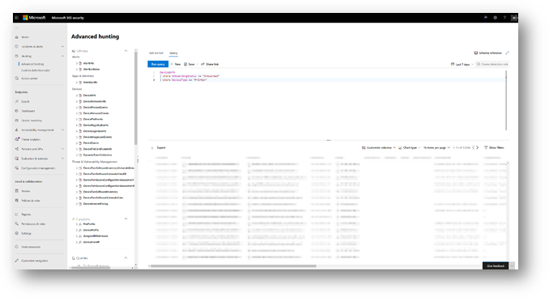

# <a name="device-discovery-overview"></a><span data-ttu-id="ede27-104">Übersicht über die Geräteerkennung</span><span class="sxs-lookup"><span data-stu-id="ede27-104">Device discovery overview</span></span>

[!INCLUDE [Microsoft 365 Defender rebranding](../../includes/microsoft-defender.md)]

<span data-ttu-id="ede27-105">**Gilt für:**</span><span class="sxs-lookup"><span data-stu-id="ede27-105">**Applies to:**</span></span>
- [<span data-ttu-id="ede27-106">Microsoft Defender für Endpunkt</span><span class="sxs-lookup"><span data-stu-id="ede27-106">Microsoft Defender for Endpoint</span></span>](https://go.microsoft.com/fwlink/p/?linkid=2146631)
- [<span data-ttu-id="ede27-107">Microsoft 365 Defender</span><span class="sxs-lookup"><span data-stu-id="ede27-107">Microsoft 365 Defender</span></span>](https://go.microsoft.com/fwlink/?linkid=2118804)

[!include[Prerelease information](../../includes/prerelease.md)]

<span data-ttu-id="ede27-108">Zum Schutz Ihrer Umgebung müssen Sie eine Bestandsaufnahme der Geräte in Ihrem Netzwerk verwenden.</span><span class="sxs-lookup"><span data-stu-id="ede27-108">Protecting your environment requires taking inventory of the devices that are in your network.</span></span> <span data-ttu-id="ede27-109">Die Zuordnung von Geräten in einem Netzwerk kann jedoch häufig kostspielig, schwierig und zeitaufwändig sein.</span><span class="sxs-lookup"><span data-stu-id="ede27-109">However, mapping devices in a network can often be expensive, challenging, and time-consuming.</span></span> 

<span data-ttu-id="ede27-110">Microsoft Defender for Endpoint bietet eine Geräteerkennungsfunktion, mit der Sie nicht verwaltete Geräte finden können, die mit Ihrem Unternehmensnetzwerk verbunden sind, ohne dass zusätzliche Appliances oder aufwändige Prozessänderungen nötig sind.</span><span class="sxs-lookup"><span data-stu-id="ede27-110">Microsoft Defender for Endpoint provides a device discovery capability that helps you find unmanaged devices connected to your corporate network without the need for extra appliances or cumbersome process changes.</span></span>


<span data-ttu-id="ede27-111">Mit der Geräteerkennungsfunktion können Sie:</span><span class="sxs-lookup"><span data-stu-id="ede27-111">The device discovery capability allows you to:</span></span>

- <span data-ttu-id="ede27-112">**Ermitteln von Unternehmensendpunkten, die mit Ihrem Unternehmensnetzwerk verbunden sind**</span><span class="sxs-lookup"><span data-stu-id="ede27-112">**Discover enterprise endpoints connected to your corporate network**</span></span> <br>
<span data-ttu-id="ede27-113">Mithilfe von einfachen oder standardmäßigen Ermittlungsoptionen können Sie Arbeitsstationen, Server und mobile Endpunkte ermitteln, die noch nicht in Microsoft Defender for Endpoint integrierte sind.</span><span class="sxs-lookup"><span data-stu-id="ede27-113">Using either basic or standard discovery options, you can discover workstations, servers, and mobile endpoints that are not yet onboarded to Microsoft Defender for Endpoint.</span></span>  

- <span data-ttu-id="ede27-114">**Onboarding von ermittelten Endpunkten**</span><span class="sxs-lookup"><span data-stu-id="ede27-114">**Onboard discovered endpoints**</span></span><br>
<span data-ttu-id="ede27-115">Nicht verwaltete Endpunkte in Ihrem Netzwerk führen zu Sicherheitsrisiken und Risiken für Ihr Netzwerk.</span><span class="sxs-lookup"><span data-stu-id="ede27-115">Unmanaged endpoints in your network introduce vulnerabilities and risks to your network.</span></span> <span data-ttu-id="ede27-116">Das Onboarding in den Dienst kann die Sichtbarkeit der Dienste erhöhen.</span><span class="sxs-lookup"><span data-stu-id="ede27-116">Onboarding them to the service can increase the security visibility on them.</span></span> 

<span data-ttu-id="ede27-117">In Verbindung mit dieser Funktion wird eine neue Sicherheitsempfehlung zum Onboarding von Geräten in Microsoft Defender for Endpoint im Rahmen der vorhandenen Bedrohungs- und Sicherheitsrisikoverwaltung verfügbar sein.</span><span class="sxs-lookup"><span data-stu-id="ede27-117">In conjunction with this capability, a new security recommendation to onboard devices to Microsoft Defender for Endpoint will be available as part of the existing Threat and Vulnerability Management experience.</span></span>


## <a name="discovery-methods"></a><span data-ttu-id="ede27-118">Ermittlungsmethoden</span><span class="sxs-lookup"><span data-stu-id="ede27-118">Discovery methods</span></span>
<span data-ttu-id="ede27-119">Es gibt zwei Erkennungsmodi:</span><span class="sxs-lookup"><span data-stu-id="ede27-119">There are two modes of discovery:</span></span> 

-   <span data-ttu-id="ede27-120">Grundlegende Ermittlung</span><span class="sxs-lookup"><span data-stu-id="ede27-120">Basic discovery</span></span> 
-   <span data-ttu-id="ede27-121">Standardermittlung (empfohlen)</span><span class="sxs-lookup"><span data-stu-id="ede27-121">Standard discovery (recommended)</span></span> 


> [!IMPORTANT]
> <span data-ttu-id="ede27-122">Die Ermittlung ist auf den Basismodus festgelegt.</span><span class="sxs-lookup"><span data-stu-id="ede27-122">Discovery is set to basic mode.</span></span> <span data-ttu-id="ede27-123">Sie können diese Konfiguration über die Einstellungsseite beibehalten.</span><span class="sxs-lookup"><span data-stu-id="ede27-123">You can choose to retain this configuration through the settings page.</span></span> <span data-ttu-id="ede27-124">Die Standardermittlung ist der Standardmodus für alle Vorschaukunden ab dem 10. Mai 2021 , sofern sie nicht vor diesem Datum über die Einstellungsseite geändert wird.</span><span class="sxs-lookup"><span data-stu-id="ede27-124">Standard discovery will be the default mode for all preview customers starting May 10, 2021 - unless modified through the settings page before this date.</span></span>

### <a name="basic-discovery"></a><span data-ttu-id="ede27-125">Grundlegende Ermittlung</span><span class="sxs-lookup"><span data-stu-id="ede27-125">Basic discovery</span></span> 

<span data-ttu-id="ede27-126">In diesem Modus erfassen Endpunkte passiv Ereignisse in Ihrem Netzwerk und extrahieren Geräteinformationen aus ihnen.</span><span class="sxs-lookup"><span data-stu-id="ede27-126">In this mode, endpoints will passively collect events in your network and extract device information from them.</span></span> <span data-ttu-id="ede27-127">Die grundlegende Ermittlung verwendet die SenseNDR.exe für die passive Netzwerkdatenerfassung, und es wird kein Netzwerkdatenverkehr initiiert.</span><span class="sxs-lookup"><span data-stu-id="ede27-127">Basic discovery uses the SenseNDR.exe binary for passive network data collection and no network traffic will be initiated.</span></span> <span data-ttu-id="ede27-128">Endpunkte extrahieren einfach Daten aus jedem Netzwerkdatenverkehr, der von einem integrierten Gerät angezeigt wird.</span><span class="sxs-lookup"><span data-stu-id="ede27-128">Endpoints will simply extract data from every network traffic that is seen by an onboarded device.</span></span> 

### <a name="standard-discovery"></a><span data-ttu-id="ede27-129">Standardermittlung</span><span class="sxs-lookup"><span data-stu-id="ede27-129">Standard discovery</span></span> 

<span data-ttu-id="ede27-130">Mit diesem Modus können Endpunkte beobachtete Geräte im Netzwerk aktiv austesten, um die gesammelten Daten zu bereichern und so eine zuverlässige und zusammenhängende Geräteinventarisierung zu erstellen.</span><span class="sxs-lookup"><span data-stu-id="ede27-130">This mode allows endpoints to actively probe observed devices in the network to enrich collected data - helping you build a reliable and coherent device inventory.</span></span> <span data-ttu-id="ede27-131">Der Standardmodus verwendet intelligentes, aktives Sondieren, um noch mehr Informationen zu beobachteten Geräten zu ermitteln, um vorhandene Geräteinformationen zu bereichern.</span><span class="sxs-lookup"><span data-stu-id="ede27-131">Standard mode uses smart, active probing to discover even more information about observed devices to enrich existing device information.</span></span>  

<span data-ttu-id="ede27-132">Wenn der Standardmodus aktiviert ist, werden minimale und vernachlässigbare Netzwerkaktivitäten, die vom Ermittlungssensor generiert werden, möglicherweise von Den Netzwerküberwachungstools in Ihrer Organisation beobachtet.</span><span class="sxs-lookup"><span data-stu-id="ede27-132">When Standard mode is enabled, minimal and negligible network activity generated by the discovery sensor might be observed by network monitoring tools in your organization.</span></span>  

 <span data-ttu-id="ede27-133">Wenn Sie diesen Modus nicht aktivieren möchten, erhalten Sie nur eingeschränkte Sichtbarkeit nicht verwalteter Endpunkte in Ihrem Netzwerk.</span><span class="sxs-lookup"><span data-stu-id="ede27-133">If you choose not to enable this mode, you will only gain limited visibility of unmanaged endpoints in your network.</span></span>

<span data-ttu-id="ede27-134">Die Standardermittlung verwendet verschiedene PowerShell-Skripts, um Geräte im Netzwerk aktiv zu testen.</span><span class="sxs-lookup"><span data-stu-id="ede27-134">Standard discovery uses various PowerShell scripts to actively probe devices in the network.</span></span> <span data-ttu-id="ede27-135">Diese PowerShell-Skripts sind von Microsoft signiert und werden an folgendem Speicherort ausgeführt: `C:\ProgramData\Microsoft\Windows Defender Advanced Threat Protection\Downloads\*.ps` .</span><span class="sxs-lookup"><span data-stu-id="ede27-135">Those PowerShell scripts are Microsoft signed and are executed from the following location: `C:\ProgramData\Microsoft\Windows Defender Advanced Threat Protection\Downloads\*.ps`.</span></span> <span data-ttu-id="ede27-136">Beispiel: `C:\ProgramData\Microsoft\Windows Defender Advanced Threat Protection\Downloads\UnicastScannerV1.1.0.ps1`.</span><span class="sxs-lookup"><span data-stu-id="ede27-136">For example, `C:\ProgramData\Microsoft\Windows Defender Advanced Threat Protection\Downloads\UnicastScannerV1.1.0.ps1`.</span></span>

<span data-ttu-id="ede27-137">Sie können Ihre Discoveryeinstellungen ändern und anpassen, weitere Informationen finden Sie unter [Configure device discovery](configure-device-discovery.md).</span><span class="sxs-lookup"><span data-stu-id="ede27-137">You can change and customize your discovery settings, for more information see [Configure device discovery](configure-device-discovery.md).</span></span>

> [!NOTE]
> <span data-ttu-id="ede27-138">Das Ermittlungsmodul unterscheidet zwischen Netzwerkereignissen, die im Unternehmensnetzwerk empfangen werden, und außerhalb des Unternehmensnetzwerks.</span><span class="sxs-lookup"><span data-stu-id="ede27-138">The discovery engine distinguishes between network events that are received in the corporate network versus outside of the corporate network.</span></span> <span data-ttu-id="ede27-139">Geräte, die nicht mit Unternehmensnetzwerken verbunden sind, werden nicht ermittelt oder im Gerätebestand aufgeführt.</span><span class="sxs-lookup"><span data-stu-id="ede27-139">Devices that are not connected to corporate networks will not be discovered or listed in the device inventory.</span></span> 


## <a name="device-inventory"></a><span data-ttu-id="ede27-140">Gerätebestand</span><span class="sxs-lookup"><span data-stu-id="ede27-140">Device Inventory</span></span> 
<span data-ttu-id="ede27-141">Geräte, die entdeckt wurden, aber noch nicht von Microsoft Defender for Endpoint onboarded und gesichert wurden, werden auf der Registerkarte Endpunkte unter Geräteinventar aufgeführt. Sie können jetzt einen neuen Filter in der Geräteinventarliste namens Onboarding-Status verwenden, der einen der folgenden Werte haben kann:</span><span class="sxs-lookup"><span data-stu-id="ede27-141">Devices that have been discovered but have not yet been onboarded and secured by Microsoft Defender for Endpoint will be listed in Device Inventory within the Endpoints tab. You can now use a new filter in the device inventory list called Onboarding status which can have any of the following values:</span></span>

- <span data-ttu-id="ede27-142">Onboarded – Der Endpunkt wird in Microsoft Defender for Endpoint onboarded.</span><span class="sxs-lookup"><span data-stu-id="ede27-142">Onboarded – The endpoint is onboarded to Microsoft Defender for Endpoint.</span></span>
- <span data-ttu-id="ede27-143">Kann onboarded werden– Der Endpunkt wurde im Netzwerk erkannt, und das Betriebssystem wurde als ein Endpunkt identifiziert, der von Microsoft Defender for Endpoint unterstützt wird, aber derzeit nicht onboarded ist.</span><span class="sxs-lookup"><span data-stu-id="ede27-143">Can be onboarded – The endpoint was discovered in the network and the Operating System was identified as one that is supported by Microsoft Defender for Endpoint, but it is not currently onboarded.</span></span> <span data-ttu-id="ede27-144">Es wird dringend empfohlen, diese Geräte zu integrieren.</span><span class="sxs-lookup"><span data-stu-id="ede27-144">We highly recommend onboarding these devices.</span></span>
- <span data-ttu-id="ede27-145">Nicht unterstützt – Der Endpunkt wurde im Netzwerk ermittelt, wird jedoch nicht von Microsoft Defender for Endpoint unterstützt.</span><span class="sxs-lookup"><span data-stu-id="ede27-145">Unsupported – The endpoint was discovered in the network but is not supported by Microsoft Defender for Endpoint.</span></span>
- <span data-ttu-id="ede27-146">Unzureichende Informationen – Das System konnte die Unterstützungsfähigkeit des Geräts nicht ermitteln.</span><span class="sxs-lookup"><span data-stu-id="ede27-146">Insufficient info – The system could not determine the supportability of the device.</span></span> <span data-ttu-id="ede27-147">Das Aktivieren der Standarderkennung auf mehr Geräten im Netzwerk kann die ermittelten Attribute bereichern.</span><span class="sxs-lookup"><span data-stu-id="ede27-147">Enabling standard discovery on more devices in the network can enrich the discovered attributes.</span></span> 
 


## <a name="vulnerability-assessment-on-discovered-devices"></a><span data-ttu-id="ede27-149">Sicherheitsrisikobewertung auf erkannten Geräten</span><span class="sxs-lookup"><span data-stu-id="ede27-149">Vulnerability assessment on discovered devices</span></span>
<span data-ttu-id="ede27-150">Sicherheitsrisiken und Risiken auf Ihren Geräten sowie andere ermittelte nicht verwaltete Geräte im Netzwerk sind Teil der aktuellen TVM-Flüsse unter "Sicherheitsempfehlungen" und werden auf Entitätsseiten im Portal dargestellt.</span><span class="sxs-lookup"><span data-stu-id="ede27-150">Vulnerabilities and risks on your devices as well as other discovered unmanaged devices in the network are part of the current TVM flows under "Security Recommendations" and represented in entity pages across the portal.</span></span> <span data-ttu-id="ede27-151">Suchen Sie nach "SSH"-bezogenen Sicherheitsempfehlungen, um SSH-Sicherheitsrisiken zu finden, die für nicht verwaltete und verwaltete Geräte im Zusammenhang stehen.</span><span class="sxs-lookup"><span data-stu-id="ede27-151">Search for "SSH" related security recommendations to find SSH vulnerabilities that are related for unmanaged and managed devices.</span></span> 

  

## <a name="use-advanced-hunting-on-discovered-devices"></a><span data-ttu-id="ede27-153">Verwenden der erweiterten Suche auf erkannten Geräten</span><span class="sxs-lookup"><span data-stu-id="ede27-153">Use Advanced Hunting on discovered devices</span></span>
<span data-ttu-id="ede27-154">Sie können erweiterte Suchabfragen verwenden, um die Sichtbarkeit auf ermittelten Geräten zu verbessern.</span><span class="sxs-lookup"><span data-stu-id="ede27-154">You can use Advanced Hunting queries to gain visibility on discovered devices.</span></span>
<span data-ttu-id="ede27-155">In der Tabelle DeviceInfo finden Sie Details zu ermittelten Endpunkten oder netzwerkbezogene Informationen zu diesen Geräten in der DeviceNetworkInfo-Tabelle.</span><span class="sxs-lookup"><span data-stu-id="ede27-155">Find details about discovered Endpoints in the DeviceInfo table, or network-related information about those devices in the DeviceNetworkInfo table.</span></span>
  




<span data-ttu-id="ede27-157">Die Geräteerkennung nutzt integrierte Microsoft Defender for Endpoint-Geräte als Netzwerkdatenquelle, um Aktivitäten nicht integrierten Geräten zu entsprechen.</span><span class="sxs-lookup"><span data-stu-id="ede27-157">Device discovery leverages Microsoft Defender for Endpoint onboarded devices as a network data source to attribute activities to non-onboarded devices.</span></span> <span data-ttu-id="ede27-158">Dies bedeutet, dass aktivitäten auf dem nicht integrierten Gerät auf der Zeitachse und in der Tabelle Advanced hunting DeviceNetworkEvents angezeigt werden, wenn ein integriertes Microsoft Defender for Endpoint-Gerät mit einem nicht integrierten Gerät kommuniziert.</span><span class="sxs-lookup"><span data-stu-id="ede27-158">This means that if a Microsoft Defender for Endpoint onboarded device communicated with a non-onboarded device, activities on the non-onboarded device can be seen on the timeline and through the Advanced hunting DeviceNetworkEvents table.</span></span> 


<span data-ttu-id="ede27-159">Neue Ereignisse sind TCP(Transmission Control Protocol)-Verbindungen und passen zum aktuellen DeviceNetworkEvents-Schema.</span><span class="sxs-lookup"><span data-stu-id="ede27-159">New events are Transmission Control Protocol (TCP) connections-based and will fit to the current DeviceNetworkEvents scheme.</span></span> <span data-ttu-id="ede27-160">TCP-Ingress auf das Microsoft Defender for Endpoint-fähige Gerät von einem nicht von Microsoft Defender für Endpoint aktivierten Gerät.</span><span class="sxs-lookup"><span data-stu-id="ede27-160">TCP ingress to the Microsoft Defender for Endpoint enabled device from a non-Microsoft Defender for Endpoint enabled.</span></span>  

<span data-ttu-id="ede27-161">Außerdem wurden die folgenden Aktionstypen hinzugefügt:</span><span class="sxs-lookup"><span data-stu-id="ede27-161">The following action types have also been added:</span></span>  

- <span data-ttu-id="ede27-162">ConnectionAttempt – Versuch, eine TCP-Verbindung herzustellen (syn)</span><span class="sxs-lookup"><span data-stu-id="ede27-162">ConnectionAttempt - An attempt to establish a TCP connection (syn)</span></span>  
- <span data-ttu-id="ede27-163">ConnectionAcknowledged – Eine Bestätigung, dass eine TCP-Verbindung akzeptiert wurde (syn\ack)</span><span class="sxs-lookup"><span data-stu-id="ede27-163">ConnectionAcknowledged - An acknowledgment that a TCP connection was accepted (syn\ack)</span></span>  

<span data-ttu-id="ede27-164">Sie können diese Beispielabfrage ausprobieren:</span><span class="sxs-lookup"><span data-stu-id="ede27-164">You can try this example query:</span></span>  

```
DeviceNetworkEvents  
| where ActionType == "ConnectionAcknowledged" or ActionType == "ConnectionAttempt"  
| take 10  
```


## <a name="changed-behaviour"></a><span data-ttu-id="ede27-165">Geändertes Verhalten</span><span class="sxs-lookup"><span data-stu-id="ede27-165">Changed behaviour</span></span>
<span data-ttu-id="ede27-166">Im folgenden Abschnitt werden die Änderungen aufgeführt, die Sie in Microsoft Defender for Endpoint und/oder Microsoft 365 Security Center beobachten werden, wenn diese Funktion aktiviert ist.</span><span class="sxs-lookup"><span data-stu-id="ede27-166">The following section lists the changes you'll observe in Microsoft Defender for Endpoint and/or Microsoft 365 Security Center when this capability is enabled.</span></span> 
 
1.  <span data-ttu-id="ede27-167">Geräte, die nicht in Microsoft Defender to Endpoint onboarded sind, werden voraussichtlich im Geräteinventar, in der erweiterten Suche und in API-Abfragen angezeigt.</span><span class="sxs-lookup"><span data-stu-id="ede27-167">Devices that are not onboarded to Microsoft Defender to Endpoint are expected to appear in the device inventory, advanced hunting, and API queries.</span></span> <span data-ttu-id="ede27-168">Dadurch kann die Größe der Abfrageergebnisse erheblich erhöht werden.</span><span class="sxs-lookup"><span data-stu-id="ede27-168">This may significantly increase the size of query results.</span></span> 
    1. <span data-ttu-id="ede27-169">Die Tabellen "DeviceInfo" und "DeviceNetworkInfo" in Advanced Hunting enthalten nun ermitteltes Gerät.</span><span class="sxs-lookup"><span data-stu-id="ede27-169">"DeviceInfo" and "DeviceNetworkInfo" tables in Advanced Hunting will now hold discovered device.</span></span> <span data-ttu-id="ede27-170">Sie können diese Geräte mithilfe des Attributs "OnboardingStatus" herausfiltern.</span><span class="sxs-lookup"><span data-stu-id="ede27-170">You can filter out those devices by using “OnboardingStatus” attribute.</span></span>

    2. <span data-ttu-id="ede27-171">Ermittelte Geräte werden voraussichtlich in den Ergebnissen der Streaming-API-Abfrage angezeigt.</span><span class="sxs-lookup"><span data-stu-id="ede27-171">Discovered devices are expected to appear in Streaming API query results.</span></span> <span data-ttu-id="ede27-172">Sie können diese Geräte mithilfe des Filters `OnboardingStatus` in Ihrer Abfrage herausfiltern.</span><span class="sxs-lookup"><span data-stu-id="ede27-172">You can filter out those devices by using the `OnboardingStatus` filter in your query.</span></span> 

2.  <span data-ttu-id="ede27-173">Nicht verwaltete Geräte werden vorhandenen Gerätegruppen basierend auf den definierten Kriterien zugewiesen.</span><span class="sxs-lookup"><span data-stu-id="ede27-173">Unmanaged devices will be assigned to existing device groups based on the defined criteria.</span></span> 
3.  <span data-ttu-id="ede27-174">In seltenen Fällen kann die Standarderkennung Warnungen auf Netzwerkmonitoren oder Sicherheitstools auslösen.</span><span class="sxs-lookup"><span data-stu-id="ede27-174">In rare cases, Standard discovery might trigger alerts on network monitors or security tools.</span></span> <span data-ttu-id="ede27-175">Bitte geben Sie Feedback, wenn solche Ereignisse auftreten, um zu verhindern, dass sich diese Probleme wiederholen.</span><span class="sxs-lookup"><span data-stu-id="ede27-175">Please provide feedback, if you experience such events, to help prevent these issues from recurring.</span></span> <span data-ttu-id="ede27-176">Sie können explizit ausschließen, dass bestimmte Ziele oder ganze Subnetze von der Standardermittlung aktiv untersucht werden.</span><span class="sxs-lookup"><span data-stu-id="ede27-176">You can explicitly exclude specific targets or entire subnets from being actively probed by Standard discovery.</span></span> 


## <a name="next-steps"></a><span data-ttu-id="ede27-177">Nächste Schritte</span><span class="sxs-lookup"><span data-stu-id="ede27-177">Next steps</span></span>
- [<span data-ttu-id="ede27-178">Konfigurieren der Geräteermittlung</span><span class="sxs-lookup"><span data-stu-id="ede27-178">Configure device discovery</span></span>](configure-device-discovery.md)
- [<span data-ttu-id="ede27-179">Häufig gestellte Fragen zur Geräteerkennung</span><span class="sxs-lookup"><span data-stu-id="ede27-179">Device discovery FAQs</span></span>](device-discovery-faq.md)
