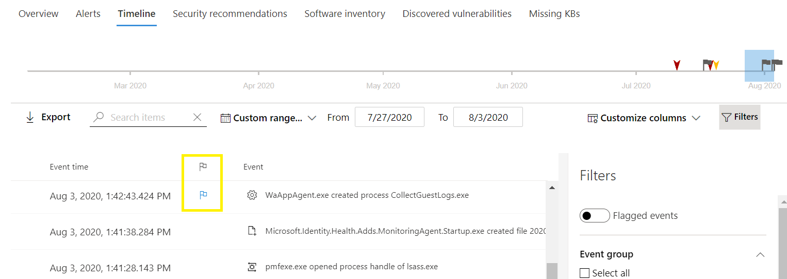

# Microsoft Defender for Endpoint-GerätezeitachsenereigniskennzeichenMicrosoft Defender for Endpoint device timeline event flags

[!INCLUDE [Microsoft 365 Defender rebranding](../../includes/microsoft-defender.md)]

**Gilt für:****Applies to:**
- [Microsoft Defender für EndpunktMicrosoft Defender for Endpoint](https://go.microsoft.com/fwlink/p/?linkid=2154037)
- [Microsoft 365 DefenderMicrosoft 365 Defender](https://go.microsoft.com/fwlink/?linkid=2118804)

>Möchten Sie Defender for Endpoint erleben?Want to experience Defender for Endpoint? [Registrieren Sie sich für eine kostenlose Testversion.Sign up for a free trial.](https://www.microsoft.com/microsoft-365/windows/microsoft-defender-atp?ocid=docs-wdatp-assignaccess-abovefoldlink)

Ereigniskennzeichen in der Zeitachse des Defender for Endpoint-Geräts helfen Ihnen beim Filtern und Organisieren bestimmter Ereignisse, wenn Sie potenzielle Angriffe untersuchen.Event flags in the Defender for Endpoint device timeline help you filter and organize specific events when you're  investigate potential attacks.

Die Zeitachse des Defender for Endpoint-Geräts bietet eine chronologische Ansicht der Ereignisse und zugehörigen Warnungen, die auf einem Gerät beobachtet werden.The Defender for Endpoint device timeline provides a chronological view of the events and associated alerts observed on a device. Diese Liste der Ereignisse bietet vollständige Sichtbarkeit aller Ereignisse, Dateien und IP-Adressen, die auf dem Gerät beobachtet werden.This list of events provides full visibility into any events, files, and IP addresses observed on the device. Die Liste kann manchmal langwierig sein.The list can sometimes be lengthy. Gerätezeitachsenereigniskennzeichen helfen Ihnen beim Nachverfolgen von Ereignissen, die miteinander in Zusammenhang stehen könnten.Device timeline event flags help you track events that could be related. 

Nachdem Sie eine Gerätezeitachse durchgegangen sind, können Sie die bestimmten Ereignisse, die Sie gekennzeichnet haben, sortieren, filtern und exportieren.After you've gone through a device timeline, you can sort, filter, and export the specific events that you flagged.

Während der Navigation auf der Gerätezeitachse können Sie nach bestimmten Ereignissen suchen und filtern.While navigating the device timeline, you can search and filter for specific events. Sie können Ereigniskennzeichen festlegen, indem Sie:You can set event flags by: 

- Hervorheben der wichtigsten EreignisseHighlighting the most important events 
- Markieren von Ereignissen, die einen tiefen Eintauchen erfordernMarking events that requires deep dive 
- Erstellen einer zeitplansreinen VerletzungBuilding a clean breach timeline

## Kennzeichnen eines EreignissesFlag an event
1. Suchen des Ereignisses, das Sie kennzeichnen möchtenFind the event that you want to flag
2. Klicken Sie in der Spalte Flag auf das Kennzeichensymbol.Click the flag icon in the Flag column. 

## Anzeigen gekennzeichneter EreignisseView flagged events  
1. Aktivieren Sie im Abschnitt **Zeitachsenfilter** **die Option Gekennzeichnete Ereignisse**.In the timeline **Filters** section, enable **Flagged events**.
2. Klicken Sie auf **Anwenden**.Click **Apply**. Es werden nur gekennzeichnete Ereignisse angezeigt.Only flagged events are displayed.
Sie können zusätzliche Filter anwenden, indem Sie auf die Zeitleiste klicken.You can apply additional filters by clicking on the time bar. Dadurch werden nur Ereignisse vor dem gekennzeichneten Ereignis angezeigt.This will only show events prior to the flagged event.  

