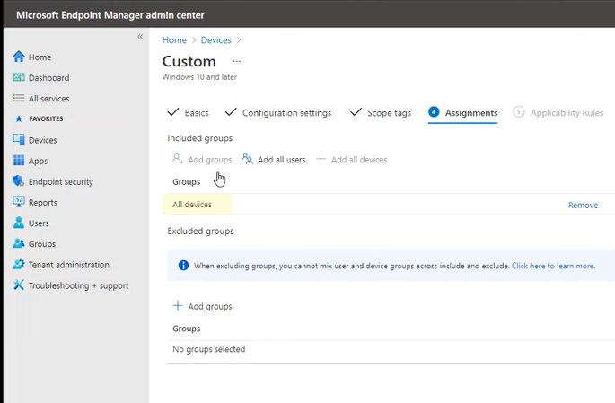

# <a name="enable-attack-surface-reduction-rules"></a><span data-ttu-id="23e3e-104">Aktivieren der Regeln zur Verringerung der Angriffsfläche</span><span class="sxs-lookup"><span data-stu-id="23e3e-104">Enable attack surface reduction rules</span></span>

[!INCLUDE [Microsoft 365 Defender rebranding](../../includes/microsoft-defender.md)]

<span data-ttu-id="23e3e-105">**Gilt für:**</span><span class="sxs-lookup"><span data-stu-id="23e3e-105">**Applies to:**</span></span>

- [<span data-ttu-id="23e3e-106">Microsoft Defender für Endpunkt</span><span class="sxs-lookup"><span data-stu-id="23e3e-106">Microsoft Defender for Endpoint</span></span>](https://go.microsoft.com/fwlink/p/?linkid=2154037)
- [<span data-ttu-id="23e3e-107">Microsoft 365 Defender</span><span class="sxs-lookup"><span data-stu-id="23e3e-107">Microsoft 365 Defender</span></span>](https://go.microsoft.com/fwlink/?linkid=2118804)

> [!TIP]
> <span data-ttu-id="23e3e-108">Möchten Sie Defender for Endpoint erleben?</span><span class="sxs-lookup"><span data-stu-id="23e3e-108">Want to experience Defender for Endpoint?</span></span> [<span data-ttu-id="23e3e-109">Registrieren Sie sich für eine kostenlose Testversion.</span><span class="sxs-lookup"><span data-stu-id="23e3e-109">Sign up for a free trial.</span></span>](https://www.microsoft.com/microsoft-365/windows/microsoft-defender-atp?ocid=docs-wdatp-assignaccess-abovefoldlink)

<span data-ttu-id="23e3e-110">[Attack Surface Reduction Rules](attack-surface-reduction.md) (ASR-Regeln) helfen, Aktionen zu verhindern, die von Schadsoftware häufig missbraucht werden, um Geräte und Netzwerke zu gefährdeten.</span><span class="sxs-lookup"><span data-stu-id="23e3e-110">[Attack surface reduction rules](attack-surface-reduction.md) (ASR rules) help prevent actions that malware often abuses to compromise devices and networks.</span></span>

<span data-ttu-id="23e3e-111">**Anforderungen** Sie können Regeln zur Reduzierung der Angriffsfläche für Geräte festlegen, auf der eine der folgenden Editionen und Versionen von Windows:</span><span class="sxs-lookup"><span data-stu-id="23e3e-111">**Requirements** You can set attack surface reduction rules for devices that are running any of the following editions and versions of Windows:</span></span>

- <span data-ttu-id="23e3e-112">Windows 10 Pro, Version [1709](/windows/whats-new/whats-new-windows-10-version-1709) oder höher</span><span class="sxs-lookup"><span data-stu-id="23e3e-112">Windows 10 Pro, [version 1709](/windows/whats-new/whats-new-windows-10-version-1709) or later</span></span>
- <span data-ttu-id="23e3e-113">Windows 10 Enterprise, Version [1709](/windows/whats-new/whats-new-windows-10-version-1709) oder höher</span><span class="sxs-lookup"><span data-stu-id="23e3e-113">Windows 10 Enterprise, [version 1709](/windows/whats-new/whats-new-windows-10-version-1709) or later</span></span>
- <span data-ttu-id="23e3e-114">Windows Server, [Version 1803 (Halbjährskanal)](/windows-server/get-started/whats-new-in-windows-server-1803) oder höher</span><span class="sxs-lookup"><span data-stu-id="23e3e-114">Windows Server, [version 1803 (Semi-Annual Channel)](/windows-server/get-started/whats-new-in-windows-server-1803) or later</span></span>
- [<span data-ttu-id="23e3e-115">Windows Server 2019</span><span class="sxs-lookup"><span data-stu-id="23e3e-115">Windows Server 2019</span></span>](/windows-server/get-started-19/whats-new-19)

<span data-ttu-id="23e3e-116">Obwohl Regeln zur Reduzierung der Angriffsfläche keine Windows [E5-Lizenz](/windows/deployment/deploy-enterprise-licenses)erfordern, erhalten Sie bei Windows E5 erweiterte Verwaltungsfunktionen.</span><span class="sxs-lookup"><span data-stu-id="23e3e-116">Although attack surface reduction rules don't require a [Windows E5 license](/windows/deployment/deploy-enterprise-licenses), if you have Windows E5, you get advanced management capabilities.</span></span> <span data-ttu-id="23e3e-117">Diese Funktionen, die nur in Windows E5 verfügbar sind, umfassen Überwachung, Analysen und Workflows, die in [Defender for Endpoint](/microsoft-365/security/defender-endpoint/microsoft-defender-endpoint?view=o365-worldwide&preserve-view=true)verfügbar sind, sowie Berichterstellungs- und Konfigurationsfunktionen im Microsoft 365 Security [Center](/microsoft-365/security/defender/overview-security-center?view=o365-worldwide&preserve-view=true).</span><span class="sxs-lookup"><span data-stu-id="23e3e-117">These capabilities available only in Windows E5 include monitoring, analytics, and workflows available in [Defender for Endpoint](/microsoft-365/security/defender-endpoint/microsoft-defender-endpoint?view=o365-worldwide&preserve-view=true), as well as reporting and configuration capabilities in the [Microsoft 365 security center](/microsoft-365/security/defender/overview-security-center?view=o365-worldwide&preserve-view=true).</span></span> <span data-ttu-id="23e3e-118">Diese erweiterten Funktionen sind nicht mit einer Windows Professional oder Windows E3-Lizenz verfügbar. Wenn Sie jedoch über diese Lizenzen verfügen, können Sie die Ereignisanzeige verwenden und Microsoft Defender Antivirus protokollieren, um Die Regelereignisse der Angriffsfläche zu überprüfen.</span><span class="sxs-lookup"><span data-stu-id="23e3e-118">These advanced capabilities aren't available with a Windows Professional or Windows E3 license; however, if you do have those licenses, you can use Event Viewer and Microsoft Defender Antivirus logs to review your attack surface reduction rule events.</span></span>

<span data-ttu-id="23e3e-119">Jede ASR-Regel enthält eine von vier Einstellungen:</span><span class="sxs-lookup"><span data-stu-id="23e3e-119">Each ASR rule contains one of four settings:</span></span>

- <span data-ttu-id="23e3e-120">**Nicht konfiguriert:** Deaktivieren der ASR-Regel</span><span class="sxs-lookup"><span data-stu-id="23e3e-120">**Not configured**: Disable the ASR rule</span></span>
- <span data-ttu-id="23e3e-121">**Block**: Aktivieren der ASR-Regel</span><span class="sxs-lookup"><span data-stu-id="23e3e-121">**Block**: Enable the ASR rule</span></span>
- <span data-ttu-id="23e3e-122">**Überwachung**: Bewerten, wie sich die ASR-Regel auf Ihre Organisation auswirken würde, wenn sie aktiviert wäre</span><span class="sxs-lookup"><span data-stu-id="23e3e-122">**Audit**: Evaluate how the ASR rule would impact your organization if enabled</span></span>
- <span data-ttu-id="23e3e-123">**Warn**: Aktivieren Sie die ASR-Regel, lassen Sie den Endbenutzer jedoch das Umgehen des Blocks zu.</span><span class="sxs-lookup"><span data-stu-id="23e3e-123">**Warn**: Enable the ASR rule but allow the end user to bypass the block</span></span>

> [!IMPORTANT]
> <span data-ttu-id="23e3e-124">Derzeit wird der Warnmodus für drei ASR-Regeln nicht unterstützt, wenn Sie asr rules in Microsoft Endpoint Manager (MEM) konfigurieren.</span><span class="sxs-lookup"><span data-stu-id="23e3e-124">Currently, warn mode is not supported for three ASR rules when you configure ASR rules in Microsoft Endpoint Manager (MEM).</span></span> <span data-ttu-id="23e3e-125">Weitere Informationen finden Sie unter [Fälle, in denen der Warnmodus nicht unterstützt wird.](attack-surface-reduction.md#cases-where-warn-mode-is-not-supported)</span><span class="sxs-lookup"><span data-stu-id="23e3e-125">To learn more, see [Cases where warn mode is not supported](attack-surface-reduction.md#cases-where-warn-mode-is-not-supported).</span></span>

<span data-ttu-id="23e3e-126">Es wird dringend empfohlen, asR-Regeln mit einer Windows E5-Lizenz (oder einer ähnlichen Lizenzierungs-SKU) zu verwenden, um die erweiterten Überwachungs- und Berichtsfunktionen zu nutzen, die in Microsoft Defender for Endpoint (Defender for [Endpoint)](https://docs.microsoft.com/windows/security/threat-protection) verfügbar sind.</span><span class="sxs-lookup"><span data-stu-id="23e3e-126">It's highly recommended you use ASR rules with a Windows E5 license (or similar licensing SKU) to take advantage of the advanced monitoring and reporting capabilities available in [Microsoft Defender for Endpoint](https://docs.microsoft.com/windows/security/threat-protection) (Defender for Endpoint).</span></span> <span data-ttu-id="23e3e-127">Für andere Lizenzen wie Windows Professional oder E3, die keinen Zugriff auf erweiterte Überwachungs- und Berichtsfunktionen haben, können Sie jedoch eigene Überwachungs- und Berichterstellungstools neben den Ereignissen entwickeln, die an jedem Endpunkt generiert werden, wenn ASR-Regeln ausgelöst werden (z. B. Ereignis forwarding).</span><span class="sxs-lookup"><span data-stu-id="23e3e-127">However, for other licenses like Windows Professional or E3 that don't have access to advanced monitoring and reporting capabilities, you can develop your own monitoring and reporting tools on top of the events that are generated at each endpoint when ASR rules are triggered (e.g., Event Forwarding).</span></span>

> [!TIP]
> <span data-ttu-id="23e3e-128">Weitere Informationen zur lizenzierung Windows finden Sie [unter Windows 10 Licensing](https://www.microsoft.com/licensing/product-licensing/windows10?activetab=windows10-pivot:primaryr5) and get the Volume Licensing guide for [Windows 10](https://download.microsoft.com/download/2/D/1/2D14FE17-66C2-4D4C-AF73-E122930B60F6/Windows-10-Volume-Licensing-Guide.pdf).</span><span class="sxs-lookup"><span data-stu-id="23e3e-128">To learn more about Windows licensing, see [Windows 10 Licensing](https://www.microsoft.com/licensing/product-licensing/windows10?activetab=windows10-pivot:primaryr5) and get the [Volume Licensing guide for Windows 10](https://download.microsoft.com/download/2/D/1/2D14FE17-66C2-4D4C-AF73-E122930B60F6/Windows-10-Volume-Licensing-Guide.pdf).</span></span>

<span data-ttu-id="23e3e-129">Sie können Regeln zur Reduzierung der Angriffsfläche mithilfe einer der folgenden Methoden aktivieren:</span><span class="sxs-lookup"><span data-stu-id="23e3e-129">You can enable attack surface reduction rules by using any of these methods:</span></span>

- [<span data-ttu-id="23e3e-130">Microsoft Intune</span><span class="sxs-lookup"><span data-stu-id="23e3e-130">Microsoft Intune</span></span>](#intune)
- [<span data-ttu-id="23e3e-131">Mobile Geräteverwaltung (MDM)</span><span class="sxs-lookup"><span data-stu-id="23e3e-131">Mobile Device Management (MDM)</span></span>](#mdm)
- [<span data-ttu-id="23e3e-132">Microsoft Endpoint Configuration Manager</span><span class="sxs-lookup"><span data-stu-id="23e3e-132">Microsoft Endpoint Configuration Manager</span></span>](#microsoft-endpoint-configuration-manager)
- [<span data-ttu-id="23e3e-133">Gruppenrichtlinie</span><span class="sxs-lookup"><span data-stu-id="23e3e-133">Group Policy</span></span>](#group-policy)
- [<span data-ttu-id="23e3e-134">PowerShell</span><span class="sxs-lookup"><span data-stu-id="23e3e-134">PowerShell</span></span>](#powershell)

<span data-ttu-id="23e3e-135">Enterprise verwaltung wie Intune oder Microsoft Endpoint Manager wird empfohlen.</span><span class="sxs-lookup"><span data-stu-id="23e3e-135">Enterprise-level management such as Intune or Microsoft Endpoint Manager is recommended.</span></span> <span data-ttu-id="23e3e-136">Enterprise Verwaltung auf Ebene überschreibt alle in Konflikt enden Gruppenrichtlinien oder PowerShell-Einstellungen beim Start.</span><span class="sxs-lookup"><span data-stu-id="23e3e-136">Enterprise-level management will overwrite any conflicting Group Policy or PowerShell settings on startup.</span></span>

## <a name="exclude-files-and-folders-from-asr-rules"></a><span data-ttu-id="23e3e-137">Ausschließen von Dateien und Ordnern aus ASR-Regeln</span><span class="sxs-lookup"><span data-stu-id="23e3e-137">Exclude files and folders from ASR rules</span></span>

<span data-ttu-id="23e3e-138">Sie können ausschließen, dass Dateien und Ordner von den meisten Regeln zur Reduzierung der Angriffsfläche ausgewertet werden.</span><span class="sxs-lookup"><span data-stu-id="23e3e-138">You can exclude files and folders from being evaluated by most attack surface reduction rules.</span></span> <span data-ttu-id="23e3e-139">Dies bedeutet, dass selbst wenn eine ASR-Regel bestimmt, dass die Datei oder der Ordner schädliches Verhalten enthält, die Ausführung der Datei nicht blockiert wird.</span><span class="sxs-lookup"><span data-stu-id="23e3e-139">This means that even if an ASR rule determines the file or folder contains malicious behavior, it will not block the file from running.</span></span> <span data-ttu-id="23e3e-140">Dadurch können möglicherweise unsichere Dateien ausgeführt und Ihre Geräte infizieren.</span><span class="sxs-lookup"><span data-stu-id="23e3e-140">This could potentially allow unsafe files to run and infect your devices.</span></span>

<span data-ttu-id="23e3e-141">Sie können #A0 auch von der Auslösung basierend auf Zertifikat- und Dateihashes ausschließen, indem Sie bestimmte Defender for Endpoint-Datei- und Zertifikatindikatoren zulassen.</span><span class="sxs-lookup"><span data-stu-id="23e3e-141">You can also exclude ASR rules from triggering based on certificate and file hashes by allowing specified Defender for Endpoint file and certificate indicators.</span></span> <span data-ttu-id="23e3e-142">(Siehe [Verwalten von Indikatoren](https://docs.microsoft.com/microsoft-365/security/defender-endpoint/manage-indicators).)</span><span class="sxs-lookup"><span data-stu-id="23e3e-142">(See [Manage indicators](https://docs.microsoft.com/microsoft-365/security/defender-endpoint/manage-indicators).)</span></span>

> [!IMPORTANT]
> <span data-ttu-id="23e3e-143">Das Ausschließen von Dateien oder Ordnern kann den von den ASR-Regeln bereitgestellten Schutz erheblich verringern.</span><span class="sxs-lookup"><span data-stu-id="23e3e-143">Excluding files or folders can severely reduce the protection provided by ASR rules.</span></span> <span data-ttu-id="23e3e-144">Ausgeschlossene Dateien können ausgeführt werden, und es werden keine Berichte oder Ereignisse aufgezeichnet.</span><span class="sxs-lookup"><span data-stu-id="23e3e-144">Excluded files will be allowed to run, and no report or event will be recorded.</span></span>
> <span data-ttu-id="23e3e-145">Wenn ASR-Regeln Dateien erkennen, die Ihrer Meinung nach nicht erkannt werden sollten, sollten Sie zuerst den Überwachungsmodus verwenden, um die [Regel zu testen.](evaluate-attack-surface-reduction.md)</span><span class="sxs-lookup"><span data-stu-id="23e3e-145">If ASR rules are detecting files that you believe shouldn't be detected, you should [use audit mode first to test the rule](evaluate-attack-surface-reduction.md).</span></span>

<span data-ttu-id="23e3e-146">Sie können einzelne Dateien oder Ordner angeben (mithilfe von Ordnerpfaden oder vollqualifizierten Ressourcennamen), Sie können jedoch nicht angeben, für welche Regeln die Ausschlüsse gelten.</span><span class="sxs-lookup"><span data-stu-id="23e3e-146">You can specify individual files or folders (using folder paths or fully qualified resource names), but you can't specify which rules the exclusions apply to.</span></span> <span data-ttu-id="23e3e-147">Ein Ausschluss wird nur angewendet, wenn die ausgeschlossene Anwendung oder der ausgeschlossene Dienst gestartet wird.</span><span class="sxs-lookup"><span data-stu-id="23e3e-147">An exclusion is applied only when the excluded application or service starts.</span></span> <span data-ttu-id="23e3e-148">Wenn Sie beispielsweise einen Ausschluss für einen bereits ausgeführten Updatedienst hinzufügen, löst der Updatedienst weiterhin Ereignisse aus, bis der Dienst beendet und neu gestartet wird.</span><span class="sxs-lookup"><span data-stu-id="23e3e-148">For example, if you add an exclusion for an update service that is already running, the update service will continue to trigger events until the service is stopped and restarted.</span></span>

<span data-ttu-id="23e3e-149">ASR-Regeln unterstützen Umgebungsvariablen und Platzhalter.</span><span class="sxs-lookup"><span data-stu-id="23e3e-149">ASR rules support environment variables and wildcards.</span></span> <span data-ttu-id="23e3e-150">Informationen zur Verwendung von Platzhaltern finden Sie unter Verwenden von Platzhaltern in den Listen für Dateinamen und Ordnerpfad oder [Erweiterungsausschluss](https://docs.microsoft.com/windows/security/threat-protection/microsoft-defender-antivirus/configure-extension-file-exclusions-microsoft-defender-antivirus#use-wildcards-in-the-file-name-and-folder-path-or-extension-exclusion-lists).</span><span class="sxs-lookup"><span data-stu-id="23e3e-150">For information about using wildcards, see [Use wildcards in the file name and folder path or extension exclusion lists](https://docs.microsoft.com/windows/security/threat-protection/microsoft-defender-antivirus/configure-extension-file-exclusions-microsoft-defender-antivirus#use-wildcards-in-the-file-name-and-folder-path-or-extension-exclusion-lists).</span></span>

<span data-ttu-id="23e3e-151">Die folgenden Verfahren zum Aktivieren von ASR-Regeln enthalten Anweisungen zum Ausschließen von Dateien und Ordnern.</span><span class="sxs-lookup"><span data-stu-id="23e3e-151">The following procedures for enabling ASR rules include instructions for how to exclude files and folders.</span></span>

## <a name="intune"></a><span data-ttu-id="23e3e-152">Intune</span><span class="sxs-lookup"><span data-stu-id="23e3e-152">Intune</span></span>

1. <span data-ttu-id="23e3e-153">Wählen **Sie Gerätekonfigurationsprofile**  >  **aus.**</span><span class="sxs-lookup"><span data-stu-id="23e3e-153">Select **Device configuration** > **Profiles**.</span></span> <span data-ttu-id="23e3e-154">Wählen Sie ein vorhandenes Endpunktschutzprofil aus, oder erstellen Sie ein neues.</span><span class="sxs-lookup"><span data-stu-id="23e3e-154">Choose an existing endpoint protection profile or create a new one.</span></span> <span data-ttu-id="23e3e-155">Um ein neues Profil zu erstellen, wählen Sie **Profil erstellen aus,** und geben Sie Informationen für dieses Profil ein.</span><span class="sxs-lookup"><span data-stu-id="23e3e-155">To create a new one, select **Create profile** and enter information for this profile.</span></span> <span data-ttu-id="23e3e-156">Wählen **Sie für Profiltyp** **Endpunktschutz aus.**</span><span class="sxs-lookup"><span data-stu-id="23e3e-156">For **Profile type**, select **Endpoint protection**.</span></span> <span data-ttu-id="23e3e-157">Wenn Sie ein vorhandenes Profil ausgewählt haben, wählen Sie **Eigenschaften** aus, und wählen Sie **dann Einstellungen**.</span><span class="sxs-lookup"><span data-stu-id="23e3e-157">If you've chosen an existing profile, select **Properties** and then select **Settings**.</span></span>

2. <span data-ttu-id="23e3e-158">Wählen Sie **im Bereich** Endpunktschutz die option Windows Defender **Exploit Guard** aus, und wählen Sie dann Attack Surface **Reduction aus.**</span><span class="sxs-lookup"><span data-stu-id="23e3e-158">In the **Endpoint protection** pane, select **Windows Defender Exploit Guard**, then select **Attack Surface Reduction**.</span></span> <span data-ttu-id="23e3e-159">Wählen Sie die gewünschte Einstellung für jede ASR-Regel aus.</span><span class="sxs-lookup"><span data-stu-id="23e3e-159">Select the desired setting for each ASR rule.</span></span>

3. <span data-ttu-id="23e3e-160">Geben **Sie unter Attack Surface Reduction exceptions** einzelne Dateien und Ordner ein.</span><span class="sxs-lookup"><span data-stu-id="23e3e-160">Under **Attack Surface Reduction exceptions**, enter individual files and folders.</span></span> <span data-ttu-id="23e3e-161">Sie können auch **Importieren auswählen,** um eine CSV-Datei zu importieren, die Dateien und Ordner enthält, die von DEN REGELN ausgeschlossen werden sollen.</span><span class="sxs-lookup"><span data-stu-id="23e3e-161">You can also select **Import** to import a CSV file that contains files and folders to exclude from ASR rules.</span></span> <span data-ttu-id="23e3e-162">Jede Zeile in der CSV-Datei sollte wie folgt formatiert werden:</span><span class="sxs-lookup"><span data-stu-id="23e3e-162">Each line in the CSV file should be formatted as follows:</span></span>

   <span data-ttu-id="23e3e-163">`C:\folder`, `%ProgramFiles%\folder\file`, `C:\path`</span><span class="sxs-lookup"><span data-stu-id="23e3e-163">`C:\folder`, `%ProgramFiles%\folder\file`, `C:\path`</span></span>

4. <span data-ttu-id="23e3e-164">Wählen **Sie in** den drei Konfigurationsfenstern OK aus.</span><span class="sxs-lookup"><span data-stu-id="23e3e-164">Select **OK** on the three configuration panes.</span></span> <span data-ttu-id="23e3e-165">Wählen Sie dann **Erstellen** aus, wenn Sie eine neue Endpunktschutzdatei erstellen, oder **Speichern,** wenn Sie eine vorhandene Datei bearbeiten.</span><span class="sxs-lookup"><span data-stu-id="23e3e-165">Then select **Create** if you're creating a new endpoint protection file or **Save** if you're editing an existing one.</span></span>

## <a name="mdm"></a><span data-ttu-id="23e3e-166">MDM</span><span class="sxs-lookup"><span data-stu-id="23e3e-166">MDM</span></span>

<span data-ttu-id="23e3e-167">Verwenden Sie [den ./Vendor/MSFT/Policy/Config/Defender/AttackSurfaceReductionRules](https://docs.microsoft.com/windows/client-management/mdm/policy-csp-defender#defender-attacksurfacereductionrules) Configuration Service Provider (CSP), um den Modus für jede Regel einzeln zu aktivieren und festlegen.</span><span class="sxs-lookup"><span data-stu-id="23e3e-167">Use the [./Vendor/MSFT/Policy/Config/Defender/AttackSurfaceReductionRules](https://docs.microsoft.com/windows/client-management/mdm/policy-csp-defender#defender-attacksurfacereductionrules) configuration service provider (CSP) to individually enable and set the mode for each rule.</span></span>

<span data-ttu-id="23e3e-168">Im Folgenden finden Sie ein Referenzbeispiel unter Verwendung von [GUID-Werten für ASR-Regeln.](attack-surface-reduction.md#attack-surface-reduction-rules)</span><span class="sxs-lookup"><span data-stu-id="23e3e-168">The following is a sample for reference, using [GUID values for ASR rules](attack-surface-reduction.md#attack-surface-reduction-rules).</span></span>

`OMA-URI path: ./Vendor/MSFT/Policy/Config/Defender/AttackSurfaceReductionRules`

`Value: 75668C1F-73B5-4CF0-BB93-3ECF5CB7CC84=2|3B576869-A4EC-4529-8536-B80A7769E899=1|D4F940AB-401B-4EfC-AADC-AD5F3C50688A=2|D3E037E1-3EB8-44C8-A917-57927947596D=1|5BEB7EFE-FD9A-4556-801D-275E5FFC04CC=0|BE9BA2D9-53EA-4CDC-84E5-9B1EEEE46550=1`

<span data-ttu-id="23e3e-169">Die Werte zum Aktivieren (Blockieren), Deaktivieren, Warnen oder Aktivieren im Überwachungsmodus sind:</span><span class="sxs-lookup"><span data-stu-id="23e3e-169">The values to enable (Block), disable, warn, or enable in audit mode are:</span></span>

- <span data-ttu-id="23e3e-170">0 : Disable (Disable the ASR rule)</span><span class="sxs-lookup"><span data-stu-id="23e3e-170">0 : Disable (Disable the ASR rule)</span></span>
- <span data-ttu-id="23e3e-171">1 : Block (Aktivieren der ASR-Regel)</span><span class="sxs-lookup"><span data-stu-id="23e3e-171">1 : Block (Enable the ASR rule)</span></span>
- <span data-ttu-id="23e3e-172">2 : Überwachung (Bewerten, wie sich die ASR-Regel auf Ihre Organisation auswirken würde, wenn sie aktiviert wäre)</span><span class="sxs-lookup"><span data-stu-id="23e3e-172">2 : Audit (Evaluate how the ASR rule would impact your organization if enabled)</span></span>
- <span data-ttu-id="23e3e-173">6 : Warnen (Aktivieren Sie die ASR-Regel, aber erlauben Sie dem Endbenutzer, den Block zu umgehen).</span><span class="sxs-lookup"><span data-stu-id="23e3e-173">6 : Warn  (Enable the ASR rule but allow the end-user to bypass the block).</span></span> <span data-ttu-id="23e3e-174">Der Warnmodus ist jetzt für die meisten ASR-Regeln verfügbar.</span><span class="sxs-lookup"><span data-stu-id="23e3e-174">Warn mode is now available for most of the ASR rules.</span></span>

<span data-ttu-id="23e3e-175">Verwenden Sie [den ./Vendor/MSFT/Policy/Config/Defender/AttackSurfaceReductionOnlyExclusions](https://docs.microsoft.com/windows/client-management/mdm/policy-csp-defender#defender-attacksurfacereductiononlyexclusions) Configuration Service Provider (CSP), um Ausschlüsse hinzuzufügen.</span><span class="sxs-lookup"><span data-stu-id="23e3e-175">Use the [./Vendor/MSFT/Policy/Config/Defender/AttackSurfaceReductionOnlyExclusions](https://docs.microsoft.com/windows/client-management/mdm/policy-csp-defender#defender-attacksurfacereductiononlyexclusions) configuration service provider (CSP) to add exclusions.</span></span>

<span data-ttu-id="23e3e-176">Beispiel:</span><span class="sxs-lookup"><span data-stu-id="23e3e-176">Example:</span></span>

`OMA-URI path: ./Vendor/MSFT/Policy/Config/Defender/AttackSurfaceReductionOnlyExclusions`

`Value: c:\path|e:\path|c:\Exclusions.exe`

> [!NOTE]
> <span data-ttu-id="23e3e-177">Geben Sie unbedingt OMA-URI-Werte ohne Leerzeichen ein.</span><span class="sxs-lookup"><span data-stu-id="23e3e-177">Be sure to enter OMA-URI values without spaces.</span></span>

## <a name="microsoft-endpoint-configuration-manager"></a><span data-ttu-id="23e3e-178">Microsoft Endpoint Configuration Manager</span><span class="sxs-lookup"><span data-stu-id="23e3e-178">Microsoft Endpoint Configuration Manager</span></span>

1. <span data-ttu-id="23e3e-179">Wechseln Microsoft Endpoint Configuration Manager zu Assets **and Compliance**  >  **Endpoint Protection**  >  **Windows Defender Exploit Guard**.</span><span class="sxs-lookup"><span data-stu-id="23e3e-179">In Microsoft Endpoint Configuration Manager, go to **Assets and Compliance** > **Endpoint Protection** > **Windows Defender Exploit Guard**.</span></span>

2. <span data-ttu-id="23e3e-180">Wählen **Sie Home** Create Exploit Guard Policy  >  **aus.**</span><span class="sxs-lookup"><span data-stu-id="23e3e-180">Select **Home** > **Create Exploit Guard Policy**.</span></span>

3. <span data-ttu-id="23e3e-181">Geben Sie einen Namen und eine Beschreibung ein, wählen **Sie Attack Surface Reduction** aus, und wählen Sie Weiter **aus.**</span><span class="sxs-lookup"><span data-stu-id="23e3e-181">Enter a name and a description, select **Attack Surface Reduction**, and select **Next**.</span></span>

4. <span data-ttu-id="23e3e-182">Wählen Sie aus, welche Regeln Aktionen blockieren oder überwachen sollen, und wählen Sie **Weiter aus.**</span><span class="sxs-lookup"><span data-stu-id="23e3e-182">Choose which rules will block or audit actions and select **Next**.</span></span>

5. <span data-ttu-id="23e3e-183">Überprüfen Sie die Einstellungen, und wählen **Sie Weiter** aus, um die Richtlinie zu erstellen.</span><span class="sxs-lookup"><span data-stu-id="23e3e-183">Review the settings and select **Next** to create the policy.</span></span>

6. <span data-ttu-id="23e3e-184">Nachdem die Richtlinie erstellt wurde, schließen **Sie**.</span><span class="sxs-lookup"><span data-stu-id="23e3e-184">After the policy is created, **Close**.</span></span>

## <a name="group-policy"></a><span data-ttu-id="23e3e-185">Gruppenrichtlinien</span><span class="sxs-lookup"><span data-stu-id="23e3e-185">Group Policy</span></span>

> [!WARNING]
> <span data-ttu-id="23e3e-186">Wenn Sie Ihre Computer und Geräte mit Intune, Configuration Manager oder einer anderen Verwaltungsplattform auf Unternehmensebene verwalten, überschreibt die Verwaltungssoftware beim Start alle In konflikt enden Gruppenrichtlinieneinstellungen.</span><span class="sxs-lookup"><span data-stu-id="23e3e-186">If you manage your computers and devices with Intune, Configuration Manager, or other enterprise-level management platform, the management software will overwrite any conflicting Group Policy settings on startup.</span></span>

1. <span data-ttu-id="23e3e-187">Öffnen Sie auf dem Computer, der Ihre Gruppenrichtlinie verwaltet, die [Gruppenrichtlinien-Verwaltungskonsole](https://technet.microsoft.com/library/cc731212.aspx), klicken Sie mit der rechten Maustaste auf das Gruppenrichtlinienobjekt, das Sie konfigurieren möchten, und wählen Sie **Bearbeiten** aus.</span><span class="sxs-lookup"><span data-stu-id="23e3e-187">On your Group Policy management computer, open the [Group Policy Management Console](https://technet.microsoft.com/library/cc731212.aspx), right-click the Group Policy Object you want to configure and select **Edit**.</span></span>

2. <span data-ttu-id="23e3e-188">Wechseln Sie im **Gruppenrichtlinien-Verwaltungs-Editor** zu **Computerkonfiguration**, und wählen Sie **Administrative Vorlagen** aus.</span><span class="sxs-lookup"><span data-stu-id="23e3e-188">In the **Group Policy Management Editor**, go to **Computer configuration** and select **Administrative templates**.</span></span>

3. <span data-ttu-id="23e3e-189">Erweitern Sie die **Struktur, Windows komponenten**  >  **Microsoft Defender Antivirus**  >  **Microsoft Defender Exploit Guard**  >  **Attack surface reduction .**</span><span class="sxs-lookup"><span data-stu-id="23e3e-189">Expand the tree to **Windows components** > **Microsoft Defender Antivirus** > **Microsoft Defender Exploit Guard** > **Attack surface reduction**.</span></span>

4. <span data-ttu-id="23e3e-190">Wählen **Sie Attack surface reduction rules konfigurieren aus,** und wählen Sie Aktiviert **aus.**</span><span class="sxs-lookup"><span data-stu-id="23e3e-190">Select **Configure Attack surface reduction rules** and select **Enabled**.</span></span> <span data-ttu-id="23e3e-191">Anschließend können Sie den einzelnen Status für jede Regel im Abschnitt Optionen festlegen.</span><span class="sxs-lookup"><span data-stu-id="23e3e-191">You can then set the individual state for each rule in the options section.</span></span>

   <span data-ttu-id="23e3e-192">Wählen **Sie Anzeigen...** aus, und geben Sie die Regel-ID in der Spalte **Wertname** und den ausgewählten Status in der **Spalte Wert** wie folgt ein:</span><span class="sxs-lookup"><span data-stu-id="23e3e-192">Select **Show...** and enter the rule ID in the **Value name** column and your chosen state in the **Value** column as follows:</span></span>

   - <span data-ttu-id="23e3e-193">0 : Disable (Disable the ASR rule)</span><span class="sxs-lookup"><span data-stu-id="23e3e-193">0 : Disable (Disable the ASR rule)</span></span>
   - <span data-ttu-id="23e3e-194">1 : Block (Aktivieren der ASR-Regel)</span><span class="sxs-lookup"><span data-stu-id="23e3e-194">1 : Block (Enable the ASR rule)</span></span>
   - <span data-ttu-id="23e3e-195">2 : Überwachung (Bewerten, wie sich die ASR-Regel auf Ihre Organisation auswirken würde, wenn sie aktiviert wäre)</span><span class="sxs-lookup"><span data-stu-id="23e3e-195">2 : Audit (Evaluate how the ASR rule would impact your organization if enabled)</span></span>
   - <span data-ttu-id="23e3e-196">6 : Warnen (Aktivieren Sie die ASR-Regel, aber erlauben Sie dem Endbenutzer, den Block zu umgehen)</span><span class="sxs-lookup"><span data-stu-id="23e3e-196">6 : Warn  (Enable the ASR rule but allow the end-user to bypass the block)</span></span>

   :::image type="content" source="images/asr-rules-gp.png" alt-text="ASR-Regeln in Gruppenrichtlinien":::

5. <span data-ttu-id="23e3e-198">Um Dateien und Ordner von ASR-Regeln auszuschließen, wählen Sie die Einstellung Dateien und Pfade von Attack **surface reduction rules** ausschließen aus, und legen Sie die Option auf Aktiviert **.**</span><span class="sxs-lookup"><span data-stu-id="23e3e-198">To exclude files and folders from ASR rules, select the **Exclude files and paths from Attack surface reduction rules** setting and set the option to **Enabled**.</span></span> <span data-ttu-id="23e3e-199">Wählen **Sie Anzeigen** aus, und geben Sie jede Datei oder jeden Ordner in der Spalte **Wertname** ein.</span><span class="sxs-lookup"><span data-stu-id="23e3e-199">Select **Show** and enter each file or folder in the **Value name** column.</span></span> <span data-ttu-id="23e3e-200">Geben **Sie 0** in die **Spalte Wert** für jedes Element ein.</span><span class="sxs-lookup"><span data-stu-id="23e3e-200">Enter **0** in the **Value** column for each item.</span></span>

   > [!WARNING]
   > <span data-ttu-id="23e3e-201">Verwenden Sie keine Anführungszeichen, da sie weder für die Spalte **Wertname** noch für die **Spalte Wert unterstützt** werden.</span><span class="sxs-lookup"><span data-stu-id="23e3e-201">Do not use quotes as they are not supported for either the **Value name** column or the **Value** column.</span></span>

## <a name="microsoft-endpoint-manager-custom-procedure"></a><span data-ttu-id="23e3e-202">Microsoft Endpoint Manager benutzerdefinierte Prozedur</span><span class="sxs-lookup"><span data-stu-id="23e3e-202">Microsoft Endpoint Manager custom procedure</span></span>

<span data-ttu-id="23e3e-203">Sie können ein Microsoft Endpoint Manager (MEM)Admin Center verwenden, um benutzerdefinierte ASR-Regeln zu konfigurieren.</span><span class="sxs-lookup"><span data-stu-id="23e3e-203">You can use a Microsoft Endpoint Manager (MEM) admin center to configure custom ASR rules.</span></span>

1. <span data-ttu-id="23e3e-204">Öffnen Sie Microsoft Endpoint Manager (MEM) Admin Center.</span><span class="sxs-lookup"><span data-stu-id="23e3e-204">Open the Microsoft Endpoint Manager (MEM) admin center.</span></span> <span data-ttu-id="23e3e-205">Klicken Sie **im Menü Start** auf **Geräte,** wählen Sie **Konfigurationsprofil** aus, und klicken Sie dann auf **Profil erstellen.**</span><span class="sxs-lookup"><span data-stu-id="23e3e-205">In the **Home** menu, click  **Devices**, select **Configuration profile**, and then click **Create profile**.</span></span>

   

2. <span data-ttu-id="23e3e-207">Wählen **Sie in Erstellen eines** Profils in den folgenden beiden Dropdownlisten Folgendes aus:</span><span class="sxs-lookup"><span data-stu-id="23e3e-207">In **Create a profile**, in the following two drop-down lists, select the following:</span></span>

   - <span data-ttu-id="23e3e-208">Wählen **Sie unter Plattform** Windows 10 und höher **aus.**</span><span class="sxs-lookup"><span data-stu-id="23e3e-208">In **Platform**, select **Windows 10 and later**</span></span>
   - <span data-ttu-id="23e3e-209">Wählen **Sie im Profiltyp** Vorlagen **aus.**</span><span class="sxs-lookup"><span data-stu-id="23e3e-209">In **Profile type**, select **Templates**</span></span>

   <span data-ttu-id="23e3e-210">Wählen **Sie Benutzerdefinierte**, und klicken Sie dann auf **Erstellen**.</span><span class="sxs-lookup"><span data-stu-id="23e3e-210">Select **Custom**, and then click **Create**.</span></span>

   

3. <span data-ttu-id="23e3e-212">Das Benutzerdefinierte Vorlagentool wird zu Schritt **1 Grundlagen geöffnet.**</span><span class="sxs-lookup"><span data-stu-id="23e3e-212">The Custom template tool opens to step **1 Basics**.</span></span> <span data-ttu-id="23e3e-213">Geben **Sie in 1 Grundlagen** unter **Name** einen Namen für Ihre Vorlage ein, und in **Beschreibung** können Sie eine Beschreibung eingeben (optional ).</span><span class="sxs-lookup"><span data-stu-id="23e3e-213">In **1 Basics**, in **Name**, type a name for your template, and in **Description** you can type a description (optional ).</span></span>

   

4. <span data-ttu-id="23e3e-215">Klicken Sie auf **Weiter**.</span><span class="sxs-lookup"><span data-stu-id="23e3e-215">Click **Next**.</span></span> <span data-ttu-id="23e3e-216">Schritt **2 Konfigurationseinstellungen** werden geöffnet.</span><span class="sxs-lookup"><span data-stu-id="23e3e-216">Step **2 Configuration settings** opens.</span></span> <span data-ttu-id="23e3e-217">Klicken Sie für OMA-URI-Einstellungen auf **Hinzufügen**.</span><span class="sxs-lookup"><span data-stu-id="23e3e-217">For OMA-URI Settings, click **Add**.</span></span> <span data-ttu-id="23e3e-218">Es werden nun zwei Optionen angezeigt: **Hinzufügen** und **Exportieren**.</span><span class="sxs-lookup"><span data-stu-id="23e3e-218">Two options now appear: **Add** and **Export**.</span></span>

   

5. <span data-ttu-id="23e3e-220">Klicken Sie **erneut auf** Hinzufügen.</span><span class="sxs-lookup"><span data-stu-id="23e3e-220">Click **Add** again.</span></span> <span data-ttu-id="23e3e-221">Die **Add Row OMA-URI-Einstellungen** geöffnet.</span><span class="sxs-lookup"><span data-stu-id="23e3e-221">The **Add Row OMA-URI Settings** opens.</span></span> <span data-ttu-id="23e3e-222">Gehen **Sie unter Zeile** hinzufügen wie folgt vor:</span><span class="sxs-lookup"><span data-stu-id="23e3e-222">In **Add Row**, do the following:</span></span>

   - <span data-ttu-id="23e3e-223">Geben **Sie unter Name** einen Namen für die Regel ein.</span><span class="sxs-lookup"><span data-stu-id="23e3e-223">In **Name**, type a name for the rule.</span></span>
   - <span data-ttu-id="23e3e-224">Geben **Sie unter Beschreibung** eine kurze Beschreibung ein.</span><span class="sxs-lookup"><span data-stu-id="23e3e-224">In **Description**, type a brief description.</span></span>
   - <span data-ttu-id="23e3e-225">Geben **Sie in OMA-URI** den spezifischen OMA-URI-Link für die Regel ein, die Sie hinzufügen.</span><span class="sxs-lookup"><span data-stu-id="23e3e-225">In **OMA-URI**, type or paste the specific OMA-URI link for the rule that you are adding.</span></span>
   - <span data-ttu-id="23e3e-226">Wählen **Sie unter Datentyp** die Option Zeichenfolge **aus.**</span><span class="sxs-lookup"><span data-stu-id="23e3e-226">In **Data type**, select **String**.</span></span>
   - <span data-ttu-id="23e3e-227">Geben **Sie in Wert** den GUID-Wert, das Zeichen und den Statuswert ohne Leerzeichen ein ( \= _GUID=StateValue_).</span><span class="sxs-lookup"><span data-stu-id="23e3e-227">In **Value**, type or paste the GUID value, the \= sign and the State value with no spaces (_GUID=StateValue_).</span></span> <span data-ttu-id="23e3e-228">Where: {0 : Disable (Disable the ASR rule)}, {1 : Block (Enable the ASR rule)}, {2 : Audit (Evaluate how the ASR rule would impact your organization if enabled)}, {6 : Warn (Enable the ASR rule but allow the end-user to bypass the block)}</span><span class="sxs-lookup"><span data-stu-id="23e3e-228">Where: {0 : Disable (Disable the ASR rule)}, {1 : Block (Enable the ASR rule)}, {2 : Audit (Evaluate how the ASR rule would impact your organization if enabled)}, {6 : Warn (Enable the ASR rule but allow the end-user to bypass the block)}</span></span>

   

6. <span data-ttu-id="23e3e-230">Klicken Sie auf **Speichern**.</span><span class="sxs-lookup"><span data-stu-id="23e3e-230">Click **Save**.</span></span> <span data-ttu-id="23e3e-231">**Zeile hinzufügen** wird geschlossen.</span><span class="sxs-lookup"><span data-stu-id="23e3e-231">**Add Row** closes.</span></span> <span data-ttu-id="23e3e-232">Klicken **Sie in Custom** auf **Weiter**.</span><span class="sxs-lookup"><span data-stu-id="23e3e-232">In **Custom**, click **Next**.</span></span> <span data-ttu-id="23e3e-233">In Schritt **3 Bereichstags** sind Bereichstags optional.</span><span class="sxs-lookup"><span data-stu-id="23e3e-233">In step **3 Scope tags**, scope tags are optional.</span></span> <span data-ttu-id="23e3e-234">Führen Sie einen der folgenden Schritte aus:</span><span class="sxs-lookup"><span data-stu-id="23e3e-234">Do one of the following:</span></span>

   - <span data-ttu-id="23e3e-235">Klicken **Sie auf Bereichstags auswählen,** wählen Sie das Bereichstag (optional) aus, und klicken Sie dann auf **Weiter**.</span><span class="sxs-lookup"><span data-stu-id="23e3e-235">Click **Select Scope tags**, select the scope tag (optional) and then click **Next**.</span></span>
   - <span data-ttu-id="23e3e-236">Oder klicken Sie auf **Weiter**</span><span class="sxs-lookup"><span data-stu-id="23e3e-236">Or click **Next**</span></span>

7. <span data-ttu-id="23e3e-237">Wählen Sie in Schritt **4 Zuordnungen** unter Eingeschlossene **Gruppen** – für die Gruppen, die diese Regel anwenden soll – aus den folgenden Optionen aus:</span><span class="sxs-lookup"><span data-stu-id="23e3e-237">In step **4 Assignments**, in **Included Groups** - for the groups that you want this rule to apply - select from the following options:</span></span>

   - <span data-ttu-id="23e3e-238">**Hinzufügen von Gruppen**</span><span class="sxs-lookup"><span data-stu-id="23e3e-238">**Add groups**</span></span>
   - <span data-ttu-id="23e3e-239">**Hinzufügen aller Benutzer**</span><span class="sxs-lookup"><span data-stu-id="23e3e-239">**Add all users**</span></span>
   - <span data-ttu-id="23e3e-240">**Hinzufügen aller Geräte**</span><span class="sxs-lookup"><span data-stu-id="23e3e-240">**Add all devices**</span></span>

   

8. <span data-ttu-id="23e3e-242">Wählen **Sie unter** Ausgeschlossene Gruppen alle Gruppen aus, die Sie aus dieser Regel ausschließen möchten, und klicken Sie dann auf **Weiter**.</span><span class="sxs-lookup"><span data-stu-id="23e3e-242">In **Excluded groups**, select any groups that you want to exclude from this rule, and then click **Next**.</span></span>

9. <span data-ttu-id="23e3e-243">Gehen Sie in Schritt **5 Anwendbarkeitsregeln** für die folgenden Einstellungen wie folgt vor:</span><span class="sxs-lookup"><span data-stu-id="23e3e-243">In step **5 Applicability Rules** for the following settings, do the following:</span></span>

   - <span data-ttu-id="23e3e-244">Wählen **Sie in Regel** entweder Profil **zuweisen, wenn**, oder Profil nicht zuweisen **aus, wenn**</span><span class="sxs-lookup"><span data-stu-id="23e3e-244">In **Rule**, select either **Assign profile if**, or **Don’t assign profile if**</span></span>
   - <span data-ttu-id="23e3e-245">Wählen **Sie in Property** die Eigenschaft aus, auf die diese Regel angewendet werden soll.</span><span class="sxs-lookup"><span data-stu-id="23e3e-245">In **Property**, select the property to which you want this rule to apply</span></span>
   - <span data-ttu-id="23e3e-246">Geben **Sie unter Wert** den entsprechenden Wert oder Wertbereich ein.</span><span class="sxs-lookup"><span data-stu-id="23e3e-246">In **Value**, enter the applicable value or value range</span></span>

   

10. <span data-ttu-id="23e3e-248">Klicken Sie auf **Weiter**.</span><span class="sxs-lookup"><span data-stu-id="23e3e-248">Click **Next**.</span></span> <span data-ttu-id="23e3e-249">Überprüfen Sie in Schritt **6 Überprüfen + Erstellen** die von Ihnen ausgewählten und eingegebenen Einstellungen und Informationen, und klicken Sie dann auf **Erstellen**.</span><span class="sxs-lookup"><span data-stu-id="23e3e-249">In step **6 Review + create**, review the settings and information you have selected and entered, and then click **Create**.</span></span>

   

>[!NOTE]
> <span data-ttu-id="23e3e-251">Regeln sind aktiv und innerhalb von Minuten live.</span><span class="sxs-lookup"><span data-stu-id="23e3e-251">Rules are active and live within minutes.</span></span>

>[!NOTE]
> <span data-ttu-id="23e3e-252">Konfliktbehandlung: Wenn Sie einem Gerät zwei unterschiedliche ASR-Richtlinien zuweisen, sind die Behandlung von Konflikten Regeln, denen unterschiedliche Zustände zugewiesen sind, es gibt keine Konfliktverwaltung, und das Ergebnis ist ein Fehler.</span><span class="sxs-lookup"><span data-stu-id="23e3e-252">Conflict handling: If you assign a device two different ASR policies, the way conflict is handled is rules that are assigned different states, there is no conflict management in place, and the result is an error.</span></span>
> <span data-ttu-id="23e3e-253">Nicht in Konflikt stehende Regeln führen nicht zu einem Fehler, und die Regel wird ordnungsgemäß angewendet.</span><span class="sxs-lookup"><span data-stu-id="23e3e-253">Non-conflicting rules will not result in an error, and the rule will be applied correctly.</span></span> <span data-ttu-id="23e3e-254">Das Ergebnis ist, dass die erste Regel angewendet wird, und nachfolgende regeln, die keine Konflikte haben, werden mit der Richtlinie zusammengeführt.</span><span class="sxs-lookup"><span data-stu-id="23e3e-254">The result is that the first rule is applied, and subsequent non-conflicting rules are merged into the policy.</span></span>

## <a name="powershell"></a><span data-ttu-id="23e3e-255">PowerShell</span><span class="sxs-lookup"><span data-stu-id="23e3e-255">PowerShell</span></span>

> [!WARNING]
> <span data-ttu-id="23e3e-256">Wenn Sie Ihre Computer und Geräte mit Intune, Configuration Manager oder einer anderen Verwaltungsplattform auf Unternehmensebene verwalten, überschreibt die Verwaltungssoftware beim Start alle in Konflikt enden PowerShell-Einstellungen.</span><span class="sxs-lookup"><span data-stu-id="23e3e-256">If you manage your computers and devices with Intune, Configuration Manager, or another enterprise-level management platform, the management software will overwrite any conflicting PowerShell settings on startup.</span></span> <span data-ttu-id="23e3e-257">Um Benutzern das Definieren des Werts mithilfe von PowerShell zu ermöglichen, verwenden Sie die Option "Benutzerdefiniert" für die Regel in der Verwaltungsplattform.</span><span class="sxs-lookup"><span data-stu-id="23e3e-257">To allow users to define the value using PowerShell, use the "User Defined" option for the rule in the management platform.</span></span>

1. <span data-ttu-id="23e3e-258">Geben **Sie powershell** im Menü Start ein, klicken Sie mit der rechten **Maustaste auf Windows PowerShell** und wählen Sie Als Administrator ausführen **aus.**</span><span class="sxs-lookup"><span data-stu-id="23e3e-258">Type **powershell** in the Start menu, right-click **Windows PowerShell** and select **Run as administrator**.</span></span>

2. <span data-ttu-id="23e3e-259">Geben Sie das folgende Cmdlet ein:</span><span class="sxs-lookup"><span data-stu-id="23e3e-259">Type the following cmdlet:</span></span>

    ```PowerShell
    Set-MpPreference -AttackSurfaceReductionRules_Ids <rule ID> -AttackSurfaceReductionRules_Actions Enabled
    ```

    <span data-ttu-id="23e3e-260">Verwenden Sie das folgende Cmdlet, um ASR-Regeln im Überwachungsmodus zu aktivieren:</span><span class="sxs-lookup"><span data-stu-id="23e3e-260">To enable ASR rules in audit mode, use the following cmdlet:</span></span>

    ```PowerShell
    Add-MpPreference -AttackSurfaceReductionRules_Ids <rule ID> -AttackSurfaceReductionRules_Actions AuditMode
    ```

    <span data-ttu-id="23e3e-261">Verwenden Sie das folgende Cmdlet, um ASR-Regeln im Warnmodus zu aktivieren:</span><span class="sxs-lookup"><span data-stu-id="23e3e-261">To enable ASR rules in warn mode, use the following cmdlet:</span></span>

    ```PowerShell
    Add-MpPreference -AttackSurfaceReductionRules_Ids <rule ID> -AttackSurfaceReductionRules_Actions Warn
    ```

    <span data-ttu-id="23e3e-262">Verwenden Sie das folgende Cmdlet, um den Missbrauch ausgenutzter gefährdeter signierter Treiber zu aktivieren:</span><span class="sxs-lookup"><span data-stu-id="23e3e-262">To enable ASR Block abuse of exploited vulnerable signed drivers, use the following cmdlet:</span></span>

   ```PowerShell
   "& {&'Add-MpPreference' -AttackSurfaceReductionRules_Ids 56a863a9-875e-4185-98a7-b882c64b5ce5 -AttackSurfaceReductionRules_Actions Enabled"}
   ```

    <span data-ttu-id="23e3e-263">Verwenden Sie das folgende Cmdlet, um ASR-Regeln zu deaktivieren:</span><span class="sxs-lookup"><span data-stu-id="23e3e-263">To turn off ASR rules, use the following cmdlet:</span></span>

    ```PowerShell
    Add-MpPreference -AttackSurfaceReductionRules_Ids <rule ID> -AttackSurfaceReductionRules_Actions Disabled
    ```

    > [!IMPORTANT]
    > <span data-ttu-id="23e3e-264">Sie müssen den Status für jede Regel einzeln angeben, aber Sie können Regeln und Zustände in einer durch Kommas getrennten Liste kombinieren.</span><span class="sxs-lookup"><span data-stu-id="23e3e-264">You must specify the state individually for each rule, but you can combine rules and states in a comma-separated list.</span></span>
    >
    > <span data-ttu-id="23e3e-265">Im folgenden Beispiel werden die ersten beiden Regeln aktiviert, die dritte Regel deaktiviert, und die vierte Regel wird im Überwachungsmodus aktiviert:</span><span class="sxs-lookup"><span data-stu-id="23e3e-265">In the following example, the first two rules will be enabled, the third rule will be disabled, and the fourth rule will be enabled in audit mode:</span></span>
    >
    > ```PowerShell
    > Set-MpPreference -AttackSurfaceReductionRules_Ids <rule ID 1>,<rule ID 2>,<rule ID 3>,<rule ID 4> -AttackSurfaceReductionRules_Actions Enabled, Enabled, Disabled, AuditMode
    > ```

    <span data-ttu-id="23e3e-266">Sie können auch das `Add-MpPreference` PowerShell-Verb verwenden, um der vorhandenen Liste neue Regeln hinzuzufügen.</span><span class="sxs-lookup"><span data-stu-id="23e3e-266">You can also use the `Add-MpPreference` PowerShell verb to add new rules to the existing list.</span></span>

    > [!WARNING]
    > <span data-ttu-id="23e3e-267">`Set-MpPreference` überschreibt immer den vorhandenen Satz von Regeln.</span><span class="sxs-lookup"><span data-stu-id="23e3e-267">`Set-MpPreference` will always overwrite the existing set of rules.</span></span> <span data-ttu-id="23e3e-268">Wenn Sie dem vorhandenen Satz hinzufügen möchten, verwenden Sie `Add-MpPreference` stattdessen.</span><span class="sxs-lookup"><span data-stu-id="23e3e-268">If you want to add to the existing set, use `Add-MpPreference` instead.</span></span>
    > <span data-ttu-id="23e3e-269">Mithilfe von können Sie eine Liste der Regeln und deren aktuellen Status `Get-MpPreference` abrufen.</span><span class="sxs-lookup"><span data-stu-id="23e3e-269">You can obtain a list of rules and their current state by using `Get-MpPreference`.</span></span>

3. <span data-ttu-id="23e3e-270">Verwenden Sie das folgende Cmdlet, um Dateien und Ordner von ASR-Regeln auszuschließen:</span><span class="sxs-lookup"><span data-stu-id="23e3e-270">To exclude files and folders from ASR rules, use the following cmdlet:</span></span>

    ```PowerShell
    Add-MpPreference -AttackSurfaceReductionOnlyExclusions "<fully qualified path or resource>"
    ```

    <span data-ttu-id="23e3e-271">Verwenden Sie `Add-MpPreference -AttackSurfaceReductionOnlyExclusions` weiterhin, um der Liste weitere Dateien und Ordner hinzuzufügen.</span><span class="sxs-lookup"><span data-stu-id="23e3e-271">Continue to use `Add-MpPreference -AttackSurfaceReductionOnlyExclusions` to add more files and folders to the list.</span></span>

    > [!IMPORTANT]
    > <span data-ttu-id="23e3e-272">Verwenden `Add-MpPreference` Sie zum Anfügen oder Hinzufügen von Apps zur Liste.</span><span class="sxs-lookup"><span data-stu-id="23e3e-272">Use `Add-MpPreference` to append or add apps to the list.</span></span> <span data-ttu-id="23e3e-273">Wenn Sie `Set-MpPreference` das Cmdlet verwenden, wird die vorhandene Liste überschrieben.</span><span class="sxs-lookup"><span data-stu-id="23e3e-273">Using the `Set-MpPreference` cmdlet will overwrite the existing list.</span></span>

## <a name="related-articles"></a><span data-ttu-id="23e3e-274">Verwandte Artikel</span><span class="sxs-lookup"><span data-stu-id="23e3e-274">Related articles</span></span>

- [<span data-ttu-id="23e3e-275">Reduzieren von Angriffsoberflächen mit Regeln zur Reduzierung der Angriffsfläche</span><span class="sxs-lookup"><span data-stu-id="23e3e-275">Reduce attack surfaces with attack surface reduction rules</span></span>](attack-surface-reduction.md)

- [<span data-ttu-id="23e3e-276">Bewerten der Reduzierung der Angriffsfläche</span><span class="sxs-lookup"><span data-stu-id="23e3e-276">Evaluate attack surface reduction</span></span>](evaluate-attack-surface-reduction.md)

- [<span data-ttu-id="23e3e-277">FAQ zu Verringerung der Angriffsfläche</span><span class="sxs-lookup"><span data-stu-id="23e3e-277">Attack surface reduction FAQ</span></span>](attack-surface-reduction.md)
