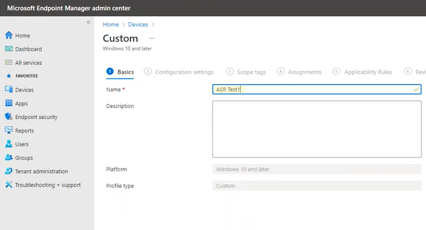
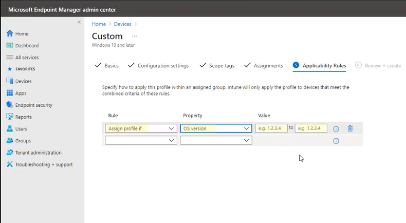

# <a name="enable-attack-surface-reduction-rules"></a>Aktivieren der Regeln zur Verringerung der Angriffsfläche

**Gilt für:**

- [Microsoft Defender für Endpunkt](https://go.microsoft.com/fwlink/p/?linkid=2154037)
- [Microsoft 365 Defender](https://go.microsoft.com/fwlink/?linkid=2118804)

> [!TIP]
> Möchten Sie Defender für Endpunkt erfahren? [Registrieren Sie sich für eine kostenlose Testversion.](https://www.microsoft.com/microsoft-365/windows/microsoft-defender-atp?ocid=docs-wdatp-assignaccess-abovefoldlink)

[Attack Surface Reduction-Regeln](attack-surface-reduction.md) (ASR-Regeln) tragen dazu bei, Aktionen zu verhindern, die schadsoftware häufig missbraucht, um Geräte und Netzwerke zu kompromittieren.

## <a name="requirements"></a>Anforderungen

Attack Surface Reduction-Features in Windows Versionen

Sie können Regeln zur Verringerung der Angriffsfläche für Geräte festlegen, auf denen eine der folgenden Editionen und Versionen von Windows ausgeführt wird:

- Windows 10 Pro, Version [1709](/windows/whats-new/whats-new-windows-10-version-1709) oder höher
- Windows 10 Enterprise, Version [1709](/windows/whats-new/whats-new-windows-10-version-1709) oder höher
- Windows Server, [Version 1803 (Halbjährlicher Kanal)](/windows-server/get-started/whats-new-in-windows-server-1803) oder höher
- [Windows Server 2019](/windows-server/get-started-19/whats-new-19)

Um den gesamten Featuresatz von Regeln zur Verringerung der Angriffsfläche zu verwenden, benötigen Sie Folgendes:

- Windows Defender Antivirus als primäre AV(Echtzeitschutz aktiviert)
- [Cloud-Delivery Protection](https://docs.microsoft.com/windows/security/threat-protection/microsoft-defender-antivirus/enable-cloud-protection-microsoft-defender-antivirus) on (einige Regeln erfordern dies)
- Windows 10 Enterprise E5- oder E3-Lizenz oder Microsoft 365 Business-Lizenz

Obwohl die Regeln zur Verringerung der Angriffsfläche keine [Windows E5-Lizenz](/windows/deployment/deploy-enterprise-licenses)erfordern, erhalten Sie mit einer Windows E5-Lizenz erweiterte Verwaltungsfunktionen, einschließlich Überwachung, Analyse und Workflows, die in Defender für Endpunkt verfügbar sind, sowie Berichterstellungs- und Konfigurationsfunktionen im Microsoft 365 Security Center. Diese erweiterten Funktionen sind nicht mit einer E3-Lizenz verfügbar, sie können jedoch weiterhin die Ereignisanzeige verwenden, um Regelereignisse zur Verringerung der Angriffsfläche zu überprüfen.

Jede ASR-Regel enthält eine von vier Einstellungen:

- **Nicht konfiguriert:** Deaktivieren der ASR-Regel
- **Blockieren:** Aktivieren der ASR-Regel
- **Überwachung:** Bewerten, wie sich die ASR-Regel auf Ihre Organisation auswirken würde, wenn sie aktiviert ist
- **Warnen:** Aktivieren der ASR-Regel, aber Zulassen, dass der Endbenutzer den Block umgeht

> [!IMPORTANT]
> Derzeit wird der Warnmodus für drei ASR-Regeln nicht unterstützt, wenn Sie ASR-Regeln in Microsoft Endpoint Manager (MEM) konfigurieren. Weitere Informationen finden Sie unter Fälle, in denen der [Warnmodus nicht unterstützt wird.](attack-surface-reduction.md#cases-where-warn-mode-is-not-supported)

Es wird dringend empfohlen, ASR-Regeln mit einer Windows E5-Lizenz (oder einer ähnlichen Lizenzierungs-SKU) zu verwenden, um die erweiterten Überwachungs- und Berichtsfunktionen zu [nutzen,](microsoft-defender-endpoint.md) die in Microsoft Defender für Endpunkt (Defender für Endpunkt) verfügbar sind. Wenn Sie jedoch über eine andere Lizenz verfügen, z. B. Windows Professional oder Windows E3, die keine erweiterten Überwachungs- und Berichtsfunktionen enthalten, können Sie ihre eigenen Überwachungs- und Berichterstellungstools zusätzlich zu den Ereignissen entwickeln, die an jedem Endpunkt generiert werden, wenn ASR-Regeln ausgelöst werden (z. B. Ereignisweiterleitung).

> [!TIP]
> Weitere Informationen zu Windows Lizenzierung finden Sie unter [Windows 10 Lizenzierung](https://www.microsoft.com/licensing/product-licensing/windows10?activetab=windows10-pivot:primaryr5) und im [Volumenlizenzierungshandbuch für Windows 10.](https://download.microsoft.com/download/2/D/1/2D14FE17-66C2-4D4C-AF73-E122930B60F6/Windows-10-Volume-Licensing-Guide.pdf)

Sie können Regeln zur Verringerung der Angriffsfläche mithilfe einer der folgenden Methoden aktivieren:

- [Microsoft Intune](#intune)
- [Verwaltung mobiler Geräte (Mobile Device Management, MDM)](#mdm)
- [Microsoft Endpoint Configuration Manager](#microsoft-endpoint-configuration-manager)
- [Gruppenrichtlinie](#group-policy)
- [PowerShell](#powershell)

Enterprise-Verwaltung wie Intune oder Microsoft Endpoint Manager wird empfohlen. die Verwaltung auf Enterprise Ebene überschreibt beim Start alle widersprüchlichen Gruppenrichtlinien oder PowerShell-Einstellungen.

## <a name="exclude-files-and-folders-from-asr-rules"></a>Ausschließen von Dateien und Ordnern aus ASR-Regeln

Sie können Dateien und Ordner von der Auswertung durch die meisten Regeln zur Verringerung der Angriffsfläche ausschließen. Dies bedeutet, dass selbst wenn eine ASR-Regel feststellt, dass die Datei oder der Ordner schädliches Verhalten enthält, die Ausführung der Datei nicht blockiert wird. Dadurch können möglicherweise unsichere Dateien ausgeführt und Ihre Geräte infiziert werden.

Sie können ASR-Regeln auch von der Auslösung basierend auf Zertifikat- und Dateihashes ausschließen, indem Sie angegebene Defender für Endpunkt-Datei- und Zertifikatindikatoren zulassen. (Siehe ["Indikatoren](manage-indicators.md)verwalten".)

> [!IMPORTANT]
> Das Ausschließen von Dateien oder Ordnern kann den Schutz durch ASR-Regeln erheblich reduzieren. Ausgeschlossene Dateien dürfen ausgeführt werden, und es wird kein Bericht oder Ereignis aufgezeichnet.
> Wenn ASR-Regeln Dateien erkennen, von denen Sie glauben, dass sie nicht erkannt werden sollten, sollten Sie [zuerst den Überwachungsmodus verwenden, um die Regel zu testen.](evaluate-attack-surface-reduction.md)

Sie können einzelne Dateien oder Ordner angeben (mithilfe von Ordnerpfaden oder vollqualifizierten Ressourcennamen), aber Sie können nicht angeben, für welche Regeln die Ausschlüsse gelten. Ein Ausschluss wird nur angewendet, wenn die ausgeschlossene Anwendung oder der ausgeschlossene Dienst gestartet wird. Wenn Sie beispielsweise einen Ausschluss für einen Updatedienst hinzufügen, der bereits ausgeführt wird, löst der Updatedienst weiterhin Ereignisse aus, bis der Dienst beendet und neu gestartet wird.

ASR-Regeln unterstützen Umgebungsvariablen und Platzhalter. Informationen zur Verwendung von Platzhaltern finden Sie unter [Verwenden von Platzhaltern in den Dateinamen- und Ordnerpfad- oder Erweiterungsausschlusslisten.](configure-extension-file-exclusions-microsoft-defender-antivirus.md#use-wildcards-in-the-file-name-and-folder-path-or-extension-exclusion-lists)

Die folgenden Verfahren zum Aktivieren von ASR-Regeln umfassen Anweisungen zum Ausschließen von Dateien und Ordnern.

## <a name="intune"></a>Intune

1. Wählen Sie **Gerätekonfigurationsprofile**  >  **aus.** Wählen Sie ein vorhandenes Endpunktschutzprofil aus, oder erstellen Sie ein neues. Um ein neues Profil zu erstellen, wählen Sie **Profil erstellen** aus, und geben Sie Informationen für dieses Profil ein. Wählen Sie für **Profiltyp** **Endpunktschutz** aus. Wenn Sie ein vorhandenes Profil ausgewählt haben, wählen Sie **Eigenschaften** und dann **Einstellungen** aus.

2. Wählen Sie im **Endpunktschutzbereich** **Windows Defender Exploit Guard** aus, und wählen Sie dann Attack Surface **Reduction** aus. Wählen Sie die gewünschte Einstellung für jede ASR-Regel aus.

3. Geben Sie unter **Attack Surface Reduction-Ausnahmen** einzelne Dateien und Ordner ein. Sie können auch **"Importieren"** auswählen, um eine CSV-Datei zu importieren, die Dateien und Ordner enthält, die von ASR-Regeln ausgeschlossen werden sollen. Jede Zeile in der CSV-Datei sollte wie folgt formatiert werden:

   `C:\folder`, `%ProgramFiles%\folder\file`, `C:\path`

4. Wählen Sie in den drei Konfigurationsbereichen **"OK"** aus. Wählen Sie dann **"Erstellen"** aus, wenn Sie eine neue Endpunktschutzdatei erstellen, oder **"Speichern",** wenn Sie eine vorhandene bearbeiten.

## <a name="mem"></a>Mem

Sie können Microsoft Endpoint Manager (MEM)-OMA-URI verwenden, um benutzerdefinierte ASR-Regeln zu konfigurieren. Im folgenden Verfahren wird für das Beispiel die Regel ["Missbrauch von missbrauchten gefährdeten signierten Treibern blockieren"](attack-surface-reduction.md#block-abuse-of-exploited-vulnerable-signed-drivers) verwendet.

1. Öffnen Sie das Microsoft Endpoint Manager (MEM) Admin Center. Klicken Sie im Menü **"Start"** auf **"Geräte",** wählen Sie **"Konfigurationsprofil"** aus, und klicken Sie dann auf **"Profil erstellen".**

   > [!div class="mx-imgBorder"]
   > 

2. Wählen Sie in **"Profil erstellen"** in den folgenden beiden Dropdownlisten Folgendes aus:

   - Wählen Sie **in** **"Plattform"** Windows 10 und höher aus.
   - Wählen Sie **im Profiltyp** **"Vorlagen" aus.**

   Wählen Sie **"Benutzerdefiniert"** aus, und klicken Sie dann auf **"Erstellen".**

   > [!div class="mx-imgBorder"]
   > 

3. Das Tool für benutzerdefinierte Vorlagen wird mit Schritt **1 Basics** geöffnet. Geben Sie in **1 Basics** unter **Name** einen Namen für Ihre Vorlage ein, und in **"Beschreibung"** können Sie eine Beschreibung eingeben (optional).

   > [!div class="mx-imgBorder"]
   > 

4. Klicken Sie auf **Weiter**. Schritt **2: Konfigurationseinstellungen** werden geöffnet. Klicken Sie für OMA-URI-Einstellungen auf **"Hinzufügen".** Jetzt werden zwei Optionen angezeigt: **Hinzufügen** und **Exportieren.**

   > [!div class="mx-imgBorder"]
   > 

5. Klicken Sie erneut auf **"Hinzufügen".** Das **Add Row OMA-URI Einstellungen** opens. Führen Sie in **"Zeile hinzufügen"** die folgenden Schritte aus:

   - Geben Sie unter **"Name"** einen Namen für die Regel ein.
   - Geben Sie in **Beschreibung** eine kurze Beschreibung ein.
   - Geben Sie in **OMA-URI** den spezifischen OMA-URI-Link für die Regel ein, die Sie hinzufügen, oder fügen Sie ihn ein.
   - Wählen Sie **im Datentyp** **Zeichenfolge** aus.
   - Geben Sie in **Wert** den GUID-Wert, das Vorzeichen und den Statuswert ohne Leerzeichen ein, oder fügen Sie ihn ein ( \= _GUID=StateValue_). Where: {0 : Disable (Disable the ASR rule)}, {1 : Block (Enable the ASR rule)}, {2 : Audit (Evaluate how the ASR rule would impact your organization if enabled)}, {6 : Warn (Enable the ASR rule but allow the end-user to bypass the block)}

   > [!div class="mx-imgBorder"]
   > 

6. Klicken Sie auf **Speichern**. **Zeile hinzufügen** wird geschlossen. Klicken Sie **in "Benutzerdefiniert"** auf **"Weiter".** In Schritt **3 sind Bereichstags** optional. Führen Sie einen der folgenden Schritte aus:

   - Klicken Sie auf **"Bereichstags auswählen",** wählen Sie das Bereichstag (optional) aus, und klicken Sie dann auf **"Weiter".**
   - Oder klicken Sie auf **"Weiter".**

7. Wählen Sie in Schritt **4 "Zuordnungen"** in **"Enthaltene Gruppen"** – für die Gruppen, die diese Regel anwenden soll – aus den folgenden Optionen aus:

   - **Hinzufügen von Gruppen**
   - **Hinzufügen aller Benutzer**
   - **Hinzufügen aller Geräte**

   > [!div class="mx-imgBorder"]
   > 

8. Wählen Sie in **ausgeschlossenen Gruppen** alle Gruppen aus, die Sie von dieser Regel ausschließen möchten, und klicken Sie dann auf **"Weiter".**

9. Führen Sie in Schritt **5 Anwendbarkeitsregeln** für die folgenden Einstellungen die folgenden Schritte aus:

   - Wählen Sie in **"Regel"** entweder **"Profil zuweisen" oder** **"Profil nicht zuweisen"** aus, wenn
   - Wählen Sie in **"Eigenschaft"** die Eigenschaft aus, auf die diese Regel angewendet werden soll.
   - Geben Sie in **Wert** den entsprechenden Wert oder Wertebereich ein.

   > [!div class="mx-imgBorder"]
   > 

10. Klicken Sie auf **Weiter**. Überprüfen und erstellen Sie in Schritt **6** die Einstellungen und Informationen, die Sie ausgewählt und eingegeben haben, und klicken Sie dann auf **"Erstellen".**

    > [!div class="mx-imgBorder"]
    > 

    > [!NOTE]
    > Regeln sind aktiv und sind innerhalb von Minuten aktiv.

>[!NOTE]
> Konfliktbehandlung:
>
> Wenn Sie einem Gerät zwei unterschiedliche ASR-Richtlinien zuweisen, ist die Art und Weise, wie Konflikte behandelt werden, Regeln, denen unterschiedliche Zustände zugewiesen sind, keine Konfliktverwaltung vorhanden, und das Ergebnis ist ein Fehler.
>
> Regeln, die keine Konflikte verursachen, führen nicht zu einem Fehler, und die Regel wird ordnungsgemäß angewendet. Das Ergebnis ist, dass die erste Regel angewendet wird und nachfolgende nicht miteinander in Konflikt stehende Regeln mit der Richtlinie zusammengeführt werden.

## <a name="mdm"></a>Mdm

Verwenden Sie [den Konfigurationsdienstanbieter ./Vendor/MSFT/Policy/Config/Defender/AttackSurfaceReductionRules](/windows/client-management/mdm/policy-csp-defender#defender-attacksurfacereductionrules) (CSP), um den Modus für jede Regel einzeln zu aktivieren und festzulegen.

Es folgt ein Referenzbeispiel mit [GUID-Werten für ASR-Regeln.](attack-surface-reduction.md#attack-surface-reduction-rules)

`OMA-URI path: ./Vendor/MSFT/Policy/Config/Defender/AttackSurfaceReductionRules`

`Value: 75668C1F-73B5-4CF0-BB93-3ECF5CB7CC84=2|3B576869-A4EC-4529-8536-B80A7769E899=1|D4F940AB-401B-4EfC-AADC-AD5F3C50688A=2|D3E037E1-3EB8-44C8-A917-57927947596D=1|5BEB7EFE-FD9A-4556-801D-275E5FFC04CC=0|BE9BA2D9-53EA-4CDC-84E5-9B1EEEE46550=1`

Die Werte zum Aktivieren (Blockieren), Deaktivieren, Warnen oder Aktivieren im Überwachungsmodus sind:

- 0 : Deaktivieren (Asr-Regel deaktivieren)
- 1 : Blockieren (ASR-Regel aktivieren)
- 2 : Überwachung (Bewerten, wie sich die ASR-Regel bei Aktivierung auf Ihre Organisation auswirken würde)
- 6 : Warnen (Aktivieren sie die ASR-Regel, aber lassen Sie zu, dass der Endbenutzer den Block umgehen kann). Der Warnmodus ist jetzt für die meisten ASR-Regeln verfügbar.

Verwenden Sie [./Vendor/MSFT/Policy/Config/Defender/AttackSurfaceReductionOnlyExclusions](/windows/client-management/mdm/policy-csp-defender#defender-attacksurfacereductiononlyexclusions) Configuration Service Provider (CSP), um Ausschlüsse hinzuzufügen.

Beispiel:

`OMA-URI path: ./Vendor/MSFT/Policy/Config/Defender/AttackSurfaceReductionOnlyExclusions`

`Value: c:\path|e:\path|c:\Exclusions.exe`

> [!NOTE]
> Achten Sie darauf, OMA-URI-Werte ohne Leerzeichen einzugeben.

## <a name="microsoft-endpoint-configuration-manager"></a>Microsoft Endpoint Configuration Manager

1. Wechseln Sie in Microsoft Endpoint Configuration Manager zu **Assets and Compliance**  >  **Endpoint Protection** Windows Defender  >  **Exploit Guard**.

2. Wählen Sie **"Home**  >  **Create Exploit Guard Policy" aus.**

3. Geben Sie einen Namen und eine Beschreibung ein, wählen Sie **Attack Surface Reduction** aus, und wählen Sie **"Weiter"** aus.

4. Wählen Sie aus, welche Regeln Aktionen blockieren oder überwachen sollen, und wählen Sie **"Weiter"** aus.

5. Überprüfen Sie die Einstellungen, und wählen Sie **"Weiter"** aus, um die Richtlinie zu erstellen.

6. Nachdem die Richtlinie erstellt wurde, **schließen Sie**.

## <a name="group-policy"></a>Gruppenrichtlinien

> [!WARNING]
> Wenn Sie Ihre Computer und Geräte mit Intune, Configuration Manager oder einer anderen Verwaltungsplattform auf Unternehmensebene verwalten, überschreibt die Verwaltungssoftware beim Start alle widersprüchlichen Gruppenrichtlinieneinstellungen.

1. Öffnen Sie auf dem Computer, der Ihre Gruppenrichtlinie verwaltet, die [Gruppenrichtlinien-Verwaltungskonsole](https://technet.microsoft.com/library/cc731212.aspx), klicken Sie mit der rechten Maustaste auf das Gruppenrichtlinienobjekt, das Sie konfigurieren möchten, und wählen Sie **Bearbeiten** aus.

2. Wechseln Sie im **Gruppenrichtlinien-Verwaltungs-Editor** zu **Computerkonfiguration**, und wählen Sie **Administrative Vorlagen** aus.

3. Erweitern Sie die Struktur bis Windows **Komponenten**  >  **Microsoft Defender Antivirus**  >  **Microsoft Defender Exploit Guard**  >  **Attack Surface Reduction.**

4. Wählen Sie **"Attack Surface Reduction"-Regeln konfigurieren** und **"Aktiviert"** aus. Anschließend können Sie den einzelnen Status für jede Regel im Abschnitt "Optionen" festlegen.

   Wählen Sie **"Anzeigen" aus,** und geben Sie die Regel-ID in der Spalte **"Wertname"** und den ausgewählten Status in der Spalte **"Wert"** wie folgt ein:

   - 0 : Deaktivieren (Asr-Regel deaktivieren)
   - 1 : Blockieren (ASR-Regel aktivieren)
   - 2 : Überwachung (Bewerten, wie sich die ASR-Regel bei Aktivierung auf Ihre Organisation auswirken würde)
   - 6 : Warnen (Aktivieren der ASR-Regel, aber Zulassen, dass der Endbenutzer den Block umgeht)

   :::image type="content" source="images/asr-rules-gp.png" alt-text="ASR-Regeln in Gruppenrichtlinien":::

5. Um Dateien und Ordner von ASR-Regeln auszuschließen, wählen Sie die Einstellung **"Dateien und Pfade aus Attack Surface Reduction"-Regeln ausschließen aus,** und legen Sie die Option auf **"Aktiviert"** fest. Wählen Sie **"Anzeigen"** aus, und geben Sie jede Datei oder jeden Ordner in der Spalte **"Wertname"** ein. Geben Sie 0 in die **Spalte Wert** für jedes Element ein. 

   > [!WARNING]
   > Verwenden Sie keine Anführungszeichen, da sie weder für die Spalte mit dem **Wertnamen** noch für die **Spalte Value** unterstützt werden.

## <a name="powershell"></a>PowerShell

> [!WARNING]
> Wenn Sie Ihre Computer und Geräte mit Intune, Configuration Manager oder einer anderen Verwaltungsplattform auf Unternehmensebene verwalten, überschreibt die Verwaltungssoftware beim Start alle widersprüchlichen PowerShell-Einstellungen. Damit Benutzer den Wert mithilfe von PowerShell definieren können, verwenden Sie die Option "Benutzerdefiniert" für die Regel in der Verwaltungsplattform.

1. Geben Sie **powershell** im Startmenü ein, klicken Sie mit der rechten Maustaste auf **Windows PowerShell,** und wählen Sie **Als Administrator ausführen** aus.

2. Geben Sie das folgende Cmdlet ein:

    ```PowerShell
    Set-MpPreference -AttackSurfaceReductionRules_Ids <rule ID> -AttackSurfaceReductionRules_Actions Enabled
    ```

    Verwenden Sie das folgende Cmdlet, um ASR-Regeln im Überwachungsmodus zu aktivieren:

    ```PowerShell
    Add-MpPreference -AttackSurfaceReductionRules_Ids <rule ID> -AttackSurfaceReductionRules_Actions AuditMode
    ```

    Verwenden Sie das folgende Cmdlet, um ASR-Regeln im Warnmodus zu aktivieren:

    ```PowerShell
    Add-MpPreference -AttackSurfaceReductionRules_Ids <rule ID> -AttackSurfaceReductionRules_Actions Warn
    ```

    Verwenden Sie das folgende Cmdlet, um den ASR-Blockierungsfehler von gefährdeten signierten Treibern zu aktivieren:

   ```PowerShell
   Add-MpPreference -AttackSurfaceReductionRules_Ids 56a863a9-875e-4185-98a7-b882c64b5ce5 -AttackSurfaceReductionRules_Actions Enabled
   ```

    Verwenden Sie das folgende Cmdlet, um ASR-Regeln zu deaktivieren:

    ```PowerShell
    Add-MpPreference -AttackSurfaceReductionRules_Ids <rule ID> -AttackSurfaceReductionRules_Actions Disabled
    ```

    > [!IMPORTANT]
    > Sie müssen den Status für jede Regel einzeln angeben, aber Sie können Regeln und Zustände in einer durch Trennzeichen getrennten Liste kombinieren.
    >
    > Im folgenden Beispiel werden die ersten beiden Regeln aktiviert, die dritte Regel deaktiviert, und die vierte Regel wird im Überwachungsmodus aktiviert:
    >
    > ```PowerShell
    > Set-MpPreference -AttackSurfaceReductionRules_Ids <rule ID 1>,<rule ID 2>,<rule ID 3>,<rule ID 4> -AttackSurfaceReductionRules_Actions Enabled, Enabled, Disabled, AuditMode
    > ```

    Sie können auch das `Add-MpPreference` PowerShell-Verb verwenden, um der vorhandenen Liste neue Regeln hinzuzufügen.

    > [!WARNING]
    > `Set-MpPreference` überschreibt immer den vorhandenen Satz von Regeln. Wenn Sie dem vorhandenen Satz hinzufügen möchten, verwenden Sie `Add-MpPreference` stattdessen.
    > Sie können eine Liste der Regeln und deren aktuellen Status abrufen, indem Sie `Get-MpPreference` .

3. Verwenden Sie das folgende Cmdlet, um Dateien und Ordner von ASR-Regeln auszuschließen:

    ```PowerShell
    Add-MpPreference -AttackSurfaceReductionOnlyExclusions "<fully qualified path or resource>"
    ```

    Verwenden Sie `Add-MpPreference -AttackSurfaceReductionOnlyExclusions` weiterhin, um der Liste weitere Dateien und Ordner hinzuzufügen.

    > [!IMPORTANT]
    > Dient `Add-MpPreference` zum Anfügen oder Hinzufügen von Apps zur Liste. Mithilfe des `Set-MpPreference` Cmdlets wird die vorhandene Liste überschrieben.

## <a name="related-articles"></a>Verwandte Artikel

- [Reduzieren von Angriffsflächen mit Regeln zur Verringerung der Angriffsfläche](attack-surface-reduction.md)

- [Auswerten der Verringerung der Angriffsfläche](evaluate-attack-surface-reduction.md)

- [Häufig gestellte Fragen zur Verringerung der Angriffsfläche](attack-surface-reduction.md)
