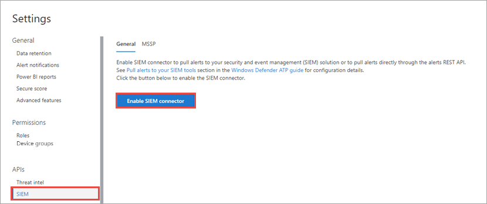

# Aktivieren der SIEM-Integration in Microsoft Defender for Endpoint

[!INCLUDE [Microsoft 365 Defender rebranding](../../includes/microsoft-defender.md)]

**Gilt für:**
- [Microsoft Defender für Endpunkt](https://go.microsoft.com/fwlink/?linkid=2154037)

>Möchten Sie Microsoft Defender for Endpoint erleben? [Registrieren Sie sich für eine kostenlose Testversion.](https://www.microsoft.com/microsoft-365/windows/microsoft-defender-atp?ocid=docs-wdatp-enablesiem-abovefoldlink) 

Aktivieren Sie die Integration von Sicherheitsinformationen und Ereignisverwaltung (EVENT Management, SIEM), damit Sie Erkennungen aus Microsoft Defender Security Center. Abrufen von Erkennungen mithilfe Ihrer SIEM-Lösung oder durch direkte Verbindung mit der ERKENNUNGS-REST-API.

>[!NOTE]
>- [Microsoft Defender for Endpoint Alert](alerts.md) besteht aus einer oder mehreren Erkennungen.
>- [Microsoft Defender for Endpoint Detection](api-portal-mapping.md) besteht aus dem verdächtigen Ereignis, das auf dem Gerät aufgetreten ist, und den zugehörigen Warnungsdetails.
>- Die Microsoft Defender for Endpoint Alert-API ist die neueste API für den Warnungsverbrauch und enthält eine detaillierte Liste der zugehörigen Nachweise für jede Warnung. Weitere Informationen finden Sie unter [Warnungsmethoden und -eigenschaften und](alerts.md) [Warnungen auflisten.](get-alerts.md)

## Voraussetzungen

- Der Benutzer, der die Einstellung aktiviert, muss über Berechtigungen zum Erstellen einer App in Azure Active Directory (AAD) verfügen. Dies ist eine Person mit den folgenden Rollen: 

  - Sicherheitsadministrator und entweder globaler Administrator
  - Cloudanwendungsadministrator
  - Anwendungsadministrator
  - Besitzer des Dienstprinzipal

- Während der ersten Aktivierung wird ein Popupbildschirm angezeigt, auf dem Anmeldeinformationen eingegeben werden können. Stellen Sie sicher, dass Sie Popups für diese Website zulassen.

## Aktivieren der SIEM-Integration 
1. Wählen Sie im Navigationsbereich **Einstellungen**  >  **SIEM aus.**

    

    >[!TIP]
    >Wenn beim Versuch, die SIEM-Connectoranwendung zu aktivieren, ein Fehler auftritt, überprüfen Sie die Popupblockereinstellungen Ihres Browsers. Möglicherweise wird das neue Fenster blockiert, das geöffnet wird, wenn Sie die Funktion aktivieren. 

2. Wählen **Sie SIEM-Integration aktivieren aus.** Dadurch wird der **Abschnitt MITM-Connectorzugriffsdetails** mit vordefinierten Werten aktiviert, und eine Anwendung wird unter Ihrem Azure Active Directory (Azure AD) erstellt.

    > [!WARNING]
    >Der geheime Clientgeheimnis wird nur einmal angezeigt. Stellen Sie sicher, dass Sie eine Kopie davon an einem sicheren Ort behalten. 
     

    

3. Wählen Sie den SIEM-Typ aus, den Sie in Ihrer Organisation verwenden.

   > [!NOTE]
   > Wenn Sie HP ArcSight auswählen, müssen Sie diese beiden Konfigurationsdateien speichern: 
   > - WDATP-connector.jsonparser.properties
   > - WDATP-connector.properties  

   Wenn Sie über programmgesteuerten Zugriff eine direkte Verbindung mit der ERKENNUNGS-REST-API herstellen möchten, wählen Sie **Generische API aus.**

4. Kopieren Sie die einzelnen Werte, oder wählen Sie **Details in Datei speichern aus,** um eine Datei herunterzuladen, die alle Werte enthält.

5. Wählen **Sie Token generieren aus,** um ein Zugriffs- und Aktualisierungstoken abzurufen.
  
   > [!NOTE]
   > Sie müssen alle 90 Tage ein neues Aktualisierungstoken generieren. 

6. Befolgen Sie die Anweisungen [zum Erstellen einer Azure AD-App-Registrierung für Microsoft Defender for Endpoint,](https://docs.microsoft.com/microsoft-365/security/defender-endpoint/exposed-apis-create-app-webapp) und weisen Sie ihr die richtigen Berechtigungen zum Lesen von Warnungen zu.

Sie können nun mit der Konfiguration Ihrer SIEM-Lösung fortfahren oder über programmgesteuerten Zugriff eine Verbindung mit der REST-API für Erkennungen herstellen. Sie müssen die Token verwenden, wenn Sie Ihre SIEM-Lösung so konfigurieren, dass sie Erkennungen von Microsoft Defender Security Center.

## Integrieren von Microsoft Defender for Endpoint in IBM QRadar 
Sie können IBM QRadar so konfigurieren, dass Erkennungen von Microsoft Defender for Endpoint erfasst werden. Weitere Informationen finden Sie unter [IBM Knowledge Center](https://www.ibm.com/support/knowledgecenter/SS42VS_DSM/c_dsm_guide_MS_Win_Defender_ATP_overview.html?cp=SS42VS_7.3.1).

## Siehe auch
- [Konfigurieren von HP ArcSight zum Ziehen von Microsoft Defender for Endpoint-Erkennungen](configure-arcsight.md)
- [Microsoft Defender for Endpoint Detection-Felder](api-portal-mapping.md)
- [Abrufen von Microsoft Defender for Endpoint-Erkennungen mithilfe der REST-API](pull-alerts-using-rest-api.md)
- [Behandeln von Problemen mit der Integration von SIEM-Tools](troubleshoot-siem.md)
