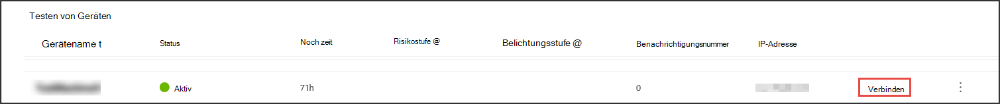
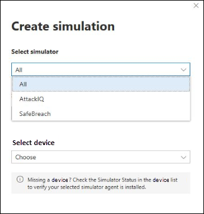
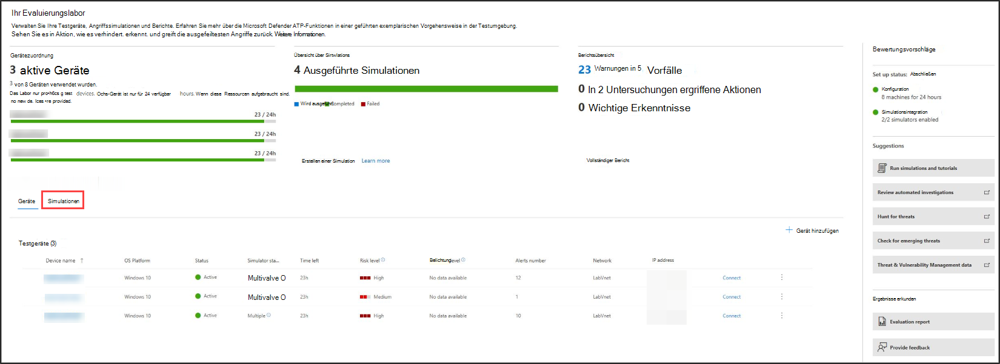

# Microsoft Defender für Endpunkt (MDE) durch simulierte Angriffe erleben

>[!TIP]
>
>- Erfahren Sie mehr über die neuesten Verbesserungen in Microsoft Defender für Endpunkt: [Was ist neu in Defender für Endpunkt?](https://cloudblogs.microsoft.com/microsoftsecure/2018/11/15/whats-new-in-windows-defender-atp/).
>- Defender für Endpunkt hat in der letzten MITRE-Evaluierung branchenführende Optik- und Erkennungsfunktionen demonstriert. Lesen Sie: [Insights aus der MITRE ATT&CK-basierten Auswertung.](https://cloudblogs.microsoft.com/microsoftsecure/2018/12/03/insights-from-the-mitre-attack-based-evaluation-of-windows-defender-atp/)

Möglicherweise möchten Sie Defender für Endpunkt testen, bevor Sie mehr als ein paar Geräte in den Dienst integrieren. Dazu können Sie kontrollierte Angriffssimulationen auf einigen Testgeräten ausführen. Nachdem Sie die simulierten Angriffe ausgeführt haben, können Sie überprüfen, wie Defender für Endpunkt bösartige Aktivitäten aufdecken und untersuchen, wie es eine effiziente Reaktion ermöglicht.

## Bevor Sie beginnen

Zum Ausführen einer der bereitgestellten Simulationen benötigen Sie mindestens [ein integriertes Gerät.](onboard-configure.md)

Lesen Sie das exemplarische Vorgehensweisendokument, das für jedes Angriffsszenario bereitgestellt wird. Jedes Dokument enthält Betriebssystem- und Anwendungsanforderungen sowie detaillierte Anweisungen, die für ein Angriffsszenario spezifisch sind.

## Ausführen einer Simulation

1. Wählen Sie **in**  >  **Hilfesimulationen & Lernprogrammen** aus, welche der verfügbaren Angriffsszenarien Sie simulieren möchten:

   - **Szenario 1: Dokument fällt Hintertür ab** – simuliert die Bereitstellung eines Social Engineering-Lockdokuments. Das Dokument startet eine speziell gestaltete Hintertür, die Angreifern die Kontrolle gibt.

   - **Szenario 2: PowerShell-Skript bei dateilosen Angriffen** – simuliert einen dateilosen Angriff, der auf PowerShell basiert, die Reduzierung der Angriffsfläche und die Erkennung bösartiger Speicheraktivitäten durch Geräte.

   - **Szenario 3: Automatisierte Reaktion auf Sicherheitsvorfälle** – löst eine automatisierte Untersuchung aus, die automatisch Nach- und Korrektur von Verletzungsartefakten auslöst, um Ihre Reaktionsfähigkeit auf Vorfälle zu skalieren.

2. Laden Sie das entsprechende Exemplarische Vorgehensweise-Dokument herunter, und lesen Sie es, das sie in Ihrem ausgewählten Szenario bereitgestellt haben.

3. Laden Sie die Simulationsdatei herunter, oder kopieren Sie das Simulationsskript, indem **Sie** zu  >  **Hilfesimulationen & Lernprogrammen** navigieren. Sie können die Datei oder das Skript auf das Testgerät herunterladen, dies ist jedoch nicht obligatorisch.

4. Führen Sie die Simulationsdatei oder das Skript auf dem Testgerät aus, wie im Dokument mit exemplarischer Vorgehensweise beschrieben.

> [!NOTE]
> Simulationsdateien oder Skripts imitieren Angriffsaktivitäten, sind aber eigentlich gutartig und schaden dem Testgerät nicht.
>

## ALTERNATIVER THEMENTEXT

## Simulieren von Angriffsszenarien

Verwenden Sie die Testgeräte, um Ihre eigenen Angriffssimulationen auszuführen, indem Sie eine Verbindung mit ihnen herstellen.

Sie können Angriffsszenarien mit folgenden Aktionen simulieren:

- Die [Angriffsszenarien "Selbst erledigen"](https://securitycenter.windows.com/tutorials)
- Bedrohungssimulatoren

Sie können die [erweiterte Suche](advanced-hunting-overview.md) auch verwenden, um Daten und [Bedrohungsanalysen](threat-analytics.md) abzufragen, um Berichte über neue Bedrohungen anzuzeigen.

### Do-it-yourself-Angriffsszenarien

Wenn Sie nach einer vorgefertigten Simulation suchen, können Sie unsere ["Do It Yourself"-Angriffsszenarien](https://securitycenter.windows.com/tutorials)verwenden. Diese Skripts sind sicher, dokumentiert und einfach zu verwenden. Diese Szenarien spiegeln die Defender für Endpunkt-Funktionen wider und führen Sie durch die Untersuchungserfahrung.

>[!NOTE]
>Die Verbindung mit den Testgeräten erfolgt über RDP. Stellen Sie sicher, dass ihre Firewalleinstellungen RDP-Verbindungen zulassen.

1. Verbinden zu Ihrem Gerät, und führen Sie eine Angriffssimulation **aus,** indem Sie Verbinden auswählen.

    

2. Speichern Sie die RDP-Datei, und starten Sie sie, indem Sie **Verbinden** auswählen.

    

    >[!NOTE]
    >Wenn Sie während der Ersteinrichtung keine Kopie des Kennworts gespeichert haben, können Sie das Kennwort zurücksetzen, indem Sie im Menü **"Kennwort zurücksetzen"** auswählen: 
    >
    > Das Gerät ändert seinen Zustand in "Ausführen der Kennwortzurücksetzung", dann wird Ihnen das neue Kennwort in ein paar Minuten angezeigt.

3. Geben Sie das Kennwort ein, das während des Geräteerstellungsschritts angezeigt wurde.

   

4. Führen Sie Do-it-yourself-Angriffssimulationen auf dem Gerät aus.

### Szenarien des Bedrohungssimulators

Wenn Sie sich entschieden haben, während des Lab-Setups einen der unterstützten Bedrohungssimulatoren zu installieren, können Sie die integrierten Simulationen auf den Evaluierungslaborgeräten ausführen.

Das Ausführen von Bedrohungssimulationen mitHilfe von Drittanbieterplattformen ist eine gute Möglichkeit, um Die Funktionen von Microsoft Defender für Endpunkte innerhalb einer Lab-Umgebung zu bewerten.

>[!NOTE]
>
>Bevor Sie Simulationen ausführen können, stellen Sie sicher, dass die folgenden Anforderungen erfüllt sind:

>- Geräte müssen dem Evaluierungslabor hinzugefügt werden
>- Bedrohungssimulatoren müssen im Evaluierungslabor installiert werden.

1. Wählen Sie im Portal **Simulation erstellen** aus.

2. Wählen Sie einen Bedrohungssimulator aus.

    

3. Wählen Sie eine Simulation aus, oder sehen Sie sich den Simulationskatalog an, um die verfügbaren Simulationen zu durchsuchen.

    Sie können den Simulationskatalog von:
    - Das Hauptauswertungsdashboard in der Kachel **"Simulationsübersicht"** oder
    - Wählen Sie dann im Navigationsbereich **"Evaluierung" und "Lernprogramme**  >  **Simulation & Lernprogramme"** den **Simulationskatalog** aus.

4. Wählen Sie die Geräte aus, auf denen Sie die Simulation ausführen möchten.

5. Wählen Sie **Simulation erstellen** aus.

6. Zeigen Sie den Fortschritt einer Simulation an, indem Sie die Registerkarte **Simulationen** auswählen. Zeigen Sie den Simulationsstatus, aktive Warnungen und andere Details an.

    
 

Nachdem Sie Ihre Simulationen ausgeführt haben, empfehlen wir Ihnen, die Testfortschrittsleiste zu durchlaufen und Microsoft Defender für Endpunkt zu erkunden, um **eine automatisierte Untersuchung und Behebung auszulösen.** Sehen Sie sich die von der Funktion gesammelten und analysierten Nachweise an.

Suchen Sie nach Angriffsnachweisen durch die erweiterte Suche mithilfe der umfangreichen Abfragesprache und der unformatierten Telemetrie, und sehen Sie sich einige weltweite Bedrohungen an, die in der Bedrohungsanalyse dokumentiert sind.
