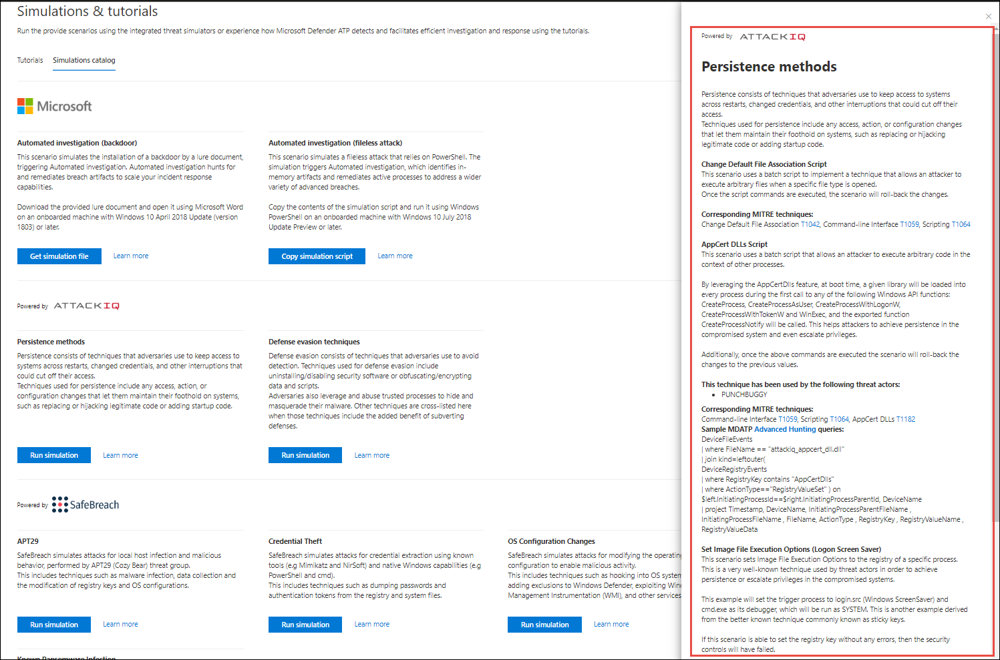

# Microsoft Defender for Endpoint-EvaluierungslaborMicrosoft Defender for Endpoint evaluation lab

[!INCLUDE [Microsoft 365 Defender rebranding](../../includes/microsoft-defender.md)]

**Gilt für:****Applies to:**
- [Microsoft Defender für EndpunktMicrosoft Defender for Endpoint](https://go.microsoft.com/fwlink/?linkid=2154037)
- [Microsoft 365 DefenderMicrosoft 365 Defender](https://go.microsoft.com/fwlink/?linkid=2118804)

>Möchten Sie Microsoft Defender for Endpoint erleben?Want to experience Microsoft Defender for Endpoint? [Registrieren Sie sich für eine kostenlose Testversion.Sign up for a free trial.](https://www.microsoft.com/microsoft-365/windows/microsoft-defender-atp?ocid=docs-wdatp-enablesiem-abovefoldlink)

Die Durchführung einer umfassenden Sicherheitsproduktbewertung kann ein komplexer Prozess sein, der eine aufwändige Umgebung und Gerätekonfiguration erfordert, bevor eine End-to-End-Angriffssimulation tatsächlich durchgeführt werden kann.Conducting a comprehensive security product evaluation can be a complex process requiring cumbersome environment and device configuration before an end-to-end attack simulation can actually be done. Das Hinzufügen der Komplexität ist die Herausforderung, zu verfolgen, wo die Simulationsaktivitäten, Warnungen und Ergebnisse während der Auswertung widergespiegelt werden.Adding to the complexity is the challenge of tracking where the simulation activities, alerts, and results are reflected during the evaluation.

Das Microsoft Defender for Endpoint-Evaluierungslabor ist so konzipiert, dass die Komplexität der Geräte- und Umgebungskonfiguration eliminiert wird, sodass Sie sich auf die Auswertung der Funktionen der Plattform, das Ausführen von Simulationen und das Sehen der Funktionen zur Verhinderung, Erkennung und Behebung konzentrieren können.The Microsoft Defender for Endpoint evaluation lab is designed to eliminate the complexities of device and environment configuration so that you can  focus on evaluating the capabilities of the platform, running simulations, and seeing the prevention, detection, and remediation features in action.

> [!VIDEO https://www.microsoft.com/en-us/videoplayer/embed/RE4qLUM]

Mit der vereinfachten Einrichtungsumgebung können Sie sich auf die Ausführung eigener Testszenarien und der vordefinierten Simulationen konzentrieren, um die Leistung von Defender for Endpoint zu sehen.With the simplified set-up experience, you can focus on running your own test scenarios and the pre-made simulations to see how Defender for Endpoint performs. 

Sie haben vollsten Zugriff auf die leistungsstarken Funktionen der Plattform, z. B. automatisierte Untersuchungen, erweiterte Suche und Bedrohungsanalyse, sodass Sie den umfassenden Schutzstapel testen können, den Defender for Endpoint bietet.You'll have full access to the powerful capabilities of the platform such as automated investigations, advanced hunting, and threat analytics, allowing you to test the comprehensive protection stack that Defender for Endpoint offers. 

Sie können Windows 10- oder Windows Server 2019-Geräte hinzufügen, die vorkonfiguriert sind, um die neuesten Betriebssystemversionen und die richtigen Sicherheitskomponenten sowie Office 2019 Standard installiert zu haben.You can add Windows 10 or Windows Server 2019 devices that come pre-configured to have the latest OS versions and the right security components in place as well as Office 2019 Standard installed.

Sie können auch Bedrohungssimulatoren installieren.You can also install threat simulators. Defender for Endpoint hat sich mit branchenführenden Bedrohungssimulationsplattformen zusammen gefunden, um die Defender for Endpoint-Funktionen zu testen, ohne das Portal verlassen zu müssen.Defender for Endpoint has partnered with industry leading threat simulation platforms to help you test out the Defender for Endpoint capabilities without having to leave the portal.

 Installieren Sie Ihren bevorzugten Simulator, führen Sie Szenarien innerhalb des Evaluierungslabors aus, und sehen Sie sich sofort an, wie die Plattform funktioniert – alles bequem und ohne zusätzliche Kosten für Sie verfügbar.Install your preferred simulator, run scenarios within the evaluation lab, and instantly see how the platform performs - all conveniently available at no extra cost to you. Außerdem haben Sie bequemen Zugriff auf eine breite Palette von Simulationen, auf die Sie im Simulationskatalog zugreifen und diese ausführen können.You'll also have convenient access to wide array of simulations which you can access and run from the simulations catalog.
    

## VorbereitungBefore you begin
Sie müssen die Lizenzierungsanforderungen [erfüllen](minimum-requirements.md#licensing-requirements) oder Testzugriff auf Microsoft Defender for Endpoint haben, um auf das Evaluierungslabor zu zugreifen.You'll need to fulfill the [licensing requirements](minimum-requirements.md#licensing-requirements) or have trial access to Microsoft Defender for Endpoint to access the evaluation lab.

Sie müssen über **Berechtigungen zum Verwalten von Sicherheitseinstellungen verfügen** für:You must have **Manage security settings** permissions to:
- Erstellen der ÜbungseinheitCreate the lab
- Erstellen von GerätenCreate devices
- Kennwort zurücksetzenReset password
- Erstellen von SimulationenCreate simulations 
 
Wenn Sie die rollenbasierte Zugriffssteuerung aktiviert und mindestens eine Computergruppe erstellt haben, müssen Benutzer Zugriff auf Alle Computergruppen haben.If you enabled role-based access control (RBAC) and created at least a one machine group, users must have access to All machine groups.

Weitere Informationen finden Sie unter [Erstellen und Verwalten von Rollen](user-roles.md).For more information, see [Create and manage roles](user-roles.md).

Möchten Sie Microsoft Defender for Endpoint erleben?Want to experience Microsoft Defender for Endpoint? [Registrieren Sie sich für eine kostenlose Testversion.Sign up for a free trial.](https://www.microsoft.com/microsoft-365/windows/microsoft-defender-atp?ocid=docs-wdatp-main-abovefoldlink)

## Erste Schritte mit der ÜbungseinheitGet started with the lab
Sie können über das Menü auf die Übungseinheit zugreifen.You can access the lab from the menu. Wählen Sie im Navigationsmenü Die Option Evaluierung und Lernprogramme > **Evaluierungsumgebung aus.**In the navigation menu, select **Evaluation and tutorials > Evaluation lab**.

>[!NOTE]
>- Jede Umgebung wird mit einer begrenzten Anzahl von Testgeräten bereitgestellt.Each environment is provisioned with a limited set of test devices.
>- Je nachdem, welche Umgebungsstruktur Sie auswählen, stehen Geräte für die angegebene Anzahl von Stunden ab dem Aktivierungstag zur Verfügung.Depending the type of environment structure you select, devices will be available for the specified number of hours from the day of activation.
>- Wenn Sie die bereitgestellten Geräte verwendet haben, werden keine neuen Geräte bereitgestellt.When you've used up the provisioned devices, no new devices are provided. Ein gelöschtes Gerät aktualisiert die anzahl der verfügbaren Testgeräte nicht.A deleted device does not refresh the available test device count.
>- Angesichts der begrenzten Ressourcen empfiehlt es sich, die Geräte sorgfältig zu verwenden.Given the limited resources, it’s advisable to use the devices carefully.

Sie haben bereits ein Labor?Already have a lab? Stellen Sie sicher, dass sie die neuen Bedrohungssimulatoren aktivieren und über aktive Geräte verfügen.Make sure to enable the new threat simulators and have active devices.

## Einrichten der EvaluierungsumgebungSetup the evaluation lab

1. Wählen Sie im Navigationsbereich **Evaluierungs- und Lernprogramme**  >  **Evaluierungslabor** aus, und wählen Sie **dann Setup lab aus.**In the navigation pane, select **Evaluation and tutorials** > **Evaluation lab**, then select **Setup lab**.

    

2. Je nach Bewertungsanforderungen können Sie eine Umgebung mit weniger Geräten für einen längeren Zeitraum oder mehr Geräte für einen kürzeren Zeitraum einrichten.Depending on your evaluation needs, you can choose to setup an environment with fewer devices for a longer period or more devices for a shorter period. Wählen Sie Ihre bevorzugte Lab-Konfiguration aus, und wählen Sie dann **Weiter aus.**Select your preferred lab configuration then select **Next**.

     

3. (Optional) Sie können in der Übungsumgebung Bedrohungssimulatoren installieren.(Optional) You can choose to install threat simulators in the lab. 

    

    >[!IMPORTANT]
    >Sie müssen zunächst die Bedingungen und Anweisungen zur Freigabe von Informationen akzeptieren und zustimmen.You'll first need to accept and provide consent to the terms and information sharing statements. 

4. Wählen Sie den Agent für die Bedrohungssimulation aus, den Sie verwenden möchten, und geben Sie Ihre Details ein.Select the threat simulation agent you'd like to use and enter your details. Sie können auch zu einem späteren Zeitpunkt Bedrohungssimulatoren installieren.You can also choose to install threat simulators at a later time. Wenn Sie während des Lab-Setups Bedrohungssimulations-Agents installieren möchten, profitieren Sie davon, dass sie bequem auf den hinzugefügten Geräten installiert werden.If you choose to install threat simulation agents during the lab setup, you'll enjoy the benefit of having them conveniently installed on the devices you add.  
    
    

5.  Überprüfen Sie die Zusammenfassung, und wählen **Sie Setup lab aus.**Review the summary and select **Setup lab**.  

Nach Abschluss des Lab-Setupprozesses können Sie Geräte hinzufügen und Simulationen ausführen.After the lab setup process is complete, you can add devices and run simulations. 

## Hinzufügen von GerätenAdd devices
Wenn Sie Ihrer Umgebung ein Gerät hinzufügen, richtet Defender for Endpoint ein gut konfiguriertes Gerät mit Verbindungsdetails ein.When you add a device to your environment, Defender for Endpoint sets up a well-configured device with connection details. Sie können Windows 10- oder Windows Server 2019-Geräte hinzufügen.You can add Windows 10 or Windows Server 2019 devices.

Das Gerät wird mit der neuesten Version des Betriebssystems und office 2019 Standard sowie mit anderen Apps wie Java, Python und SysIntenals konfiguriert.The device will be configured with the most up-to-date version of the OS and Office 2019 Standard as well as other apps such as Java, Python, and SysIntenals. 

   >[!TIP]
   > Benötigen Sie weitere Geräte in Ihrem Labor?Need more devices in your lab? Senden Sie ein Supportticket, damit Ihre Anforderung vom Defender for Endpoint-Team überprüft wird.Submit a support ticket to have your request reviewed by the Defender for Endpoint team. 

Wenn Sie während der Übungseinrichtung einen Bedrohungssimulator hinzufügen möchten, wird auf allen Geräten der Threat Simulator Agent auf den geräten installiert, die Sie hinzufügen.If you chose to add a threat simulator during the lab setup, all devices will have the threat simulator agent installed in the devices that you add.

Das Gerät wird automatisch in Ihren Mandanten onboardiert, und die empfohlenen Windows-Sicherheitskomponenten sind aktiviert und im Überwachungsmodus – ohne Aufwand auf Ihrer Seite.The device will automatically be onboarded to your tenant with the recommended Windows security components turned on and in audit mode - with no effort on your side. 

Die folgenden Sicherheitskomponenten sind auf den Testgeräten vorkonfiguriert:The following security components are pre-configured in the test devices:

- [Reduzierung der AngriffsflächeAttack surface reduction](https://docs.microsoft.com/windows/security/threat-protection/windows-defender-exploit-guard/attack-surface-reduction-exploit-guard)
- [Bei erster Sicht blockierenBlock at first sight](https://docs.microsoft.com/windows/security/threat-protection/microsoft-defender-antivirus/configure-block-at-first-sight-microsoft-defender-antivirus)
- [Kontrollierter OrdnerzugriffControlled folder access](https://docs.microsoft.com/windows/security/threat-protection/windows-defender-exploit-guard/controlled-folders-exploit-guard)
- [Exploit-SchutzExploit protection](https://docs.microsoft.com/windows/security/threat-protection/windows-defender-exploit-guard/enable-exploit-protection)
- [NetzwerkschutzNetwork protection](https://docs.microsoft.com/windows/security/threat-protection/windows-defender-exploit-guard/network-protection-exploit-guard)
- [Erkennung potenziell unerwünschter AnwendungenPotentially unwanted application detection](https://docs.microsoft.com/windows/security/threat-protection/microsoft-defender-antivirus/detect-block-potentially-unwanted-apps-microsoft-defender-antivirus)
- [In der Cloud zugestellter SchutzCloud-delivered protection](https://docs.microsoft.com/windows/security/threat-protection/microsoft-defender-antivirus/utilize-microsoft-cloud-protection-microsoft-defender-antivirus)
- [Microsoft Defender SmartScreenMicrosoft Defender SmartScreen](https://docs.microsoft.com/windows/security/threat-protection/windows-defender-smartscreen/windows-defender-smartscreen-overview)

>[!NOTE]
> Microsoft Defender Antivirus ist aktiviert (nicht im Überwachungsmodus).Microsoft Defender Antivirus will be on (not in audit mode). Wenn Sie von Microsoft Defender Antivirus nicht mehr ausgeführt werden können, können Sie den Echtzeitschutz auf dem Gerät über Windows Security deaktivieren.If Microsoft Defender Antivirus blocks you from running your simulation, you can turn off real-time protection on the device through Windows Security. Weitere Informationen finden Sie unter [Configure always-on protection](https://docs.microsoft.com/windows/security/threat-protection/microsoft-defender-antivirus/configure-real-time-protection-microsoft-defender-antivirus).For more information, see [Configure always-on protection](https://docs.microsoft.com/windows/security/threat-protection/microsoft-defender-antivirus/configure-real-time-protection-microsoft-defender-antivirus).

Automatische Untersuchungseinstellungen hängen von den Mandanteneinstellungen ab.Automated investigation settings will be dependent on tenant settings. Sie wird standardmäßig als halbautomatisiert konfiguriert.It will be configured to be semi-automated by default. Weitere Informationen finden Sie unter [Overview of Automated investigations](automated-investigations.md).For more information, see [Overview of Automated investigations](automated-investigations.md).

>[!NOTE]
>Die Verbindung mit den Testgeräten erfolgt mithilfe von RDP.The connection to the test devices is done using RDP. Stellen Sie sicher, dass ihre Firewalleinstellungen RDP-Verbindungen zulassen.Make sure that your firewall settings allow RDP connections.

1. Wählen Sie im Dashboard Geräte **hinzufügen aus.**From the dashboard, select **Add device**. 

2. Wählen Sie den Typ des hinzuzufügende Geräts aus.Choose the type of device to add. Sie können Windows 10 oder Windows Server 2019 hinzufügen.You can choose to add Windows 10 or Windows Server 2019.

    

    >[!NOTE]
    >Wenn beim Erstellungsprozess des Geräts ein Fehler vorgeht, werden Sie benachrichtigt, und Sie müssen eine neue Anforderung übermitteln.If something goes wrong with the device creation process, you'll be notified and you'll need to submit a new request. Wenn die Geräteerstellung fehlschlägt, wird sie nicht mit dem insgesamt zulässigen Kontingent gezählt.If the device creation fails, it will not be counted against the overall allowed quota. 

3. Die Verbindungsdetails werden angezeigt.The connection details are displayed. Wählen **Sie Kopieren** aus, um das Kennwort für das Gerät zu speichern.Select **Copy** to save the password for the device.

    >[!NOTE]
    >Das Kennwort wird nur einmal angezeigt.The password is only displayed once. Achten Sie darauf, sie für eine spätere Verwendung zu speichern.Be sure to save it for later use.

    

4. Die Geräteeinrichtung beginnt.Device set up begins. Dies kann bis zu ca. 30 Minuten dauern.This can take up to approximately 30 minutes. 

5. Sehen Sie sich den Status von Testgeräten, die Risiko- und Belichtungsstufen sowie den Status von Simulatorinstallationen an, indem Sie die Registerkarte **Geräte** auswählen.See the status of test devices, the risk and exposure levels, and the status of simulator installations by selecting the **Devices** tab. 

    
    

    >[!TIP]
    >In der **Spalte Simulatorstatus** können Sie mit der Maus auf das Informationssymbol zeigen, um den Installationsstatus eines Agents zu erfahren.In the **Simulator status** column, you can hover over the information icon to know the installation status of an agent.

## Simulieren von AngriffsszenarienSimulate attack scenarios
Verwenden Sie die Testgeräte, um eigene Angriffssimulationen durchzuführen, indem Sie eine Verbindung mit ihnen herstellen.Use the test devices to run your own attack simulations by connecting to them. 

Sie können Angriffsszenarien mit folgenden Bedingungen simulieren:You can simulate attack scenarios using:
- Die [Angriffsszenarien "Do It Yourself"](https://securitycenter.windows.com/tutorials)The ["Do It Yourself" attack scenarios](https://securitycenter.windows.com/tutorials)
- BedrohungssimulatorenThreat simulators

Sie können die [erweiterte](advanced-hunting-query-language.md) Suche auch verwenden, um Daten und [Bedrohungsanalysen](threat-analytics.md) zu abfragen, um Berichte zu neuen Bedrohungen anzeigen zu können.You can also use [Advanced hunting](advanced-hunting-query-language.md) to query data and [Threat analytics](threat-analytics.md) to view reports about emerging threats.

### Do-it-yourself-AngriffsszenarienDo-it-yourself attack scenarios
Wenn Sie nach einer vordefinierten Simulation suchen, können Sie unsere [Angriffsszenarien "Do It Yourself" verwenden.](https://securitycenter.windows.com/tutorials)If you are looking for a pre-made simulation, you can use our ["Do It Yourself" attack scenarios](https://securitycenter.windows.com/tutorials). Diese Skripts sind sicher, dokumentiert und einfach zu verwenden.These scripts are safe, documented, and easy to use. Diese Szenarien spiegeln die Defender for Endpoint-Funktionen wider und zeigen Ihnen die Untersuchungserfahrung.These scenarios will reflect Defender for Endpoint capabilities and walk you through investigation experience.

>[!NOTE]
>Die Verbindung mit den Testgeräten erfolgt mithilfe von RDP.The connection to the test devices is done using RDP. Stellen Sie sicher, dass ihre Firewalleinstellungen RDP-Verbindungen zulassen.Make sure that your firewall settings allow RDP connections.

1. Stellen Sie eine Verbindung mit Ihrem Gerät ein, und führen Sie eine Angriffssimulation aus, indem Sie **Verbinden auswählen.**Connect to your device and run an attack simulation by selecting **Connect**. 

    

2. Speichern Sie die RDP-Datei, und starten Sie sie, indem Sie **Verbinden auswählen.**Save the RDP file and launch it by selecting **Connect**.

    

    >[!NOTE]
    >Wenn Sie während der Ersteinrichtung keine Kopie des Kennworts gespeichert haben,  können Sie das Kennwort zurücksetzen, indem Sie im Menü Kennwort zurücksetzen auswählen: Abbildung If you don't have a copy of the password saved during the initial setup, you can reset the password by selecting **Reset password** from the menu:  
    > Das Gerät ändert den Status in "Kennwortzurücksetzung ausführen", dann wird Ihnen das neue Kennwort in ein paar Minuten angezeigt.The device will change it’s state to “Executing password reset", then you’ll be presented with your new password in a few minutes.

3. Geben Sie das Kennwort ein, das während des Geräteerstellungsschritts angezeigt wurde.Enter the password that was displayed during the device creation step. 

   

4. Führen Sie Do-it-yourself-Angriffssimulationen auf dem Gerät aus.Run Do-it-yourself attack simulations on the device. 

### Szenarien des BedrohungssimulatorsThreat simulator scenarios
Wenn Sie einen der unterstützten Bedrohungssimulatoren während des Lab-Setups installieren möchten, können Sie die integrierten Simulationen auf den Testumgebungsgeräten ausführen.If you chose to install any of the supported threat simulators during the lab setup, you can run the built-in simulations on the evaluation lab devices. 

Das Ausführen von Bedrohungssimulationen mithilfe von Drittanbieterplattformen ist eine gute Möglichkeit, die Microsoft Defender for Endpoint-Funktionen innerhalb der Grenzen einer Laborumgebung auszuwerten.Running threat simulations using third-party platforms is a good way to evaluate Microsoft Defender for Endpoint capabilities within the confines of a lab environment.

>[!NOTE]
>Bevor Sie Simulationen ausführen können, stellen Sie sicher, dass die folgenden Anforderungen erfüllt sind:Before you can run simulations, ensure the following requirements are met:
>- Geräte müssen der Evaluierungsumgebung hinzugefügt werdenDevices must be added to the evaluation lab
>- Bedrohungssimulatoren müssen im Evaluierungslabor installiert werdenThreat simulators must be installed in the evaluation lab

1. Wählen Sie im Portal Simulation **erstellen aus.**From the portal select **Create simulation**.

2. Wählen Sie einen Bedrohungssimulator aus.Select a threat simulator.

    

3. Wählen Sie eine Simulation aus, oder schauen Sie sich den Simulationskatalog an, um die verfügbaren Simulationen zu durchsuchen.Choose a simulation or look through the simulation gallery to browse through the available simulations. 

    Sie können zum Simulationskatalog von:You can get to the simulation gallery from:
    - Das Hauptauswertungsdashboard in der **Übersichtskachel Simulationen** oderThe main evaluation dashboard in the **Simulations overview** tile or
    - Wenn Sie im Navigationsbereich Evaluierung und Lernprogramme & navigieren, wählen Sie  >   **Simulationskatalog aus.**By navigating from the navigation pane **Evaluation and tutorials** > **Simulation & tutorials**, then select **Simulations catalog**.

4. Wählen Sie die Geräte aus, auf denen Sie die Simulation ausführen möchten.Select the devices where you'd like to run the simulation on.

5. Wählen **Sie Simulation erstellen aus.**Select **Create simulation**.

6. Zeigen Sie den Fortschritt einer Simulation an, indem Sie die **Registerkarte Simulationen** auswählen. Anzeigen des Simulationszustands, aktiver Warnungen und anderer Details.View the progress of a simulation by selecting the **Simulations** tab. View the simulation state, active alerts, and other details. 

    
    
Nachdem Sie Ihre Simulationen ausgeführt haben, empfehlen wir Ihnen, die Fortschrittsleiste des Labors zu durchforsten und Microsoft Defender for Endpoint zu erkunden, das eine automatisierte Untersuchung und Korrektur **ausgelöst hat.**After running your simulations, we encourage you to walk through the lab progress bar and explore **Microsoft Defender for Endpoint triggered an automated investigation and remediation**. Sehen Sie sich die vom Feature gesammelten und analysierten Nachweise an.Check out the evidence collected and analyzed by the feature.

Suchen Sie mithilfe der reichhaltigen Abfragesprache und der unformatierten Telemetrie nach Angriffsbeweis durch erweiterte Suche, und sehen Sie sich einige der weltweiten Bedrohungen an, die in der Bedrohungsanalyse dokumentiert sind.Hunt for attack evidence through advanced hunting by using the rich query language and raw telemetry and check out some world-wide threats documented in Threat analytics.

## SimulationskatalogSimulation gallery
Microsoft Defender for Endpoint hat eine Partnerschaft mit verschiedenen Bedrohungssimulationsplattformen entwickelt, um Ihnen bequemen Zugriff auf die Funktionen der Plattform direkt im Portal zu bieten.Microsoft Defender for Endpoint has partnered with various threat simulation platforms to give you convenient access to test the capabilities of the platform right from the within the portal. 

Zeigen Sie alle verfügbaren Simulationen an, indem Sie im Menü zum **Simulations- und**  >  **Lernprogrammkatalog Simulationen** gehen.View all the available simulations by going to  **Simulations and tutorials** > **Simulations catalog**  from the menu. 

Eine Liste der unterstützten Agents für die Bedrohungssimulation von Drittanbietern wird aufgelistet, und bestimmte Arten von Simulationen sowie ausführliche Beschreibungen werden im Katalog bereitgestellt.A list of supported third-party threat simulation agents are listed, and specific types of simulations along with detailed descriptions are provided on the catalog. 

Sie können alle verfügbaren Simulationen bequem direkt aus dem Katalog ausführen.You can conveniently run any available simulation right from the catalog.  

Jede Simulation enthält eine ausführliche Beschreibung des Angriffsszenarios und Verweise wie die verwendeten MITRE-Angriffstechniken und Beispielabfragen für erweiterte Suche.Each simulation comes with an in-depth description of the attack scenario and references such as the MITRE attack techniques used and sample Advanced hunting queries you run.

**Beispiele:** 
 **Examples:**

## EvaluierungsberichtEvaluation report
In den Laborberichten werden die Ergebnisse der Simulationen zusammengefasst, die auf den Geräten durchgeführt wurden.The lab reports summarize the results of the simulations conducted on the devices.

Auf einen Blick können Sie schnell sehen:At a glance, you'll quickly be able to see:
- Ausgelöste VorfälleIncidents that were triggered
- Generierte WarnungenGenerated alerts
- Bewertungen der RisikostufeAssessments on exposure level 
- Beobachtete BedrohungskategorienThreat categories observed
- ErkennungsquellenDetection sources
- Automatisierte UntersuchungenAutomated investigations

## Feedback gebenProvide feedback
Ihr Feedback hilft uns, Ihre Umgebung besser vor erweiterten Angriffen zu schützen.Your feedback helps us get better in protecting your environment from advanced attacks. Teilen Sie Ihre Erfahrungen und Impressionen von Produktfunktionen und Auswertungsergebnissen.Share your experience and impressions from product capabilities and evaluation results.

Teilen Sie uns ihre Meinung mit, indem Sie **Feedback bereitstellen auswählen.**Let us know what you think, by selecting **Provide feedback**.

