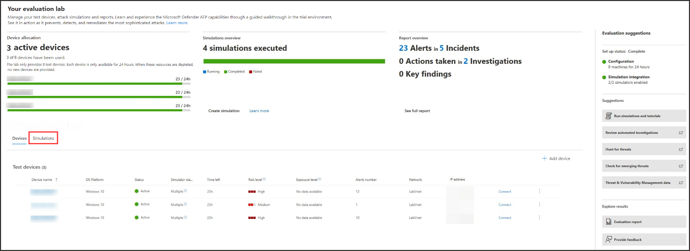

# Evaluierungslabor für Microsoft Defender für Endpunkt

[!INCLUDE [Microsoft 365 Defender rebranding](../../includes/microsoft-defender.md)]

**Gilt für:**
- [Microsoft Defender für Endpunkt](https://go.microsoft.com/fwlink/?linkid=2154037)
- [Microsoft 365 Defender](https://go.microsoft.com/fwlink/?linkid=2118804)

>Möchten Sie Microsoft Defender für Endpunkt erleben? [Registrieren Sie sich für eine kostenlose Testversion.](https://www.microsoft.com/microsoft-365/windows/microsoft-defender-atp?ocid=docs-wdatp-enablesiem-abovefoldlink)

Die Durchführung einer umfassenden Sicherheitsproduktbewertung kann ein komplexer Prozess sein, der eine umständliche Umgebung und Gerätekonfiguration erfordert, bevor tatsächlich eine End-to-End-Angriffssimulation durchgeführt werden kann. Zusätzlich zur Komplexität besteht die Herausforderung, nachzuverfolgen, wo die Simulationsaktivitäten, Warnungen und Ergebnisse während der Auswertung widergespiegelt werden.

Das Evaluierungslabor von Microsoft Defender für Endpunkt wurde entwickelt, um die Komplexität der Geräte- und Umgebungskonfiguration zu beseitigen, sodass Sie sich auf die Bewertung der Funktionen der Plattform, das Ausführen von Simulationen und das Anzeigen der Funktionen zur Verhinderung, Erkennung und Wartung konzentrieren können.

> [!VIDEO https://www.microsoft.com/en-us/videoplayer/embed/RE4qLUM]

Mit der vereinfachten Einrichtungsoberfläche können Sie sich auf die Ausführung Ihrer eigenen Testszenarien und die vordefinierten Simulationen konzentrieren, um zu sehen, wie Defender für Endpunkt funktioniert. 

Sie haben vollständigen Zugriff auf die leistungsstarken Funktionen der Plattform, z. B. automatisierte Untersuchungen, erweiterte Suche und Bedrohungsanalyse, sodass Sie den umfassenden Schutzstapel testen können, den Defender für Endpunkt bietet. 

Sie können Windows 10 oder Windows Server 2019-Geräte hinzufügen, die vorkonfiguriert sind, um die neuesten Betriebssystemversionen und die richtigen Sicherheitskomponenten sowie Office 2019 Standard installiert zu haben.

Sie können auch Bedrohungssimulatoren installieren. Defender für Endpunkt arbeitet mit branchenführenden Bedrohungssimulationsplattformen zusammen, um Ihnen zu helfen, die Defender für Endpunkt-Funktionen zu testen, ohne das Portal verlassen zu müssen.

 Installieren Sie Ihren bevorzugten Simulator, führen Sie Szenarien innerhalb des Evaluierungslabors aus, und sehen Sie sofort, wie die Plattform funktioniert – alles bequem ohne zusätzliche Kosten für Sie verfügbar. Sie haben auch bequemen Zugriff auf eine vielzahl von Simulationen, auf die Sie im Simulationskatalog zugreifen und diese ausführen können.
    

## Bevor Sie beginnen
Sie müssen die [Lizenzierungsanforderungen](minimum-requirements.md#licensing-requirements) erfüllen oder Testzugriff auf Microsoft Defender für Endpunkt haben, um auf das Evaluierungslabor zuzugreifen.

Sie benötigen Berechtigungen zum **Verwalten von Sicherheitseinstellungen** für Folgendes:
- Erstellen des Labors
- Erstellen von Geräten
- Kennwort zurücksetzen
- Erstellen von Simulationen 
 
Wenn Sie die rollenbasierte Zugriffssteuerung (RBAC) aktiviert und mindestens eine Computergruppe erstellt haben, müssen Benutzer Zugriff auf alle Computergruppen haben.

Weitere Informationen finden Sie unter [Erstellen und Verwalten von Rollen.](user-roles.md)

Möchten Sie Microsoft Defender für Endpunkt erleben? [Registrieren Sie sich für eine kostenlose Testversion.](https://www.microsoft.com/microsoft-365/windows/microsoft-defender-atp?ocid=docs-wdatp-main-abovefoldlink)

## Erste Schritte mit der Übung
Sie können über das Menü auf das Lab zugreifen. Wählen Sie im Navigationsmenü **evaluierungs- und lernprogramme > Evaluation Lab** aus.

>[!NOTE]
>- Je nachdem, welche Art von Umgebungsstruktur Sie auswählen, stehen geräte für die angegebene Anzahl von Stunden ab dem Tag der Aktivierung zur Verfügung.
>- Jede Umgebung wird mit einer begrenzten Gruppe von Testgeräten bereitgestellt. Wenn Sie die bereitgestellten Geräte verwendet und gelöscht haben, können Sie weitere Geräte anfordern. 
>- Sie können einmal im Monat Lab-Ressourcen anfordern. 

Haben Sie bereits ein Labor? Stellen Sie sicher, dass Sie die neuen Bedrohungssimulatoren aktivieren und über aktive Geräte verfügen.

## Einrichten des Evaluierungslabors

1. Wählen Sie im Navigationsbereich **Evaluierungs- und Lernprogramm-Evaluierungslabor aus,**  >  und wählen Sie dann **Setup lab** aus.

    

2. Je nach Ihren Evaluierungsanforderungen können Sie eine Umgebung mit weniger Geräten für einen längeren Zeitraum oder mehrere Geräte für einen kürzeren Zeitraum einrichten. Wählen Sie Ihre bevorzugte Lab-Konfiguration aus, und klicken Sie dann auf **"Weiter".**

     

3. (Optional) Sie können sich dafür entscheiden, Bedrohungssimulatoren im Labor zu installieren. 

    

    >[!IMPORTANT]
    >Sie müssen zunächst die Ausdrücke und Informationen, die Sie teilen, akzeptieren und zustimmen. 

4. Wählen Sie den Agent für die Bedrohungssimulation aus, den Sie verwenden möchten, und geben Sie Ihre Details ein. Sie können auch zu einem späteren Zeitpunkt Bedrohungssimulatoren installieren. Wenn Sie während des Lab-Setups Bedrohungssimulations-Agents installieren möchten, profitieren Sie von dem Vorteil, dass sie bequem auf den von Ihnen hinzugefügten Geräten installiert werden.  
    
    

5.  Überprüfen Sie die Zusammenfassung, und wählen Sie **Setup Lab** aus.  

Nach Abschluss des Lab-Setupprozesses können Sie Geräte hinzufügen und Simulationen ausführen. 

## Hinzufügen von Geräten
Wenn Sie Ihrer Umgebung ein Gerät hinzufügen, richtet Defender für Endpunkt ein gut konfiguriertes Gerät mit Verbindungsdetails ein. Sie können Windows 10- oder Windows Server 2019-Geräte hinzufügen.

Das Gerät wird mit der aktuellsten Version des Betriebssystems und Office 2019 Standard sowie anderen Apps wie Java, Python und SysIntenals konfiguriert. 

Wenn Sie während des Lab-Setups einen Bedrohungssimulator hinzugefügt haben, wird auf allen Geräten der Bedrohungssimulator-Agent auf den geräten installiert, die Sie hinzufügen.

Das Gerät wird automatisch in Ihren Mandanten integriert, wobei die empfohlenen Windows Sicherheitskomponenten aktiviert sind und sich im Überwachungsmodus befinden – ohne Aufwand auf Ihrer Seite. 

Die folgenden Sicherheitskomponenten sind auf den Testgeräten vorkonfiguriert:

- [Verringerung der Angriffsfläche](https://docs.microsoft.com/windows/security/threat-protection/windows-defender-exploit-guard/attack-surface-reduction-exploit-guard):
- [Bei erster Anzeige blockieren](https://docs.microsoft.com/windows/security/threat-protection/microsoft-defender-antivirus/configure-block-at-first-sight-microsoft-defender-antivirus)
- [Kontrollierter Ordnerzugriff](https://docs.microsoft.com/windows/security/threat-protection/windows-defender-exploit-guard/controlled-folders-exploit-guard)
- [Exploit-Schutz.](https://docs.microsoft.com/windows/security/threat-protection/windows-defender-exploit-guard/enable-exploit-protection)
- [Netzwerkschutz](https://docs.microsoft.com/windows/security/threat-protection/windows-defender-exploit-guard/network-protection-exploit-guard)
- [Erkennung potenziell unerwünschter Anwendungen](https://docs.microsoft.com/windows/security/threat-protection/microsoft-defender-antivirus/detect-block-potentially-unwanted-apps-microsoft-defender-antivirus)
- [Über die Cloud bereitgestellter Schutz](https://docs.microsoft.com/windows/security/threat-protection/microsoft-defender-antivirus/utilize-microsoft-cloud-protection-microsoft-defender-antivirus)
- [Microsoft Defender SmartScreen](https://docs.microsoft.com/windows/security/threat-protection/windows-defender-smartscreen/windows-defender-smartscreen-overview)

>[!NOTE]
> Microsoft Defender Antivirus ist aktiviert (nicht im Überwachungsmodus). Wenn Microsoft Defender Antivirus die Ausführung der Simulation verhindert, können Sie den Echtzeitschutz auf dem Gerät über Windows-Sicherheit deaktivieren. Weitere Informationen finden Sie unter ["Always-On-Schutz konfigurieren".](https://docs.microsoft.com/windows/security/threat-protection/microsoft-defender-antivirus/configure-real-time-protection-microsoft-defender-antivirus)

Die Einstellungen für die automatische Untersuchung hängen von den Mandanteneinstellungen ab. Sie wird standardmäßig so konfiguriert, dass sie halbautomatisiert ist. Weitere Informationen finden Sie unter [Übersicht über automatisierte Untersuchungen.](automated-investigations.md)

>[!NOTE]
>Die Verbindung mit den Testgeräten erfolgt über RDP. Stellen Sie sicher, dass ihre Firewalleinstellungen RDP-Verbindungen zulassen.

1. Wählen Sie im Dashboard **"Gerät hinzufügen"** aus. 

2. Wählen Sie den Typ des hinzuzufügenden Geräts aus. Sie können Windows 10 oder Windows Server 2019 hinzufügen.

    

    >[!NOTE]
    >Wenn beim Geräteerstellungsprozess ein Fehler auftritt, werden Sie benachrichtigt, und Sie müssen eine neue Anforderung senden. Wenn die Geräteerstellung fehlschlägt, wird sie nicht mit dem insgesamt zulässigen Kontingent gezählt. 

3. Die Verbindungsdetails werden angezeigt. Wählen Sie **"Kopieren"** aus, um das Kennwort für das Gerät zu speichern.

    >[!NOTE]
    >Das Kennwort wird nur einmal angezeigt. Speichern Sie es unbedingt für die spätere Verwendung.

    

4. Die Geräteeinrichtung beginnt. Dies kann bis zu ungefähr 30 Minuten dauern. 

5. Sehen Sie sich den Status der Testgeräte, das Risiko und die Belichtungsgrade sowie den Status von Simulatorinstallationen an, indem Sie die Registerkarte **"Geräte"** auswählen. 

    
    

    > [!TIP]
    > In der **Statusspalte des Simulators** können Sie auf das Informationssymbol zeigen, um den Installationsstatus eines Agents zu kennen.

## Anfordern weiterer Geräte
Wenn alle vorhandenen Geräte verwendet und gelöscht werden, können Sie weitere Geräte anfordern. Sie können einmal im Monat Lab-Ressourcen anfordern. 

1. Wählen Sie im Evaluierungslabordashboard die Option **"Anforderung für weitere Geräte"** aus.

   

2. Wählen Sie Ihre Konfiguration aus. 
3. Senden Sie die Anforderung. 

Wenn die Anforderung erfolgreich übermittelt wurde, sehen Sie ein grünes Bestätigungsbanner und das Datum der letzten Übermittlung.
 
Den Status Ihrer Anforderung finden Sie auf der Registerkarte **"Benutzeraktionen",** die innerhalb von wenigen Stunden genehmigt wird.

Nach der Genehmigung werden die angeforderten Geräte zu Ihrem Lab-Setup hinzugefügt, und Sie können weitere Geräte erstellen. 

> [!TIP]
> Um mehr aus Ihrem Labor herauszuholen, vergessen Sie nicht, unsere Simulationsbibliothek zu besuchen.

## Simulieren von Angriffsszenarien
Verwenden Sie die Testgeräte, um Ihre eigenen Angriffssimulationen auszuführen, indem Sie eine Verbindung mit ihnen herstellen. 

Sie können Angriffsszenarien mit folgenden Aktionen simulieren:
- Die [Angriffsszenarien "Selbst erledigen"](https://securitycenter.windows.com/tutorials)
- Bedrohungssimulatoren

Sie können die [erweiterte Suche](advanced-hunting-query-language.md) auch verwenden, um Daten und [Bedrohungsanalysen](threat-analytics.md) abzufragen, um Berichte über neue Bedrohungen anzuzeigen.

### Do-it-yourself-Angriffsszenarien
Wenn Sie nach einer vorgefertigten Simulation suchen, können Sie unsere ["Do It Yourself"-Angriffsszenarien](https://securitycenter.windows.com/tutorials)verwenden. Diese Skripts sind sicher, dokumentiert und einfach zu verwenden. Diese Szenarien spiegeln die Defender für Endpunkt-Funktionen wider und führen Sie durch die Untersuchungserfahrung.

>[!NOTE]
>Die Verbindung mit den Testgeräten erfolgt über RDP. Stellen Sie sicher, dass ihre Firewalleinstellungen RDP-Verbindungen zulassen.

1. Verbinden zu Ihrem Gerät, und führen Sie eine Angriffssimulation **aus,** indem Sie Verbinden auswählen. 

    

2. Speichern Sie die RDP-Datei, und starten Sie sie, indem Sie **Verbinden** auswählen.

    

    >[!NOTE]
    >Wenn Sie während der Ersteinrichtung keine Kopie des Kennworts gespeichert haben, können Sie das Kennwort zurücksetzen, indem Sie das Kennwort im Menü **zurücksetzen** auswählen:  
    > Das Gerät ändert seinen Zustand in "Ausführen der Kennwortzurücksetzung", dann wird Ihnen das neue Kennwort in ein paar Minuten angezeigt.

3. Geben Sie das Kennwort ein, das während des Geräteerstellungsschritts angezeigt wurde. 

   

4. Führen Sie Do-it-yourself-Angriffssimulationen auf dem Gerät aus. 

### Bedrohungssimulatorszenarien
Wenn Sie sich entschieden haben, während des Lab-Setups einen der unterstützten Bedrohungssimulatoren zu installieren, können Sie die integrierten Simulationen auf den Evaluierungslaborgeräten ausführen. 

Das Ausführen von Bedrohungssimulationen mitHilfe von Drittanbieterplattformen ist eine gute Möglichkeit, um Die Funktionen von Microsoft Defender für Endpunkte innerhalb einer Lab-Umgebung zu bewerten.

>[!NOTE]
>Bevor Sie Simulationen ausführen können, stellen Sie sicher, dass die folgenden Anforderungen erfüllt sind:
>- Geräte müssen dem Evaluierungslabor hinzugefügt werden
>- Bedrohungssimulatoren müssen im Evaluierungslabor installiert werden.

1. Wählen Sie im Portal **Simulation erstellen** aus.

2. Wählen Sie einen Bedrohungssimulator aus.

    

3. Wählen Sie eine Simulation aus, oder sehen Sie sich den Simulationskatalog an, um die verfügbaren Simulationen zu durchsuchen. 

    Sie können den Simulationskatalog von:
    - Das Hauptauswertungsdashboard in der Kachel **"Simulationsübersicht"** oder
    - Wählen Sie dann im Navigationsbereich **"Evaluierung" und "Lernprogramme**  >  **Simulation & Lernprogramme"** den **Simulationskatalog** aus.

4. Wählen Sie die Geräte aus, auf denen Sie die Simulation ausführen möchten.

5. Wählen Sie **Simulation erstellen** aus.

6. Zeigen Sie den Fortschritt einer Simulation an, indem Sie die Registerkarte **Simulationen** auswählen. Zeigen Sie den Simulationsstatus, aktive Warnungen und andere Details an. 

    
    
Nachdem Sie Ihre Simulationen ausgeführt haben, empfehlen wir Ihnen, die Testfortschrittsleiste zu durchlaufen und Microsoft Defender für Endpunkt zu erkunden, um **eine automatisierte Untersuchung und Behebung auszulösen.** Sehen Sie sich die von der Funktion gesammelten und analysierten Nachweise an.

Suchen Sie nach Angriffsnachweisen durch die erweiterte Suche mithilfe der umfangreichen Abfragesprache und der unformatierten Telemetrie, und sehen Sie sich einige weltweite Bedrohungen an, die in der Bedrohungsanalyse dokumentiert sind.

## Simulationskatalog
Microsoft Defender für Endpunkt hat sich mit verschiedenen Bedrohungssimulationsplattformen zusammen entwickelt, um Ihnen bequemen Zugriff zu bieten, um die Funktionen der Plattform direkt im Portal zu testen. 

Zeigen Sie alle verfügbaren Simulationen an, indem Sie im Menü zum Simulations- **und Lernprogrammkatalog**  >   wechseln. 

Es wird eine Liste der unterstützten Bedrohungssimulations-Agents von Drittanbietern aufgeführt, und bestimmte Simulationstypen sowie detaillierte Beschreibungen werden im Katalog bereitgestellt. 

Sie können jede verfügbare Simulation direkt aus dem Katalog ausführen.  

Jede Simulation enthält eine ausführliche Beschreibung des Angriffsszenarios und Referenzen wie die verwendeten MITRE-Angriffstechniken und Beispielabfragen für die erweiterte Suche, die Sie ausführen.

**Beispiele:** 
 

## Evaluierungsbericht
Die Laborberichte fassen die Ergebnisse der auf den Geräten durchgeführten Simulationen zusammen.

Auf einen Blick können Sie schnell folgendes sehen:
- Ausgelöste Vorfälle
- Generierte Warnungen
- Bewertungen der Belichtungsstufe 
- Beobachtete Bedrohungskategorien
- Erkennungsquellen
- Automatisierte Untersuchungen

## Feedback geben
Ihr Feedback hilft uns, Ihre Umgebung besser vor fortgeschrittenen Angriffen zu schützen. Teilen Sie Ihre Erfahrungen und Aufrufe von Produktfunktionen und Evaluierungsergebnissen.

Teilen Sie uns Ihre Meinung mit, indem Sie **"Feedback bereitstellen"** auswählen.

