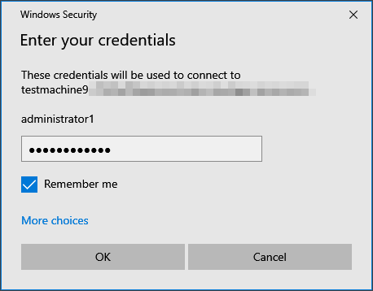
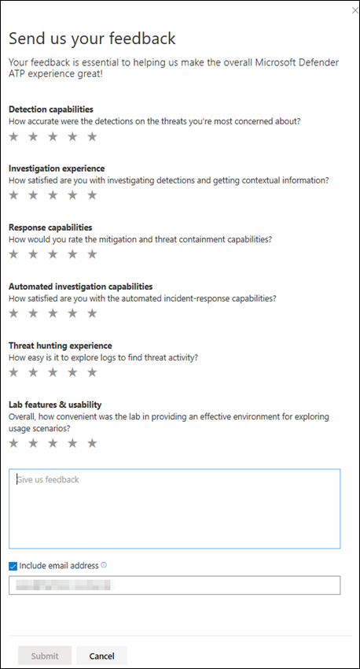

# Microsoft Defender for Endpoint-Evaluierungslabor

[!INCLUDE [Microsoft 365 Defender rebranding](../../includes/microsoft-defender.md)]

**Gilt für:**
- [Microsoft Defender für Endpunkt](https://go.microsoft.com/fwlink/?linkid=2154037)
- [Microsoft 365 Defender](https://go.microsoft.com/fwlink/?linkid=2118804)

>Möchten Sie Microsoft Defender for Endpoint erleben? [Registrieren Sie sich für eine kostenlose Testversion.](https://www.microsoft.com/microsoft-365/windows/microsoft-defender-atp?ocid=docs-wdatp-enablesiem-abovefoldlink)

Die Durchführung einer umfassenden Sicherheitsproduktbewertung kann ein komplexer Prozess sein, der eine aufwändige Umgebung und Gerätekonfiguration erfordert, bevor eine End-to-End-Angriffssimulation tatsächlich durchgeführt werden kann. Das Hinzufügen der Komplexität ist die Herausforderung, zu verfolgen, wo die Simulationsaktivitäten, Warnungen und Ergebnisse während der Auswertung widergespiegelt werden.

Das Microsoft Defender for Endpoint-Evaluierungslabor ist so konzipiert, dass die Komplexität der Geräte- und Umgebungskonfiguration eliminiert wird, sodass Sie sich auf die Auswertung der Funktionen der Plattform, das Ausführen von Simulationen und das Sehen der Funktionen zur Verhinderung, Erkennung und Behebung konzentrieren können.

> [!VIDEO https://www.microsoft.com/en-us/videoplayer/embed/RE4qLUM]

Mit der vereinfachten Einrichtungsumgebung können Sie sich auf die Ausführung eigener Testszenarien und der vordefinierten Simulationen konzentrieren, um die Leistung von Defender for Endpoint zu sehen. 

Sie haben vollsten Zugriff auf die leistungsstarken Funktionen der Plattform, z. B. automatisierte Untersuchungen, erweiterte Suche und Bedrohungsanalyse, sodass Sie den umfassenden Schutzstapel testen können, den Defender for Endpoint bietet. 

Sie können Windows 10- oder Windows Server 2019-Geräte hinzufügen, die vorkonfiguriert sind, um die neuesten Betriebssystemversionen und die richtigen Sicherheitskomponenten sowie Office 2019 Standard installiert zu haben.

Sie können auch Bedrohungssimulatoren installieren. Defender for Endpoint hat sich mit branchenführenden Bedrohungssimulationsplattformen zusammen gefunden, um die Defender for Endpoint-Funktionen zu testen, ohne das Portal verlassen zu müssen.

 Installieren Sie Ihren bevorzugten Simulator, führen Sie Szenarien innerhalb des Evaluierungslabors aus, und sehen Sie sich sofort an, wie die Plattform funktioniert – alles bequem und ohne zusätzliche Kosten für Sie verfügbar. Außerdem haben Sie bequemen Zugriff auf eine breite Palette von Simulationen, auf die Sie im Simulationskatalog zugreifen und diese ausführen können.
    

## Bevor Sie beginnen:
Sie müssen die Lizenzierungsanforderungen [erfüllen](minimum-requirements.md#licensing-requirements) oder Testzugriff auf Microsoft Defender for Endpoint haben, um auf das Evaluierungslabor zu zugreifen.

Sie müssen über **Berechtigungen zum Verwalten von Sicherheitseinstellungen verfügen** für:
- Erstellen der Übungseinheit
- Erstellen von Geräten
- Kennwort zurücksetzen
- Erstellen von Simulationen 
 
Wenn Sie die rollenbasierte Zugriffssteuerung aktiviert und mindestens eine Computergruppe erstellt haben, müssen Benutzer Zugriff auf Alle Computergruppen haben.

Weitere Informationen finden Sie unter [Erstellen und Verwalten von Rollen](user-roles.md).

Möchten Sie Microsoft Defender for Endpoint erleben? [Registrieren Sie sich für eine kostenlose Testversion.](https://www.microsoft.com/microsoft-365/windows/microsoft-defender-atp?ocid=docs-wdatp-main-abovefoldlink)

## Erste Schritte mit der Übungseinheit
Sie können über das Menü auf die Übungseinheit zugreifen. Wählen Sie im Navigationsmenü Die Option Evaluierung und Lernprogramme > **Evaluierungsumgebung aus.**

>[!NOTE]
>- Je nachdem, welche Umgebungsstruktur Sie auswählen, stehen Geräte für die angegebene Anzahl von Stunden ab dem Aktivierungstag zur Verfügung.
>- Jede Umgebung wird mit einer begrenzten Anzahl von Testgeräten bereitgestellt. Wenn Sie die bereitgestellten Geräte verwendet haben, werden keine neuen Geräte bereitgestellt. Ein gelöschtes Gerät aktualisiert die anzahl der verfügbaren Testgeräte nicht.
>- Sie können die Übungseinheit nicht mehr verwenden, wenn die Ressourcen aufb gewesen sind. Es wird weder zurückgesetzt noch aktualisiert.
>- Es empfiehlt sich, die Ressourcen sorgfältig zu verwenden. Die Laborressourcen sind begrenzt. Sie werden weder zurückgesetzt noch aktualisiert. 

Sie haben bereits ein Labor? Stellen Sie sicher, dass sie die neuen Bedrohungssimulatoren aktivieren und über aktive Geräte verfügen.

## Einrichten der Evaluierungsumgebung

1. Wählen Sie im Navigationsbereich **Evaluierungs- und Lernprogramme**  >  **Evaluierungslabor** aus, und wählen Sie **dann Setup lab aus.**

    

2. Je nach Bewertungsanforderungen können Sie eine Umgebung mit weniger Geräten für einen längeren Zeitraum oder mehr Geräte für einen kürzeren Zeitraum einrichten. Wählen Sie Ihre bevorzugte Lab-Konfiguration aus, und wählen Sie dann **Weiter aus.**

     

3. (Optional) Sie können in der Übungsumgebung Bedrohungssimulatoren installieren. 

    

    >[!IMPORTANT]
    >Sie müssen zunächst die Bedingungen und Anweisungen zur Freigabe von Informationen akzeptieren und zustimmen. 

4. Wählen Sie den Agent für die Bedrohungssimulation aus, den Sie verwenden möchten, und geben Sie Ihre Details ein. Sie können auch zu einem späteren Zeitpunkt Bedrohungssimulatoren installieren. Wenn Sie während des Lab-Setups Bedrohungssimulations-Agents installieren möchten, profitieren Sie davon, dass sie bequem auf den hinzugefügten Geräten installiert werden.  
    
    

5.  Überprüfen Sie die Zusammenfassung, und wählen **Sie Setup lab aus.**  

Nach Abschluss des Lab-Setupprozesses können Sie Geräte hinzufügen und Simulationen ausführen. 

## Hinzufügen von Geräten
Wenn Sie Ihrer Umgebung ein Gerät hinzufügen, richtet Defender for Endpoint ein gut konfiguriertes Gerät mit Verbindungsdetails ein. Sie können Windows 10- oder Windows Server 2019-Geräte hinzufügen.

Das Gerät wird mit der neuesten Version des Betriebssystems und office 2019 Standard sowie mit anderen Apps wie Java, Python und SysIntenals konfiguriert. 

   >[!TIP]
   > Benötigen Sie weitere Geräte in Ihrem Labor? Senden Sie ein Supportticket, damit Ihre Anforderung vom Defender for Endpoint-Team überprüft wird. 

Wenn Sie während der Übungseinrichtung einen Bedrohungssimulator hinzufügen möchten, wird auf allen Geräten der Threat Simulator Agent auf den geräten installiert, die Sie hinzufügen.

Das Gerät wird automatisch in Ihren Mandanten onboardiert, und die empfohlenen Windows-Sicherheitskomponenten sind aktiviert und im Überwachungsmodus – ohne Aufwand auf Ihrer Seite. 

Die folgenden Sicherheitskomponenten sind auf den Testgeräten vorkonfiguriert:

- [Verringerung der Angriffsfläche](https://docs.microsoft.com/windows/security/threat-protection/windows-defender-exploit-guard/attack-surface-reduction-exploit-guard):
- [Bei erster Sicht blockieren](https://docs.microsoft.com/windows/security/threat-protection/microsoft-defender-antivirus/configure-block-at-first-sight-microsoft-defender-antivirus)
- [Kontrollierter Ordnerzugriff](https://docs.microsoft.com/windows/security/threat-protection/windows-defender-exploit-guard/controlled-folders-exploit-guard)
- [Exploit-Schutz.](https://docs.microsoft.com/windows/security/threat-protection/windows-defender-exploit-guard/enable-exploit-protection)
- [Netzwerkschutz](https://docs.microsoft.com/windows/security/threat-protection/windows-defender-exploit-guard/network-protection-exploit-guard)
- [Erkennung potenziell unerwünschter Anwendungen](https://docs.microsoft.com/windows/security/threat-protection/microsoft-defender-antivirus/detect-block-potentially-unwanted-apps-microsoft-defender-antivirus)
- [Aus der Cloud gelieferter Schutz](https://docs.microsoft.com/windows/security/threat-protection/microsoft-defender-antivirus/utilize-microsoft-cloud-protection-microsoft-defender-antivirus)
- [Microsoft Defender SmartScreen](https://docs.microsoft.com/windows/security/threat-protection/windows-defender-smartscreen/windows-defender-smartscreen-overview)

>[!NOTE]
> Microsoft Defender Antivirus ist aktiviert (nicht im Überwachungsmodus). Wenn Sie von Microsoft Defender Antivirus nicht mehr ausgeführt werden können, können Sie den Echtzeitschutz auf dem Gerät über Windows Security deaktivieren. Weitere Informationen finden Sie unter [Configure always-on protection](https://docs.microsoft.com/windows/security/threat-protection/microsoft-defender-antivirus/configure-real-time-protection-microsoft-defender-antivirus).

Automatische Untersuchungseinstellungen hängen von den Mandanteneinstellungen ab. Sie wird standardmäßig als halbautomatisiert konfiguriert. Weitere Informationen finden Sie unter [Overview of Automated investigations](automated-investigations.md).

>[!NOTE]
>Die Verbindung mit den Testgeräten erfolgt mithilfe von RDP. Stellen Sie sicher, dass ihre Firewalleinstellungen RDP-Verbindungen zulassen.

1. Wählen Sie im Dashboard Geräte **hinzufügen aus.** 

2. Wählen Sie den Typ des hinzuzufügende Geräts aus. Sie können Windows 10 oder Windows Server 2019 hinzufügen.

    

    >[!NOTE]
    >Wenn beim Erstellungsprozess des Geräts ein Fehler vorgeht, werden Sie benachrichtigt, und Sie müssen eine neue Anforderung übermitteln. Wenn die Geräteerstellung fehlschlägt, wird sie nicht mit dem insgesamt zulässigen Kontingent gezählt. 

3. Die Verbindungsdetails werden angezeigt. Wählen **Sie Kopieren** aus, um das Kennwort für das Gerät zu speichern.

    >[!NOTE]
    >Das Kennwort wird nur einmal angezeigt. Achten Sie darauf, sie für eine spätere Verwendung zu speichern.

    

4. Die Geräteeinrichtung beginnt. Dies kann bis zu ca. 30 Minuten dauern. 

5. Sehen Sie sich den Status von Testgeräten, die Risiko- und Belichtungsstufen sowie den Status von Simulatorinstallationen an, indem Sie die Registerkarte **Geräte** auswählen. 

    
    

    >[!TIP]
    >In der **Spalte Simulatorstatus** können Sie mit der Maus auf das Informationssymbol zeigen, um den Installationsstatus eines Agents zu erfahren.

## Simulieren von Angriffsszenarien
Verwenden Sie die Testgeräte, um eigene Angriffssimulationen durchzuführen, indem Sie eine Verbindung mit ihnen herstellen. 

Sie können Angriffsszenarien mit folgenden Bedingungen simulieren:
- Die [Angriffsszenarien "Do It Yourself"](https://securitycenter.windows.com/tutorials)
- Bedrohungssimulatoren

Sie können die [erweiterte](advanced-hunting-query-language.md) Suche auch verwenden, um Daten und [Bedrohungsanalysen](threat-analytics.md) zu abfragen, um Berichte zu neuen Bedrohungen anzeigen zu können.

### Do-it-yourself-Angriffsszenarien
Wenn Sie nach einer vordefinierten Simulation suchen, können Sie unsere [Angriffsszenarien "Do It Yourself" verwenden.](https://securitycenter.windows.com/tutorials) Diese Skripts sind sicher, dokumentiert und einfach zu verwenden. Diese Szenarien spiegeln die Defender for Endpoint-Funktionen wider und zeigen Ihnen die Untersuchungserfahrung.

>[!NOTE]
>Die Verbindung mit den Testgeräten erfolgt mithilfe von RDP. Stellen Sie sicher, dass ihre Firewalleinstellungen RDP-Verbindungen zulassen.

1. Stellen Sie eine Verbindung mit Ihrem Gerät ein, und führen Sie eine Angriffssimulation aus, indem Sie **Verbinden auswählen.** 

    

2. Speichern Sie die RDP-Datei, und starten Sie sie, indem Sie **Verbinden auswählen.**

    

    >[!NOTE]
    >Wenn Sie während der Ersteinrichtung keine Kopie des Kennworts gespeichert haben,  können Sie das Kennwort zurücksetzen, indem Sie im Menü Kennwort zurücksetzen auswählen: Abbildung  
    > Das Gerät ändert den Status in "Kennwortzurücksetzung ausführen", dann wird Ihnen das neue Kennwort in ein paar Minuten angezeigt.

3. Geben Sie das Kennwort ein, das während des Geräteerstellungsschritts angezeigt wurde. 

   

4. Führen Sie Do-it-yourself-Angriffssimulationen auf dem Gerät aus. 

### Szenarien des Bedrohungssimulators
Wenn Sie einen der unterstützten Bedrohungssimulatoren während des Lab-Setups installieren möchten, können Sie die integrierten Simulationen auf den Testumgebungsgeräten ausführen. 

Das Ausführen von Bedrohungssimulationen mithilfe von Drittanbieterplattformen ist eine gute Möglichkeit, die Microsoft Defender for Endpoint-Funktionen innerhalb der Grenzen einer Laborumgebung auszuwerten.

>[!NOTE]
>Bevor Sie Simulationen ausführen können, stellen Sie sicher, dass die folgenden Anforderungen erfüllt sind:
>- Geräte müssen der Evaluierungsumgebung hinzugefügt werden
>- Bedrohungssimulatoren müssen im Evaluierungslabor installiert werden

1. Wählen Sie im Portal Simulation **erstellen aus.**

2. Wählen Sie einen Bedrohungssimulator aus.

    

3. Wählen Sie eine Simulation aus, oder schauen Sie sich den Simulationskatalog an, um die verfügbaren Simulationen zu durchsuchen. 

    Sie können zum Simulationskatalog von:
    - Das Hauptauswertungsdashboard in der **Übersichtskachel Simulationen** oder
    - Wenn Sie im Navigationsbereich Evaluierung und Lernprogramme & navigieren, wählen Sie  >   **Simulationskatalog aus.**

4. Wählen Sie die Geräte aus, auf denen Sie die Simulation ausführen möchten.

5. Wählen **Sie Simulation erstellen aus.**

6. Zeigen Sie den Fortschritt einer Simulation an, indem Sie die **Registerkarte Simulationen** auswählen. Anzeigen des Simulationszustands, aktiver Warnungen und anderer Details. 

    
    
Nachdem Sie Ihre Simulationen ausgeführt haben, empfehlen wir Ihnen, die Fortschrittsleiste des Labors zu durchforsten und Microsoft Defender for Endpoint zu erkunden, das eine automatisierte Untersuchung und Korrektur **ausgelöst hat.** Sehen Sie sich die vom Feature gesammelten und analysierten Nachweise an.

Suchen Sie mithilfe der reichhaltigen Abfragesprache und der unformatierten Telemetrie nach Angriffsbeweis durch erweiterte Suche, und sehen Sie sich einige der weltweiten Bedrohungen an, die in der Bedrohungsanalyse dokumentiert sind.

## Simulationskatalog
Microsoft Defender for Endpoint hat eine Partnerschaft mit verschiedenen Bedrohungssimulationsplattformen entwickelt, um Ihnen bequemen Zugriff auf die Funktionen der Plattform direkt im Portal zu bieten. 

Zeigen Sie alle verfügbaren Simulationen an, indem Sie im Menü zum **Simulations- und**  >  **Lernprogrammkatalog Simulationen** gehen. 

Eine Liste der unterstützten Agents für die Bedrohungssimulation von Drittanbietern wird aufgelistet, und bestimmte Arten von Simulationen sowie ausführliche Beschreibungen werden im Katalog bereitgestellt. 

Sie können alle verfügbaren Simulationen bequem direkt aus dem Katalog ausführen.  

Jede Simulation enthält eine ausführliche Beschreibung des Angriffsszenarios und Verweise wie die verwendeten MITRE-Angriffstechniken und Beispielabfragen für erweiterte Suche.

**Beispiele:** 
 

## Evaluierungsbericht
In den Laborberichten werden die Ergebnisse der Simulationen zusammengefasst, die auf den Geräten durchgeführt wurden.

Auf einen Blick können Sie schnell sehen:
- Ausgelöste Vorfälle
- Generierte Warnungen
- Bewertungen der Risikostufe 
- Beobachtete Bedrohungskategorien
- Erkennungsquellen
- Automatisierte Untersuchungen

## Feedback geben
Ihr Feedback hilft uns, Ihre Umgebung besser vor erweiterten Angriffen zu schützen. Teilen Sie Ihre Erfahrungen und Impressionen von Produktfunktionen und Auswertungsergebnissen.

Teilen Sie uns ihre Meinung mit, indem Sie **Feedback bereitstellen auswählen.**

