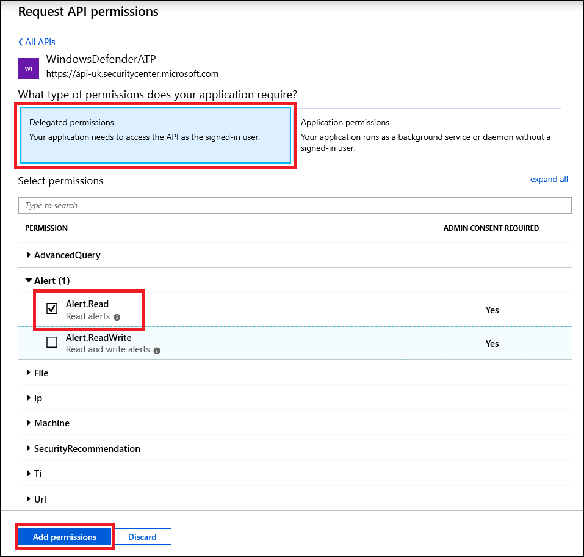

# <a name="use-microsoft-defender-for-endpoint-apis"></a><span data-ttu-id="81aea-104">Verwenden von Microsoft Defender für Endpunkt-APIs</span><span class="sxs-lookup"><span data-stu-id="81aea-104">Use Microsoft Defender for Endpoint APIs</span></span>

[!INCLUDE [Microsoft 365 Defender rebranding](../../includes/microsoft-defender.md)]


<span data-ttu-id="81aea-105">**Gilt für:**</span><span class="sxs-lookup"><span data-stu-id="81aea-105">**Applies to:**</span></span>
- [<span data-ttu-id="81aea-106">Microsoft Defender für Endpunkt</span><span class="sxs-lookup"><span data-stu-id="81aea-106">Microsoft Defender for Endpoint</span></span>](https://go.microsoft.com/fwlink/?linkid=2154037)

> <span data-ttu-id="81aea-107">Möchten Sie Microsoft Defender for Endpoint erleben?</span><span class="sxs-lookup"><span data-stu-id="81aea-107">Want to experience Microsoft Defender for Endpoint?</span></span> [<span data-ttu-id="81aea-108">Registrieren Sie sich für eine kostenlose Testversion.</span><span class="sxs-lookup"><span data-stu-id="81aea-108">Sign up for a free trial.</span></span>](https://www.microsoft.com/microsoft-365/windows/microsoft-defender-atp?ocid=docs-wdatp-exposedapis-abovefoldlink)

[!include[Microsoft Defender for Endpoint API URIs for US Government](../../includes/microsoft-defender-api-usgov.md)]

[!include[Improve request performance](../../includes/improve-request-performance.md)]

<span data-ttu-id="81aea-109">Auf dieser Seite wird beschrieben, wie Sie eine Anwendung erstellen, um programmgesteuerten Zugriff auf Defender for Endpoint im Auftrag eines Benutzers zu erhalten.</span><span class="sxs-lookup"><span data-stu-id="81aea-109">This page describes how to create an application to get programmatic access to Defender for Endpoint on behalf of a user.</span></span>

<span data-ttu-id="81aea-110">Wenn Sie programmgesteuerten Zugriff auf Microsoft Defender for Endpoint ohne Benutzer benötigen, lesen Sie [Access Microsoft Defender for Endpoint mit Anwendungskontext](exposed-apis-create-app-webapp.md).</span><span class="sxs-lookup"><span data-stu-id="81aea-110">If you need programmatic access Microsoft Defender for Endpoint without a user, refer to [Access Microsoft Defender for Endpoint with application context](exposed-apis-create-app-webapp.md).</span></span>

<span data-ttu-id="81aea-111">Wenn Sie nicht sicher sind, welchen Zugriff Sie benötigen, lesen Sie die [Seite Einführung](apis-intro.md).</span><span class="sxs-lookup"><span data-stu-id="81aea-111">If you are not sure which access you need, read the [Introduction page](apis-intro.md).</span></span>

<span data-ttu-id="81aea-112">Microsoft Defender for Endpoint macht einen Großen Teil seiner Daten und Aktionen über eine Reihe programmgesteuerter APIs verfügbar.</span><span class="sxs-lookup"><span data-stu-id="81aea-112">Microsoft Defender for Endpoint exposes much of its data and actions through a set of programmatic APIs.</span></span> <span data-ttu-id="81aea-113">Mit diesen APIs können Sie Arbeitsabläufe automatisieren und Innovationen basierend auf Microsoft Defender for Endpoint-Funktionen entwickeln.</span><span class="sxs-lookup"><span data-stu-id="81aea-113">Those APIs will enable you to automate work flows and innovate based on Microsoft Defender for Endpoint capabilities.</span></span> <span data-ttu-id="81aea-114">Für den API-Zugriff ist die OAuth2.0-Authentifizierung erforderlich.</span><span class="sxs-lookup"><span data-stu-id="81aea-114">The API access requires OAuth2.0 authentication.</span></span> <span data-ttu-id="81aea-115">Weitere Informationen finden Sie unter [OAuth 2.0 Authorization Code Flow](https://docs.microsoft.com/azure/active-directory/develop/active-directory-v2-protocols-oauth-code).</span><span class="sxs-lookup"><span data-stu-id="81aea-115">For more information, see [OAuth 2.0 Authorization Code Flow](https://docs.microsoft.com/azure/active-directory/develop/active-directory-v2-protocols-oauth-code).</span></span>

<span data-ttu-id="81aea-116">Im Allgemeinen müssen Sie die folgenden Schritte ausführen, um die APIs zu verwenden:</span><span class="sxs-lookup"><span data-stu-id="81aea-116">In general, you’ll need to take the following steps to use the APIs:</span></span>
- <span data-ttu-id="81aea-117">Erstellen einer AAD-Anwendung</span><span class="sxs-lookup"><span data-stu-id="81aea-117">Create an AAD application</span></span>
- <span data-ttu-id="81aea-118">Zugreifen auf ein Zugriffstoken mithilfe dieser Anwendung</span><span class="sxs-lookup"><span data-stu-id="81aea-118">Get an access token using this application</span></span>
- <span data-ttu-id="81aea-119">Verwenden des Tokens für den Zugriff auf die Defender for Endpoint-API</span><span class="sxs-lookup"><span data-stu-id="81aea-119">Use the token to access Defender for Endpoint API</span></span>

<span data-ttu-id="81aea-120">Auf dieser Seite wird erläutert, wie Sie eine AAD-Anwendung erstellen, ein Zugriffstoken für Microsoft Defender for Endpoint erhalten und das Token überprüfen.</span><span class="sxs-lookup"><span data-stu-id="81aea-120">This page explains how to create an AAD application, get an access token to Microsoft Defender for Endpoint and validate the token.</span></span>

>[!NOTE]
> <span data-ttu-id="81aea-121">Wenn Sie im Auftrag eines Benutzers auf die Microsoft Defender for Endpoint-API zugreifen, benötigen Sie die richtige Anwendungs- und Benutzerberechtigung.</span><span class="sxs-lookup"><span data-stu-id="81aea-121">When accessing Microsoft Defender for Endpoint API on behalf of a user, you will need the correct Application permission and user permission.</span></span>
> <span data-ttu-id="81aea-122">Wenn Sie mit den Benutzerberechtigungen für Microsoft Defender for Endpoint nicht vertraut sind, lesen Sie Verwalten des Portalzugriffs mithilfe [der rollenbasierten Zugriffssteuerung](rbac.md).</span><span class="sxs-lookup"><span data-stu-id="81aea-122">If you are not familiar with user permissions on Microsoft Defender for Endpoint, see [Manage portal access using role-based access control](rbac.md).</span></span>

>[!TIP]
> <span data-ttu-id="81aea-123">Wenn Sie über die Berechtigung zum Ausführen einer Aktion im Portal verfügen, haben Sie die Berechtigung, die Aktion in der API durchzuführen.</span><span class="sxs-lookup"><span data-stu-id="81aea-123">If you have the permission to perform an action in the portal, you have the permission to perform the action in the API.</span></span>

## <a name="create-an-app"></a><span data-ttu-id="81aea-124">App erstellen</span><span class="sxs-lookup"><span data-stu-id="81aea-124">Create an app</span></span>

1. <span data-ttu-id="81aea-125">Melden Sie sich [mit einem](https://portal.azure.com) Benutzerkonto mit der Rolle **"Globaler Administrator"** bei Azure an.</span><span class="sxs-lookup"><span data-stu-id="81aea-125">Log on to [Azure](https://portal.azure.com) with a user account that has the **Global Administrator** role.</span></span>

2. <span data-ttu-id="81aea-126">Navigieren Sie zu **Azure Active Directory**  >  **App-Registrierungen**  >  **Neue Registrierung**.</span><span class="sxs-lookup"><span data-stu-id="81aea-126">Navigate to **Azure Active Directory** > **App registrations** > **New registration**.</span></span> 

   

3. <span data-ttu-id="81aea-128">Geben Sie auf der daraufhin angezeigten Seite **Anwendung registrieren** die Registrierungsinformationen für Ihre Anwendung ein:</span><span class="sxs-lookup"><span data-stu-id="81aea-128">When the **Register an application** page appears, enter your application's registration information:</span></span>

   - <span data-ttu-id="81aea-129">**Name**: Geben Sie einen aussagekräftigen Anwendungsnamen ein, der den Benutzern der App angezeigt wird.</span><span class="sxs-lookup"><span data-stu-id="81aea-129">**Name** - Enter a meaningful application name that will be displayed to users of the app.</span></span>
   - <span data-ttu-id="81aea-130">**Unterstützte Kontotypen**: Wählen Sie aus, welche Konten von Ihrer Anwendung unterstützt werden sollen.</span><span class="sxs-lookup"><span data-stu-id="81aea-130">**Supported account types** - Select which accounts you would like your application to support.</span></span>

       | <span data-ttu-id="81aea-131">Unterstützte Kontotypen</span><span class="sxs-lookup"><span data-stu-id="81aea-131">Supported account types</span></span> | <span data-ttu-id="81aea-132">Beschreibung</span><span class="sxs-lookup"><span data-stu-id="81aea-132">Description</span></span> |
       |-------------------------|-------------|
       | <span data-ttu-id="81aea-133">**Nur Konten in diesem Organisationsverzeichnis**</span><span class="sxs-lookup"><span data-stu-id="81aea-133">**Accounts in this organizational directory only**</span></span> | <span data-ttu-id="81aea-134">Wählen Sie diese Option aus, wenn Sie eine Branchenanwendung erstellen.</span><span class="sxs-lookup"><span data-stu-id="81aea-134">Select this option if you're building a line-of-business (LOB) application.</span></span> <span data-ttu-id="81aea-135">Falls Sie die Anwendung nicht in einem Verzeichnis registrieren, ist diese Option nicht verfügbar.</span><span class="sxs-lookup"><span data-stu-id="81aea-135">This option is not available if you're not registering the application in a directory.</span></span><br><br><span data-ttu-id="81aea-136">Diese Option ist für reine Azure AD-Apps mit einem einzelnen Mandanten vorgesehen.</span><span class="sxs-lookup"><span data-stu-id="81aea-136">This option maps to Azure AD only single-tenant.</span></span><br><br><span data-ttu-id="81aea-137">Sofern Sie die App nicht außerhalb eines Verzeichnisses registrieren, ist dies die Standardoption.</span><span class="sxs-lookup"><span data-stu-id="81aea-137">This is the default option unless you're registering the app outside of a directory.</span></span> <span data-ttu-id="81aea-138">Wird die App außerhalb eines Verzeichnisses registriert, werden standardmäßig mehrinstanzenfähige Azure AD-Konten und persönliche Microsoft-Konten verwendet.</span><span class="sxs-lookup"><span data-stu-id="81aea-138">In cases where the app is registered outside of a directory, the default is Azure AD multi-tenant and personal Microsoft accounts.</span></span> |
       | <span data-ttu-id="81aea-139">**Konten in einem beliebigen Organisationsverzeichnis**</span><span class="sxs-lookup"><span data-stu-id="81aea-139">**Accounts in any organizational directory**</span></span> | <span data-ttu-id="81aea-140">Wählen Sie diese Option, wenn Sie alle Kunden aus dem Unternehmens- und Bildungsbereich ansprechen möchten.</span><span class="sxs-lookup"><span data-stu-id="81aea-140">Select this option if you would like to target all business and educational customers.</span></span><br><br><span data-ttu-id="81aea-141">Diese Option ist für reine Azure AD-Apps mit mehreren Mandanten vorgesehen.</span><span class="sxs-lookup"><span data-stu-id="81aea-141">This option maps to an Azure AD only multi-tenant.</span></span><br><br><span data-ttu-id="81aea-142">Wenn Sie die App als reine Azure AD-App mit einem einzelnen Mandanten registriert haben, können Sie sie über das Blatt **Authentifizierung** in eine Azure AD-App mit mehreren Mandanten (und wieder zurück in eine App mit einem einzelnen Mandanten) verwandeln.</span><span class="sxs-lookup"><span data-stu-id="81aea-142">If you registered the app as Azure AD only single-tenant, you can update it to be Azure AD multi-tenant and back to single-tenant through the **Authentication** blade.</span></span> |
       | <span data-ttu-id="81aea-143">**Konten in allen Organisationsverzeichnissen und persönliche Microsoft-Konten**</span><span class="sxs-lookup"><span data-stu-id="81aea-143">**Accounts in any organizational directory and personal Microsoft accounts**</span></span> | <span data-ttu-id="81aea-144">Verwenden Sie diese Option, um die breiteste Kundengruppe anzusprechen.</span><span class="sxs-lookup"><span data-stu-id="81aea-144">Select this option to target the widest set of customers.</span></span><br><br><span data-ttu-id="81aea-145">Diese Option ist für Azure AD-Apps mit mehreren Mandanten und für persönliche Microsoft-Konten vorgesehen.</span><span class="sxs-lookup"><span data-stu-id="81aea-145">This option maps to Azure AD multi-tenant and personal Microsoft accounts.</span></span><br><br><span data-ttu-id="81aea-146">Wenn Sie die App als Azure AD-App mit mehreren Mandanten und für persönliche Microsoft-Konten registriert haben, können Sie dies über die Benutzeroberfläche nicht ändern.</span><span class="sxs-lookup"><span data-stu-id="81aea-146">If you registered the app as Azure AD multi-tenant and personal Microsoft accounts, you cannot change this in the UI.</span></span> <span data-ttu-id="81aea-147">In diesem Fall müssen die unterstützten Kontotypen mithilfe des Anwendungsmanifest-Editors geändert werden.</span><span class="sxs-lookup"><span data-stu-id="81aea-147">Instead, you must use the application manifest editor to change the supported account types.</span></span> |

   - <span data-ttu-id="81aea-148">**Umleitungs-URI (optional)**: Wählen Sie die Art der App aus, die Sie erstellen (**Web** oder **Öffentlicher Client (Mobilgerät und Desktop)**), und geben Sie dann den Umleitungs-URI (oder die Antwort-URL) für Ihre Anwendung ein.</span><span class="sxs-lookup"><span data-stu-id="81aea-148">**Redirect URI (optional)** - Select the type of app you're building, **Web** or **Public client (mobile & desktop)**, and then enter the redirect URI (or reply URL) for your application.</span></span>
       - <span data-ttu-id="81aea-149">Geben Sie für Webanwendungen die Basis-URL Ihrer App an.</span><span class="sxs-lookup"><span data-stu-id="81aea-149">For web applications, provide the base URL of your app.</span></span> <span data-ttu-id="81aea-150">`http://localhost:31544` kann beispielsweise die URL für eine Web-App sein, die auf einem lokalen Computer ausgeführt wird.</span><span class="sxs-lookup"><span data-stu-id="81aea-150">For example, `http://localhost:31544` might be the URL for a web app running on your local machine.</span></span> <span data-ttu-id="81aea-151">Benutzer können diese URL nutzen, um sich an einer Webclientanwendung anzumelden.</span><span class="sxs-lookup"><span data-stu-id="81aea-151">Users would use this URL to sign in to a web client application.</span></span>
       - <span data-ttu-id="81aea-152">Geben Sie für öffentliche Clientanwendungen den URI an, der von Azure AD zum Zurückgeben von Tokenantworten verwendet wird.</span><span class="sxs-lookup"><span data-stu-id="81aea-152">For public client applications, provide the URI used by Azure AD to return token responses.</span></span> <span data-ttu-id="81aea-153">Geben Sie einen für Ihre Anwendung spezifischen Wert ein (beispielsweise `myapp://auth`).</span><span class="sxs-lookup"><span data-stu-id="81aea-153">Enter a value specific to your application, such as `myapp://auth`.</span></span>

     <span data-ttu-id="81aea-154">Spezifische Beispiele für Webanwendungen oder native Anwendungen finden Sie in unseren [Schnellstartanleitungen](/azure/active-directory/develop/#quickstarts).</span><span class="sxs-lookup"><span data-stu-id="81aea-154">To see specific examples for web applications or native applications, check out our [quickstarts](/azure/active-directory/develop/#quickstarts).</span></span>

     <span data-ttu-id="81aea-155">Wenn Sie so weit sind, klicken Sie auf **Registrieren**.</span><span class="sxs-lookup"><span data-stu-id="81aea-155">When finished, select **Register**.</span></span>

4. <span data-ttu-id="81aea-156">Erlauben Sie Ihrer Anwendung den Zugriff auf Microsoft Defender for Endpoint, und weisen Sie ihm die Berechtigung "Warnungen lesen" zu:</span><span class="sxs-lookup"><span data-stu-id="81aea-156">Allow your Application to access Microsoft Defender for Endpoint and assign it 'Read alerts' permission:</span></span>

    - <span data-ttu-id="81aea-157">Wählen Sie auf der Anwendungsseite **API-Berechtigungen** Berechtigungs-APIs hinzufügen aus, die meine >  >    >   **WindowsDefenderATP** verwendet, und wählen Sie unter **WindowsDefenderATP aus.**</span><span class="sxs-lookup"><span data-stu-id="81aea-157">On your application page, select **API Permissions** > **Add permission** > **APIs my organization uses** > type **WindowsDefenderATP** and select on **WindowsDefenderATP**.</span></span>

    - <span data-ttu-id="81aea-158">**Hinweis:** *WindowsDefenderATP* wird nicht in der ursprünglichen Liste angezeigt.</span><span class="sxs-lookup"><span data-stu-id="81aea-158">**Note**: *WindowsDefenderATP* does not appear in the original list.</span></span> <span data-ttu-id="81aea-159">Beginnen Sie, den Namen in das Textfeld zu schreiben, damit er angezeigt wird.</span><span class="sxs-lookup"><span data-stu-id="81aea-159">Start writing its name in the text box to see it appear.</span></span>

      

    - <span data-ttu-id="81aea-161">Wählen **Sie Delegierte Berechtigungen**  >  **Warnung.Lesezugriff** > Berechtigungen hinzufügen **aus.**</span><span class="sxs-lookup"><span data-stu-id="81aea-161">Choose **Delegated permissions** > **Alert.Read** > select **Add permissions**</span></span>

      

    - <span data-ttu-id="81aea-163">**Wichtiger Hinweis:** Wählen Sie die relevanten Berechtigungen aus.</span><span class="sxs-lookup"><span data-stu-id="81aea-163">**Important note**: Select the relevant permissions.</span></span> <span data-ttu-id="81aea-164">Lesewarnungen sind nur ein Beispiel.</span><span class="sxs-lookup"><span data-stu-id="81aea-164">Read alerts is only an example.</span></span>

      <span data-ttu-id="81aea-165">Zum Beispiel</span><span class="sxs-lookup"><span data-stu-id="81aea-165">For instance,</span></span>

      - <span data-ttu-id="81aea-166">Wählen [Sie zum Ausführen erweiterter](run-advanced-query-api.md)Abfragen die Berechtigung "Erweiterte Abfragen ausführen" aus.</span><span class="sxs-lookup"><span data-stu-id="81aea-166">To [run advanced queries](run-advanced-query-api.md), select 'Run advanced queries' permission</span></span>
      - <span data-ttu-id="81aea-167">Wählen [Sie zum Isolieren](isolate-machine.md)eines Geräts die Berechtigung "Computer isolieren" aus.</span><span class="sxs-lookup"><span data-stu-id="81aea-167">To [isolate a device](isolate-machine.md), select 'Isolate machine' permission</span></span>
      - <span data-ttu-id="81aea-168">Um zu bestimmen, welche Berechtigung Sie benötigen, zeigen Sie den Abschnitt **Berechtigungen** in der API an, die Sie aufrufen möchten.</span><span class="sxs-lookup"><span data-stu-id="81aea-168">To determine which permission you need, view the **Permissions** section in the API you are interested to call.</span></span>

    - <span data-ttu-id="81aea-169">Wählen Sie **Zustimmung erteilen aus**</span><span class="sxs-lookup"><span data-stu-id="81aea-169">Select **Grant consent**</span></span>

      <span data-ttu-id="81aea-170">**Hinweis**: Jedes Mal, wenn Sie Berechtigungen hinzufügen, müssen Sie die Option **Zustimmung** erteilen auswählen, damit die neue Berechtigung wirksam wird.</span><span class="sxs-lookup"><span data-stu-id="81aea-170">**Note**: Every time you add permission you must select on **Grant consent** for the new permission to take effect.</span></span>

      

6. <span data-ttu-id="81aea-172">Notieren Sie sich Ihre Anwendungs-ID und Ihre Mandanten-ID:</span><span class="sxs-lookup"><span data-stu-id="81aea-172">Write down your application ID and your tenant ID:</span></span>

   - <span data-ttu-id="81aea-173">Wechseln Sie auf der Anwendungsseite zu **Übersicht,** und kopieren Sie die folgenden Informationen:</span><span class="sxs-lookup"><span data-stu-id="81aea-173">On your application page, go to **Overview** and copy the following information:</span></span>

   


## <a name="get-an-access-token"></a><span data-ttu-id="81aea-175">Abrufen eines Zugriffstokens</span><span class="sxs-lookup"><span data-stu-id="81aea-175">Get an access token</span></span>

<span data-ttu-id="81aea-176">Weitere Informationen zu AAD-Token finden Sie unter [Azure AD-Lernprogramm.](https://docs.microsoft.com/azure/active-directory/develop/active-directory-v2-protocols-oauth-client-creds)</span><span class="sxs-lookup"><span data-stu-id="81aea-176">For more information on AAD tokens, see [Azure AD tutorial](https://docs.microsoft.com/azure/active-directory/develop/active-directory-v2-protocols-oauth-client-creds)</span></span>

### <a name="using-c"></a><span data-ttu-id="81aea-177">Verwenden von C #</span><span class="sxs-lookup"><span data-stu-id="81aea-177">Using C#</span></span>

- <span data-ttu-id="81aea-178">Kopieren/Einfügen sie die folgende Klasse in Ihrer Anwendung.</span><span class="sxs-lookup"><span data-stu-id="81aea-178">Copy/Paste the below class in your application.</span></span>
- <span data-ttu-id="81aea-179">Verwenden **Sie die AcquireUserTokenAsync-Methode** mit Anwendungs-ID, Mandanten-ID, Benutzername und Kennwort, um ein Token zu erwerben.</span><span class="sxs-lookup"><span data-stu-id="81aea-179">Use **AcquireUserTokenAsync** method with your application ID, tenant ID, user name, and password to acquire a token.</span></span>

    ```csharp
    namespace WindowsDefenderATP
    {
        using System.Net.Http;
        using System.Text;
        using System.Threading.Tasks;
        using Newtonsoft.Json.Linq;

        public static class WindowsDefenderATPUtils
        {
            private const string Authority = "https://login.microsoftonline.com";

            private const string WdatpResourceId = "https://api.securitycenter.microsoft.com";

            public static async Task<string> AcquireUserTokenAsync(string username, string password, string appId, string tenantId)
            {
                using (var httpClient = new HttpClient())
                {
                    var urlEncodedBody = $"resource={WdatpResourceId}&client_id={appId}&grant_type=password&username={username}&password={password}";

                    var stringContent = new StringContent(urlEncodedBody, Encoding.UTF8, "application/x-www-form-urlencoded");

                    using (var response = await httpClient.PostAsync($"{Authority}/{tenantId}/oauth2/token", stringContent).ConfigureAwait(false))
                    {
                        response.EnsureSuccessStatusCode();

                        var json = await response.Content.ReadAsStringAsync().ConfigureAwait(false);

                        var jObject = JObject.Parse(json);

                        return jObject["access_token"].Value<string>();
                    }
                }
            }
        }
    }
    ```

## <a name="validate-the-token"></a><span data-ttu-id="81aea-180">Überprüfen des Tokens</span><span class="sxs-lookup"><span data-stu-id="81aea-180">Validate the token</span></span>

<span data-ttu-id="81aea-181">Überprüfen Sie, ob Sie ein richtiges Token erhalten haben:</span><span class="sxs-lookup"><span data-stu-id="81aea-181">Verify to make sure you got a correct token:</span></span>
- <span data-ttu-id="81aea-182">Kopieren/Einfügen in [JWT](https://jwt.ms) das Token, das Sie im vorherigen Schritt erhalten haben, um es zu decodieren</span><span class="sxs-lookup"><span data-stu-id="81aea-182">Copy/paste into [JWT](https://jwt.ms) the token you got in the previous step in order to decode it</span></span>
- <span data-ttu-id="81aea-183">Überprüfen, ob Sie einen "scp"-Anspruch mit den gewünschten App-Berechtigungen erhalten</span><span class="sxs-lookup"><span data-stu-id="81aea-183">Validate you get a 'scp' claim with the desired app permissions</span></span>
- <span data-ttu-id="81aea-184">Im folgenden Screenshot sehen Sie ein decodiertes Token, das von der App erworben wurde, im Lernprogramm:</span><span class="sxs-lookup"><span data-stu-id="81aea-184">In the screenshot below you can see a decoded token acquired from the app in the tutorial:</span></span>


## <a name="use-the-token-to-access-microsoft-defender-for-endpoint-api"></a><span data-ttu-id="81aea-186">Verwenden des Tokens für den Zugriff auf Die Microsoft Defender for Endpoint-API</span><span class="sxs-lookup"><span data-stu-id="81aea-186">Use the token to access Microsoft Defender for Endpoint API</span></span>

- <span data-ttu-id="81aea-187">Auswählen der API, die Sie verwenden möchten – [Unterstützte Microsoft Defender for Endpoint-APIs](exposed-apis-list.md)</span><span class="sxs-lookup"><span data-stu-id="81aea-187">Choose the API you want to use - [Supported Microsoft Defender for Endpoint APIs](exposed-apis-list.md)</span></span>
- <span data-ttu-id="81aea-188">Legen Sie den Autorisierungsheader in der HTTP-Anforderung, die Sie an "Bearer {token}" senden, (Bearer ist das Autorisierungsschema)</span><span class="sxs-lookup"><span data-stu-id="81aea-188">Set the Authorization header in the HTTP request you send to "Bearer {token}" (Bearer is the Authorization scheme)</span></span>
- <span data-ttu-id="81aea-189">Die Ablaufzeit des Tokens beträgt 1 Stunde (Sie können mehrere Anfragen mit demselben Token senden)</span><span class="sxs-lookup"><span data-stu-id="81aea-189">The Expiration time of the token is 1 hour (you can send more than one request with the same token)</span></span>

- <span data-ttu-id="81aea-190">Beispiel für das Senden einer Anforderung zum Anfordern einer Liste von Warnungen **mithilfe C#**</span><span class="sxs-lookup"><span data-stu-id="81aea-190">Example of sending a request to get a list of alerts **using C#**</span></span> 

    ```csharp
    var httpClient = new HttpClient();

    var request = new HttpRequestMessage(HttpMethod.Get, "https://api.securitycenter.microsoft.com/api/alerts");

    request.Headers.Authorization = new AuthenticationHeaderValue("Bearer", token);

    var response = httpClient.SendAsync(request).GetAwaiter().GetResult();

    // Do something useful with the response
    ```

## <a name="see-also"></a><span data-ttu-id="81aea-191">Siehe auch</span><span class="sxs-lookup"><span data-stu-id="81aea-191">See also</span></span>
- [<span data-ttu-id="81aea-192">Microsoft Defender für Endpunkt-APIs</span><span class="sxs-lookup"><span data-stu-id="81aea-192">Microsoft Defender for Endpoint APIs</span></span>](exposed-apis-list.md)
- [<span data-ttu-id="81aea-193">Zugreifen auf Microsoft Defender for Endpoint mit Anwendungskontext</span><span class="sxs-lookup"><span data-stu-id="81aea-193">Access Microsoft Defender for Endpoint with application context</span></span>](exposed-apis-create-app-webapp.md)
