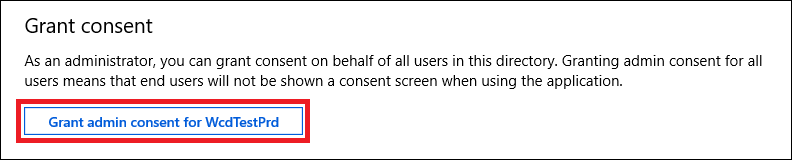

# <a name="use-microsoft-defender-for-endpoint-apis"></a>Verwenden von Microsoft Defender für Endpunkt-APIs

[!INCLUDE [Microsoft 365 Defender rebranding](../../includes/microsoft-defender.md)]


**Gilt für:**
- [Microsoft Defender für Endpunkt](https://go.microsoft.com/fwlink/?linkid=2154037)

> Möchten Sie Microsoft Defender for Endpoint erleben? [Registrieren Sie sich für eine kostenlose Testversion.](https://www.microsoft.com/microsoft-365/windows/microsoft-defender-atp?ocid=docs-wdatp-exposedapis-abovefoldlink)

[!include[Microsoft Defender for Endpoint API URIs for US Government](../../includes/microsoft-defender-api-usgov.md)]

[!include[Improve request performance](../../includes/improve-request-performance.md)]

Auf dieser Seite wird beschrieben, wie Sie eine Anwendung erstellen, um programmgesteuerten Zugriff auf Defender for Endpoint im Auftrag eines Benutzers zu erhalten.

Wenn Sie programmgesteuerten Zugriff auf Microsoft Defender for Endpoint ohne Benutzer benötigen, lesen Sie [Access Microsoft Defender for Endpoint mit Anwendungskontext](exposed-apis-create-app-webapp.md).

Wenn Sie nicht sicher sind, welchen Zugriff Sie benötigen, lesen Sie die [Seite Einführung](apis-intro.md).

Microsoft Defender for Endpoint macht einen Großen Teil seiner Daten und Aktionen über eine Reihe programmgesteuerter APIs verfügbar. Mit diesen APIs können Sie Arbeitsabläufe automatisieren und Innovationen basierend auf Microsoft Defender for Endpoint-Funktionen entwickeln. Für den API-Zugriff ist die OAuth2.0-Authentifizierung erforderlich. Weitere Informationen finden Sie unter [OAuth 2.0 Authorization Code Flow](https://docs.microsoft.com/azure/active-directory/develop/active-directory-v2-protocols-oauth-code).

Im Allgemeinen müssen Sie die folgenden Schritte ausführen, um die APIs zu verwenden:
- Erstellen einer AAD-Anwendung
- Zugreifen auf ein Zugriffstoken mithilfe dieser Anwendung
- Verwenden des Tokens für den Zugriff auf die Defender for Endpoint-API

Auf dieser Seite wird erläutert, wie Sie eine AAD-Anwendung erstellen, ein Zugriffstoken für Microsoft Defender for Endpoint erhalten und das Token überprüfen.

>[!NOTE]
> Wenn Sie im Auftrag eines Benutzers auf die Microsoft Defender for Endpoint-API zugreifen, benötigen Sie die richtige Anwendungs- und Benutzerberechtigung.
> Wenn Sie mit den Benutzerberechtigungen für Microsoft Defender for Endpoint nicht vertraut sind, lesen Sie Verwalten des Portalzugriffs mithilfe [der rollenbasierten Zugriffssteuerung](rbac.md).

>[!TIP]
> Wenn Sie über die Berechtigung zum Ausführen einer Aktion im Portal verfügen, haben Sie die Berechtigung, die Aktion in der API durchzuführen.

## <a name="create-an-app"></a>App erstellen

1. Melden Sie sich [mit einem](https://portal.azure.com) Benutzerkonto mit der Rolle **"Globaler Administrator"** bei Azure an.

2. Navigieren Sie zu **Azure Active Directory**  >  **App-Registrierungen**  >  **Neue Registrierung**. 

   

3. Geben Sie auf der daraufhin angezeigten Seite **Anwendung registrieren** die Registrierungsinformationen für Ihre Anwendung ein:

   - **Name**: Geben Sie einen aussagekräftigen Anwendungsnamen ein, der den Benutzern der App angezeigt wird.
   - **Unterstützte Kontotypen**: Wählen Sie aus, welche Konten von Ihrer Anwendung unterstützt werden sollen.

       | Unterstützte Kontotypen | Beschreibung |
       |-------------------------|-------------|
       | **Nur Konten in diesem Organisationsverzeichnis** | Wählen Sie diese Option aus, wenn Sie eine Branchenanwendung erstellen. Falls Sie die Anwendung nicht in einem Verzeichnis registrieren, ist diese Option nicht verfügbar.<br><br>Diese Option ist für reine Azure AD-Apps mit einem einzelnen Mandanten vorgesehen.<br><br>Sofern Sie die App nicht außerhalb eines Verzeichnisses registrieren, ist dies die Standardoption. Wird die App außerhalb eines Verzeichnisses registriert, werden standardmäßig mehrinstanzenfähige Azure AD-Konten und persönliche Microsoft-Konten verwendet. |
       | **Konten in einem beliebigen Organisationsverzeichnis** | Wählen Sie diese Option, wenn Sie alle Kunden aus dem Unternehmens- und Bildungsbereich ansprechen möchten.<br><br>Diese Option ist für reine Azure AD-Apps mit mehreren Mandanten vorgesehen.<br><br>Wenn Sie die App als reine Azure AD-App mit einem einzelnen Mandanten registriert haben, können Sie sie über das Blatt **Authentifizierung** in eine Azure AD-App mit mehreren Mandanten (und wieder zurück in eine App mit einem einzelnen Mandanten) verwandeln. |
       | **Konten in allen Organisationsverzeichnissen und persönliche Microsoft-Konten** | Verwenden Sie diese Option, um die breiteste Kundengruppe anzusprechen.<br><br>Diese Option ist für Azure AD-Apps mit mehreren Mandanten und für persönliche Microsoft-Konten vorgesehen.<br><br>Wenn Sie die App als Azure AD-App mit mehreren Mandanten und für persönliche Microsoft-Konten registriert haben, können Sie dies über die Benutzeroberfläche nicht ändern. In diesem Fall müssen die unterstützten Kontotypen mithilfe des Anwendungsmanifest-Editors geändert werden. |

   - **Umleitungs-URI (optional)**: Wählen Sie die Art der App aus, die Sie erstellen (**Web** oder **Öffentlicher Client (Mobilgerät und Desktop)**), und geben Sie dann den Umleitungs-URI (oder die Antwort-URL) für Ihre Anwendung ein.
       - Geben Sie für Webanwendungen die Basis-URL Ihrer App an. `http://localhost:31544` kann beispielsweise die URL für eine Web-App sein, die auf einem lokalen Computer ausgeführt wird. Benutzer können diese URL nutzen, um sich an einer Webclientanwendung anzumelden.
       - Geben Sie für öffentliche Clientanwendungen den URI an, der von Azure AD zum Zurückgeben von Tokenantworten verwendet wird. Geben Sie einen für Ihre Anwendung spezifischen Wert ein (beispielsweise `myapp://auth`).

     Spezifische Beispiele für Webanwendungen oder native Anwendungen finden Sie in unseren [Schnellstartanleitungen](/azure/active-directory/develop/#quickstarts).

     Wenn Sie so weit sind, klicken Sie auf **Registrieren**.

4. Erlauben Sie Ihrer Anwendung den Zugriff auf Microsoft Defender for Endpoint, und weisen Sie ihm die Berechtigung "Warnungen lesen" zu:

    - Wählen Sie auf der Anwendungsseite **API-Berechtigungen** Berechtigungs-APIs hinzufügen aus, die meine >  >    >   **WindowsDefenderATP** verwendet, und wählen Sie unter **WindowsDefenderATP aus.**

    - **Hinweis:** *WindowsDefenderATP* wird nicht in der ursprünglichen Liste angezeigt. Beginnen Sie, den Namen in das Textfeld zu schreiben, damit er angezeigt wird.

      

    - Wählen **Sie Delegierte Berechtigungen**  >  **Warnung.Lesezugriff** > Berechtigungen hinzufügen **aus.**

      

    - **Wichtiger Hinweis:** Wählen Sie die relevanten Berechtigungen aus. Lesewarnungen sind nur ein Beispiel.

      Zum Beispiel

      - Wählen [Sie zum Ausführen erweiterter](run-advanced-query-api.md)Abfragen die Berechtigung "Erweiterte Abfragen ausführen" aus.
      - Wählen [Sie zum Isolieren](isolate-machine.md)eines Geräts die Berechtigung "Computer isolieren" aus.
      - Um zu bestimmen, welche Berechtigung Sie benötigen, zeigen Sie den Abschnitt **Berechtigungen** in der API an, die Sie aufrufen möchten.

    - Wählen Sie **Zustimmung erteilen aus**

      **Hinweis**: Jedes Mal, wenn Sie Berechtigungen hinzufügen, müssen Sie die Option **Zustimmung** erteilen auswählen, damit die neue Berechtigung wirksam wird.

      

6. Notieren Sie sich Ihre Anwendungs-ID und Ihre Mandanten-ID:

   - Wechseln Sie auf der Anwendungsseite zu **Übersicht,** und kopieren Sie die folgenden Informationen:

   


## <a name="get-an-access-token"></a>Abrufen eines Zugriffstokens

Weitere Informationen zu AAD-Token finden Sie unter [Azure AD-Lernprogramm.](https://docs.microsoft.com/azure/active-directory/develop/active-directory-v2-protocols-oauth-client-creds)

### <a name="using-c"></a>Verwenden von C #

- Kopieren/Einfügen sie die folgende Klasse in Ihrer Anwendung.
- Verwenden **Sie die AcquireUserTokenAsync-Methode** mit Anwendungs-ID, Mandanten-ID, Benutzername und Kennwort, um ein Token zu erwerben.

    ```csharp
    namespace WindowsDefenderATP
    {
        using System.Net.Http;
        using System.Text;
        using System.Threading.Tasks;
        using Newtonsoft.Json.Linq;

        public static class WindowsDefenderATPUtils
        {
            private const string Authority = "https://login.microsoftonline.com";

            private const string WdatpResourceId = "https://api.securitycenter.microsoft.com";

            public static async Task<string> AcquireUserTokenAsync(string username, string password, string appId, string tenantId)
            {
                using (var httpClient = new HttpClient())
                {
                    var urlEncodedBody = $"resource={WdatpResourceId}&client_id={appId}&grant_type=password&username={username}&password={password}";

                    var stringContent = new StringContent(urlEncodedBody, Encoding.UTF8, "application/x-www-form-urlencoded");

                    using (var response = await httpClient.PostAsync($"{Authority}/{tenantId}/oauth2/token", stringContent).ConfigureAwait(false))
                    {
                        response.EnsureSuccessStatusCode();

                        var json = await response.Content.ReadAsStringAsync().ConfigureAwait(false);

                        var jObject = JObject.Parse(json);

                        return jObject["access_token"].Value<string>();
                    }
                }
            }
        }
    }
    ```

## <a name="validate-the-token"></a>Überprüfen des Tokens

Überprüfen Sie, ob Sie ein richtiges Token erhalten haben:
- Kopieren/Einfügen in [JWT](https://jwt.ms) das Token, das Sie im vorherigen Schritt erhalten haben, um es zu decodieren
- Überprüfen, ob Sie einen "scp"-Anspruch mit den gewünschten App-Berechtigungen erhalten
- Im folgenden Screenshot sehen Sie ein decodiertes Token, das von der App erworben wurde, im Lernprogramm:


## <a name="use-the-token-to-access-microsoft-defender-for-endpoint-api"></a>Verwenden des Tokens für den Zugriff auf Die Microsoft Defender for Endpoint-API

- Auswählen der API, die Sie verwenden möchten – [Unterstützte Microsoft Defender for Endpoint-APIs](exposed-apis-list.md)
- Legen Sie den Autorisierungsheader in der HTTP-Anforderung, die Sie an "Bearer {token}" senden, (Bearer ist das Autorisierungsschema)
- Die Ablaufzeit des Tokens beträgt 1 Stunde (Sie können mehrere Anfragen mit demselben Token senden)

- Beispiel für das Senden einer Anforderung zum Anfordern einer Liste von Warnungen **mithilfe C#** 

    ```csharp
    var httpClient = new HttpClient();

    var request = new HttpRequestMessage(HttpMethod.Get, "https://api.securitycenter.microsoft.com/api/alerts");

    request.Headers.Authorization = new AuthenticationHeaderValue("Bearer", token);

    var response = httpClient.SendAsync(request).GetAwaiter().GetResult();

    // Do something useful with the response
    ```

## <a name="see-also"></a>Siehe auch
- [Microsoft Defender für Endpunkt-APIs](exposed-apis-list.md)
- [Zugreifen auf Microsoft Defender for Endpoint mit Anwendungskontext](exposed-apis-create-app-webapp.md)
