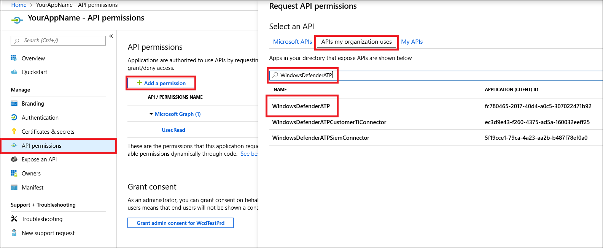

# <a name="partner-access-through-microsoft-defender-for-endpoint-apis"></a>Partnerzugriff über Microsoft Defender für Endpunkt-APIs

[!INCLUDE [Microsoft 365 Defender rebranding](../../includes/microsoft-defender.md)]


**Gilt für:** [Microsoft Defender für Endpunkt](https://go.microsoft.com/fwlink/?linkid=2154037)

> Möchten Sie Microsoft Defender für Endpunkt erleben? [Registrieren Sie sich für eine kostenlose Testversion.](https://www.microsoft.com/microsoft-365/windows/microsoft-defender-atp?ocid=docs-wdatp-exposedapis-abovefoldlink)

[!include[Microsoft Defender for Endpoint API URIs for US Government](../../includes/microsoft-defender-api-usgov.md)]

[!include[Improve request performance](../../includes/improve-request-performance.md)]

Auf dieser Seite wird beschrieben, wie Sie eine Azure Active Directory (Azure AD)-Anwendung erstellen, um programmgesteuerten Zugriff auf Microsoft Defender für Endpunkt im Namen Ihrer Kunden zu erhalten.


Microsoft Defender für Endpunkt macht einen Großteil seiner Daten und Aktionen über eine Reihe programmgesteuerter APIs verfügbar. Diese APIs helfen Ihnen bei der Automatisierung von Arbeitsabläufen und Innovationen basierend auf den Microsoft Defender für Endpunkt-Funktionen. Der API-Zugriff erfordert die OAuth2.0-Authentifizierung. Weitere Informationen finden Sie unter [OAuth 2.0-Autorisierungscode Flow](/azure/active-directory/develop/active-directory-v2-protocols-oauth-code).

Im Allgemeinen müssen Sie die folgenden Schritte ausführen, um die APIs zu verwenden:
- Erstellen Sie eine **mehrinstanzenfähige** Azure AD-Anwendung.
- Lassen Sie sich von Ihrem Kundenadministrator autorisieren(Zustimmung), damit Ihre Anwendung auf die benötigten Defender für Endpunktressourcen zugreifen kann.
- Rufen Sie mit dieser Anwendung ein Zugriffstoken ab.
- Verwenden Sie das Token, um auf die Microsoft Defender für Endpunkt-API zuzugreifen.

In den folgenden Schritten erfahren Sie, wie Sie eine Azure AD-Anwendung erstellen, ein Zugriffstoken für Microsoft Defender für Endpunkt abrufen und das Token überprüfen.

## <a name="create-the-multi-tenant-app"></a>Erstellen der mehrinstanzenfähigen App

1. Melden Sie sich bei Ihrem [Azure-Mandanten](https://portal.azure.com) mit einem Benutzer mit **globaler Administratorrolle** an.

2. Navigieren Sie zu **Azure Active Directory**  >  **App-Registrierungen**  >  **Neuregistrierung.** 

   

3. Im Registrierungsformular:

    - Wählen Sie einen Namen für Ihre Anwendung aus.

    - Unterstützte Kontotypen – Konten in allen Organisationsverzeichnissen.

    - Umleitungs-URI – Typ: Web, URI: https://portal.azure.com

    


4. Erlauben Sie Ihrer Anwendung, auf Microsoft Defender für Endpunkt zuzugreifen, und weisen Sie sie mit den minimalen Berechtigungen zu, die zum Abschließen der Integration erforderlich sind.

   - Wählen Sie auf der Anwendungsseite **"API-Berechtigungen**  >  Berechtigungs-APIs **hinzufügen"** aus, die  >  meine Organisation > Typ **"WindowsDefenderATP"** **verwendet,** und wählen Sie unter **"WindowsDefenderATP"** aus.

   - **Hinweis:** *WindowsDefenderATP* wird nicht in der ursprünglichen Liste angezeigt. Beginnen Sie damit, den Namen in das Textfeld zu schreiben, damit er angezeigt wird.

   
   
   ### <a name="request-api-permissions"></a>API-Berechtigungen anfordern

   Um zu bestimmen, welche Berechtigung Sie benötigen, lesen Sie den Abschnitt **"Berechtigungen"** in der API, die Sie aufrufen möchten. Zum Beispiel:

   - Wählen Sie zum [Ausführen erweiterter Abfragen](run-advanced-query-api.md)die Berechtigung "Erweiterte Abfragen ausführen" aus.
   
   - Wählen Sie zum [Isolieren eines Geräts](isolate-machine.md)die Berechtigung "Computer isolieren" aus.

   Im folgenden Beispiel verwenden wir die Berechtigung **"Alle Warnungen lesen":**

   Choose **Application permissions**  >  **Alert.Read.All** > select on Add **permissions**

   


5. Wählen Sie **"Zustimmung erteilen" aus.**

    - **Hinweis:** Jedes Mal, wenn Sie die Berechtigung hinzufügen, müssen Sie **"Zustimmung erteilen"** auswählen, damit die neue Berechtigung wirksam wird.

    

6. Fügen Sie der Anwendung einen geheimen Schlüssel hinzu.

    - Wählen Sie **Zertifikate & geheimen Schlüssel** aus, fügen Sie dem geheimen Schlüssel eine Beschreibung hinzu, und wählen Sie **Hinzufügen** aus.

    **Wichtig:** Kopieren Sie nach dem Klicken auf "Hinzufügen" **den generierten geheimen Wert.** Sie können nach dem Verlassen nicht mehr abrufen!

    

7. Notieren Sie Ihre Anwendungs-ID:

   - Wechseln Sie auf der Anwendungsseite zu **"Übersicht",** und kopieren Sie die folgenden Informationen:

   

8. Fügen Sie die Anwendung dem Mandanten Ihres Kunden hinzu.

    Ihre Anwendung muss in jedem Kundenmandanten genehmigt werden, in dem Sie sie verwenden möchten. Dies liegt daran, dass Ihre Anwendung im Auftrag Ihres Kunden mit der Microsoft Defender für Endpunkt-Anwendung interagiert.

    Ein Benutzer mit **einem globalen Administrator** aus dem Mandanten Ihres Kunden muss den Zustimmungslink auswählen und Ihre Anwendung genehmigen.

    Der Zustimmungslink hat folgendes Format:

    ```
    https://login.microsoftonline.com/common/oauth2/authorize?prompt=consent&client_id=00000000-0000-0000-0000-000000000000&response_type=code&sso_reload=true
    ```

    Dabei sollte 00000000-0000-0000-0000-000000000000 durch Ihre Anwendungs-ID ersetzt werden.

    Nachdem Sie auf den Zustimmungslink geklickt haben, melden Sie sich beim globalen Administrator des Mandanten des Kunden an, und stimmen Sie der Anwendung zu.

    

    Darüber hinaus müssen Sie Ihren Kunden nach seiner Mandanten-ID fragen und diese für die zukünftige Verwendung beim Erwerb des Tokens speichern.

- **fertig!** Sie haben eine Anwendung erfolgreich registriert! 
- Beispiele für den Erwerb und die Validierung von Token finden Sie weiter unten.

## <a name="get-an-access-token-example"></a>Abrufen eines Zugriffstokenbeispiels:

**Hinweis:** Verwenden Sie zum Abrufen des Zugriffstokens im Namen Ihres Kunden die Mandanten-ID des Kunden für die folgenden Tokenkäufe.

<br>Weitere Informationen zum AAD-Token finden Sie im [AAD-Lernprogramm.](/azure/active-directory/develop/active-directory-v2-protocols-oauth-client-creds)

### <a name="using-powershell"></a>Verwendung von PowerShell

```
# That code gets the App Context Token and save it to a file named "Latest-token.txt" under the current directory
# Paste below your Tenant ID, App ID and App Secret (App key).

$tenantId = '' ### Paste your tenant ID here
$appId = '' ### Paste your Application ID here
$appSecret = '' ### Paste your Application key here

$resourceAppIdUri = 'https://api.securitycenter.microsoft.com'
$oAuthUri = "https://login.microsoftonline.com/$TenantId/oauth2/token"
$authBody = [Ordered] @{
    resource = "$resourceAppIdUri"
    client_id = "$appId"
    client_secret = "$appSecret"
    grant_type = 'client_credentials'
}
$authResponse = Invoke-RestMethod -Method Post -Uri $oAuthUri -Body $authBody -ErrorAction Stop
$token = $authResponse.access_token
Out-File -FilePath "./Latest-token.txt" -InputObject $token
return $token
```

### <a name="using-c"></a>Verwenden von C#:

>Der folgende Code wurde mit Nuget Microsoft.IdentityModel.Clients.ActiveDirectory getestet.

- Erstellen einer neuen Konsolenanwendung
- Installieren NuGet [Microsoft.IdentityModel.Clients.ActiveDirectory](https://www.nuget.org/packages/Microsoft.IdentityModel.Clients.ActiveDirectory/)
- Fügen Sie die folgenden Mithilfe von

    ```
    using Microsoft.IdentityModel.Clients.ActiveDirectory;
    ```

- Kopieren/Fügen Sie den folgenden Code in Ihre Anwendung ein (vergessen Sie nicht, die drei Variablen zu aktualisieren: ```tenantId, appId, appSecret``` )

    ```
    string tenantId = "00000000-0000-0000-0000-000000000000"; // Paste your own tenant ID here
    string appId = "11111111-1111-1111-1111-111111111111"; // Paste your own app ID here
    string appSecret = "22222222-2222-2222-2222-222222222222"; // Paste your own app secret here for a test, and then store it in a safe place! 

    const string authority = "https://login.microsoftonline.com";
    const string wdatpResourceId = "https://api.securitycenter.microsoft.com";

    AuthenticationContext auth = new AuthenticationContext($"{authority}/{tenantId}/");
    ClientCredential clientCredential = new ClientCredential(appId, appSecret);
    AuthenticationResult authenticationResult = auth.AcquireTokenAsync(wdatpResourceId, clientCredential).GetAwaiter().GetResult();
    string token = authenticationResult.AccessToken;
    ```


### <a name="using-python"></a>Verwenden von Python

Weitere Informationen finden Sie unter [Abrufen von Token mit Python](run-advanced-query-sample-python.md#get-token)

### <a name="using-curl"></a>Verwenden von Curl

> [!NOTE]
> Das folgende Verfahren soll Curl für Windows bereits auf Ihrem Computer installiert sein.

- Öffnen eines Befehlsfensters
- Festlegen CLIENT_ID auf Ihre Azure-Anwendungs-ID
- Festlegen CLIENT_SECRET auf ihren geheimen Azure-Anwendungsschlüssel
- Legen Sie TENANT_ID auf die Azure-Mandanten-ID des Kunden fest, der Ihre Anwendung für den Zugriff auf die Microsoft Defender für Endpunkt-Anwendung verwenden möchte.
- Führen Sie den folgenden Befehl aus:

```
curl -i -X POST -H "Content-Type:application/x-www-form-urlencoded" -d "grant_type=client_credentials" -d "client_id=%CLIENT_ID%" -d "scope=https://securitycenter.onmicrosoft.com/windowsatpservice/.default" -d "client_secret=%CLIENT_SECRET%" "https://login.microsoftonline.com/%TENANT_ID%/oauth2/v2.0/token" -k
```

Sie erhalten eine Antwort auf das Formular:

```
{"token_type":"Bearer","expires_in":3599,"ext_expires_in":0,"access_token":"eyJ0eXAiOiJKV1QiLCJhbGciOiJSUzI1NiIsIn <truncated> aWReH7P0s0tjTBX8wGWqJUdDA"}
```

## <a name="validate-the-token"></a>Überprüfen des Tokens

Überprüfen Sie die Empfindlichkeit, um sicherzustellen, dass Sie ein korrektes Token erhalten haben:
- Kopieren/Einfügen des Tokens, das Sie im vorherigen Schritt erhalten haben, in [JWT,](https://jwt.ms) um es zu decodieren
- Überprüfen, ob Sie einen "Rollen"-Anspruch mit den gewünschten Berechtigungen erhalten
- Im folgenden Screenshot sehen Sie ein decodiertes Token, das von einer Anwendung mit mehreren Berechtigungen für Microsoft Defender für Endpunkt erworben wurde:
- Der Anspruch "tid" ist die Mandanten-ID, zu der das Token gehört.


## <a name="use-the-token-to-access-microsoft-defender-for-endpoint-api"></a>Verwenden des Tokens für den Zugriff auf die Microsoft Defender für Endpunkt-API

- Wählen Sie die API aus, die Sie verwenden möchten. Weitere Informationen finden Sie unter ["Unterstützte Microsoft Defender für Endpunkt-APIs".](exposed-apis-list.md)
- Legen Sie den Autorisierungsheader in der http-Anforderung, die Sie senden, auf "Bearer {token}" fest (Bearer ist das Autorisierungsschema)
- Die Ablaufzeit des Tokens beträgt 1 Stunde (Sie können mehr als eine Anforderung mit demselben Token senden)

- Beispiel für das Senden einer Anforderung zum Abrufen einer Liste von Warnungen **mit C#** 
    ```
    var httpClient = new HttpClient();

    var request = new HttpRequestMessage(HttpMethod.Get, "https://api.securitycenter.microsoft.com/api/alerts");

    request.Headers.Authorization = new AuthenticationHeaderValue("Bearer", token);

    var response = httpClient.SendAsync(request).GetAwaiter().GetResult();

    // Do something useful with the response
    ```

## <a name="see-also"></a>Siehe auch
- [Unterstütze Microsoft Defender für Endpoint-APIs](exposed-apis-list.md)
- [Zugreifen auf Microsoft Defender für Endpunkt im Namen eines Benutzers](exposed-apis-create-app-nativeapp.md)
