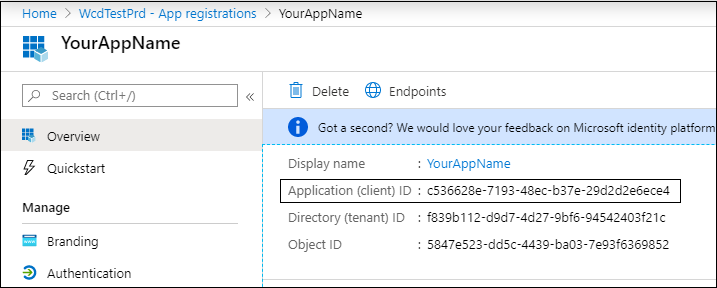

# <a name="partner-access-through-microsoft-defender-for-endpoint-apis"></a>Partnerzugriff über Microsoft Defender for Endpoint-APIs

[!INCLUDE [Microsoft 365 Defender rebranding](../../includes/microsoft-defender.md)]


**Gilt für:** [Microsoft Defender for Endpoint](https://go.microsoft.com/fwlink/?linkid=2154037)

> Möchten Sie Microsoft Defender for Endpoint erleben? [Registrieren Sie sich für eine kostenlose Testversion.](https://www.microsoft.com/microsoft-365/windows/microsoft-defender-atp?ocid=docs-wdatp-exposedapis-abovefoldlink)

[!include[Microsoft Defender for Endpoint API URIs for US Government](../../includes/microsoft-defender-api-usgov.md)]

[!include[Improve request performance](../../includes/improve-request-performance.md)]

Auf dieser Seite wird beschrieben, wie Sie eine Azure Active Directory (Azure AD) erstellen, um im Auftrag Ihrer Kunden programmgesteuerten Zugriff auf Microsoft Defender for Endpoint zu erhalten.


Microsoft Defender for Endpoint macht einen Großen Teil seiner Daten und Aktionen über eine Reihe programmgesteuerter APIs verfügbar. Diese APIs helfen Ihnen, Arbeitsabläufe zu automatisieren und Innovationen basierend auf Microsoft Defender for Endpoint-Funktionen zu entwickeln. Für den API-Zugriff ist die OAuth2.0-Authentifizierung erforderlich. Weitere Informationen finden Sie unter [OAuth 2.0 Authorization Code Flow](https://docs.microsoft.com/azure/active-directory/develop/active-directory-v2-protocols-oauth-code).

Im Allgemeinen müssen Sie die folgenden Schritte ausführen, um die APIs zu verwenden:
- Erstellen Sie **eine azure AD-Anwendung mit** mehreren Mandanten.
- Holen Sie sich von Ihrem Kundenadministrator autorisierte(Zustimmung) für Ihre Anwendung, um auf die benötigten Defender for Endpoint-Ressourcen zu zugreifen.
- Mit dieser Anwendung können Sie ein Zugriffstoken erhalten.
- Verwenden Sie das Token, um auf die Microsoft Defender for Endpoint-API zu zugreifen.

In den folgenden Schritten erfahren Sie, wie Sie eine Azure AD-Anwendung erstellen, ein Zugriffstoken für Microsoft Defender for Endpoint erhalten und das Token überprüfen.

## <a name="create-the-multi-tenant-app"></a>Erstellen der Mehr-Mandanten-App

1. Melden Sie sich bei Ihrem [Azure-Mandanten](https://portal.azure.com) mit einem Benutzer mit **globaler Administratorrolle** an.

2. Navigieren Sie zu **Azure Active Directory**  >  **App-Registrierungen**  >  **Neue Registrierung**. 

   

3. Im Registrierungsformular:

    - Wählen Sie einen Namen für Ihre Anwendung aus.

    - Unterstützte Kontotypen – Konten in einem beliebigen Organisationsverzeichnis.

    - Umleitungs-URI - Typ: Web, URI: https://portal.azure.com

    


4. Ermöglichen Sie Ihrer Anwendung den Zugriff auf Microsoft Defender for Endpoint, und weisen Sie sie mit den minimalen Berechtigungen zu, die zum Abschließen der Integration erforderlich sind.

   - Wählen Sie auf der Anwendungsseite **API-Berechtigungen** Berechtigungs-APIs hinzufügen aus, die meine >  >    >   **WindowsDefenderATP** verwendet, und wählen Sie unter **WindowsDefenderATP aus.**

   - **Hinweis:** *WindowsDefenderATP* wird nicht in der ursprünglichen Liste angezeigt. Beginnen Sie, den Namen in das Textfeld zu schreiben, damit er angezeigt wird.

   
   
   ### <a name="request-api-permissions"></a>Anfordern von API-Berechtigungen

   Um zu bestimmen, welche Berechtigung Sie benötigen, lesen Sie den Abschnitt **Berechtigungen** in der API, die Sie aufrufen möchten. Zum Beispiel:

   - Wählen [Sie zum Ausführen erweiterter](run-advanced-query-api.md)Abfragen die Berechtigung "Erweiterte Abfragen ausführen" aus.
   
   - Wählen [Sie zum Isolieren](isolate-machine.md)eines Geräts die Berechtigung "Computer isolieren" aus.

   Im folgenden Beispiel verwenden wir die Berechtigung **"Alle Warnungen lesen":**

   Wählen **Sie Anwendungsberechtigungen**  >  **Alert.Read.All >** wählen Sie unter Berechtigungen hinzufügen **aus.**

   


5. Wählen Sie **Zustimmung erteilen aus**

    - **Hinweis**: Jedes Mal, wenn Sie Berechtigungen hinzufügen, müssen Sie die Option **Zustimmung** erteilen auswählen, damit die neue Berechtigung wirksam wird.

    

6. Fügen Sie der Anwendung einen geheimen Schlüssel hinzu.

    - Wählen **Sie Zertifikate & Schlüssel** aus, fügen Sie dem Geheimen eine Beschreibung hinzu, und wählen Sie Hinzufügen **aus.**

    **Wichtig:** Kopieren Sie nach dem Klicken auf Hinzufügen **den generierten geheimen Wert**. Sie können nach dem Verlassen nicht mehr abrufen!

    

7. Notieren Sie sich Ihre Anwendungs-ID:

   - Wechseln Sie auf der Anwendungsseite zu **Übersicht,** und kopieren Sie die folgenden Informationen:

   

8. Fügen Sie die Anwendung dem Mandanten Ihres Kunden hinzu.

    Sie müssen Ihre Anwendung in jedem Kunden mandanten, in dem Sie sie verwenden möchten, genehmigt werden. Dies liegt daran, dass Ihre Anwendung im Auftrag Ihres Kunden mit der Microsoft Defender for Endpoint-Anwendung interagiert.

    Ein Benutzer mit **dem globalen Administrator** des Mandanten Ihres Kunden muss den Zustimmungslink auswählen und Ihre Anwendung genehmigen.

    Der Zustimmungslink hat das Format:

    ```
    https://login.microsoftonline.com/common/oauth2/authorize?prompt=consent&client_id=00000000-0000-0000-0000-000000000000&response_type=code&sso_reload=true
    ```

    Dabei sollte 000000000-0000-0000-0000-000000000000 durch Ihre Anwendungs-ID ersetzt werden

    Nachdem Sie auf den Zustimmungslink geklickt haben, melden Sie sich beim globalen Administrator des Mandanten des Kunden an, und stimmen Sie der Anwendung zu.

    

    Darüber hinaus müssen Sie Ihren Kunden nach seiner Mandanten-ID fragen und diese für die zukünftige Verwendung beim Erwerb des Tokens speichern.

- **Fertig!** Sie haben eine Anwendung erfolgreich registriert! 
- Weitere Informationen zum Erwerb und zur Überprüfung von Token finden Sie in den folgenden Beispielen.

## <a name="get-an-access-token-example"></a>Beispiel für ein Zugriffstoken:

**Hinweis:** Verwenden Sie die Mandanten-ID des Kunden für die folgenden Tokenkäufe, um zugriffstoken im Namen Ihres Kunden abzurufen.

<br>Weitere Informationen zum AAD-Token finden Sie unter [AAD-Lernprogramm](https://docs.microsoft.com/azure/active-directory/develop/active-directory-v2-protocols-oauth-client-creds)

### <a name="using-powershell"></a>Verwendung von PowerShell

```
# That code gets the App Context Token and save it to a file named "Latest-token.txt" under the current directory
# Paste below your Tenant ID, App ID and App Secret (App key).

$tenantId = '' ### Paste your tenant ID here
$appId = '' ### Paste your Application ID here
$appSecret = '' ### Paste your Application key here

$resourceAppIdUri = 'https://api.securitycenter.microsoft.com'
$oAuthUri = "https://login.microsoftonline.com/$TenantId/oauth2/token"
$authBody = [Ordered] @{
    resource = "$resourceAppIdUri"
    client_id = "$appId"
    client_secret = "$appSecret"
    grant_type = 'client_credentials'
}
$authResponse = Invoke-RestMethod -Method Post -Uri $oAuthUri -Body $authBody -ErrorAction Stop
$token = $authResponse.access_token
Out-File -FilePath "./Latest-token.txt" -InputObject $token
return $token
```

### <a name="using-c"></a>Verwenden C#:

>Der folgende Code wurde mit Nuget Microsoft.IdentityModel.Clients.ActiveDirectory getestet.

- Erstellen einer neuen Konsolenanwendung
- Installieren NuGet [Microsoft.IdentityModel.Clients.ActiveDirectory](https://www.nuget.org/packages/Microsoft.IdentityModel.Clients.ActiveDirectory/)
- Fügen Sie die unten aufgeführten Mithilfe hinzu

    ```
    using Microsoft.IdentityModel.Clients.ActiveDirectory;
    ```

- Kopieren/Einfügen sie den folgenden Code in Ihrer Anwendung (vergessen Sie nicht, die drei Variablen zu aktualisieren: ```tenantId, appId, appSecret``` )

    ```
    string tenantId = "00000000-0000-0000-0000-000000000000"; // Paste your own tenant ID here
    string appId = "11111111-1111-1111-1111-111111111111"; // Paste your own app ID here
    string appSecret = "22222222-2222-2222-2222-222222222222"; // Paste your own app secret here for a test, and then store it in a safe place! 

    const string authority = "https://login.microsoftonline.com";
    const string wdatpResourceId = "https://api.securitycenter.microsoft.com";

    AuthenticationContext auth = new AuthenticationContext($"{authority}/{tenantId}/");
    ClientCredential clientCredential = new ClientCredential(appId, appSecret);
    AuthenticationResult authenticationResult = auth.AcquireTokenAsync(wdatpResourceId, clientCredential).GetAwaiter().GetResult();
    string token = authenticationResult.AccessToken;
    ```


### <a name="using-python"></a>Verwenden von Python

Weitere Informationen [finden Sie unter Token mithilfe von Python erhalten](run-advanced-query-sample-python.md#get-token)

### <a name="using-curl"></a>Verwenden von Locken

> [!NOTE]
> Das folgende Verfahren, das als "Locken für Windows" angenommen wird, ist bereits auf Ihrem Computer installiert.

- Öffnen eines Befehlsfensters
- Festlegen CLIENT_ID auf Ihre Azure-Anwendungs-ID
- Festlegen CLIENT_SECRET auf Ihren geheimen Azure-Anwendungsgeheimnis
- Legen TENANT_ID auf die Azure-Mandanten-ID des Kunden fest, der Ihre Anwendung für den Zugriff auf Microsoft Defender for Endpoint-Anwendung verwenden möchte
- Führen Sie den folgenden Befehl aus:

```
curl -i -X POST -H "Content-Type:application/x-www-form-urlencoded" -d "grant_type=client_credentials" -d "client_id=%CLIENT_ID%" -d "scope=https://securitycenter.onmicrosoft.com/windowsatpservice/.default" -d "client_secret=%CLIENT_SECRET%" "https://login.microsoftonline.com/%TENANT_ID%/oauth2/v2.0/token" -k
```

Sie erhalten eine Antwort auf das Formular:

```
{"token_type":"Bearer","expires_in":3599,"ext_expires_in":0,"access_token":"eyJ0eXAiOiJKV1QiLCJhbGciOiJSUzI1NiIsIn <truncated> aWReH7P0s0tjTBX8wGWqJUdDA"}
```

## <a name="validate-the-token"></a>Überprüfen des Tokens

Überprüfen Sie die Ordnung, um sicherzustellen, dass Sie ein richtiges Token erhalten haben:
- Kopieren/Einfügen in [JWT](https://jwt.ms) das Token, das Sie im vorherigen Schritt erhalten, um es zu decodieren
- Überprüfen, ob Sie einen "Rollen"-Anspruch mit den gewünschten Berechtigungen erhalten
- Im folgenden Screenshot sehen Sie ein decodiertes Token, das von einer Anwendung mit mehreren Berechtigungen für Microsoft Defender for Endpoint erworben wurde:
- Der Anspruch "tid" ist die Mandanten-ID, zu der das Token gehört.


## <a name="use-the-token-to-access-microsoft-defender-for-endpoint-api"></a>Verwenden des Tokens für den Zugriff auf Die Microsoft Defender for Endpoint-API

- Wählen Sie die API aus, die Sie verwenden möchten, weitere Informationen finden Sie unter [Supported Microsoft Defender for Endpoint APIs.](exposed-apis-list.md)
- Legen Sie den Autorisierungsheader in der Http-Anforderung, die Sie an "Bearer {token}" senden, (Bearer ist das Autorisierungsschema)
- Die Ablaufzeit des Tokens beträgt 1 Stunde (Sie können mehrere Anfragen mit demselben Token senden)

- Beispiel für das Senden einer Anforderung zum Anfordern einer Liste von Warnungen **mithilfe C#** 
    ```
    var httpClient = new HttpClient();

    var request = new HttpRequestMessage(HttpMethod.Get, "https://api.securitycenter.microsoft.com/api/alerts");

    request.Headers.Authorization = new AuthenticationHeaderValue("Bearer", token);

    var response = httpClient.SendAsync(request).GetAwaiter().GetResult();

    // Do something useful with the response
    ```

## <a name="see-also"></a>Siehe auch
- [Unterstütze Microsoft Defender für Endpoint-APIs](exposed-apis-list.md)
- [Zugreifen auf Microsoft Defender for Endpoint im Namen eines Benutzers](exposed-apis-create-app-nativeapp.md)
