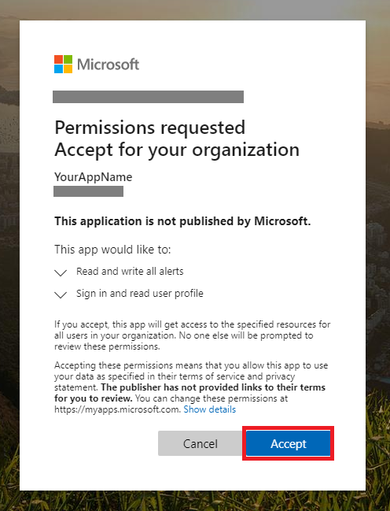

# <a name="partner-access-through-microsoft-defender-for-endpoint-apis"></a><span data-ttu-id="d66a1-104">Partnerzugriff über Microsoft Defender für Endpunkt-APIs</span><span class="sxs-lookup"><span data-stu-id="d66a1-104">Partner access through Microsoft Defender for Endpoint APIs</span></span>

[!INCLUDE [Microsoft 365 Defender rebranding](../../includes/microsoft-defender.md)]


<span data-ttu-id="d66a1-105">**Gilt für:** [Microsoft Defender für Endpunkt](https://go.microsoft.com/fwlink/?linkid=2154037)</span><span class="sxs-lookup"><span data-stu-id="d66a1-105">**Applies to:** [Microsoft Defender for Endpoint](https://go.microsoft.com/fwlink/?linkid=2154037)</span></span>

> <span data-ttu-id="d66a1-106">Möchten Sie Microsoft Defender für Endpunkt erleben?</span><span class="sxs-lookup"><span data-stu-id="d66a1-106">Want to experience Microsoft Defender for Endpoint?</span></span> [<span data-ttu-id="d66a1-107">Registrieren Sie sich für eine kostenlose Testversion</span><span class="sxs-lookup"><span data-stu-id="d66a1-107">Sign up for a free trial.</span></span>](https://www.microsoft.com/microsoft-365/windows/microsoft-defender-atp?ocid=docs-wdatp-exposedapis-abovefoldlink)

[!include[Microsoft Defender for Endpoint API URIs for US Government](../../includes/microsoft-defender-api-usgov.md)]

[!include[Improve request performance](../../includes/improve-request-performance.md)]

<span data-ttu-id="d66a1-108">Auf dieser Seite wird beschrieben, wie Sie eine Azure Active Directory (Azure AD)-Anwendung erstellen, um programmgesteuerten Zugriff auf Microsoft Defender für Endpunkt im Namen Ihrer Kunden zu erhalten.</span><span class="sxs-lookup"><span data-stu-id="d66a1-108">This page describes how to create an Azure Active Directory (Azure AD) application to get programmatic access to Microsoft Defender for Endpoint on behalf of your customers.</span></span>


<span data-ttu-id="d66a1-109">Microsoft Defender für Endpunkt macht einen Großteil seiner Daten und Aktionen über eine Reihe programmgesteuerter APIs verfügbar.</span><span class="sxs-lookup"><span data-stu-id="d66a1-109">Microsoft Defender for Endpoint exposes much of its data and actions through a set of programmatic APIs.</span></span> <span data-ttu-id="d66a1-110">Diese APIs helfen Ihnen bei der Automatisierung von Arbeitsabläufen und Innovationen basierend auf den Microsoft Defender für Endpunkt-Funktionen.</span><span class="sxs-lookup"><span data-stu-id="d66a1-110">Those APIs will help you automate work flows and innovate based on Microsoft Defender for Endpoint capabilities.</span></span> <span data-ttu-id="d66a1-111">Der API-Zugriff erfordert die OAuth2.0-Authentifizierung.</span><span class="sxs-lookup"><span data-stu-id="d66a1-111">The API access requires OAuth2.0 authentication.</span></span> <span data-ttu-id="d66a1-112">Weitere Informationen finden Sie unter [OAuth 2.0-Autorisierungscode Flow](/azure/active-directory/develop/active-directory-v2-protocols-oauth-code).</span><span class="sxs-lookup"><span data-stu-id="d66a1-112">For more information, see [OAuth 2.0 Authorization Code Flow](/azure/active-directory/develop/active-directory-v2-protocols-oauth-code).</span></span>

<span data-ttu-id="d66a1-113">Im Allgemeinen müssen Sie die folgenden Schritte ausführen, um die APIs zu verwenden:</span><span class="sxs-lookup"><span data-stu-id="d66a1-113">In general, you’ll need to take the following steps to use the APIs:</span></span>
- <span data-ttu-id="d66a1-114">Erstellen Sie eine **mehrinstanzenfähige** Azure AD-Anwendung.</span><span class="sxs-lookup"><span data-stu-id="d66a1-114">Create a **multi-tenant** Azure AD application.</span></span>
- <span data-ttu-id="d66a1-115">Lassen Sie sich von Ihrem Kundenadministrator autorisieren(Zustimmung), damit Ihre Anwendung auf die benötigten Defender für Endpunktressourcen zugreifen kann.</span><span class="sxs-lookup"><span data-stu-id="d66a1-115">Get authorized(consent) by your customer administrator for your application to access Defender for Endpoint resources it needs.</span></span>
- <span data-ttu-id="d66a1-116">Rufen Sie mit dieser Anwendung ein Zugriffstoken ab.</span><span class="sxs-lookup"><span data-stu-id="d66a1-116">Get an access token using this application.</span></span>
- <span data-ttu-id="d66a1-117">Verwenden Sie das Token, um auf die Microsoft Defender für Endpunkt-API zuzugreifen.</span><span class="sxs-lookup"><span data-stu-id="d66a1-117">Use the token to access Microsoft Defender for Endpoint API.</span></span>

<span data-ttu-id="d66a1-118">In den folgenden Schritten erfahren Sie, wie Sie eine Azure AD-Anwendung erstellen, ein Zugriffstoken für Microsoft Defender für Endpunkt abrufen und das Token überprüfen.</span><span class="sxs-lookup"><span data-stu-id="d66a1-118">The following steps will guide you how to create an Azure AD application, get an access token to Microsoft Defender for Endpoint and validate the token.</span></span>

## <a name="create-the-multi-tenant-app"></a><span data-ttu-id="d66a1-119">Erstellen der mehrinstanzenfähigen App</span><span class="sxs-lookup"><span data-stu-id="d66a1-119">Create the multi-tenant app</span></span>

1. <span data-ttu-id="d66a1-120">Melden Sie sich bei Ihrem [Azure-Mandanten](https://portal.azure.com) mit einem Benutzer mit **globaler Administratorrolle** an.</span><span class="sxs-lookup"><span data-stu-id="d66a1-120">Sign in to your [Azure tenant](https://portal.azure.com) with user that has **Global Administrator** role.</span></span>

2. <span data-ttu-id="d66a1-121">Navigieren Sie zu **Azure Active Directory**  >  **App-Registrierungen**  >  **Neuregistrierung.**</span><span class="sxs-lookup"><span data-stu-id="d66a1-121">Navigate to **Azure Active Directory** > **App registrations** > **New registration**.</span></span> 

   

3. <span data-ttu-id="d66a1-123">Im Registrierungsformular:</span><span class="sxs-lookup"><span data-stu-id="d66a1-123">In the registration form:</span></span>

   - <span data-ttu-id="d66a1-124">Wählen Sie einen Namen für Ihre Anwendung aus.</span><span class="sxs-lookup"><span data-stu-id="d66a1-124">Choose a name for your application.</span></span>

   - <span data-ttu-id="d66a1-125">Unterstützte Kontotypen – Konten in allen Organisationsverzeichnissen.</span><span class="sxs-lookup"><span data-stu-id="d66a1-125">Supported account types - accounts in any organizational directory.</span></span>

   - <span data-ttu-id="d66a1-126">Umleitungs-URI – Typ: Web, URI: https://portal.azure.com</span><span class="sxs-lookup"><span data-stu-id="d66a1-126">Redirect URI - type: Web, URI: https://portal.azure.com</span></span>

   


4. <span data-ttu-id="d66a1-128">Erlauben Sie Ihrer Anwendung, auf Microsoft Defender für Endpunkt zuzugreifen, und weisen Sie sie mit den minimalen Berechtigungen zu, die zum Abschließen der Integration erforderlich sind.</span><span class="sxs-lookup"><span data-stu-id="d66a1-128">Allow your Application to access Microsoft Defender for Endpoint and assign it with the minimal set of permissions required to complete the integration.</span></span>

   - <span data-ttu-id="d66a1-129">Wählen Sie auf der Anwendungsseite **API-Berechtigungen** Hinzufügen von Berechtigungs-APIs aus, die  >    >  meine Organisation > Typ **WindowsDefenderATP** **verwendet,** und wählen Sie **unter WindowsDefenderATP** aus.</span><span class="sxs-lookup"><span data-stu-id="d66a1-129">On your application page, select **API Permissions** > **Add permission** > **APIs my organization uses** > type **WindowsDefenderATP** and select on **WindowsDefenderATP**.</span></span>

   - <span data-ttu-id="d66a1-130">**Hinweis:** *WindowsDefenderATP* wird nicht in der ursprünglichen Liste angezeigt.</span><span class="sxs-lookup"><span data-stu-id="d66a1-130">**Note**: *WindowsDefenderATP* does not appear in the original list.</span></span> <span data-ttu-id="d66a1-131">Beginnen Sie damit, den Namen in das Textfeld zu schreiben, damit er angezeigt wird.</span><span class="sxs-lookup"><span data-stu-id="d66a1-131">Start writing its name in the text box to see it appear.</span></span>

   
   
   ### <a name="request-api-permissions"></a><span data-ttu-id="d66a1-133">API-Berechtigungen anfordern</span><span class="sxs-lookup"><span data-stu-id="d66a1-133">Request API permissions</span></span>

   <span data-ttu-id="d66a1-134">Um zu bestimmen, welche Berechtigung Sie benötigen, lesen Sie den Abschnitt **"Berechtigungen"** in der API, die Sie aufrufen möchten.</span><span class="sxs-lookup"><span data-stu-id="d66a1-134">To determine which permission you need, review the **Permissions** section in the API you are interested to call.</span></span> <span data-ttu-id="d66a1-135">Zum Beispiel:</span><span class="sxs-lookup"><span data-stu-id="d66a1-135">For instance:</span></span>

   - <span data-ttu-id="d66a1-136">Wählen Sie zum [Ausführen erweiterter Abfragen](run-advanced-query-api.md)die Berechtigung "Erweiterte Abfragen ausführen" aus.</span><span class="sxs-lookup"><span data-stu-id="d66a1-136">To [run advanced queries](run-advanced-query-api.md), select 'Run advanced queries' permission</span></span>
   
   - <span data-ttu-id="d66a1-137">Wählen Sie zum [Isolieren eines Geräts](isolate-machine.md)die Berechtigung "Computer isolieren" aus.</span><span class="sxs-lookup"><span data-stu-id="d66a1-137">To [isolate a device](isolate-machine.md), select 'Isolate machine' permission</span></span>

   <span data-ttu-id="d66a1-138">Im folgenden Beispiel verwenden wir die Berechtigung **"Alle Warnungen lesen":**</span><span class="sxs-lookup"><span data-stu-id="d66a1-138">In the following example we will use **'Read all alerts'** permission:</span></span>

   <span data-ttu-id="d66a1-139">Choose **Application permissions**  >  **Alert.Read.All** > select on Add **permissions**</span><span class="sxs-lookup"><span data-stu-id="d66a1-139">Choose **Application permissions** > **Alert.Read.All** > select on **Add permissions**</span></span>

   


5. <span data-ttu-id="d66a1-141">Wählen Sie **"Zustimmung erteilen" aus.**</span><span class="sxs-lookup"><span data-stu-id="d66a1-141">Select **Grant consent**</span></span>

   - <span data-ttu-id="d66a1-142">**Hinweis:** Jedes Mal, wenn Sie die Berechtigung hinzufügen, müssen Sie **"Zustimmung erteilen"** auswählen, damit die neue Berechtigung wirksam wird.</span><span class="sxs-lookup"><span data-stu-id="d66a1-142">**Note**: Every time you add permission you must select on **Grant consent** for the new permission to take effect.</span></span>

   

6. <span data-ttu-id="d66a1-144">Fügen Sie der Anwendung einen geheimen Schlüssel hinzu.</span><span class="sxs-lookup"><span data-stu-id="d66a1-144">Add a secret to the application.</span></span>

   - <span data-ttu-id="d66a1-145">Wählen Sie **Zertifikate & geheimen Schlüssel** aus, fügen Sie dem geheimen Schlüssel eine Beschreibung hinzu, und wählen Sie **"Hinzufügen"** aus.</span><span class="sxs-lookup"><span data-stu-id="d66a1-145">Select **Certificates & secrets**, add description to the secret and select **Add**.</span></span>

    <span data-ttu-id="d66a1-146">**Wichtig:** Kopieren Sie nach dem Klicken auf "Hinzufügen" **den generierten geheimen Wert.**</span><span class="sxs-lookup"><span data-stu-id="d66a1-146">**Important**: After click Add, **copy the generated secret value**.</span></span> <span data-ttu-id="d66a1-147">Sie können nach dem Verlassen nicht mehr abrufen!</span><span class="sxs-lookup"><span data-stu-id="d66a1-147">You won't be able to retrieve after you leave!</span></span>

    

7. <span data-ttu-id="d66a1-149">Notieren Sie Ihre Anwendungs-ID:</span><span class="sxs-lookup"><span data-stu-id="d66a1-149">Write down your application ID:</span></span>

   - <span data-ttu-id="d66a1-150">Wechseln Sie auf der Anwendungsseite zu **"Übersicht",** und kopieren Sie die folgenden Informationen:</span><span class="sxs-lookup"><span data-stu-id="d66a1-150">On your application page, go to **Overview** and copy the following information:</span></span>

   

8. <span data-ttu-id="d66a1-152">Fügen Sie die Anwendung dem Mandanten Ihres Kunden hinzu.</span><span class="sxs-lookup"><span data-stu-id="d66a1-152">Add the application to your customer's tenant.</span></span>

   <span data-ttu-id="d66a1-153">Ihre Anwendung muss in jedem Kundenmandanten genehmigt werden, in dem Sie sie verwenden möchten.</span><span class="sxs-lookup"><span data-stu-id="d66a1-153">You need your application to be approved in each customer tenant where you intend to use it.</span></span> <span data-ttu-id="d66a1-154">Dies liegt daran, dass Ihre Anwendung im Auftrag Ihres Kunden mit der Microsoft Defender für Endpunkt-Anwendung interagiert.</span><span class="sxs-lookup"><span data-stu-id="d66a1-154">This is because your application interacts with Microsoft Defender for Endpoint application on behalf of your customer.</span></span>

   <span data-ttu-id="d66a1-155">Ein Benutzer mit **einem globalen Administrator** aus dem Mandanten Ihres Kunden muss den Zustimmungslink auswählen und Ihre Anwendung genehmigen.</span><span class="sxs-lookup"><span data-stu-id="d66a1-155">A user with **Global Administrator** from your customer's tenant need to select the consent link and approve your application.</span></span>

   <span data-ttu-id="d66a1-156">Der Zustimmungslink hat folgendes Format:</span><span class="sxs-lookup"><span data-stu-id="d66a1-156">Consent link is of the form:</span></span>

   ```http
   https://login.microsoftonline.com/common/oauth2/authorize?prompt=consent&client_id=00000000-0000-0000-0000-000000000000&response_type=code&sso_reload=true
   ```

   <span data-ttu-id="d66a1-157">Dabei sollte 00000000-0000-0000-0000-000000000000 durch Ihre Anwendungs-ID ersetzt werden.</span><span class="sxs-lookup"><span data-stu-id="d66a1-157">Where 00000000-0000-0000-0000-000000000000 should be replaced with your Application ID</span></span>

   <span data-ttu-id="d66a1-158">Nachdem Sie auf den Zustimmungslink geklickt haben, melden Sie sich beim globalen Administrator des Mandanten des Kunden an, und stimmen Sie der Anwendung zu.</span><span class="sxs-lookup"><span data-stu-id="d66a1-158">After clicking on the consent link, sign in with the Global Administrator of the customer's tenant and consent the application.</span></span>

   

   <span data-ttu-id="d66a1-160">Darüber hinaus müssen Sie Ihren Kunden nach seiner Mandanten-ID fragen und diese für die zukünftige Verwendung beim Erwerb des Tokens speichern.</span><span class="sxs-lookup"><span data-stu-id="d66a1-160">In addition, you will need to ask your customer for their tenant ID and save it for future use when acquiring the token.</span></span>

- <span data-ttu-id="d66a1-161">**fertig!**</span><span class="sxs-lookup"><span data-stu-id="d66a1-161">**Done!**</span></span> <span data-ttu-id="d66a1-162">Sie haben eine Anwendung erfolgreich registriert!</span><span class="sxs-lookup"><span data-stu-id="d66a1-162">You have successfully registered an application!</span></span>
- <span data-ttu-id="d66a1-163">Beispiele für den Erwerb und die Validierung von Token finden Sie weiter unten.</span><span class="sxs-lookup"><span data-stu-id="d66a1-163">See examples below for token acquisition and validation.</span></span>

## <a name="get-an-access-token-example"></a><span data-ttu-id="d66a1-164">Abrufen eines Zugriffstokenbeispiels</span><span class="sxs-lookup"><span data-stu-id="d66a1-164">Get an access token example</span></span>

<span data-ttu-id="d66a1-165">**Hinweis:** Verwenden Sie zum Abrufen des Zugriffstokens im Namen Ihres Kunden die Mandanten-ID des Kunden für die folgenden Tokenkäufe.</span><span class="sxs-lookup"><span data-stu-id="d66a1-165">**Note:** To get access token on behalf of your customer, use the customer's tenant ID on the following token acquisitions.</span></span>

<span data-ttu-id="d66a1-166">Weitere Informationen zum AAD-Token finden Sie im [AAD-Lernprogramm.](/azure/active-directory/develop/active-directory-v2-protocols-oauth-client-creds)</span><span class="sxs-lookup"><span data-stu-id="d66a1-166">For more information on AAD token, see [AAD tutorial](/azure/active-directory/develop/active-directory-v2-protocols-oauth-client-creds)</span></span>

### <a name="using-powershell"></a><span data-ttu-id="d66a1-167">Verwendung von PowerShell</span><span class="sxs-lookup"><span data-stu-id="d66a1-167">Using PowerShell</span></span>

```powershell
# That code gets the App Context Token and save it to a file named "Latest-token.txt" under the current directory
# Paste below your Tenant ID, App ID and App Secret (App key).

$tenantId = '' ### Paste your tenant ID here
$appId = '' ### Paste your Application ID here
$appSecret = '' ### Paste your Application key here

$resourceAppIdUri = 'https://api.securitycenter.microsoft.com'
$oAuthUri = "https://login.microsoftonline.com/$TenantId/oauth2/token"
$authBody = [Ordered] @{
    resource = "$resourceAppIdUri"
    client_id = "$appId"
    client_secret = "$appSecret"
    grant_type = 'client_credentials'
}
$authResponse = Invoke-RestMethod -Method Post -Uri $oAuthUri -Body $authBody -ErrorAction Stop
$token = $authResponse.access_token
Out-File -FilePath "./Latest-token.txt" -InputObject $token
return $token
```

### <a name="using-c"></a><span data-ttu-id="d66a1-168">Verwenden von C #</span><span class="sxs-lookup"><span data-stu-id="d66a1-168">Using C#</span></span>

> <span data-ttu-id="d66a1-169">Der folgende Code wurde mit Nuget Microsoft.IdentityModel.Clients.ActiveDirectory getestet.</span><span class="sxs-lookup"><span data-stu-id="d66a1-169">The below code was tested with Nuget Microsoft.IdentityModel.Clients.ActiveDirectory</span></span>

- <span data-ttu-id="d66a1-170">Erstellen einer neuen Konsolenanwendung</span><span class="sxs-lookup"><span data-stu-id="d66a1-170">Create a new Console Application</span></span>
- <span data-ttu-id="d66a1-171">Installieren NuGet [Microsoft.IdentityModel.Clients.ActiveDirectory](https://www.nuget.org/packages/Microsoft.IdentityModel.Clients.ActiveDirectory/)</span><span class="sxs-lookup"><span data-stu-id="d66a1-171">Install NuGet [Microsoft.IdentityModel.Clients.ActiveDirectory](https://www.nuget.org/packages/Microsoft.IdentityModel.Clients.ActiveDirectory/)</span></span>
- <span data-ttu-id="d66a1-172">Fügen Sie die folgenden Mithilfe von</span><span class="sxs-lookup"><span data-stu-id="d66a1-172">Add the below using</span></span>

    ```console
    using Microsoft.IdentityModel.Clients.ActiveDirectory;
    ```

- <span data-ttu-id="d66a1-173">Kopieren/Fügen Sie den folgenden Code in Ihre Anwendung ein (vergessen Sie nicht, die drei Variablen zu aktualisieren: `tenantId` `appId` , und `appSecret` )</span><span class="sxs-lookup"><span data-stu-id="d66a1-173">Copy/Paste the below code in your application (do not forget to update the three variables: `tenantId`, `appId`, and `appSecret`)</span></span>

    ```console
    string tenantId = "00000000-0000-0000-0000-000000000000"; // Paste your own tenant ID here
    string appId = "11111111-1111-1111-1111-111111111111"; // Paste your own app ID here
    string appSecret = "22222222-2222-2222-2222-222222222222"; // Paste your own app secret here for a test, and then store it in a safe place! 

    const string authority = "https://login.microsoftonline.com";
    const string wdatpResourceId = "https://api.securitycenter.microsoft.com";

    AuthenticationContext auth = new AuthenticationContext($"{authority}/{tenantId}/");
    ClientCredential clientCredential = new ClientCredential(appId, appSecret);
    AuthenticationResult authenticationResult = auth.AcquireTokenAsync(wdatpResourceId, clientCredential).GetAwaiter().GetResult();
    string token = authenticationResult.AccessToken;
    ```

### <a name="using-python"></a><span data-ttu-id="d66a1-174">Verwenden von Python</span><span class="sxs-lookup"><span data-stu-id="d66a1-174">Using Python</span></span>

<span data-ttu-id="d66a1-175">Weitere Informationen finden Sie unter [Abrufen von Token mit Python](run-advanced-query-sample-python.md#get-token)</span><span class="sxs-lookup"><span data-stu-id="d66a1-175">Refer to [Get token using Python](run-advanced-query-sample-python.md#get-token)</span></span>

### <a name="using-curl"></a><span data-ttu-id="d66a1-176">Verwenden von Curl</span><span class="sxs-lookup"><span data-stu-id="d66a1-176">Using Curl</span></span>

> [!NOTE]
> <span data-ttu-id="d66a1-177">Das folgende Verfahren soll Curl für Windows bereits auf Ihrem Computer installiert sein.</span><span class="sxs-lookup"><span data-stu-id="d66a1-177">The below procedure supposed Curl for Windows is already installed on your computer</span></span>

- <span data-ttu-id="d66a1-178">Öffnen eines Befehlsfensters</span><span class="sxs-lookup"><span data-stu-id="d66a1-178">Open a command window</span></span>
- <span data-ttu-id="d66a1-179">Festlegen CLIENT_ID auf Ihre Azure-Anwendungs-ID</span><span class="sxs-lookup"><span data-stu-id="d66a1-179">Set CLIENT_ID to your Azure application ID</span></span>
- <span data-ttu-id="d66a1-180">Festlegen CLIENT_SECRET auf Ihren geheimen Azure-Anwendungsschlüssel</span><span class="sxs-lookup"><span data-stu-id="d66a1-180">Set CLIENT_SECRET to your Azure application secret</span></span>
- <span data-ttu-id="d66a1-181">Legen Sie TENANT_ID auf die Azure-Mandanten-ID des Kunden fest, der Ihre Anwendung für den Zugriff auf die Microsoft Defender für Endpunkt-Anwendung verwenden möchte.</span><span class="sxs-lookup"><span data-stu-id="d66a1-181">Set TENANT_ID to the Azure tenant ID of the customer that wants to use your application to access Microsoft Defender for Endpoint application</span></span>
- <span data-ttu-id="d66a1-182">Führen Sie den folgenden Befehl aus:</span><span class="sxs-lookup"><span data-stu-id="d66a1-182">Run the below command:</span></span>

```curl
curl -i -X POST -H "Content-Type:application/x-www-form-urlencoded" -d "grant_type=client_credentials" -d "client_id=%CLIENT_ID%" -d "scope=https://securitycenter.onmicrosoft.com/windowsatpservice/.default" -d "client_secret=%CLIENT_SECRET%" "https://login.microsoftonline.com/%TENANT_ID%/oauth2/v2.0/token" -k
```

<span data-ttu-id="d66a1-183">Sie erhalten eine Antwort auf das Formular:</span><span class="sxs-lookup"><span data-stu-id="d66a1-183">You will get an answer of the form:</span></span>

```console
{"token_type":"Bearer","expires_in":3599,"ext_expires_in":0,"access_token":"eyJ0eXAiOiJKV1QiLCJhbGciOiJSUzI1NiIsIn <truncated> aWReH7P0s0tjTBX8wGWqJUdDA"}
```

## <a name="validate-the-token"></a><span data-ttu-id="d66a1-184">Überprüfen des Tokens</span><span class="sxs-lookup"><span data-stu-id="d66a1-184">Validate the token</span></span>

<span data-ttu-id="d66a1-185">Überprüfen Sie die Empfindlichkeit, um sicherzustellen, dass Sie ein korrektes Token erhalten haben:</span><span class="sxs-lookup"><span data-stu-id="d66a1-185">Sanity check to make sure you got a correct token:</span></span>

- <span data-ttu-id="d66a1-186">Kopieren/Einfügen des Tokens, das Sie im vorherigen Schritt erhalten haben, in [JWT,](https://jwt.ms) um es zu decodieren</span><span class="sxs-lookup"><span data-stu-id="d66a1-186">Copy/paste into [JWT](https://jwt.ms) the token you get in the previous step in order to decode it</span></span>
- <span data-ttu-id="d66a1-187">Überprüfen, ob Sie einen "Rollen"-Anspruch mit den gewünschten Berechtigungen erhalten</span><span class="sxs-lookup"><span data-stu-id="d66a1-187">Validate you get a 'roles' claim with the desired permissions</span></span>
- <span data-ttu-id="d66a1-188">Im folgenden Screenshot sehen Sie ein decodiertes Token, das von einer Anwendung mit mehreren Berechtigungen für Microsoft Defender für Endpunkt erworben wurde:</span><span class="sxs-lookup"><span data-stu-id="d66a1-188">In the screenshot below, you can see a decoded token acquired from an Application with multiple permissions to  Microsoft Defender for Endpoint:</span></span>
- <span data-ttu-id="d66a1-189">Der Anspruch "tid" ist die Mandanten-ID, zu der das Token gehört.</span><span class="sxs-lookup"><span data-stu-id="d66a1-189">The "tid" claim is the tenant ID the token belongs to.</span></span>


## <a name="use-the-token-to-access-microsoft-defender-for-endpoint-api"></a><span data-ttu-id="d66a1-191">Verwenden des Tokens für den Zugriff auf die Microsoft Defender für Endpunkt-API</span><span class="sxs-lookup"><span data-stu-id="d66a1-191">Use the token to access Microsoft Defender for Endpoint API</span></span>

- <span data-ttu-id="d66a1-192">Wählen Sie die API aus, die Sie verwenden möchten. Weitere Informationen finden Sie unter ["Unterstützte Microsoft Defender für Endpunkt-APIs".](exposed-apis-list.md)</span><span class="sxs-lookup"><span data-stu-id="d66a1-192">Choose the API you want to use, for more information, see [Supported Microsoft Defender for Endpoint APIs](exposed-apis-list.md)</span></span>
- <span data-ttu-id="d66a1-193">Legen Sie den Autorisierungsheader in der http-Anforderung, die Sie senden, auf "Bearer {token}" fest (Bearer ist das Autorisierungsschema)</span><span class="sxs-lookup"><span data-stu-id="d66a1-193">Set the Authorization header in the Http request you send to "Bearer {token}" (Bearer is the Authorization scheme)</span></span>
- <span data-ttu-id="d66a1-194">Die Ablaufzeit des Tokens beträgt 1 Stunde (Sie können mehr als eine Anforderung mit demselben Token senden)</span><span class="sxs-lookup"><span data-stu-id="d66a1-194">The Expiration time of the token is 1 hour (you can send more than one request with the same token)</span></span>

- <span data-ttu-id="d66a1-195">Beispiel für das Senden einer Anforderung zum Abrufen einer Liste von Warnungen **mit C#**</span><span class="sxs-lookup"><span data-stu-id="d66a1-195">Example of sending a request to get a list of alerts **using C#**</span></span>

    ```csharp
    var httpClient = new HttpClient();

    var request = new HttpRequestMessage(HttpMethod.Get, "https://api.securitycenter.microsoft.com/api/alerts");

    request.Headers.Authorization = new AuthenticationHeaderValue("Bearer", token);

    var response = httpClient.SendAsync(request).GetAwaiter().GetResult();

    // Do something useful with the response
    ```

## <a name="see-also"></a><span data-ttu-id="d66a1-196">Weitere Informationen:</span><span class="sxs-lookup"><span data-stu-id="d66a1-196">See also</span></span>

- [<span data-ttu-id="d66a1-197">Unterstütze Microsoft Defender für Endpoint-APIs</span><span class="sxs-lookup"><span data-stu-id="d66a1-197">Supported Microsoft Defender for Endpoint APIs</span></span>](exposed-apis-list.md)
- [<span data-ttu-id="d66a1-198">Zugreifen auf Microsoft Defender für Endpunkt im Namen eines Benutzers</span><span class="sxs-lookup"><span data-stu-id="d66a1-198">Access Microsoft Defender for Endpoint on behalf of a user</span></span>](exposed-apis-create-app-nativeapp.md)
