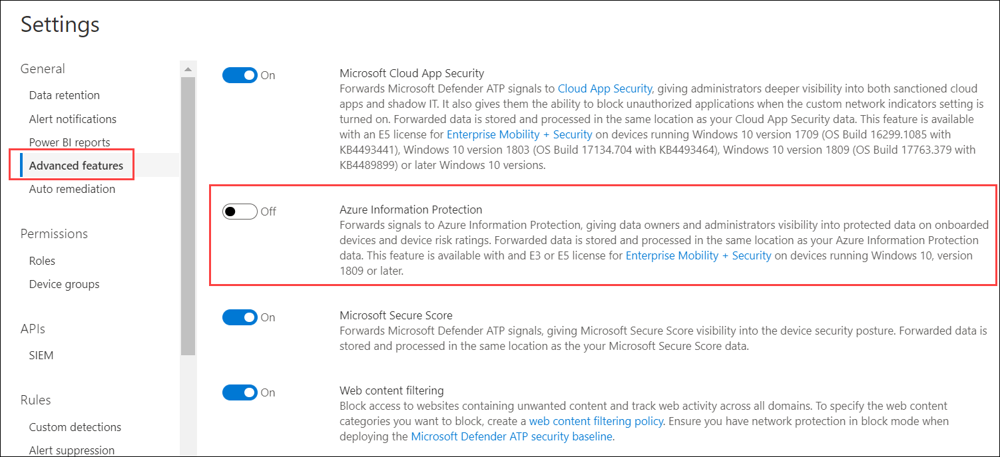

# <a name="information-protection-in-windows-overview"></a>Übersicht über den Informationsschutz in Windows

[!INCLUDE [Microsoft 365 Defender rebranding](../../includes/microsoft-defender.md)]

**Gilt für:**

- [Microsoft Defender für Endpunkt](https://go.microsoft.com/fwlink/p/?linkid=2154037)
- [Microsoft 365 Defender](https://go.microsoft.com/fwlink/?linkid=2118804)

> Möchten Sie Defender for Endpoint erleben? [Registrieren Sie sich für eine kostenlose Testversion.](https://www.microsoft.com/microsoft-365/windows/microsoft-defender-atp?ocid=docs-wdatp-exposedapis-abovefoldlink) 


[!include[Prerelease information](../../includes/prerelease.md)]

Der Informationsschutz ist ein integraler Bestandteil der Microsoft 365 Enterprise-Suite und bietet intelligenten Schutz, um vertrauliche Daten zu schützen und gleichzeitig die Produktivität am Arbeitsplatz zu ermöglichen.


>[!TIP]
> Lesen Sie unseren Blogbeitrag zur Integration von Microsoft Defender for Endpoint in Microsoft Information Protection, um vertrauliche Daten auf Windows-Geräten zu ermitteln, zu schützen und [zu überwachen.](https://cloudblogs.microsoft.com/microsoftsecure/2019/01/17/windows-defender-atp-integrates-with-microsoft-information-protection-to-discover-protect-and-monitor-sensitive-data-on-windows-devices/)

Defender for Endpoint wendet die folgenden Methoden zum Ermitteln, Klassifizieren und Schützen von Daten an:

- **Datenermittlung** – Identifizieren vertraulicher Daten auf gefährdeten Windows-Geräten
- **Datenklassifizierung** – Automatische Klassifizierung von Daten basierend auf gängigen Microsoft Information Protection (MIP)-Richtlinien, die in Office 365 Security & Compliance Center verwaltet werden. Mit der automatischen Klassifizierung können Sie vertrauliche Daten auch dann schützen, wenn der Endbenutzer sie nicht manuell klassifiziert hat.


## <a name="data-discovery-and-data-classification"></a>Datenermittlung und Datenklassifizierung

Defender for Endpoint ermittelt Automatisch Dateien mit Vertraulichkeitsbezeichnungen und Dateien, die vertrauliche Informationstypen enthalten.

Vertraulichkeitsbezeichnungen klassifizieren und schützen vertrauliche Inhalte.

Typen vertraulicher Informationen in der Office 365 Data Loss Prevention (DLP)-Implementierung fallen in zwei Kategorien:

- Standard
- Benutzerdefiniert

Zu den standardmäßigen vertraulichen Informationstypen gehören Informationen wie Bankkontonummern, Sozialversicherungsnummern oder nationale IDs. Weitere Informationen finden Sie unter [What the sensitive information type look for](https://docs.microsoft.com/office365/securitycompliance/what-the-sensitive-information-types-look-for).

Benutzerdefinierte Typen sind diejenigen, die Sie definieren und zum Schutz einer anderen Art vertraulicher Informationen (z. B. Mitarbeiter-IDs oder Projektnummern) entworfen haben. Weitere Informationen finden Sie unter [Create a custom sensitive information type](https://docs.microsoft.com/office365/securitycompliance/create-a-custom-sensitive-information-type).

Wenn eine Datei auf einem Windows-Gerät erstellt oder bearbeitet wird, überprüft Defender for Endpoint den Inhalt, um zu bewerten, ob sie vertrauliche Informationen enthält.

Aktivieren Sie die Azure Information Protection-Integration, sodass eine Datei, die vertrauliche Informationen enthält, von Defender for Endpoint mit Bezeichnungen oder Informationstypen erkannt wird, automatisch vom Gerät an Azure Information Protection weitergeleitet wird.



Die gemeldeten Signale können im Azure Information Protection – Data Discovery Dashboard angezeigt werden.

## <a name="azure-information-protection---data-discovery-dashboard"></a>Azure Information Protection – Datenermittlungsdashboard

Dieses Dashboard enthält eine Zusammenfassung der Ermittlungsinformationen von Daten, die sowohl von Defender for Endpoint als auch von Azure Information Protection entdeckt wurden. Daten von Defender for Endpoint sind mit Location Type - Endpoint gekennzeichnet.


Beachten Sie die Spalte Geräterisiko auf der rechten Seite, dieses Geräterisiko wird direkt von Defender for Endpoint abgeleitet und gibt die Risikostufe des Sicherheitsgeräts an, auf dem die Datei gefunden wurde, basierend auf den aktiven Sicherheitsbedrohungen, die von Defender for Endpoint erkannt wurden.

Klicken Sie auf ein Gerät, um eine Liste der auf diesem Gerät beobachteten Dateien mit ihren Vertraulichkeitsbezeichnungen und Informationstypen zu sehen.

>[!NOTE]
>Bitte lassen Sie ungefähr 15 bis 20 Minuten zu, damit die Azure Information Protection Dashboard Discovery ermittelte Dateien wiederspiegelt.

## <a name="log-analytics"></a>Log Analytics

Die auf Defender for Endpoint basierende Datenermittlung ist auch in [Azure Log Analytics](https://docs.microsoft.com/azure/log-analytics/log-analytics-overview)verfügbar, wo Sie komplexe Abfragen über die Rohdaten ausführen können.

Weitere Informationen zur Azure Information Protection-Analyse finden Sie unter [Zentrale Berichterstellung für Azure Information Protection](https://docs.microsoft.com/azure/information-protection/reports-aip).

Öffnen Sie Azure Log Analytics im Azure-Portal, und öffnen Sie einen Abfrage-Generator (standard oder klassisch).

Führen Sie zum Anzeigen von Defender for Endpoint-Daten eine Abfrage aus, die die folgenden Informationen enthält:

```
InformationProtectionLogs_CL
| where Workload_s == "Windows Defender"
```

**Voraussetzungen:**

- Kunden müssen über ein Abonnement für Azure Information Protection verfügen.
- Aktivieren der Azure Information Protection-Integration in Microsoft Defender Security Center:
    - Wechseln Sie **zu Einstellungen** im Microsoft Defender Security Center, klicken Sie unter Allgemein **auf Erweiterte** **Einstellungen.**


