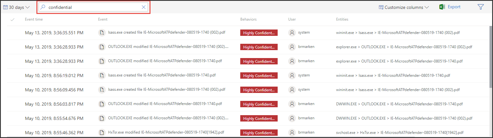

# Verwenden von Vertraulichkeitsbezeichnungen zum Priorisieren der Reaktion auf Vorfälle  

[!INCLUDE [Microsoft 365 Defender rebranding](../../includes/microsoft-defender.md)]

**Gilt für:**
- [Microsoft Defender für Endpunkt](https://go.microsoft.com/fwlink/p/?linkid=2146631)
- [Microsoft 365 Defender](https://go.microsoft.com/fwlink/?linkid=2118804)

> Möchten Sie Defender for Endpoint erleben? [Registrieren Sie sich für eine kostenlose Testversion.](https://www.microsoft.com/microsoft-365/windows/microsoft-defender-atp?ocid=docs-wdatp-exposedapis-abovefoldlink) 

Ein typischer erweiterter Lebenszyklus für dauerhafte Bedrohungen umfasst die Daten-Exfiltration. Bei einem Sicherheitsvorfall ist es wichtig, dass Sie Untersuchungen priorisieren können, bei denen vertrauliche Dateien gefährdet sind, damit Unternehmensdaten und -informationen geschützt werden.

Defender for Endpoint erleichtert die Priorisierung von Sicherheitsvorfällen durch die Verwendung von Vertraulichkeitsbezeichnungen. Vertraulichkeitsbezeichnungen identifizieren schnell Vorfälle, die Geräte mit vertraulichen Informationen wie z. B. vertraulichen Informationen betreffen können. 

## Untersuchen von Vorfällen mit vertraulichen Daten
Erfahren Sie, wie Sie Datensensitivitätsbezeichnungen verwenden, um die Untersuchung von Vorfällen zu priorisieren.

>[!NOTE]
>Bezeichnungen werden für Windows 10, Version 1809 oder höher erkannt.

1. Wählen Sie im Microsoft Defender Security Center Die Option **Vorfälle aus.** 

2. Scrollen Sie nach rechts, um die Spalte **Datensensitivität zu** sehen. Diese Spalte spiegelt Vertraulichkeitsbezeichnungen wider, die auf Geräten im Zusammenhang mit den Vorfällen beobachtet wurden und einen Hinweis darauf geben, ob vertrauliche Dateien von dem Vorfall betroffen sein können.

    

    Sie können auch nach Datensensitivität **filtern** 

    

3. Öffnen Sie die Vorfallseite, um weitere Untersuchungen zu erstellen.

    

4. Wählen Sie die **Registerkarte Geräte** aus, um Geräte zu identifizieren, die Dateien mit Vertraulichkeitsbezeichnungen speichern.

    
   

5. Wählen Sie die Geräte aus, auf denen vertrauliche Daten gespeichert werden, und durchsuchen Sie die Zeitachse, um zu ermitteln, welche Dateien betroffen sein können, und ergreifen Sie dann geeignete Maßnahmen, um sicherzustellen, dass Daten geschützt sind. 

   Sie können die auf der Gerätezeitachse angezeigten Ereignisse einen, indem Sie nach Datenempfindlichkeitsbezeichnungen suchen. Dadurch werden nur Ereignisse angezeigt, die Dateien zugeordnet sind, deren Bezeichnungsname angegeben ist.

    

>[!TIP]
>Diese Datenpunkte werden auch über die "DeviceFileEvents" in der erweiterten Suche verfügbar gemacht, sodass erweiterte Abfragen und die Zeitplanungserkennung Vertraulichkeitsbezeichnungen und Dateischutzstatus berücksichtigen können. 
