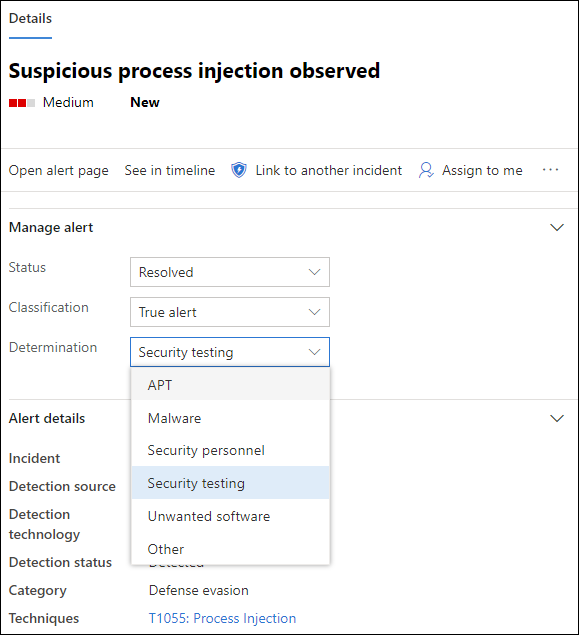

# Untersuchen von Warnungen in Microsoft Defender for EndpointInvestigate alerts in Microsoft Defender for Endpoint

[!INCLUDE [Microsoft 365 Defender rebranding](../../includes/microsoft-defender.md)]

**Gilt für:****Applies to:**
- [Microsoft Defender für EndpunktMicrosoft Defender for Endpoint](https://go.microsoft.com/fwlink/p/?linkid=2146631)
- [Microsoft 365 DefenderMicrosoft 365 Defender](https://go.microsoft.com/fwlink/?linkid=2118804)

>Möchten Sie Defender for Endpoint erleben?Want to experience Defender for Endpoint? [Registrieren Sie sich für eine kostenlose Testversion.Sign up for a free trial.](https://www.microsoft.com/microsoft-365/windows/microsoft-defender-atp?ocid=docs-wdatp-investigatealerts-abovefoldlink) 

Untersuchen Sie Warnungen, die Sich auf Ihr Netzwerk ausdingen, verstehen Sie, was sie bedeuten, und wie Sie sie beheben können.Investigate alerts that are affecting your network, understand what they mean, and how to resolve them.

Wählen Sie eine Warnung aus der Benachrichtigungswarteschlange aus, um zur Warnungsseite zu wechseln.Select an alert from the alerts queue to go to alert page. Diese Ansicht enthält den Warnungstitel, die betroffenen Objekte, den Detailseitenbereich und den Warnungsstory.This view contains the alert title, the affected assets, the details side pane, and the alert story.

Beginnen Sie auf der Warnungsseite mit der Untersuchung, indem Sie die betroffenen Objekte oder entitäten unter der Warnungsstorystrukturansicht auswählen.From the alert page, begin your investigation by selecting the affected assets or any of the entities under the alert story tree view. Der Detailbereich wird automatisch mit weiteren Informationen zu den ausgewählten Informationen auffüllt.The details pane automatically populates with further information about what you selected. Informationen dazu, welche Art von Informationen Sie hier anzeigen können, finden Sie unter Überprüfen von Warnungen [in Microsoft Defender for Endpoint](https://docs.microsoft.com/microsoft-365/security/defender-endpoint/review-alerts).To see what kind of information you can view here, read [Review alerts in Microsoft Defender for Endpoint](https://docs.microsoft.com/microsoft-365/security/defender-endpoint/review-alerts).

## Untersuchen der Verwendung des WarnungsstorysInvestigate using the alert story

Der Warnungsstory enthält Details dazu, warum die Warnung ausgelöst wurde, verwandte Ereignisse, die vor und nach passiert sind, sowie andere verwandte Entitäten.The alert story details why the alert was triggered, related events that happened before and after, as well as other related entities.

Entitäten können angeklickt werden, und jede Entität, die keine Warnung ist, kann mithilfe des Erweiterungssymbols auf der rechten Seite der Karte dieser Entität erweitert werden.Entities are clickable and every entity that isn't an alert is expandable using the expand icon on the right side of that entity's card. Die entität im Fokus wird durch einen blauen Streifen auf der linken Seite der Karte dieser Entität angezeigt, und die Warnung im Titel ist zunächst im Fokus.The entity in focus will be indicated by a blue stripe to the left side of that entity's card, with the alert in the title being in focus at first.

Erweitern Sie Entitäten, um Details auf einen Blick anzuzeigen.Expand entities to view details at a glance. Wenn Sie eine Entität auswählen, wird der Kontext des Detailbereichs zu dieser Entität umschalten, und Sie können weitere Informationen überprüfen und diese Entität verwalten.Selecting an entity will switch the context of the details pane to this entity, and will allow you to review further information, as well as manage that entity. Wenn *Sie ...* rechts neben der Entitätskarte auswählen, werden alle aktionen für diese Entität verfügbar gemacht.Selecting *...* to the right of the entity card will reveal all actions available for that entity. Dieselben Aktionen werden im Detailbereich angezeigt, wenn sich diese Entität im Fokus befindet.These same actions appear in the details pane when that entity is in focus.

> [!NOTE]
> Der Abschnitt "Warnungsabschnitt" kann mehrere Warnungen enthalten, und zusätzliche Warnungen im Zusammenhang mit derselben Ausführungsstruktur werden vor oder nach der ausgewählten Warnung angezeigt.The alert story section may contain more than one alert, with additional alerts related to the same execution tree appearing before or after the alert you've selected.

## Ergreifen von Aktionen aus dem DetailbereichTake action from the details pane

Nachdem Sie eine entität von Interesse ausgewählt haben, wird der Detailbereich geändert, um Informationen zum ausgewählten Entitätstyp, historische Informationen, wenn diese verfügbar ist, anzuzeigen und Steuerelemente zum Ergreifen von Aktionen für diese Entität direkt auf der Warnungsseite anzuzeigen. Once you've selected an entity of interest, the details pane will change to display information about the selected entity type, historic information when it's available, and offer controls to **take action** on this entity directly from the alert page.

Nachdem Sie die Untersuchung durchgeführt haben, wechseln Sie zurück zu der Warnung, mit der Sie begonnen haben, markieren Sie den Status der Warnung als **Aufgelöst,** und klassifizieren Sie sie entweder als **False-Warnung** oder **als True-Warnung.**Once you're done investigating, go back to the alert you started with, mark the alert's status as **Resolved** and classify it as either **False alert** or **True alert**. Das Klassifizieren von Warnungen trägt dazu bei, diese Funktion zu optimieren, um mehr echte Warnungen und weniger falsche Warnungen zu bieten.Classifying alerts helps tune this capability to provide more true alerts and less false alerts.

Wenn Sie ihn als echte Warnung klassifizieren, können Sie auch eine Bestimmung auswählen, wie in der folgenden Abbildung dargestellt.If you classify it as a true alert, you can also select a determination, as shown in the image below.

Wenn eine falsche Warnung mit einer Geschäftsanwendung auftritt, erstellen Sie eine Unterdrückungsregel, um diese Art von Warnung in Zukunft zu vermeiden.If you are experiencing a false alert with a line-of-business application, create a suppression rule to avoid this type of alert in the future.

> [!TIP]
> Wenn probleme auftreten, die oben nicht beschrieben sind, verwenden Sie die Schaltfläche, um Feedback zu geben 🙂 oder ein Supportticket zu öffnen.If you're experiencing any issues not described above, use the 🙂 button to provide feedback or open a support ticket.

## Verwandte ThemenRelated topics
- [Anzeigen und Organisieren der Microsoft Defender for Endpoint Alerts-WarteschlangeView and organize the Microsoft Defender for Endpoint Alerts queue](alerts-queue.md)
- [Verwalten von Microsoft Defender for Endpoint-WarnungenManage Microsoft Defender for Endpoint alerts](manage-alerts.md)
- [Untersuchen einer Datei, die einer Defender for Endpoint-Warnung zugeordnet istInvestigate a file associated with a Defender for Endpoint alert](investigate-files.md)
- [Untersuchen von Geräten in der Liste "Defender for Endpoint Devices"Investigate devices in the Defender for Endpoint Devices list](investigate-machines.md)
- [Untersuchen einer einer Defender for Endpoint-Warnung zugeordneten IP-AdresseInvestigate an IP address associated with a Defender for Endpoint alert](investigate-ip.md)
- [Untersuchen einer Domäne, die einer Defender for Endpoint-Warnung zugeordnet istInvestigate a domain associated with a Defender for Endpoint alert](investigate-domain.md)
- [Untersuchen eines Benutzerkontos in Defender for EndpointInvestigate a user account in Defender for Endpoint](investigate-user.md)

