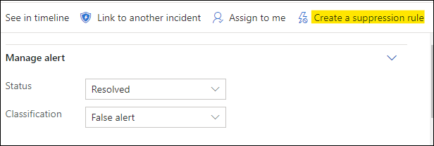

# Untersuchen von Warnungen in Microsoft Defender for Endpoint

[!INCLUDE [Microsoft 365 Defender rebranding](../../includes/microsoft-defender.md)]

**Gilt für:**
- [Microsoft Defender für Endpunkt](https://go.microsoft.com/fwlink/p/?linkid=2146631)
- [Microsoft 365 Defender](https://go.microsoft.com/fwlink/?linkid=2118804)

>Möchten Sie Defender for Endpoint erleben? [Registrieren Sie sich für eine kostenlose Testversion.](https://www.microsoft.com/microsoft-365/windows/microsoft-defender-atp?ocid=docs-wdatp-investigatealerts-abovefoldlink) 

Untersuchen Sie Warnungen, die Sich auf Ihr Netzwerk ausdingen, verstehen Sie, was sie bedeuten, und wie Sie sie beheben können.

Wählen Sie eine Warnung aus der Benachrichtigungswarteschlange aus, um zur Warnungsseite zu wechseln. Diese Ansicht enthält den Warnungstitel, die betroffenen Objekte, den Detailseitenbereich und den Warnungsstory.

Beginnen Sie auf der Warnungsseite mit der Untersuchung, indem Sie die betroffenen Objekte oder entitäten unter der Warnungsstorystrukturansicht auswählen. Der Detailbereich wird automatisch mit weiteren Informationen zu den ausgewählten Informationen auffüllt. Informationen dazu, welche Art von Informationen Sie hier anzeigen können, finden Sie unter Überprüfen von Warnungen [in Microsoft Defender for Endpoint](https://docs.microsoft.com/microsoft-365/security/defender-endpoint/review-alerts).

## Untersuchen der Verwendung des Warnungsstorys

Der Warnungsstory enthält Details dazu, warum die Warnung ausgelöst wurde, verwandte Ereignisse, die vor und nach passiert sind, sowie andere verwandte Entitäten.

Entitäten können angeklickt werden, und jede Entität, die keine Warnung ist, kann mithilfe des Erweiterungssymbols auf der rechten Seite der Karte dieser Entität erweitert werden. Die entität im Fokus wird durch einen blauen Streifen auf der linken Seite der Karte dieser Entität angezeigt, und die Warnung im Titel ist zunächst im Fokus.

Erweitern Sie Entitäten, um Details auf einen Blick anzuzeigen. Wenn Sie eine Entität auswählen, wird der Kontext des Detailbereichs zu dieser Entität umschalten, und Sie können weitere Informationen überprüfen und diese Entität verwalten. Wenn *Sie ...* rechts neben der Entitätskarte auswählen, werden alle aktionen für diese Entität verfügbar gemacht. Dieselben Aktionen werden im Detailbereich angezeigt, wenn sich diese Entität im Fokus befindet.

> [!NOTE]
> Der Abschnitt "Warnungsabschnitt" kann mehrere Warnungen enthalten, und zusätzliche Warnungen im Zusammenhang mit derselben Ausführungsstruktur werden vor oder nach der ausgewählten Warnung angezeigt.

## Ergreifen von Aktionen aus dem Detailbereich

Nachdem Sie eine entität von Interesse ausgewählt haben, wird der Detailbereich geändert, um Informationen zum ausgewählten Entitätstyp, historische Informationen, wenn diese verfügbar ist, anzuzeigen und Steuerelemente zum Ergreifen von Aktionen für diese Entität direkt auf der Warnungsseite anzuzeigen. 

Nachdem Sie die Untersuchung durchgeführt haben, wechseln Sie zurück zu der Warnung, mit der Sie begonnen haben, markieren Sie den Status der Warnung als **Aufgelöst,** und klassifizieren Sie sie entweder als **False-Warnung** oder **als True-Warnung.** Das Klassifizieren von Warnungen trägt dazu bei, diese Funktion zu optimieren, um mehr echte Warnungen und weniger falsche Warnungen zu bieten.

Wenn Sie ihn als echte Warnung klassifizieren, können Sie auch eine Bestimmung auswählen, wie in der folgenden Abbildung dargestellt.

Wenn eine falsche Warnung mit einer Geschäftsanwendung auftritt, erstellen Sie eine Unterdrückungsregel, um diese Art von Warnung in Zukunft zu vermeiden.

> [!TIP]
> Wenn probleme auftreten, die oben nicht beschrieben sind, verwenden Sie die Schaltfläche, um Feedback zu geben 🙂 oder ein Supportticket zu öffnen.

## Verwandte Themen
- [Anzeigen und Organisieren der Microsoft Defender for Endpoint Alerts-Warteschlange](alerts-queue.md)
- [Verwalten von Microsoft Defender for Endpoint-Warnungen](manage-alerts.md)
- [Untersuchen einer Datei, die einer Defender for Endpoint-Warnung zugeordnet ist](investigate-files.md)
- [Untersuchen von Geräten in der Liste "Defender for Endpoint Devices"](investigate-machines.md)
- [Untersuchen einer einer Defender for Endpoint-Warnung zugeordneten IP-Adresse](investigate-ip.md)
- [Untersuchen einer Domäne, die einer Defender for Endpoint-Warnung zugeordnet ist](investigate-domain.md)
- [Untersuchen eines Benutzerkontos in Defender for Endpoint](investigate-user.md)

