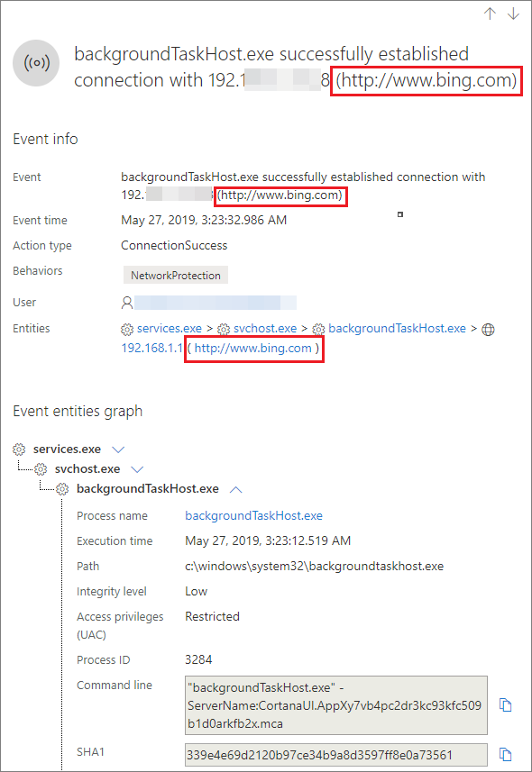

# <a name="investigate-connection-events-that-occur-behind-forward-proxies"></a><span data-ttu-id="6cd3a-104">Untersuchen von Verbindungsereignissen hinter Weiterleitungsproxys</span><span class="sxs-lookup"><span data-stu-id="6cd3a-104">Investigate connection events that occur behind forward proxies</span></span>

[!INCLUDE [Microsoft 365 Defender rebranding](../../includes/microsoft-defender.md)]

<span data-ttu-id="6cd3a-105">**Gilt für:**</span><span class="sxs-lookup"><span data-stu-id="6cd3a-105">**Applies to:**</span></span>
- [<span data-ttu-id="6cd3a-106">Microsoft Defender für Endpunkt</span><span class="sxs-lookup"><span data-stu-id="6cd3a-106">Microsoft Defender for Endpoint</span></span>](https://go.microsoft.com/fwlink/p/?linkid=2154037)
- [<span data-ttu-id="6cd3a-107">Microsoft 365 Defender</span><span class="sxs-lookup"><span data-stu-id="6cd3a-107">Microsoft 365 Defender</span></span>](https://go.microsoft.com/fwlink/?linkid=2118804)

> <span data-ttu-id="6cd3a-108">Möchten Sie Defender für Endpunkt erleben?</span><span class="sxs-lookup"><span data-stu-id="6cd3a-108">Want to experience Defender for Endpoint?</span></span> [<span data-ttu-id="6cd3a-109">Registrieren Sie sich für eine kostenlose Testversion.</span><span class="sxs-lookup"><span data-stu-id="6cd3a-109">Sign up for a free trial.</span></span>](https://www.microsoft.com/microsoft-365/windows/microsoft-defender-atp?ocid=docs-wdatp-investigatemachines-abovefoldlink)

<span data-ttu-id="6cd3a-110">Defender für Endpunkt unterstützt die Netzwerkverbindungsüberwachung von verschiedenen Ebenen des Netzwerkstapels.</span><span class="sxs-lookup"><span data-stu-id="6cd3a-110">Defender for Endpoint supports network connection monitoring from different levels of the network stack.</span></span> <span data-ttu-id="6cd3a-111">Ein schwieriger Fall ist, wenn das Netzwerk einen Weiterleitungsproxy als Gateway zum Internet verwendet.</span><span class="sxs-lookup"><span data-stu-id="6cd3a-111">A challenging case is when the network uses a forward proxy as a gateway to the Internet.</span></span>

<span data-ttu-id="6cd3a-112">Der Proxy verhält sich wie der Zielendpunkt.</span><span class="sxs-lookup"><span data-stu-id="6cd3a-112">The proxy acts as if it was the target endpoint.</span></span>  <span data-ttu-id="6cd3a-113">In diesen Fällen überwachen einfache Netzwerkverbindungsmonitore die Verbindungen mit dem Proxy, was korrekt ist, aber einen niedrigeren Untersuchungswert aufweist.</span><span class="sxs-lookup"><span data-stu-id="6cd3a-113">In these cases, simple network connection monitors will audit the connections with the proxy which is correct but has lower investigation value.</span></span> 

<span data-ttu-id="6cd3a-114">Defender für Endpunkt unterstützt die erweiterte Überwachung auf HTTP-Ebene über Netzwerkschutz.</span><span class="sxs-lookup"><span data-stu-id="6cd3a-114">Defender for Endpoint supports advanced HTTP level monitoring through network protection.</span></span> <span data-ttu-id="6cd3a-115">Wenn diese Einstellung aktiviert ist, wird ein neuer Ereignistyp angezeigt, der die tatsächlichen Zieldomänennamen verfügbar macht.</span><span class="sxs-lookup"><span data-stu-id="6cd3a-115">When turned on, a new type of event is surfaced which exposes the real target domain names.</span></span>

## <a name="use-network-protection-to-monitor-network-connection-behind-a-firewall"></a><span data-ttu-id="6cd3a-116">Verwenden des Netzwerkschutzes zum Überwachen der Netzwerkverbindung hinter einer Firewall</span><span class="sxs-lookup"><span data-stu-id="6cd3a-116">Use network protection to monitor network connection behind a firewall</span></span>
<span data-ttu-id="6cd3a-117">Die Überwachung der Netzwerkverbindung hinter einem Weiterleitungsproxy ist aufgrund zusätzlicher Netzwerkereignisse möglich, die aus dem Netzwerkschutz stammen.</span><span class="sxs-lookup"><span data-stu-id="6cd3a-117">Monitoring network connection behind a forward proxy is possible due to additional network events that originate from network protection.</span></span> <span data-ttu-id="6cd3a-118">Um sie auf einer Gerätezeitachse anzuzeigen, aktivieren Sie den Netzwerkschutz (zumindest im Überwachungsmodus).</span><span class="sxs-lookup"><span data-stu-id="6cd3a-118">To see them on a device timeline, turn network protection on (at the minimum in audit mode).</span></span> 

<span data-ttu-id="6cd3a-119">Der Netzwerkschutz kann mit den folgenden Modi gesteuert werden:</span><span class="sxs-lookup"><span data-stu-id="6cd3a-119">Network protection can be controlled using the following modes:</span></span>

- <span data-ttu-id="6cd3a-120">**Blockieren**</span><span class="sxs-lookup"><span data-stu-id="6cd3a-120">**Block**</span></span> <br> <span data-ttu-id="6cd3a-121">Benutzer oder Apps werden am Herstellen einer Verbindung mit gefährlichen Domänen gehindert.</span><span class="sxs-lookup"><span data-stu-id="6cd3a-121">Users or apps will be blocked from connecting to dangerous domains.</span></span> <span data-ttu-id="6cd3a-122">Sie können diese Aktivität in Microsoft Defender Security Center sehen.</span><span class="sxs-lookup"><span data-stu-id="6cd3a-122">You will be able to see this activity in Microsoft Defender Security Center.</span></span>
- <span data-ttu-id="6cd3a-123">**Audit**</span><span class="sxs-lookup"><span data-stu-id="6cd3a-123">**Audit**</span></span> <br> <span data-ttu-id="6cd3a-124">Benutzer oder Apps werden nicht daran gehindert, sich mit gefährlichen Domänen zu verbinden.</span><span class="sxs-lookup"><span data-stu-id="6cd3a-124">Users or apps will not be blocked from connecting to dangerous domains.</span></span> <span data-ttu-id="6cd3a-125">Diese Aktivität wird jedoch weiterhin in Microsoft Defender Security Center angezeigt.</span><span class="sxs-lookup"><span data-stu-id="6cd3a-125">However, you will still see this activity in Microsoft Defender Security Center.</span></span>


<span data-ttu-id="6cd3a-126">Wenn Sie den Netzwerkschutz deaktivieren, werden Benutzer oder Apps nicht daran gehindert, sich mit gefährlichen Domänen zu verbinden.</span><span class="sxs-lookup"><span data-stu-id="6cd3a-126">If you turn network protection off, users or apps will not be blocked from connecting to dangerous domains.</span></span> <span data-ttu-id="6cd3a-127">In Microsoft Defender Security Center werden keine Netzwerkaktivitäten angezeigt.</span><span class="sxs-lookup"><span data-stu-id="6cd3a-127">You will not see any network activity in Microsoft Defender Security Center.</span></span>

<span data-ttu-id="6cd3a-128">Wenn Sie es nicht konfigurieren, wird die Netzwerkblockierung standardmäßig deaktiviert.</span><span class="sxs-lookup"><span data-stu-id="6cd3a-128">If you do not configure it, network blocking will be turned off by default.</span></span>

<span data-ttu-id="6cd3a-129">Weitere Informationen finden Sie unter [Aktivieren des Netzwerkschutzes.](enable-network-protection.md)</span><span class="sxs-lookup"><span data-stu-id="6cd3a-129">For more information, see [Enable network protection](enable-network-protection.md).</span></span>

## <a name="investigation-impact"></a><span data-ttu-id="6cd3a-130">Untersuchungsauswirkungen</span><span class="sxs-lookup"><span data-stu-id="6cd3a-130">Investigation impact</span></span>
<span data-ttu-id="6cd3a-131">Wenn der Netzwerkschutz aktiviert ist, sehen Sie, dass auf der Zeitachse eines Geräts die IP-Adresse weiterhin den Proxy darstellt, während die eigentliche Zieladresse angezeigt wird.</span><span class="sxs-lookup"><span data-stu-id="6cd3a-131">When network protection is turned on, you'll see that on a device's timeline the IP address will keep representing the proxy, while the real target address shows up.</span></span>


<span data-ttu-id="6cd3a-133">Zusätzliche Ereignisse, die von der Netzwerkschutzebene ausgelöst werden, sind jetzt verfügbar, um die echten Domänennamen auch hinter einem Proxy anzuzeigen.</span><span class="sxs-lookup"><span data-stu-id="6cd3a-133">Additional events triggered by the network protection layer are now available to surface the real domain names even behind a proxy.</span></span>

<span data-ttu-id="6cd3a-134">Informationen zum Ereignis:</span><span class="sxs-lookup"><span data-stu-id="6cd3a-134">Event's information:</span></span>




## <a name="hunt-for-connection-events-using-advanced-hunting"></a><span data-ttu-id="6cd3a-136">Suche nach Verbindungsereignissen mithilfe der erweiterten Suche</span><span class="sxs-lookup"><span data-stu-id="6cd3a-136">Hunt for connection events using advanced hunting</span></span> 
<span data-ttu-id="6cd3a-137">Alle neuen Verbindungsereignisse stehen Ihnen auch für die Erweiterte Suche zur Verfügung.</span><span class="sxs-lookup"><span data-stu-id="6cd3a-137">All new connection events are available for you to hunt on through advanced hunting as well.</span></span> <span data-ttu-id="6cd3a-138">Da es sich bei diesen Ereignissen um Verbindungsereignisse handelt, finden Sie sie in der DeviceNetworkEvents-Tabelle unter dem `ConnecionSuccess` Aktionstyp.</span><span class="sxs-lookup"><span data-stu-id="6cd3a-138">Since these events are connection events, you can find them under the DeviceNetworkEvents table under the `ConnecionSuccess` action type.</span></span>

<span data-ttu-id="6cd3a-139">Mit dieser einfachen Abfrage werden alle relevanten Ereignisse angezeigt:</span><span class="sxs-lookup"><span data-stu-id="6cd3a-139">Using this simple query will show you all the relevant events:</span></span>

```
DeviceNetworkEvents
| where ActionType == "ConnectionSuccess" 
| take 10
```


<span data-ttu-id="6cd3a-141">Sie können auch Ereignisse herausfiltern, die sich auf die Verbindung mit dem Proxy selbst beziehen.</span><span class="sxs-lookup"><span data-stu-id="6cd3a-141">You can also filter out  events that are related to connection to the proxy itself.</span></span> 

<span data-ttu-id="6cd3a-142">Verwenden Sie die folgende Abfrage, um die Verbindungen mit dem Proxy herauszufiltern:</span><span class="sxs-lookup"><span data-stu-id="6cd3a-142">Use the following query to filter out the connections to the proxy:</span></span>

```
DeviceNetworkEvents
| where ActionType == "ConnectionSuccess" and RemoteIP != "ProxyIP"  
| take 10
```


## <a name="related-topics"></a><span data-ttu-id="6cd3a-143">Verwandte Themen</span><span class="sxs-lookup"><span data-stu-id="6cd3a-143">Related topics</span></span>
- [<span data-ttu-id="6cd3a-144">Anwenden des Netzwerkschutzes mit GP – Richtlinien-CSP</span><span class="sxs-lookup"><span data-stu-id="6cd3a-144">Applying network protection with GP - policy CSP</span></span>](/windows/client-management/mdm/policy-csp-defender#defender-enablenetworkprotection)
