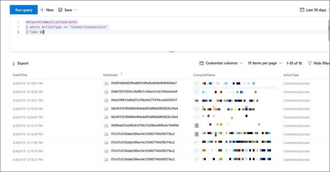

# <a name="investigate-connection-events-that-occur-behind-forward-proxies"></a>Untersuchen von Verbindungsereignissen hinter Weiterleitungsproxys

[!INCLUDE [Microsoft 365 Defender rebranding](../../includes/microsoft-defender.md)]

**Gilt für:**
- [Microsoft Defender für Endpunkt](https://go.microsoft.com/fwlink/p/?linkid=2154037)
- [Microsoft 365 Defender](https://go.microsoft.com/fwlink/?linkid=2118804)

> Möchten Sie Defender für Endpunkt erleben? [Registrieren Sie sich für eine kostenlose Testversion.](https://www.microsoft.com/microsoft-365/windows/microsoft-defender-atp?ocid=docs-wdatp-investigatemachines-abovefoldlink)

Defender für Endpunkt unterstützt die Netzwerkverbindungsüberwachung von verschiedenen Ebenen des Netzwerkstapels. Ein schwieriger Fall ist, wenn das Netzwerk einen Weiterleitungsproxy als Gateway zum Internet verwendet.

Der Proxy verhält sich wie der Zielendpunkt.  In diesen Fällen überwachen einfache Netzwerkverbindungsmonitore die Verbindungen mit dem Proxy, was korrekt ist, aber einen niedrigeren Untersuchungswert aufweist. 

Defender für Endpunkt unterstützt die erweiterte Überwachung auf HTTP-Ebene über Netzwerkschutz. Wenn diese Einstellung aktiviert ist, wird ein neuer Ereignistyp angezeigt, der die tatsächlichen Zieldomänennamen verfügbar macht.

## <a name="use-network-protection-to-monitor-network-connection-behind-a-firewall"></a>Verwenden des Netzwerkschutzes zum Überwachen der Netzwerkverbindung hinter einer Firewall
Die Überwachung der Netzwerkverbindung hinter einem Weiterleitungsproxy ist aufgrund zusätzlicher Netzwerkereignisse möglich, die aus dem Netzwerkschutz stammen. Um sie auf einer Gerätezeitachse anzuzeigen, aktivieren Sie den Netzwerkschutz (zumindest im Überwachungsmodus). 

Der Netzwerkschutz kann mit den folgenden Modi gesteuert werden:

- **Blockieren** <br> Benutzer oder Apps werden am Herstellen einer Verbindung mit gefährlichen Domänen gehindert. Sie können diese Aktivität in Microsoft Defender Security Center sehen.
- **Audit** <br> Benutzer oder Apps werden nicht daran gehindert, sich mit gefährlichen Domänen zu verbinden. Diese Aktivität wird jedoch weiterhin in Microsoft Defender Security Center angezeigt.


Wenn Sie den Netzwerkschutz deaktivieren, werden Benutzer oder Apps nicht daran gehindert, sich mit gefährlichen Domänen zu verbinden. In Microsoft Defender Security Center werden keine Netzwerkaktivitäten angezeigt.

Wenn Sie es nicht konfigurieren, wird die Netzwerkblockierung standardmäßig deaktiviert.

Weitere Informationen finden Sie unter [Aktivieren des Netzwerkschutzes.](enable-network-protection.md)

## <a name="investigation-impact"></a>Untersuchungsauswirkungen
Wenn der Netzwerkschutz aktiviert ist, sehen Sie, dass auf der Zeitachse eines Geräts die IP-Adresse weiterhin den Proxy darstellt, während die eigentliche Zieladresse angezeigt wird.


Zusätzliche Ereignisse, die von der Netzwerkschutzebene ausgelöst werden, sind jetzt verfügbar, um die echten Domänennamen auch hinter einem Proxy anzuzeigen.

Informationen zum Ereignis:


## <a name="hunt-for-connection-events-using-advanced-hunting"></a>Suche nach Verbindungsereignissen mithilfe der erweiterten Suche 
Alle neuen Verbindungsereignisse stehen Ihnen auch für die Erweiterte Suche zur Verfügung. Da es sich bei diesen Ereignissen um Verbindungsereignisse handelt, finden Sie sie in der DeviceNetworkEvents-Tabelle unter dem `ConnecionSuccess` Aktionstyp.

Mit dieser einfachen Abfrage werden alle relevanten Ereignisse angezeigt:

```
DeviceNetworkEvents
| where ActionType == "ConnectionSuccess" 
| take 10
```



Sie können auch Ereignisse herausfiltern, die sich auf die Verbindung mit dem Proxy selbst beziehen. 

Verwenden Sie die folgende Abfrage, um die Verbindungen mit dem Proxy herauszufiltern:

```
DeviceNetworkEvents
| where ActionType == "ConnectionSuccess" and RemoteIP != "ProxyIP"  
| take 10
```


## <a name="related-topics"></a>Verwandte Themen
- [Anwenden des Netzwerkschutzes mit GP – Richtlinien-CSP](/windows/client-management/mdm/policy-csp-defender#defender-enablenetworkprotection)
