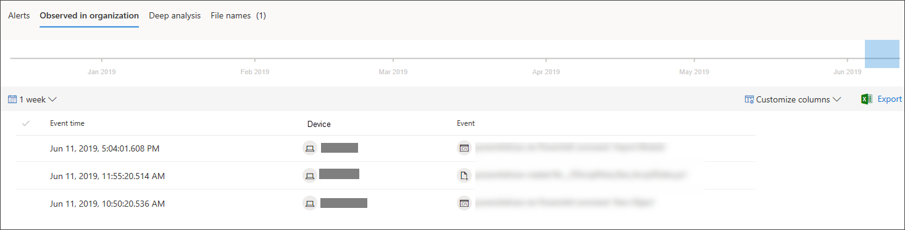

# Untersuchen einer Datei, die einer Microsoft Defender for Endpoint-Warnung zugeordnet ist

[!INCLUDE [Microsoft 365 Defender rebranding](../../includes/microsoft-defender.md)]

**Gilt für:**
- [Microsoft Defender für Endpunkt](https://go.microsoft.com/fwlink/p/?linkid=2154037)
- [Microsoft 365 Defender](https://go.microsoft.com/fwlink/?linkid=2118804)

>Möchten Sie Defender for Endpoint erleben? [Registrieren Sie sich für eine kostenlose Testversion.](https://www.microsoft.com/microsoft-365/windows/microsoft-defender-atp?ocid=docs-wdatp-investigatefiles-abovefoldlink)

Untersuchen Sie die Details einer Datei, die mit einer bestimmten Warnung, einem bestimmten Verhalten oder einem bestimmten Ereignis verknüpft ist, um festzustellen, ob die Datei schädliche Aktivitäten enthält, die Angriffsmotivation zu identifizieren und den potenziellen Umfang der Verletzung zu verstehen.

Es gibt viele Möglichkeiten, auf die detaillierte Profilseite einer bestimmten Datei zu zugreifen. Sie können z. B. das Suchfeature verwenden, auf einen Link aus der Warnungsprozessstruktur, dem Vorfalldiagramm, der Artefaktzeitachse oder einem ereignis auswählen, das in der Gerätezeitachse aufgeführt **ist.**

Sobald Sie auf der detaillierten Profilseite sind, können Sie zwischen den neuen und alten Seitenlayouts wechseln, indem Sie neue **Dateiseite umschalten.** Der Rest dieses Artikels beschreibt das neuere Seitenlayout.

Sie können Informationen aus den folgenden Abschnitten in der Dateiansicht erhalten:

- Dateidetails, Schadsoftwareerkennung, Dateiprävalenz
- Tiefe Analyse
- Warnungen
- Beobachtet in der Organisation
- Tiefe Analyse
- Dateinamen

Sie können auf dieser Seite auch Aktionen für eine Datei ergreifen.

## Dateiaktionen

Oben auf der Profilseite oberhalb der Dateiinformationskarten. Folgende Aktionen können Sie hier ausführen:

- Beenden und Isolieren
- Add/Edit Indicator
- Datei herunterladen
- Konsultieren eines Bedrohungsexperten
- Info-Center

Weitere Informationen zu diesen Aktionen finden Sie unter [Take response action on a file](respond-file-alerts.md).

## Dateidetails, Schadsoftwareerkennung und Dateiprävalenz

Die Dateidetails, Vorfälle, Schadsoftwareerkennung und Dateiprävalenzkarten zeigen verschiedene Attribute zur Datei an.

Es werden Details wie md5 der Datei, das Virus Total Detection Ratio und die Microsoft Defender AV-Erkennung (sofern verfügbar) und die Verbreitung der Datei angezeigt.

Die Dateiprävalenzkarte zeigt an, wo die Datei auf Geräten in der Organisation und weltweit angezeigt wurde. 

> [!NOTE] 
> Unterschiedliche Benutzer sehen möglicherweise abweichende Werte im Abschnitt *Geräte in* der Organisation der Dateiprävalenzkarte. Dies liegt daran, dass auf der Karte Informationen basierend auf dem RBAC-Bereich angezeigt werden, über den ein Benutzer verfügt. Wenn einem Benutzer also Sichtbarkeit auf einer bestimmten Gruppe von Geräten gewährt wurde, wird ihm nur die Dateiorganisationsprävalenz auf diesen Geräten angezeigt.

## Warnungen

Die **Registerkarte Warnungen** enthält eine Liste der Warnungen, die der Datei zugeordnet sind. Diese Liste enthält viele der gleichen Informationen wie die Warnungswarteschlange, mit Ausnahme der Gerätegruppe, falls vorhanden, zu dem das betroffene Gerät gehört. Sie können auswählen, welche Art von Informationen angezeigt wird, indem Sie **Spalten** in der Symbolleiste oberhalb der Spaltenüberschriften anpassen auswählen.

## Beobachtet in der Organisation

Auf **der Registerkarte Beobachtet in der** Organisation können Sie einen Datumsbereich angeben, um zu sehen, welche Geräte mit der Datei beobachtet wurden.

>[!NOTE]
>Auf dieser Registerkarte wird eine maximale Anzahl von 100 Geräten angezeigt. Um alle _Geräte_ mit der Datei anzuzeigen, exportieren Sie die Registerkarte in eine CSV-Datei, indem Sie **export** from the action menu above the tab's column headers auswählen.

Verwenden Sie den Schieberegler oder die Bereichsauswahl, um schnell einen Zeitraum anzugeben, den Sie auf Ereignisse überprüfen möchten, die die Datei enthalten. Sie können ein Zeitfenster so klein wie einen einzelnen Tag angeben. Dadurch können Sie nur Dateien sehen, die zu diesem Zeitpunkt mit dieser IP-Adresse kommuniziert haben, wodurch unnötige Bildlauf- und Suchdateien erheblich reduziert werden.

## Tiefe Analyse

Auf **der** Registerkarte Tiefe Analyse können Sie die Datei für eine tiefe Analyse [übermitteln,](respond-file-alerts.md#deep-analysis)um weitere Details zum Verhalten der Datei sowie zu den Auswirkungen in Ihren Organisationen aufzudecken. Nachdem Sie die Datei übermittelt haben, wird der Detaillierte Analysebericht auf dieser Registerkarte angezeigt, sobald Ergebnisse verfügbar sind. Wenn bei der tiefen Analyse nichts zu finden ist, ist der Bericht leer, und der Ergebnisbereich bleibt leer.

## Dateinamen

Auf **der Registerkarte** Dateinamen werden alle Namen aufgeführt, die die Datei in Ihren Organisationen verwenden soll.

## Verwandte Themen

- [Anzeigen und Organisieren der Microsoft Defender for Endpoint-Warteschlange](alerts-queue.md)
- [Verwalten von Microsoft Defender for Endpoint-Warnungen](manage-alerts.md)
- [Untersuchen von Microsoft Defender for Endpoint-Warnungen](investigate-alerts.md)
- [Untersuchen von Geräten in der Microsoft Defender for Endpoint Devices-Liste](investigate-machines.md)
- [Untersuchen einer einer Microsoft Defender for Endpoint-Warnung zugeordneten IP-Adresse](investigate-ip.md)
- [Untersuchen einer Domäne, die einer Microsoft Defender for Endpoint-Warnung zugeordnet ist](investigate-domain.md)
- [Untersuchen eines Benutzerkontos in Microsoft Defender for Endpoint](investigate-user.md)
- [Ausführen von Reaktionsaktionen für eine Datei](respond-file-alerts.md)
