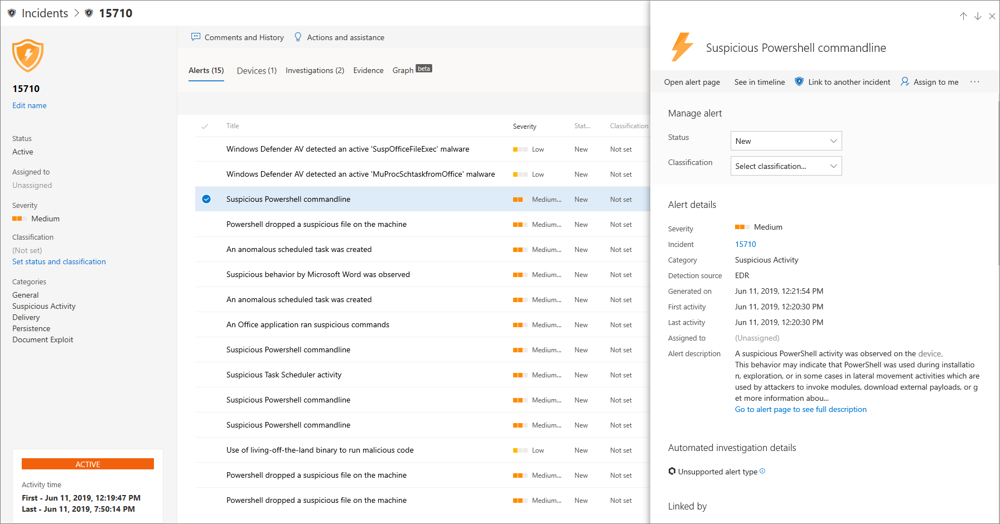

# Untersuchen von Vorfällen in Microsoft Defender für Endpunkt

[!INCLUDE [Microsoft 365 Defender rebranding](../../includes/microsoft-defender.md)]

**Gilt für:**
- [Microsoft Defender für Endpunkt](https://go.microsoft.com/fwlink/p/?linkid=2154037)
- [Microsoft 365 Defender](https://go.microsoft.com/fwlink/?linkid=2118804)

Untersuchen Sie Vorfälle, die Sich auf Ihr Netzwerk auswirken, verstehen Sie, was sie bedeuten, und sammeln Sie Nachweise, um sie zu beheben. 

Wenn Sie einen Vorfall untersuchen, sehen Sie Folgendes:
- Vorfalldetails
- Vorfallkommentare und -aktionen
- Registerkarten (Warnungen, Geräte, Untersuchungen, Nachweise, Diagramm)

> [!VIDEO https://www.microsoft.com/en-us/videoplayer/embed/RE4qLUV]

## Analysieren von Vorfalldetails 
Klicken Sie auf einen Vorfall, um den **Vorfallbereich anzuzeigen.** Wählen Sie **die Seite "Vorfall öffnen"** aus, um die Vorfalldetails und zugehörige Informationen (Warnungen, Geräte, Untersuchungen, Nachweise, Diagramm) anzuzeigen. 

### Warnungen
Sie können die Warnungen untersuchen und sehen, wie sie in einem Vorfall miteinander verknüpft wurden. Warnungen werden basierend auf den folgenden Gründen zu Vorfällen gruppiert:
- Automatisierte Untersuchung – Die automatisierte Untersuchung hat die verknüpfte Warnung ausgelöst, während die ursprüngliche Warnung untersucht wurde. 
- Dateimerkmale – Die der Warnung zugeordneten Dateien weisen ähnliche Merkmale auf.
- Manuelle Zuordnung – Ein Benutzer hat die Warnungen manuell verknüpft
- Proximate Zeit : Die Warnungen wurden innerhalb eines bestimmten Zeitrahmens auf demselben Gerät ausgelöst.
- Gleiche Datei : Die mit der Warnung verbundenen Dateien sind identisch
- Gleiche URL : Die URL, die die Warnung ausgelöst hat, ist identisch.

Sie können auch eine Warnung verwalten und Warnungsmetadaten zusammen mit anderen Informationen anzeigen. Weitere Informationen finden Sie unter [Untersuchen von Warnungen.](investigate-alerts.md) 

### Geräte
Sie können auch die Geräte untersuchen, die Teil eines bestimmten Vorfalls sind oder mit einem bestimmten Vorfall in Zusammenhang stehen. Weitere Informationen finden Sie unter [Untersuchen von Geräten.](investigate-machines.md)

### Untersuchungen
Wählen Sie **"Untersuchungen" aus,** um alle automatischen Untersuchungen anzuzeigen, die vom System als Reaktion auf die Vorfallwarnungen gestartet wurden.

## Durchgehen des Nachweises
Microsoft Defender für Endpunkt untersucht automatisch alle von den Vorfällen unterstützten Ereignisse und verdächtigen Entitäten in den Warnungen und stellt Ihnen Autoresponse und Informationen zu den wichtigen Dateien, Prozessen, Diensten und mehr bereit. 

Jede der analysierten Entitäten wird als infiziert, behoben oder verdächtig gekennzeichnet. 

## Visualisieren zugehöriger Cybersicherheitsbedrohungen 
Microsoft Defender für Endpunkt aggregiert die Bedrohungsinformationen in einem Vorfall, damit Sie die Muster und Korrelationen sehen können, die von verschiedenen Datenpunkten ausgehen. Sie können diese Korrelation über das Vorfalldiagramm anzeigen.

### Vorfalldiagramm
Der **Graph** beschreibt den Cybersicherheitsangriff. Beispielsweise wird gezeigt, was der Einstiegspunkt war, welcher Indikator für Kompromittierung oder Aktivität auf welchem Gerät beobachtet wurde. Etc.

Sie können auf die Kreise im Vorfalldiagramm klicken, um die Details der schädlichen Dateien, die zugehörigen Dateierkennungen, die Anzahl der Instanzen weltweit anzuzeigen, ob sie in Ihrer Organisation beobachtet wurde, falls ja, wie viele Instanzen es gab.

## Verwandte Themen
- [Vorfallswarteschlange](/microsoft-365/security/defender-endpoint/view-incidents-queue)
- [Untersuchen von Vorfällen in Microsoft Defender für Endpunkt](/microsoft-365/security/defender-endpoint/investigate-incidents)
- [Verwalten von Microsoft Defender für Endpunkt-Vorfällen](/microsoft-365/security/defender-endpoint/manage-incidents)
